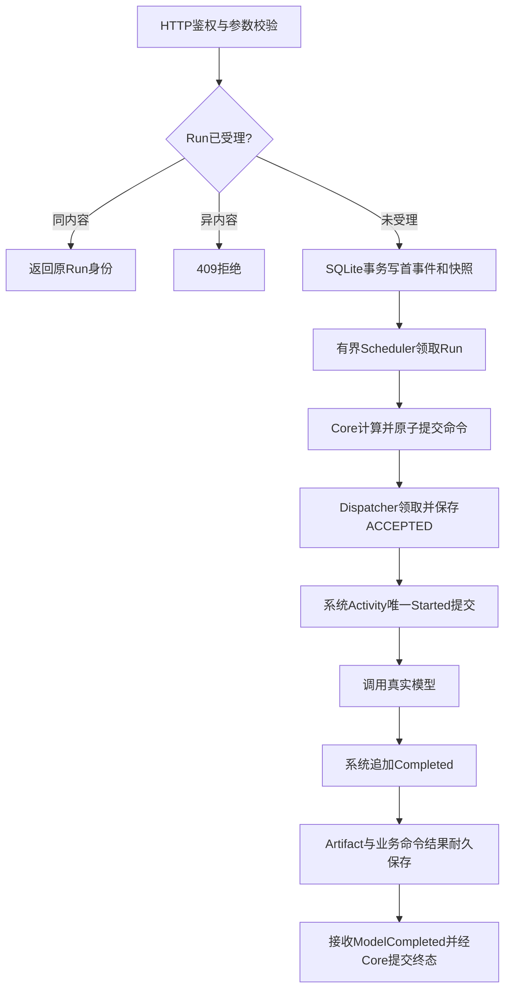
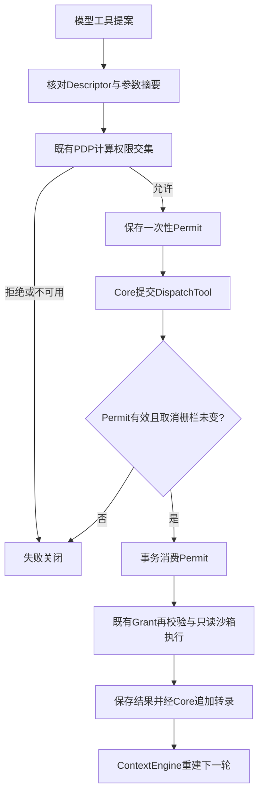
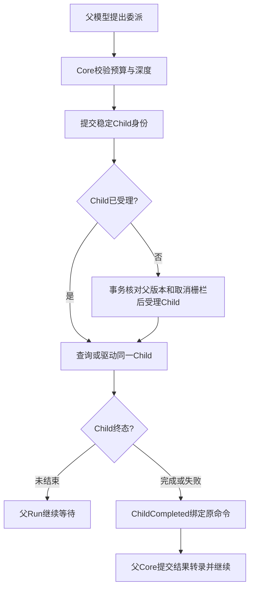
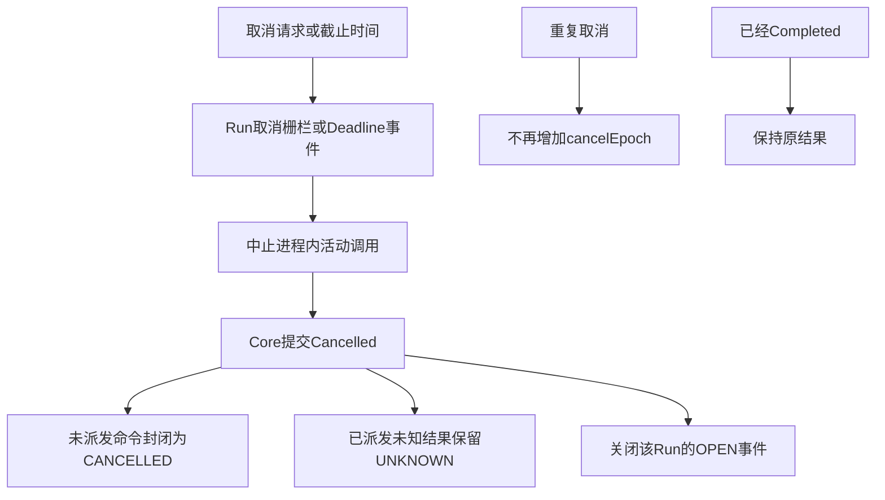
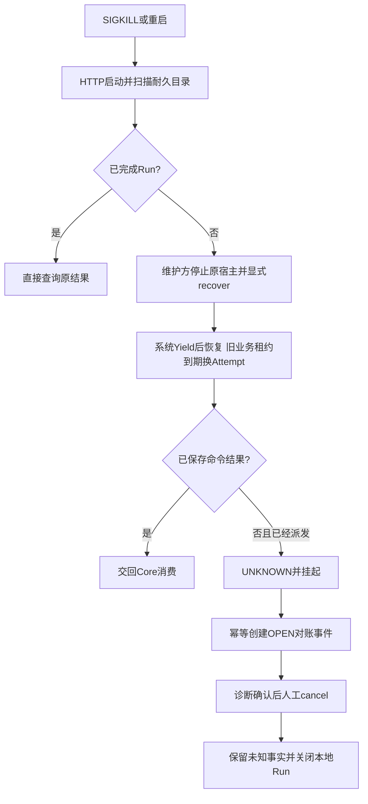

# FlowEngine本机Docker运行

本部署单元提供单租户HTTP、SQLite耐久执行、真实Pi模型调用、只读工具与单层子Run。FlowEngine系统四态与append-only Activity日志承载执行，ReActFlowHost将FE-CON-1业务状态机接到系统框架。已有内存AgentSystem入口继续保留。

## 部署

在仓库根目录执行，宿主机需有Docker、已安装的工作区依赖以及已有Pi模型配置：

```sh
FLOW_MODEL_PROVIDER=deepseek FLOW_MODEL_ID=deepseek-v4-flash \
node --import tsx packages/lawclaw-agent-kernel/scripts/deploy-flow-local.mjs --up
```

脚本从 `~/.pi/agent/models.json` 与现有认证加载器解析所选模型，凭据只写入 `.artifacts/flow-local/secrets`。不修改Pi的全局默认模型。实际模型、基础镜像和代理选择保存在该目录的 `deployment.json`，后续执行同一命令可省略环境变量。首次部署可用 `FLOW_BASE_IMAGE`、`FLOW_HTTP_PROXY` 指定镜像源和容器可达代理；宿主机的127.0.0.1代理应映射为 `http://host.docker.internal:端口`。

服务绑定 `127.0.0.1:8787`；Compose项目为 `lawclaw-flow-local`。工作区和配置只读挂载，数据写入宿主机 `data/flow.sqlite（业务）及data/flow-system.sqlite（系统追加日志）`，HTTP令牌位于 `secrets/http-token`。数据包含模型和工具正文，需要按工作区数据管理；不要提交或分享secrets/data目录。

## 自测命令

以下命令均在仓库根目录执行。客户端在进程内读取令牌，无需把令牌放入命令参数。

```sh
node packages/lawclaw-agent-kernel/scripts/flow-local-client.mjs /diagnostics
node packages/lawclaw-agent-kernel/scripts/flow-local-client.mjs /runs '{"runId":"manual-001","goal":"只回答 FLOW_OK","timeoutMs":120000}'
node packages/lawclaw-agent-kernel/scripts/flow-local-client.mjs /runs/manual-001
node packages/lawclaw-agent-kernel/scripts/flow-local-client.mjs /runs/manual-001/diagnostics
node packages/lawclaw-agent-kernel/scripts/flow-local-client.mjs /runs/manual-001/cancel '{}'
node packages/lawclaw-agent-kernel/scripts/test-flow-live.mjs
node packages/lawclaw-agent-kernel/scripts/test-flow-recovery-live.mjs
docker exec -e FLOW_CRASH_WORKER_BUNDLE=/app/flow-crash-worker.mjs lawclaw-flow-local-flow-1 node --test /app/flow-system-test.mjs
```

恢复脚本会强制终止并重启这个专用Compose服务，应在没有手工测试进行时运行。它在杀死原容器后通过一次性维护进程显式recover，再启动服务并等待旧业务租约过期；核对系统Yield、新业务Attempt与UNKNOWN。新框架不会仅凭重启擅自接管Running。容器内系统测试使用独立临时库，覆盖有向环、自环、双连接竞争、真实SIGKILL及对账回放，不访问模型或业务数据卷。真实测试使用现有模型并产生模型调用费用；离线集成测试不使用外部模型。

## HTTP契约与场景

除 `GET /healthz` 外，所有请求要求Bearer令牌。无权限401，非法JSON或未知字段400，同Run异内容409，不存在404，存储或容量不可用503。POST成功202仅表示受理；终态必须查询确认。

| 场景 | 用户及前置条件 | 主流程与验收 |
| --- | --- | --- |
| 文本回答 | 本机调用者，模型配置有效 | POST目标→持久化首事件→Core提交InvokeModel→真实模型→保存结果→Core提交Completed；同Run同内容不增加命令 |
| 读取文件 | 目标在只读挂载工作区内，配置允许该工具 | 模型产生提案→PDP→保存Permit→Core提交工具命令→消费Permit→既有PEP/沙箱/Provider→结果进入下一轮；原样返回文件内容 |
| 单层委派 | 配置允许lawclaw_delegate，子预算和深度有效 | 父Core提交CreateChildRun→按稳定Child ID受理独立Run→子模型执行→父接收ChildCompleted→父生成结果；禁止递归 |
| 取消/到期 | Run存在 | 取消持久化cancelEpoch或产生DeadlineReached→Core提交Cancelled→清理未开始命令；重复取消epoch不再次增加，终态结果不被取消覆盖 |
| 进程崩溃 | 持久目录完整 | 已完成结果保持不变；无耐久结果的模型命令不重发，维护方确认旧宿主结束并recover后，业务租约到期换Attempt，系统保持Yield，业务标记未知 |
| 异常处置 | Run处于Suspended且诊断存在OPEN事件 | 查询命令和事件→通过cancel终止本地Run→事件标为CLOSED_CANCELLED；原命令UNKNOWN事实保留，不伪造Provider成功 |











## 可观测性与容量

`/diagnostics` 返回实际模型、配置摘要、根并发上限2、已存Run数、各状态计数、进程内驱动错误数、SQLite页容量和OPEN事件数。`/runs/:id`同时返回system四态视图和业务position，system.reason=COMPLETED表示业务程序返回，业务是否成功仍读position。`/runs/:id/diagnostics`另返回systemEvents序号与事件类型，以及业务事件序号/消费状态、提交版本、Permit消费情况及事件身份，不返回模型原生消息或Grant正文。驱动与扫描失败以结构化错误码输出到容器日志。

```sh
docker compose -p lawclaw-flow-local -f .artifacts/flow-local/compose.yaml logs --since 10m flow
docker stats --no-stream lawclaw-flow-local-flow-1
```

根Run并发2，每根最多单层子Run；这是本地HTTP宿主的准入保护，不是FlowEngine的资源分配组件。业务驱动单次推进上限默认512，可通过服务启动环境FLOW_MAX_ADVANCE_STEPS注入；目录扫描和根受理上限4096，轮次/工具/输出另受配置和Core上限约束。当前没有自动删除历史数据、压测得出的吞吐保证或外部告警后端。监控应关注OPEN事件、持续驱动错误、接近Run容量上限、磁盘/WAL持续增长和容器内存；健康检查通过不代表模型可用。

## 持久化与升级

系统Schema见[SR-FE-SYS-02](../../docs/design/layers/l1-control/components/flow-system-activity.md)，仅INSERT并在UPDATE/DELETE时拒绝。旧业务数据库不是系统权威日志。业务物理Schema见 [flow-sqlite-database.ts](../../src/infrastructure/adapters/flow-sqlite-database.ts)，当前 `user_version=1`。所有键包含可信scope；Run行含version/cancel_epoch/owner/fence/claim_until；事件按Run唯一序号；提交按commit_id幂等；命令按command_id唯一；转录按event_id+ordinal唯一。

`SqliteFlowCommits` 的单个 `BEGIN IMMEDIATE` 包围校验和快照、事件消费、提交回执、命令、转录写入。摘要同键异内容拒绝。事件consumed值0待消费、1经Core提交、2被取消/Attempt切换替代，原事件仍保留。Artifact按内容摘要验证，Adapter私有消息按scope、tenant、ref不可变保存。Permit和事件属于本部署单元的本地表，不能据此宣称拥有跨系统事务。

升级前停止专用服务，备份整个data目录（包括SQLite附属文件），保留旧镜像与配置，再部署新镜像。相同Schema可打开；未知版本拒绝启动，当前没有混合版本运行或生产迁移工具。配置/模型变化使旧Run冻结的configVersion不匹配，禁止拿新配置继续其Ready轮次；需要保留旧配置处理或取消旧Run。回滚需恢复匹配的镜像、配置和完整备份，不能把旧快照覆盖到仍运行的服务。

## 验证证据与当前边界

`test-flow-live.mjs` 保存 `.artifacts/flow-local/live-report.json` 及带时间的reports文件；覆盖文本、读文件、委派、截止时间、重复取消和重复受理。`test-flow-recovery-live.mjs` 保存 `recovery-report.json`。报告必须与运行镜像和模型对应；旧报告不证明新代码通过。

离线AK-FE-019～029覆盖双连接CAS、幂等、拒绝伪造决定、Artifact和私有消息恢复、真实只读执行链、HTTP鉴权、子Run、事务故障回滚及并发驱动合并。源码职责检查记录在[重构评审](../../docs/verification/flow-runtime-review.md)。

当前是本机可信只读配置。异步人工批准、第三方有副作用工具、Provider权威查询后恢复、完整分布式RunRegistry/统一Scheduler、生产隔离与告警系统仍未交付。本地Permit消费不等于分布式PEP的首次启动协议，模型UNKNOWN不会自动重试；这些范围保留在验收清单的planned项中。

## 系统恢复维护

维护命令只用于受信本机操作。先停止原宿主，再撤销Running代次；不能在旧程序仍运行时把它当作重试按钮。

```sh
docker compose -p lawclaw-flow-local -f .artifacts/flow-local/compose.yaml stop flow
docker compose -p lawclaw-flow-local -f .artifacts/flow-local/compose.yaml run --rm --no-deps flow node flow-system-admin.mjs inspect RUN_ID
docker compose -p lawclaw-flow-local -f .artifacts/flow-local/compose.yaml run --rm --no-deps flow node flow-system-admin.mjs recover RUN_ID
docker compose -p lawclaw-flow-local -f .artifacts/flow-local/compose.yaml up -d --wait flow
```

recover只适用于Running。Started没有Completed时恢复仍会Yield；必须核验外部权威凭据后，通过flow-system-admin.mjs reconcile RUN_ID /path/receipt.json追加结果，或使用terminate明确放弃。receipt包含activity（key/name/version/input）、result、evidence；文件须由维护者准备并以只读挂载传入。它不是通用业务系统对账适配器。ReAct已消费UNKNOWN业务事件后的自动业务继续未实现，须通过专门业务恢复协议处理，不能只补系统Completed就宣称业务恢复完成。

本次版本的验收结果见[系统框架验证](../../docs/verification/flow-system-validation.md)。
