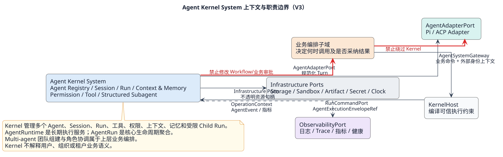
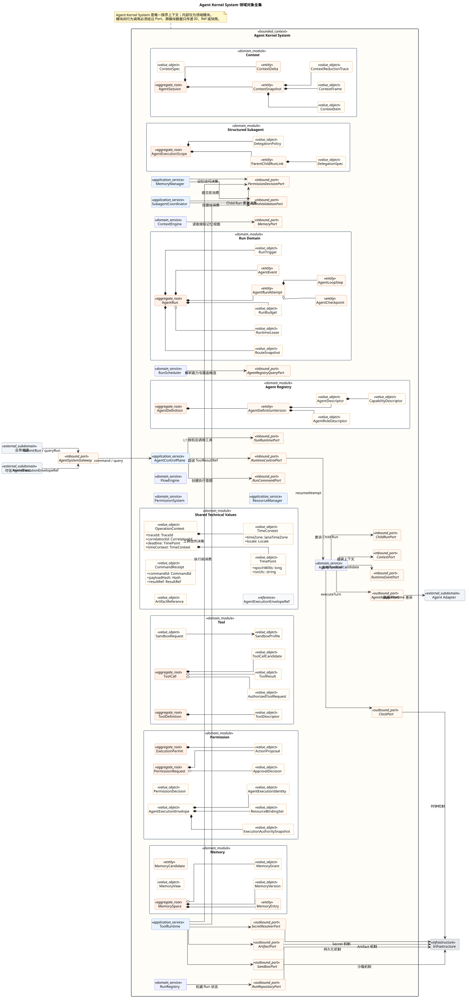
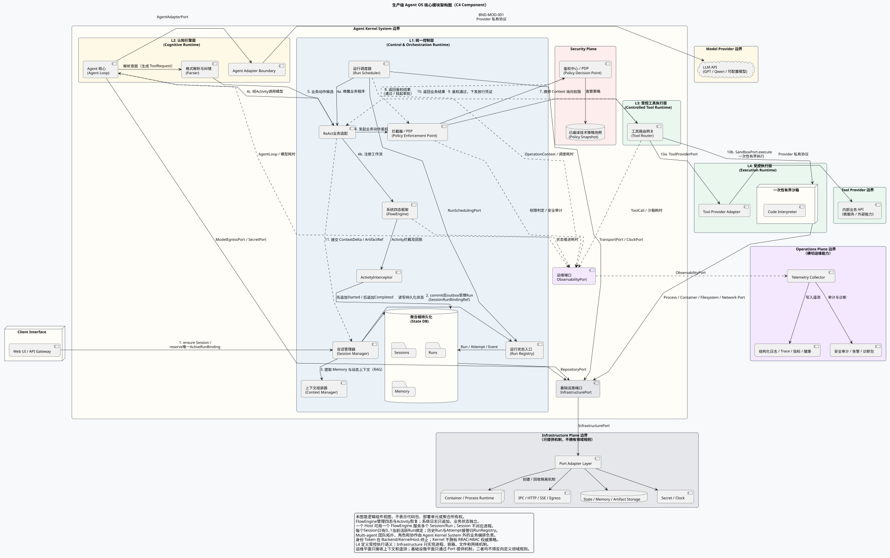
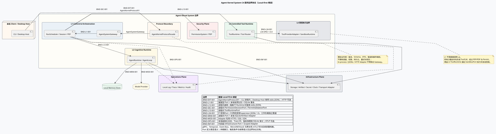
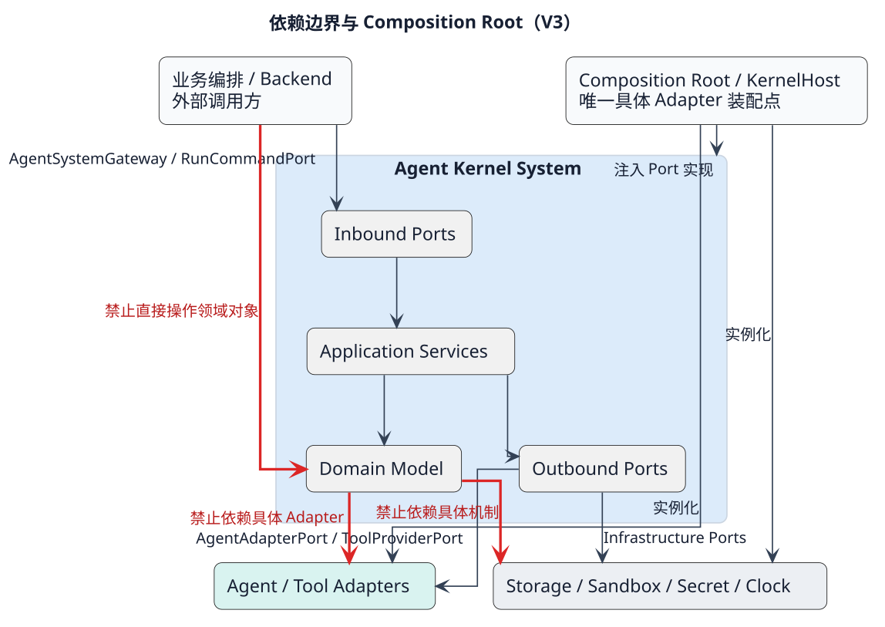

# 基于 Pi 的 LawClaw Agent Kernel System 完整设计

> 文档状态：V3.1 候选架构，五步评审步骤 1/5 重新评审
> 候选变更：`ACR-2026-0009`（基于 `ACR-2026-0008`）
> 候选基线：`AKB-2026-09-03-09`
> 日期：2026-09-03
> 实施约束：五步评审全部通过前，不修改运行代码、公共 Schema 或数据库迁移。

> [!IMPORTANT]
> 本文已按 Agent Kernel System V3 统一重写。此前设计不再构成现行架构约束；历史原因和迁移关系只在 [ACR-2026-0008](../governance/changes/ACR-2026-0008-agent-system-boundary-v3.md) 中保留。
>
> 当前步骤只批准系统职责、领域对象、边界和调用方向。完整 Port 签名、DTO、事件、错误码、状态机、DDL 和配置 Schema 必须在后续评审步骤中重新定义；旧模型的契约草案不得作为实现依据。

## 1. 文档目的与依据

LawClaw Agent Kernel System 长期管理多个 Agent 定义、Session、Run、调度、执行器、权限、工具、上下文、长期记忆和受限 Subagent。系统不是一次用户交互，也不是一个 Runtime 实例；用户请求只是 `AgentRun` 的一种触发来源。Multi-agent 的团队组建、角色、协作和仲裁由上层业务编排负责，不属于 Kernel。

本设计服从上层总体架构，不拥有业务编排、Backend 身份系统、前端投影或基础设施机制。当前对象全集和接口方向以以下资料共同为准：

- [V3.1 架构与五步评审](../governance/reviews/agent-kernel-v3.1-step1-review.md)
- [领域对象目录](reference/domain-object-catalog.md)
- [ACR-2026-0008](../governance/changes/ACR-2026-0008-agent-system-boundary-v3.md)
- [系统、层、组件与场景 PlantUML 权威源](diagrams/)
- [可编辑 Draw.io](agent-kernel-v2-review.drawio)

设计优先级为：上层总体架构 → V3 ACR 与评审结论 → 本文和正式 PlantUML → 后续契约、Schema、代码和测试。下层需要上层未授予的职责时，必须停止评审，记录冲突、影响和不扩权替代方案，等待上层决定。

### 1.1 上层约束追踪矩阵

| 约束 ID | V3 落实方式 |
|---|---|
| `UP-AGT-001` | Kernel 仅拥有 Agent 技术模型；`AgentRun` 是核心执行聚合根。 |
| `UP-AGT-002` | 业务编排位于 Kernel 外，只通过 `AgentSystemGateway` 调用。 |
| `UP-AGT-003` | Pi、ACP 等差异收敛在 `AgentAdapterPort` 下方。 |
| `UP-AGT-004` | Agent Registry 负责定义、能力匹配和技术路由快照。 |
| `UP-AGT-005` | Run、Attempt、LoopStep 和规范化 Event 分层建模。 |
| `UP-AGT-006` | Scheduler 统一调度 Root 和 Child Run；上层 Multi-agent 参与者也只表现为普通 Run。 |
| `UP-AGT-007` | 取消、Lease、恢复和未知副作用采用失败关闭规则。 |
| `UP-AGT-008` | Kernel 不拥有 Workflow、业务 Conversation 或业务审批。 |
| `UP-AGT-009` | Subagent 采用结构化生命周期和父级约束子集。 |
| `UP-AGT-010` | Multi-agent 团队拓扑、角色和协调策略由上层业务编排拥有；Kernel 只提供通用 Run/Session/Child Run 原语。 |
| `UP-CTX-001` | ContextThread 只关联 Root Run，不拥有 Run。 |
| `UP-CTX-002` | ContextFrame 是有界、可解释的执行投影。 |
| `UP-CTX-003` | 长期 MemorySpace 独立建模，并以授权视图进入上下文。 |
| `UP-TOOL-001` | 所有工具调用统一经过 L1 PEP、L3 ToolExecutionGuard 与 L4 受控执行边界。 |
| `UP-DEL-001` | Child Run 只能通过 Scheduler 创建且不得成为孤儿。 |
| `UP-DAT-001` | 聚合独立提交，事件持久化后发布并支持补拉去重。 |
| `UP-SEC-001` | Host 编译执行信封；Kernel 只消费最小技术身份和权限快照。 |
| `UP-RES-001` | 队列、预算、上下文、工具输出、子 Run 和并发均有界。 |
| `UP-OBS-001` | OperationContext、日志、Trace、指标和健康横切所有执行路径。 |
| `UP-INF-001` | 存储、进程、通信、沙箱、Secret 和时钟只经 Port 使用。 |
| `UP-INF-002` | Infrastructure 只提供机制，不定义 Agent 路由和业务规则。 |
| `UP-DEP-001` | Kernel Core 不导入 Pi、Bun、SQLite、HTTP 或具体 Adapter。 |
| `UP-DEP-002` | 具体 Adapter 只允许在 Composition Root 实例化。 |
| `UP-DEP-003` | 跨子域行为调用必须经过明确 Port，循环依赖为零。 |

## 2. 目标与非目标

### 2.1 目标

- 通过稳定的 `AgentSystemGateway` 接收执行意图，隔离 Pi、ACP 和未来 Runtime 差异。
- 将 `AgentRun` 建模为核心执行聚合根，统一 Root 和 Child Run 的技术生命周期。
- 由 `RunScheduler` 管理队列、预算、并发、Deadline、Lease、技术重试和 Runtime 派发。
- 由可重建的 `AgentRuntime` 执行已派发 Attempt，不让 Runtime 拥有调度或 Run 权威状态。
- 由 `ContextEngine` 管理工作上下文，由 `MemoryManager` 管理长期记忆权威状态。
- 由 Security Plane 的 `PermissionDecisionEngine` 对受保护动作执行 `Allow / Ask / Deny` 判定，并按 `ExecutionPermit` 组件不变量签发一次性授权。
- 由 L3 `ToolCallRuntime` 提供版本化、可扩展且经过权限和 L4 执行约束的工具入口。
- 用结构化并发管理受限 Subagent；由上层业务使用通用 Run/Session 接口组建 Multi-agent。
- 通过 Port 隔离 Adapter、存储、Artifact、进程、沙箱、网络、Secret、时钟和观测机制。

### 2.2 非目标

Agent Kernel System 明确不拥有或解释：

- `WorkflowInstance`、`WorkflowStep`、业务状态机、业务补偿和结果采纳；
- 业务 `Conversation`、业务 Message 和前端投影权威状态；
- 用户认证、Tenant Resolver、Backend RBAC、组织结构和业务角色；
- 业务 `ApprovalCase`、审批人选择、通知和业务审批策略；
- Multi-agent 团队拓扑、角色分配、通信协议、仲裁和终止策略；
- 法律或其他业务规则；
- 容器、进程、数据库、文件系统、网络、Secret 和时钟的具体实现；
- Pi、ACP 或未来 Runtime 的原生 Session、Message、Event、Tool 和 Provider 类型。

## 3. 核心术语

| 术语 | 定义 |
|---|---|
| Agent Kernel System | 管理 Agent 技术运行的唯一限界上下文；不是巨型事务聚合。 |
| AgentDefinition | 可版本化的 Agent 定义聚合根，声明能力、角色模板和可路由描述。 |
| AgentRun | 核心执行聚合根；从执行意图被接受到成功、失败、取消、超时或安全中断。 |
| AgentRunAttempt | Run 内的一次物理执行尝试；由有效 Runtime Lease 启动。 |
| AgentLoopStep | Attempt 内严格排序的一次模型、工具、上下文、记忆或委派步骤。 |
| AgentRuntime | 可重建执行领域服务；连续执行多个已派发 Run，但不拥有 Run。 |
| AgentSession | 持久化技术会话档案；保存上下文增量、Artifact 引用、版本和可选分支血缘，不是进程，也不复制 Run 状态。 |
| AgentExecutionScope | Root/Child 执行树聚合根，约束 Join、Cancel、移交和预算继承。 |
| FlowEngine | 无状态的 Run 推进算法；读取 Run/Session 快照，计算下一动作并通过 Port 提交。 |
| ResourceManager | 进程级资源协调器；管理有界队列、执行槽和临时资源预算，不解释业务优先级。 |
| ContextEngine | 组装、裁剪、摘要并冻结当前模型调用工作上下文的领域服务。 |
| MemoryManager | 管理长期 MemorySpace、版本、授权视图和候选写入的应用服务。 |
| PermissionDecisionEngine | 受保护动作的统一决策点；返回 Allow、Ask 或 Deny，不执行动作。 |
| ExecutionPermit | 绑定动作、资源、Run、Agent、授权版本和有效期的一次性执行授权。 |
| ToolCallRuntime | L3 工具调用状态协调入口；在 Guard 消费 Permit 后选择 L4 Provider 或 Sandbox 路径并归一化结果。 |
| AgentAdapter | 屏蔽 Pi 等执行实现差异的出站 Port；原生类型不得越界。 |
| KernelHost | Kernel 外部可信装配边界；解释用户、租户和 RBAC，构造执行信封和 Scoped Adapter。 |

## 4. 总体职责边界

业务编排是业务用例的权威协调者，Agent Kernel System 是技术执行子系统：



1. Backend 完成认证、RBAC 和租户解析。
2. KernelHost 将外部身份、资源边界和策略编译为 `AgentExecutionEnvelope`。
3. 业务编排决定为什么、何时发起 Agent 执行。
4. `AgentSystemGateway` 接收不含 Tenant/RBAC 业务语义的规范化意图。
5. Kernel 创建和调度 Run，执行上下文、工具、记忆与委派策略。
6. Kernel 返回规范化事件和候选结果，不修改 Workflow。
7. 业务编排决定是否采纳结果以及如何改变业务权威状态。

Kernel 对“如何安全地组织和执行 Agent 工作”负责；业务编排对“为何执行、何时执行、结果是否生效”负责。

## 5. 领域对象与聚合边界




对象的稳定 ID、唯一状态所有者、调用方和 Port 映射见[领域对象目录](reference/domain-object-catalog.md)。核心关系为：

```text
Agent Kernel System（限界上下文）
├── AgentDefinition（聚合根）
├── AgentRun（核心聚合根）
│   └── AgentRunAttempt（实体）
│       └── AgentLoopStep（实体/事件投影）
├── AgentExecutionScope（聚合根）
├── PermissionRequest（聚合根）
├── ExecutionPermit（聚合根）
├── ToolDefinition（聚合根）
├── ToolCall（聚合根）
├── MemorySpace（聚合根）
├── AgentSession（技术会话聚合根）
└── 可重建领域/应用服务
```

系统限界上下文不是聚合根。每个聚合独立保护不变量，通过 Port、稳定引用和事件协作，不能用一个巨型事务同时锁定 Run、权限、工具、记忆和团队状态。

细节采用“总设计 → C4 层设计 → 层内组件设计”三级结构维护。七个层级入口是 [L1 Control](layers/l1-control/README.md)、[L2 Cognitive](layers/l2-cognitive/README.md)、[Security Plane](layers/security-plane/README.md)、[L3 Tool Runtime](layers/l3-tool-runtime/README.md)、[L4 Execution Runtime](layers/l4-execution-runtime/README.md)、[Operations Plane](layers/operations-plane/README.md)和[Infrastructure Plane](layers/infrastructure-plane/README.md)。本节只保留全局聚合关系，不重复维护组件算法或跨层契约。

### 5.1 AgentRun、Attempt 与 Step

`AgentRun` 独立保护执行状态、冻结路由、预算、取消、终态和 Attempt 序列。它不属于 Runtime 或 Session；`AgentLoopStep` 也不是顶层聚合。首版本地执行不强制 Lease/Fence，多 Worker 档案才启用租约隔离。生命周期与提交规则见 [RunRegistry](layers/l1-control/components/run-registry.md)，调度见 [RunScheduler](layers/l1-control/components/run-scheduler.md)，认知执行见 [AgentRuntime/AgentLoop](layers/l2-cognitive/components/agent-runtime-loop.md)。

### 5.2 AgentSession

`AgentSession` 是持久化技术会话聚合根，关联多个 Run，保存上下文增量、消息/观察记录、Artifact 引用、版本和可选父 Session 引用，但不拥有 Run 状态，也不对应进程。详细职责见 [SessionManager](layers/l1-control/components/session-manager.md)；Context 与 Memory 分别由 [ContextEngine](layers/l1-control/components/context-engine.md)和[MemoryManager](layers/l1-control/components/memory-manager.md)维护。

### 5.3 独立安全与资源聚合

`PermissionRequest`、`ExecutionPermit`、`ToolCall`、`MemorySpace` 和 `AgentExecutionScope` 具有独立生命周期和并发边界，不能降为 Runtime、Session 或 Run 内的普通值对象。详细不变量分别由 [Security Plane](layers/security-plane/README.md)、[L3 Tool Runtime](layers/l3-tool-runtime/README.md)、[MemoryManager](layers/l1-control/components/memory-manager.md)和[SubagentCoordinator](layers/l1-control/components/subagent-coordinator.md)维护。

## 6. 系统服务 C4 组件协作



[查看 PlantUML 权威源](diagrams/system/05-system-service-collaboration.puml)

该图是逻辑组件视图，用于描述请求、认知、安全决策和受控执行之间的 High Level 协作，不要求图中组件与代码包、进程、聚合根或部署单元一一对应。为防止抽象名词在工程实现中扩大职责，采用以下规范化映射：

### 6.1 抽象组件到工程实现的映射

| C4 抽象组件 | V3 工程映射 | 边界与数据所有权解释 |
|---|---|---|
| Web UI / API Gateway | Backend、KernelHost、`AgentSystemGateway` | Token 在 Backend/KernelHost 终止并被解释；Kernel 只接收 `AgentExecutionEnvelopeRef` 及最小技术上下文。 |
| Workflow Engine | `FlowEngine` + `RunScheduler` | 无状态推进 AgentRun 技术状态；不保存业务 Workflow、Session/Run 权威状态、业务补偿或结果采纳。 |
| Session Manager | `AgentSession` Repository/Application Service | 管理持久上下文、Artifact 索引、版本锁和可选分支血缘；Session 不是进程，Run 状态仍由 AgentRun 拥有。 |
| Context Manager | `ContextEngine` + `MemoryQueryPort` | 组装有界 `ContextFrame`；长期记忆的权威状态仍由 `MemoryManager` 管理。 |
| State DB / Sessions / Memory | Run、Context、Memory Repository Port 的逻辑持久化视图 | 图中的单一 DB 只表示持久化能力；各聚合仍独立提交，数据库实现不能反向定义领域所有权。 |
| Agent Core / Agent Loop | `AgentRuntime` + `AgentLoopStep` + `AgentAdapterPort` | Runtime 执行已派发 Attempt；Run 权威状态和 Lease 仍由 Run Domain/Scheduler 管理。 |
| Parser | Adapter 私有协议解析与 Kernel 规范化层 | 将模型输出转为规范化动作候选；Pi/模型原生类型不得越过 `AgentAdapterPort`。 |
| Model Provider | `AgentAdapterPort` 后的外部模型能力 | `AgentAdapterPort` 是 Kernel 唯一公共模型边界；`ModelInvocationPort` 只允许作为 Pi Adapter 私有接口。 |
| PEP | L1 前置 PEP + L3 `ToolExecutionGuard` | L1 请求 PDP 决策；真实副作用前的 Guard 只校验并消费 Permit，不进行第二次策略裁决。 |
| PDP / Policy DB | `PermissionDecisionEngine` + `PolicySnapshotPort` + KernelHost 外部策略源 | Kernel 依据已编译策略快照做技术判定，不解释 Tenant、User、RBAC 或业务审批政策。 |
| Tool Router | `ToolCallRuntime` + `ToolCatalogRouter` + `ToolExecutionGuard` | 只接受获授权的工具请求，负责技术路由、执行协调和结果归一化，不自行扩大权限。 |
| Internal API / Sandbox | L4 `ToolProviderAdapter` 与 `SandboxRuntime` | L4 定义受控执行语义；Infrastructure 只提供进程、容器、文件和网络机制。 |
| 黑板 | `ContextFrame` + `AgentEvent` 投影 | 是执行过程中的可重建协作投影，不新增共享可变聚合，也不替代长期 MemorySpace。 |
| Operations Plane | `ObservabilityPort` + 外部 Telemetry/运维平台 | Kernel 传播 `OperationContext` 并产生日志、Trace、指标、健康和安全审计；运维平台不得反向修改领域状态或参与权限裁决。 |
| Infrastructure Plane | `InfrastructurePort` 族 + Container、Transport、Storage、Secret、Clock Adapter | 只提供进程、通信、存储、出口、密钥和时钟机制；不得包含 Agent 路由、业务编排或权限规则。 |

这张映射表是 C4 抽象名词的规范解释。若图中的简化表达与领域类图发生歧义，以领域对象所有权、Port 方向和本表为准；不得仅凭图中的空间包含关系推导代码依赖或事务边界。

### 6.2 系统、运维与基础设施边界

| 边界 | 允许进入 | 允许输出 | 禁止行为 |
|---|---|---|---|
| Agent Kernel System | 规范化执行意图、执行信封引用、外部审批决定、基础设施能力 | Run 状态、规范化事件、候选结果、ActionProposal、遥测 | 解释 Token/Tenant/RBAC、直接操作基础设施、修改业务 Workflow |
| Model Provider / Tool Provider | 模型请求经 `AgentAdapterPort` 下的 Adapter 私有边界，工具请求经 `ToolProviderPort` | 模型响应、工具结果和 Provider 健康 | 访问 Kernel 聚合、签发 Permit、修改 Run 或绕过资源约束 |
| Operations Plane | `OperationContext`、脱敏日志、Span、指标、健康和审计事件 | 告警、诊断查询结果、可观测性确认 | 直接改变 Run、Permit、ToolCall 或 Memory 权威状态 |
| Infrastructure Plane | 通过 Port 提交的机制请求与不透明资源 Handle | 容器、进程、传输、存储、出口、Secret 和时钟结果 | 定义 Agent 路由、业务规则、权限策略或多 Agent 协调规则 |

依赖方向必须保持为 `Kernel → Port → Adapter/平台`。运维和基础设施可以返回机制结果或健康状态，但不能调用 Kernel 内部对象推进领域状态；需要触发恢复或调度变化时，只能产生规范化信号，由 ControlPlane/Scheduler 重新判定。

### 6.3 层间协议与接口候选



[查看 PlantUML 权威源](diagrams/contracts/12-c4-boundary-protocols.puml)

边界文档入口见[边界契约导览](contracts/README.md)，Local-first 绑定和故障语义见[契约语义](contracts/contract-semantics.md)；对外稳定外观见 [Protocol Facade](layers/l1-control/components/protocol-facade.md)，Transport 机制见 [Transport Adapter](layers/infrastructure-plane/components/transport.md)。主文档只约束调用方向、数据所有权和安全不变量，不重复维护协议细节。

| 服务 | 职责 | 明确不负责 |
|---|---|---|
| AgentKernelProtocolFacade | 版本协商、协议校验、DTO/错误/事件机械映射和 Transport Adapter 统一入口 | 调度、持久化、权限、重试、恢复和直接调用内部 Adapter |
| AgentSystemGateway | 对外提供 Run、事件和 Agent 入口 | HTTP、认证、租户解析、业务 Workflow 和 Multi-agent 团队入口 |
| AgentRegistry | 管理 AgentDefinition、Capability 和路由候选 | 业务优先级、具体 Adapter 创建 |
| RunRegistry | Run 查询、状态入口、幂等回执和 Lease 协作 | 能力定义和业务调度 |
| RunScheduler | 队列、并发、预算、Deadline、Lease、技术重试和派发 | 业务流程顺序和结果采纳 |
| FlowEngine | 读取 Run/Session 快照并计算下一技术动作 | 保存权威状态、设计业务工作流 |
| ResourceManager | 执行准入、执行槽和临时资源预算 | 可运行队列、业务优先级和 Run 状态迁移 |
| RuntimePool | Worker 容量、隔离和健康 | Run 权威状态 |
| AgentRuntime | 执行已派发 Attempt 的 Agent Loop | 系统调度、身份解释、直接资源访问 |
| ContextEngine | 工作上下文组装、预算、裁剪、摘要和冻结 | 长期记忆权威状态、业务 Conversation |
| MemoryManager | 长期记忆空间、版本、授权视图和候选提交 | 无条件共享或直接覆盖 Context |
| PermissionDecisionEngine | ActionProposal 判定与 Ask 技术请求 | 审批人选择、Permit 消费和受保护动作执行 |
| ToolCallRuntime | ToolDefinition、ToolCall、Guard 调用和 L4 协调 | PDP 权限裁决、Permit 签发、Sandbox 机制和基础设施实现 |
| SubagentCoordinator | Parent/Child Run 的 Fork、Join、Cancel 和级联收敛 | Multi-agent 团队组建、角色、仲裁和业务结果采纳 |
| AgentAdapter | Pi/未来 Runtime 私有类型映射和规范化事件 | Kernel 策略、权限、工具和记忆决策 |

## 7. AgentSession、调度、FlowEngine 与 Runtime

`AgentSession` 是持久化技术档案，不是一进程；`AgentRun` 是执行聚合根；`FlowEngine` 是无状态推进算法；`AgentRuntime` 是可重建执行服务。所有 Root 和 Child Run 都经统一 Scheduler。首版使用一个 Host 进程、一个 FlowEngine、一个本地有界队列和若干执行槽；Lease/Fence 只属于多 Worker 部署档案。

对象关系、Session 分支、进程模型和资源开销从[L1 层设计](layers/l1-control/README.md)进入对应组件；L2 执行生命周期见[L2 层设计](layers/l2-cognitive/README.md)。

## 8. 身份、租户与执行信封

Runtime 需要执行身份和资源权限，但纯 Kernel 不解释用户或租户领域。KernelHost 把外部身份、权限和资源范围编译为 `AgentExecutionEnvelope`；Kernel 聚合只保存稳定的 `AgentExecutionEnvelopeRef` 和必要审计摘要。

Envelope 的权限求交、资源 Handle 和执行点约束见[Security Plane](layers/security-plane/README.md)与[公共契约元数据](contracts/common-metadata.md)。纯 Kernel 领域对象和 Runtime 状态中仍禁止加入 Tenant、User、组织或 RBAC 业务字段。

## 9. 权限与外部审批

`PermissionDecisionEngine` 是统一技术决策点，返回 Allow、Ask 或 Deny；`ExecutionPermit` 是唯一能够触发受保护动作的一次性授权制品。外部审批只能批准或缩小原 `ActionProposal`，Kernel 不拥有业务 ApprovalCase。

决策与执行点分离、Permit 生命周期、审批桥和故障关闭规则见[Security Plane](layers/security-plane/README.md)。

## 10. 工具扩展与沙箱

`ToolCallRuntime` 是工具调用状态协调入口，工具通过版本化 `ToolDefinition` 与 `ToolDescriptor` 扩展。Candidate 不能直接进入 Provider，Sandbox 和 Secret 机制也不能绕过 Permit。

ToolCall 聚合、合法调用链、取消和未知副作用规则见[L3 Tool Runtime](layers/l3-tool-runtime/README.md)；Provider 与 Sandbox 受控执行语义见[L4 Execution Runtime](layers/l4-execution-runtime/README.md)。

## 11. 上下文与长期记忆

`AgentSession` 是技术会话聚合根；`MemorySpace` 是独立长期记忆聚合根；`ContextFrame` 只是一次模型调用的不可变投影。Agent 只能提交 `MemoryCandidate`，不能直接覆盖共享记忆。

上下文组装与归约追踪见 [ContextEngine](layers/l1-control/components/context-engine.md)；MemoryView、共享范围和候选写入见 [MemoryManager](layers/l1-control/components/memory-manager.md)。

## 12. Subagent 与上层 Multi-agent 边界

Subagent 是受 `AgentExecutionScope` 管理的 Child Run，属于 Kernel 的结构化执行能力。Multi-agent 团队由上层业务编排使用多个 Run/Session 组建；Kernel 不拥有 Team、Participant、RoleAssignment、CoordinationPolicy 或团队仲裁。

父子生命周期、可选 Child Session、预算/权限继承和孤儿防护见 [SubagentCoordinator](layers/l1-control/components/subagent-coordinator.md)。上层共享记忆仍必须使用显式 MemoryView/Grant，不因 Multi-agent 组建方式而放宽权限。

## 13. 数据、一致性与韧性原则

当前步骤不冻结数据库表和状态机，但后续设计必须满足：

- 每个聚合只有一个权威状态提交入口；
- Run、Attempt、Lease、Event、PermissionRequest、Permit 消费、ToolCall 和 Memory 有独立事务边界；
- 事件先持久化再发布，单 Run 序号严格递增，订阅支持补拉和去重；
- 幂等命令保存 payload digest，相同键异载荷冲突；
- Route、Authority、Context 和 Memory Snapshot 不被新版本静默改写；
- 同一 Run 同时有效 Lease 不超过一个，旧 Runtime 写入被拒绝；
- 未知副作用、缺失安全恢复点或失效 Permit 禁止自动重放；
- 基础设施分区键可含租户，但纯 Kernel 不解释租户字段。

Runtime 故障不等于 Run 必然终止。只有安全 Checkpoint、已知副作用、有效授权和版本兼容同时满足时，Scheduler 才能为同一 Run 创建新 Attempt。恢复保持 Run ID 并创建新 Attempt；业务重新发起意图则创建新 Run。

取消先停止新模型、工具、记忆和 Child 动作，再传播到活动执行。Run 队列、事件订阅、上下文、工具输出、重试、子 Run 和 Runtime 并发都必须有界。

前端流式 UI 不是权威状态。断线后以前端已确认 sequence 补拉；Backend/业务编排以 Kernel Run 快照、事件和自身业务版本判断是否采纳结果。

## 14. Port 与依赖规则

层间协议和第一批关键接口仍是步骤二候选，文档入口见[边界契约导览](contracts/README.md)，具体语义以对应 `BND-*` 文档为准。当前步骤一只冻结调用方向：



[查看 PlantUML 权威源](diagrams/system/03-dependency-boundaries.puml)

| 调用方 | Port | 实现/被调用方 | 权威数据 |
|---|---|---|---|
| 业务编排/KernelHost | AgentSystemGateway | AgentSystemGateway | 无；协调 Registry、Session 与 Run 用例 |
| AgentSystemGateway | AgentRegistryQueryPort | AgentRegistry | AgentDefinition |
| AgentSystemGateway | SessionCommandPort / SessionQueryPort | SessionManager | AgentSession |
| AgentSystemGateway/SubagentCoordinator | RunSchedulerPort | RunScheduler | 可重建调度投影；Run 仍归 RunRegistry |
| RunScheduler/RuntimePool | RuntimeControlPort | L2 AgentRuntime | Run 仍归 RunRegistry |
| AgentRuntime | RuntimeEventPort | L1 RunRegistry | 规范化事件、ToolCallCandidate、ChildRunCandidate |
| L1 PEP Enforcement | PermissionDecisionPort | PermissionDecisionEngine | PermissionRequest/Permit |
| L1 PEP Enforcement | ToolRuntimePort | L3 ToolCallRuntime | ToolDefinition/ToolCall |
| L1 SubagentCoordinator | ChildRunPort / RunSchedulerPort | RunScheduler | AgentExecutionScope/Child Run |
| L3/L4、Memory、Delegation、Secret、Artifact 执行点 | PermitValidationPort | ExecutionPermit 组件 | ExecutionPermit 消费状态 |
| PermissionDecisionEngine | ApprovalRequestPort | Backend/业务审批边界 | 外部 ApprovalCase |
| Backend/业务审批边界 | ApprovalDecisionPort | ApprovalBridge / PermissionDecisionEngine | PermissionRequest |
| ContextEngine | MemoryQueryPort | MemoryManager | MemorySpace |
| ToolExecutionGuard | ToolProviderPort / SandboxPort | L4 Execution Runtime | 受控执行结果 |
| L4 Execution Runtime | Process/Container/Secret/Artifact Port | Infrastructure | 基础设施机制 |
| AgentRuntime | AgentAdapterPort | Pi/未来 Adapter | Adapter 私有状态 |

跨模块行为调用必须经过 Port；跨模块对象只保存 ID、Ref、Snapshot 或 Handle。Kernel Core 不导入 Pi、Bun、SQLite、HTTP 或具体 Adapter；具体 Adapter 只在 Composition Root 实例化；Infrastructure 不反向定义路由、权限或业务规则。

## 15. Pi Adapter、运维与基础设施

Pi 位于 `AgentAdapterPort` 下方，不与 Gateway、Scheduler 或 Runtime 并列。可复用其模型 Provider、流式事件、工具调用原语、Abort、Session/Context 原语和 Agent Loop 参考实现；Kernel/Adapter 补齐 Definition、Session、Run/Attempt、Context/Memory、Permission/Permit、L3 ToolCallRuntime 和受限 Child Run 生命周期。

Pi 是否托管某段循环属于 Adapter 能力档案，不能改变 Kernel 对 Run、权限、工具、记忆和调度的所有权。Pi 原生委派不能绕过 Scheduler。

`OperationContext` 跨 Port 传播 Trace、Correlation、Causation、Deadline 和 `TimeContext`。领域时间只通过 Clock Port 获取：绝对时间用 UTC，日历解释用显式 IANA 时区。日志和诊断包不得记录 Key、Prompt 正文、完整输出、工具参数、Memory 内容或物理资源路径。

Container、Process、Transport、Storage、Artifact、Egress、Secret 和 Clock 都由 Infrastructure Port 提供机制；Sandbox 的受控执行语义属于 L4，不能下沉为通用基础设施规则。详细边界分别见[Operations Plane](layers/operations-plane/README.md)、[Infrastructure Plane](layers/infrastructure-plane/README.md)、[L4 Execution Runtime](layers/l4-execution-runtime/README.md)和[Local-first 部署档案](deployment/local-first-profile.md)。

## 16. 架构图与变更治理

正式 PlantUML 按文档层级组织：

1. [系统视图](diagrams/system/)：Context、Container、领域对象全集和全局依赖。
2. [七层 C4 Component 视图](diagrams/layers/)：每层组件与跨层 Port。
3. [组件视图](diagrams/components/)：组件内部类、状态和生命周期。
4. [跨层场景](diagrams/scenarios/)：启动、审批、工具执行、取消和事务顺序。
5. [边界协议](diagrams/contracts/)与[部署视图](diagrams/deployment/)。

`.puml` 是正式图形内容权威源；Draw.io 仅作为历史评审和人工调整画布。本轮不把领域图批量导入 Draw.io，也不以 Draw.io 页面状态替代 PlantUML 语法、边界和预览校验。未来若需要导入，必须使用 PlantUML“绘图”模式生成原生矢量节点，禁止嵌入 SVG。

对象改名、聚合拆分、Port 方向或安全不变量变化必须刷新 ACR、对象目录、PlantUML、本文和评审文档；只有当本次变更实际维护 Draw.io 评审页时，才要求同步刷新 Draw.io。对应门禁通过并获得步骤五批准后才可修改代码和 Schema。

## 17. 五步评审与门禁

| 步骤 | 主题 | 通过条件 | 状态 |
|---|---|---|---|
| 1 | 系统职责、边界与核心对象 | Session/Run/Loop/FlowEngine、Subagent 与上层 Multi-agent 边界明确 | **因 ACR-2026-0009 重新评审** |
| 2 | 接口与数据契约 | 每条调用有唯一接口、中文语义、DTO、错误码和数据所有者 | 进行中：层间协议候选待确认 |
| 3 | 生命周期、数据流与韧性 | 调度、暂停、恢复、取消、背压和无孤儿规则闭合 | 未开始 |
| 4 | 安全与架构一致性 | 无旁路、无权限升级、无共享记忆越权 | 未开始 |
| 5 | 基线批准与代码授权 | 用户明确批准迁移与测试计划 | 未开始 |

步骤一门禁：

- Agent Kernel System 是唯一限界上下文；`AgentRun` 是核心执行聚合根；
- Runtime 是可重建服务，不拥有 Run、Session、Tenant 或权限权威状态；
- ContextThread 只关联 Root Run；CapabilityDescriptor 有完整消费链；
- PermissionDecision 为 Allow/Ask/Deny，实际执行只接受 ExecutionPermit；
- Ask 通过 ApprovalRequest/Decision Port 异步处理；
- Runtime 绕过 Scheduler、工具绕过 Permission、Agent 直接写共享记忆的路径为零；
- Parent 终态后活动 Child 和游离 Child Run 路径为零；Kernel 内 Multi-agent Team/Participant/Role 类型数量为零；
- Kernel 对象与 Port 中 Tenant、User、RBAC、Workflow、业务 Conversation 和 ApprovalCase 字段为零；
- 所有跨模块调用经过 Port，循环依赖和具体机制泄漏为零；
- 本文不含 ACR-2026-0007 旧模型的规范性接口、Schema、DDL、事件或错误码。

## 18. 后续评审预留

| 待建模项 | 步骤 | 当前默认安全行为 |
|---|---:|---|
| Port 完整签名、DTO、JSON Schema、事件和错误码 | 2 | 未定义能力不可调用 |
| Run/Attempt/Lease/Step 状态机 | 3 | 状态不明时停止并审计 |
| PermissionRequest 与 Permit 消费/撤销/过期 | 3、4 | Permit 无法完整验证时拒绝 |
| ToolCall 等待审批、恢复和取消 | 3、4 | 不重放未知副作用 |
| ExecutionScope 深度和受控移交协议 | 3、4 | 无有限预算或父级约束时拒绝 |
| 上层 Multi-agent 组合与 Kernel 通用 Run/Session 的衔接 | 2、3 | Kernel 不增加 Team/Role/仲裁领域对象 |
| Memory 版本、Grant、Candidate 和冲突策略 | 2、3、4 | 无授权视图不读，无 Permit 不写 |
| DDL、事务、CAS、Lease/fence 和迁移 | 3 | 不使用旧 DDL |
| YAML、SecretHandle 和 Pi 能力档案 | 2、4、5 | 关键配置缺失或明文 Secret 时失败关闭 |

当前仍停留在步骤一；`contracts/` 中的层间协议只作为步骤二候选输入。步骤一重新确认后，再评审完整 DTO、事件和错误码目录；步骤二整体通过前不得进入生命周期、数据流和韧性设计确认。

系统级风险和测试评审使用 [System SFMEA 与系统测试用例清单](../verification/system-sfmea.md)。该清单当前只作为步骤二/三的前置评审输入，不代表测试已经实现或步骤三已经开始。
