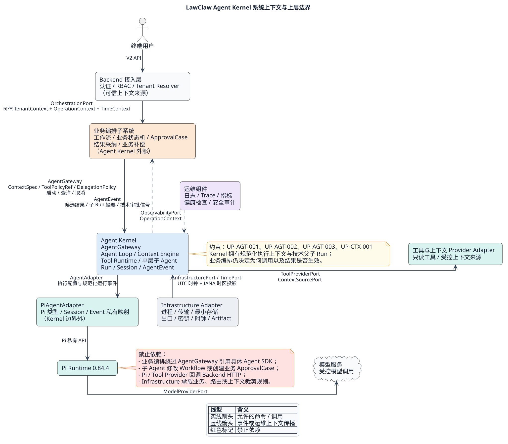
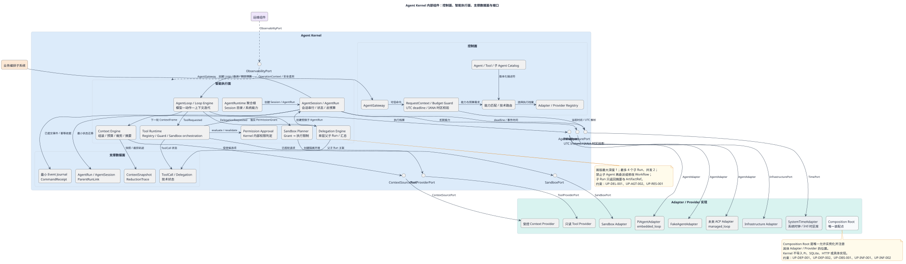
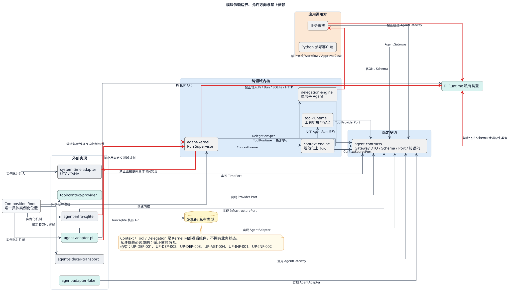
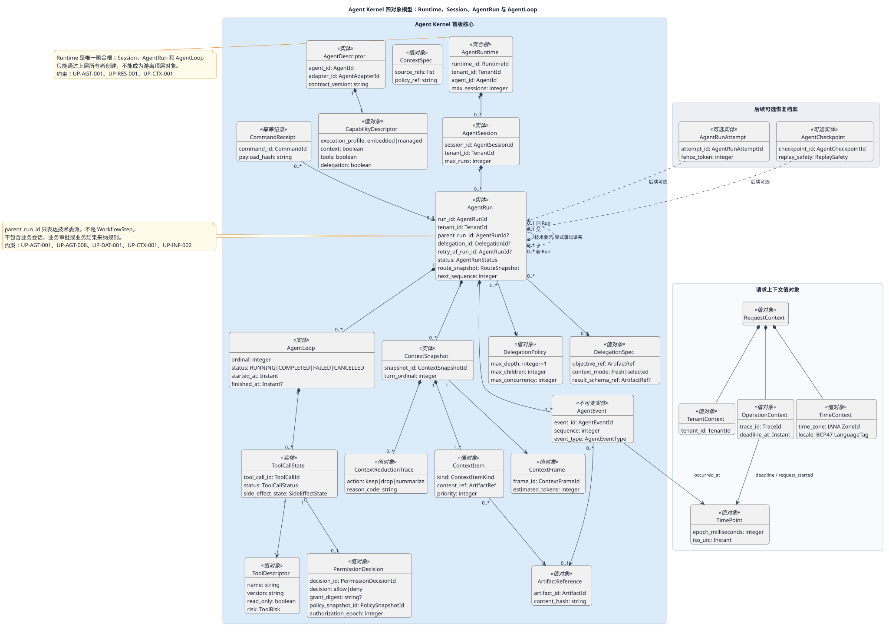
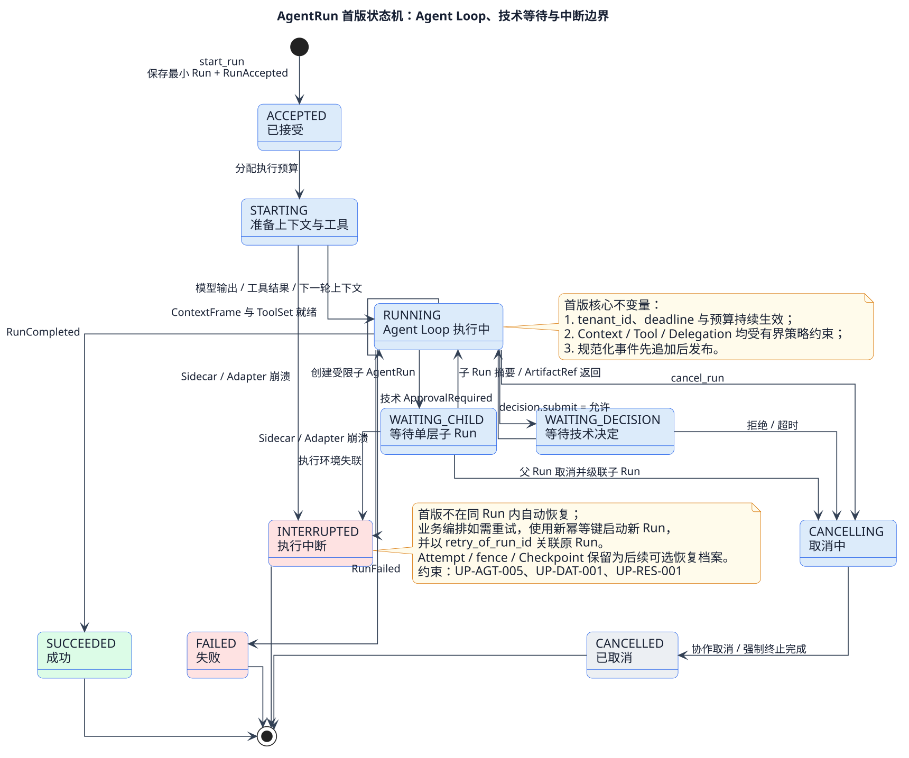
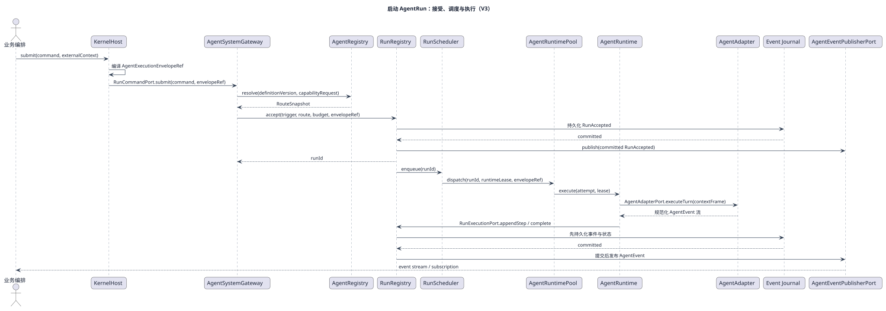
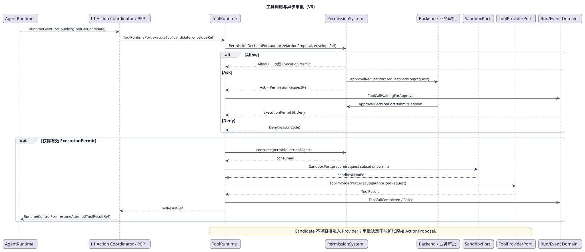
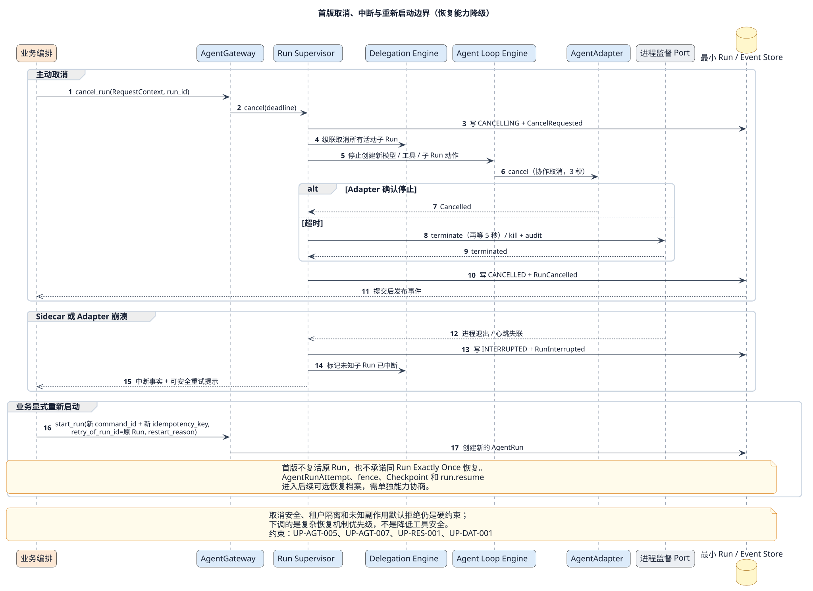
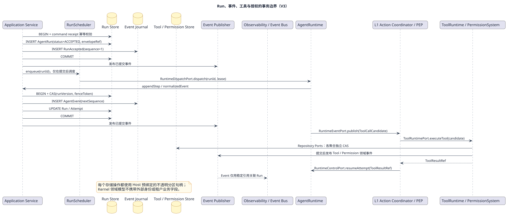
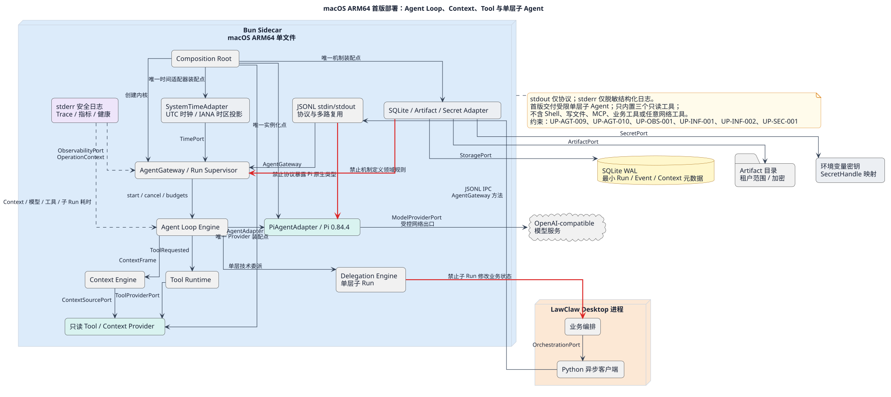

# 基于 Pi 的 LawClaw Agent Kernel 完整设计

> 文档状态：正式实现基线；当前代码范围由 ACR-2026-0006 固化
> 版本：0.5.0
> 日期：2026-09-03
> 首版目标：macOS ARM64、本地 Bun Sidecar、JSONL stdin/stdout
> 本文中的 TypeScript、Python、JSON Schema 和 SQLite DDL 均为契约草案，不是实现、迁移或可运行代码。

> [!IMPORTANT]
> 本版正式记录三项范围变更：首版增加受限单层子 Agent；规范化执行上下文由 Kernel 的 Context Engine 所有；里程碑顺序改为先验证 Pi Agent Loop、Context Engine 与 Tool Runtime，再实现最小持久化。业务编排、多租户、安全、Adapter 和基础设施边界不变。
>
> ACR-2026-0007 进一步固化四对象模型：`Runtime` 是聚合根，`Session` 管理多次 `AgentRun`，每个 `AgentRun` 拥有一至多个 `AgentLoop`。ToolCall、PermissionGrant 和 SandboxHandle 都是该层级下的调用实体或值对象，不能替代四个核心对象。

> [!WARNING]
> `ACR-2026-0008` 正在进行五步评审，提出新的系统级对象模型：Agent Kernel System 是限界上下文，`AgentRun` 是核心执行聚合根，`AgentRuntime` 是受 `RunScheduler` 管理的可重建执行服务，Session 降为可选 `AgentContextThread`。候选方案还恢复 `Allow / Ask / Deny` 和外部 `ApprovalPort`。在步骤五批准前，本文件的 ACR-2026-0007 正文和当前代码仍是活动基线；候选定义以 [Agent Kernel System V3 评审文档](agent-kernel-v2-architecture-review.md) 和 [同一份五页 Draw.io](agent-kernel-v2-review.drawio) 为准。

## 1. 文档目的

本文定义 LawClaw Agent Kernel 的职责、领域边界、稳定契约、数据模型、数据流、控制流、安全与韧性策略，并给出基于 Pi monorepo `0.84.4` 基线的实现约束。本文是后续契约、代码和测试的直接设计依据，但不能改变上层总体架构授予 Agent Kernel 的职责。本次基线变更把设计中心从“同 Run 强恢复”调整为“高质量 Agent Loop、上下文治理、工具扩展和受限技术委派”。

ACR-2026-0005 将已经验证的能力固化为正式工程代码；ACR-2026-0006 将该工程纳入 Pi monorepo workspace，并把 Adapter 与 CLI 对齐到仓库 `0.84.4` 基线。正式代码基线不等于所有生产里程碑均已完成：持久化 Journal、Sidecar、Backend 接入和部署仍须按里程碑逐项确认。

### 1.1 待评审的系统级建模修正

ACR-2026-0008 不把一次用户交互视为整个 Agent System。它把用户请求、业务编排、定时任务、系统事件和 Agent 委派统一建模为 `AgentRunTrigger`，由 `AgentControlPlane` 创建 Run，再由 `RunScheduler` 派发到 Runtime Worker。候选对象关系为：

```text
Agent Kernel System（限界上下文）
├── AgentDefinition（聚合根）
├── AgentRun（核心聚合根）
│   └── AgentRunAttempt（实体）
│       └── AgentLoopStep（实体/事件投影）
├── AgentExecutionScope（聚合根）
├── MultiAgentRun（聚合根）
├── PermissionRequest（聚合根）
├── MemorySpace（聚合根）
├── RunScheduler（领域服务）
└── AgentRuntime（执行领域服务）
```

该候选方案保持业务编排、Backend、Infrastructure 和 Pi Adapter 的上层边界不变，但会替代 ACR-2026-0007 的 Runtime/Session/Run 所有权，并影响公共接口和当前实现。其 UML 对象关系、服务协作、差距和五步确认条件全部集中在候选评审文档，避免活动基线正文与未批准设计混写。

## 2. 架构优先级与冲突处理

设计和后续实现必须按以下优先级服从：

1. `/Users/oscar/jurismind/架构图/lawclaw-target-overview.drawio`
2. `/Users/oscar/jurismind/架构图/lawclaw-detailed-architecture.md`
3. `/Users/oscar/jurismind/架构图/lawclaw-agent-runtime.svg`
4. 本设计文档及 `docs/design/diagrams/*.puml`
5. 公共 Schema、代码和测试

发现下层设计需要上层未授予的职责时，必须停止当前里程碑，记录冲突位置、原因和不扩权替代方案，等待上层架构确认。不得以“技术便利”“Pi 原生能力”或“减少模块”为由扩大 Kernel 职责。

## 3. 目标与非目标

### 3.1 目标

- 为业务编排提供不依赖 Pi、ACP 或未来 Runtime 的稳定 `AgentGateway`。
- 用 `AgentAdapter` 隔离 Pi Session、Event、Message 和 Provider 类型，并显式区分“Kernel 管循环”和“Runtime 托管循环”两种执行档案。
- 以 `AgentLoopEngine` 统一模型调用、工具调用、上下文更新、技术委派、取消和预算控制。
- 以 `ContextEngine` 拥有规范化 `ContextItem`、`ContextFrame`、`ContextSnapshot`、裁剪和摘要轨迹；Pi 原生消息仍不得越过 Adapter。
- 以 `ToolRuntime`、内部 `PermissionApprovalPort` 和 `ToolProviderPort` 建立工具发现、版本、Schema、权限判定、隔离执行和结果归一化的稳定扩展点。
- 首版交付受限单层子 Agent：子 Agent 是带 `parent_run_id` 的技术 `AgentRun`，不是 `WorkflowStep`。
- 建立 Runtime、Session、AgentRun、AgentLoop、ToolCall、Delegation 技术状态和规范化 AgentEvent 的统一语义。
- 在可信 `TenantContext` 下执行强制租户隔离，同时传播 `OperationContext`。
- 保证最小命令幂等、事件先追加后发布、单 Run 序号严格递增和事件补拉。
- 提供有界取消与中断标记；同 Run Attempt/fence/Checkpoint 恢复降为后续可选能力。
- 用 Port 隔离 SQLite、Artifact、进程、传输、网络出口、密钥和时钟机制。
- 提供可测量、可诊断、可降级的日志、Trace、指标和健康能力。
- 首版优先以 Pi 验证模型与流式原语，由 Kernel 负责 Agent Loop、Context、Tool Runtime 和单层委派，同时保持替换 Runtime 的可能性。

### 3.2 非目标

- Agent Kernel 明确不得拥有 `WorkflowInstance`、`WorkflowStep` 或任何业务状态机。
- Agent Kernel 明确不得拥有业务 `ApprovalCase`、审批人选择、审批策略和业务审批结论。
- 不设计或持有 `WorkflowInstance`、`WorkflowStep` 或业务状态机。
- 不持有 `Conversation` 或业务 Message 的权威状态。
- 不执行 Backend 认证、RBAC、Tenant Resolver 或 HTTP API。
- 不持有前端 ViewModel、客户端缓存或前后端一致性状态。
- 不执行业务补偿、人工介入流程或结果采纳策略。
- 不把容器、进程、存储、密钥和网络机制变成 Agent 领域职责。
- 不包含劳动法、合同审核或其他业务规则。
- 子 Agent 不拥有业务目标拆解、业务状态机、业务审批或结果采纳权；它只执行父 Run 授予的技术目标。
- 首版不提供 Shell、文件写入/编辑、MCP、业务工具、任意网络工具或多层递归子 Agent。

## 4. 术语

| 术语 | 定义 |
|---|---|
| Agent Kernel | 管理 Agent 技术运行语义的纯领域内核，不含业务编排和具体 Runtime。 |
| Runtime | Agent System 的聚合根；拥有 Session 目录、系统级能力上限和安全基础设施引用。 |
| AgentSession | Runtime 内的逻辑会话实体；管理同一会话的多次 AgentRun，具体 Pi Session 不得外泄。 |
| AgentRun | Session 内一次用户请求对应的执行实体；冻结本次政策、预算和上下文，并拥有本次执行的全部 AgentLoop。 |
| AgentLoop | AgentRun 内一次“模型 Turn—工具/委派—上下文更新”迭代实体；序号严格递增且终态不可逆。 |
| AgentGateway | 业务编排调用 Kernel 的稳定上行端口。 |
| AgentAdapter | Kernel 调用具体 Runtime 的稳定下行端口族；按能力声明嵌入循环或托管循环执行档案。 |
| AgentLoopEngine | 执行模型—工具/委派—上下文更新循环，并强制轮次、Token、时间与并发预算。 |
| ContextEngine | Kernel 内部规范化上下文的组装、预算、选择、裁剪、摘要和可观测轨迹组件；不拥有业务 Conversation。 |
| ToolRuntime | 工具描述、发现、内部权限判定、执行守卫、Provider 调用与结果归一化组件。 |
| DelegationEngine | 创建和监督受限父子 AgentRun 的技术委派组件；不创建 WorkflowStep。 |
| AgentRunAttempt | 后续可选恢复档案中的物理执行尝试；不是首版主路径模型。 |
| AgentCheckpoint | 后续可选恢复档案中的安全恢复点；首版只保留兼容性预留。 |
| AgentEvent | Kernel 规范化、不可变、可补拉的技术事件。 |
| PermissionDecision / PermissionGrant | Kernel 内部对单次 ToolCall 的终态权限判定及最小能力集合；不是外部审批请求。 |
| TenantContext | Backend 产生的可信租户与主体上下文；Kernel 只消费和校验。 |
| OperationContext | Trace、Correlation、Deadline 等运维上下文。 |
| Port | 由稳定契约定义、由外部 Adapter 实现的机制接口。 |
| Composition Root | 唯一允许实例化具体 Adapter 并完成依赖注入的位置。 |

### 4.1 正式基线变更记录

| 变更编号 | 原锁定点 | 新基线 | 架构影响 | 状态 |
|---|---|---|---|---|
| BL-2026-09-02-01 | 首版禁止子 Agent | 首版交付单层、受预算约束、不可递归的技术子 Agent | 新增 `DelegationEngine`、父子 Run 模型和事件；不改变业务编排所有权 | 已由 ACR-2026-0001 确认 |
| BL-2026-09-02-02 | 上下文主要由 Pi Adapter 管理 | Kernel 拥有规范化 Context Engine；Pi 只做私有消息映射 | `start_run` 增加 `ContextSpec`；新增 ContextSourcePort 和上下文模型 | 已由 ACR-2026-0001 确认 |
| BL-2026-09-02-03 | 持久化/恢复先于 Pi | 先验证 Pi 原语、Kernel Agent Loop、Context 与 Tool Runtime，再补最小持久化 | 下调 Attempt/fence/Checkpoint；调整里程碑二至四顺序 | 已由 ACR-2026-0001 确认 |

变更判定：三项变化均属于总体图已经授予的“Agent 执行、会话、事件、工具技术状态和 Runtime 差异适配”范围，但扩大了 Agent Kernel 对外可声明的技术能力，因此同步修改总体 Draw.io 的总览页和 Agent 详情页。未获得的新职责为零。

## 5. 总体架构约束追踪矩阵

| 约束编号 | 上层约束 | 本设计落实 | 图 | 后续门禁 |
|---|---|---|---|---|
| <a id="up-agt-001"></a>UP-AGT-001 | Kernel 只拥有 Agent 技术运行模型 | Runtime 聚合根及 Session/AgentRun/AgentLoop 所有权层级；Context、ToolCall、Delegation 技术模型；非目标清单 | 01、02、08 | 四对象所有权与禁止业务类型测试 |
| <a id="up-agt-002"></a>UP-AGT-002 | 业务编排位于 Kernel 外，决定调用与采纳 | `AgentGateway` 只返回候选输出和技术状态 | 01、06 | 模块依赖测试 |
| <a id="up-agt-003"></a>UP-AGT-003 | 具体 Runtime 差异由 Adapter 屏蔽 | `AgentAdapter` 与 Pi 私有映射 | 01、02 | 公共 Schema 原生类型扫描 |
| <a id="up-agt-004"></a>UP-AGT-004 | Kernel 不导入 Pi、Bun、SQLite、HTTP | 纯契约和纯领域模块 | 03 | import 边界测试 |
| <a id="up-agt-005"></a>UP-AGT-005 | Kernel 负责执行、取消、技术重试和安全恢复边界 | Agent Loop、取消、中断标记；复杂同 Run 恢复为可选档案 | 04、07 | 循环/取消/中断测试 |
| <a id="up-agt-006"></a>UP-AGT-006 | 权限审批仅在 Kernel 内部调用 | ToolRuntime 调用 PermissionApprovalPort；无外部决定接口或等待状态 | 06 | 公共协议无审批方法；依赖边界测试 |
| <a id="up-agt-007"></a>UP-AGT-007 | 路由启动后冻结，非安全边界不切换 Adapter | RouteSnapshot；首版中断后新 Run，不复活旧 Run | 04、07 | 中断与重新启动策略测试 |
| <a id="up-agt-008"></a>UP-AGT-008 | 原生 Session/Event/Tool 不越过 Adapter | 规范化 DTO、ArtifactRef 和事件目录 | 01、08 | Schema/类型测试 |
| <a id="up-agt-009"></a>UP-AGT-009 | 首版只读工具最小化 | `list_files`、`read_text`、`search_text` | 10 | 工具白名单测试 |
| <a id="up-agt-010"></a>UP-AGT-010 | Pi 固定版本并可由未来 Adapter 替换 | Pi workspace 统一基线 0.84.4，能力快照路由 | 10 | lockfile、workspace 与 Adapter 契约测试 |
| <a id="up-ctx-003"></a>UP-CTX-003 | Kernel 管理规范化执行上下文但不拥有业务 Conversation | ContextSpec/Item/Frame/Snapshot/ReductionTrace；Pi 消息私有 | 02、05、08 | 上下文预算、裁剪解释与原生类型扫描 |
| <a id="up-tool-001"></a>UP-TOOL-001 | 工具通过稳定 Port 扩展且默认拒绝 | ToolRegistry/Policy/Guard/ProviderPort；首版三只读工具 | 02、06、10 | Provider 契约与安全负向测试 |
| <a id="up-del-001"></a>UP-DEL-001 | 子 Agent 只属于 Agent 技术执行，不得成为业务工作流 | 单层 parent_run_id、DelegationPolicy、级联取消、摘要返回 | 02、04、08 | 深度/预算/业务类型负向测试 |
| <a id="up-ctx-001"></a>UP-CTX-001 | Backend 产生可信 TenantContext；Kernel 不认证 | RequestContext 首参数、来源和责任约定 | 01、08 | 缺失/伪造上下文负向测试 |
| <a id="up-ctx-002"></a>UP-CTX-002 | TenantContext 与 OperationContext 跨层传播 | 所有 Gateway/Port 调用显式携带上下文 | 05 | contract test 与 Trace 测试 |
| <a id="up-dat-001"></a>UP-DAT-001 | 最小接受与事件先追加后发布，租户键完整，序号严格递增 | Receipt/RunAccepted、Journal、补拉；复杂 CAS/恢复后置 | 04、05、09 | 跨租户/幂等/序号/补拉测试 |
| <a id="up-sec-001"></a>UP-SEC-001 | 默认拒绝、最小权限、SecretHandle、日志脱敏 | 安全策略、出口白名单、加密 Artifact | 06、09、10 | 安全负向与日志扫描 |
| <a id="up-res-001"></a>UP-RES-001 | 有界循环、队列、重试、委派与安全中断 | 轮次/Token/时间/子 Run 预算、取消时限、崩溃标记 | 04、07、09 | 预算与故障注入测试 |
| <a id="up-obs-001"></a>UP-OBS-001 | OperationContext、日志、Trace、指标、健康横切 | ObservabilityPort 与 Span/Metric 目录 | 01、02、10 | 遥测契约测试 |
| <a id="up-inf-001"></a>UP-INF-001 | 基础设施仅通过 Port 提供机制 | Storage/Egress/Secret/Clock 等端口 | 01、02、03、09、10 | 绕过 Port 扫描 |
| <a id="up-inf-002"></a>UP-INF-002 | 时间是区分时区的统一基础设施能力 | UTC `TimePoint`、显式 `TimeContext`、`TimePort` 与 IANA 投影 | 01、02、03、05、08、10 | UTC 严格解析、时区/DST 测试和系统时间访问扫描 |
| <a id="up-dep-001"></a>UP-DEP-001 | 只有 Composition Root 实例化具体 Adapter | 唯一装配点 | 02、03、10 | `new *Adapter` 静态扫描 |
| <a id="up-dep-002"></a>UP-DEP-002 | 依赖单向且无循环 | contracts ← core/adapter/infra；root 组装 | 02、03 | 依赖图门禁 |
| <a id="up-dep-003"></a>UP-DEP-003 | 公共契约无具体 SDK/机制类型 | DTO/Schema 只含规范化值 | 03 | API Extractor/Schema 扫描 |

约束覆盖率计算以本表为清单：每项必须至少映射到一个设计章节、一个图或明确的非图设计项，以及一个后续自动门禁。里程碑一目标覆盖率为 100%。

## 6. 职责边界与架构地位

业务编排是业务用例的权威协调者，Agent Kernel 是可替换的技术执行子系统。两者不是“业务层调用模型 SDK”的关系，而是“业务用例通过稳定端口委托一次受约束的技术运行”的关系。



*图 1：Backend、业务编排、Agent Kernel、Pi Adapter、运维与基础设施的边界关系。*

控制权边界如下：

1. Backend 完成认证、RBAC 和租户解析，产生可信 `TenantContext`。
2. 业务编排根据 Workflow 和业务状态决定是否调用 `AgentGateway`。
3. Kernel 校验上下文、能力和技术约束，选择 Adapter 并执行 Run。
4. Kernel 产生规范化事件和候选输出，不直接修改 Workflow。
5. 业务编排根据业务规则、业务 ApprovalCase 和当前版本决定是否采纳输出。

因此，业务编排对“为什么执行、何时执行、结果是否生效”负责；Kernel 对“如何组织一次受约束的 Agent Loop、装配什么上下文、允许什么工具、是否技术委派、由哪个 Runtime 执行、如何取消和标记中断”负责。子 Agent 的目标来自父 Run，但其输出仍是候选结果；它不能越过父 Run 或业务编排修改业务状态。

## 7. 内部架构



*图 2：控制面、智能执行面、支撑数据面、Adapter/Provider 面与运维横切能力。*
>[!info] 控制面和执行面分离：拆分调度和执行。

### 7.0 四对象模型与所有权

```text
Runtime（聚合根）
  └─ Session（会话实体，0..*）
      └─ AgentRun（一次用户请求，0..*，首版同 Session 串行）
          └─ AgentLoop（一次模型—动作—上下文迭代，0..*）
              └─ ToolCall / Delegation（Loop 内动作实体）
```

- Composition Root 只创建一个 Runtime；Runtime 绑定单一租户并限制 Session 总量。
- Session 保存会话级权限上限并管理多次 Run；同一 `run_id` 不得重复创建。
- AgentRun 冻结命令、预算和政策，执行期间拥有严格递增的 Loop；Run 终态由 Loop 执行结果收敛。
- AgentLoop 不是 `while` 语法别名，而是有 `ordinal`、开始时间和不可逆终态的实体。
- ToolCall、PermissionDecision、PermissionGrant、SandboxRequest 和 SandboxHandle 均位于具体 Loop/Run 之下，不构成第五个顶层聚合根。


### 7.1 控制面

| 组件 | 职责 | 明确不负责 | 约束 |
|---|---|---|---|
| AgentGateway 实现 | 接收规范化命令；返回 Run 快照；提供事件补拉/订阅；接收 `ContextSpec`、`ToolPolicyRef` 和 `DelegationPolicy` | HTTP、认证、业务状态机、业务目标拆解 | [UP-AGT-002](#up-agt-002)、[UP-CTX-001](#up-ctx-001) |
| RequestContextGuard | 通过 `TimePort` 校验租户、主体、UTC deadline、IANA 时区、命令 ID、预算和上下文完整性 | 解析 Token、计算 RBAC、读取系统默认时区 | [UP-CTX-001](#up-ctx-001)、[UP-SEC-001](#up-sec-001)、[UP-INF-002](#up-inf-002) |
| AgentCatalog | 保存 AgentDescriptor、执行档案和版本化能力描述 | 业务优先级和业务路由 | [UP-AGT-001](#up-agt-001)、[UP-AGT-003](#up-agt-003) |
| ToolCatalog / SubagentCatalog | 保存版本化 ToolDescriptor 和受允许的子 Agent 定义 | 动态下载插件、业务人员与角色选择 | [UP-TOOL-001](#up-tool-001)、[UP-DEL-001](#up-del-001) |
| CapabilityMatcher | 判断 Context、Tool、Delegation 和 Runtime 需求是否满足 | 业务效果评分 | [UP-AGT-003](#up-agt-003)、[UP-SEC-001](#up-sec-001) |
| TechnicalRouter | 按静态规则、数据驻留和健康选择 Adapter，冻结 RouteSnapshot | 工作流分支、业务降级 | [UP-AGT-007](#up-agt-007) |
| AdapterRegistry | 注册描述符、健康和 Adapter/Provider 句柄 | 创建具体 Adapter/Provider | [UP-DEP-001](#up-dep-001) |

### 7.2 智能执行面

| 组件 | 职责 | 关键不变量 | 约束 |
|---|---|---|---|
| AgentRuntime / AgentSession / AgentRun | 维护四对象所有权、租户绑定、会话串行、Run 唯一性和容量 | Runtime 外不能直接创建游离 Run；Run 不能绕过 Session | [UP-AGT-001](#up-agt-001)、[UP-RES-001](#up-res-001) |
| AgentLoopEngine / AgentLoop | 驱动并记录“上下文 → Runtime turn → 工具/委派 → 新上下文”迭代 | 每个模型 Turn 必须对应一个 Loop 实体；轮次、Token、时间、输出、工具和委派均有界 | [UP-AGT-005](#up-agt-005)、[UP-CTX-003](#up-ctx-003) |
| ContextEngine | 从受控来源组装 ContextItem，按预算选择、裁剪、摘要并生成 ContextFrame/Snapshot/ReductionTrace | 不读取业务库；不把业务 Conversation 变成 Kernel 聚合 | [UP-CTX-003](#up-ctx-003)、[UP-SEC-001](#up-sec-001) |
| ToolRuntime | ToolRegistry、ToolPolicyEngine、ToolExecutionGuard、Provider 调用和结果归一化 | 未注册/未知风险默认拒绝；Provider 不定义策略 | [UP-TOOL-001](#up-tool-001)、[UP-SEC-001](#up-sec-001) |
| DelegationEngine | 验证 DelegationSpec，创建子 AgentRun，分配独立上下文/工具/预算并汇总结果 | 最大深度 1；子 Run 不继承高风险工具；父取消级联 | [UP-DEL-001](#up-del-001)、[UP-AGT-002](#up-agt-002) |
| CancellationCoordinator | 停止新动作、协作取消、级联子 Run、进程终止和审计 | 取消有时限且终态幂等 | [UP-AGT-005](#up-agt-005)、[UP-RES-001](#up-res-001) |
| PermissionApprovalService | 对单次 ToolCall 求权限交集并返回 `ALLOW(grant)` 或 `DENY(reason)` | 不对外暴露；不创建沙箱或执行 Provider | [UP-AGT-006](#up-agt-006) |

### 7.3 支撑数据面

| 组件 | 职责 | 事务要求 | 约束 |
|---|---|---|---|
| AgentRunRepository Port | 最小 Run、父子关系和崩溃扫描 | 所有键含 tenant_id；父子 Run 同租户 | UP-DAT-001、UP-INF-001 |
| AgentSessionRepository Port | 逻辑 Session 与 Adapter 私有引用 | 不暴露原生 Session；首版默认串行 | UP-DAT-001、UP-AGT-008 |
| ContextSnapshotRepository Port | ContextSnapshot、ContextItem 引用和 ReductionTrace | 敏感正文只用 ArtifactRef；记录选择原因但不记录正文 | UP-CTX-003、UP-SEC-001 |
| EventJournal Port | 严格递增事件、补拉游标 | 事件追加成功后才发布 | UP-DAT-001 |
| CommandReceiptRepository Port | 命令去重和载荷哈希冲突 | `(tenant_id, command_id)` 唯一 | UP-DAT-001 |
| ArtifactPort | 上下文、大载荷和工具结果引用 | tenant scope、hash、加密、配额 | UP-SEC-001、UP-INF-001 |

### 7.4 Adapter 面

`AgentAdapter` 是执行档案端口族：`embedded_loop` Adapter 暴露单轮模型原语，由 Kernel AgentLoopEngine 管理 Context、Tool 和 Delegation；`managed_loop` Adapter 可托管内部循环，但必须声明哪些能力由 Runtime 管理，并仍输出规范化事件。Pi 首版使用 `embedded_loop` 档案。Pi Adapter 内部负责：

- Kernel Session 与 Pi Session 的私有映射；
- ContextFrame、模型参数和 ToolDescriptor 到 Pi 私有类型的转换；
- Pi 流式事件到 RuntimeEventCandidate 的归一化；
- Abort 取消和完整 Turn 的结果边界；
- Pi 错误到稳定错误码的映射；
- 通过 SecretPort 和 EgressPort 获取受控机制。

Pi Adapter 不得决定上下文裁剪、工具准入、子 Agent 深度或业务结果采纳；不得访问 Backend HTTP、持久化业务状态、绕过 Event Journal 发布事件或将 Pi 对象交给业务编排。

Tool Provider 和 Context Provider 与 AgentAdapter 一样位于 Kernel Port 外。Provider 只执行已经通过 Kernel 策略的规范化请求，不能注册业务规则、扩大权限或自行委派。

### 7.5 运维面

ObservabilityPort 是横切端口，不改变领域决策。它接收脱敏属性、Span 生命周期、Metric 和健康贡献。日志不得成为事件恢复源，Trace 不得成为数据一致性手段。

## 8. 依赖规则与物理模块



*图 3：允许依赖、禁止依赖以及 Composition Root 的唯一装配职责。*

正式工程按以下物理模块和单向依赖组织；未完成的持久化与 Sidecar 模块仍按后续里程碑确认门推进：

| 模块 | 可以依赖 | 禁止依赖 | 约束 |
|---|---|---|---|
| agent-contracts | 标准库与 Schema 工具 | Pi、Bun、SQLite、HTTP框架 | UP-DEP-003 |
| agent-kernel | agent-contracts；内部 `context-engine`、`tool-runtime`、`delegation-engine` 逻辑组件 | Pi、Bun、SQLite、HTTP、具体 Adapter | UP-AGT-004、UP-CTX-003、UP-TOOL-001、UP-DEL-001 |
| agent-adapter-fake | agent-contracts | 业务编排 | UP-AGT-003 |
| agent-adapter-pi | agent-contracts、固定 Pi 包 | agent-kernel 内部实现、Backend | UP-AGT-003、UP-AGT-010 |
| agent-provider-readonly | agent-contracts | 业务规则、Shell、写文件、任意网络 | UP-TOOL-001、UP-SEC-001 |
| agent-infra-sqlite | agent-contracts、bun:sqlite | 业务和路由规则 | UP-INF-001 |
| agent-sidecar-transport | agent-contracts | Pi 原生类型、业务模型 | UP-DEP-003 |
| composition root | 以上模块 | 业务规则 | UP-DEP-001 |

所有依赖必须形成有向无环图。Adapter 与 Infrastructure 通过实现 Port 接入，不得让 Kernel 依赖其实现模块。

## 9. RequestContext、信任与传播

### 9.1 TenantContext

`TenantContext` 至少包含：`tenant_id`、`subject_id`、`authorization_snapshot`、`issued_at`、`expires_at` 和 `context_version`。它由 Backend 产生并在进程边界上进行完整性校验。Kernel：

- 消费可信上下文，不认证用户；
- 对每个命令、查询、事件、Session、Artifact 和唯一键强制 tenant scope；
- 不接受调用方在资源 ID 之外另行指定目标租户；
- 不允许全局、无租户 Session；
- 在上下文过期、缺失或不匹配时默认拒绝。

### 9.2 OperationContext

`OperationContext` 包含 `trace_id`、`span_id`、`correlation_id`、可选 `causation_id`、`deadline_at` 和 `request_started_at`。它必须传播到 Gateway、Kernel、Adapter 和 Infrastructure Port。子操作可以派生 span，但不得修改 tenant identity。

### 9.3 RequestContext

`RequestContext` 还包含显式 `TimeContext`：`time_zone` 必须是 IANA 标识（例如 `Asia/Shanghai`），`locale` 必须是 BCP 47 标签。它由 Backend 根据租户/用户偏好生成，Kernel 只校验和消费，禁止从 Sidecar 主机默认时区推断调用方时间语义。

所有公开 Gateway 和 Port 方法的第一个参数必须为 `RequestContext`。后台崩溃扫描由 Kernel 生成受审计的 `SystemOperationContext`，仍必须绑定具体 tenant_id 和扫描原因，禁止无租户扫描后直接写入。首版扫描只把非终态 Run 标记为 `INTERRUPTED`，不自动恢复执行。

### 9.4 统一时间语义

- 事件、deadline、租户有效期和持久化字段统一使用规范化 ISO-8601 UTC（带毫秒、以 `Z` 结尾）；排序和预算使用同一 `TimePoint.epochMilliseconds`。
- `TimeContext` 只用于解析/展示投影，不能改变已经确定的 UTC 时间点，也不能作为领域状态的排序依据。
- 日历日期或“当地 9 点”若尚未绑定时区，必须保留为待解析输入；不得使用主机时区静默解释。遇到夏令时重叠或缺口时，调用方必须提供明确策略，首版默认拒绝歧义输入。
- Kernel、Pi Adapter 和 Tool/Delegation Runtime 只通过 `TimePort` 获取当前时间；生产由 `SystemTimeAdapter` 实现，测试可注入固定时钟。墙上时间用于事件和 deadline，单调时间只用于耗时打点且不得持久化。
- Run 有效时限取 `RunBudget.maxDurationMs` 与 `OperationContext.deadlineAt` 剩余时间的较小值。

## 10. DDD 聚合与事务边界



*图 8：Runtime、Session、AgentRun、AgentLoop、ToolCall 与后续可选恢复档案的关系。*

### 10.1 Runtime 聚合根与 AgentRun 实体

Runtime 是 Agent System 的唯一聚合根，拥有 Session 目录、系统级权限上限和容量。AgentRun 是 Session 内一次技术执行实体，拥有状态、父 Run/Delegation 引用、可选 `retry_of_run_id`、事件序号、预算消耗、取消原因、终态结果引用和严格递增的 AgentLoop。`parent_run_id` 表示子 Agent 委派，`retry_of_run_id` 表示业务编排显式发起的新 Run，两者语义不得混用。AgentRun 不能脱离 Runtime/Session 创建，也不是强恢复事务的独立聚合。约束：UP-AGT-001、UP-AGT-005、UP-DAT-001、UP-DEL-001。



*图 4：Run 接受、Agent Loop、工具/子 Run 等待、取消、终态与中断迁移。*

不变量：

- `tenant_id` 和 `run_id` 创建后不变；
- `adapter_id` 在进入执行后冻结；
- 终态不可逆；
- 单 Run 对外事件序号严格递增，事件追加成功后才发布；
- 子 Run 必须与父 Run 同租户，最大深度 1，且不能再次委派；
- 父 Run 取消必须级联活动子 Run，子 Run 只能返回摘要和 ArtifactRef；
- 进程崩溃把非终态 Run 标记为 `INTERRUPTED`；首版不在原 Run 内自动恢复；
- 输出正文保存为 ArtifactRef，Run 只保存引用和摘要。
- 每次 Runtime Turn 开始前必须创建一个 AgentLoop；工具/委派和上下文更新完成后才能关闭该 Loop；Loop 终态不可逆。

### 10.2 AgentSession 实体

AgentSession 是 Runtime 内的逻辑技术会话实体，拥有 agent_id、会话级权限上限、adapter mapping reference、上下文策略引用和多次 AgentRun 生命周期。Pi 原生 Session 只存在于 Pi Adapter 私有映射。首版同一 Session 只允许一个活动 Run，并通过配置限制保留 Run 数；不要求 lease/fence 成为所有 Session 写入的前置条件。约束：UP-AGT-008、UP-RES-001。

默认并发策略：同一 tenant、逻辑 agent 和业务会话引用下串行执行；共享策略未显式建模前不允许跨 Run 并发修改同一规范化上下文。子 Run 默认使用独立 ContextSnapshot，不共享父 Run 的可变原生 Session。

### 10.3 Context 模型

Context Engine 拥有以下规范化模型：

- `ContextSpec`：调用方声明允许的上下文来源、必选引用、上下文策略和数据分类；不接受任意数据库查询表达式。
- `ContextItem`：带 `kind`、`content_ref`、来源、优先级、敏感等级、估算 Token、创建时间和因果引用的最小上下文单元。
- `ContextFrame`：一次 Runtime turn 的不可变输入投影；只包含已选 Item 和受控系统指令引用。
- `ContextSnapshot`：记录某一 Turn 实际使用的 Frame、预算和版本，支持诊断与后续继续会话。
- `ContextReductionTrace`：记录 keep/drop/summarize、reason_code、前后 Token 估算和摘要产物引用；禁止记录被裁剪正文。

Context Engine 的选择顺序默认为：安全/系统约束 > 当前目标与显式输入 > 最新工具/子 Run 结果 > 当前会话近期 Turn > 历史摘要。超预算时先丢弃低优先级可重取信息，再压缩历史，最后拒绝运行；不得静默删除安全指令、当前目标或工具政策。业务 `Conversation` 和业务 Message 仍由业务编排拥有，Kernel 只消费其授权投影或 ArtifactRef。约束：UP-CTX-003、UP-AGT-008、UP-SEC-001。

Context Engine 不拥有业务 Conversation，也不建立业务 Message 的权威状态；它只拥有一次 Agent 执行所需的规范化投影。

### 10.4 AgentEvent

AgentEvent 是不可变实体。Envelope 至少包含：schema_version、tenant_id、run_id、session_id、可选 parent_run_id/delegation_id、event_id、sequence、event_type、occurred_at、trace_id、correlation_id、causation_id 和 payload/payload_ref。大正文、Prompt、工具参数和模型输出默认不内联。

### 10.5 Tool 与 Provider 模型

`ToolDescriptor` 至少包含：稳定名称、语义版本、输入/输出 JSON Schema、只读性、幂等性、并行安全性、破坏风险、网络需求、数据范围、内部权限政策引用、沙箱要求和输出上限。Kernel 只跟踪 ToolCall 的发现、验证、权限判定、执行、结果、失败和副作用已知性，不解释工具结果的业务含义。首版工具 Provider 只允许：

- `list_files`：列出授权工作区内目录项；
- `read_text`：读取授权工作区内受大小限制的文本；
- `search_text`：在授权工作区内执行受限文本搜索。

所有路径先规范化再校验工作区边界，拒绝软链接逃逸、设备文件、超限文件和跨租户根目录。

工具扩展必须通过 `ToolProviderPort` 注册 `ToolDescriptor` 并通过契约测试。加入 Shell、写文件、MCP、业务工具或网络工具不是“添加一个实现”，而是安全能力范围变更，必须重新经过总体架构评审。

### 10.6 单层子 Agent 模型

子 Agent 由 `DelegationEngine` 创建为新的 `AgentRun`，使用 `parent_run_id` 和 `delegation_id` 形成技术父子关系。`DelegationSpec` 至少包含目标引用、子 Agent ID、`fresh|selected` 上下文模式、允许的上下文引用、结果 Schema、ToolPolicyRef、时间/Token/工具/输出预算和取消传播策略。

首版硬限制：

- 最大委派深度为 1；子 Run 禁止再次委派；
- 每个父 Run 最多创建 4 个子 Run，默认并发 2；
- 子 Run 使用独立 ContextSnapshot，只接收明确选择的信息，不复制完整父上下文；
- 高风险工具权限不继承；子 Run 默认仍只有三个只读工具；
- 父 Run 取消或 deadline 到期时级联取消子 Run；
- 子 Run 只向父 Run 返回结构化摘要、状态和 ArtifactRef；不向业务编排写 Workflow；
- 子 Run 的事件带 parent_run_id/delegation_id，可观测但不被解释为业务 WorkflowStep。

约束：UP-DEL-001、UP-AGT-002、UP-SEC-001、UP-RES-001。

### 10.7 后续可选恢复档案

`AgentRunAttempt`、fence、`AgentCheckpoint`、同 Run `resume` 和跨版本 Checkpoint 兼容性不进入首版核心验收。公共能力描述可以声明 `checkpoint_resume=false`；如调用未支持的恢复方法，返回 `RECOVERY_UNSUPPORTED`。后续启用前必须补充副作用模型、旧 Worker 隔离、完整性格式、兼容矩阵和故障注入证据。

### 10.8 CommandReceipt

CommandReceipt 负责传输命令去重，以 `(tenant_id, command_id)` 唯一，保存规范化 payload hash、方法名、处理状态和结果引用。同键同载荷返回原结果；同键异载荷返回 `IDEMPOTENCY_CONFLICT`，不得覆盖或启动新副作用。

`start_run` 另有业务调用语义唯一约束：`(tenant_id, orchestration_step_ref, idempotency_key)`。`orchestration_step_ref` 只是业务编排提供的不透明外部引用，Kernel 不建立或解释 WorkflowStep。不同 command_id 若携带相同语义键和相同载荷，必须返回同一 run_id；相同语义键异载荷仍返回 `IDEMPOTENCY_CONFLICT`。这两层分别防止“协议重发”和“业务调用方换 command_id 后重复启动”。

中断后显式重试不是重发原命令：业务编排必须生成新的 `command_id` 和新的 `idempotency_key`，并设置 `retry_of_run_id` 与 `restart_reason`；`orchestration_step_ref` 可以保持不变。Kernel 校验被引用 Run 同租户且为可重试终态，但不替业务编排决定是否重试。这样既保留单次启动幂等，又允许明确的新 Run 谱系。

## 11. 稳定接口设计

### 11.1 公共接口中文契约规范

每个公开接口、方法、DTO 和字段必须有中文契约注释，至少包含：

1. 职责和明确边界；
2. 参数语义、单位、格式和大小限制；
3. 返回值与异步/流式语义；
4. tenant、主体和权限前置条件；
5. 幂等键、CAS 和并发语义；
6. deadline、取消和背压语义；
7. 稳定错误码；
8. 日志、Trace 和指标要求；
9. Schema 版本和兼容性策略；
10. 所落实的 `UP-*` 约束编号。

任何只写“获取 Run”“执行 Agent”而未写上述契约的公开方法，不得通过里程碑二门禁。

### 11.2 AgentGateway 能力

| 方法 | 能力与返回 | 幂等/并发 | 主要错误 | 约束 |
|---|---|---|---|---|
| `describe_agent` | 返回版本化 AgentDescriptor 和 CapabilityDescriptor | 只读，tenant scope | NOT_FOUND、CONTEXT_INVALID | UP-AGT-001、UP-CTX-001 |
| `open_session` | 创建或取得逻辑 Session，返回上下文策略与 Runtime 能力快照 | command_id 幂等；默认串行 | IDEMPOTENCY_CONFLICT、SESSION_CONFLICT | UP-AGT-008、UP-DAT-001 |
| `close_session` | 幂等关闭逻辑 Session | 终态重复关闭成功 | SESSION_BUSY | UP-AGT-008 |
| `start_run` | 接收 `ContextSpec`、`ToolPolicyRef`、`DelegationPolicy` 和执行预算，返回最小已接受 Run，异步启动 Agent Loop | command_id 传输幂等；`(tenant_id, orchestration_step_ref, idempotency_key)` 语义唯一；路由冻结 | IDEMPOTENCY_CONFLICT、CAPABILITY_UNAVAILABLE、CONTEXT_BUDGET_EXCEEDED、DEADLINE_EXCEEDED | UP-AGT-002、UP-AGT-005、UP-CTX-003、UP-TOOL-001、UP-DEL-001 |
| `get_run` | 返回 tenant-scoped RunSnapshot | 只读；可带最小版本 | RUN_NOT_FOUND | UP-DAT-001 |
| `cancel_run` | 请求协作取消，必要时进程终止 | 重复取消返回当前状态 | RUN_TERMINAL、CANCEL_TIMEOUT | UP-AGT-005、UP-RES-001 |
| `read_events` | 从 after_sequence 有界补拉事件 | 只读；严格顺序 | EVENT_GAP_UNAVAILABLE | UP-DAT-001 |
| `subscribe_events` | 订阅提交后的事件，支持 after_sequence | 队列 256 条或 2MiB | SUBSCRIBER_SLOW | UP-RES-001 |

`resume_run` 不属于首版必需 AgentGateway。后续只有 CapabilityDescriptor 明确声明 `checkpoint_resume=true` 时才可通过可选扩展提供；首版调用统一返回 `RECOVERY_UNSUPPORTED`。业务编排使用新的 `command_id + idempotency_key` 调用 `start_run`，并设置 `retry_of_run_id` 保留重试谱系。

### 11.3 AgentAdapter 执行档案

所有 Adapter 先实现基础生命周期与能力描述，并声明 `execution_profile`。首版 Pi 为 `embedded_loop`；现有 ACP 一类自带循环的 Runtime 可使用 `managed_loop`。两种档案不能伪装成彼此：

| 方法/档案 | 契约 | 关键边界 | 约束 |
|---|---|---|---|
| `describe_capabilities` | 返回静态或缓存的版本化能力、执行档案、Context/Tool/Delegation 管理归属 | 不含业务优先级 | UP-AGT-003 |
| `open_session` | 建立 Adapter 私有会话映射 | 返回规范化 opaque handle，不返回 Pi Session | UP-AGT-008 |
| `execute_turn`（embedded） | 接收不可变 ContextFrame、ToolDescriptor 集和 Turn 预算，返回 RuntimeEventCandidate | Kernel 管循环、工具和委派；Adapter 不自行执行 ToolProvider | UP-AGT-003、UP-CTX-003、UP-TOOL-001 |
| `execute_managed`（managed） | Runtime 托管循环并返回规范化事件；能力描述必须声明其内部管理项 | 不得绕过 Kernel 工具政策或创建不受控子 Agent | UP-AGT-003、UP-SEC-001 |
| `cancel` | 在 deadline 内协作取消 | 超时由 ProcessSupervisor 处理 | UP-RES-001 |
| `close_session` | 释放 Adapter 私有会话资源 | 不关闭业务会话 | UP-AGT-008 |
| `health` | 返回 Adapter 技术健康和能力退化 | 不决定业务降级 | UP-OBS-001 |

后续可选 `checkpoint` / `resume` 扩展不进入首版 Adapter 契约测试。

### 11.4 Infrastructure Port

| Port | 能力 | 禁止事项 | 约束 |
|---|---|---|---|
| StoragePort | 最小原子接受、事件追加/补拉、租户查询、迁移版本 | 暴露 SQLite 类型；把通用 CAS 当领域语义 | UP-INF-001、UP-DAT-001 |
| ArtifactPort | put/read/delete、quota、hash、加密 | 跨租户去重和裸路径外泄 | UP-INF-001、UP-SEC-001 |
| ProcessSupervisorPort | spawn/terminate/kill/health | 决定 Agent 路由 | UP-INF-001、UP-RES-001 |
| TransportPort | 有界 JSONL 帧收发和断线信号 | 解释业务状态 | UP-INF-001 |
| EgressPort | 目标白名单、deadline、连接预算 | 任意网络出口 | UP-SEC-001 |
| SecretPort | 由 SecretHandle 解析临时 secret | 返回可序列化配置或写日志 | UP-SEC-001 |
| TimePort | UTC 当前时间、严格解析、绝对时间加法、IANA 时区与 locale 校验、展示投影；测试可注入固定时钟 | Kernel/Adapter 直接读取系统时钟；持久化本地时间；依赖主机默认时区 | UP-INF-001、UP-INF-002 |
| IdGeneratorPort | 生成类型化 ID | 生成无类型字符串 | UP-DAT-001 |
| ObservabilityPort | span/metric/log/health contribution | 接收 Prompt、正文、工具参数 | UP-OBS-001、UP-SEC-001 |
| ToolProviderPort | 执行已授权的规范化工具请求 | 内置业务规则或无限输出 | UP-AGT-009、UP-SEC-001 |
| ContextSourcePort | 按已授权引用有界读取上下文候选项 | 任意查询业务库、决定裁剪策略、返回无界正文 | UP-CTX-003、UP-SEC-001 |

## 12. JSONL IPC 协议

### 12.1 传输原则

- stdin 接收一行一个 UTF-8 JSON 请求；stdout 只输出协议响应和事件。
- stderr 只输出脱敏结构化日志；任何日志不得写 stdout。
- 每帧最大 1MiB；大载荷必须使用 ArtifactRef。
- 请求/响应通过 `request_id` 多路复用；事件通过 `subscription_id` 和 run sequence 排序。
- `protocol_version` 必填；未知主版本拒绝，兼容的次版本允许忽略可选字段。
- JSON Schema 默认 `additionalProperties: false`。
- 客户端断线后使用 `run.events.read(after_sequence)` 补拉，再订阅后续事件。
- 单订阅队列上限为 256 条或 2MiB，先到者触发 `SUBSCRIBER_SLOW` 并关闭该订阅，不影响 Run。

### 12.2 方法目录

| JSONL 方法 | 对应能力 | 是否改变状态 | 约束 |
|---|---|---|---|
| `initialize` | 协商协议、Schema、客户端能力 | 否 | UP-DEP-003 |
| `agent.describe` | AgentGateway.describe_agent | 否 | UP-AGT-001 |
| `session.open` | AgentGateway.open_session | 是 | UP-AGT-008 |
| `session.close` | AgentGateway.close_session | 是 | UP-AGT-008 |
| `run.start` | AgentGateway.start_run | 是 | UP-DAT-001 |
| `run.get` | AgentGateway.get_run | 否 | UP-DAT-001 |
| `run.cancel` | AgentGateway.cancel_run | 是 | UP-RES-001 |
| `run.events.read` | 有界事件补拉 | 否 | UP-DAT-001 |
| `run.events.subscribe` | 实时事件订阅 | 建立临时订阅 | UP-RES-001 |
| `health.get` | 健康快照 | 否 | UP-OBS-001 |
| `metrics.snapshot` | 本地指标快照 | 否 | UP-OBS-001 |
| `shutdown` | 优雅停止 Sidecar | 是 | UP-RES-001 |

`run.resume` 不属于首版必需协议，预留为后续可选扩展，不进入首版初始化协商的方法集合。客户端不得根据方法名存在推断恢复安全；必须以能力描述和协议扩展版本共同判断。

### 12.3 帧类型

- 请求：`{frame_type:"request", protocol_version, request_id, method, context, params}`。
- 成功响应：`{frame_type:"response", request_id, ok:true, result}`。
- 失败响应：`{frame_type:"response", request_id, ok:false, error}`。
- 订阅事件：`{frame_type:"event", subscription_id, event}`。
- 流控通知：`{frame_type:"control", subscription_id, control_type, details}`。

不允许将 Pi Event、Pi Tool 或 Pi Session 对象直接 JSON 序列化到任一帧。

## 13. Pi 能力映射

当前 Pi monorepo 基线：

- `@earendil-works/pi-ai@0.84.4`：程序化模型与流式原语；
- `@earendil-works/pi-coding-agent@0.84.4`：受控 Pi CLI 扩展入口。

Kernel 不直接依赖 `@earendil-works/pi-agent-core` 的循环实现；循环、上下文、工具和委派决策仍由 Kernel 持有。依赖清单采用与 monorepo 其他内部包一致的 `^0.84.4` workspace 范围，锁文件和实际 workspace 版本共同固定可复现基线。

Pi 在本架构中的定位是 `PiAgentAdapter` 下方的 Runtime 实现，不与 AgentGateway 并列。

| Kernel 能力 | Pi 复用 | Kernel / Adapter 补齐 | 约束 |
|---|---|---|---|
| 模型与单轮生成 | Pi provider abstraction、流式生成和 tool call 原语 | Kernel AgentLoopEngine 组织多轮；Adapter 转换 ContextFrame | UP-AGT-003 |
| Agent Loop | Pi 可提供循环参考与事件原语 | Kernel 首版拥有循环状态、预算、工具和委派控制 | UP-AGT-005 |
| 流式输出 | Pi streaming lifecycle | 归一化 RuntimeEventCandidate，再转 AgentEvent 并追加后发布 | UP-DAT-001 |
| Context | Pi message/context primitives 与压缩能力可借鉴 | Kernel ContextEngine 拥有规范化模型、选择、预算、摘要轨迹；Adapter 私有映射 | UP-CTX-003、UP-AGT-008 |
| 工具调用 | Tool schema、tool call 事件、abort 原语 | Kernel ToolRuntime 负责注册、白名单、内部权限判定、路径隔离和技术状态 | UP-TOOL-001、UP-SEC-001 |
| 单层子 Agent | 不直接依赖 Pi 原生委派 | Kernel DelegationEngine 创建父子 AgentRun；Pi 只执行各 Run 的 turn | UP-DEL-001 |
| Session | Pi context/session primitives | Kernel Session ID、上下文策略和私有映射 | UP-AGT-008 |
| 取消 | Abort 机制 | deadline、进程监督、取消审计 | UP-RES-001 |
| Checkpoint/Resume | 完整 Turn 上下文可提取 | 后续可选档案；不进入首版验收 | UP-AGT-005 |
| 模型目录 | Pi provider/model catalog | 版本化 CapabilityDescriptor 和静态路由 | UP-AGT-010 |
| 测试 | Faux Provider | Kernel 契约、故障注入和确定性事件 | UP-AGT-003 |
| 多租户 | 无平台级能力 | ContextGuard、tenant keys、workspace/secret 隔离 | UP-CTX-001 |
| 持久 Run | 无平台级聚合 | 首版最小 AgentRun/Event Journal/Receipt；复杂 Attempt/fence 后置 | UP-DAT-001 |
| 权限审批 | 不复用 Runtime 能力 | 仅由 Kernel 内部 PermissionApprovalPort 同步判定 | UP-AGT-006 |

## 14. 数据流与控制流

### 14.1 start_run



*图 5：最小 Run 接受、Context/Tool 装配、Pi 单轮执行、Agent Loop 与事件追加后发布的顺序。*

1. 业务编排携带 RequestContext、command_id、orchestration_step_ref、idempotency_key、`ContextSpec`、`ToolPolicyRef`、`DelegationPolicy` 和执行预算调用 AgentGateway。
2. ContextGuard 校验租户、deadline、payload hash、幂等键、资源归属、工具政策和委派上限。
3. CapabilityMatcher 匹配执行档案，TechnicalRouter 选定 Adapter 并创建不可变 RouteSnapshot。
4. 最小原子操作写 CommandReceipt、AgentRun(ACCEPTED) 和 sequence=1 的 RunAccepted；提交成功后返回 run_id。
5. ContextEngine 从受控 ContextSourcePort 组装第一轮 ContextFrame，并记录 ContextSnapshot/ReductionTrace。
6. ToolRuntime 根据 ToolPolicyRef 解析有界 ToolDescriptor 集；未注册工具默认拒绝。
7. AgentLoopEngine 调用 Pi `embedded_loop` Adapter 执行一个 turn；工具或委派结果再进入下一轮 ContextFrame。
8. 对外 AgentEvent 分配严格递增序号，追加成功后再发布。复杂 Attempt/fence/Checkpoint 不阻塞这条首版主路径。

### 14.2 工具调用、权限判定与沙箱



*图 6：Permission Approval 控制平面与 Sandbox 执行强制平面的职责边界。*

ToolRequested 先经 ToolRegistry 解析版本化描述符和 Schema，再由 `ToolRuntime` 调用 Kernel 内部 `PermissionApprovalPort`。审批服务只返回 `ALLOW(grant)` 或 `DENY(reason)`，不与业务系统、Runtime 或 Provider 直接交互。允许的调用进入 `ToolExecutionGuard`：先再校验 Grant 与 kill switch，再由 `SandboxPlanner` 将逻辑权限映射成沙箱限制；无法完整落实时失败关闭。沙箱创建成功后，Kernel 才通过 `ToolProviderPort` 执行。

沙箱归属 Tool Execution Security：Kernel 内只保留执行守卫、Sandbox 规划和 `SandboxPort` 契约，具体进程、文件、网络和资源隔离由 Infrastructure/Adapter 实现并在 Composition Root 注入。它不属于 Permission Approval 子组件。

### 14.3 单层子 Agent 控制流

父 Run 的 Agent Loop 产生 `DelegationRequested` 后，DelegationEngine 校验允许的子 Agent、最大深度、数量、并发、Context 选择、工具政策和预算。通过后创建新的子 `AgentRun`，并发出 `ChildRunStarted`；子 Run 完成后只把结构化摘要、状态和 ArtifactRef 作为 `ChildRunCompleted` 注入父 Run 的下一轮 ContextFrame。父 Run 取消、超时或失败时级联活动子 Run。业务编排可观测这些技术事件，但不会把它们自动解释为 WorkflowStep。

### 14.4 前后端故障下的一致性归属

前端/Backend/业务编排与 Kernel 之间的网络或进程故障不通过“双写补偿”解决：

- `run.start` 以 command_id 重试，同键同载荷返回相同 run_id；调用方即使更换 command_id，语义键相同也不能创建第二个 Run；
- 调用方拿不到响应时，按原 command_id 重发；若进程重建导致 command_id 丢失，仍用原 orchestration_step_ref 与 idempotency_key 重发；
- 事件订阅断开后从最后确认 sequence 补拉；
- 业务编排使用自身 WorkflowStep 版本和 inbox 去重采纳 AgentEvent；
- Kernel 不替业务编排修改 Workflow，也不保证业务状态与 AgentRun 的跨库原子性；
- 跨子系统采用“本地事务 + 幂等命令 + 可补拉事件 + 业务侧条件更新”。

### 14.5 取消、中断与重新启动



*图 7：协作取消、父子 Run 级联、强制终止、中断标记与业务显式启动新 Run。*

取消先写 CancelRequested，停止创建新的模型、工具和子 Run 动作，级联取消活动子 Run，再传播 Abort；3 秒未确认则请求 terminate，再等待 5 秒后 kill 并审计。进程崩溃时将非终态 Run 标记 `INTERRUPTED`。首版不提供同 Run 自动恢复；业务编排如需技术重试，使用新的 `command_id`、新的 `idempotency_key`、原 Run 的 `retry_of_run_id` 和显式原因调用 `start_run` 创建新 Run。

## 15. SQLite 与 Artifact 策略



*图 9：首版最小 CommandReceipt、AgentRun、ContextSnapshot、Event Journal 与 Artifact 的持久化顺序。*

### 15.1 SQLite

- 由 Infrastructure Adapter 使用 `bun:sqlite`；任何 SQLite 类型不得越过 StoragePort。
- 使用 WAL、foreign_keys、busy_timeout 和版本化迁移。
- 首版只在并发写确实存在的最小位置使用版本条件更新，不把普遍 CAS、lease/fence 传播为领域前置条件。
- Event sequence 使用 Run 行内 `next_sequence` 在同事务分配。
- 所有查询、主/唯一键和关联都显式包含 tenant_id。
- Sidecar 启动扫描非终态 Run，标记 INTERRUPTED，不自动恢复。

### 15.2 Artifact

- Artifact 物理路径由 Adapter 私有；公共契约只见 `ArtifactRef`。
- 每个 Artifact 绑定 tenant_id、media_type、size、hash、encryption key handle 和状态。
- 敏感载荷使用 AES-256-GCM；每对象随机 nonce；AAD 至少包含 tenant_id、artifact_id 和 schema_version。
- key 通过 SecretHandle 解析，不进入 YAML、数据库明文、日志或异常。
- 首版采用单对象原子写入或临时文件原子替换；复杂跨存储两阶段 finalize 不作为核心验收前置。
- 默认不做跨租户内容去重；配额超限直接拒绝。

## 16. 多租户与安全架构

### 16.1 默认拒绝

未知 Agent、能力不满足、上下文无效、Context 来源未授权、上下文预算无法满足、资源租户不匹配、工具未注册、路径越界、子 Agent 超深度/超预算、SecretHandle 未配置、网络目标未允许或 Schema 未知时，默认拒绝。后续可选恢复档案中 Checkpoint 不安全时同样默认拒绝。

### 16.2 租户隔离

- 数据：所有表、索引、缓存键、队列项和 Artifact 元数据含 tenant_id。
- 执行：并发预算按全局和 tenant 双层限制；默认全局 4、单 tenant 2。
- Session/Context：禁止无租户共享；Adapter 私有映射、ContextSnapshot 和父子 Run 关系均含 tenant_id。
- 文件：每 tenant/run 解析独立 workspace root。
- 网络：EgressPort 按 Adapter/model allowlist，拒绝工具任意联网。
- Secret：SecretHandle 只能在需要时解析，生命周期尽量短。

### 16.3 日志与数据最小化

正常日志、Span 属性和 Metric 标签禁止包含 API Key、Prompt、正文、模型输出、工具参数、ToolResult 或文件内容。允许记录类型化 ID、大小、计数、耗时、状态、稳定错误码、adapter_id、model_id 的非秘密标识和 hash 前缀。

### 16.4 工具安全

首版工具是只读、限路径、限大小、限耗时、限输出的。工具参数先做 JSON Schema 校验，再做语义校验。Provider 不得绕过 ToolPolicyEngine。任何未知副作用均标记 `UNKNOWN`，禁止自动重放。

### 16.5 上下文与子 Agent 安全

- ContextSourcePort 只能按授权引用取数，不接受自由 SQL、URL 或文件路径；Context Engine 不能绕过业务数据授权。
- ContextSnapshot 和 ReductionTrace 记录引用、大小、Token 估算与原因码，不在日志/Trace 写正文。
- 子 Run 与父 Run 必须同租户，默认独立 Context 和最小工具集；不得继承明文 Secret、全量父上下文或高风险工具。
- 所有子 Run 受父 Run 剩余 deadline 和全局/租户/父 Run 三层预算约束。

## 17. 韧性、背压与恢复

### 17.1 有界资源

- 事件订阅：每订阅 256 条或 2MiB。
- JSONL 帧：1MiB；大载荷用 Artifact。
- 模型/工具输出：Adapter 级和 Run 级累计上限。
- Agent Loop：默认最多 24 个 turn；每轮必须产生进展、等待或终态，禁止空转。
- Context：为模型窗口预留系统/输出安全余量；超预算必须裁剪可解释或失败，不得静默截断。
- 子 Agent：最大深度 1、每父 Run 最多 4、默认并发 2；全部子 Run 共用父 Run 委派预算。
- Run deadline：默认 15 分钟，可由更短调用 deadline 覆盖，不得无限延长。
- 重试：仅稳定错误码标记 retryable 时执行指数退避，并受调用次数和 deadline 限制；不得靠无界 Agent Loop 替代重试上限。
- Session：默认串行；队列必须有长度和等待时限。

### 17.2 路由与故障隔离

Adapter 使用 bulkhead 和 circuit breaker。进入执行前可以在无副作用且能力等价时重新选择；进入执行后 RouteSnapshot 冻结，不自动切换 Adapter。进程中断后首版终止原 Run，由业务编排显式决定是否启动新 Run。后续可选恢复必须同时满足 Runtime 声明、Checkpoint 完整性和已知副作用条件。

### 17.3 首版中断边界与后续恢复档案

首版正确性依赖单 Sidecar 所有权、租户范围持久化、进程监督和中断后不复活旧 Run，不依赖全链路 fence。`AgentRunAttempt`、lease/fence 和 Checkpoint 继续保留在设计预留中；只有引入多 Worker、同 Run 恢复或外部非幂等工具时，才提升为必需模型并重新评审。

## 18. 可观测性与运维

### 18.1 Trace

最小 Span 目录：

- `agent.gateway.route`
- `agent.run.accept`
- `agent.loop.turn`
- `context.assemble`
- `context.reduce`
- `agent.adapter.start`
- `model.request`
- `model.first_token`
- `tool.guard`
- `permission.evaluate`
- `permission.revalidate`
- `tool.execute`
- `delegation.start`
- `delegation.wait`
- `event.persist`
- `stream.publish`
- `cancel.propagate`
- `run.interrupt`

每个 Span 必须携带 trace_id、tenant_id 的不可逆派生标签、run_id、可选 parent_run_id、adapter_id、状态和稳定错误码；不得携带敏感正文。Context Span 只能记录候选数、选中数、估算 Token、裁剪/摘要计数与原因码。

### 18.2 指标

- Run 接受、成功、失败、取消、中断计数；
- 接受延迟、首 token、总耗时、Agent Loop turn 数与空转拒绝；
- Context 候选/选中/裁剪/摘要数量、估算 Token、预算拒绝和组装耗时；
- 工具发现、权限判定、沙箱创建、执行耗时和 Provider 错误；
- 子 Run 创建、并发、深度拒绝、等待、级联取消和结果汇总耗时；
- Adapter 并发、排队、熔断、重试和健康；
- 订阅队列深度、丢弃/断开、事件补拉量；
- SQLite 事务、busy、最小条件更新冲突和迁移状态；
- Artifact 容量、配额拒绝、加解密失败；
- 租户指标必须防止高基数和身份泄漏。

### 18.3 健康

- liveness：事件循环和 JSONL 主循环可响应。
- readiness：配置有效、迁移完成、SQLite 可写、必需 Adapter 注册。
- degraded：模型/Adapter 不健康、Artifact 空间不足或出口不可达，但 Sidecar 仍可查询和取消。
- health 不暴露 Secret、路径或内部异常堆栈。

### 18.4 诊断包

诊断包仅含版本、配置摘要、Schema hash、脱敏日志、指标快照、健康和迁移状态。Prompt、正文、工具参数、API Key、Artifact 内容默认不收集。

## 19. YAML 配置与 SecretHandle

配置严格、版本化、重启生效；未知字段拒绝。顶层建议：

- `config_version`
- `sidecar`
- `storage`
- `artifacts`
- `adapters`
- `models`
- `limits`
- `observability`
- `security`

其中 `limits` 必须显式包含 Agent Loop、Context 和 Delegation 的 turn、Token、字节、时间、子 Run 数量/并发预算；未知或缺失关键上限时启动失败。Secret 只以 `SecretHandle` 出现，例如 `{provider: env, key: LAWCLAW_MODEL_API_KEY}`。YAML 不允许明文 secret；环境变量值不得进入快照或错误详情。动态配置、远程配置中心和热重载不是首版目标。

系统提示词不允许分散硬编码在 Composition Root、Adapter 或 CLI Extension 中。入口侧通过严格主配置引用版本化 Prompt Catalog 的稳定 ID；主 Agent、CLI 安全附录和子 Agent 使用不同 ID。Prompt Catalog 只管理系统级技术约束，不保存业务 Prompt、用户输入或动态 Context。所有引用必须在模型调用前完成存在性和非空校验，配置错误不得回显 Prompt 正文。

当前工程用 `config/agent-kernel.yaml` 选择 `faux` 或 Pi `builtin` 模型目录中的 Provider/Model，并由 `config/prompts.zh-CN.yaml` 集中保存系统提示词。配置加载位于 `src/config` 和 Composition Root 一侧，Kernel 仍只消费规范化 `systemPrompt` 字符串，不依赖 YAML、Prompt 文件或 Pi Provider 类型。本次落实见 `ACR-2026-0002`。

从 `ACR-2026-0003` 起，全部可调运行参数进入同一严格配置：Context 估算、工具目录、Run 预算、只读扫描、委派、Pi Adapter、CLI、RequestContext 和 Faux Provider 场景均由 Composition Root 注入。错误码、事件类型、工具稳定名称、Schema 主版本、最大委派深度和首版禁止能力属于契约/安全不变量，不允许配置关闭；所有可调数值仍受代码中的绝对安全上限保护。

## 20. 构建与部署



*图 10：Python 调用方、Bun Sidecar、Pi Runtime、SQLite、Artifact、Secret 与模型服务部署关系。*

- 开发/运行基线：Bun，后续 Sidecar 编译为 macOS ARM64 单文件。
- Sidecar 通过 stdin/stdout JSONL 与 Python 客户端通信。
- stdout 纯协议，stderr 安全日志；SIGTERM 触发停止接收、取消/等待、刷新 Journal、关闭 DB。
- SQLite、Artifact 目录和配置路径由启动参数或环境提供，但必须经 Infrastructure Adapter。
- PlantUML 文档渲染固定使用 `plantuml/plantuml:1.2026.7`。
- Pi 真实模型 Smoke Test 只在调用方显式提供 SecretHandle 对应环境变量时运行；常规测试使用 Faux Provider。

### 20.1 PlantUML 文档工具链

- `scripts/check-diagrams.sh`：使用固定官方镜像对 10 张编号图执行语法检查。
- `scripts/render-diagrams.sh`：批量生成 `docs/design/diagrams/rendered/*.svg`。
- `scripts/verify-rendered-svg.sh`：校验 SVG XML、viewBox、中文文本、字体族、可见警告及源图一致性。
- `scripts/check-architecture-conformance.sh`：校验稳定约束编号、禁止职责、具体 Runtime 直连和 Pi 固定版本。
- `scripts/verify-milestone-one.sh`：组合执行里程碑一全部自动门禁。
- Docker 始终使用 `plantuml/plantuml:1.2026.7`；脚本在 macOS 自动发现 Hiragino Sans GB，并以只读方式挂载到容器。其他环境可用 `LAWCLAW_CJK_FONT_PATH` 指定中文字体文件。
- 文字裁切采用两层检查：自动验证 SVG 可缩放 viewBox、中文字体和无可见 PlantUML 警告；里程碑评审前再把全部 SVG 以 PNG 预览逐图检查节点、标签和连线。

## 21. 测试与验收策略

### 21.1 测试层级

- 契约测试：Gateway、Adapter、Infrastructure Port、JSON Schema、错误码。
- 领域测试：Run 状态机、Agent Loop 终止条件、Context 预算/裁剪、工具政策、父子 Run、Session 串行、幂等冲突。
- 持久化测试：最小接受崩溃窗口、WAL、迁移、事件补拉、ContextSnapshot 与 Artifact 原子写。
- 安全测试：跨租户负向、路径逃逸、Secret/Prompt 日志扫描、出口拒绝。
- 韧性测试：Adapter 崩溃、Sidecar 崩溃、Agent Loop 空转、Context 超预算、子 Run 风暴、慢订阅、取消超时和磁盘满。
- Pi Adapter 测试：Faux Provider 确定性 turn、流式输出、tool call 原语、Abort 和原生类型隔离。
- IPC 测试：帧拆分、乱序响应、多路复用、断线补拉、stdout 纯净。
- 发布验收：macOS ARM64 二进制、Schema Bundle、配置示例、许可证和报告。

### 21.2 每里程碑总体架构门禁

- 上层约束追踪覆盖率 100%；
- PlantUML 语法与渲染成功率 100%；
- 图、文档、Schema 和代码职责一致；
- 循环依赖 0；禁止依赖 0；
- Kernel 业务 Workflow 类型 0；业务 ApprovalCase 类型 0；
- 公共契约 Pi 原生类型 0；
- 非 Composition Root 具体 Adapter 实例化 0；
- 绕过 Port 的进程、网络、存储、Secret 访问 0；
- 公开接口中文契约覆盖率 100%；
- 跨租户负向测试 100% 通过；
- Key、Prompt、正文和工具参数日志泄漏 0；
- 无界队列、无界 Buffer 和无限重试 0。

## 22. 待建模项与默认安全行为

| 编号 | 待建模问题 | 里程碑一默认 | 决策前限制 |
|---|---|---|---|
| DM-AGT-001 | 能力路由评分模型 | 静态映射；能力不满足直接拒绝 | 不引入业务评分 |
| DM-AGT-002 | Checkpoint 生命周期与兼容窗口 | 降为后续可选档案；首版 `checkpoint_resume=false` | 不提供 `run.resume` |
| DM-AGT-003 | Session/Context 共享与并发 | 同 tenant/agent/业务会话引用串行；子 Run 独立 Snapshot | 不共享可写原生 Session |
| DM-AGT-004 | Tool side-effect 形式模型 | 只读三工具视为可验证；其余 UNKNOWN | UNKNOWN 禁止自动重放 |
| DM-CTX-001 | Context 预算、优先级和摘要质量 | 安全/当前目标优先；可解释裁剪；无法满足则失败 | 不静默截断，不删除安全约束 |
| DM-CTX-002 | 长期记忆与业务 Conversation 投影 | 首版只用显式 ArtifactRef、Session 技术摘要和当前 Run 产物 | 不直接读取业务库，不建立业务 Message 真相 |
| DM-TOOL-001 | Tool 动态发现与版本兼容 | 静态 Registry、版本固定、Schema 严格 | 不动态下载，不启用 Shell/MCP/网络/写入 |
| DM-DEL-001 | 子 Agent 目标、上下文和结果协议 | 单层；fresh/selected context；摘要 + ArtifactRef | 不递归、不继承高风险工具、不修改 Workflow |
| DM-DEL-002 | 子 Agent 数量与并发 | 每父 Run 最多 4，默认并发 2 | 超限拒绝，不排入无界队列 |
| DM-EVT-001 | Delta 合并、保留和快照 | 终态前不清理；无法补拉时返回 gap | 不静默跳过序号 |
| DM-EVT-002 | Event payload 版本演进 | 主版本不兼容拒绝；次版本只增可选字段 | 不重解释旧字段 |
| DM-INF-001 | 持久化机制 | 单机 SQLite 原子事务，不用 JSON 文件 | 不承诺分布式事务 |
| DM-INF-002 | lease/fence 参数 | 后续恢复档案；首版单 Sidecar 且中断后不复活原 Run | 不允许并发 Worker 写同 Run |
| DM-INF-003 | Artifact 配额和保留 | tenant scope + hash；超配额拒绝；不跨租户去重 | 不无限存储 |
| DM-INF-004 | 重试、熔断和 bulkhead 参数 | 仅 retryable；指数退避；deadline 内 | 不无限重试 |
| DM-SEC-001 | Secret provider 扩展 | 首版仅 env handle | 不接受 YAML 明文 |
| DM-OPS-001 | tenant 指标标签策略 | 不可逆桶化或不打 tenant 标签 | 不暴露真实 tenant_id |

这些项是明确预留，不表示 Kernel 获得新职责。任何需要业务数据或业务策略的决策必须回到业务编排。

## 23. 修订后的里程碑顺序与进入条件

本节替代原计划“持久化 Agent Kernel 先于 Pi Adapter”的顺序。里程碑一已经确认；ACR-2026-0005 将当前内存纵切升级为正式代码基线，但不代表后续持久化、Sidecar 和生产部署里程碑自动完成。

| 里程碑 | 交付重点 | 明确不做 | 确认门 |
|---|---|---|---|
| 里程碑一：设计基线变更 | 本文、10 张 PlantUML、总体 Draw.io/预览、上层一致性矩阵 | 任何实现包、迁移、运行代码 | 确认 Context/Tool/Delegation 职责与新顺序 |
| 里程碑二：契约 + Pi 能力探针 | 强类型契约、Fake Adapter、Pi Faux Provider 探针；验证单轮流式、tool call、Abort、原生类型隔离 | 完整持久化、同 Run 恢复、生产二进制 | 确认 Pi 可支撑嵌入循环档案 |
| 里程碑三：Agent Loop / Context / Tool / 单层子 Agent | AgentLoopEngine、ContextEngine、ToolRuntime、三个只读工具、DelegationEngine；内存/最小 Fake Store 可测试 | Shell、写入、MCP、网络工具、多层子 Agent | 确认核心行为、质量和扩展边界 |
| 里程碑四：最小持久化与安全加固 | Receipt、Run/父子关系、Event Journal、ContextSnapshot、ToolCall、Artifact、WAL、加密、崩溃标记 | 普遍 fence、同 Run resume、复杂 Checkpoint 兼容 | 确认事件补拉、租户隔离和中断语义 |
| 里程碑五：Sidecar 与最终验收 | JSONL、Python 客户端、macOS ARM64、观测、安全报告、许可证 | 未重新评审的扩展能力 | 最终确认 |

当前代码覆盖里程碑二、三的核心纵切：公共契约、Agent Loop、Context、Tool、Delegation、Pi Adapter 和 Faux Provider 测试路径。Faux Provider 只用于确定性测试；正式运行可通过同一 `AgentAdapter` 契约选择 Pi builtin 模型。持久化、生产并发控制和 Sidecar 仍未完成。

以下设计判断已经固化为正式工程约束：

- 本文的职责边界和全部待建模默认是否接受；
- 10 张 PlantUML 的控制流、数据流和禁止依赖是否正确；
- Context Engine、Tool Runtime、单层子 Agent、JSONL 方法集、Run 状态机和内部权限边界是否符合总体架构；
- `run.resume`、Attempt、fence、Checkpoint 降为后续可选档案是否接受；
- 先做 Pi 能力探针，再做 Agent Loop/Context/Tool/Delegation，最后补最小持久化的顺序是否接受；
- 后续模块和质量门禁是否可以作为实现约束。

未经新的 ACR 和里程碑确认，不得创建数据库迁移、发布生产 Sidecar 或扩大工具、网络和子 Agent 权限。

### 23.1 Pi monorepo 版本基线

程序化 `PiAgentAdapter` 使用 `@earendil-works/pi-ai@0.84.4` 的模型和单轮流式原语；开发者入口使用 `@earendil-works/pi-coding-agent@0.84.4`。二者统一跟随当前 monorepo workspace 基线，避免独立工程同时解析两代 Pi 类型。Kernel 不直接依赖 `pi-agent-core` 的循环实现，因此不会把 Pi 原生 Agent Loop、Session 或 Event 引入公共契约。每次 Pi workspace 版本调整都必须重新执行类型、RPC 扩展、确定性循环和安全审计门禁。

---

# 附录 A：TypeScript 接口草案

以下片段用于评审契约形状，后续必须由 Schema 生成/校验并补齐逐字段中文注释。

```ts
/**
 * 一次可信的 Kernel 调用上下文。
 *
 * 责任：绑定 Backend 已解析的租户身份与一次操作的追踪、关联和截止时间。
 * 边界：Kernel 消费但不认证 subject；任何 Port 不得从全局变量推断租户。
 * 安全：tenantId 缺失、过期或与目标资源不匹配时必须返回 CONTEXT_INVALID。
 * 观测：允许记录类型化 ID；不得记录 authorizationSnapshot 原文。
 * 兼容：contextVersion 主版本未知时拒绝。
 * 约束：UP-CTX-001、UP-CTX-002、UP-SEC-001。
 */
export interface RequestContext {
  readonly tenant: TenantContext;
  readonly operation: OperationContext;
  readonly time: TimeContext;
}

/** 显式的本地时间解释上下文；不参与绝对时间排序。 */
export interface TimeContext {
  readonly timeZone: string; // IANA，例如 Asia/Shanghai
  readonly locale: string;   // BCP 47，例如 zh-CN
}

/** 规范化 UTC 时间点；两个字段必须表示同一瞬间。 */
export interface TimePoint {
  readonly epochMilliseconds: number;
  readonly isoUtc: IsoInstant;
}

/** 基础设施时间端口；Kernel 不直接访问 Date、系统时区或 Intl。 */
export interface TimePort {
  now(): TimePoint;
  monotonicMilliseconds(): number;
  parseIsoUtc(value: string): TimePoint | undefined;
  addMilliseconds(base: TimePoint, deltaMilliseconds: number): TimePoint;
  isTimeZoneSupported(timeZone: string): boolean;
  isLocaleSupported(locale: string): boolean;
  toZonedDateTime(point: TimePoint, context: TimeContext): ZonedDateTimeView;
}

/** Backend 产生的可信租户上下文；Kernel 不负责认证或 RBAC 计算。 */
export interface TenantContext {
  readonly contextVersion: "1";
  readonly tenantId: TenantId;
  readonly subjectId: SubjectId;
  readonly authorizationSnapshot: string;
  readonly issuedAt: IsoInstant;
  readonly expiresAt: IsoInstant;
}

/** 一次操作的全链路上下文；deadlineAt 为 ISO-8601 UTC 时刻。 */
export interface OperationContext {
  readonly traceId: TraceId;
  readonly spanId: SpanId;
  readonly correlationId: CorrelationId;
  readonly causationId?: string;
  readonly deadlineAt: IsoInstant;
  readonly requestStartedAt: IsoInstant;
}

/**
 * 业务编排可依赖的唯一 Agent 执行入口。
 *
 * 幂等：所有改变状态的方法必须携带 commandId；同键异载荷返回 IDEMPOTENCY_CONFLICT。
 * 并发：实现必须执行 tenant、Run、Context、Tool 与 Delegation 预算；需要条件更新的位置不得只依赖进程内锁。
 * 取消：deadline 通过 RequestContext 传播；订阅取消不得取消 Run。
 * 错误：只返回稳定 AgentErrorCode，不泄漏 Pi、SQLite 或操作系统异常。
 * 约束：UP-AGT-002、UP-CTX-002、UP-DAT-001、UP-DEP-003。
 */
export interface AgentGateway {
  describeAgent(context: RequestContext, query: DescribeAgentQuery): Promise<AgentDescriptor>;
  openSession(context: RequestContext, command: OpenSessionCommand): Promise<AgentSessionSnapshot>;
  closeSession(context: RequestContext, command: CloseSessionCommand): Promise<AgentSessionSnapshot>;
  startRun(context: RequestContext, command: StartRunCommand): Promise<AgentRunSnapshot>;
  getRun(context: RequestContext, query: GetRunQuery): Promise<AgentRunSnapshot>;
  cancelRun(context: RequestContext, command: CancelRunCommand): Promise<AgentRunSnapshot>;
  readEvents(context: RequestContext, query: ReadEventsQuery): Promise<AgentEventPage>;
  subscribeEvents(context: RequestContext, query: SubscribeEventsQuery): AsyncIterable<AgentEvent>;
}

/**
 * 具体 Agent Runtime 的反腐层端口。
 *
 * 边界：输入输出只使用 agent-contracts 类型；Pi Session、Event、Tool 和 Provider 类型不得外泄。
 * 事件：Adapter 只产生候选事件，Kernel 负责持久化、分配 sequence 和发布。
 * 取消：cancel 必须幂等并尊重 operation.deadlineAt。
 * 约束：UP-AGT-003、UP-AGT-005、UP-AGT-008。
 */
export interface AgentAdapter {
  describeCapabilities(context: RequestContext): Promise<CapabilityDescriptor>;
  openSession(context: RequestContext, request: AdapterOpenSessionRequest): Promise<AdapterSessionHandle>;
  executeTurn(context: RequestContext, request: AdapterTurnRequest): AsyncIterable<RuntimeEventCandidate>;
  executeManaged?(context: RequestContext, request: AdapterManagedRunRequest): AsyncIterable<RuntimeEventCandidate>;
  cancel(context: RequestContext, request: AdapterCancelRequest): Promise<AdapterCancelResult>;
  closeSession(context: RequestContext, request: AdapterCloseSessionRequest): Promise<void>;
  health(context: RequestContext): Promise<AdapterHealth>;
}

/**
 * 启动一次受约束 AgentRun 的命令。
 * 上下文：ContextSpec 只声明允许的数据来源和引用，不能包含自由查询表达式。
 * 工具：ToolPolicyRef 决定可发现工具集合；未注册工具默认拒绝。
 * 委派：DelegationPolicy 的 maxDepth 首版只能是 0 或 1；子 Run 不获得业务写权限。
 * 预算：所有预算为硬上限，超限返回稳定错误或让 Run 进入受控终态。
 * 约束：UP-AGT-002、UP-CTX-003、UP-TOOL-001、UP-DEL-001、UP-RES-001。
 */
export interface StartRunCommand {
  readonly commandId: CommandId;
  readonly agentId: AgentId;
  readonly sessionId: AgentSessionId;
  readonly orchestrationStepRef: string;
  readonly idempotencyKey: string;
  readonly retryOfRunId?: AgentRunId;
  readonly restartReason?: string;
  readonly requiredCapabilities: CapabilityRequirement;
  readonly inputRef: ArtifactRef;
  readonly contextSpec: ContextSpec;
  readonly toolPolicyRef: ToolPolicyRef;
  readonly delegationPolicy: DelegationPolicy;
  readonly executionBudget: ExecutionBudget;
}

/** 一次 Runtime turn 的不可变规范化输入；不得包含 Pi Message 或 Provider 对象。 */
export interface ContextFrame {
  readonly frameId: ContextFrameId;
  readonly items: readonly ContextItemRef[];
  readonly estimatedTokens: number;
  readonly policyVersion: string;
}

/** 受限技术委派策略；首版 maxDepth <= 1、maxChildren <= 4、maxConcurrency <= 2。 */
export interface DelegationPolicy {
  readonly enabled: boolean;
  readonly maxDepth: 0 | 1;
  readonly maxChildren: number;
  readonly maxConcurrency: number;
  readonly childToolPolicyRef: ToolPolicyRef;
}

/**
 * 工具机制 Provider；只执行 ToolRuntime 已授权的规范化请求。
 * 禁止：自行扩大权限、调用业务库、启动子 Agent、返回无界结果。
 * 约束：UP-TOOL-001、UP-SEC-001。
 */
export interface ToolProviderPort {
  describe(context: RequestContext): Promise<readonly ToolDescriptor[]>;
  execute(context: RequestContext, request: AuthorizedToolRequest): Promise<ToolResult>;
}

/**
 * 上下文候选来源；只按已授权引用有界取数，不决定选择、裁剪或摘要策略。
 * 约束：UP-CTX-003、UP-SEC-001。
 */
export interface ContextSourcePort {
  load(context: RequestContext, request: ContextSourceRequest): Promise<readonly ContextItemCandidate[]>;
}

/**
 * 最小持久化机制端口。
 * 边界：原子接受、事件追加和条件更新使用规范化类型，不暴露 Database、Statement 或 SQLite 错误。
 * 租户：所有方法必须显式接收 RequestContext，所有查询包含 tenantId。
 * 约束：UP-DAT-001、UP-INF-001。
 */
export interface StoragePort {
  transact<T>(context: RequestContext, operation: StorageTransaction<T>): Promise<T>;
  scanNonTerminalRuns(context: RequestContext, query: InterruptedRunScanQuery): Promise<readonly AgentRunSnapshot[]>;
}

/**
 * Context、大载荷与工具结果存储端口。
 * 安全：实现必须执行 tenant scope、配额、hash 和敏感载荷加密；返回值不得包含物理路径。
 * 约束：UP-SEC-001、UP-INF-001。
 */
export interface ArtifactPort {
  put(context: RequestContext, request: PutArtifactRequest): Promise<ArtifactRef>;
  read(context: RequestContext, reference: ArtifactRef, limits: ArtifactReadLimits): Promise<Uint8Array>;
  delete(context: RequestContext, reference: ArtifactRef): Promise<void>;
}
```

# 附录 B：Python 异步客户端签名草案

```python
class AgentKernelClient:
    async def initialize(self, request: InitializeRequest) -> InitializeResult:
        """协商协议与 Schema 版本；不改变 Kernel 状态。"""

    async def describe_agent(self, context: RequestContext, query: DescribeAgentQuery) -> AgentDescriptor:
        """在租户范围读取 Agent 描述；未知或不可见 Agent 返回稳定错误码。"""

    async def open_session(self, context: RequestContext, command: OpenSessionCommand) -> AgentSessionSnapshot:
        """幂等打开逻辑会话；不会返回 Pi 原生 Session。"""

    async def start_run(self, context: RequestContext, command: StartRunCommand) -> AgentRunSnapshot:
        """校验 Context/Tool/Delegation/预算并返回最小已接受 Run；Agent Loop 异步开始。"""

    async def get_run(self, context: RequestContext, query: GetRunQuery) -> AgentRunSnapshot:
        """读取租户范围 Run 快照；不跨租户探测资源是否存在。"""

    async def cancel_run(self, context: RequestContext, command: CancelRunCommand) -> AgentRunSnapshot:
        """幂等请求取消；方法返回不等同于物理进程已经终止。"""

    async def read_events(self, context: RequestContext, query: ReadEventsQuery) -> AgentEventPage:
        """从 after_sequence 有界补拉已提交事件，严格按 sequence 返回。"""

    def subscribe_events(self, context: RequestContext, query: SubscribeEventsQuery) -> AsyncIterator[AgentEvent]:
        """订阅提交后的事件；客户端必须处理慢订阅断开并执行补拉。"""

    async def close_session(self, context: RequestContext, command: CloseSessionCommand) -> AgentSessionSnapshot:
        """幂等关闭逻辑 AgentSession；不改变业务会话。"""
```

# 附录 C：JSON Schema 示例

```json
{
  "$schema": "https://json-schema.org/draft/2020-12/schema",
  "$id": "https://lawclaw.local/schemas/ipc/run-start-request/1.0.0",
  "title": "启动 AgentRun 请求帧",
  "type": "object",
  "additionalProperties": false,
  "required": ["frame_type", "protocol_version", "request_id", "method", "context", "params"],
  "properties": {
    "frame_type": { "const": "request", "description": "固定为请求帧。" },
    "protocol_version": { "const": "1.0", "description": "JSONL 协议版本。" },
    "request_id": { "type": "string", "format": "uuid", "description": "只用于请求响应多路复用。" },
    "method": { "const": "run.start", "description": "启动 Run 的稳定方法名。" },
    "context": { "$ref": "request-context/1.0.0" },
    "params": {
      "type": "object",
      "additionalProperties": false,
      "required": ["command_id", "agent_id", "session_id", "orchestration_step_ref", "idempotency_key", "required_capabilities", "input_ref", "context_spec", "tool_policy_ref", "delegation_policy", "execution_budget"],
      "properties": {
        "command_id": { "type": "string", "format": "uuid", "description": "租户范围幂等命令 ID。" },
        "agent_id": { "type": "string", "pattern": "^agt_[0-9A-HJKMNP-TV-Z]{26}$" },
        "session_id": { "type": "string", "pattern": "^ses_[0-9A-HJKMNP-TV-Z]{26}$" },
        "orchestration_step_ref": { "type": "string", "minLength": 1, "maxLength": 200, "description": "业务编排步骤的不透明引用；仅用于关联和语义幂等，不代表 Kernel 拥有 WorkflowStep。" },
        "idempotency_key": { "type": "string", "minLength": 1, "maxLength": 200, "description": "与 orchestration_step_ref 共同形成 start_run 语义幂等键。" },
        "retry_of_run_id": { "type": "string", "pattern": "^run_[0-9A-HJKMNP-TV-Z]{26}$", "description": "仅在业务编排显式启动新 Run 时指向同租户旧 Run；不表示复活旧 Run。" },
        "restart_reason": { "type": "string", "minLength": 1, "maxLength": 500, "description": "显式新 Run 的规范化重试原因；不得包含敏感正文。" },
        "required_capabilities": { "$ref": "capability-requirement/1.0.0" },
        "input_ref": { "$ref": "artifact-ref/1.0.0" },
        "context_spec": { "$ref": "context-spec/1.0.0", "description": "规范化上下文来源与策略；不得包含自由查询或 Pi 原生消息。" },
        "tool_policy_ref": { "type": "string", "minLength": 1, "maxLength": 200, "description": "版本化工具政策引用；未知引用默认拒绝。" },
        "delegation_policy": {
          "type": "object",
          "additionalProperties": false,
          "required": ["enabled", "max_depth", "max_children", "max_concurrency", "child_tool_policy_ref"],
          "properties": {
            "enabled": { "type": "boolean" },
            "max_depth": { "type": "integer", "minimum": 0, "maximum": 1 },
            "max_children": { "type": "integer", "minimum": 0, "maximum": 4 },
            "max_concurrency": { "type": "integer", "minimum": 0, "maximum": 2 },
            "child_tool_policy_ref": { "type": "string", "minLength": 1, "maxLength": 200 }
          }
        },
        "execution_budget": { "$ref": "execution-budget/1.0.0", "description": "Turn、Token、时间、工具、输出和子 Run 的硬上限。" }
      }
    }
  }
}
```

# 附录 D：SQLite DDL 草案

> 仅表达首版最小持久化意图；里程碑四前不得作为迁移执行。Attempt/fence/Checkpoint 表不在首版 DDL 中。

```sql
CREATE TABLE agent_runs (
  tenant_id TEXT NOT NULL,
  run_id TEXT NOT NULL,
  session_id TEXT NOT NULL,
  agent_id TEXT NOT NULL,
  adapter_id TEXT NOT NULL,
  parent_run_id TEXT,
  delegation_id TEXT,
  retry_of_run_id TEXT,
  depth INTEGER NOT NULL DEFAULT 0 CHECK (depth BETWEEN 0 AND 1),
  orchestration_step_ref TEXT NOT NULL,
  idempotency_key TEXT NOT NULL,
  status TEXT NOT NULL,
  route_snapshot_json TEXT NOT NULL,
  input_artifact_id TEXT NOT NULL,
  output_artifact_id TEXT,
  next_sequence INTEGER NOT NULL,
  version INTEGER NOT NULL,
  created_at TEXT NOT NULL,
  updated_at TEXT NOT NULL,
  PRIMARY KEY (tenant_id, run_id),
  UNIQUE (tenant_id, orchestration_step_ref, idempotency_key),
  FOREIGN KEY (tenant_id, parent_run_id) REFERENCES agent_runs(tenant_id, run_id),
  FOREIGN KEY (tenant_id, retry_of_run_id) REFERENCES agent_runs(tenant_id, run_id)
);

CREATE TABLE agent_events (
  tenant_id TEXT NOT NULL,
  run_id TEXT NOT NULL,
  event_id TEXT NOT NULL,
  sequence INTEGER NOT NULL,
  parent_run_id TEXT,
  delegation_id TEXT,
  event_type TEXT NOT NULL,
  schema_version TEXT NOT NULL,
  payload_json TEXT,
  payload_artifact_id TEXT,
  trace_id TEXT NOT NULL,
  correlation_id TEXT NOT NULL,
  causation_id TEXT,
  occurred_at TEXT NOT NULL,
  PRIMARY KEY (tenant_id, run_id, event_id),
  UNIQUE (tenant_id, run_id, sequence),
  FOREIGN KEY (tenant_id, run_id) REFERENCES agent_runs(tenant_id, run_id),
  CHECK ((payload_json IS NULL) <> (payload_artifact_id IS NULL))
);

CREATE TABLE command_receipts (
  tenant_id TEXT NOT NULL,
  command_id TEXT NOT NULL,
  method TEXT NOT NULL,
  payload_hash TEXT NOT NULL,
  status TEXT NOT NULL,
  result_ref TEXT,
  created_at TEXT NOT NULL,
  PRIMARY KEY (tenant_id, command_id)
);

CREATE TABLE agent_sessions (
  tenant_id TEXT NOT NULL,
  session_id TEXT NOT NULL,
  agent_id TEXT NOT NULL,
  adapter_id TEXT NOT NULL,
  adapter_session_ref TEXT NOT NULL,
  context_policy_ref TEXT NOT NULL,
  status TEXT NOT NULL,
  version INTEGER NOT NULL,
  PRIMARY KEY (tenant_id, session_id)
);

CREATE TABLE context_snapshots (
  tenant_id TEXT NOT NULL,
  run_id TEXT NOT NULL,
  snapshot_id TEXT NOT NULL,
  turn_ordinal INTEGER NOT NULL,
  frame_artifact_id TEXT NOT NULL,
  estimated_tokens INTEGER NOT NULL,
  policy_version TEXT NOT NULL,
  reduction_trace_json TEXT NOT NULL,
  created_at TEXT NOT NULL,
  PRIMARY KEY (tenant_id, run_id, snapshot_id),
  UNIQUE (tenant_id, run_id, turn_ordinal),
  FOREIGN KEY (tenant_id, run_id) REFERENCES agent_runs(tenant_id, run_id)
);

CREATE TABLE tool_calls (
  tenant_id TEXT NOT NULL,
  run_id TEXT NOT NULL,
  tool_call_id TEXT NOT NULL,
  status TEXT NOT NULL,
  tool_name TEXT NOT NULL,
  tool_version TEXT NOT NULL,
  provider_id TEXT NOT NULL,
  arguments_artifact_id TEXT,
  result_artifact_id TEXT,
  side_effect_state TEXT NOT NULL,
  version INTEGER NOT NULL,
  PRIMARY KEY (tenant_id, run_id, tool_call_id)
);

CREATE TABLE delegations (
  tenant_id TEXT NOT NULL,
  delegation_id TEXT NOT NULL,
  parent_run_id TEXT NOT NULL,
  child_run_id TEXT NOT NULL,
  objective_artifact_id TEXT NOT NULL,
  context_mode TEXT NOT NULL CHECK (context_mode IN ('fresh', 'selected')),
  status TEXT NOT NULL,
  result_artifact_id TEXT,
  created_at TEXT NOT NULL,
  PRIMARY KEY (tenant_id, delegation_id),
  UNIQUE (tenant_id, child_run_id),
  FOREIGN KEY (tenant_id, parent_run_id) REFERENCES agent_runs(tenant_id, run_id),
  FOREIGN KEY (tenant_id, child_run_id) REFERENCES agent_runs(tenant_id, run_id)
);

CREATE TABLE permission_decisions (
  tenant_id TEXT NOT NULL,
  run_id TEXT NOT NULL,
  decision_id TEXT NOT NULL,
  tool_call_id TEXT NOT NULL,
  decision TEXT NOT NULL CHECK (decision IN ('allow', 'deny')),
  reason_code TEXT NOT NULL,
  grant_digest TEXT,
  policy_snapshot_id TEXT NOT NULL,
  authorization_epoch INTEGER NOT NULL,
  created_at TEXT NOT NULL,
  PRIMARY KEY (tenant_id, run_id, decision_id)
);

CREATE TABLE artifacts (
  tenant_id TEXT NOT NULL,
  artifact_id TEXT NOT NULL,
  status TEXT NOT NULL,
  media_type TEXT NOT NULL,
  byte_length INTEGER NOT NULL,
  content_hash TEXT NOT NULL,
  encryption_key_handle TEXT,
  created_at TEXT NOT NULL,
  PRIMARY KEY (tenant_id, artifact_id)
);
```

# 附录 E：事件目录

| 事件 | 产生时机 | 关键载荷 | 终态 | 约束 |
|---|---|---|---|---|
| RunAccepted | 接受事务内 | agent_id、adapter_id、route_snapshot | 否 | UP-DAT-001 |
| RunStarted | ContextFrame 和工具集合就绪、Agent Loop 开始 | context_snapshot_id、execution_profile | 否 | UP-AGT-005、UP-CTX-003 |
| ContextAssembled | 一轮上下文装配完成 | snapshot_id、selected_count、estimated_tokens、reduction_summary | 否 | UP-CTX-003 |
| ContextReduced | 发生裁剪或摘要 | snapshot_id、reason_codes、before/after token estimate | 否 | UP-CTX-003 |
| OutputDelta | 规范化流式增量 | delta_ref/小型 delta、channel | 否 | UP-AGT-008 |
| ToolRequested | Adapter 请求工具 | tool_call_id、tool_name、args_ref | 否 | UP-AGT-009 |
| PermissionAllowed | Kernel 内部权限判定允许 | decision_id、tool_call_id、grant_digest、policy_snapshot_id | 否 | UP-AGT-006 |
| PermissionDenied | Kernel 内部权限判定拒绝 | decision_id、tool_call_id、reason_code、policy_snapshot_id | 否 | UP-AGT-006 |
| ToolStarted | 工具开始 | tool_call_id | 否 | UP-AGT-009 |
| ToolCompleted | 工具成功 | tool_call_id、result_ref | 否 | UP-AGT-009 |
| ToolFailed | 工具技术失败 | tool_call_id、error_code | 否 | UP-AGT-009 |
| ChildRunRequested | 父 Run 请求技术委派 | delegation_id、child_agent_id、budget_summary | 否 | UP-DEL-001 |
| ChildRunStarted | 子 Run 已接受 | delegation_id、child_run_id、parent_run_id | 否 | UP-DEL-001 |
| ChildRunCompleted | 子 Run 返回 | delegation_id、child_run_id、status、summary_ref | 否 | UP-DEL-001 |
| CancelRequested | 取消命令持久化 | reason_code | 否 | UP-RES-001 |
| RunInterrupted | 执行环境失联 | reason_code、last_committed_sequence | 是（首版） | UP-RES-001 |
| RunCompleted | 成功终止 | output_ref、usage_summary | 是 | UP-AGT-005 |
| RunFailed | 失败终止 | error_code、retryable=false | 是 | UP-AGT-005 |
| RunCancelled | 取消终止 | cancel_mode、audit_ref | 是 | UP-RES-001 |

# 附录 F：稳定错误码目录

| 错误码 | 含义 | retryable | 对外信息原则 |
|---|---|---:|---|
| CONTEXT_INVALID | 上下文缺失、过期或完整性失败 | 否 | 不区分资源是否存在 |
| CONTEXT_SOURCE_DENIED | 上下文来源或引用未授权 | 否 | 不泄漏来源是否存在 |
| CONTEXT_BUDGET_EXCEEDED | 安全约束与必要输入无法装入预算 | 条件性 | 返回预算摘要，不返回正文 |
| TENANT_SCOPE_VIOLATION | 资源与上下文租户不匹配 | 否 | 不泄漏目标租户 |
| IDEMPOTENCY_CONFLICT | command_id 或 start_run 语义键相同但 payload hash 不同 | 否 | 返回冲突键类型和原摘要 hash，不返回载荷 |
| CAPABILITY_UNAVAILABLE | 无 Adapter 满足能力 | 可配置 | 返回缺失能力名 |
| ADAPTER_UNAVAILABLE | 选定 Adapter 不健康 | 是 | 不泄漏内部异常 |
| RUN_NOT_FOUND | Run 不存在或不可见 | 否 | 跨租户同样返回 |
| RUN_STATE_CONFLICT | 当前状态不允许命令 | 否 | 返回规范化当前状态 |
| SESSION_CONFLICT | Session 或规范化上下文并发冲突 | 是 | 返回建议退避毫秒 |
| DEADLINE_EXCEEDED | 操作超出 deadline | 视命令而定 | 不自动扩大 deadline |
| CANCEL_TIMEOUT | 取消未在预算内完成 | 否 | Run 转中断/审计流程 |
| SUBSCRIBER_SLOW | 订阅队列超限 | 是 | 指示最后已提交 sequence |
| EVENT_GAP_UNAVAILABLE | 所需历史已不可补拉 | 否 | 返回最早可用 sequence/快照引用 |
| PERMISSION_DENIED | Kernel 内部权限判定拒绝 | 否 | 返回稳定原因码，不泄漏资源存在性 |
| PERMISSION_GRANT_STALE | Grant 的政策、授权 epoch 或调用绑定已变化 | 否 | 不允许重新解释旧 Grant |
| RECOVERY_UNSUPPORTED | 首版或所选 Adapter 不提供同 Run 恢复 | 否 | 建议业务评估后启动新 Run |
| TOOL_NOT_ALLOWED | 工具不在白名单 | 否 | 记录安全审计，不回显参数 |
| TOOL_PATH_VIOLATION | 文件路径越出授权工作区 | 否 | 不回显物理路径 |
| TOOL_PROVIDER_UNAVAILABLE | 已注册 Provider 不可用 | 是 | 不泄漏内部异常 |
| DELEGATION_NOT_ALLOWED | 子 Agent、深度、数量、工具或预算不允许 | 否 | 返回规范化拒绝原因 |
| AGENT_LOOP_LIMIT_EXCEEDED | Turn、Token、时间或空转上限达到 | 否 | 返回预算类型和用量摘要 |
| ARTIFACT_QUOTA_EXCEEDED | 租户 Artifact 超配额 | 条件性 | 返回限额与已用字节 |
| STORAGE_CONFLICT | 条件更新或短暂锁冲突 | 是 | 指示安全重试预算 |
| INTERNAL_ERROR | 未分类内部错误 | 否 | 只返回 correlation_id |

# 附录 G：状态迁移矩阵

| 当前状态 | 命令/事件 | 下一状态 | 条件 | 事件 |
|---|---|---|---|---|
| 无 | start_run | ACCEPTED | Receipt 首次、能力满足、事务成功 | RunAccepted |
| ACCEPTED | 调度 | STARTING | 执行预算与路由有效 | 无或内部调度记录 |
| STARTING | Context/Tool 就绪 | RUNNING | ContextFrame 和 ToolSet 已验证 | RunStarted、ContextAssembled |
| STARTING | cancel | CANCELLING | 非终态 | CancelRequested |
| RUNNING | 模型/工具完成一轮 | RUNNING | 未超预算且形成下一轮 ContextFrame | OutputDelta / ToolCompleted / ContextAssembled |
| RUNNING | delegation allowed | WAITING_CHILD | 深度/数量/预算/工具政策有效 | ChildRunRequested、ChildRunStarted |
| WAITING_CHILD | child terminal | RUNNING | 摘要或错误已规范化进入 Context | ChildRunCompleted |
| RUNNING | completed | SUCCEEDED | output_ref 已就绪 | RunCompleted |
| RUNNING | failed/loop limit | FAILED | 技术失败或预算耗尽 | RunFailed |
| 非终态 | cancel | CANCELLING | 幂等 | CancelRequested |
| CANCELLING | stopped | CANCELLED | 进程停止已确认 | RunCancelled |
| STARTING/RUNNING/WAITING_CHILD/CANCELLING | crash | INTERRUPTED | 执行环境失联 | RunInterrupted |
| INTERRUPTED | resume（首版） | 不变 | 不支持同 Run 恢复 | RECOVERY_UNSUPPORTED（响应） |
| SUCCEEDED/FAILED/CANCELLED/INTERRUPTED | 任意改变命令 | 不变 | 首版终态不可逆 | 无或返回原结果 |

# 附录 H：故障恢复矩阵

| 故障点 | 可观察状态 | 恢复动作 | 一致性保证 |
|---|---|---|---|
| Receipt 前崩溃 | 无 Receipt、无 Run | 客户端同 command_id 重试 | 不产生 Run |
| Run/Receipt/Event 事务中崩溃 | 全部回滚或全部提交 | 同 command_id 查询/重试 | 不出现无 Run 的 RunAccepted |
| 接受提交后、Agent Loop 前崩溃 | ACCEPTED | 启动扫描转 INTERRUPTED；业务决定是否新 Run | 不重复接受原命令 |
| Agent Loop 已启动、RunStarted 前崩溃 | STARTING | 转 INTERRUPTED | 不宣称已恢复 |
| Output 产生、事件提交前崩溃 | 外部不可见 | 原 Run 转 INTERRUPTED；不发布该输出 | 不发布未追加事件 |
| 事件提交后、发布前崩溃 | Journal 有事件 | 客户端补拉 | 至少一次可见、可去重 |
| Artifact 临时写后崩溃 | 孤儿临时对象 | 启动清理 | 不返回未原子提交引用 |
| decision 提交响应丢失 | Receipt/决定可能已提交 | 同 command_id 重试 | 不重复裁决 |
| 取消期间 Sidecar 崩溃 | CANCELLING/未知进程结果 | supervisor 审计、转 INTERRUPTED/终态 | 不假定已取消 |
| SQLite busy | 未提交 | 有界退避，受 deadline 限制 | 不无限重试 |
| 磁盘满 | 写入失败 | 拒绝新 Run，health degraded | 不先发布事件 |
| 慢订阅 | 队列达到上限 | 断开订阅并返回 after_sequence | Run 不受影响 |
| 模型服务瞬断 | Adapter retryable error | 有界重试或失败 | 不切换已冻结路由 |
| Context 超预算 | 必要输入无法全部装入 | 可解释裁剪或 CONTEXT_BUDGET_EXCEEDED | 不静默截断安全/目标 |
| 子 Agent 风暴 | 深度/数量/并发上限命中 | DELEGATION_NOT_ALLOWED 或等待有界槽位 | 不递归、不建无界队列 |
| 子 Run 崩溃 | 子 Run INTERRUPTED | 向父 Run 注入规范化失败摘要 | 不自动修改 Workflow |

# 附录 I：Pi 复用/补齐矩阵

| 能力项 | Pi 已有 | Kernel/Adapter 必须补齐 | 首版验收 |
|---|---|---|---|
| 模型 Provider 抽象 | 是 | 模型目录、SecretHandle、Egress | Faux + 显式真实密钥 Smoke |
| Agent loop | 有循环与事件原语可复用 | Kernel AgentLoopEngine 负责 turn/Token/时间/空转预算 | Faux 多轮与终止条件测试 |
| 流式事件 | 是 | RuntimeEventCandidate、稳定事件目录、序号、Journal | 断线补拉测试 |
| Tool schema/call | 是 | Kernel ToolRegistry/PermissionApproval/Guard、租户/路径/沙箱/技术状态 | 三个只读工具与假 Provider 测试 |
| Abort | 是 | 3s/5s 取消预算、进程审计 | 取消故障注入 |
| Session/context | 部分 | Kernel 逻辑 Session、ContextSpec/Frame/Snapshot、私有映射 | 原生类型泄漏扫描 |
| 上下文压缩 | 是，可借鉴 | Kernel ContextReducer、摘要产物与 ReductionTrace | 长会话、预算和质量回归测试 |
| 子 Agent | 不作为跨 Runtime 稳定契约复用 | Kernel 父子 Run、单层限制、独立上下文/工具/预算 | 深度、并发、级联取消测试 |
| 多租户 | 否 | RequestContext 与全资源隔离 | 跨租户负向 100% |
| 幂等命令 | 否 | CommandReceipt | 崩溃窗口测试 |
| 持久 Run/Event Journal | 否 | 里程碑四补最小 SQLite Adapter | 幂等/迁移/补拉测试 |
| Attempt/fence/Checkpoint 恢复 | 可提取部分原语 | 后续可选档案，不阻塞首版 | `checkpoint_resume=false` 契约测试 |
| 内部权限判定 | 否 | PermissionDecision / PermissionGrant | 权限单调性与边界测试 |
| 业务 Workflow/Approval | 不应复用 | 保持在业务编排 | 禁止类型门禁 |

# 附录 J：总体架构一致性矩阵

| 检查对象 | 设计结论 | 自动/人工证据 | 当前状态 |
|---|---|---|---|
| 业务编排在 Kernel 外 | 仅通过 AgentGateway 调用 | 图 01/06；依赖门禁 | 已设计 |
| Pi 位于 AgentAdapter 下方 | Pi 类型仅 Adapter 私有 | 图 01/03/10；Schema 扫描 | 已设计 |
| Backend 负责可信上下文 | Kernel 不认证 | 第 9 节；上下文负向测试 | 已设计 |
| Infrastructure 只提供机制 | 所有机制经 Port | 图 01/03/09/10；import 扫描 | 已设计 |
| 只有 Root 实例化 Adapter | Registry 只接收实例 | 图 02/03/10；静态扫描 | 已设计 |
| 无 Workflow/Conversation/ApprovalCase 领域类型 | 明确非目标 | 第 3/6/10 节；类型扫描 | 已设计 |
| Kernel 拥有规范化 Context 而非业务 Conversation | ContextSpec/Frame/Snapshot/ReductionTrace；只消费授权投影 | 图 02/05/08；类型与数据源负向测试 | 已设计 |
| 工具扩展经 ToolRuntime/ProviderPort | Registry/Policy/Guard 与 Provider 分离 | 图 02/06/10；契约和安全测试 | 已设计 |
| 子 Agent 是单层技术父子 Run | 深度 1、独立 Context/Tool/预算、父取消级联 | 图 02/04/07/08；深度和业务写负向测试 | 已设计 |
| RunAccepted 最小持久化 | 接受操作包含 Run/Receipt/Event | 图 05/09；崩溃测试 | 已设计 |
| Event 先追加后发布 | Journal commit 后 Publisher | 图 05/09；故障注入 | 已设计 |
| 多租户完整 | 所有键/查询/文件/队列含 tenant | 第 9/15/16 节；负向测试 | 已设计 |
| 首版中断不复活旧 Run | INTERRUPTED 为首版终态；恢复档案后置 | 图 04/07；崩溃矩阵 | 已设计 |
| 有界资源 | Loop、Context、Tool、Delegation、帧、队列、deadline、retry 有界 | 第 12/17 节；压力测试 | 已设计 |
| 观测横切且脱敏 | ObservabilityPort，不承载一致性 | 第 18 节；日志扫描 | 已设计 |
| 首版能力轻量 | 三只读工具、单层子 Agent、单机、本地 IPC；无 Shell/MCP/写入/网络工具 | 第 10/16/20 节 | 已设计 |

# 附录 K：严格 YAML 示例草案

```yaml
config_version: "1"
sidecar:
  protocol_version: "1.0"
  graceful_shutdown_ms: 10000
storage:
  kind: sqlite
  path: ./var/lawclaw-agent-kernel.sqlite3
  busy_timeout_ms: 5000
artifacts:
  root: ./var/artifacts
  encryption_key:
    provider: env
    key: LAWCLAW_ARTIFACT_KEY
adapters:
  pi:
    enabled: true
    max_concurrency: 4
models:
  default:
    provider: openai-compatible
    model_id: configured-model
    base_url: https://model-gateway.example.invalid/v1
    api_key:
      provider: env
      key: LAWCLAW_MODEL_API_KEY
limits:
  global_run_concurrency: 4
  per_tenant_run_concurrency: 2
  max_agent_loop_turns: 24
  max_context_input_tokens: 120000
  context_output_reserve_tokens: 8000
  max_tool_calls_per_run: 32
  max_child_runs_per_parent: 4
  max_child_run_concurrency_per_parent: 2
  max_delegation_depth: 1
  subscriber_max_events: 256
  subscriber_max_bytes: 2097152
  jsonl_frame_max_bytes: 1048576
  default_run_deadline_ms: 900000
observability:
  log_level: info
  prompt_logging: false
  tool_argument_logging: false
security:
  allowed_tools:
    - list_files
    - read_text
    - search_text
  allow_arbitrary_network_tools: false
```
