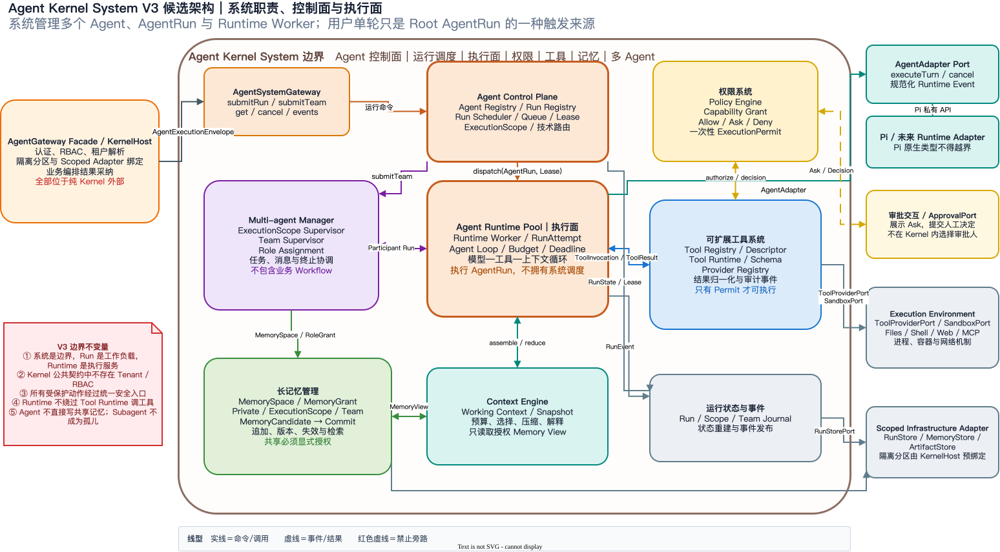
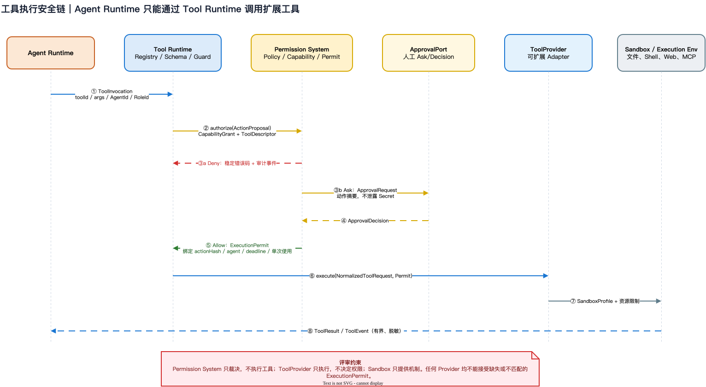
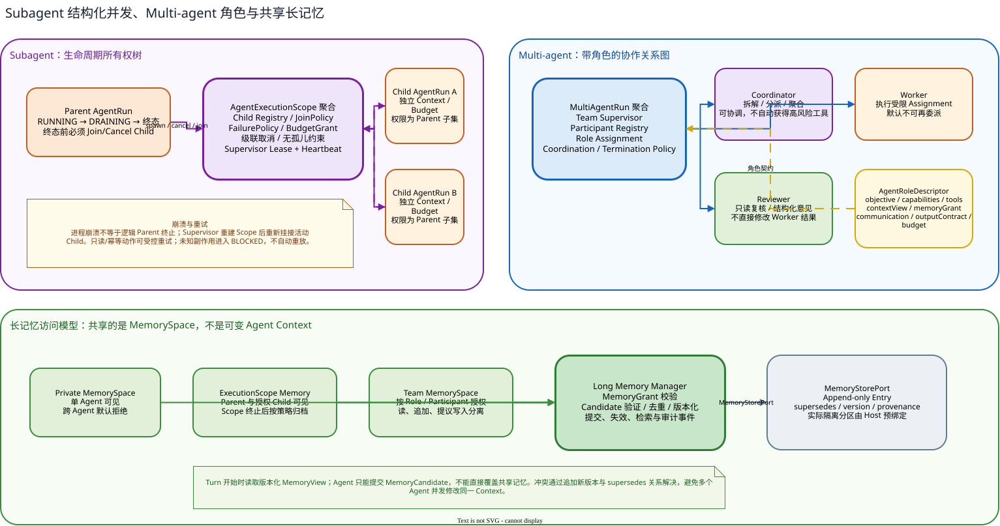

# Agent Kernel V2 初步架构与五步评审

> 状态：评审步骤 1/5——职责边界与关键决策待确认
> 候选变更：`ACR-2026-0008`
> 活动基线：`AKB-2026-09-03-08`（保持不变）
> 实施约束：五步评审全部通过前，不修改 Agent Kernel 运行代码

## 1. 本次调整目标

本候选架构把纯 Agent Kernel 收敛为 Agent 技术执行内核，只理解 Agent、Subagent、Multi-agent、角色、能力、工具、上下文、记忆和运行生命周期。认证、RBAC、租户解析、隔离分区选择和业务结果采纳均位于纯 Kernel 外部。

现有上层接口仍可通过 `AgentGateway Facade / KernelHost` 接收可信请求上下文，但该 Facade 必须先完成隔离绑定，再向纯 Kernel 的 `AgentRuntimeGateway` 传入不含 Tenant/RBAC 语义的运行命令。这样既保持系统级可信边界，又避免租户概念污染 Agent 领域。

本次 Draw.io 只有一个可编辑源文件，包含三个页面：

- [打开可编辑 Draw.io](agent-kernel-v2-review.drawio)
- 页面 1：组件、职责与端口；
- 页面 2：工具与权限安全调用链；
- 页面 3：Subagent 生命周期、Multi-agent 角色与共享长记忆。

## 2. 五步评审流程

| 步骤 | 评审主题 | 必须产物 | 通过条件 | 当前状态 |
|---|---|---|---|---|
| 1 | 职责边界与核心概念 | 候选 Draw.io、组件所有权、待确认决策 | 确认 KernelHost/Kernel 边界及三类核心组件方向 | **待用户确认** |
| 2 | 接口与数据契约 | Port 方法、中文契约、DTO、错误码、事件目录 | 每条跨组件调用有唯一接口和数据所有者 | 未开始 |
| 3 | 生命周期、数据流与韧性 | Agent/Subagent/Team 状态机、时序、故障矩阵 | 无孤儿、取消/崩溃/重试/背压规则闭合 | 未开始 |
| 4 | 安全与架构一致性 | 威胁分析、最小权限矩阵、记忆访问矩阵、依赖图 | 无旁路、无权限升级、无共享记忆越权、上层冲突已解决 | 未开始 |
| 5 | 基线批准与代码授权 | 最终 Draw.io、文档、ACR、迁移和测试计划 | 用户明确批准候选基线，才允许修改代码 | 未开始 |

每一步都单独暂停确认；后一步不能替前一步补授权。任何步骤出现职责扩大或上层冲突，ACR 状态退回影响分析。

## 3. 候选组件与所有权

| 组件 | 拥有 | 明确不拥有 |
|---|---|---|
| AgentGateway Facade / KernelHost | 认证结果消费、RBAC、租户解析、隔离分区和 Scoped Adapter 装配、业务调用映射 | Agent Loop、工具执行策略、Multi-agent 协作语义 |
| AgentRuntimeGateway | 不含租户语义的 Agent/Team 启动、查询、取消和事件接口 | HTTP、用户认证、业务 Workflow |
| Agent Runtime | 单个 `AgentRun`、Agent Loop、预算、Deadline、取消、模型/工具/上下文循环 | 直接调用 ToolProvider、审批人选择、共享记忆直接写入 |
| Permission System | Agent/Role 的 CapabilityGrant、ActionProposal 裁决、Allow/Ask/Deny、ExecutionPermit | Backend RBAC、租户授权、工具执行、Sandbox 机制 |
| Tool System | ToolDescriptor、Schema、Registry、工具调用状态、Provider 选择、结果归一化 | 绕过 Permission、直接创建容器、业务审批 |
| Multi-agent Manager | Parent/Child ExecutionScope、Team、Participant、Role Assignment、消息和终止协调 | 业务 WorkflowStep、业务角色规则、具体模型调用 |
| Long Memory Manager | MemorySpace、MemoryGrant、候选记忆、版本、来源、失效和检索 | 全局无条件共享、直接覆盖共享 Context、租户解析 |
| Context Engine | 单 Turn 工作上下文、选择、预算、压缩和 MemoryView | 长记忆权威存储、业务 Conversation |
| AgentAdapter | Pi/未来 Runtime 的私有类型映射、单轮执行和规范化事件 | Kernel 策略、工具权限、角色或记忆访问决策 |
| Scoped Infrastructure Adapter | Run/Memory/Artifact 存储、Sandbox、进程和网络机制 | Agent 角色、权限策略、协作和业务规则 |

## 4. 当前建议决策

### 4.1 权限系统

权限系统分成两个信任层：

1. `KernelHost` 外部负责用户、租户和业务权限；
2. Kernel 内部 `Permission System` 只负责 Agent 技术动作的最小权限。

Agent Runtime 产生工具意图，Tool Runtime 将其规范化为 `ActionProposal` 后请求权限裁决。只有 `Allow` 返回的 `ExecutionPermit` 才能进入 Provider。Permit 必须绑定 Agent、Role、动作摘要、参数哈希、Deadline 和单次使用标识，禁止转让和重放。

`Ask` 只是技术审批请求。审批展示、审批人选择和通知位于 `ApprovalPort` 外部；Kernel 不拥有业务 ApprovalCase。

### 4.2 可扩展工具

Agent Runtime 只能调用 `ToolRuntime`，不能持有或直接调用 ToolProvider。工具扩展拆成：

- `ToolDescriptor`：稳定 ID、版本、输入输出 Schema、风险、所需 Capability 和 Sandbox Profile；
- `ToolRegistry`：发现与版本选择；
- `ToolRuntime`：Schema 校验、权限请求、Deadline、取消、结果上限和事件；
- `ToolProviderPort`：执行规范化工具请求；
- `SandboxPort`：提供文件、进程、容器和网络隔离机制。

Permission 只裁决，Provider 只执行，Sandbox 只提供机制，三者不得相互代替。

### 4.3 Subagent 生命周期

Subagent 采用结构化并发：Child AgentRun 必须归属于 `AgentExecutionScope`，默认不能脱离 Parent 独立存在。

- Parent 进入终态前必须 Join 或 Cancel 所有活动 Child；
- Parent 取消、Deadline 到期或失败时向下级联取消；
- Child 的预算、Deadline、Capability、Tool 和 MemoryGrant 不得超过 Parent 授权；
- Child 失败以结构化结果返回 Parent，不默认使 Parent 失败；
- 进程崩溃不等同于逻辑 Parent 终止，Supervisor 重建后重新挂接仍可确认的 Child；
- 只读或声明幂等的动作可以受控重试，未知副作用进入 `BLOCKED`，不得自动重放；
- 需要脱离 Parent 长期执行的任务必须成为新的顶层 AgentRun，不能继续称为 Subagent。

### 4.4 Multi-agent 角色

Multi-agent 中每个 Participant 必须绑定显式 `AgentRoleDescriptor`。角色不是人格 Prompt，而是可验证的技术契约，至少包含：

- objective；
- capabilities 与 tools；
- contextView 与 memoryGrant；
- communicationPolicy；
- outputContract；
- budget；
- 是否允许委派。

Kernel 可以提供 Coordinator、Worker、Reviewer 技术模板，但不能硬编码法律顾问、合同审查员等业务角色。首版建议 Supervisor 拓扑，暂不支持无中心 Peer Mesh。

### 4.5 Multi-agent 长记忆

共享的是受控 `MemorySpace`，不是多个 Agent 共同修改一份可变 Context。候选作用域为：

- `Private MemorySpace`：仅单 Agent 可见；
- `ExecutionScope Memory`：Parent 与显式授权的 Child 可见；
- `Team MemorySpace`：按 Role/Participant 授予读、追加、提议写入权限；
- Host 绑定的长期 MemorySpace：可以跨 Team 复用，但其真实隔离范围由 KernelHost 决定，Kernel 只看到不透明 MemorySpaceId。

Agent 只能提交 `MemoryCandidate`。Long Memory Manager 负责权限复核、来源记录、去重、版本化、失效和提交。共享记忆采用 append-only Entry；修订通过 `supersedes` 关系表达，Turn 开始时读取稳定的版本化 `MemoryView`。

## 5. 候选聚合边界

| 聚合根 | 保护的不变量 | 不包含 |
|---|---|---|
| `AgentRun` | 单 Agent 状态、预算、Context/Tool 调用、终止结果 | 子树全部状态、Team、长记忆正文 |
| `AgentExecutionScope` | Parent/Child Registry、Join、级联取消、无孤儿和授权子集 | Child 的全部事件与 Context |
| `MultiAgentRun` | Participant、Role Assignment、协作和团队终止条件 | 业务 Workflow、模型原生 Session |
| `MemorySpace` | 可见性元数据、MemoryGrant、版本游标和保留策略 | 无界 Entry 正文；正文由 MemoryStorePort 管理 |

ToolDescriptor、PermissionDecision 和 ExecutionPermit 是目录项或值对象，不作为大聚合根。

## 6. 步骤一待确认问题

| 编号 | 待确认问题 | 当前建议 |
|---|---|---|
| R1 | 系统级 `AgentGateway` 与纯 Kernel 的接口是否拆开？ | 拆为外部 `AgentGateway Facade/KernelHost` 和内部无租户 `AgentRuntimeGateway` |
| R2 | Permission System 是否拥有人工审批流程？ | 不拥有；只产生 Ask 并消费 ApprovalDecision |
| R3 | 首版是否允许 Shell/Web/MCP ToolProvider？ | 架构保留扩展点，默认不注册；每类 Provider 单独安全评审 |
| R4 | Subagent 是否允许 Detached 模式？ | 不允许；Detached 必须升级为顶层 AgentRun |
| R5 | Multi-agent 是否强制显式角色？ | 强制；每个 Participant 必须绑定 RoleDescriptor |
| R6 | 首版 Multi-agent 拓扑？ | Supervisor + Coordinator/Worker/可选 Reviewer，不做 Peer Mesh |
| R7 | 是否允许跨 Team 长记忆？ | 只允许 Host 显式绑定长期 MemorySpace；Kernel 不自行扩大可见范围 |
| R8 | 共享记忆能否原地修改？ | 不能；只追加版本，通过 supersedes 修订 |

步骤一只有在 R1–R8 获得明确确认后才通过。步骤二将据此展开全部 Port 方法、DTO、错误码、事件和中文契约。
