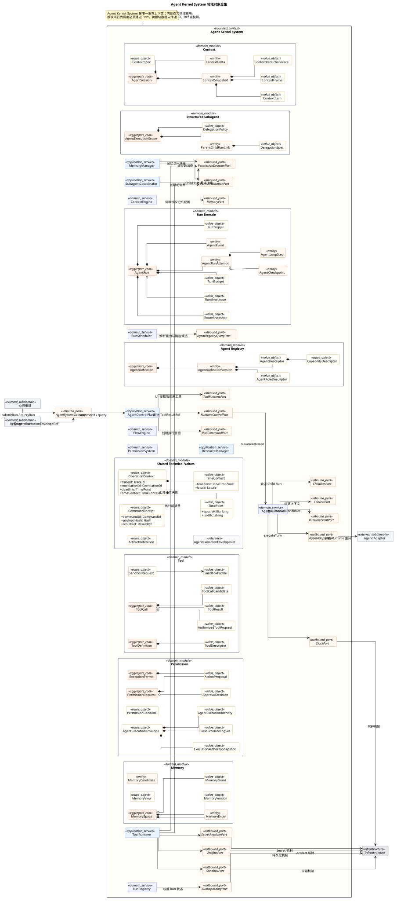
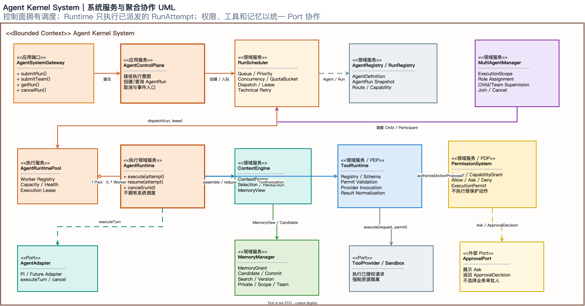

# Agent Kernel System V3 初步架构与五步评审

> 状态：评审步骤 1/5——系统职责、对象关系和边界已经按本轮意见更新，等待明确通过
> 候选变更：`ACR-2026-0008`
> 活动基线：`AKB-2026-09-03-08`（保持不变）
> 候选基线：`AKB-2026-09-03-09`
> 实施约束：五步评审全部通过前，不修改 Agent Kernel 运行代码

## 1. 本次调整结论

本候选设计的系统边界是 **Agent Kernel System**，不是单次用户与 Agent 的交互。系统管理多个 Agent 定义、多个 `AgentRun`、运行调度、Runtime Worker、权限、工具、上下文、记忆以及 Subagent/Multi-agent 协作。用户单轮、业务编排、定时任务、系统事件和 Agent 委派都只是 `AgentRun` 的不同触发来源。

核心对象地位调整为：

- `Agent Kernel System` 是限界上下文，不是一个巨型事务聚合；
- `AgentRun` 是核心执行聚合根；Root Run 表示一次外部执行意图，Child Run 表示受控 Agent 委派；
- `AgentRuntime` 是可重建的执行领域服务，负责执行已经派发的 `AgentRunAttempt`，不拥有系统调度和 Run 权威状态；
- `AgentRunAttempt` 表示一次物理执行尝试，`AgentLoopStep` 表示 Attempt 内部的模型、工具、记忆或委派步骤；
- `AgentContextThread` 是可选的多轮上下文关联，不是业务 `Conversation`，也不承担调度、权限和工具职责；
- `PermissionSystem` 对所有受保护动作做 `Allow / Ask / Deny` 判定，只有 `Ask` 进入外部 `ApprovalPort`；
- `ToolRuntime`、`MemoryManager` 和委派入口是权限执行点，不能绕过 `PermissionSystem`；
- 原始 `TenantContext`、用户身份和 RBAC 留在 `KernelHost`，由其编译为 Kernel 可消费的 Agent 执行身份、授权快照和不透明资源绑定。

这组调整会在候选基线批准后替代活动基线中“Runtime 是聚合根、Session 拥有多次 AgentRun”的建模结论。本阶段只更新图和文档，不修改当前实现。

## 2. 图形产物

本次仍只维护一个可编辑 Draw.io 文件，扩展为五个页面：

- [打开可编辑 Draw.io](agent-kernel-v2-review.drawio)
- 页面 1：Agent Kernel System 组件、职责与端口；
- 页面 2：工具与权限安全调用链；
- 页面 3：Subagent 生命周期、Multi-agent 角色与共享长记忆；
- 页面 4：核心领域对象 UML 类图；
- 页面 5：系统服务与聚合协作 UML 类图。






Draw.io 的 UML 页面采用与 PlantUML 接近的表达：方角类框、`<<聚合根>>`/`<<领域服务>>` stereotype、属性分区、实心菱形表示组合、空心菱形表示聚合、实线表示关联、虚线表示依赖。颜色继续沿用总体架构语义。

## 3. 五步评审流程

| 步骤 | 评审主题 | 必须产物 | 通过条件 | 当前状态 |
|---|---|---|---|---|
| 1 | 系统职责、边界与核心对象 | 候选 Draw.io、UML 类图、组件所有权、候选决议 | 明确确认 System/Run/Runtime、权限、工具、记忆和 Multi-agent 地位 | **已更新，待明确确认** |
| 2 | 接口与数据契约 | Port 方法、中文契约、DTO、错误码、事件目录 | 每条跨组件调用有唯一接口、语义和数据所有者 | 未开始 |
| 3 | 生命周期、数据流与韧性 | Run/Attempt/Step、Subagent/Team 状态机、故障矩阵 | 调度、暂停、恢复、取消、背压和无孤儿规则闭合 | 未开始 |
| 4 | 安全与架构一致性 | 威胁分析、最小权限矩阵、记忆访问矩阵、依赖图 | 无旁路、无权限升级、无共享记忆越权、上层冲突已处理 | 未开始 |
| 5 | 基线批准与代码授权 | 最终 Draw.io、文档、ACR、迁移和测试计划 | 用户明确批准候选基线后才允许修改代码 | 未开始 |

每一步都单独暂停确认。任何步骤发现职责扩大、上层冲突或安全边界无法落实，ACR 必须退回影响分析，不能用代码先行替代架构批准。

## 4. 系统职责与边界

### 4.1 Agent Kernel System 拥有

- `AgentDefinition`、`AgentDescriptor`、能力描述和技术角色模板；
- `AgentRun` 的创建、技术状态、调度、取消、预算和事件；
- `AgentRunAttempt`、Runtime Lease 和技术恢复决策；
- Agent Loop、上下文组装与本轮工作上下文；
- `PermissionRequest`、Agent 技术授权、`Allow / Ask / Deny` 和一次性 `ExecutionPermit`；
- 工具目录、Schema、调用技术状态、Provider 选择与结果归一化；
- `AgentExecutionScope`、Parent/Child 生命周期和无孤儿约束；
- `MultiAgentRun`、Participant、显式角色、通信和终止策略；
- Private、ExecutionScope、Team 以及 Host 显式绑定的长期 `MemorySpace`；
- 规范化技术事件、健康贡献、Trace 和指标。

### 4.2 Agent Kernel System 明确不拥有

- 用户认证、Tenant Resolver、Backend RBAC 和业务组织模型；
- `WorkflowInstance`、`WorkflowStep`、业务状态机和业务补偿；
- 业务 `Conversation`、业务 Message 和前端投影权威状态；
- 业务 `ApprovalCase`、审批人选择、通知和业务审批政策；
- 业务角色定义、业务结果采纳和任何法律业务规则；
- 具体容器、进程、数据库、文件系统、密钥和网络实现机制；
- Pi、ACP 或未来 Runtime 的原生 Session、Event、Tool 和 Provider 类型。

## 5. 核心对象关系

### 5.1 聚合与实体

| 对象 | 类型 | 生命周期与所有权 | 关键关系 |
|---|---|---|---|
| `AgentDefinition` | 聚合根 | 跨 Run 长期存在，版本化演进 | 一个定义可实例化多个 Run |
| `AgentRun` | 核心聚合根 | 从提交到成功、失败、取消、超时或安全中断 | 引用 AgentDefinition；属于一个 ExecutionScope；可有 Parent Run |
| `AgentRunAttempt` | Run 内实体 | Runtime 获得 Lease 后创建；崩溃恢复创建新 Attempt | 一个 Run 有一到多个 Attempt |
| `AgentLoopStep` | Attempt 内实体/事件投影 | 一次模型、工具、记忆或委派步骤 | 一个 Attempt 有零到多个严格排序 Step |
| `AgentExecutionScope` | 聚合根 | 与 Root Run 执行树一致；Child 全部终止后关闭 | 聚合 Parent/Child Run 注册、Join、取消和预算委派 |
| `MultiAgentRun` | 聚合根 | 团队建立到终止条件满足 | 组合 Participant；每个 Participant 引用一个 AgentRun 和一个角色 |
| `PermissionRequest` | 聚合根 | 受保护动作提出到 Allow/Ask/Deny 终态 | 绑定 Run、动作摘要、资源和权限快照版本 |
| `ExecutionPermit` | 值对象 | Allow 后生成，短期且默认单次使用 | 绑定 Run、Agent、动作摘要、资源和 Deadline |
| `MemorySpace` | 聚合根 | 独立于单个 Run，可按作用域归档或长期存在 | 组合 append-only MemoryEntry；由 MemoryGrant 控制访问 |
| `AgentContextThread` | 可选关联对象 | 跨多个 Root Run 维护上下文版本 | 只保存 Run 引用和 ContextDelta，不拥有 Run |

### 5.2 不是聚合根的 AgentRuntime

`AgentRuntime` 是执行领域服务：

```text
RunScheduler --dispatch(run, lease)--> AgentRuntime
AgentRuntime --execute--> AgentRunAttempt
AgentRuntime --> ContextEngine
AgentRuntime --> ToolRuntime
AgentRuntime --> AgentAdapter
```

Runtime Worker 可以被销毁和重新创建；Run、Attempt、事件和权限请求必须由系统数据面重建。一个 Runtime 可以依次执行多个 Run；一个 Run 同一时刻最多只有一个有效 Runtime Lease。

### 5.3 Run 的触发来源

```text
AgentRunTrigger
├── UserRequestTrigger
├── BusinessWorkflowTrigger
├── ScheduledTaskTrigger
├── SystemEventTrigger
├── AgentDelegationTrigger
└── RecoveryTrigger
```

因此只有 Root Run 的某些触发来源对应用户单轮；Agent System 本身不能被建模成单轮交互。

## 6. 系统组件与所有权

| 组件 | 拥有 | 明确不拥有 |
|---|---|---|
| `AgentGateway Facade / KernelHost` | 外部身份验证结果、Tenant/RBAC 解释、隔离分区、Scoped Adapter 装配 | Agent Loop、技术调度和 Agent 权限策略 |
| `AgentSystemGateway` | 不含 Tenant/RBAC 语义的 Run/Team 提交、查询、取消和事件接口 | HTTP、用户认证、业务 Workflow |
| `AgentControlPlane` | 执行意图接收、Run 创建、查询、取消和事件入口 | 模型循环和具体资源执行 |
| `RunScheduler` | Queue、Priority、并发、QuotaBucket、Deadline、Lease、技术重试和 Runtime 派发 | 业务工作流顺序、结果采纳和业务优先级解释 |
| `AgentRegistry / RunRegistry` | AgentDefinition、Capability、Run Snapshot 和 Route Snapshot | 具体 Adapter 创建、业务 Agent 角色 |
| `AgentRuntimePool` | Worker 容量、健康和执行 Lease | Run 权威状态、业务调度 |
| `AgentRuntime` | 单个 Attempt 的 Agent Loop、预算、Deadline、取消和执行协调 | 系统调度、用户身份解释、直接资源访问 |
| `PermissionSystem` | CapabilityGrant、ActionProposal、Allow/Ask/Deny、ExecutionPermit | Backend RBAC、审批人选择、工具和 Sandbox 执行 |
| `ToolRuntime` | ToolDescriptor、Schema、Registry、Permit 校验、Provider 调用和结果归一化 | 绕过 Permission、直接创建容器、业务审批 |
| `MultiAgentManager` | ExecutionScope、Team、Participant、Role Assignment、Join 和级联取消 | WorkflowStep、业务角色规则、业务结果采纳 |
| `MemoryManager` | MemorySpace、MemoryGrant、Candidate、版本、来源、失效和检索 | 全局无条件共享、直接覆盖共享 Context、租户解释 |
| `ContextEngine` | Run 工作上下文、选择、预算、压缩、ContextFrame 和 MemoryView | 长记忆权威存储、业务 Conversation |
| `AgentAdapter` | Pi/未来 Runtime 私有类型映射和规范化事件 | Kernel 策略、权限、角色、工具和记忆决策 |

## 7. 关键控制流

### 7.1 Run 提交和调度

```text
AgentSystemGateway
    → AgentControlPlane 创建 AgentRun(QUEUED)
    → RunScheduler 检查依赖、预算、并发和资源桶
    → AgentRuntimePool 选择健康 Worker
    → Scheduler 签发 Runtime Lease
    → AgentRuntime 创建 AgentRunAttempt
    → Agent Loop 执行
    → Run 进入终态或可恢复等待状态
```

调度器只能决定技术执行顺序、资源和重试；不能决定业务 Workflow 的下一步。

### 7.2 权限判定与人工 Ask

```text
AgentRuntime
    → ToolRuntime / MemoryGateway / DelegationGateway
    → PermissionSystem.authorize(ActionProposal)
        ├── Deny  → 拒绝并审计
        ├── Allow → 签发一次性 ExecutionPermit
        └── Ask   → PermissionRequest → ApprovalPort
                                  → ApprovalDecision
                                  → Permit 或拒绝
```

所有具有安全影响的访问都必须经过权限判定，但不是所有访问都需要人工审批。ToolRuntime、MemoryGateway、DelegationGateway、SecretResolver 和 ArtifactExporter 是权限执行点；PermissionSystem 是权限决策点，不能直接执行受保护动作。

### 7.3 记忆和上下文

```text
MemorySpace --授权版本化视图--> ContextEngine
ContextEngine --ContextFrame--> AgentRuntime
AgentRuntime --MemoryCandidate--> MemoryManager
MemoryManager --权限复核/追加/版本化--> MemorySpace
```

Agent 不直接覆盖共享记忆。共享更新使用 append-only `MemoryEntry` 和 `supersedes` 关系；Run 开始或每个模型 Turn 开始时读取稳定的 `MemoryView`。

### 7.4 Subagent 和 Multi-agent

- Child AgentRun 必须属于 Parent 的 `AgentExecutionScope`；Parent 进入终态前必须 Join 或 Cancel 活动 Child；
- Child 权限为 Parent 权限、角色权限、委派请求和系统安全上限的交集；
- Multi-agent Participant 必须绑定显式 `AgentRoleDescriptor`；
- Coordinator、Worker、Reviewer 是技术模板，不是法律业务角色；
- Child/Participant Run 仍由统一 `RunScheduler` 调度，禁止 Runtime 递归实例化游离 Runtime。

## 8. 身份、授权与租户边界

Kernel 应当身份无业务语义，但不能没有执行主体。`KernelHost` 把外部身份编译为：

```text
AgentExecutionEnvelope
├── AgentExecutionIdentity
│   ├── agentId / runId / rootRunId
│   ├── parentRunId? / teamRunId? / roleId?
│   └── externalPrincipalRef
├── ExecutionAuthoritySnapshot
│   ├── capabilityGrants / toolGrants / memoryGrants
│   ├── delegationGrant / sandboxProfileRef
│   └── issuedAt / expiresAt / policyDecisionRef
├── ResourceBindingSet
└── OperationContext
```

纯 Kernel 不解释 tenantId、userId、组织和 RBAC。`ResourceBindingSet` 只暴露 WorkspaceHandle、MemorySpaceHandle、ArtifactStoreHandle 和 SecretHandle；Host 装配的 Scoped Adapter 在 Kernel 外部执行真实隔离。

## 9. 与活动基线 ACR-2026-0007 的关系

远端 `develop` 的活动基线已经实现并批准 `ACR-2026-0007`。本候选不是否认其代码价值，而是根据后续系统边界评审提出正式演进：

| 活动基线结论 | V3 候选结论 | 处理方式 |
|---|---|---|
| Runtime 是唯一聚合根 | Agent Kernel System 是限界上下文；AgentRun 是核心聚合根；Runtime 是执行服务 | 批准 ACR-0008 后迁移，不在本阶段改代码 |
| Session 拥有多次 AgentRun | AgentContextThread 仅关联多个 Root Run，不拥有调度和权限 | 步骤二重新定义契约 |
| AgentRun 是 Session 内实体 | AgentRun 独立保护执行状态、预算、授权引用和终态不变量 | 步骤三验证事务和恢复边界 |
| Permission 只同步 Allow/Deny | Permission 支持 Allow/Ask/Deny；Ask 经外部 ApprovalPort | 步骤二定义 Port，步骤四做安全评审 |
| Runtime 绑定租户 | KernelHost 绑定租户和资源；Runtime 消费不含租户业务语义的执行授权 | 步骤四验证隔离与审计映射 |

活动代码和 `AKB-2026-09-03-08` 在候选批准前保持有效。图、文档和代码不一致被明确记录为候选迁移差距，不能在五步评审期间静默修正实现。

## 10. 步骤一候选决议

| 编号 | 候选决议 | 建议状态 |
|---|---|---|
| R1 | 系统边界是 Agent Kernel System，不是用户单轮或单个 Runtime | 接受 |
| R2 | AgentRun 是核心执行聚合根；Root/Child 通过触发源和 Parent 关系区分 | 接受 |
| R3 | AgentRuntime 是可重建执行服务，RuntimePool 受 Scheduler 管理 | 接受 |
| R4 | AgentContextThread 是可选多轮上下文关联，不是业务 Conversation | 接受 |
| R5 | RunScheduler 只管理技术调度，不拥有业务 Workflow | 接受 |
| R6 | KernelHost 把用户/租户身份编译为 AgentExecutionEnvelope 和 Scoped Handles | 接受 |
| R7 | PermissionSystem 对全部受保护动作判定；只有 Ask 进入 ApprovalPort | 接受 |
| R8 | ToolRuntime 是统一工具执行入口，Provider 和 Sandbox 不得绕过 Permit | 接受 |
| R9 | MemorySpace 是独立聚合；Agent 只提交 Candidate，不直接覆盖共享记忆 | 接受 |
| R10 | Subagent 采用结构化并发；Multi-agent 强制显式角色并统一调度 | 接受 |

步骤一只有在以上决议获得明确确认后才标记通过。步骤二将据此展开 `AgentSystemGateway`、`RunSchedulerPort`、`PermissionPort`、`ApprovalPort`、`ToolRuntimePort`、`MemoryPort` 和 `MultiAgentPort` 的方法、DTO、错误码、事件与完整中文契约。
