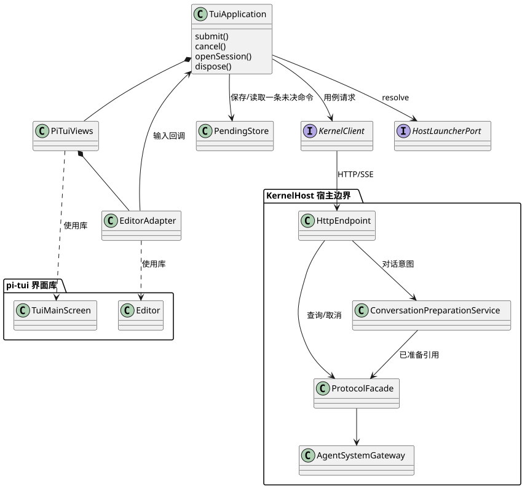

# Kernel TUI：组件职责与功能域

## 1. 目标、约束与证据边界

LawClaw TUI 是应用主体：使用 pi-tui 实现界面，同时调用 Kernel Client 提交任务。用户输入经应用用例转换为请求；服务通知触发当前快照刷新；应用调用 pi-tui 渲染。KernelHost 是包含接入端点和装配组件的进程边界，不是额外业务转发层。

适用于受信本机、单终端前台视图，可连接同用户的已有宿主。首期单 Session 串行提交，多个客户端仍由服务端执行单活约束。UI reducer 在同一事件循环同步执行；异步返回携带 selectionGeneration，不能假定网络响应按发起顺序返回。

现状：`src/pi-cli/extension.ts` 使用 Pi 原生循环并注册工具；不是本组件。`src/application/flow-http-routes.ts` 有任务提交/查询/取消，但缺少连续会话和公开流式协议。`packages/tui/src/index.ts` 已导出下面的库组件。此次无运行实现或实测承诺。

## 2. Pi 复用与依赖

| 能力 | 复用对象 | LawClaw 负责 |
|---|---|---|
| 终端生命周期与刷新 | ProcessTerminal、TuiMainScreen | 装配、错误退出时恢复终端 |
| 输入与粘贴 | Editor、CombinedAutocompleteProvider | 提交动作、草稿、命令含义 |
| 对话排版 | Markdown、Text、VStack、Box | 安全清洗、消息投影及有界记录 |
| 选择与交互 | SelectList、SettingsList、KeybindingsManager | 会话/Agent选择、动作表、焦点优先级 |
| 状态 | Loader、TruncatedText | 连接与Run状态映射 |

不导入 pi-coding-agent 的 InteractiveMode、AgentSessionRuntime 或 SessionManager。不复用 Pi 模型循环、工具调度和 Session 文件。TUI 不读 Kernel 数据库、不直接访问 Runtime/Provider。

[PlantUML 类图源](../../../diagrams/clients/kernel-tui/structure.puml)。虚线表示库依赖，实线标注请求或事件；不把图中布局位置当作调用方向。

## 3. 最小结构与状态所有权

一个应用实例只连接一个宿主，前台只观察一个Session/Run。服务拥有会话、执行与审批权威事实；客户端只有当前草稿、连接状态、当前快照和一条未决命令。首期不构造后台会话缓存、乱序事件队列或跨客户端锁。

| 单元 | 实现形态 | 职责与生命周期 |
|---|---|---|
| TuiApplication | 一个应用对象 | 装配、调用用例、当前视图、退出finally |
| connection/conversation/observation/navigation/approval | 功能域模块 | 简单用例方法；有真实状态才持有局部状态 |
| PiTuiViews/EditorAdapter | 组件组合与薄适配 | 使用Pi公开接口、焦点、提交正文保护 |
| KernelClient | 一个HTTP/SSE适配器 | 规范请求/解码/ACK；不自动重发写 |
| HostLauncherPort | 外部依赖契约 | 返回唯一已就绪宿主；锁和恢复归提供方 |
| PendingStore | 两个本地文件 | 单实例未决命令和书签；不是服务准备数据库 |

直接用例调用`await client.method(...)`并处理返回，局部状态转换可提纯函数。**不建立ClientEffect执行框架，不要求每个动作对应类或Port。** 应用持有当前状态并调用views.render；没有独立ViewStore/EventReducer服务。异步查询按generation过滤，写事实按pending命令匹配，不因视图切换丢失事实。

跨域约束只有：单连接、单前台订阅、单未决写、草稿切换前处理、退出不取消。每个Promise/timer/订阅只由发起模块释放；dispose幂等。状态值使用const与可辨识联合，运行实现不使用enum或any。

### 3.1 复杂度决策

| 机制 | 场景需要 | 选择 |
|---|---|---|
| 宿主唯一性 | 两终端同时启动 | 依赖Launcher，不把OS锁写入TUI |
| 提交恢复 | 请求已发但回执丢失 | 保存原命令，查询；不维护Host准备阶段 |
| 流恢复 | 重连/缺口 | 一致快照替换；不乱序重排 |
| 会话切换 | 查看另一会话 | 清前台后查询；草稿先处理，无LRU |
| 输入保护 | Pi提交先清空 | EditorAdapter同步恢复，不改Pi核心 |
| 扩展 | 二/三期导航审批 | 固定命令与视图表，不建插件框架 |

## 4. 功能域与公共架构追踪

| SR | 范围 | 阶段 |
|---|---|---|
| [SR-TUI-01](sr-01-host-connection.md) | 连接与宿主生命周期 | 1 |
| [SR-TUI-02](sr-02-conversation.md) | 首次对话、追问及取消 | 1 |
| [SR-TUI-03](sr-03-run-observation.md) | 流与执行观察 | 文本/状态1；工具/Child2 |
| [SR-TUI-04](sr-04-session-navigation.md) | 会话与配置选择 | 恢复当前会话1；完整导航2 |
| [SR-TUI-05](sr-05-approval-interaction.md) | 审批交互 | 3 |
| [SR-TUI-06](sr-06-terminal-interaction.md) | 终端交互 | 基础1；扩展选择器2/3 |

共享AR不构成SR上层需求：连接代次服务01/03/04；命令恢复服务02/05；当前Run快照服务02/03/04；动作注册表服务02/04/05/06。各SR定义本域算法，不另建万能Manager。

## 5. 候选实现映射与扩展

未来源码位于 `src/clients/kernel-tui/`，按connection、conversation、observation、navigation、approval、terminal分域；application.ts装配，kernel-client.ts为协议适配，公共类型归contracts。此为设计映射，本次不创建源码。同一字段/协议只有[公共契约](../../../contracts/kernel-tui-contract.md)一个定义。

新增工具进度视图先使用服务快照的公开摘要；必要时扩充契约与视图字段，再增加独立夹具。通知事件复用刷新当前快照路径，不为每种事件新增客户端状态机；协议增量必须先协商能力。

## 6. 交付与审查

[协议索引](protocol-index.md)、[评审与依赖](../../../../governance/reviews/kernel-tui-design-review.md)、[验证记录](../../../../verification/kernel-tui-design-validation.md)。SR保留候选场景规格；本轮已实现局部客户端规则和10项测试，映射见验证记录；完整SR与整链仍未交付。六个功能域在明确约束和依赖契约下可独立开发；Host准备存储等内部实现不属于TUI开发就绪门槛。服务能力仍是联合运行前置条件；不宣称Kernel实现或运行验收完成。

## 7. 第一期真实链路验收（评审修订）

用户已确认六项修正：刷新补查、revision换流、仅书签恢复、正常整链、窄屏命令和正文分页。它们进入当前设计，不以额外框架解决。第一期使用已配置且无需人工审批的文本Agent；意外waiting_approval只提示需要有权客户端处理并允许取消，不自动批准。服务、Launcher与真实存储必须交付，不能仅以FakeClient模拟成功代替整链。

以下E2E归本组件跨域验收，拟实现于test/system/kernel-tui-chain.test.ts；模型/外部工具使用确定性替身，TUI、Launcher、Host、HTTP/SSE、Kernel与存储必须真实。固定流屏障，记录模型输入、请求次数、Session/Run身份及终端输出。当前均未实现、未运行。

| ID | 流程及独立断言 | 责任域 |
|---|---|---|
| TUI-E2E-01 | 冷启动、两并发启动者、连接已有宿主；同profile只有一个hostInstanceId | 01 |
| TUI-E2E-02 | 首次提问→分段输出→完成→历史采纳→追问；1 Session、2 Run，第二轮模型输入含已采纳历史，暂停屏障前终端已显示部分回答 | 01/02/03/06 |
| TUI-E2E-03 | 活动Run期间连续Enter；请求数不增，仍可编辑且草稿保留 | 02/06 |
| TUI-E2E-04 | 正常取消、取消先到、完成先到；回执仅表示请求，权威结果不被覆盖 | 02/03 |
| TUI-E2E-05 | 受理后丢响应并重启TUI；查原command，Session/Run创建次数均不增 | 01/02/04 |
| TUI-E2E-06 | 流中断、事件缺口、最后通知与快照交错；补查完整结果，无工具/模型重放 | 01/03 |
| TUI-E2E-07 | 退出后分别从pending和仅bookmark恢复；原任务继续，无cancel/shutdown | 01/02/04 |
| TUI-E2E-08 | 准备中及已受理两个窗口重启Host；查原事实，恢复结果明确，无盲目重放 | 01/02及Host |
| TUI-E2E-09 | 模型失败后查询Session释放/历史状态，再合法追问；不使用旧anchor | 02/03 |
| TUI-E2E-10 | 29列取消、32KiB以上中文分页及返回；控制命令可达，完整正文可读 | 03/06 |

结构门禁另检查客户端禁止导入Repository/Runtime/Provider/Pi AgentSessionRuntime。公共契约测试覆盖同键同载荷、异载荷冲突、未知/拒绝/查询失败区别、snapshot与subscribe窗口及未授权读/订阅/取消。各服务提供方承担保证，TUI不重复实现。
