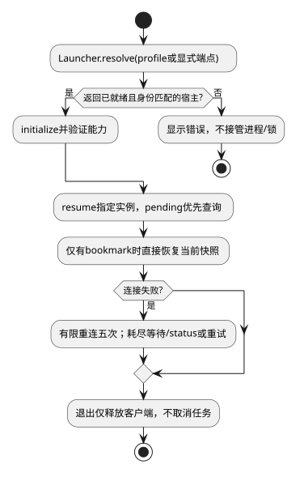

# 宿主连接与生命周期

候选规格；接口唯一来源为[公共契约](../../../contracts/kernel-tui-contract.md)。组件结构与分期见[组件入口](README.md)。

## 0. 适用约束与复杂度取舍

| 场景需要 | 已有保证/保证方 | 最小方案与验证 |
|---|---|---|
| 启动本机交互 | 受控Launcher保证同profile唯一、身份匹配且就绪 | 一次resolve调用；TUI不读锁文件、不管理PID；TUI-01A |
| 查看任务 | 一个TUI连接一个宿主 | 一份连接状态；无多宿主路由 |
| 短暂断线 | 服务保留任务及原命令回执 | 有限重连后查询；不重放执行；TUI-01C |

首期macOS/Linux。显式端点不可用时不启动替代宿主。Launcher内部OS锁、开库和恢复不在本域设计。用户负责使用其有权访问的profile；实际身份仍由Launcher/Host验证。

## 1. 接口、算法与状态

仅保留一个连接用例模块，依赖[公共契约](../../../contracts/kernel-tui-contract.md)中的HostLauncherPort与KernelClient。内部数据为`ConnectionState = {phase: "idle"|"connecting"|"ready"|"offline"|"blocked"|"closed", generation:number, retryCount:number, endpoint:HostEndpoint|null, error:BoundaryError|null}`。无需独立Discovery/Credential/ClientFactory管理器。

`connect(mode, signal): Promise<void>`先递增generation并中止旧连接请求，调用Launcher.resolve取得已验证endpoint/凭据引用，再initialize。token由可信适配器注入HTTP头，View不接收token。启动等待15秒、initialize5秒；超时只停止等待，不终止宿主。首期要求conversation/stream/commandLookup，defaultSelection可为null：无可用配置时禁止提交并显示原因。

| 输入/条件 | 动作 | 状态 |
|---|---|---|
| idle/offline下连接 | resolve后initialize | connecting |
| initialize成功且代次仍匹配 | 查询本客户端未决命令，再恢复书签快照 | ready |
| 临时失败 | 0.5/1/2/4/8秒重连，各次一个timer | connecting；五次耗尽offline |
| 401/主版本不符/身份不符 | 清理当前敏感投影，停止自动重连 | blocked |
| retry | 清错误及计数，再connect | connecting |
| quit | abort客户端I/O、清timer、dispose | closed |

为本机有限重连不引入随机抖动源。getCommand及快照查询最多一次在途，普通查询超时不叠加第二个循环。ready只表示连接可用，Conversation仍可能处于unknown/syncing而禁止新提交。

旧连接的查询/事件返回直接丢弃；已发送写请求不能据此视为失败，保持pending，由新连接查询原command。写回执仅在同pending commandId、同scope且未被解决时采纳，与当前前台是否切换无关。禁止丢弃写事实后生成新ID。

close幂等；closed后回调不更新界面，保留磁盘pending供下次查询。关闭TUI不发cancel/shutdown。无后台宿主存活检测线程，无自动进程接管。

本域本地数据只有输入profile和当前连接内存；书签/未决命令存储归SR-02。必要契约测试：Launcher两客户端resolve返回同一宿主；超时不调用kill；identity不匹配零submit；服务内部如何满足唯一性另行验收。

## 2. 场景流程

[流程源](../../../diagrams/clients/kernel-tui/sr-01.puml)。异常分支的精确输入、屏障与恢复结果见下表；正常动作的权威写入方以第1节为准。

## 3. SFMEA

风险为定性评审，不虚构发生率/RPN。

| 故障 | 原因 | 检测 | 控制与恢复 |
|---|---|---|---|
|宿主重复启动|并发发现不存在|比较Launcher返回hostInstanceId|依赖Launcher唯一性，TUI不抢锁|
|服务失联|进程退出/连接失败|连接状态和retry计数|有界重连，未知写先查询|
|凭据不匹配|错误用户profile|401/身份校验失败|BLOCKED；不回退匿名或重新创建服务|

## 4. 场景到验收映射

本表为候选场景规格；已实现的局部测试与实际执行状态单独见[验证记录](../../../../verification/kernel-tui-design-validation.md)。不能以局部测试通过声称整个场景或真实链路已通过。

| 场景/测试ID | 前置与输入 | 操作/注入 | 独立期望及禁止行为 | 层级/拟实现位置 |
|---|---|---|---|---|
| SC-01A / TUI-01A | 空描述符、两并发启动者 | Launcher替身延迟返回就绪 | Launcher契约返回同instance；TUI不读锁/不调用kill | integration / test/integration/kernel-tui-host-connection.test.ts |
| SC-01B / TUI-01B | 端点存在但主版本不兼容 | 执行initialize | 零submit；显示版本错误 | contract / test/contract/kernel-tui-host-connection.test.ts |
| SC-01C / TUI-01C | 有待确认命令，连接中断 | 注入回执丢失后重连 | 先查原命令；不创建第二Run | integration / test/integration/kernel-tui-host-connection.test.ts |
| SC-01D / TUI-01D | Run执行中 | 退出终端并重新接回 | 客户端资源释放；Run继续；无shutdown/cancel请求 | system / test/system/kernel-tui-host-connection.test.ts |

## 5. 交付、升级与结构验收

第一期。组件结构验收同时检查依赖和状态所有权：本域仅通过KernelClient/Launcher获取服务事实；直接更新当前视图，不访问执行器或服务端存储。

本地格式与协议分别版本化；未知主版本拒绝读取/连接，不自动迁移或删除未决记录。升级前断开客户端，保留未决命令与书签，宿主不因UI升级重启。回退只使用匹配协议/本地格式的版本。在本页场景约束及公共契约下，客户端模块可独立开发与替身测试；服务实现未交付不等于客户端还需设计其内部机制。联合运行仍待服务实现及验收。
