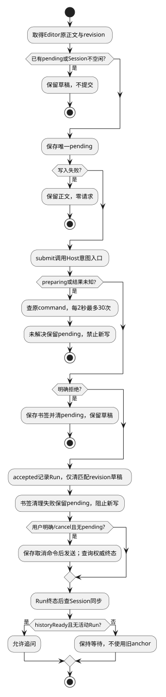

# 对话提交与取消

候选规格；接口唯一来源为[公共契约](../../../contracts/kernel-tui-contract.md)。组件结构与分期见[组件入口](README.md)。

## 0. 适用约束与复杂度取舍

| 场景需要 | 已有保证/保证方 | 最小方案与验证 |
|---|---|---|
| 顺序追问 | 服务端Session单活、历史采纳和版本校验 | UI占用标志防重复Enter，不实现排队/steer；TUI-02C |
| 失联后确认提交 | Host提供原命令查询和幂等事实 | 一条当前未决记录，未知只查询；TUI-02D |
| 输入不能丢 | EditorAdapter提供展开正文和用户revision | 仅一个内存草稿及提交副本，无草稿数据库；TUI-02F |

每个TUI同时只处理一个未确认写命令；它可为submit/cancel/approval。未知写未解决时不切换会话、不发新写，但允许查询和退出。其他客户端竞争由服务端拒绝，TUI不做跨客户端协调。

## 1. 数据、用例与状态

`ConversationState = {phase:"editable"|"saving"|"waiting"|"unknown"|"active"|"cancelRequested"|"syncing", target:SessionAnchorView|null, run:RunView|null, draft:{text:string,revision:number}, submitted:{text:string,revision:number}|null, pending:PendingRecord|null}`。状态是界面操作阶段，不复制Host preparation状态机。方法为`submit(text,revision)`、`cancel()`、`refresh()`；方法直接await Client并更新局部状态，不返回effect描述。

submit先检查连接ready、editable、有效配置与非空文本；同步设saving并固定UUID命令身份。输入使用EditorAdapter原正文（不trim，仅用trim判断空），new逻辑键在这次命令内固定；existing使用getSession返回的anchor。Host负责材料授权、候选组装和Session创建，TUI不保存这些步骤。

保存pending成功后才发送。准备中/preparing映射waiting；accepted安装服务Session/Run，清除匹配revision的已提交草稿；新编辑的草稿保留。明确rejected保留草稿并回editable，冲突先刷新Session；如果其他客户端Run占用，转active只读观察。transport失败/查询NOT_FOUND到unknown，不推断未执行。

未知/准备中查询使用原ID，每2秒一次、不重叠，30次后停止自动查询并显示“待确认，使用/status重查”；pending保留且禁止新写。不自动POST重发。GONE同样停止并说明无法由客户端确认，需要服务侧核对；不得静默删除。退出不会放弃服务任务。

| 条件 | 动作与确认点 |
|---|---|
| 本地保存失败 | 不发送，回editable，保留原正文 |
| accepted但书签写失败 | 内存可展示Run，pending保留，禁止下一写直到/status完成本地清理 |
| Run终态 | phase=syncing；每2秒查Session，最多30次 |
| historyReady且activeRunId=null | 采用新anchor，回editable |
| 同步失败/耗尽 | 保持syncing，/status重查；不拿旧anchor追问 |
| 明确cancel | 独立命令持久化后发送；回执只设cancelRequested |
| 完成先于取消 | 保留完成结果；只有Run权威查询/事件决定终态 |

### 最小本地恢复记录

记录唯一类型见公共契约§6。每次启动创建随机clientInstanceId及独占新目录；不同TUI从不写同一记录。默认启动不抢其他实例pending，`--resume-client <id>`读取指定实例的pending和bookmark并验证格式、profile与scope后复制到新实例目录。pending优先：先查询并解决原命令，再恢复确认后的书签；只有bookmark时直接查询对应Run/Session，无需pending存在。两者都不存在则显示恢复目标不存在，不创建Session。默认启动保持新会话，不扫描或猜测最近实例；正常退出前显示恢复命令。恢复不重发写。即使两个客户端读取同旧记录也只有幂等查询，不共享锁。终端提示恢复ID。

位置为用户私有`$XDG_STATE_HOME/lawclaw/tui`，未设置时`~/.local/state/lawclaw/tui`；仅macOS/Linux。目录0700，文件0600，拒绝符号链接。pending.json存schemaVersion=1、scopeId/profileKey、commandId、operation、targetRef、原input；没有token、UI投影或Host阶段。每实例只允许一条≤64KiB记录。原子写使用同目录独占临时文件→写完fsync→rename→目录fsync；失败不发送，未知崩溃点统一查询。

accepted/rejected确认后：先原子保存bookmark.json（scope/profile、sessionId/runId或null），再unlink pending并同步目录；清理失败保留pending并阻止新写。不自动GC未知记录。正常退出有草稿则确认丢弃，默认仅内存；未知记录仍保留。损坏/未知版本停止恢复，不修复字段、不删除正文、不发送任务。

服务未收到请求但客户端已保存pending也可能得到NOT_FOUND，本设计明确保守停留unknown；不为这一低频窗口新增服务撤销/封闭协议。用户可退出后人工核对，不把NOT_FOUND当新任务授权。

## 2. 场景流程

[流程源](../../../diagrams/clients/kernel-tui/sr-02.puml)。异常分支的精确输入、屏障与恢复结果见下表；正常动作的权威写入方以第1节为准。

## 3. SFMEA

风险为定性评审，不虚构发生率/RPN。

| 故障 | 原因 | 检测 | 控制与恢复 |
|---|---|---|---|
|受理未知|写后断线|pending命令及lookup|保留身份，只查原命令|
|候选错误绑定|Session被其他请求创建|created=false/anchor冲突|重新按赢家快照准备|
|提前追问|Run结束但Session未采纳|Session binding仍占用|保持提交禁用，查询确认|

## 4. 场景到验收映射

本表为候选场景规格；已实现的局部测试与实际执行状态单独见[验证记录](../../../../verification/kernel-tui-design-validation.md)。不能以局部测试通过声称整个场景或真实链路已通过。

| 场景/测试ID | 前置与输入 | 操作/注入 | 独立期望及禁止行为 | 层级/拟实现位置 |
|---|---|---|---|---|
| SC-02A / TUI-02A | 无Session，材料必需且不可读取 | 在Context准备注入失败 | Session/Run创建均为0，草稿保留 | integration / test/integration/kernel-tui-conversation.test.ts |
| SC-02B / TUI-02B | Session@7已空闲，完成后推进@8 | 先追问再注入旧anchor提交 | 使用服务历史；旧版本冲突，不拼接UI历史 | contract / test/contract/kernel-tui-conversation.test.ts |
| SC-02C / TUI-02C | 同Session两个客户端 | 同时提交并暂停受理 | 最多一活动绑定；失败者草稿保留 | integration / test/integration/kernel-tui-conversation.test.ts |
| SC-02D / TUI-02D | 服务已受理，客户端未收到 | 丢弃HTTP响应后重启TUI | 查同command得到原Run，创建次数1 | system / test/system/kernel-tui-conversation.test.ts |
| SC-02E / TUI-02E | Run先完成后取消 | 交错终态和取消回执 | 保留完成输出，取消不覆盖终态 | integration / test/integration/kernel-tui-conversation.test.ts |
| SC-02F / TUI-02F | pending保存失败或accepted后书签保存失败 | 分别注入fsync失败 | 前者零发送并保留草稿；后者保留pending且阻止新写 | integration / test/integration/kernel-tui-conversation.test.ts |

## 5. 交付、升级与结构验收

第一期。组件结构验收同时检查依赖和状态所有权：本域仅通过KernelClient/Launcher获取服务事实；直接更新当前视图，不访问执行器或服务端存储。

本地格式与协议分别版本化；未知主版本拒绝读取/连接，不自动迁移或删除未决记录。升级前断开客户端，保留未决命令与书签，宿主不因UI升级重启。回退只使用匹配协议/本地格式的版本。在本页场景约束及公共契约下，客户端模块可独立开发与替身测试；服务实现未交付不等于客户端还需设计其内部机制。联合运行仍待服务实现及验收。
