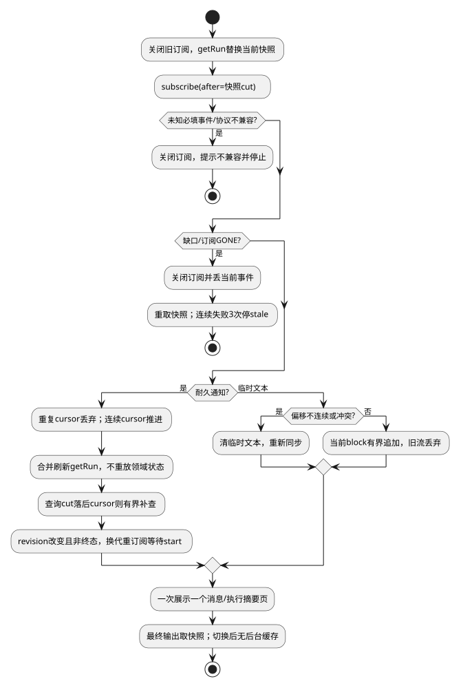

# 流式与执行观察

候选规格；接口唯一来源为[公共契约](../../../contracts/kernel-tui-contract.md)。组件结构与分期见[组件入口](README.md)。

## 0. 适用约束与复杂度取舍

| 场景需要 | 已有保证/保证方 | 最小方案与验证 |
|---|---|---|
| 当前Run进度 | 单连接有序事件由服务提供，允许重复 | 只保存cursor，重复过滤；缺口重取快照；TUI-03B |
| 重连/换会话 | 服务提供一致且有界快照 | 替换前台，无事件溯源/乱序缓存 |
| 长回答 | 服务提供稳定分页内容 | 一次显示一页，不拼接全文 |

一个前台Run、一个订阅，不维护后台Run缓存。工具/Child完整观察是二期；未实现能力不会提前建立后台查询。已保存事实来自服务，临时流仅改善体验。

## 1. 投影与算法

`ObservationState = {phase:"loading"|"live"|"stale", generation:number, snapshot:RunView|null, cursor:number, liveText:LiveText|null}`。`LiveText={streamId,attemptId,blockId,baseOutputRevision,nextOffset:number,text:string}`；只保留当前公开文本block。服务切block必须先发text.start。

`observe(runId)`递增generation、abort旧订阅，清临时文本，getRun取一致快照cut S，替换前台后subscribe(after=S)。订阅的补拉由服务完成，TUI不并行运行第二个补拉管线。重复seq≤cursor丢弃；seq=cursor+1处理；seq>cursor+1立即关闭订阅、丢该事件并重取快照，不等待后续缺失项。未知必填事件显示不兼容并停止，不越过cursor。

为减少投影代码，耐久事件只作为刷新通知：累计最高连续cursor，每250ms最多一次getRun；该查询不重叠。安装快照后cursor=max(cursor,snapshot.eventSequence)，旧版本快照丢弃。新快照包含文本页和有界执行摘要；不逐事件复制服务内部状态。终态只从快照判定，通知不携带终态载荷。查询返回时若snapshot.eventSequence小于已观察cursor，必须在本次查询结束后再次刷新；不依赖下一条通知。每次补查仍遵守250ms节流，连续3次不能追平则进入stale，/status恢复，避免服务异常时无限轮询。查询/事件都校验同一generation，读不到快照仍显示“状态待同步”，不伪造结果。

text.start固定stream/attempt/block及baseRevision、已有公开前缀；delta偏移按Unicode码点。exact nextOffset追加；完整落在已有范围且内容相同的重复丢弃；部分重叠、不同内容、跳跃都清临时文本并重取快照。旧流ID/旧attempt忽略。text.end不宣称Run完成，等待权威快照。公开前缀或累计文本超过32KiB，停止临时文本更新，本次stream仅显示已保存页并提示分页，避免为长流新增拼接存储。

快照outputRevision变化则删除旧liveText；如果Run非终态，立即关闭旧订阅并在该快照cut重新订阅，等待新的text.start后才接收delta；终态不重订阅。订阅代次必须递增，旧流迟到全部丢弃。初始加载没有旧revision时只订阅一次。最终结果以快照页替换。切换/断线不持久化cursor或投影，重新打开必定snapshot。连续3次异常重建失败到stale，停止自动重建，/status重新observe；连接级错误交SR-01，避免两层重试叠加。

ACK保留为Client传输职责：每应用32条或250ms提交一次最高已消费cursor，只有一个请求在途；关闭后取消ACK timer。它只控制服务窗口，不是恢复数据。不存在客户端乱序队列，输入读取与20Hz绘制解耦；网络读取不等待绘制。tool/Child摘要随快照更新，服务限制32项并提供后续页，界面只持当前页。

## 2. 场景流程

[流程源](../../../diagrams/clients/kernel-tui/sr-03.puml)。异常分支的精确输入、屏障与恢复结果见下表；正常动作的权威写入方以第1节为准。

## 3. SFMEA

风险为定性评审，不虚构发生率/RPN。

| 故障 | 原因 | 检测 | 控制与恢复 |
|---|---|---|---|
|序号缺口|订阅中断|期望seq不连续|关闭流并重取快照，不排序|
|增量串轮|旧attempt迟到|stream/attempt/revision|丢弃旧流；final权威替换|
|内存增长|输出快于渲染|当前block字节计量|超过32KiB停止该流临时展示，改读已保存分页|

## 4. 场景到验收映射

本表为候选场景规格；已实现的局部测试与实际执行状态单独见[验证记录](../../../../verification/kernel-tui-design-validation.md)。不能以局部测试通过声称整个场景或真实链路已通过。

| 场景/测试ID | 前置与输入 | 操作/注入 | 独立期望及禁止行为 | 层级/拟实现位置 |
|---|---|---|---|---|
| SC-03A / TUI-03A | snapshot cut=10 | 先到通知11、12，getRun返回completed@12 | 顺序采纳；final替换delta不重复 | ut / test/ut/kernel-tui-run-observation.test.ts |
| SC-03B / TUI-03B | cursor=10 | 依次送12、11、11 | 遇12立即中止该订阅并重取快照；旧11全部丢弃，无乱序缓存 | ut / test/ut/kernel-tui-run-observation.test.ts |
| SC-03C / TUI-03C | block offset=0 | 送offset=8且缺前段 | 停止拼接、拉快照，不猜缺字 | contract / test/contract/kernel-tui-run-observation.test.ts |
| SC-03D / TUI-03D | 从Run A切换到B，两者有同名工具 | 旧A通知和查询结果迟到 | 丢弃A代次回调；仅刷新B快照，不建A后台缓存、不串卡片 | ut / test/ut/kernel-tui-run-observation.test.ts |
| SC-03E / TUI-03E | cursor超出保留范围 | 补拉返回GONE | 显示历史缺口，安装新cut，不伪造空历史 | integration / test/integration/kernel-tui-run-observation.test.ts |
| SC-03F / TUI-03F | getRun@11在途时收到12 | 返回cut11后不再送通知 | 必须补查并显示completed@12；最多一查询在途 | ut / test/ut/kernel-tui-run-observation.test.ts |
| SC-03G / TUI-03G | 临时流A，快照revision推进 | 旧A delta迟到，新订阅start B再delta | 旧代次不显示；B连续，终态不重订阅 | ut / test/ut/kernel-tui-run-observation.test.ts |

| SC-03J / TUI-03J | 已观察cursor=11 | 服务连续3次返回cut10 | 停stale且释放订阅；/status才重新开始 | ut / test/ut/kernel-tui-run-observation.test.ts |

## 5. 交付、升级与结构验收

第一期基础能力；工具与子任务完整卡片属于第二期。组件结构验收同时检查依赖和状态所有权：本域仅通过KernelClient/Launcher获取服务事实；直接更新当前视图，不访问执行器或服务端存储。

本地格式与协议分别版本化；未知主版本拒绝读取/连接，不自动迁移或删除未决记录。升级前断开客户端，保留未决命令与书签，宿主不因UI升级重启。回退只使用匹配协议/本地格式的版本。在本页场景约束及公共契约下，客户端模块可独立开发与替身测试；服务实现未交付不等于客户端还需设计其内部机制。联合运行仍待服务实现及验收。
