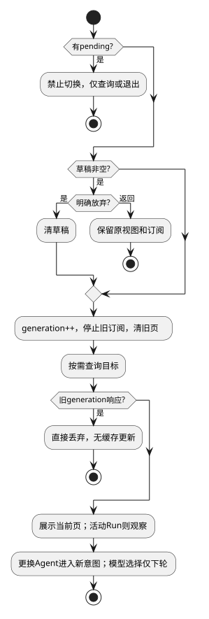

# 会话导航与配置选择

候选规格；接口唯一来源为[公共契约](../../../contracts/kernel-tui-contract.md)。组件结构与分期见[组件入口](README.md)。

## 0. 适用约束与复杂度取舍

| 场景需要 | 已有保证/保证方 | 最小方案与验证 |
|---|---|---|
| 切换查看 | 服务支持按需快照/分页 | 丢旧视图，只保留当前页，无LRU/后台同步 |
| 草稿不能丢 | 切换前由应用检查 | 非空草稿提示放弃或返回；默认返回；不存多会话草稿 |
| 多客户端活动变化 | Session查询与提交原子校验在服务端 | 显示快照，冲突刷新，不复制Session锁 |

未知写或本地清理未完成禁止切换，只允许/status和退出。活动Run可切换观察，但不取消它。首期/attach及恢复书签，二期完整列表和选择器。

## 1. 用例、数据及顺序

`NavigationState={generation:number,selectedSessionId:Ref|null,page:Page<SessionSummary>|null,nextSelection:Selection|null}`。方法`openSession(id)`、`newConversation()`、`selectAgent(id)`、`selectModel(id)`直接调用Client，不引入QueryPageAdapter或独立缓存服务。

openSession首先检查pending和草稿；取消选择不改变当前订阅。确认后generation++，abort旧查询/订阅，清前台临时流和旧页，再查询目标。返回必须匹配generation和sessionId，旧结果直接丢弃，不能更新任何后台缓存。活动Run调用observe；空闲且historyReady允许续轮。404显示不存在/不可访问，401清敏感前台并交连接处理。

列表及历史一次一页，nextCursor与snapshotRef原样交服务；新列表查询替换旧页，不拼接无限列表。GONE刷新第一页并显示变化。首页无书签时显示新草稿，不创建空Session。bookmark按SR-02原子保存，仅作为便捷定位，保存失败提示且不冒称可恢复。

Agent为Session身份：不同Agent经过草稿检查后进入新会话意图，不改原Session。模型nextSelection只用于下一Run，当前模型显示frozenSelection。initialize.defaultSelection提供首次默认；existing Session使用其defaultSelection，禁止把别的Agent默认带入追问。选择需服务能力支持，不允许从本地Pi配置猜模型。

关闭选择器不写服务状态；选择无副作用，真正创建发生在submit。查询失败停在错误页，用户可返回或重查；无需实现离线历史浏览。

## 2. 场景流程

[流程源](../../../diagrams/clients/kernel-tui/sr-04.puml)。异常分支的精确输入、屏障与恢复结果见下表；正常动作的权威写入方以第1节为准。

## 3. SFMEA

风险为定性评审，不虚构发生率/RPN。

| 故障 | 原因 | 检测 | 控制与恢复 |
|---|---|---|---|
|串会话显示|异步乱序|selectionGeneration|按选择代次验证|
|配置漂移|运行中切换模型|frozenSelection|下轮选择独立保存|
|权限撤销后残留|缓存不失效|401/撤权事件|清理对应scope敏感投影|

## 4. 场景到验收映射

本表为候选场景规格；已实现的局部测试与实际执行状态单独见[验证记录](../../../../verification/kernel-tui-design-validation.md)。不能以局部测试通过声称整个场景或真实链路已通过。

| 场景/测试ID | 前置与输入 | 操作/注入 | 独立期望及禁止行为 | 层级/拟实现位置 |
|---|---|---|---|---|
| SC-04A / TUI-04A | 书签指向活动Run | 客户端重新启动 | 恢复观察，无新Run、无空Session创建 | integration / test/integration/kernel-tui-session-navigation.test.ts |
| SC-04B / TUI-04B | A查询慢、B查询快 | 切A后立即切B，最后返回A | 前台保持B，A不能覆盖草稿 | ut / test/ut/kernel-tui-session-navigation.test.ts |
| SC-04C / TUI-04C | Session绑定Agent X | 选择Agent Y并提交 | 新Session意图；X历史不改写 | contract / test/contract/kernel-tui-session-navigation.test.ts |
| SC-04D / TUI-04D | Run以模型M1运行 | 选择M2 | 当前展示M1，下次提交才请求M2 | ut / test/ut/kernel-tui-session-navigation.test.ts |
| SC-04E / TUI-04E | 当前会话已有正文 | 查询返回撤权 | 停止订阅并移除当前敏感视图 | integration / test/integration/kernel-tui-session-navigation.test.ts |
| SC-04F / TUI-04F | 草稿非空 | 切换时选择返回，再选择放弃 | 返回不改订阅；放弃后仅保留目标页，无后台缓存 | ut / test/ut/kernel-tui-session-navigation.test.ts |
| SC-04G / TUI-04G | 旧实例仅bookmark，无pending | --resume-client恢复 | 原Run/Session被查询，零新建；scope不符则拒绝 | integration / test/integration/kernel-tui-session-navigation.test.ts |

## 5. 交付、升级与结构验收

第二期为主，一期保留当前会话恢复。组件结构验收同时检查依赖和状态所有权：本域仅通过KernelClient/Launcher获取服务事实；直接更新当前视图，不访问执行器或服务端存储。

本地格式与协议分别版本化；未知主版本拒绝读取/连接，不自动迁移或删除未决记录。升级前断开客户端，保留未决命令与书签，宿主不因UI升级重启。回退只使用匹配协议/本地格式的版本。在本页场景约束及公共契约下，客户端模块可独立开发与替身测试；服务实现未交付不等于客户端还需设计其内部机制。联合运行仍待服务实现及验收。
