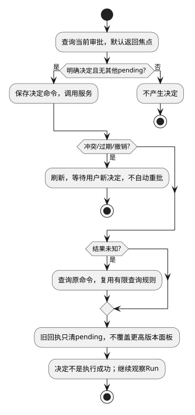

# 授权审批交互

候选规格；接口唯一来源为[公共契约](../../../contracts/kernel-tui-contract.md)。组件结构与分期见[组件入口](README.md)。

## 0. 适用约束与复杂度取舍

| 场景需要 | 已有保证/保证方 | 最小方案与验证 |
|---|---|---|
| 批准或拒绝既有动作 | 服务校验权限/版本/期限并保存决定 | TUI只展示并回写；不编辑范围；TUI-05B/D |
| 避免丢响应重复决定 | 原命令查询可用 | 复用一条pending，不建补偿器 |

第三期，单前台审批面板。未协商能力则不创建审批模块。面板只处理一个已查询审批，不订阅全系统审批队列。关闭不产生决定。

## 1. 状态与算法

`ApprovalState={phase:"loading"|"open"|"sending"|"unknown"|"resolved"|"stale",view:ApprovalView|null,commandId:Ref|null,error:BoundaryError|null}`。`openApproval(id)`查询；`decide("approve"|"deny")`校验无其他pending，保存命令再调用服务。允许动作必须来自allowedDecisions；默认焦点为“返回”，Enter不能默认批准。

OPEN明确决定→sending；成功回执→resolved；transport错误→unknown，复用SR-02有限查询规则；409/过期/撤销→stale，重新getApproval后等待用户新决定，不自动沿用旧批准。每个决定携带expectedVersion/proposalDigest，TUI不计算权限或修改提案摘要。

getApproval与决定返回按approvalId/version合并：旧版本丢弃，终态不被旧open覆盖。若已经显示更高版本的服务状态，旧决定回执只用于解决pending，不覆盖面板。决定确认不是工具成功，后续仍看Run。

复用SR-02文件格式，input只有Decision，无提案正文。pending未解决时面板可关闭，但禁止新写和切会话；/status查询该命令。退出保留恢复ID。无需独立ApprovalQueryClient/DecisionCommandClient，直接使用同一KernelClient。

## 2. 场景流程

[流程源](../../../diagrams/clients/kernel-tui/sr-05.puml)。异常分支的精确输入、屏障与恢复结果见下表；正常动作的权威写入方以第1节为准。

## 3. SFMEA

风险为定性评审，不虚构发生率/RPN。

| 故障 | 原因 | 检测 | 控制与恢复 |
|---|---|---|---|
|批准过期提案|审批延迟|服务版本/expiry校验|STALE并刷新，不自动重批|
|重复决定|响应丢失|稳定commandId|查询原回执|
|扩大权限|伪造主体或修改参数|可信上下文/摘要|服务拒绝，不由UI授权|

## 4. 场景到验收映射

本表为候选场景规格；已实现的局部测试与实际执行状态单独见[验证记录](../../../../verification/kernel-tui-design-validation.md)。不能以局部测试通过声称整个场景或真实链路已通过。

| 场景/测试ID | 前置与输入 | 操作/注入 | 独立期望及禁止行为 | 层级/拟实现位置 |
|---|---|---|---|---|
| SC-05A / TUI-05A | OPEN@3，摘要D | 明确批准后收decided | 仅一决定，UI不声明工具成功 | contract / test/contract/kernel-tui-approval-interaction.test.ts |
| SC-05B / TUI-05B | 用户查看@3后服务变@4 | 提交expectedVersion=3 | 冲突并刷新，零自动二次批准 | integration / test/integration/kernel-tui-approval-interaction.test.ts |
| SC-05C / TUI-05C | 已保存决定，回执丢失 | 重连查原命令 | 返回原决定，不能重复扩大权限 | integration / test/integration/kernel-tui-approval-interaction.test.ts |
| SC-05D / TUI-05D | 仅普通Run权限 | 直接调用审批写接口 | 拒绝且决定数0 | contract / test/contract/kernel-tui-approval-interaction.test.ts |
| SC-05E / TUI-05E | 面板OPEN | 粘贴带换行内容或关闭面板 | 决定数0 | ut / test/ut/kernel-tui-approval-interaction.test.ts |

## 5. 交付、升级与结构验收

第三期。组件结构验收同时检查依赖和状态所有权：本域仅通过KernelClient/Launcher获取服务事实；直接更新当前视图，不访问执行器或服务端存储。

本地格式与协议分别版本化；未知主版本拒绝读取/连接，不自动迁移或删除未决记录。升级前断开客户端，保留未决命令与书签，宿主不因UI升级重启。回退只使用匹配协议/本地格式的版本。在本页场景约束及公共契约下，客户端模块可独立开发与替身测试；服务实现未交付不等于客户端还需设计其内部机制。联合运行仍待服务实现及验收。
