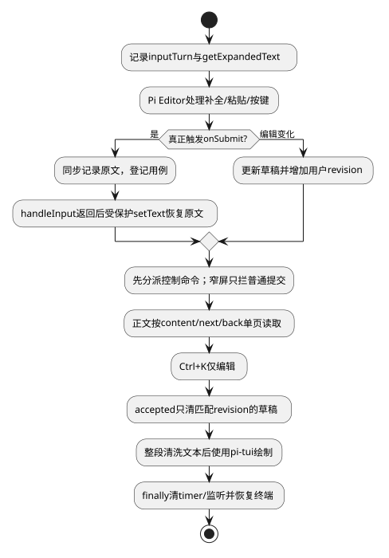

# 终端交互与安全渲染

候选规格；接口唯一来源为[公共契约](../../../contracts/kernel-tui-contract.md)。组件结构与分期见[组件入口](README.md)。

## 0. 适用约束与复杂度取舍

| 场景需要 | 已有保证/保证方 | 最小方案与验证 |
|---|---|---|
| 文本终端交互 | pi-tui提供编辑、布局及输入解码 | 组合公开组件，不改Pi核心；TUI-06F |
| 当前会话输入 | 应用只有一份草稿 | 小型EditorAdapter保护提交正文，不建通用表单框架 |
| 输出安全 | 内容来自模型/工具，非可信终端指令 | 渲染前清洗；不加载图片/自动开链接 |

macOS/Linux，文本优先；一期不显示图像。一个编辑器、一个选择弹窗，复用pi-tui现有补全与焦点能力，不实现任意嵌套窗口栈。初版键位不覆盖Pi编辑操作。

## 1. Pi装配、输入与展示

LawClaw装配ProcessTerminal、TuiMainScreen、Editor、Markdown/Text及布局组件，持有同一KernelClient；Views不访问网络。布局固定标题、当前文本页/状态、编辑器及页脚；宽度<60压缩页脚，<30仅暂停普通对话提交并提示放大，/cancel、/status、/quit等控制命令仍可用。20Hz最大刷新、一个timer；不引入RenderScheduler类。大小变化requestRender，使用visibleWidth/truncateToWidth，禁止按length裁中文。

### 编辑器适配：直接利用公开回调

源码已核对：Editor有getExpandedText/setText/onChange/onSubmit/disableSubmit。submitValue先清空内部内容、onChange("")，随后onSubmit(trim后的展开正文)；setText也触发onChange。

适配器拥有`draft:{text,revision}`、`programmatic:boolean`和`inputTurn:{beforeText,beforeRevision,changed:boolean,submitted:boolean}|null`。每次向Editor转发handleInput前记录getExpandedText及revision。onChange在inputTurn内只标记changed，不立即写应用草稿；onSubmit同步标记submitted并调用应用提交入口，payload使用beforeText而非回调trim结果。handleInput返回后：submitted则在programmatic=true保护下setText(beforeText)恢复显示且不增加revision；否则changed时读取getExpandedText更新草稿并revision++。程序化setText回调不计用户编辑。onSubmit仅登记异步用例，不await网络；最后再返回事件循环。

Editor原有补全选择、反斜线换行、bracketed paste先由Editor处理；仅真的onSubmit才提交。因此粘贴换行不会发请求，补全Enter不被应用截获。本适配保持内容，不承诺恢复提交前undo/光标历史；不访问Pi私有字段。

应用accepted仅在draft.revision等于提交revision时调用受保护setText("")，否则保留用户新草稿。保存/拒绝/未知都不清草稿。活动Run仍可编辑，普通文本onSubmit由Controller拒绝但适配器恢复内容。保留命令通道使/cancel可用：Editor不因活动Run整体disableSubmit，初始化与窄终端同样不整体disableSubmit；应用分别禁止依赖连接或宽度的动作；命令合法性由下表判定。

### 命令与键位

Enter/Shift+Enter及Ctrl+K沿用Pi编辑键，Ctrl+K仍删到行尾。取消默认/cancel，无额外默认快捷键；用户可通过DEFAULT_APP_KEYBINDINGS配置。退出Ctrl+Q，Escape关闭当前选择器或补全。冲突检测比较同焦点作用域内全部有效键（含默认键），不只检查用户配置。若Ctrl+Q与用户编辑绑定冲突，拒绝该应用绑定并保留/quit可用。

命令仅单行且显式提交才解析，按首个空白切命令名；Ref参数是一个非空token，不实现shell引号/变量展开。未知命令/参数保留输入，提示帮助。多行一律正文；`//`开头单行按普通文本发送并去掉第一个斜杠。

| 命令 | 参数与允许状态 | 行为 |
|---|---|---|
| /help | 无，任意 | 显示当前阶段已注册命令 |
| /status | 无，连接可用 | 有pending先查原命令，否则刷新Session/Run |
| /cancel | 无，已确认活动Run且无pending | 显式取消；其他状态提示，无请求 |
| /new | 无，无pending | 草稿非空先确认放弃，进入新意图 |
| /attach | 一个runId，无pending | 查Run取得Session后按SR-04切换 |
| /quit | 无，任意 | 草稿确认后断开；活动任务继续 |
| /retry | 无，offline/blocked | 重新执行连接协商，不重发写 |
| /content | 一个messageId，当前快照含该消息 | contentRef非空则打开首块，否则显示完整text |
| /next | 无，正文分页有nextCursor | 按同contentRef/revision查询下一块，成功才替换当前块 |
| /back | 无，正文分页中 | 关闭正文页，恢复当前Run视图，不保留分页缓存 |
| /sessions、/agent、/model | 无，二期、无pending | 打开对应选择器 |
| /approvals | 无，三期、已确认Run | 查看当前Run审批并明确选择 |

命令用例登记后在handleInput完成的下一微任务执行，避免命令清空后又被适配器finally恢复。命令执行后只清除仍等于该命令且revision匹配的编辑内容，不能清掉异步等待期间的新输入。modal先消费输入；应用仅拦截配置中已证明与Editor键无冲突的快捷键，其余全部交Editor处理补全/编辑，不依赖handleInput返回布尔值。命令是onSubmit之后的解析，不是第二次按键处理。同一输入只消费一次。Quit草稿提示默认返回，用户选择放弃后退出。外部SIGTERM等不可交互退出只恢复终端，内存草稿会丢失，不能承诺强杀后保留。

正文页状态为`{generation:number,contentRef:Ref,revision:Version|null,offset:number,text:string,nextCursor:Ref|null,loading:boolean}`，/content时创建、/back或会话切换时销毁。只允许一个分页查询在途；旧代次响应丢弃。首次revision取服务响应，后续必须一致；GONE或版本变化停留错误并允许重新/content，不把不同版本拼接。查询失败保留当前页、允许重试；无下一页则提示末页且零请求。翻页不改变Run订阅，背景快照只更新Run视图，不能覆盖正在阅读的正文页。

### 安全、释放及局部扩展

每个公开文本block累积有界原始正文后整段清洗再交Markdown，不逐delta独立清洗，避免ESC序列跨包拼接。清洗器丢弃ESC/C1引导的CSI、OSC、DCS等完整控制序列及不完整尾部，移除危险双向控制字符，保留普通Unicode/换行/tab。应用主题ANSI在清洗之后产生。不自动访问Markdown链接/图片，不解析输出为UiAction。32KiB上限后显示分页结果。

dispose幂等：停刷新timer→abort客户端请求→解除监听→停止TUI/恢复终端；finally处理渲染异常。新增一个命令只在固定命令表增加handler和适用状态测试，不建设插件系统。新增卡片使用现有Text/Markdown组合，不引入第二套渲染引擎。

## 2. 场景流程

[流程源](../../../diagrams/clients/kernel-tui/sr-06.puml)。异常分支的精确输入、屏障与恢复结果见下表；正常动作的权威写入方以第1节为准。

## 3. SFMEA

风险为定性评审，不虚构发生率/RPN。

| 故障 | 原因 | 检测 | 控制与恢复 |
|---|---|---|---|
|终端注入|不可信工具输出|控制序列扫描|渲染前清洗，主题转义后生成|
|按键多次消费|焦点传播错误|handler计数|固定优先级单次消费|
|界面冻结|大文本同步绘制|刷新耗时/队列长度|有界缓存和合并刷新|

## 4. 场景到验收映射

本表为候选场景规格；已实现的局部测试与实际执行状态单独见[验证记录](../../../../verification/kernel-tui-design-validation.md)。不能以局部测试通过声称整个场景或真实链路已通过。

| 场景/测试ID | 前置与输入 | 操作/注入 | 独立期望及禁止行为 | 层级/拟实现位置 |
|---|---|---|---|---|
| SC-06A / TUI-06A | 含换行和/cancel的粘贴 | 粘贴后未按提交 | 零请求；完整内容进入草稿 | ut / test/ut/kernel-tui-terminal-interaction.test.ts |
| SC-06B / TUI-06B | modal打开且Run活动 | Escape再显式提交/cancel | Escape只关modal；cancel恰好一次；Ctrl+K只编辑 | ut / test/ut/kernel-tui-terminal-interaction.test.ts |
| SC-06C / TUI-06C | 80×24中文回答 | resize到40×16再80×24 | 无越界/截半字，输入仍可用 | system / test/system/kernel-tui-terminal-interaction.test.ts |
| SC-06D / TUI-06D | 输出含OSC52与ESC擦屏 | 送到renderer | 无剪贴板/擦屏指令，正文安全展示 | ut / test/ut/kernel-tui-terminal-interaction.test.ts |
| SC-06E / TUI-06E | 渲染抛错 | 异常退出finally | raw mode恢复，无残留订阅/定时器 | integration / test/integration/kernel-tui-terminal-interaction.test.ts |
| SC-06F / TUI-06F | 含粘贴标记和首尾空格的草稿 | Pi先onChange空再onSubmit；等待时继续输入 | 请求原展开正文；拒绝保留；accepted不覆盖新revision；Ctrl+K不取消 | integration / test/integration/kernel-tui-terminal-interaction.test.ts |
| SC-06G / TUI-06G | OSC52分成两次delta | 整段清洗后渲染 | 无剪贴板指令泄漏；不完整尾部不显示 | ut / test/ut/kernel-tui-terminal-interaction.test.ts |
| SC-06H / TUI-06H | 29列且Run活动 | 普通提交，再/cancel、/quit | 普通请求数0；取消恰好1；退出不shutdown | integration / test/integration/kernel-tui-terminal-interaction.test.ts |
| SC-06I / TUI-06I | >32KiB中文正文 | /content、/next、查询失败、GONE、/back | 完整页可达，无半码点；失败不丢当前页；旧版本不拼接 | integration / test/integration/kernel-tui-terminal-interaction.test.ts |

| SC-06J / TUI-06J | 正文查询在途 | /back后旧查询返回 | 正文页保持关闭，不覆盖Run视图 | integration / test/integration/kernel-tui-content-page.test.ts |

## 5. 交付、升级与结构验收

第一期。组件结构验收同时检查依赖和状态所有权：本域仅通过KernelClient/Launcher获取服务事实；直接更新当前视图，不访问执行器或服务端存储。

本地格式与协议分别版本化；未知主版本拒绝读取/连接，不自动迁移或删除未决记录。升级前断开客户端，保留未决命令与书签，宿主不因UI升级重启。回退只使用匹配协议/本地格式的版本。在本页场景约束及公共契约下，客户端模块可独立开发与替身测试；服务实现未交付不等于客户端还需设计其内部机制。联合运行仍待服务实现及验收。
