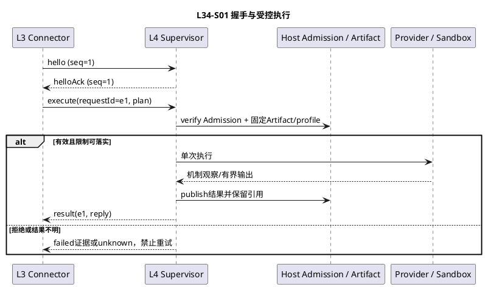
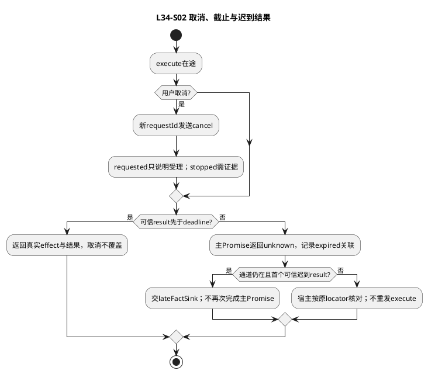
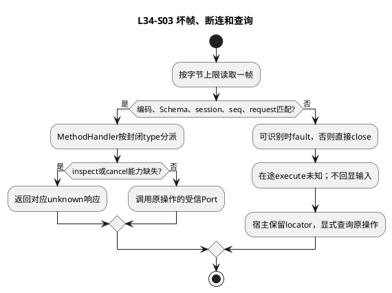
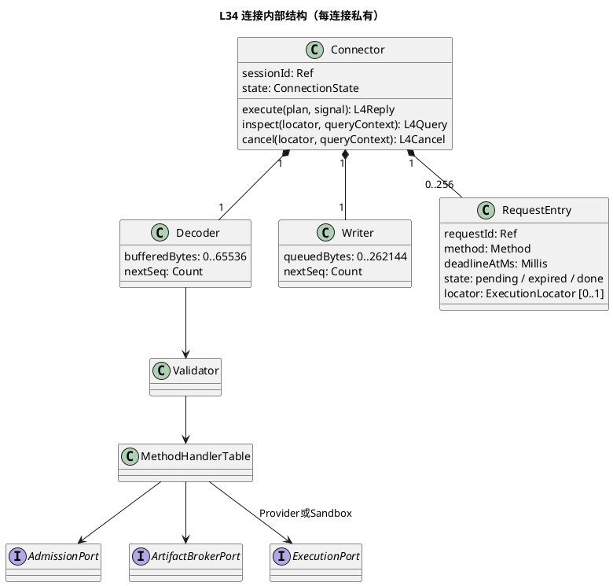

# BND-L34-001：L3 → L4 协议规范 1.0.0

规范基线：**L34-SPEC-1.0.0**，2026-09-09。用户授权“明确下来，达到可开发水准并基线”。这是本边界的开发规范基线，不是整个Kernel或运行实现基线。旧`l3-l4-2`仅为未发布草案，不再适用于新开发。基线范围与哈希见[登记](../../governance/baselines/l34-spec-1.0.0.json)，评审与验收见[专项记录](../../governance/reviews/l34-baseline-2026-09-09.md)。

## 1. 范围、调用者与前提

只允许`L1 PEP → L3 Runtime/Guard → L4受信Adapter或Supervisor → Provider/隔离工作负载`。业务Provider和Sandbox分别实现ToolProviderPort与SandboxPort，使用相同消息语义但不同资源档案；不能互相降级。L4不拥有ToolCall、Run、策略、Permit消费或路由选择。

交付两种等价档案：P1进程内受信Port；P2同机受信supervisor的stdin/stdout JSONL控制通道。P2工作负载stdout/stderr是独立管道，不能直接写控制JSONL。跨主机RPC、公开网络入口、工作负载控制帧、内联文件上传及模型token流不在本版支持范围；不得自动启用。

同一操作的有效派发资格、接管隔离、ToolCall事实保存/恢复由L1/宿主保证；授权及必要审计由Security保证；L4机制证据与资源清理由L4/Infrastructure保证。这些是接入条件，不在L3增加CAS、outbox或恢复扫描。本协议给出条件所需字段及Port承诺，真实机制通过验收后方可启用。

## 2. Schema与共同编码

[JSON Schema](l34/protocol.schema.json)为字段/封闭联合/范围的机器可读权威，正文规定跨字段、状态和安全语义。它自包含，无网络$ref，采用JSON Schema 2020-12；不得只用Schema替代正文守卫。[固定向量](l34/vectors.json)给出合法/非法载荷及规范编码摘要。

Ref为1—128个ASCII `[A-Za-z0-9._:-]`字符，非URL。Digest=`sha256:`+64位小写hex；Count/UTC毫秒为0—9007199254740991整数。Artifact=`{id:Ref,digest:Digest,bytes:Count}`。全部字段必填，只有Schema明确允许的null可空；拒绝未知字段、重复JSON键、孤立代理项、非法UTF-8、BOM、非有限值、浮点、负零和深度>32。字节上限按UTF-8计数，不按字符数。

摘要复用FE-C14N-1的严格输入子集：对象键按UTF-16码元升序、数组不重排、Unicode不归一化；紧凑JSON、无空白，字符串仅转义双引号/反斜线、控制字符用小写`\u00xx`，其余UTF-8原样；整数十进制。H(x)=sha256规范字节；不重新发明摘要库，输入预检排除负零避免历史实现差异。Schema语义整数检查不替代词法预检（例如1.0也拒绝）。

错误使用现有CD-1 Error结构，本边界封闭code集在Schema；`retryable=false`用于所有wire失败（调用方可显式重查，不得隐含重执行）。detailsRef仅脱敏诊断引用，禁止异常原文、参数、Secret、路径或endpoint。requestId/seq只用于通道关联，commandId/operationKey才是业务操作身份。

## 3. 完整执行计划与资源档案

```text
ExecutionPlan = {
 commandId, operationKey, descriptorRef, argumentsRef, route, scopeRef,
 startGrantRef, deadlineAtMs, limits, resourceProfileRef:Artifact
}
ExecutionLocator = {commandId,operationKey,routeRef}
```

原字段类型沿用已明确Schema，新增resourceProfileRef为**完整不可变资源档案**。operationKey=commandId；locator.routeRef=plan.route.routeRef，同scope下原路由版本不可替换。limits不是新授权，只是已批准档案的精确执行值。

ResourceProfile为provider/sandbox判别联合，字段见Schema：共有profileId、resourceScopeRef、inputBytes、outputBytes、frameBytes、queueBytes、cleanupTimeoutMs、egressRefs、secretHandleRefs。Sandbox额外有workloadRef、cpuMillis、memoryBytes、pids、diskBytes、maxOpenFiles、mountsRef和MountBinding[]；Provider无这些机制字段，不声称限制远端CPU。

生产者：L1从Host已编译资源和Registry固定定义取得档案，先通过ArtifactPort发布并保留，才发起PDP决策。档案在决策前已经存在，不能取得Permit后新增workload、Secret或出口。Guard和L4读同一Artifact并核对digest/bytes，未知/缺失档案执行0。

精确规则：profile.kind=route.kind；profile.resourceScopeRef=route.resourceScopeRef；profile.outputBytes=limits.outputBytes；sandbox五项CPU/内存/pids/磁盘/mountsRef逐项等于limits；Provider的cpuMillis/memoryBytes/pids/diskBytes必须0，mountsRef固定`none`。limits.network=deny当且仅当egressRefs为空，否则scoped。仅deadline可进一步缩短，其他限制不得隐式归一化；需要缩小档案时重新准备并授权。

范围：inputBytes≤65536；outputBytes≤262144；frameBytes=65536、queueBytes=262144；cleanupTimeoutMs为1—30000。Sandbox CPU 1—60000ms，内存1—1073741824字节，pids 1—64，diskBytes 0—1073741824，maxOpenFiles 1—1024，workloadRef.bytes≤67108864；mounts/egress/Secret各≤64。mounts唯一targetSlot、不允许前缀层级冲突；其他引用数组去重按Ref排序。diskBytes=0不得有write挂载；参数Artifact.bytes≤inputBytes；资源机制不能落实任何适用限制则ISOLATION_UNAVAILABLE，不能换宿主执行。

输入与输出Schema通过descriptorRef指向的原完整ToolDefinition解析；校验失败在派发前为failed/none，执行后的结果Schema错误按已知effect保留，不能把已知applied变成none。

## 4. 授权、通道与Artifact访问

### 4.1 授权绑定闭合

保留现有SecurityAction、SecurityBinding字段和FE工具actionDigest。为本档案定义唯一工具目标：

```text
ToolTargetV1 = {version:"l34-target-1",proposal:ActionProposal,
 route:RouteBinding,resourceProfileRef:Artifact,limits:ExecutionLimits,
 scopeRef:Ref,deadlineAtMs:Millis}
binding.targetDigest = H({kind:"tool.execute",
 resourceScopeRef:route.resourceScopeRef,payload:ToolTargetV1})
```

这是本档案对CD-1通用targetDigest公式的payload实例；其他动作不变。L1在decide前准备ToolTargetV1，PDP/Guard读取同一目标和档案内容，并把资源需求交现有资源检查器。ActionProposal.toolDescriptorDigest覆盖完整新版定义（含input/outputSchema），argumentsRef涵盖原规范参数，不沿用旧只含输入Schema的摘要。Permit及StartGrant必须绑定上述targetDigest；消耗旧格式Permit不能获得本档案许可。

### 4.2 P1与P2受信入口

P1只通过Composition Root生成的作用域化对象调用。P2由Host启动受信supervisor，拥有私有管道和OS进程身份；不允许连接任意命令、Shell字符串或公开socket。Scope、可用Adapter、Artifact broker能力由启动装配注入，hello中的sessionId不创建权限。

Host在Guard成功后通过受信装配Port安装`ExecutionAdmission={scopeRef,commandId,executorRef,startGrantRef,planDigest,expiresAtMs}`；planDigest=H(完整ExecutionPlan)，expiresAtMs不得晚于计划/Grant截止。接收端`AdmissionPort.verify({scopeRef,commandId,startGrantRef,planDigest,nowMs}) -> valid|rejected`核验已安装绑定，不运行PDP，不消费Permit。安装前Host核对Security确认的ToolTargetV1和plan逐字段相同；plan.deadline只能更早。Admission不是网络客户端可自签的DTO，不经JSONL传输。失联或绑定不一致拒绝，回执不能复活旧执行资格。

接管隔离由Host撤销旧实例Admission及执行能力；不能用“新进程已启动”证明旧外部请求停止。重复业务execute由既有L4私有operation映射返回既有观察/unknown，不重新派发；首版L3不重发execute。

受信装配方法固定为`AdmissionPort.install(admission)->Promise<{state:installed}|{state:rejected,error:Error}>`；同scope/command/executor及同planDigest重复安装返回installed，异摘要拒绝IDEMPOTENCY_CONFLICT，过期不得安装。verify读取的当前scope/executor来自实例，不接受载荷覆盖。Host的`revoke(commandId,executorRef)->Promise<{state:revoked}|{state:unknown,error:Error}>`成功只确认入口撤销，不能替代旧外部执行停止证明。调用使用可信Clock及不晚于now+2000ms的有限截止；失败不派发。

### 4.3 Artifact交接

同机通过作用域化ArtifactBrokerPort交换引用，不在控制JSONL内携带内容或物理路径。`read(ref:Ref|Artifact,purpose)`返回有界字节流；Ref仅用于descriptor，按已绑定ActionProposal.toolDescriptorDigest验证完整定义，其余用途必须Artifact并核对digest/bytes。purpose封闭为arguments/descriptor/profile/workload/result；装配能力检查scope、用途和该操作可读集合，不能读任意Ref。`publish(bytes)`返回摘要和大小已确认的Artifact。两者以本协议限额限制流，先计数后追加，禁止先读无限内容。

result发布后L4的机制receipt保留引用；`handoff(locator,ownerRef)`由L1保存ToolOutcome后经Host调用broker，确认新所有者保留后才允许释放L4持有。handoff失败保留引用并告警，不重执行工具；不是JSONL新帧。存储/GC细节由外部实现，不在L3设计。P2工作负载仅取得挂载到targetSlot的授权文件或scoped proxy，不取得Artifact broker通用句柄或明文Secret。

Broker为单scope/operation受信对象：read返回`Promise<AsyncIterable<Uint8Array>>`，publish接收同型单消费者流并返回`Promise<Artifact>`，handoff返回`Promise<{state:retained}|{state:unknown,error:Error}>`。重复同locator/owner交接幂等；ownerRef由Host工具事实记录提供，非客户端自签。三方法另带`{deadlineAtMs:Millis,signal:AbortSignal}`进程内上下文，截止取操作预算与now+2000ms较小值；read/publish失败以本协议Error拒绝Promise并停止流。descriptor/profile单件≤65536字节，其余按§3用途限额；超限在追加前终止。交接超时不能释放旧持有，Host负责核对，无L3重投循环。

## 5. 操作与完成语义

P1方法：`execute(plan,signal)->Promise<L4Reply>`、`inspect(locator,queryContext)->Promise<L4Query>`、`cancel(locator,queryContext)->Promise<L4Cancel>`。QueryContext={deadlineAtMs}另设有限截止，不沿用已过期执行deadline；可信scope由实例携带。execute只返回一次最终观察，无accepted/进度响应。

| 结果 | 必需约束及采纳 |
|---|---|
| L4Reply success | resultRef非null、error=null、effect=none或applied、evidenceRef非null |
| failed | error非null、effect已知、evidenceRef非null；resultRef可为已验证部分结果，不作为完整成功 |
| unknown | effect=unknown、error非null；resultRef/evidenceRef可空；不自动重发 |
| L4Query pending | locator原样；有可信在途证据才返回pending |
| L4Query completed | 完整reply，可包含unknown观察；不能仅根据completed认定业务成功 |
| L4Query unknown | 无能力/无记录/无法确定，均非“确定未执行” |
| L4Cancel requested | 仅已受理停止请求，非停止/回滚 |
| L4Cancel stopped | evidenceRef非null且完整执行树/远端操作已停止；效果仍另查 |

发送前确定拒绝也由受信Adapter产生未发送证据，返回failed/none；无法生成可信证据则unknown。effect指协议定义的目标资源效果，none不保证远端无日志。结果损坏但可信applied仍保留applied并failed；只有效果本身未知才unknown。回收pending不覆盖已确认业务结果，独立健康信号与机制receipt记录。

运行deadline为min(计划截止、派发时刻+60000ms)。接收端用可信UTC映射单调时钟；时钟回拨/不可信在启动前拒绝，启动后停止并按证据返回。查询/取消截止≤now+2000ms；握手2秒；安全清理用profile.cleanupTimeoutMs独立预算。截止先到主调用unknown，可信迟到result交L3 lateFactSink；不得完成主Promise两次。

## 6. JSONL帧

所有帧为一个UTF-8 JSON对象加单字节LF；空行、CRLF、尾部非JSON、BOM均拒绝。UTF-8多字节可跨read块，LF只能作为帧终结，不接受裸换行字符串。最大65536字节**含LF**；未见LF且缓存达到65536即FRAME_LIMIT。深度32、单方向待写队列262144字节、背压等待≤1000ms且不超操作deadline。无无限buffer、自动重连或execute重试。

共有必填头：`{protocol:"l34",version:"1.0",sessionId:Ref,requestId:Ref,seq:Count,type:枚举,body:按类型}`。seq每方向从1递增、严格连续，溢出关闭。sessionId由L3连接器从Host注入的连接身份取得；两向相同。requestId每请求唯一，回复复制原值；同一execute业务重投必须新requestId但本版L3不主动这样做。

| type/方向 | body完整字段 | 规则 |
|---|---|---|
| hello L3→L4 | versions:["1.0"],maxFrameBytes:65536 | 第一帧requestId固定hello，seq=1 |
| helloAck L4→L3 | selectedVersion:"1.0",maxFrameBytes:65536,maxInFlight:6,querySupported:bool,cancelSupported:bool | 第一回复，能力与当前装配RouteBinding一致；不按能力扩展权限 |
| execute L3→L4 | plan:ExecutionPlan | READY才接收；Admission核验后一次派发 |
| inspect L3→L4 | locator,deadlineAtMs | 用新requestId，只读原操作 |
| cancel L3→L4 | locator,deadlineAtMs | 独立requestId，可与execute交错 |
| result L4→L3 | reply:L4Reply | 只响应execute，主请求只允许一帧 |
| inspected L4→L3 | query:L4Query | 只响应inspect |
| cancelled L4→L3 | cancel:L4Cancel | 只响应cancel |
| fault L4→L3 | error:Error | 只用于未进入业务处理的Schema/版本/容量/Admission拒绝，关闭或结束该请求 |
| close 任一方向 | reason:normal或shutdown或protocol_error | 不等待close ACK；已在途操作仍须取消/核对 |

fault不可证明外部未发生；客户端对execute fault也按未知执行结果保守处理，只有可信L4Reply才可none。语法无法解析时不回显原字节，仅关闭、脱敏诊断；可识别请求的非法帧可先fault。未知type/错误方向/未知session/seq断档/重复requestId/回复类型错配为协议错误，关闭连接并使所有未决execute为unknown，inspect/cancel为unknown。

P2每连接绑定单scope与一个adapterBinding/route版本；并发最多1 execute、4 inspect、1 cancel，共6。接收超额请求用RESOURCE_EXHAUSTED fault；已在途请求不取消。最多256个请求ID（含hello）；第256个ID保留给close，到255个ID时进入DRAINING，不再接受新业务请求。请求表包含`{requestId,method,locator|null,deadlineAtMs,state:pending|expired|done}`，保持到连接结束；不以删除条目允许复用ID。

请求超时只标expired以识别迟到回复。execute的第一帧迟到result按原locator核验后走lateFactSink；第二帧result即使相同也是协议错误。消息不提供业务chunk、日志、ping、事件订阅；业务输出由supervisor收集为Artifact。query不支持也必须返回inspected(unknown)，cancel同理，不缺帧挂起。

## 7. 连接算法与场景

连接状态NEW→NEGOTIATING→READY→DRAINING→CLOSED。NEW只发hello，2秒未获合法helloAck关闭；版本不匹配关闭（可fault）。READY先验证头/Schema/seq/方向/ID/容量，再按静态MethodHandler表派发。DRAINING拒绝新execute，允许原操作查询/取消，最多2秒后close；Host仍负责已启动进程清理。EOF/损坏半帧/写失败直接CLOSED，未决操作unknown。







内部结构：Connector拥有每连接Decoder、Writer与RequestTable；Decoder只做增量UTF-8/帧限额/严格JSON，Validator做Schema与关联守卫，静态handlers表将命令映射到两个L4 Port，ResultMapper处理观察而非工具名。新增Provider只替换L4 ProviderCodec；新增帧必须升协议版本并更新Schema/表/用例，不走字符串反射。



观测仅记录scope内的不透明sessionId/requestId/commandId、type、code、字节/耗时/队列计数；不记录帧正文。单次Admission越权、协议损坏、cleanup超期或handoff失败即发脱敏健康事件；容量拒绝计数按Host既有监控窗口聚合，不在L3新建告警服务。诊断只按原locator查询证据，不能通过重发execute验证存活。

## 8. 可测试性与验收

以下为实现必须通过的验收，不因本次Schema向量通过而视为运行测试通过。

| ID/场景 | 固定输入与注入 | 独立预期/层级 |
|---|---|---|
| CT-01/S01 正常握手/调用 | session=s1，hello seq1，execute e1 seq2，成功Artifact | 一次外部调用；正确请求/locator/result，P1/P2等价；Contract+Integration |
| CT-02/S01 固定目标 | 原profile v1，换一字节/route/limits任一项 | Schema可合法但绑定守卫拒绝，L4业务0；UT/DT |
| CT-03/S01 资源边界 | input/output L-1/L/L+1；64挂载/重复slot/第65项 | 超界前拒绝或有界停止，无超量缓冲；UT/真实Sandbox验收 |
| CT-04/S02 取消竞态 | cancel请求先于成功；deadline先于成功两组屏障 | 取消不覆盖applied；后组主unknown+lateFact一次；DT |
| CT-05/S03 坏帧 | UTF-8分三段、LF缺失、重复键、seq跳跃、超帧 | 合法分段一次解码；其余关闭且无日志正文；UT/Contract |
| CT-06/S03 查询/取消 | 未支持能力、无记录、requested停止 | unknown不当none，requested不当stopped；Contract |
| CT-07/S01 效果 | failed+applied；损坏输出但可信applied | 保留已生效并failed；不自动execute；DT |
| CT-08/S03 断连 | Provider生效后result前断管/EOF | 主unknown、原locator查询，execute增量0；Integration |
| CT-09/S01 受信边界 | 工作负载输出伪result；伪造grant/任意Artifact | 控制帧不受影响，未经Admission拒绝，越权读取0；真实机制安全验收 |
| CT-10/S03 背压/并发 | 第2 execute、第5 inspect；writer满1秒 | 超额fault，writer有界关闭；未决unknown，无隐藏重试；DT |
| CT-11/S01 Artifact交接 | publish成功、Host保存/交接失败、GC扫描 | 原引用仍可查，不重执行；真实Artifact集成 |
| CT-12/S03 版本升级 | 旧l3-l4-2、未知帧、第二result、不同session | 明确拒绝/关闭；不猜兼容；Contract |

使用ManualClock、分段字节源、Fake Admission、Faux Provider独立生效计数和真实双进程管道；不调用付费API。SFMEA：坏帧/越权可导致错误执行（高影响），以Schema+受信身份+绑定防止；超额导致资源耗尽（高影响），以流限额/背压防止；断连及取消误判导致重复效果（高影响），以unknown和原locator核对防止。风险对应CT-02..12，无生产O/D统计，不编造RPN。

## 9. 开发映射、版本与基线边界

可据此分别开发L3 Connector/调用映射、L4 Supervisor Dispatcher/Adapter接入、严格Decoder/Writer与Schema验证。ArtifactBroker和Admission是Host scoped机制Port，先提供Fake即可开发单元，启用真实工具前必须CT-09/11证明外部保证。FE epoch到Security claim的具体运行实现不改变本边界类型，属于Host的执行资格实现验收，不再让L3/L4开发者设计另一套授权协议。

规范基线包括正文、Schema、固定向量、关键调用方字段同步和评审证据。Scope权限、完整ToolTargetV1、JSONL帧、数据交接及失败出口均已确定；没有留“线协议待定”阻塞。Provider供应商及OS隔离后端可按能力替换，具体实现是否满足硬限额是上线验证，不是本协议未定。

变更任一字段或帧语义必须新规范版本；1.0连接拒绝其他版本，没有隐式兼容窗口。升级停止新受理、保留旧locator/证据与旧只读查询适配，新连接握手后只承接新动作；回滚不重发旧未知动作，不删除既有Permit或机制记录。总体实现基线保持不变，本次不启动生产、不修改运行代码、不宣称运行验收已通过。
