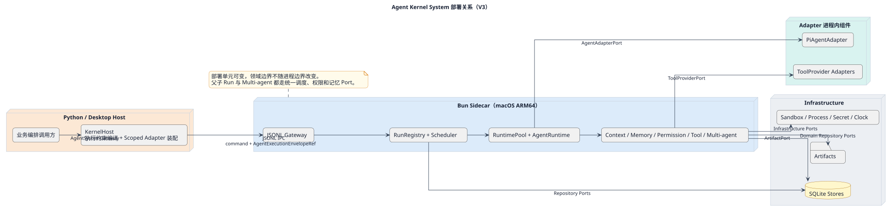

# Agent Kernel 部署设计

[查看 PlantUML 权威源](../diagrams/deployment/10-deployment.puml)

部署文档只定义 Port 到 Adapter 的装配与运行拓扑，不重新定义领域边界或契约。首版采用 [Local-first Profile](local-first-profile.md)，对象装配见 [Composition Root](composition-root.md)。远程分布式形态必须由新的 ACR 说明触发条件、运维成本和回退路径。
