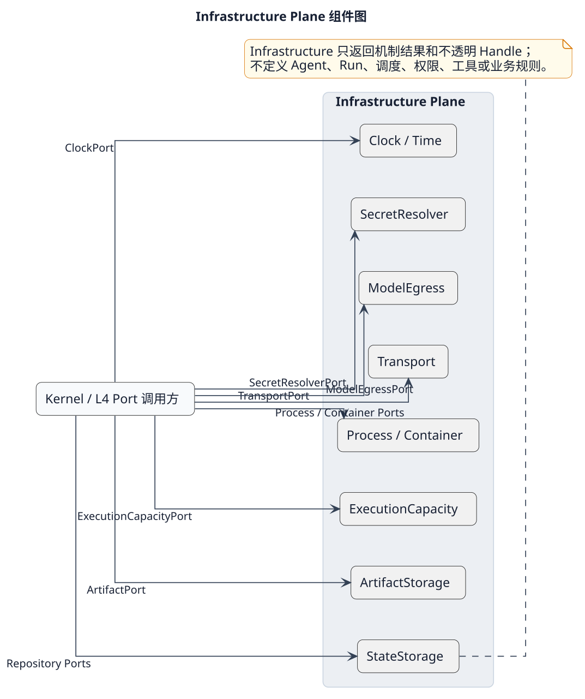

# Infrastructure Plane 层设计

[查看 PlantUML 权威源](../../diagrams/layers/07-infrastructure-plane-components.puml)

## 职责与边界

Infrastructure Plane 通过 Scoped Adapter 提供存储、制品、进程/容器、传输、模型出口、密钥和时间机制。它只返回机制结果或不透明 Handle，不拥有 Agent 路由、业务编排、权限策略或 Run 状态机。

## 组件

| 组件 | 唯一设计 | 机制状态 |
|---|---|---|
| StateStorage | [状态存储](components/state-storage.md) | 事务、版本与恢复游标 |
| ArtifactStorage | [制品存储](components/artifact-storage.md) | 内容摘要与不透明引用 |
| Process/Container | [进程与容器](components/process-container.md) | 进程、挂载、网络和回收句柄 |
| Transport | [传输](components/transport.md) | 帧、连接和背压状态 |
| ModelEgress | [模型出口](components/model-egress.md) | 端点策略与请求传输状态 |
| SecretResolver | [密钥解析](components/secret-resolver.md) | 短时 Lease，不保存明文 |
| Clock/Time | [时钟与时间](components/clock-time.md) | UTC 时间点与单调耗时 |

## 依赖与故障隔离

Kernel 通过 [`BND-INF-001`](../../contracts/bnd-inf-001.md) 使用本层；具体 SQLite、HTTP、JSONL、进程或容器类型留在 Adapter 内。上层可以依赖本层 Port，本层不得反向依赖领域组件。存储、Secret、Clock 或副作用执行机制不可验证时失败关闭；不得静默切换为权限更宽的宿主执行。

## 验证

[外部存储 I/O 监控候选方案](../../reviews/storage-io-2026-09-08/README.md)核对当前 SQLite/Artifact 实现，提出 Adapter 计量、后端能力与资源池观测，以及后续正文分离的验收条件；属于 ACR-2026-0016，不表示存储迁移或新后端已经实施。

见 [Infrastructure Plane SFMEA](../../../verification/infrastructure-plane.md) 和 [System SFMEA](../../../verification/system-sfmea.md)。
