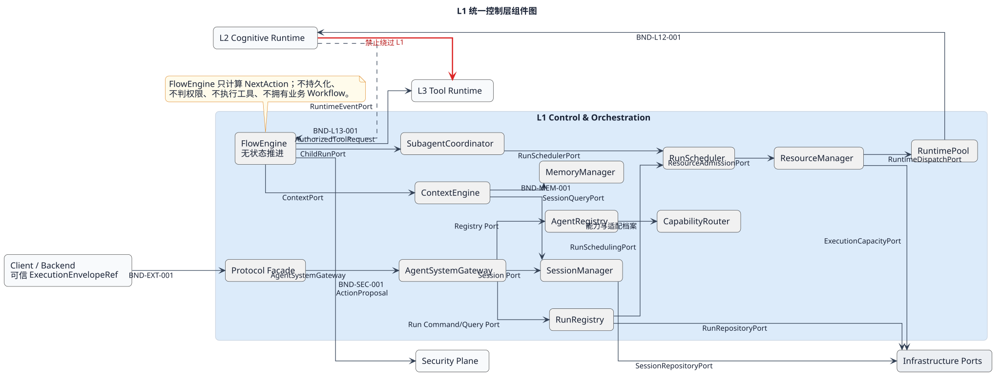
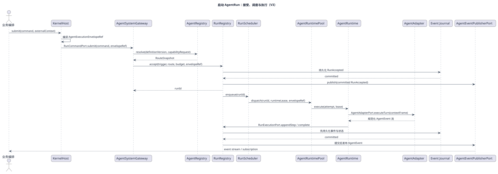
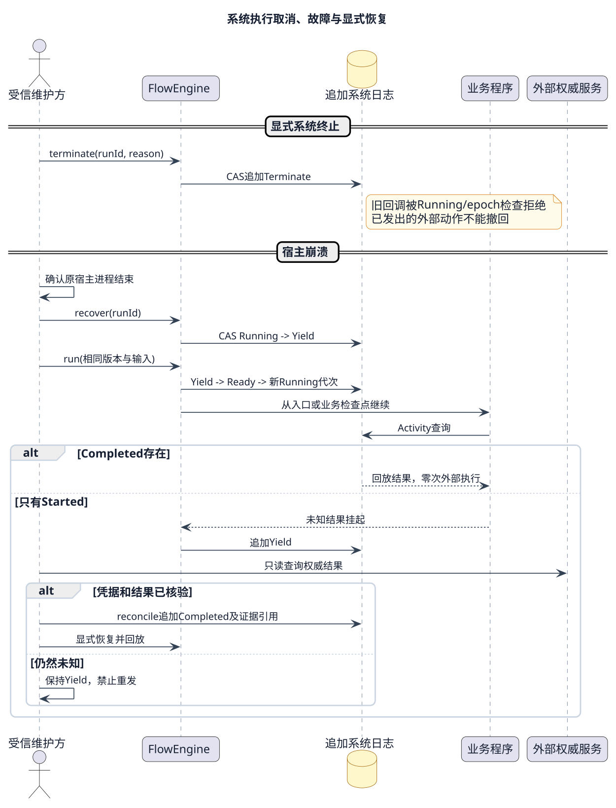

# L1 Control & Orchestration Runtime 层设计



[查看 PlantUML 源](../../diagrams/layers/01-l1-control-components.puml)

当前 FE 边界为单 FlowRun 生命周期、Activity 回放及内部有向环。每个 Session 只允许 `0..1` 当前活跃 Run 绑定，绑定归 SessionManager；历史 Run 归 RunRegistry。Session 父子血缘及 sub-session Fork/Join/Reduce/唤醒协调归 SessionManager 内部 Coordinator；FE 只按稳定指令执行/取消单个 Child Flow 并幂等消费 Parent resume。

## 1. 定位

L1 把外部执行意图转换为可审计、可调度、可恢复的 `AgentRun`，并协调 L2 认知执行、安全决策、L3 工具执行和基础设施机制。它拥有 Kernel 的技术控制流，不拥有业务 Workflow、用户身份、租户 RBAC、模型 Provider、工具 Provider 或物理资源实现。

L1 的核心关系是：

```text
Backend / KernelHost
  -> ProtocolFacade -> AgentSystemGateway
  -> AgentRegistry / CapabilityRouter
  -> SessionManager（确保Session并占用唯一Run槽）
  -> commit后outbox -> RunRegistry（受理Run）
  -> RunScheduler -> ReActFlowHost -> FlowEngine（系统四态）
  -> ReAct业务命令 -> ActivityInterceptor -> L2（已提交Started）
  -> L2 ToolCallCandidate -> L1 control path -> Security PEP/PDP -> L3
  -> L2 ChildRunCandidate -> SessionManager/SubSessionCoordinator -> FE 单 Child Flow 执行
```

## 2. 目标与非目标

目标：

- 为外部调用提供稳定而薄的受理边界。
- 让 `AgentRun`、`AgentSession` 和 `JoinBarrier` 各有唯一状态所有者。
- 对 Root Run 与 Child Run 使用同一套受理和恢复规则。
- 保证 L2 的动作候选先回到 L1，再经过安全与执行边界。
- 通过有界队列、Deadline、取消和版本校验实现失败收敛。

非目标：

- 不设计或保存业务 Workflow、业务补偿与结果采纳。
- 不解释 Token、User、Tenant、组织或 RBAC；这些信息在 KernelHost 终止并编译为不透明的 `ExecutionEnvelopeRef`。
- 不直接调用模型Provider、工具副作用或Sandbox；ReActFlowPolicy决定业务推进，FlowEngine只管理系统四态。
- 不组建 Multi-agent 团队，不定义角色、通信协议或仲裁策略。
- 不冻结 Port 方法签名、DTO 字段、错误码或线协议；这些由 `contracts/` 在后续评审中唯一维护。

## 3. 组件与唯一职责

| 组件                 | 文档                                                       | 唯一职责                         | 权威状态                      |
| ------------------ | -------------------------------------------------------- | ---------------------------- | ------------------------- |
| Protocol Facade    | [Protocol Facade](components/protocol-facade.md)         | 协议协商、校验和机械映射                 | 无领域状态                     |
| AgentSystemGateway | [AgentSystemGateway](components/agent-system-gateway.md) | Kernel 外部用例入口                | 无领域状态                     |
| AgentRegistry      | [AgentRegistry](components/agent-registry.md)            | AgentDefinition 版本与可查询描述     | `AgentDefinition`         |
| CapabilityRouter   | [CapabilityRouter](components/capability-router.md)      | 生成技术路由候选                     | 无持久状态                     |
| SessionManager     | [SessionManager](components/session-manager.md)          | 技术会话、单活Run绑定、分支血缘、Child上下文组装调用及 sub-session Fork/Join/Reduce/归档协调 | `AgentSession`、`ActiveRunBinding`、`JoinBarrier` |
| RunRegistry        | [RunRegistry](components/run-registry.md)                | Run/Attempt/Step 状态与事件提交     | `AgentRun`                |
| RunScheduler       | [RunScheduler](components/run-scheduler.md)              | 外部触发、扫描与排队；Flow依赖规则委托框架      | 可重建队列投影                   |
| FlowEngine         | [FlowEngine](components/flow-engine/README.md)                  | 单 FlowRun 系统指令、Activity、路由与恢复 | append-only 单 Run 系统日志 |
| ContextEngine      | [ContextEngine](components/context-engine.md)            | 生成有界、可解释的 `ContextFrame`及TokenAccounting；按冻结规格选择部分父上下文 | 可重建投影                     |
| MemoryManager      | [MemoryManager](components/memory-manager.md)            | 长期记忆视图与候选提交                  | `MemorySpace`             |

SessionManager 的开发级设计按功能拆为 [Root Session 生命周期](components/session-manager/sr-01-root-session-lifecycle.md)、[Session 单活 Run 协调](components/session-manager/sr-02-single-active-run.md)和 [Sub-session Fork/Join](components/session-manager/sr-03-subsession-fork-join.md)；组件总览只维护跨功能域边界和公共不变量。

## 4. 允许依赖

| 调用方 | 被调用方/Port | 允许目的 |
|---|---|---|
| Protocol Facade | `AgentSystemGateway`、公开查询 Port | 机械转发公共命令、查询和事件 |
| AgentSystemGateway | Registry、Session 与 `SessionRunCommandPort` | 受理外部 Kernel 用例；绑定Session的Run不得直达RunRegistry创建 |
| SessionManager | `RunCommandPort` / `RunQueryPort` | 占槽事务提交后受理Run；UNKNOWN只查询原命令 |
| CapabilityRouter | `AgentRegistryQueryPort`、`AdapterCapabilityPort` | 基于冻结定义和当前技术能力生成候选 |
| RunScheduler | `RunQueryPort`、执行宿主入口 | 发现可运行任务并调用宿主 |
| L2 Runtime | `RuntimeEventPort` | 将规范化事件和动作候选返回 L1 |
| L1 控制路径 | `PermissionDecisionPort`、`PermitValidationPort` | 请求安全裁决并在执行前验证 Permit |
| L1 控制路径 | `ToolRuntimePort` | 只提交已授权的工具请求 |
| ContextEngine | Session、Memory、Artifact 查询 Port | 组装不可变上下文投影 |
| Agent业务调用边界 | `SessionForkJoinPort`、安全及业务输入适配 | 只转换业务定义/参数；Fork/Join/Reduce 交 SM，SM 经 `FlowRunCommandPort` 调 FE 单 Flow 执行 |

禁止依赖：

- L2 不得直接调用 L3；`ToolCallCandidate` 必须通过 `RuntimeEventPort` 回到 L1。
- L1 不得直接调用 L4；Sandbox 只能由 L3 经 `SandboxPort` 使用。
- Protocol Facade 和 Gateway 不得直连 Repository、Runtime Adapter 或 Provider。
- Infrastructure 与 Operations 不得反向推进 Run、Session、Permit 或 Memory 状态。
- 任一组件不得用共享可变对象跨越聚合边界。

## 5. 主要控制流

### 5.1 Root Run



[查看 PlantUML 权威源](../../diagrams/scenarios/05-start-run-sequence.puml)

1. KernelHost 验证外部身份并提供可信 `ExecutionEnvelopeRef`。
2. Protocol Facade 完成协议校验，Gateway 受理规范化执行意图。
3. Registry 与 Router 生成技术候选；Gateway 调 SessionManager，以 Session 版本 CAS 占用唯一 `ActiveRunBinding` 并原子写 Run admit outbox。
4. outbox worker 将带 `SessionRunBindingRef` 的原命令交给 RunRegistry；RunRegistry 验证绑定回执、冻结选择并持久化 Run，SM 收到受理事件后将绑定转 `ACTIVE`。
5. Scheduler发现任务；ReActFlowHost调用系统FlowEngine；业务策略经Activity拦截入口派发已提交的模型调用。
6. L2 产生规范化事件；RunRegistry先T1受理，再经Core决策/T2原子更新Run与Outbox。
7. Run终态以追加事件持久化并通知SM；SM经`RELEASING`完成最终Session写入后清槽。事件订阅断线可按 Run sequence 补拉。

### 5.2 工具动作

1. L2 只产生 `ToolCallCandidate`，经 `RuntimeEventPort` 返回 L1 并暂停当前 Step。
2. L1 控制路径将候选交给安全 PEP；PEP 请求 PDP 的 `Allow / Ask / Deny` 决策。
3. `Ask` 持久化等待引用；`Deny` 形成拒绝事实；`Allow` 获得一次性 Permit。
4. L1 仅以有效 Permit 调用 L3 `ToolRuntimePort`。
5. L3 只校验并消费 Permit，不进行第二次策略裁决；结果回L1由Core决定下一步；只有新的已提交InvokeModel才调用L2。

### 5.3 挂起、恢复与取消



[查看 PlantUML 权威源](../../diagrams/scenarios/07-cancel-recovery-sequence.puml)

- 等待审批、外部事件或长任务时，RunRegistry 记录等待引用，系统进入Yield。
- 恢复信号通过幂等入口进入 RunRegistry；Scheduler 重新判定并创建或恢复 Attempt。
- 取消先建立禁止新增模型、工具、记忆和 Child 动作的栅栏，再向 Runtime 和 Child 传播。
- 工具副作用为 `UNKNOWN` 时默认安全挂起，禁止盲目重派。

## 6. 数据所有权

| 数据 | 唯一所有者 | 其他组件允许持有 |
|---|---|---|
| AgentDefinition 及版本 | AgentRegistry | ID、不可变 Descriptor、版本引用 |
| RouteSnapshot | RunRegistry / AgentRun | Router 只返回候选 |
| AgentSession、0..1 ActiveRunBinding、Session血缘、JoinBarrier/Member及Reduce回执 | SessionManager | SessionRef、不可变Snapshot、group/member/runRef、幂等回执；无Run集合；FE不复制关系索引 |
| AgentRun/Attempt/Step/Event | RunRegistry | Ref、查询 Snapshot、派发票据 |
| Scheduler 队列 | RunScheduler | 从 Run 状态可重建的临时投影 |
| ContextFrame | ContextEngine | 单次模型调用的不可变投影 |
| MemorySpace | MemoryManager | 授权且冻结的 MemoryView |
| 单 FlowRun 执行事实 | FlowEngine / RunRegistry | SM 只持 childRunId、command receipt 和终态引用，不复制 Flow 内部日志 |
| ExecutionPermit / StartGrant | Security Plane | L1/L3/SessionManager Coordinator 只持有绑定动作的短时引用；Session 聚合不保存权限对象或消费状态 |

## 7. 故障隔离与恢复原则

- 所有队列、事件窗口、上下文、工具输出、Child 数量与资源占用必须有硬上限。
- 写操作使用稳定幂等键和载荷摘要；同键异载荷冲突并审计。
- 同一Session只允许一个非空活跃Run绑定；不同Run并发占用只允许一个CAS胜者，UNKNOWN不释放，迟到终态必须校验bindingVersion。
- 聚合更新使用版本校验；冲突后丢弃旧决策、重新加载并重算。
- 系统以Running启动事件序号隔离代次，崩溃恢复先撤销旧代次；ReAct业务存储的30秒claim是独立业务适配协议。
- Runtime/Transport 断开只表示结果未知，不等于失败，也不授权自动重放副作用。
- 遥测失败不得阻塞主流程；安全审计必须耐久，但不得包含 Secret、完整 Prompt、工具参数或 Memory 正文。

## 8. 层级验收

- 从本页可到达当前有效 L1 组件，且每个组件只有一份权威设计文档。
- `AgentRun`、`AgentSession`、`JoinBarrier`、`MemorySpace` 和 `AgentDefinition` 各有唯一所有者。
- Session模型中`runIds/pendingRuns/maxRunsPerSession`为零；单活Run绑定归SM，Run/Attempt历史和接管归RunRegistry。
- L2 到 L3、L1 到 L4 的直接调用路径为零。
- Token、Tenant、User、RBAC 和业务 Workflow 进入 L1 模型的字段数量为零。
- FlowEngine 重启后无需恢复进程内状态；Session 数量与进程/协程数量解耦。
- 无有效 Permit 时 L3 调用次数为零；PDP 不可用时失败关闭。
- Root/Child 复用 FE 的单 Flow 执行协议；SM Coordinator 唯一管理 group/Barrier/Join/Reduce。Parent 终态禁止新 Child，未确认清理保留 incident。
- 独立Child只继承Fork时显式冻结的父上下文子集；候选组装失败时Child Session创建为0，候选保存及目标绑定未确认时Run/FE受理为0。Context只返回内存候选，不存在组装回执或回执确认步骤。Child逻辑归档与物理GC分离，UNKNOWN或活跃引用存在时不得删除。
- 最终接口字段、签名和错误目录只在后续 `contracts/` 文档中定义。

## 本轮开发细化

[CD-1](../../contracts/component-development-contracts-v1.md)规定本轮候选字段与具体闭环，尚非架构批准。原层图表达逻辑角色，未表示每个角色须独立服务；单步身份、T1/T2、Child受理和终态清理以本页及CD-1为本轮候选口径。
