# ContextEngine 上下文组装器详细设计

配套评审：[上下层一致性检查与未关闭问题](context-engine-review.md)。评审记录随本组件归档，检查结论不替代设计正文。

> 2026-09-08，候选设计。变更：[ACR-2026-0013](../../../../governance/changes/ACR-2026-0013-context-assembly.md)，按[ACP-001](../../../../governance/architecture-change-process.md)准备G1/G2材料，G3待复核；不继承旧ACR-0011对本次修订的批准。
> 上层：[总设计](../../../agent-kernel-design.md) → [L1层设计](../README.md) → 本文。唯一接口补充：[CTX-CON-1](../../../contracts/context-assembly-contract.md)；未变更的公共类型、安全与Session协议沿用[CD-1](../../../contracts/component-development-contracts-v1.md)。候选字段不表示代码已经实现。

## 1. 问题、目标和需求

用户要求“结合刚才检索出的合同A、B，继续比较违约责任”。组装器要把当前任务、两份条款、已确认的工具结果和相关历史整理成一次模型输入。直接拼接可能重复或超限；任意删除可能缺少一个比较对象；并发更新可能让输入混用历史版本。

**ContextEngine 的职责是执行 `assemble`：从冻结来源读取内容，整理结构，按预算选择，生成不可变Frame、来源追踪和TokenAccounting。** 对 sub-session，它按 `ParentContextSliceSpec` 从父快照选择部分上下文，但仍不创建/归档Session、创建Child、决定业务推进或调用模型。这些是调用场景中的外部协作步骤，不能画进assemble内部冒充组装算法。

| 需求              | 可观察行为                                      | 对应章节    |
| --------------- | ------------------------------------------ | ------- |
| CTX-R1 统一取得会话入口 | 先查询并冻结已有锚点或创建意图；候选成功后才原子创建，重试不重复创建         | 4.1     |
| CTX-R2 完整任务输入   | 明确哪些内容缺失会导致任务不能成立；不得静默裁剪                   | 2、6     |
| CTX-R3 结构准确     | 来源可追踪、角色不提升、工具关系正确、裁剪后依赖完整                 | 6.2     |
| CTX-R4 受约束的串行组装 | SessionManager保证串行调用；组装器不承诺线程安全；外部提交拒绝过期结果 | 3.3、7   |
| CTX-R5 父子隔离     | 独立分支只继承显式父上下文子集；绑定或组装未确认不受理Child           | 4.3、6.3 |
| CTX-R6 失败可恢复    | 区分未发生、已确认、未知；恢复不盲目重发                       | 4.4、7   |
| CTX-R7 容量与诊断有界  | 读取、token、bytes、工作集和重试均受限；不泄露正文             | 8、10    |

上层约束追踪：UP-CTX-002/003由Frame投影与Memory独立所有权落实；UP-DAT-001由独立提交落实；UP-SEC-001由可信scope及授权检查落实；UP-INF-001、UP-DEP-001/002/003由Port与装配边界落实；UP-RES-001由容量限制落实。继续复用Flow公共Activity机制，不改变其系统状态或跨Flow职责。

## 2. 术语与“必选资料”规则

| 名称 | 含义 |
|---|---|
| 来源 | 可读取的版本化历史、转录、MemoryView或Artifact，不等于最终选入的内容 |
| 必选内容 | 缺少后本次任务或消息结构不成立的内容；包含系统约束、任务、任务所需资料及结构依赖 |
| 必选资料 | 必选内容中的任务资料部分。例如逐项比较A/B时，两份待比较条款都必选；并不默认要求把两份合同全文塞入模型 |
| 可选内容 | 可按预算取舍的补充证据、相关旧轮次或未被声明必需的记忆 |
| 因果单元 | 必须一起理解的消息集合，例如助手工具调用及其对应结果 |
| Frame | 一次模型调用的规范输入副本；不是Session，也不是共享可变历史 |
| AssemblyCandidate | 完整载荷、结构追踪及计量的不可变候选；返回成功不代表已保存或被Run采纳 |
| ParentContextSliceSpec | Coordinator 在Fork时冻结的父上下文候选、必选子集、选择器版本和Token软目标；不是复制父Session全文的开关 |
| TokenAccounting | 候选中的白盒计量：Pi估算输入目标、Child基线、父继承目标、实际估算量、下一个未选单元及版本 |

必选不是“优先级最高”的别名。优先级决定可选项的取舍顺序；必选意味着不能静默丢弃：缺失或超过字节等硬容量明确失败，仅Pi Token估算超目标则保留并标记required_over_target。

| 必选依据 | 谁声明/推导 | 示例 | 缺失或硬容量超限 |
|---|---|---|---|
| system_constraint | 可信Host配置 | 工具使用约束、输出规范 | 拒绝组装 |
| current_task | Run受理输入 | 本次比较目标 | 拒绝组装 |
| task_input | 调用方任务契约 | 本次必须比较的A/B条款片段 | 拒绝并指出缺少的受控引用 |
| causal_dependency | 结构整理规则 | 一个工具结果对应的原调用 | 补齐已授权前驱；无法补齐则失败 |

声明使用CTX-CON-1 Requirement，包含原因、声明者引用和成员引用；材料正文无权自行声明必选或system角色。模型提出的资料需求须先由业务处理器采纳并形成新输入绑定，不能直接修改正在组装的请求。未知任务所需资料时，调用方应补充任务输入契约，不能让组装器猜测法律业务含义。可选项的越权、身份冲突、内容损坏也必须拒绝，只有明确的可用性失败可以按策略降级。

## 3. 边界、接口和数据所有权

### 3.1 三段协作

```text
调用前：业务适配层冻结SessionInput（已有锚点/创建意图/只读来源）、任务与来源绑定
                       ↓ ContextPort.assemble
组件内：读取 → 结构整理 → 注入算法选择 → 复核并冻结候选
                       ↓ AssemblyCandidate或Error
调用后：业务处理器延迟创建并确认绑定、保存候选 → Run条件提交模型命令采纳 → 派发
```

业务适配层是当前FlowContext/业务宿主承担的装配职责，不新增业务聚合。通用[FlowEngine](flow-engine/README.md)负责Activity和单 Flow 系统执行，不理解本组件内部步骤。SessionManager 拥有历史及 Child 关联/Join/Reduce 协调；Context 只拥有请求私有计算与派生结果。

| 操作 | 调用方 → 实现方 | 成功承诺 | 失败责任 |
|---|---|---|---|
| SessionQueryPort.lookup / SessionCommandPort.ensure | 业务适配层 → SessionManager | 先只读查询；候选成功后ensure返回已确认锚点及created | absent才准备创建意图；写入未知核对原命令；其他操作先创建则重新准备并组装 |
| SessionQueryPort读取指定版本 | 调用方/来源reader → SessionManager | 精确版本快照 | 缺失不创建替代版本 |
| SessionBranchPort.branch | SessionManager Coordinator → SessionManager | 原分支或新分支回执 | Coordinator记录恢复/清理进度；Context不补偿 |
| ContextPort.assemble | 业务适配层或SessionManager Coordinator → ContextEngine | 返回不可变AssemblyCandidate，结构及预算已校验；未保存、未采纳 | 不改Run/Session；外部保存及采纳成功前不派发模型 |
| SourceReader.read | SourceCollector → 注册reader | 冻结版本的SourceReadResult（记录及已解析正文） | reader返回结构化错误，不静默吞错 |
| ContextEstimatorPort | BudgetReducer → 估算器适配 | 固定模型/格式的完整载荷估算 | 失败不改用未绑定估算器 |
| Run采纳与恢复 | 外部业务处理器 → Run存储/执行框架 | 模型命令固定已保存上下文引用，恢复查询原提交 | 不属于组装算法；提交未知先核对，不能直接重算并重发 |

公共完整输入、输出、错误和身份在[CTX-CON-1](../../../contracts/context-assembly-contract.md)定义。Session ensure是本次用户要求的候选增量，归SessionCommandPort，具有创建副作用；不把读接口改为暗中写入。branch继续复用[SessionManager](session-manager.md)的父版本、保留引用和原子提交规则。

### 3.2 状态与生命周期

| 状态/对象 | 权威所有者 | 生命周期/访问方式 |
|---|---|---|
| Session及分支血缘 | SessionManager | 跨Run；命令写入、查询快照；Context无写权限 |
| Run转录及当前步骤 | 业务执行存储/业务处理器 | 已提交后可读；Context只消费指定head |
| Memory事实与可见版本 | MemoryManager | 独立授权检索；Context不写Entry |
| SourceReader注册表 | Composition Root | 组件实例寿命；启动后只读，不热改当前Run策略 |
| ContextAssembly/WorkingSet | ContextEngine创建 | 每请求独立；结束/取消释放，不放入Session对象 |
| AssemblyCandidate（payload/trace/TokenAccounting） | Context派生，调用方整体保存 | 引用有效期内可核对；缓存可丢弃；普通遥测只暴露计数和版本 |
| Activity执行事实 | 公共FlowJournal | 原有Started/Completed语义；Context不另建状态机 |

### 3.3 适用业务场景与调用约束

**本轮用户明确：ContextEngine不是线程安全组件，也不承诺同实例并发重入。** 它用于SessionManager协调下的“查询 → 封装 → 延迟写入”流程；不承担Session锁、请求排队、Run调度或接管。请求私有WorkingSet和不可变输出用于避免别名污染，不等于线程安全承诺。

| 约束 | 保证方与具体要求 | 验证/不支持场景 |
|---|---|---|
| 同Session最多一个当前Run且操作串行 | SessionManager在自己的设计中落实；一个Run的两个请求/回调也不能同时进入组装 | 集成时记录进入/退出区间，同Session重叠数0；Run数量为1不能替代该断言 |
| 同一ContextEngine实例不重入 | 调用方从assemble开始到异步读取结束及finally清理完成，保持独占使用；取消通知不等于原调用已退出 | 不支持Promise.all同时调用一个实例；不要求组装器内部加锁或在途Promise合并 |
| 不同Session可并行 | Composition Root为每次独占组装调用提供独立ContextEngine实例；reader共享须有各自明确的只读/并发契约 | 不能把现有全局共享实例直接宣称满足新设计；接管执行不得复用仍被旧尝试占用的实例 |
| 输入完整且版本确定 | 调用方提供已确认的历史、已完成工具组和冻结来源；reader校验来源身份 | 不支持组装器等待工具执行或猜测缺失调用；不遍历live head |
| 写入延迟，最终采纳由外部确认 | 外部用例在候选可用后执行必要创建/保存/绑定；SessionManager与Run存储负责唯一性、版本及执行资格 | Context不直接创建Session、不替外部模块作接管；旧执行恢复用例见[Session接管测试](session-manager/session-takeover-tests.md) |

这些是组件应用前提，不表示SessionManager和组合根已经实现。输入与调用方延迟绑定协议见CTX-CON-1 §1，完整候选与适配见§2/3。SessionManager现行先branch后assemble的状态迁移需按本契约同步后实施；组件内部不替它实现协调。

### 3.4 功能域职责与域间交互标准

本组件按五个功能域细化；它们是同一ContextEngine内的职责划分，不是新增服务、持久聚合或线程安全单元。本节是域间职责、交互和数据使用的唯一标准。CTX-CON-1继续作为本组件绑定的字段Schema来源，所有域从本节进入该契约，不另定义跨域DTO。新域文档单向引用本组件，本文不反向依赖域文档。

| 功能域 | 唯一职责 | 不承担的职责 |
|---|---|---|
| FD-01 来源读取与规范转换 | 按冻结绑定受控读取，解析正文、恢复原身份，返回规范记录与解析值 | 不决定必选/裁剪，不配对跨来源事件，不签发权限或写Session |
| FD-02 历史与结构整理 | 跨来源去重、调用配对、验证依赖、构造完整因果单元及稳定历史视图 | 不扩大读取范围，不按Token丢记录，不改变来源事实 |
| FD-03 内容选择与预算 | 必选闭包、可切换选择算法、默认排序及试选预算判断 | 不读存储、不自行渲染正文、不替代最终公共校验 |
| FD-04 载荷封装与追踪 | 公共渲染及估算投影、选择结果复核、工具ID投影、Trace/摘要与完整候选冻结 | 不保存Artifact、不采纳Run、不派发模型、不二次选取 |
| FD-05 组装流程控制 | 接收请求、校验配置/调用前提、安排各阶段、传播失败/取消并清理请求资源 | 不建立Session锁、Activity回执、重试引擎或业务协调状态机 |

**所有权与调用方式。** FD-05持有请求私有WorkingSet，域间交换只读值或请求期只读视图，不给某域任意改写其他域结果的权限。FD-01是组装期间唯一外部来源I/O路径；FD-02/03/04只处理已解析值。FD-04提供的纯渲染/估算能力由FD-05装配进算法输入，FD-03可重复调用它试选；这不是反向业务回调，FD-04不再调用FD-03。算法结束后才执行最终封装。不同组装不得共享可变工作集。

| 交互ID | 生产者 → 消费者 | 交换数据及唯一字段定义 | 顺序、所有权和成功承诺 |
|---|---|---|---|
| IX-01 | 调用方 → FD-05 → FD-01 | AssemblyBasis、AbortSignal及预先绑定RequestMeta/TrustedScope的读能力；派生SourceReadRequest，CTX-CON-1 §1/2/2.2 | 先校验冻结输入，再读取；能力由可信装配提供，不能从JSON自签。固定system/task/tools读取Schema仍受SCG-04约束 |
| IX-02 | FD-01 → FD-05 → FD-02 | §3.5 CollectedSources，保留SourceReadResult.records/contents及来源绑定；叶子Schema为CTX-CON-1 §2.1/2.2 | 单个批次校验完成才交付，FD-05收齐后转交整理；message与解析正文的对应关系须完整；不在下游按contentRef补读。只读记录被保留以生成Trace |
| IX-03 | FD-02 → FD-05 → FD-03 | §3.5 OrganizedContext；FD-03准备必选/排序，FD-05配入limits及估算能力形成CTX-CON-1的AssemblyAlgorithmInput | 引用空间统一为recordRef/unitRef；来源范围不变，配对与检环先完成；排序、必选和单Memory视图按§4.0确定，不能由域另加规则 |
| IX-04 | FD-04能力经FD-05注入 → FD-03 | estimateSelection(selectedUnitRefs)→SelectionEstimate，CTX-CON-1 §2算法表及Pi映射 | 回调仅捕获冻结正文和本次绑定版本；包含固定基线及实际映射，纯计算无I/O；计量细节受SCG-06约束，不持久化函数 |
| IX-05 | FD-03 → FD-05 → FD-04 | Selection及§3.5 CandidateBuildInput，包含本次AssemblyRenderInput；叶子Schema为CTX-CON-1 §2 | 选择只给引用和原因，不能携带替换正文；FD-04独立复核引用、必选、闭包和容量，非法结果拒绝，不自行改选 |
| IX-06 | FD-04 → FD-05 → 调用方 | AssemblyCandidate，CTX-CON-1 §2/3 | payload/trace/计量和摘要作为独立不可变值返回；成功仅表示计算完成，保存、Session绑定、采纳与恢复属于调用方 |
| IX-07 | 任一域 → FD-05 → 调用方 | CTX-CON-1 §4封闭错误；请求取消/截止沿同一调用传播 | 错误不转换为空成功；可选来源只有明确可用性错误才允许降级。取消后不启动新阶段，清理完成前不复用实例；必传AbortSignal，串行等待原reader退出，组件内部零重试 |

正常流程为IX-01→IX-02→IX-03，在选择期间调用IX-04，再IX-05→IX-06；任何阶段可经IX-07终止。返回的完整候选不能引用WorkingSet可变内存。没有域内数据库或跨域事务；原始Session、Run、Memory、Artifact及权限状态仍归外部权威。FD-05只有调用进度，不是可恢复业务状态。

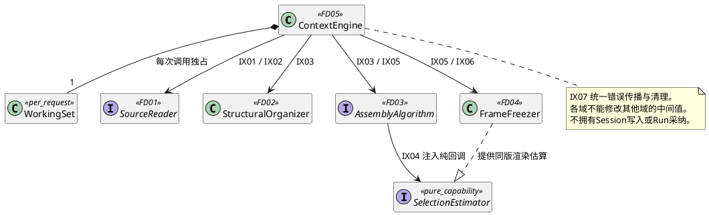

图中SelectionEstimator是现有estimateSelection能力的职责表示，不新增公共服务或另一套Schema；WorkingSet组合基数表示一次调用期间的唯一工作集，非线程安全/不可重入仍按§3.3。复杂实例关系以§5为准。

**九组场景缺口的归属。** SCG-01/04由FD-01主办、FD-04消费；SCG-02/03由FD-02主办，关联FD-01/03；SCG-05由FD-03主办，关联FD-01；SCG-06由FD-04统一计量口径，FD-03消费；SCG-07/08/09由FD-05负责提出调用方契约要求，外部Host/Session/Run/安全所有者确认。主办是设计协作责任，不把外部状态所有权移入该域。任何域间数据变化先修改本节及CTX-CON-1，再同步相关域场景和测试；域文档不得用自己的默认值关闭SCG。

**跨域验收。** 整体以§10现有场景为准，新增接口边界检查：IX-02正文齐备后外部I/O为0；IX-03/05引用空间无丢失；IX-04与IX-06的格式/算法/估算版本一致；IX-05漏必选或错误引用被拒绝；IX-06消费者修改输入不能改变候选；IX-07失败后下游执行和外部写入为0。局部UT/DT及替身集成不替代保存/采纳/接管的系统验收。

### 3.5 域间数据结构与字段约束

§3.4的交互按本节结构传递，不能靠隐式旁路补正文或关联信息。本节拥有**组件内部交换包**；复用的叶子类型仍以[CTX-CON-1](../../../contracts/context-assembly-contract.md) §1/2/2.1/2.2及其绑定CD-1为唯一字段Schema。以下结构已有本地代码；外部宿主存储接入尚需单独验收。`Ref`为契约标识，`Count`为非负安全整数，`BodyText`为合法Unicode正文；不是任意string/number。字段全部必填，不以undefined代替空集合或显式null。Readonly表示整棵值只读，实现须隔离可变别名，不只给顶层加readonly。

```typescript
type ResolvedFixedInput = Readonly<{
  system: BodyText;
  task: BodyText;
  tools: readonly ToolDescriptor[];
}>;
type CollectedSourceBatch = Readonly<{
  request: SourceReadRequest;
  result: SourceReadResult;
}>;
type CollectedSources = Readonly<{
  fixedInput: ResolvedFixedInput;
  batches: readonly CollectedSourceBatch[];
  degradedSources: readonly Ref[];
}>;
type ResolvedToolCall = Readonly<{
  identity: ToolCallIdentity;
  requestRecordRef: Ref;
  resultRecordRef: Ref;
}>;
type OrganizedContext = Readonly<{
  records: readonly SourceRecord[];
  contents: readonly ResolvedSourceContent[];
  units: readonly CausalUnit[];
  dependencies: readonly DependencyEdge[];
  historyRecords: readonly HistorySelectionRecord[];
  toolCalls: readonly ResolvedToolCall[];
}>;
type AssemblyRenderInput = Readonly<{
  basis: AssemblyBasis;
  sources: CollectedSources;
  organized: OrganizedContext;
}>;
type PreparedSelectionPolicy = Readonly<{
  requiredRecordRefs: readonly Ref[];
  optionalUnitOrder: readonly Ref[];
}>;
type CandidateBuildInput = Readonly<{
  renderInput: AssemblyRenderInput;
  selection: Selection;
}>;
```

| 结构/全部字段 | 生产者 → 消费者 / 场景 | 字段约束与生命周期 |
|---|---|---|
| ResolvedFixedInput.system/task/tools | FD-01 → FD-04，经FD-05保存；首次及继续 | 分别解析basis.systemRef/taskRef/toolsRef。tools每项完整保留ToolDescriptor，模型映射不能反向删改描述符。空文本/空工具是否允许按绑定Schema，不能以空值代替读取失败。原Artifact解码仍受SCG-04约束 |
| CollectedSourceBatch.request/result | FD-01 → FD-02；每次来源读取 | request保留binding和sourceOrdinal；result为同次读取的records/contents，成功才加入。各请求ordinal唯一，不用完成次序重排；具体跨来源分配规则仍受SCG-02约束 |
| CollectedSources.fixedInput/batches/degradedSources | FD-01返回批次，FD-05收齐 → FD-02/04；IX-02整体输入 | 固定正文必须齐备；batches为0..maxSources，仅明确无需历史/来源时可空；每来源失败不伪装成功空批。degradedSources去重，只有已允许降级的来源引用；不得据此降级必选、安全或摘要错误。保留原批次用于追踪和父来源归属，不在去重时丢掉来源路径 |
| OrganizedContext.records/contents | FD-02 → FD-03/04，经FD-05转交 | records去重后0..maxRecords，recordRef唯一。message非null的记录不对应contents；message为null的记录必须恰有一个匹配recordRef的material/memory正文；不得悬空。重复记录的正文与关系先验证一致，不能最后写入覆盖 |
| OrganizedContext.units/dependencies | FD-02 → FD-03/04；IX-03 | unitRef唯一；memberRefs非空、不重复且都存在；不同单元可引用共享前驱，不能复制来源所有权。边数0..maxEdges，端点存在且无环，方向为依赖方→前驱；工具结果边不能反向 |
| OrganizedContext.historyRecords/toolCalls | FD-02 → FD-03/04 | historyRecords仅含规范消息，recordRef与records一致，顺序按组件结构规则。每个ResolvedToolCall用完整三元identity唯一配对，两个引用必须指向匹配的请求块及结果；同一助手可拥有多个调用。尚不分配frameCallId |
| AssemblyRenderInput.basis/sources/organized | FD-05 → FD-04；IX-04与IX-05共同闭包 | 必须来自同一次组装；basis版本与正文/来源绑定一致。sources保留原读取证据，organized保留整理结果；不重复复制大正文，只引用本次冻结值。不得捕获live配置、存储读取能力或其他请求对象 |
| CandidateBuildInput.renderInput/selection | FD-05 → FD-04；IX-05 | selection只能引用organized中的unitRef并给全部单元决策，不能携带新正文。最终复核后生成独立候选；中间包及函数均不持久化 |

**选择输入的构造边界。** OrganizedContext只交结构事实；FD-03提供同步纯规则`prepareSelectionPolicy(basis: AssemblyBasis, organized: OrganizedContext): PreparedSelectionPolicy`，按basis.requirements/来源策略展开必选及可选排序。FD-05安排调用并加入limits及FD-04的estimateSelection，形成已有AssemblyAlgorithmInput。PreparedSelectionPolicy两个字段均必填、只读、请求期有效：requiredRecordRefs为0..records.length个唯一合法recordRef；optionalUnitOrder为0..units.length个唯一合法unitRef（包含必选时策略跳过已选项），顺序按冻结策略。固定system/task/tools始终在渲染基线内，不伪造对应recordRef。准备规则不改变records/units/edges，也不赋予FD-02预算职责。FD-04最终复核复用同一纯声明规则重建要求，不信任Selection自报必选。规则固定为§4.0首版约束，不由来源正文自签必选。纯策略的公开输入/输出保持CTX-CON-1不变。

| 已有交换类型 / 字段 | 使用约束（完整Schema沿CTX-CON-1） |
|---|---|
| SourceReadRequest.binding/sourceOrdinal | binding为session/run/memory/material封闭联合；绑定固定anchor/version/head/view/input。initial/create不能伪造自身历史请求 |
| SourceRecord.recordRef/identity/contentRef/message/orderKey/callBindings/dependencies | recordRef由原identity规范摘要产生；contentRef保留原Artifact证据；orderKey的sourceOrdinal/sequence/recordOrdinal均为Count。callBindings的identity含originAgentRunId/modelCommandId/callId，request的blockOrdinal必须有效，result为null；不得用当前Run覆盖原身份 |
| ResolvedSourceContent.recordRef/kind/value及memory.scoreRank | kind决定MaterialProjection或MemoryProjection；value带版本、内容引用及text；scoreRank为Count且仅memory存在。不能在非message记录中只留下Artifact引用 |
| AssemblyAlgorithmInput.units/dependencies/requiredRecordRefs/optionalUnitOrder/historyRecords/limits/estimateSelection | 结构来自organized，策略声明来自冻结basis，能力来自同一renderInput。所有集合只读，函数为同步纯计算，禁止序列化。估算返回inputTokens/inputBytes/inheritedTokens/inheritedTargetTokens四个Count，量纲分别是Token/字节/Token/Token；计量口径按§4.0 SCG-06及CTX-CON-1执行 |
| Selection.selectedUnitRefs/decisions | selectedUnitRefs唯一；每个输入unit恰有一个decision，keep/drop与最终集合一致，reason仅required/dependency/ranked/budget。试选拒绝不等于永远drop，随后被合法闭包选入须更新最终决策 |
| AssemblyCandidate.payload/trace/tokenAccounting/inputDigest/payloadDigest/selectionVersion/formatVersion/modelAdapterVersion | payload的system/task/messages/materials/memory/tools齐备；Trace记录未选来源时output=null，选中位置须有效。摘要及三个版本按原契约构造，不能摘要运行期Map或函数。TokenAccounting保留软超目标状态，不转成硬窗口保证 |

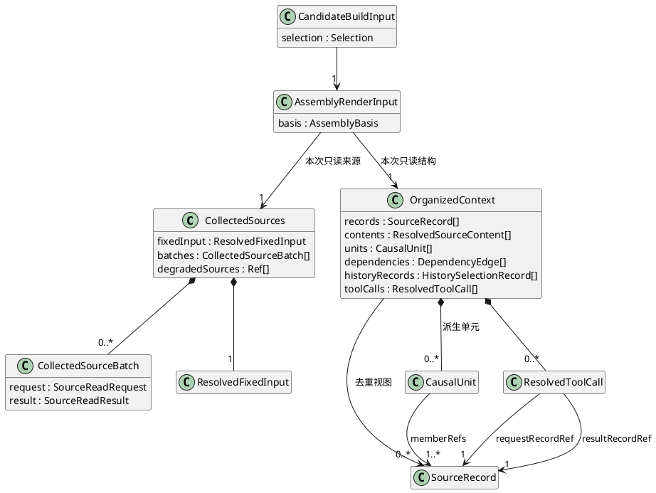

图中的组合表示本次数据包或派生值的生命周期，关联表示只读引用；不把同一SourceRecord组合进多个所有者。所有内部包随请求结束释放，只有最终候选越过返回边界。解析失败、联合变体不合法、悬空引用、集合超限按CTX-CON-1 §4失败，不能抛出新的私有跨域错误协议。补齐结构不关闭§4.0的九组业务待决项。

实现映射：本节内部交换包统一放`src/control/context-engine/assembly-data.ts`，声明准备规则放`src/control/context-engine/algorithms/selection-policy.ts`；仅组件内部消费，不导出为公共Port。各域私有Map/Set及工作结构与其算法实现同目录，公共CTX-CON-1类型继续使用§9的`src/contracts/control/context-engine/`。分类文档目录不改变组件代码层级，也不把Pi类型引入这些结构。

## 4. 外部调用场景与异常流程

### 4.0 场景梳理范围与定义缺口

本节按业务过程检查，不能以“有assemble接口”或“已有CS-01～11标题”推定场景完整。场景的最小规格包括触发与目标、前置状态、输入生产者/产生时刻、允许读取范围、参与方步骤、输出消费者和成功确认点；再检查步骤之间的取消、失败、丢响应与恢复。细化后同步CTX-CON-1、CD-1及调用方契约，最后回写§10.4测试映射。

适用维度为：首次/继续；Session不存在/已存在/只读；父继承/自身历史/当前Run；空来源/重复来源/必需来源失败；必需查询/必选内容；候选内存态/已保存/已采纳；成功/明确失败/UNKNOWN；正常串行/取消退出/失联接管。仅组合有业务意义的条件：initial没有自身Run转录、create没有自身Session历史；read_only不能占用父Session另一个当前Run；同实例并发不是支持场景，外部拒绝与旧执行迟到属于约束验收。

下列SCG编号追踪已收敛的首版场景决策，不替代既有CS编号；按简化方案、强制约束和剩余风险实施。外部宿主缺能力时必须显式记录接入阻塞。

| 场景 | 简化方案与强制约束 | 风险及验收 |
|---|---|---|
| SCG-01 Child正文 | 执行适配层交付已确认观察，输入显式expectedChildObservations列出recordRef/childId/childRunId/outcome；全部应到齐后才能选择。失败说明为非空规范文本；UNKNOWN不得进入终态观察 | 清单由外部已提交事实生成，不能用返回记录反推；缺项、重复、身份/状态不符及读取失败均拒绝，不补空、不降级；合法裁剪仅在完整性检查之后 |
| SCG-02 多路历史 | 首版按父候选、自身Session、当前Run、单Memory视图、资料顺序读取；组装器按冻结AssemblyBasis顺序派生sourceOrdinal，输入摘要绑定来源序列。同recordRef保留最小orderKey；父集合由显式parent候选限定 | 重复记录只有一份，父候选记录即计入父贡献；顺序与依赖矛盾拒绝，不自动修复或扩大读取 |
| SCG-03 用户历史 | 历史记录必须显式包含用户输入；回答与其用户输入由可信requires关系组成同轮原子单元；适配层负责从权威历史提供关系 | 不从模型回答推测过去任务；已声明关系缺端点失败；普通历史漏写关系由受信reader保证并在宿主接入验收。尚无历史写入口的旧宿主不得冒称支持跨Run继续 |
| SCG-04 来源解码 | 固定输入使用版本化JSON：system/task为{schemaVersion:ctx-text-1,text}，tools为{schemaVersion:ctx-tools-1,tools}；资料上层预切片。规范来源批次由受限reader返回，原Artifact摘要及绑定校验在reader边界完成 | 组装器不解析任意PDF/文件，未知Schema拒绝；正文不能延迟到算法阶段读取；真实存储适配器必须通过契约测试 |
| SCG-05 Memory | 每次最多一个冻结视图；required只表示读取必须成功，成功空视图允许；内容必选仅由Requirement列明。来源声明required的读取失败不得降级 | 不支持多视图混排；空视图中声明必选引用则失败；可选读取只对明确可用性错误整源降级，缺依赖仍失败 |
| SCG-06 容量 | Pi粗估为软目标；父贡献=max(0,同版完整估算-去掉父候选记录后的估算)，基线每次按同一选择集合计算。读取规范值、模型映射、完整候选分别使用独立字节限额；不缓存帧或所有闭包 | 不承诺实际Provider窗口。三种字节口径分别测L-1/L/L+1；仅必选超Token保留标记，不追加可选；字节/记录/边超限拒绝 |
| SCG-07 首次准备 | 组装器不持久化准备或中间阶段；调用方持有冻结输入和受限reader，进程退出后整次重算 | 跨重启恢复取决于调用方保存原输入；无权威准备存储的入口只能重新发起，不能承诺原操作自动恢复 |
| SCG-08 保存采纳 | 组装器只返回独立候选；外部存储/Session/Run拥有保存、绑定、采纳、UNKNOWN核对及过期执行守卫 | 禁止Context回执；A失联B接管A恢复的拒绝在外部提交点验证，不能以组装成功代替采纳 |
| SCG-09 取消重试 | async assemble；串行await reader；必传AbortSignal并在每个await前后检查；组件内部零重试，纯算法同步 | reader收到取消须结束原调用，结束前不释放独占；不使用Promise.race伪装取消；不支持不可取消reader。Deadline由外部受信宿主结合TimePort创建信号 |

上述约束是本轮首版开发范围，取代本节原“待决定默认行为”。具体外部权威存储接入仍须真实契约和测试，不能通过组件内新增持久表补齐。来源与最终候选的字节上限由装配配置显式提供，不从旧maxBytes推断多个含义。核心查询、封装和算法能力可以独立开发；完整宿主恢复能力单独记录集成状态。


### 4.1 首次任务及同会话继续：查询后延迟创建（CS-01/02）

调用者是业务适配层，前置为Host已编译logicalKey、任务及可信scope。“查询即创建”是完整入口用例的行为，查询阶段没有写副作用。lookup found生成existing锚点；absent生成create意图，不能提前伪造Session@0/head来满足旧输入类型。只有候选成功后才进入必要创建、保存与采纳。

首次调用由业务Host/Coordinator持有preparationId和来源读取能力，冻结输入保存在调用方业务操作记录中。RunAssemblyInput.initial仅声明计划Run身份，不伪造已有Run版本/head；所需Memory由Host在自身受控读取边界准备成冻结视图，不把计划Run传给要求已受理Run资格的Memory.query。Context通过受限reader消费来源，不签发授权。候选成功后才创建Session、绑定/受理Run并采纳；每个写入和派发动作仍核对自身当前资格。具体契约见CTX-CON-1 §1.1。

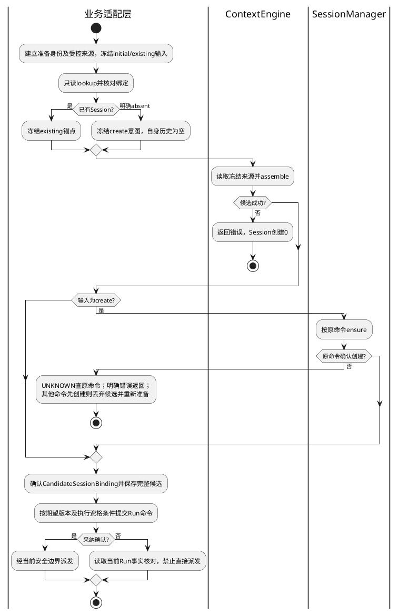

| 窗口/变体 | 处理及可观察结果 |
|---|---|
| lookup失败或已有Session归档/定义不符 | 返回错误，不将异常当absent；不复活或创建替代历史 |
| create意图组装失败 | 不创建Session，不保存候选，不调用模型 |
| 组装期间另一操作先创建同logicalKey | ensure返回created=false；不能给空历史候选换个sessionId就采纳，必须按赢家的已确认锚点重新组装 |
| 创建提交成功但响应丢失 | 用原commandId核对，返回原created/anchor；不建立第二Session |
| 创建成功、保存或采纳失败 | 保留创建事实；恢复复用原命令结果并复核目标未推进。采纳未知查Run，不能自动删除会话或重发模型 |
| 指定历史版本缺失 | NOT_FOUND/GONE，不进入创建分支；已有只读快照不要求创建权限 |

已存在输入在最终采纳点仍须符合原版本/head及业务步骤；迟到旧执行不能覆盖新状态。具体字段与原子边界唯一维护在CTX-CON-1 §1/3。

### 4.2 工具返回、文件及检索资料加入（CS-03/04）

调用者为Run业务处理器；工具调用身份及终态由执行权威确认。文件/检索结果已由工具或上层来源能力生成有界Artifact，Context不扫描整个文件系统或主动联网检索。

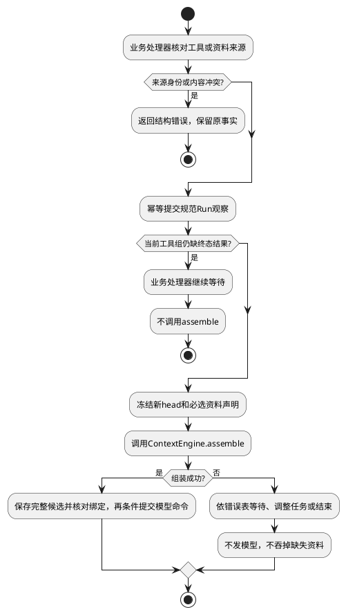

同一事件同内容重复投递去重；不同事件同文本保留；同call两个无法核对的终态拒绝。工具确认失败可作为失败观察进入完整单元，不把“失败结果”与“结果尚未知”混淆。大文件只选片段时，必选对象是任务声明的片段集合及其来源，不擅自截断必须逐字比较的范围。

### 4.2.1 完整候选的保存、模型转换与恢复（CS-09）

场景：任务要求比较A/B条款，输入还含一段Memory及完整工具轮次。旧ContextFrame只有systemPrompt/messages/estimatedTokens/reductionTrace，不能表达task、结构化资料、Memory和工具身份映射；只把返回类型改名会让调用方漏发内容。

新输出是AssemblyCandidate：payload拥有system/task/messages/materials/memory/tools；trace拥有来源位置、依赖、选择及工具映射；TokenAccounting拥有完整计量。字段全集在CTX-CON-1 §2。Frame在本文是规范输入投影的概念名，不表示复用旧代码ContextFrame类型。

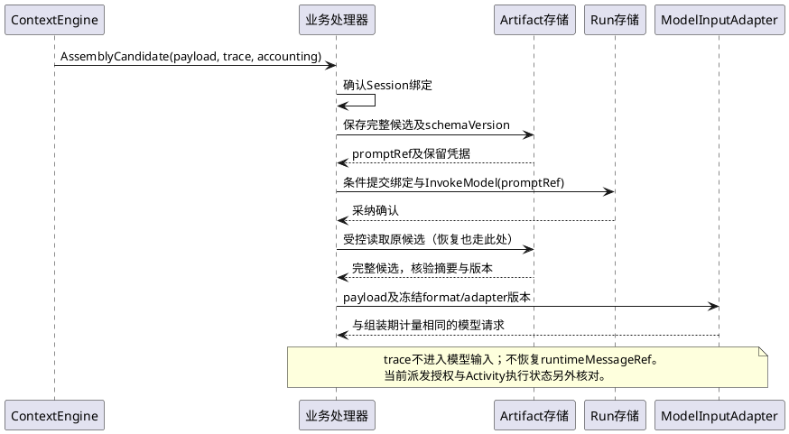

**默认转换优先复用Pi，映射按pi-context-1冻结。** system直接进入systemPrompt；规范历史按原角色及因果顺序转换；历史后追加当前user消息，依次包含task原文、资料JSON块、Memory JSON块。两个数据块始终保留，空列表编码items=[]；文本JSON转义可逆，不提升为system、不夹入内部Artifact/权限引用。tools映射为Pi name/description/parameters；风险及执行容量仍由Kernel管理。精确字段、传输元数据和版本规则唯一维护在CTX-CON-1 §2，不在各调用方重复拼装。

组装期Pi估算和派发复用同一映射；Provider包装的实际Token开销不作精确保证。未知变体在转换前拒绝，防止Pi过滤丢内容；Trace不发模型，不从runtimeMessageRef恢复另一套正文。modelAdapterVersion绑定投影、Pi版本及Provider档案；已采纳后不再自动裁剪或压缩。固定转换向量作为实现验收，不再把task/materials/memory如何封装留给开发者选择。

保存失败不得生成模型命令；保存后未采纳的孤立Artifact按存储规则处理；采纳后退出则按原promptRef解码、核验并恢复同一payload/trace/计量，不能丢失Memory后再查询补齐。Artifact损坏或旧adapter版本不可用明确失败，不静默降级。

### 4.2.2 四类来源转换（CS-11）

例如父Run历史包含一次Child委派，Memory检索同时返回两条同分资料。若reader只给正文和到达顺序，组装器无法知道Child结果属于谁，也不能稳定选择Memory。调用方先准备冻结MemoryView，再由Session、Run、Memory、Artifact四类reader返回统一SourceReadResult；业务执行适配层把Child声明/确认结果转成带原身份的任务观察，Memory保留查询结果排名。字段、错误及转换规则唯一维护在[CTX-CON-1 §2.2](../../../contracts/context-assembly-contract.md#22-来源读取结果与业务转换)。

顺序为：受控来源准备 → reader校验冻结绑定并解析正文 → 去重/配对及依赖闭包 → 纯策略选择 → 公共Pi映射。Memory reader只消费冻结视图，不再发检索命令；initial不能用plannedRunId调用Memory.query。所有正文在读取阶段准备完成，算法阶段I/O为0。Child观察保留childId/childRunId和受控结果引用，模型只见规范业务字段与正文，不接收权限/Session管理元数据。Child失败是已确认结果，UNKNOWN或本地计时器到期不能伪装失败观察。

### 4.3 sub-session 创建时的选择性上下文注入及Join（CS-05）

协调所有者是 [SessionManager/SubSessionCoordinator](session-manager/sr-03-subsession-fork-join.md)。前置为稳定Child业务身份、Parent确切版本、Child独立授权状态及冻结ParentContextSliceSpec。需要独立历史时先准备带parent的create意图，**顺序为：授权及输入冻结 → assemble候选 → branch确认 → 保存候选及绑定 → 业务采纳/Child受理**。Context不创建或归档Session，不提交FE。

一次性只读Child使用read_only输入，source固定父快照，target=null；不建立Child Session，不把Child Run绑定为父Session的另一个当前Run。需要独立追加、多轮恢复或作为Reducer Session来源时，必须使用create分支流程。

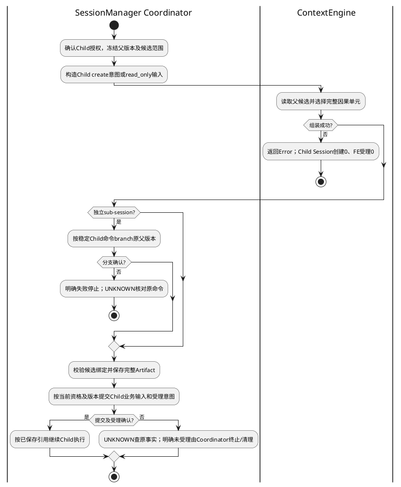

| 失败窗口 | 责任及恢复 |
|---|---|
| 父版本缺失/已回收、候选越界或必选超过硬容量 | Context返回NOT_FOUND/GONE、SCHEMA_INVALID或CONTEXT_LIMIT；不扩大范围、改读latest或创建空Child；FE受理0 |
| 读取权限拒绝或依赖不可用 | 受控reader拒绝；只读暂时故障由唯一适配层有界重试；Child创建0 |
| 候选成功后父版本不能保留、branch冲突 | Coordinator拒绝原方案；不把候选绑定另一个父版本；调整任务须重新冻结并组装 |
| branch提交成功、响应丢失 | 核对原childId/commandId，复用已确认分支，不能更换身份重建 |
| branch成功后保存失败/进程退出 | 保留分支事实；确认未采纳后按原输入重新准备候选，复核分支未推进；Context无回执可查 |
| 候选已保存，采纳或Child受理未知 | 查原业务提交及受理事实；未证明未受理前不归档，不直接重发 |
| Child明确未受理或父取消 | Coordinator记录终止并依既有协议归档专用分支；清理失败保留cleanup pending，不假报回滚 |

父后续追加不改变已冻结parentContext；候选到branch之间不保证父版本一直可用，因此必须有上述失败出口，不能为了规避失败提前创建Child。分支确认后的pin与归档/GC仍归SessionManager。read_only无专用分支可归档，不能误删父Session。SessionManager原先分支后组装的状态迁移为待同步集成项，不能宣称这条链已经落地。


Join也是独立调用场景：

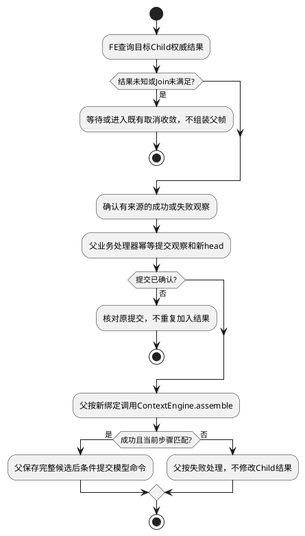

### 4.4 重复入口、崩溃恢复与权限变化（CS-06/07/08）

恢复由业务处理器读取当前Run提交和Activity事实；Context没有独立组装回执。已采纳恢复原候选，明确未采纳才允许按冻结输入重算；历史absent不能代替当前查询。恢复模型输入与重复执行模型是两个不同操作。

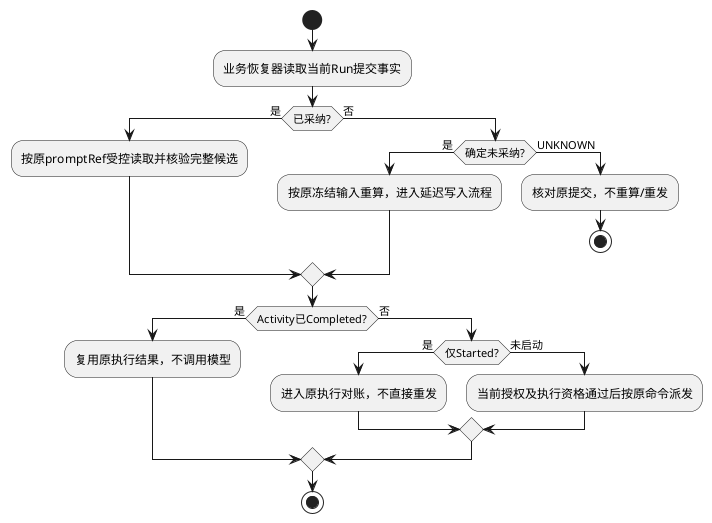

进程退出期间的外部撤销在恢复后的当前授权查询中感知；组装算法不监听权限变化。恢复事实不改写过去执行，向用户或模型再次交付正文时仍须经过当前安全边界。

## 5. 内部类关系、装配和请求数据

### 5.1 组件结构与生命周期

虚线加空心三角表示实现接口；实线箭头表示持有引用；黑菱形表示专属组成和生命周期；普通虚线箭头表示创建/临时依赖。外部服务不画成Context的组成部分。下面不是为了增加关系种类而画继承：只有具有替换契约的reader才实现同一接口。

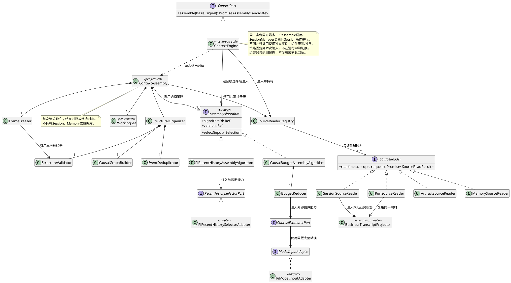

Composition Root按独占组装调用创建ContextEngine，注入reader与已选择的AssemblyAlgorithm；每次调用创建ContextAssembly及其专属工作对象。可共享的reader必须另有明确契约，不能由本类图推定其线程安全。策略不注入存储、Session或Activity端口；产物保存与Run采纳由外部调用方负责。结构规则可实现为纯函数，图中组成表示职责归属，不要求每个小对象分配堆实例。

| 对象 | 输入 → 输出 | 所有权/禁止行为 |
|---|---|---|
| SourceReaderRegistry | source kind → reader | 持有外部reader引用；不拥有被读取Session；不解释法律场景 |
| StructuralOrganizer | 规范记录 → 因果单元 | 每请求组成去重、图构造和校验职责；无I/O |
| AssemblyAlgorithm | 完整因果单元、依赖图、必选声明及预算 → Selection | 可替换的纯选择策略；不能绕过公共输入校验、最终结构校验与预算复核 |
| BudgetReducer | 单元、预算、估算器 → Selection | 只做确定性选择；不删除来源事实 |
| FrameFreezer | Selection → 不可变上下文候选 | 渲染并复核后返回值；不保存、不确认回执、不启动模型 |
| WorkingSet | 冻结绑定、记录、单元 | 请求私有；不被Parent/Child共享修改 |

### 5.2 数据组成与引用

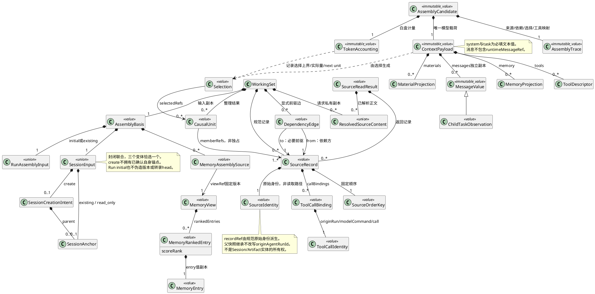

SourceRecord、SourceIdentity、ToolCallBinding、SourceOrderKey及DependencyEdge的字段和转换规则唯一维护在[CTX-CON-1结构关系契约](../../../contracts/context-assembly-contract.md#21-规范记录身份与依赖关系)。CausalUnit通过引用关联记录，可能共享必要前驱，所以不画成对SourceRecord的组合。Frame拷贝规范消息，不保留调用方可变数组；只冻结外层数组不满足此约束。

## 6. ContextEngine.assemble内部流程与算法

本节完全位于组装器内部。输入是调用方已经准备好的AssemblyBasis，输出是AssemblyCandidate或Error。发布、回执查询及确认步骤已删除；没有Session创建、Child受理或模型派发。候选保存与Run采纳归外部调用方；完整输出由CTX-CON-1定义，不能用旧ContextFrame冒充新候选。原“P0公共业务流程”名称废止。

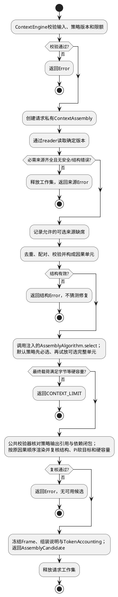

所有返回路径通过finally释放工作集；图中最后的释放节点不是唯一清理入口。受控reader负责读取边界的权限检查，组装算法不实现鉴权策略，不访问Activity或持久回执。来源读取错误先分类，optional只能吞明确可用性失败；损坏/越权不能降级。调用方负责结果交付和模型派发的当前权限检查。

### 6.1 可编码算法与终止条件

1. 校验冻结来源、模型/工具/策略/估算器版本、可信调用上下文及硬限额；注入策略身份必须与冻结selectionVersion一致。
2. reader按固定版本读取，分别限制来源数、记录数、关系数和缓冲bytes；memory=[]不调用Memory。Child有`parentContext`时只解析其精确Parent版本和candidateRefs，未列父引用读取为0；requiredRefs须为candidate子集。未定义kind或重复reader注册启动时拒绝。
3. StructuralOrganizer先按事件身份去重，再按原调用身份构造关系图，校验后形成原子选择单元。
4. 按§3.5调用FD-03的prepareSelectionPolicy展开必选记录引用和可选顺序，FD-05装配不可变因果图、预算与纯估算能力后交给注入策略。固定系统、任务、工具始终进入渲染基线；默认CausalBudgetAssemblyAlgorithm将任务必选资料及必要前驱加入必选单元集合，缺失前驱失败，不能通过丢消息掩盖缺口。
5. 默认策略按固定顺序遍历可选单元：最近完整历史 → 固定scoreRank的Memory → 补充资料。试放时补齐其显式依赖闭包；闭包整体放不下则舍弃本可选候选，不改变此前选择。替换策略可以改变可选单元的排序与组合选择，不能改变必选、授权来源和结构约束。
6. 每次试放使用完整请求估算，不假定token计数可相加；Child另计算无父候选的`T_base`及父继承目标，记录下一个放不下的完整父单元；最终恢复历史/调用正序，再做完整载荷与结构复核。
7. 公共校验器独立验证Selection仅引用输入单元、必选完整、依赖闭合及字节硬容量及Token软目标状态；FrameFreezer生成独立Frame、组装说明和TokenAccounting，返回AssemblyCandidate。任何超时/取消都停止新增I/O，清理请求内存。

```
selected = mandatoryClosure(units)
require withinHardLimits(render(selected))
for unit in stableOptionalOrder(units):
    candidate = selected union dependencyClosure(unit)
    if withinHardLimits(render(candidate)) and withinPiTargets(render(candidate)): selected = candidate
    else: traceDrop(unit, budget)
final = renderInCausalOrder(selected)
require validStructure(final) and withinHardLimits(final)
if exceedsPiTargets(final): require selected == mandatoryClosure(units)
recordBudgetStatus(final)
```

依赖图先检环，闭包使用请求期有限集合迭代，不保存所有单元的闭包缓存。建邻接表O(n+e)；首版每次排序ready队列及集合闭包最坏可达O(n² log n+n(n+e))，受记录/边硬上限约束，不宣称全流程线性。默认选择最多按可选单元数逐一试算，最终校验及父贡献计量另有有界渲染。n/e分别受配置上限约束，不用“来源256个”冒充消息数量上限。结构错误、字节等硬容量超限、取消或Deadline为立即终止条件，不循环尝试删必选项。

### 6.1.1 策略模式与独立算法代码

采用**策略模式（Strategy）**：ContextEngine负责读取及固定处理流程，AssemblyAlgorithm负责可替换的选择决策。结构合法性、完整渲染与最终预算校验在策略外统一执行；替换算法不等于可以放宽必选或安全规则。此处是代码结构设计，本轮不生成尚依赖未决接口的运行代码。

```typescript
interface AssemblyAlgorithm {
  readonly algorithmId: string;
  readonly version: string;
  select(input: AssemblyAlgorithmInput): Selection;
}
```

AssemblyAlgorithmInput是已读取并整理的不可变单元集合、依赖图、必选记录引用requiredRecordRefs、固定预算，以及同步纯函数`estimateSelection`；record→unit通过memberRefs映射，不能把两个引用空间混用。该函数使用同一规范渲染器/估算器返回完整候选的Token与byte统计，不查询远端。Selection只返回选中单元引用及受控选择原因，不携带自行拼接的正文。输入/输出类型细节在CTX-CON-1统一维护，不能在各算法文件复制简化版本。

| 代码位置（相对包src） | 设计职责 |
|---|---|
| `contracts/control/context-engine/assembly-algorithm.ts` | AssemblyAlgorithm、算法输入、Selection及策略身份的唯一类型声明 |
| `control/context-engine/algorithms/causal-budget-assembly-algorithm.ts` | 首版默认策略，独立实现§6.1的必选闭包和稳定贪心选择 |
| `control/context-engine/algorithms/pi-recent-history-assembly-algorithm.ts` | Pi备选策略的Kernel编排，复用统一必选/依赖规则，只调用纯截断Port |
| `contracts/control/context-engine/recent-history-selector.ts` | 近期历史选择端口及规范投影，不泄漏Pi SessionEntry |
| `infrastructure/adapters/pi-context/` | Pi近期历史选择适配器和模型输入转换实现；这里允许导入Pi |
| `control/context-engine/structural-organizer.ts` | 去重、配对与因果图构造，各策略复用 |
| `control/context-engine/frame-freezer.ts` | 策略输出复核、规范渲染和候选冻结；无发布副作用 |
| `control/context-engine/context-engine.ts` | 编排读取、结构整理、策略调用及候选返回；不按算法名称写业务分支 |
| `application/`中的组合根 | 从受信配置解析算法ID/版本，构造并注入策略实例；业务输入不能传类名或任意模块路径 |

切换发生在准备新的冻结输入时：组合根选择注册的`algorithmId/version`，将身份绑定到selectionVersion；未知/重复注册或版本不匹配在调用前失败，不默默回退默认算法。已开始组装不能热切换；Run已采纳的上下文仍读原promptRef，不用新算法重算。未采纳的旧输入重做须使用原算法版本，缺失则明确失败。

首版默认保持`causal-budget/v1`；按用户确认补充`pi-recent-history/v1`作为可显式选择的备选实现，具体范围见§6.1.2。它复用Pi近期历史截断能力，并保留Kernel的必选、依赖及最终预算规则。备选不是默认失败后的自动重试路径；改变来源、摘要或权限语义仍须先扩展契约。

验收新增`CTX-ALG-T-01～04`：注入两个确定性测试策略并证明只调用选定者且ContextEngine流程不变；恶意测试策略漏必选/引用未知单元/超硬容量均被公共校验拒绝；仅必选Token超目标则成功并标记；原输入不能换算法版本或未知版本静默回退；已采纳结果恢复不调用任何新策略。测试策略仅为替身，不宣称第二种生产算法已实现。以上均待实现/未运行。

### 6.1.2 Pi备选组装策略（CS-10）

用户确认：优先复用Pi转换能力，同时保留一个基于Pi的组装备选实现。默认仍为`causal-budget/v1`，备选注册为`pi-recent-history/v1`；二者共用读取、结构整理、候选类型、最终校验及外部采纳流程。组合根在冻结输入前显式选择，不在异常处理中自动切换。

**适用场景：** 任务倾向保留连续的近期历史，而非按单元尽量填满剩余空间；资料、Memory和必选规则仍按Kernel契约处理。Pi实现只替换近期历史选择，不声称Pi会读取Kernel Session元数据或独立完成全部六类输入的来源整理。

Pi的`findCutPoint()`已经通过`@earendil-works/pi-coding-agent`公开导出，可选择不以toolResult开头的近期历史后缀。它不校验跨Run调用身份、不识别Requirement和显式requires，因此备选策略仍先接收统一结构整理结果；禁止把原始乱序消息直接交给Pi作为结构修复。

调用与算法：

1. 公共整理阶段生成因果单元及`historyRecords`，按最终历史因果顺序提供不可变的recordRef和ContextMessage；字段见CTX-CON-1。该投影只包含Session/Run/允许继承的父历史，不包含资料、Memory或未授权记录。
2. 备选策略先取得必选依赖闭包，用Pi估算记录目标状态，硬容量确认可容纳；必选估算超目标时直接保留必选并标记。以`max(0,U_frame-inputTokens(必选闭包))`作为Pi近期历史目标量；目标为0时不调用Pi选取可选历史。该数值仅用于建议截断，不是总预算证明。
3. `RecentHistorySelectorPort`的Pi适配器将historyRecords机械转换为临时Pi SessionEntry，保留一对一索引映射，调用`findCutPoint()`后把截断点映射回recordRef。临时条目不创建Pi Session、不访问数据库；Pi要求的身份/时间元数据由稳定索引和固定适配档案生成，不使用随机ID、Date.now或运行时私有消息引用。具体Pi字段映射和固定向量在适配层落地前复核，不能强制类型转换。
4. 将建议后缀映射回完整因果单元，合并必选及传递依赖。若完整模型输入或父继承预算超限，逐次前移后缀边界并从必选集合重新求闭包，直到通过或无可选历史；不能只删工具结果，也不能遗留已移除单元的非必需前驱。边界最多推进历史记录数次，必选集合始终不变。
5. 剩余可选Memory和资料按已冻结默认顺序逐个试放完整闭包；最后由公共校验器独立复核结构、必选、字节硬限额及Token软目标状态，生成与默认策略同型的AssemblyCandidate和Trace。Pi选择只是候选建议，不能绕过最后复核。

`findCutPoint()`与最终估算都沿用Pi粗估语义，完整投影的重算用于统一选择口径，不承诺Provider Token硬上界。备选允许为连续后缀保留余量，不承诺默认贪心策略的0.95饱和利用率；两种策略都必须满足字节等硬容量、软目标选择规则和必选完整。Trace的keep/drop仍按完整单元记录，备选策略版本解释“未入近期后缀”的排序选择原因。

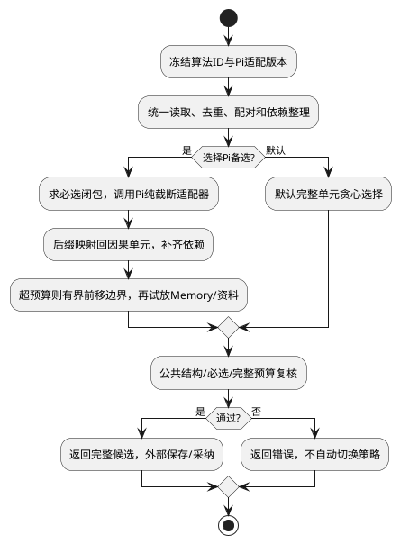

备选不调用Pi `compact()`或`AgentSession.compact()`，不触发模型摘要、自动重试或Pi会话写入。当前AssemblyAlgorithm仍为同步纯选择；未来若增加有损摘要，须独立定义生成/保存/恢复场景，不能偷偷放进此策略。

### 6.2 结构准确性

```text
助手m10：cA=read(A)，cB=read(B)
到达：rB(cB) → rA(cA) → 同事件rB重复投递
整理：[m10(cA,cB), rA, rB]
```

配对键为原来源Run、模型命令、callId，不是toolName、相邻位置或时间戳。同事件同内容去重；同事件不同内容报冲突；同call多个终态需权威回执核对，不能取最后一条。流片段须先由执行适配层形成规范终态。历史可以来自其他授权Run，但每个结果必须匹配自己的原调用；Child内部结果不能冒充父调用结果。

即使当前Session只有一个Run且调用串行，父快照/历史仍可能包含别的原始Run。采用CTX-CON-1的`ToolCallIdentity={originAgentRunId,modelCommandId,callId}`；例如`(RA,M1,c1)`与`(RB,M1,c1)`是两次调用。传入SourceRecord的callBindings必须明确request/result及助手块位置。先按recordRef去重，再按完整调用身份配对；结果到助手记录建立`tool_result_of`前驱边，助手及全部已确认结果组成不可拆轮次。最终Frame将调用身份一一映射为局部唯一toolCallId，避免内部配对正确但Provider只看到两个c1。仅改投影ID，不改原始转录/正文；映射写受控Trace。

依赖边方向为“依赖方 → 必要前驱”，成员和边端点统一使用recordRef；不得用callId或自由文本代替。缺端点、环、自引用、错误调用关系直接报结构错误。试选单元时补齐它的依赖闭包；可选闭包超过Pi目标或硬容量整体不选；必选仅Token超目标则保留并标记，硬容量超限才失败。DependencyEdge不授予读取权限，也不允许reader越过冻结来源去补latest。

结构整理保护八项不变量：来源身份、版本、角色、调用对应、结果完整性、稳定顺序、原文保真、裁剪依赖闭包。system只来自可信配置；外部资料中的指令文字仍是资料，不能变成控制指令。格式器不得改数字、否定词、来源范围或失败标记，也不能在未声明规范化策略下改变原文。

完整旧轮次是首版裁剪单位；显式跨轮依赖通过闭包补齐，不把所有历史并成一个无限大组。上下文不能从自然语言证明所有隐含依赖，因此不宣称结构验证等于业务语义完整或事实真实。Memory的supersedes和事实可见性归MemoryManager；两个不同Entry内容矛盾不能被文本去重擅自覆盖。渲染后再校验角色和调用—结果集合，防止格式转换破坏结构。

### 6.3 预算、摘要与追踪

首版Token计量采用Pi estimateTokens，属于软约束。估算覆盖固定映射的消息、system和工具schema文本，但不保证Provider实际请求Token不超窗。UTF-8字节、来源/记录/关系数量和Deadline仍是硬限制。估算方法及完整TokenAccounting唯一维护在CTX-CON-1 §2。

输入目标`U_frame=min(inputTokenLimit,modelWindowTokens-outputReserveTokens-estimatorMarginTokens)`；父继承目标`U_parent=max(0,min(maxInheritedTokens,U_frame-T_base))`，T_base为去除父内容后的Pi估算。可选项按目标选择；必选闭包超过任一Token目标时保留全部必选，不再追加可选，返回required_over_target。仅估算超目标不触发CONTEXT_LIMIT，硬容量超限仍拒绝。FrameFreezer独立重算并确认超标候选只含必选闭包。

默认策略0.95饱和夹具只评价固定估算表下的选择效率，不是Provider窗口或账单准确率。Pi备选不承诺该填充率。Provider usage仅作为偏差观测，首版不以校准容差阻塞交付；Provider拒绝超窗时返回执行失败，不修改已采纳候选自动重试。

固定夹具：必选估算60，H2增加25、H1增加30、M1增加10，目标100，应选H2/M1并丢H1，总估算95。必选改101且字节合法，仍返回必选候选及required_over_target；把字节改为maxBytes+1才返回CONTEXT_LIMIT。父基线64、输入目标100、父配置40时父目标36；10个各4的可选父单元选9个。实际测试固定文本和估算表，不由被测算法生成期望。


首版不调用模型做有损摘要；已有摘要必须证明覆盖来源、版本、生成策略和可用范围，否则reader不启用。系统、任务和当前必选链不允许摘要替换。Trace记录原来源、选中/裁剪/依赖补齐/降级的受控证据；普通日志不保存这些正文。摘要扩展未启用不阻塞无摘要首版。

## 7. 并发、提交和恢复

### 7.1 正常串行与外部异常边界

| 并发场景 | 控制点 | 确认点 |
|---|---|---|
| 同一logicalKey并发ensure | SessionManager唯一键及命令回执 | Session及回执事务提交 |
| 来源读取时变化 | 指定版本/head与保留引用；分页不混版本 | 输入绑定和来源证明一致 |
| 同组装身份重复入口 | SessionManager/业务宿主排队或返回已采纳结果，禁止重复并发进入组装 | 外部业务采纳点；不要求Context确认竞争 |
| Parent/Child并行组装 | 不共享ContextEngine实例；独立实例及Frame副本 | 各自串行调用完成 |
| 旧结果晚到/取消撤销 | 业务采纳比较期望步骤；派发前当前资格检查 | 原有业务命令提交及安全启动点 |

`Session@7 + RunHead@42 + Memory@12`不是跨库同一时刻事务；需要每个来源固定并满足已声明因果约束。Session已覆盖的Run事件按原始recordRef去重，缺口不能被去重掩盖。不持有Session长锁等待模型。独立Session可并行，但不能重入同一个组装器实例。

撤回组装器内部“共享在途Promise”的可选优化。排队、重复请求和取消等待由外部协调处理。非线程安全不取消来源版本校验，也不取消最终提交处对旧执行资格的拒绝。

### 7.2 决策点三：什么场景需要确认

在§3.3前提成立时，正常同Session组装不存在两个合法调用竞争确认。原“两个组装器同键竞争、先到先得”不再是组件必须处理的正常场景。

| 触发场景 | 具体轨迹 | 应由谁处理/对回执的结论 |
|---|---|---|
| 重复业务入口 | 用户双击或网络重投，同一操作到达两次 | SessionManager/业务宿主串行及幂等；不是内部加锁理由 |
| 失联后旧执行恢复 | A暂停，B接管，A又尝试提交候选 | 外部采纳事务校验执行资格和版本；见SES-TAKEOVER-T-01～03；只按组装摘要确认不能代替执行资格 |
| 采纳提交成功但响应丢失 | Run已保存InvokeModel(promptRef)，调用方未收到确认 | 查询原Run命令/提交回执；恢复使用已保存promptRef，不另选候选 |
| 采纳前组装失败或进程退出 | 候选没有进入已提交命令，恢复时可选Memory已恢复 | 若确认原操作未采纳，可按同一冻结输入重算；只有已采纳结果必须固定。若仍需“采纳前第一次候选也永不变化”，须提供额外业务场景并另行决定 |

已采纳的降级决定随完整候选保存并由Run命令固定。采纳前候选计算失败或退出，不要求固定“第一份内存结果”；但重算仍使用原冻结版本与权限范围。可选来源恢复后的差异不能覆盖已采纳结果。

旧帧晚到仅作为接管/绕过串行约束的故障注入：A/head42暂停，B接管后提交head43，再收到A候选。调用方条件采纳失败，A模型派发0，不能覆盖B。创建Session、保存候选和业务采纳分别有确认点；产物存在不是已采纳证明，摘要相同也不证明旧执行仍有资格。

### 7.2.1 决策点四：回放和鉴权的业务场景

这里的回放是复用持久化事实，不是再调用一次模型。授权控制“现在能否读取/交付/执行”，不会改写过去已经发生的事实；Session操作串行不阻止外部权限撤销。

| 场景 | 时间顺序 | 处理与责任 |
|---|---|---|
| 恢复后重新发送上下文 | t1保存含合同A的promptRef；进程退出；t2撤销A权限；t3恢复，模型尚未发送 | 业务宿主/安全边界在重新读取受保护正文及派发前复核当前授权；拒绝时正文交付0、模型新调用0，保留原历史 |
| 读取与返回之间撤销 | reader获准读A；封装过程中权限撤销；随后返回正文 | 来源reader负责读前检查，返回边界复核交付资格；撤销先确认则不得返回正文；不要求封装纯算法每个步骤鉴权 |
| Activity已Completed，仅恢复执行事实 | 模型结果已保存，AgentRun业务状态尚未提交即崩溃 | 受信恢复器复用原结果/引用补齐状态，不重发模型、不把当前撤销改写成“过去没执行”；若要向用户/下一次模型释放正文，另走当前权限检查 |
| 缓存或Memory查询结果复用 | 第一次有权查询，随后命中已有View或Frame | 引用、摘要、缓存命中及Completed都不是授权；复用正文前经原安全能力检查。Memory安全命令回执沿用CD-1 |
| Started但没有Completed | 外部调用可能已经发生，完成记录丢失 | 公共Activity/业务适配层对账；不能重新鉴权后就当作允许重发 |
| 旧查询记录为absent | 先查未采纳，后提交成功但响应丢失，恢复再次查询 | 对账必须读当前持久事实；不能回放旧absent并据此重做。此查询边界属于外部恢复协议 |

不应把整个assemble连同鉴权放入一个可跳过的Activity回调。纯查询/封装是否需要Activity须逐操作按副作用决定；当前实现中`FlowContext.prepare`在模型命令提交前重建上下文，Activity包裹的是ReAct命令。以上是候选场景与责任边界，当前代码不据此宣称已经接通全部安全检查。

### 7.3 统一错误出口

错误全集及重试分类见CTX-CON-1。结构/授权/绑定/预算错误不自动重试；可选依赖可用性故障才允许降级；只读暂时失败最多3次且在总Deadline内，由一个适配层拥有重试，避免嵌套乘法重试。模型/工具外部执行不因Context失败自动重发。

组装超时、取消及外部采纳提交未知都返回可辨识错误；Context不patch Run。调用方按自身流程选择等待、失败或显式调整任务后建立新版本；恢复不得改用latest、清空历史、扩大权限或丢弃原失败事实。

## 8. 数据存储、配置及安全运维

权威Session/Memory及分支pin沿用各组件；Context工作集不持久化。组件只返回候选，调用方整体保存payload、trace及计量，并通过Run命令固定引用。CTX-CON-1第3节定义调用方保存及采纳恢复契约，组件不创建持久回执表。

候选容量档案：来源≤256、规范记录≤1024、显式关系≤4096、模型映射≤1MiB、规范读取≤4MiB、完整候选≤4MiB、输入Token软目标32768、输出预留4096、外部截止目标5秒；首版不缓存帧；模型窗口与估算余量按冻结Provider配置校验，不能由这些默认值推定。P99≤200ms是设计目标，记录/关系新上限是待容量验证的候选值。请求截止只能收窄，配置版本随Run冻结。

来源读取/Frame释放/模型派发各自复核scope与当前授权；Ref、digest和Completed均不构成授权。普通遥测仅有组件、阶段、结果、错误、数量、时长，以及TokenAccounting中的聚合计数/版本/利用率；Prompt、Memory、参数、Secret、Permit、候选引用、内容摘要与物理路径不得进入普通日志。必要安全审计遵循公共Journal确认点，不把普通日志成功当安全事实。

诊断顺序：输入绑定 → Session/分支创建事实及Run采纳事实 → 来源与结构 → 必选容量 → 当前业务步骤/授权 → Activity未决状态。新增UNKNOWN按公共规则告警；Context延迟阈值与窗口需运维复核后配置。禁止直接改数据库、删历史或放宽权限解除错误。

## 9. 扩展结构与实现映射

组装选择算法的切换按§6.1.1策略模式实现；新增算法仅增加独立实现与受信注册，公共结构验证和候选冻结不复制。核心代码归`src/control/context-engine/`，策略归其`algorithms/`子目录，公共类型归`src/contracts/control/context-engine/`。`PiRecentHistoryAssemblyAlgorithm`也在核心算法目录，但只依赖RecentHistorySelectorPort，不导入Pi；真实Pi调用放在`src/infrastructure/adapters/pi-context/`，由组合根注入。
新增“合同条款片段”只需实现SourceReader、注册受支持kind及版本、输出通用规范记录，并添加缺失/越权/超限/来源范围测试；ContextEngine不增加“合同审查”分支。组合根启动时检查重复kind和漏配，未知kind默认拒绝。新增估算器实现ContextEstimatorPort并使用固定测试向量，不复制BudgetReducer。

当两片段须共同保留，由Requirement描述成员关系，结构闭包统一处理，不为每个业务场景新建选择算法。新摘要reader必须先定义可验证覆盖与有损策略，否则保持未启用。直接守卫用于输入/预算合法性；不同来源通过接口替换，不把复杂分派藏在一个Manager。

| 开发单元 | 本地实现 | 验收边界 |
|---|---|---|
| 输入、读取与结构 | `contracts/control/context-engine/`与`control/context-engine/`；固定Schema、受限reader、独立Child清单、去重/工具配对/依赖图 | Memory与Artifact具备具体reader；Session/Run的权威业务历史投影由宿主提供，不能使用测试批次替代生产来源 |
| 算法与封装 | 独立causal-budget/v1、pi-recent-history/v1及FrameFreezer | 同一Pi映射估算、Token软目标、模型/工作集/候选独立硬字节限额、无Context写入 |
| 公共装配 | `application/context-assembly-composition.ts`经`src/index.ts`导出createContextAssembler；Flow运行链使用ContextEngineFactory按冻结来源创建ContextEnginePort | 显式策略、作用域读能力及AbortSignal；每次真正组装调用均为`assemble(basis, signal)` |
| 外部宿主迁移 | `flow-context.ts`和`run-flow.ts`已使用新候选模型及ContextEnginePort；历史来源仍由宿主在每轮冻结后交给工厂 | 尚未接通SessionManager的权威Session/Run查询、延迟创建、业务采纳和进程接管；不能把本地运行链迁移扩大为完整SessionManager集成 |
| 分层测试 | AK-CTX-101～114、201～203、301、401 | 14个Pi/SQLite集成、3个纯算法UT、1个依赖边界DT、1个公开入口SQLite关闭重开测试；真实Run采纳/接管仍独立验收 |

代码状态与candidate设计批准状态分别记录；旧实现保留是当前宿主迁移未完成的事实，不是新增兼容协议。新增组件不能伪造Session锚点或跳过权威历史来适配旧调用方。

## 10. SFMEA、测试与验收


下表保留原 `L1-CMP-009-` 前缀，SC/REQ/FM/TC 的同编号一一对应；07—19为前轮候选；本轮继续沿用。风险不机械填 O/D 或 RPN，无运行证据保持待评。原联合风险入口为[统一验收矩阵](../../../reviews/components-2026-09-07/acceptance-matrix.md)。

| 编号 / 场景       | 原因及系统影响                   | 检测、控制和恢复                  | 测试层级 / 精确预期                            |
| ------------- | ------------------------- | ------------------------- | -------------------------------------- |
| 01 / CS-01、06 | 非确定排序导致恢复输入漂移 | 固定Session@7/head A/估算器与格式 | 纯规则+契约：相同来源证据两次payload规范字节与Trace等价，payloadDigest一致 |
| 02 / CS-03    | 工具结果被拆散导致错误推理             | 因果分组，当前链必选                | UT+集成：完整保留或CONTEXT_LIMIT，无裸结果          |
| 03 / CS-02    | 混读Session@8破坏冻结输入         | 固定版本，屏障控制并发追加             | 契约+集成：请求7只含7，不含8                       |
| 04 / CS-07    | 少计包装/工具schema导致Provider超限 | Pi估算软目标、字节硬限制及Provider错误处理               | UT+契约：Token测必选L+1仍保留并标记、可选L+1不加入；byte L+1拒绝       |
| 05 / CS-08    | 冻结前撤销泄露Memory             | 读/释放/派发分别复核               | 集成：屏障在读取后撤销，返回正文0、模型调用0                |
| 06 / CS-07    | 依赖失败被当空历史继续               | 必选失败、只读有界核对               | 集成：业务处理器收到失败；模型调用0，不改Run               |
| 07 / CS-06    | 可选来源恢复改变已冻结结果             | Run采纳固定完整候选及降级列表                  | 集成：首次Memory不可用，恢复服务后同键仍原帧且不重检索         |
| 08 / CS-06    | 重复入口/接管导致旧候选被采纳 | 外部串行与Run条件采纳校验 | 集成：同Session合法进入不重叠；旧执行不写入；关联SES-TAKEOVER-T-01～03 |
| 09 / CS-06    | Artifact保存/Run采纳响应丢失误报未发生      | 同键查询与公共Activity对账         | 混沌：提交前后SIGKILL；恢复无新增模型/工具执行            |
| 10 / CS-03    | 相同事件重复、同文本误去重             | 源事件身份和内容校验                | UT：同事件一次，不同事件同文本两次；身份冲突拒绝              |
| 11 / CS-05    | Child共用可变帧或越权继承           | 独立值及收窄来源                  | 集成：修改父输入不改Child Frame；超范围读取0           |
| 12 / CS-08    | 回放绕过撤销或新visit误复用          | 复核授权、冻结业务输入绑定和Activity身份  | 系统集成：Completed旧帧不绕过撤销；新访问的新输入不误命中      |
| 13 / 扩展       | reader遗漏或重复注册造成静默空数据      | 装配穷尽验证                    | 结构验收：启动拒绝；扩展不修改中央业务分派                  |
| 14 / CS-04    | 超大来源占用无界内存                | 读前后byte限额、有限缓冲            | UT+容量：超限停止读取，内存不随来源原始大小增长              |
| 15 / 并发晚到     | head42结果在head43后到达        | 业务采纳条件比较当前期望步骤与绑定         | 双屏障集成：head43不被覆盖，旧帧派发0                 |
| 16 / 结构乱序     | 两次同名工具并行、结果乱序及重复投递        | 按原调用身份配对及事件去重             | UT：输出cA/rA、cB/rB各一次；交换到达顺序输出不变         |
| 17 / 结构冲突     | 同事件异内容或同call两个终态          | 身份/内容与终态回执校验              | 契约：明确拒绝，不取最新，不调用模型                     |
| 18 / 实例作用域 | 组合根把非线程安全实例共享给并行调用 | 按独占调用装配，外部负责串行及取消收敛 | 集成：同实例进入区间不重叠；不同Session并行使用不同实例；取消后待finally退出才可结束占用 |
| 19 / 结构闭包     | 裁剪破坏跨单元显式依赖或格式器改角色        | 选择前依赖闭包和渲染后校验             | UT：补前驱/整组丢弃/必选失败按策略固定；角色提升拒绝           |
| 20 / CS-05      | sub-session默认复制父全文或读取未列候选     | ParentContextSliceSpec精确候选及授权复核 | 系统集成：仅候选完整单元进入Frame；父全文复制数0、越权读取0、FE受理1 |
| 21 / CS-05 | 已采纳恢复改读Parent latest或重新选择更多内容 | inputDigest和父版本冻结；已采纳读原候选 | 崩溃恢复：采纳后Parent@8追加，恢复仍读取Parent@7原payload/trace/TokenAccounting |
| 22 / CS-05      | 估算器漏计包装或版本漂移，估算目标失真       | 完整Frame复核、版本绑定、Provider usage偏差观测 | 契约+系统：饱和夹具不超U_frame，利用率门槛满足；版本异配拒绝；usage偏差只记录，不作为首版门禁 |
| 23 / CS-05 | 候选/绑定/保存未完成就提交FE | Coordinator以已保存候选及已确认绑定作为受理守卫 | 系统集成：组装失败时Child创建0、FE受理0、Provider调用0；受理UNKNOWN保留分支核对 |

测试手段：冻结估算表、Fake Session/Memory/Artifact 端口、ManualClock、可注入身份源和取消信号；并发使用双屏障，不靠 sleep 碰撞。真实恢复使用独立临时 SQLite、真实子进程终止及只读回执核对；模型用 Faux Provider 记录调用数，不使用付费 API。纯算法测试不证明授权与持久性已接通。

每例保存合成输入、契约/配置/代码版本、屏障顺序、调用轨迹、独立期望与实际结果、清理情况。容量验证保留原最大合法输入 10,000 次/P99 档案，另做固定有界负载 30 分钟稳定性；不从这些数量推定所有场景已通过。


### 10.1 延迟创建与载荷交付的场景验收

下列ID保留为设计追踪，执行证据按§9及acceptance.json中的AK编号核对；未映射的场景不计已通过。

| ID / 场景 | 注入与独立期望 |
|---|---|
| CTX-SESSION-T-01 / CS-01 | lookup absent，分别注入必选缺失和字节硬容量超限：ensure/branch/模型调用均0；输入不含伪造锚点 |
| CTX-SESSION-T-02 / CS-02 | existing@7组装后推进@8：条件采纳拒绝，不创建新Session，不派发旧候选；指定@7缺失不能变create |
| CTX-SESSION-T-03 / CS-01 | 屏障停在候选返回后，另一业务操作先创建并追加历史：ensure created=false，原候选采纳0，重新准备后含赢家确定版本历史 |
| CTX-SESSION-T-04 / CS-01/05 | ensure/branch已提交后丢响应：原命令核对返回相同锚点，Session/分支创建总数1；未确认时模型0 |
| CTX-SESSION-T-05 / CS-05 | Child候选失败：branch数0；候选成功但父pin失败：FE受理0，不改读latest；read_only的创建/归档/父当前Run写入均0 |
| CTX-SESSION-T-06 / CS-01/05/06 | 创建后分别在保存前、采纳前、采纳响应后退出：保留原创建事实；unknown不重算；确认已采纳恢复原引用；旧执行晚到按SES-TAKEOVER-T-01～03拒绝 |
| CTX-PAYLOAD-T-01 / CS-09 | 固定task、A/B资料、Memory和跨Run同callId完整轮次：字段全部存在，来源位置/工具映射可核对，Trace不进入模型 |
| CTX-PAYLOAD-T-02 / CS-09 | 完整候选序列化后新进程读取：payload、trace及计量深度等价，输入不存在runtimeMessageRef，读取Memory/运行时私有消息次数0 |
| CTX-PAYLOAD-T-03 / CS-09 | 用固定适配向量核对组装计量与派发请求；task/materials/memory无丢失、正文字符保真、角色和调用关系一致、包装计入预算 |
| CTX-PAYLOAD-T-04 / CS-06/09 | 分别破坏payload、Trace和schema/adapter版本：摘要或版本错误拒绝，模型0；不得重查来源或退回旧ContextFrame |

采纳前可选Memory不可用，确认未采纳后恢复服务可以重新选择；采纳后同样故障恢复必须保持原降级列表。两种结果需分别验证，不能用“第一次算出候选”代替采纳边界。

新增结构关系用例`CTX-REL-T-01～06`的完整夹具和独立断言见[CTX-CON-1 §2.1](../../../contracts/context-assembly-contract.md#21-规范记录身份与依赖关系)：跨Run同callId、同Run跨模型命令同callId、依赖闭包、非法图、重复来源与冲突、渲染后ID唯一。均待实现/未运行，纳入结构准确性验收，不能由同Session串行测试替代。

新增首次准备验收CTX-SESSION-T-07：Session/Run实体均不存在时，Host以受限来源能力完成冻结输入；Context自身创建及授权签发次数0；拒绝无权来源，禁止用计划Run调用旧Memory.query。CTX-PAYLOAD-T-05：固定pi-context-1向量覆盖空列表、中文/换行/引号及完整工具轮次，验证固定user块顺序、原文可逆、无内部引用，估算与派发映射一致。

### 10.2 来源转换验收（CS-11）

以下为待实现/未运行的契约及集成用例；固定期望不得由被测转换器生成。

| 测试ID | 输入/故障与精确预期 |
|---|---|
| CTX-SOURCE-T-01 | 同rank的Memory B/A乱序返回，输出固定A/B；不同查询同Entry不同rank不改变事实版本；重复同事件跨来源仅输出一次 |
| CTX-SOURCE-T-02 | 分别篡改view的版本、queryDigest、epoch及条目内容；返回绑定/摘要错误；权限撤销返回安全错误，optional也不降级；initial不调用Memory.query，缺受控准备入口时创建数0 |
| CTX-SOURCE-T-03 | Session和Run读取同Child声明/成功观察：去重后一个完整轮次，原父事件身份与Child关联保留；Pi输出声明文本及任务观察user消息，toolCall/toolResult数0 |
| CTX-SOURCE-T-04 | 已确认Child失败保留errorRef及规范说明；另注入UNKNOWN、未经finalization的结果、错误childId、重复终态及缺声明：拒绝，不编造结果，不派发模型 |
| CTX-SOURCE-T-05 | Pi建议截在Child结果前或预算容不下完整轮次：按闭包整轮取舍；必选仅Token超目标保留整轮，字节超限失败 |
| CTX-SOURCE-T-06 | material/memory正文缺失、引用悬空、重复正文或未知kind拒绝；成功后禁止reader/Artifact I/O仍能完成两种纯策略；中文/换行/JSON转义原文可逆，管理字段不进模型 |

### 10.3 Pi复用与备选策略验收

| ID / 场景 | 独立断言（均待实现/未运行） |
|---|---|
| CTX-PI-T-01 / CS-09 | task、A/B资料、Memory、工具调用结果全部经Pi转换保留；未知变体明确失败，Trace及私有runtimeMessageRef不交付模型 |
| CTX-PI-T-02 / CS-09 | 固定payload和适配版本下，组装期完整估算输入与派发输入一致；恢复后不触发Pi自动压缩或二次裁剪 |
| CTX-PI-T-03 / CS-10 | 必选A位于Pi建议截断点之前，最终仍保留A原文及其依赖；跨Run同callId和乱序结果先由公共整理正确配对 |
| CTX-PI-T-04 / CS-10 | Pi后缀建议经完整投影重估超过目标时有界前移；仅必选估算超标则保留并标记；字节超限才返回CONTEXT_LIMIT |
| CTX-PI-T-05 / CS-10 | 同冻结输入只调用指定策略；Pi错误/版本缺失不切默认，默认错误不切Pi；已采纳恢复调用两种选择策略的次数均0 |
| CTX-PI-T-06 / 结构 | Kernel策略无Pi导入；Pi适配器无Session创建、compact、模型请求或时钟/随机身份依赖；临时Entry→recordRef映射可逆且稳定 |

### 10.4 场景缺口与测试覆盖闭环

下表与§4.0首版方案一一对应。CTX-SC-T-01～09为设计追踪ID，执行映射按§9；每组包含多个向量，部分用例通过不能标为整组已覆盖。外部Host恢复及采纳尚未完成实际接入。

| 缺口 / 测试ID | 固定输入、顺序或故障注入 | 已确认的不变量与待补精确期望 | 层级 / 既有用例 |
|---|---|---|---|
| SCG-01 / CTX-SC-T-01 | 固定Child任务A，分别成功B、确认失败、UNKNOWN，Parent随后组装 | 保留真实Child身份，不转成toolResult；UNKNOWN不编成终态。清单来自外部事实；缺项、空正文、UNKNOWN在选择前失败，合法裁剪发生在完整性检查之后 | 契约、集成 / CTX-SOURCE-T-03/04 |
| SCG-02 / CTX-SC-T-02 | Parent事件P、自身事件C、当前Run事件R；P在两个来源重复；再执行read_only并注入候选外X | 同一原事件只输出一次，X读取0。顺序P/C/R；去重保留最小orderKey，父候选成员按同版估算差值计父贡献 | UT、集成 / CTX-REL-T-05、CTX-SESSION-T-05 |
| SCG-03 / CTX-SC-T-03 | 首轮任务“比较A/B”及回答，保存后重启；次轮任务“继续” | 历史不能由reader猜造，当前任务不能被覆盖。reader提供已保存的user及回答requires边，同轮裁剪；真实宿主历史写入/恢复仍需接入验收 | 契约、系统 / CTX-PAYLOAD-T-02 |
| SCG-04 / CTX-SC-T-04 | system/task/tools及两个资料片段；分别缺正文、错Schema、重复身份异正文；完成读取后关闭I/O | 结构/摘要错误不降级；纯算法阶段外部读取0。ctx-text-1/ctx-tools-1版本及字段严格验证；片段fragmentRef=sourceRef，错误不补空 | 契约、集成 / CTX-SOURCE-T-06 |
| SCG-05 / CTX-SC-T-05 | required=true视图分别空/非空/不可用，两视图同rank，资料D依赖不可用M | 越权/损坏不能当可用性降级，必选不能静默删除。空视图成功，内容必选只由Requirement；最多一个视图，同rank按entryId；第二视图拒绝 | UT、契约、集成 / CTX-SOURCE-T-01/02、CTX-REL-T-03/04 |
| SCG-06 / CTX-SC-T-06 | 独立构造载荷、Trace及读取总量各自L-1/L/L+1；必选Token单独超目标；父内容重复 | 仅必选Token超目标保留且标记，真实硬容量不能忽略。maxWorkingBytes/maxBytes/maxCandidateBytes独立边界，Pi软目标；不能用被测估算器生成选择预期 | UT、集成 / CTX-PI-T-04、§6.3固定向量 |
| SCG-07 / CTX-SC-T-07 | 无Session/Run时准备，分别在准备保存前后退出；恢复期间撤销读取权限 | 不伪造Run claim，组装失败时Session创建0。Context不保存准备；宿主无持久输入则只能重新发起，不能承诺原准备恢复 | 集成、系统 / CTX-SESSION-T-01/07 |
| SCG-08 / CTX-SC-T-08 | 候选保存后暂停，Session推进；另在采纳提交后丢响应；只读Child消费 | 旧绑定不得采纳，UNKNOWN先查事实，已采纳复用原候选，read_only不占父Run槽。提交/查询和只读执行仍须外部Session/Run实际实现并验收；组件不新增回执 | 系统、真实进程恢复 / CTX-SESSION-T-02/06、SES-TAKEOVER-T-01～03 |
| SCG-09 / CTX-SC-T-09 | 双屏障暂停reader，取消/截止到达后返回；另连续注入暂时失败 | 退出完成前不复用实例，不因取消发模型。必传AbortSignal、内部只尝试一次、等待原reader结束；Deadline由受信宿主产生信号，无sleep概率碰撞 | 集成、系统 / §10第18项、CTX-SESSION-T-06 |

验收反查顺序：场景目标及有效组合 → 正文行为/契约 → 独立预期 → 测试实现/登记 → 执行证据。逐项记录状态，待决场景不能计入“已覆盖”，已有同名用例不能替代新组合断言。纯规则用例只证明结构/选择；涉及准备持久化、采纳及接管的用例必须验证真实提交和新进程恢复，不能由内存替身结论代替。

系统级既有高价值接管用例继续以[Session接管测试](session-manager/session-takeover-tests.md)为唯一详细定义；本节补充Context入口/出口断言，不复制或削弱SessionManager的跟踪责任。场景变更时同时更新本节与对应调用方测试。来源Schema、顺序或计量仍待决时，统一列入§4.0，不在写测试时自行选择。

## 11. 升级、回退与交付顺序

1. 先闭合§4.0的场景定义及§10.4独立预期，再联合复核CTX-CON-1的SessionInput、完整候选、ModelInputAdapter及调用方采纳契约，生成强类型Schema和固定编码/转换向量。SessionManager须同步先branch后assemble的旧调用位置与状态迁移；未完成不能实施依赖该流程的集成。
2. 核心类型归`src/contracts/control/context-engine/`，组装代码归`src/control/context-engine/`。先实现结构/预算纯规则，再接reader、延迟创建及Run持久恢复；旧ContextFrame只作为当前实现差距，不自动兼容新候选。
3. ctx-input-1、ctx-candidate-1及冻结modelAdapterVersion显式选择；当前FlowContext/模型适配器须完整保存和消费新候选，不能强制转换类型或把遗漏字段拼入旧消息蒙混编译。
4. Run已采纳引用由匹配版本恢复器读取；回退先停止新版本受理，保留活跃引用及未决执行事实，不用旧算法重算并重发。物理存储迁移在实施前单独准备。
5. 本轮已按用户授权实现独立组装器、Pi适配、资料/Memory读取及分层测试，未新增业务数据库表。外部Session/Run的权威历史投影、延迟创建及候选采纳尚未接入旧宿主；该依赖不能由测试reader或伪造版本填补。独立组件实现与整条运行链迁移分别验收。

## 12. 评审覆盖、迁移映射与证据

| skill要求 | 本文位置 | 结论 |
|---|---|---|
| 场景、前后置、异常与恢复流程 | 第4节外部场景及载荷交付流程图，包含Child绑定/受理/Join失败 | 已形成候选行为规格 |
| 类关系、装配、生命周期和数据所有权 | 第3/5节，两张PlantUML类图及关系图例 | 接口实现、专属组成、持有引用分别表达 |
| 算法、终止条件和扩展实例 | 第6/9节 | 结构与预算纯计算边界明确 |
| 数据契约、幂等、事务与回退 | CTX-CON-1、第7/8/11节 | 本地Schema及Pi转换已实现；SessionManager/Host持久调用链仍待实际接入 |
| SFMEA、UT/集成/混沌、独立期望 | 第10节 | 执行映射见§9；未实现的外部恢复/接管向量不计覆盖 |
| 架构/安全/数据/测试/运维评审 | ACR-0013 | 自审有证据，未冒充批准 |

旧文档迁移：P1→4.1/4.2；P2→4.2；P3→4.3；P4→4.4/7；P0→6“assemble内部流程”；原类图→5.1/5.2；原结构准确性→6.2；原并发→7；原19组验收→10；原开放项O-01—04→CTX-CON-1及G3联合复核；O-05→摘要条件启用。保留既有安全、幂等、预算和恢复不变量，取消重复概要与补丁章节。

文档覆盖：本轮将简化方案、约束和风险同步到场景、字段及测试预期。用户已授权本轮组件实现，设计文件仍保留candidate，跨组件联合审批不冒充完成。本地实现和当前验证以§9及本次运行报告为准；历史ACR记录不替代本次结果。图语法、视觉、文档门禁、运行测试与旧宿主迁移分别报告。
