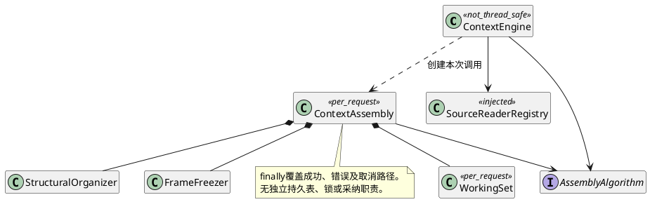
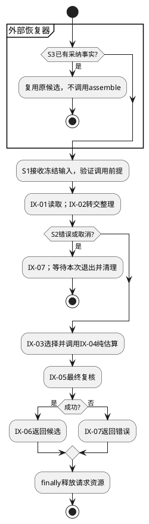
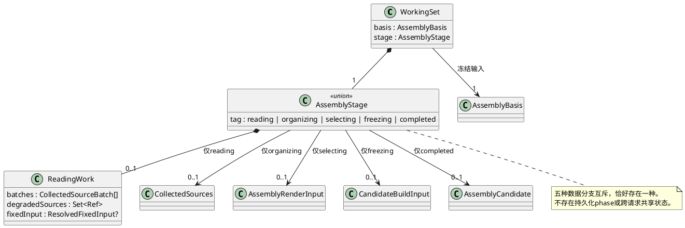

# FD-05 组装流程控制

规范依赖单向指向[组件设计](../../../context-engine.md)：§3.4/3.5是域间交互与数据结构唯一标准，字段沿其绑定的CTX-CON-1；本文不重新定义跨域Schema。设计状态仍为candidate；本地实现及已运行用例在§6逐项记录。CTX-FD编号为设计追踪，不能等同整条宿主链已验收。

## 1. 职责与边界

接收统一assemble调用，管理一次请求内的阶段顺序、只读工作集和清理。IX-01～07均由本域按组件标准编排，公共入口仍只有ContextEngine，不暴露五个可任意重排的业务接口。

本域不承担Session串行锁、排队、Run接管、来源授权判定、候选存储或模型命令派发。同一实例不重入；取消通知不是调用已经退出。独立实例可以处理其他Session，reader若共享须有自己的并发契约。请求私有进度不是耐久状态机，进程退出后恢复事实由Host/Session/Run查询。

## 2. 业务场景及分支

### S1 首次与已有Session正常组装

首次前置：Host提供initial/create意图、冻结来源与受限读取能力；已有任务则提供existing锚点及当前Run版本/head。步骤：校验格式、配置、算法和调用前提→创建本次WorkingSet→让FD-01按合法来源读取→FD-02整理→装配FD-04纯估算能力给FD-03→FD-04最终复核冻结→返回→finally清理。

initial/create不查询不存在的自身实体；读取失败后不调用选择/封装。候选返回只表示计算完成。Host随后需要创建、保存及采纳时按组件外部流程执行，本域不主动完成任何写入。首次准备由外部Host持有冻结输入和受限reader；本域不存准备记录，不伪造Session版本。未具备准备存储的入口只能重新发起。

### S2 取消、超时与来源故障

触发：来源reader在途时取消或达到有效deadline。步骤：按调用协议向在途读取传播取消→不发起后续阶段/I/O→等待本次调用清理完成→返回取消/截止错误。若只是假装用Promise.race先返回而旧调用继续修改工作集，就违反实例独占要求。

明确可选来源的暂时可用性故障可以按组件规则降级；安全/结构错误不能吞。重试由外部唯一适配层承担，不在FD-01与FD-05叠乘。必传AbortSignal，reader须响应取消且结束原调用；串行await前后检查，内部零重试。不支持不可取消reader，纯同步算法不能被异步信号抢占。

### S3 候选采纳恢复与失联接管

触发：候选返回后进程退出，或A失联、B接管、A迟到返回。组装器没有持久事实可恢复。调用方先查询原Run采纳：已采纳用原候选，不调用组装；UNKNOWN继续核对；确认未采纳可按原冻结输入发起新独占组装。A的迟到结果仍需外部提交边界拒绝，不能靠本域“无并发”保证正确。

read_only不创建/归档父Session、不占其当前Run槽。采纳字段、Session守卫与只读执行链归外部SCG-08，首次准备归外部SCG-07；本域不能新增回执表或任意换preparationId解决恢复。

## 3. 内部结构与阶段



内部阶段只是调用栈中的读取/整理/选择/封装/退出位置，不公开可恢复phase字段。请求数据与结果深度隔离，能力由组合根注入且版本匹配；对同实例的重复调用不引入合并Promise或重入支持。



图中S3分支前置是外部已经查清采纳状态；UNKNOWN不进入图中assemble分支。finally必须覆盖每个阶段失败，不能仅靠末尾节点。新增功能域交互先修改组件§3.4，再改变阶段装配和测试；新增策略/reader实现无需增加中央业务分支。

实现位于control/context-engine/context-engine.ts及请求协作对象，组合根位于application；代码目录不能沿用旧单文件拼补新的持久恢复职责。无本域物理Schema、事务或补偿动作。

### 3.1 请求工作集与阶段数据

组件§3.5是本域转交数据的唯一标准。本域只保存本次调用的执行位置；下面的tag是**进程内控制标记**，不新增公开phase字段、持久状态或恢复协议。RequestMeta/TrustedScope按组件绑定的公共契约传入；能力不从JSON反序列化。

```typescript
type ReadingWork = {
  batches: CollectedSourceBatch[];
  degradedSources: Set<Ref>;
  fixedInput: ResolvedFixedInput | null;
};
type AssemblyStage =
  | { tag: "reading"; work: ReadingWork }
  | { tag: "organizing"; sources: CollectedSources }
  | { tag: "selecting"; renderInput: AssemblyRenderInput }
  | { tag: "freezing"; input: CandidateBuildInput }
  | { tag: "completed"; candidate: AssemblyCandidate };
type WorkingSet = {
  basis: AssemblyBasis;
  stage: AssemblyStage;
};
```

| 字段 / 阶段 | 初始化、约束及转换 |
|---|---|
| basis | 入口校验后固定，只读、一次请求唯一；所有阶段及回调引用同一版本输入，不读取live配置。RequestMeta/TrustedScope作为调用参数/能力传给reader，不复制进basis或候选 |
| reading.work.batches | 初始[]，仅追加成功完整CollectedSourceBatch；每项request/result严格对应，sourceOrdinal唯一，按已确认顺序收集；不得先加入半批再后台补充 |
| reading.work.degradedSources | 初始空Set，只有组件已允许的可用性降级才加入合法来源Ref；最终转为规范顺序的唯一数组。摘要/安全错误不加入后继续 |
| reading.work.fixedInput | 初始null表示固定输入尚未完整解析；system/task/tools全部成功后一次替换成ResolvedFixedInput。null不能转成空system/task/tools以进入下一阶段 |
| organizing.sources | 所有必需读取完成后由ReadingWork冻结为CollectedSources，只有此变体允许整理；此前缓冲不再修改。Source数量等容量按组件规则校验，未定容量口径不能在本域自行放大 |
| selecting.renderInput | 整理成功后组装basis/sources/organized，交FD-03准备选择输入并装配FD-04纯估算闭包；字段不可缺失，也不能混入另一请求的organized |
| freezing.input | 选择成功后生成CandidateBuildInput，selection仅来自本次算法；最终复核失败不进入completed |
| completed.candidate | 只保存独立冻结候选供返回；不表示外部保存、Session绑定或Run采纳成功。返回后WorkingSet销毁，候选不得借其Map/数组维持内容 |

S1转换只允许reading→organizing→selecting→freezing→completed，每次前驱成功才创建后一变体，不保留多个可独立修改的stage副本。任一阶段失败走CTX-CON-1 §4错误出口并finally清理，不增加一个可恢复failed业务状态。S2取消也是退出路径；ReadingWork仍在途时不得仅删除stage引用就宣称资源已清理，必须等待原reader结束后再退出；本域无后台任务，reader负责释放自己资源。S3权威采纳查询在域外，found/UNKNOWN都不会创建WorkingSet；只有外部确认允许重新组装才建立全新的请求工作集。



数据失效对应FM-01/02：提前创建后继变体或复用旧sources会使半成品/旧数据进入封装；UT-03检查阶段前提和跨请求隔离。非线程安全约束仍由装配保证，不因有tag而获得并发安全。

## 4. 局部SFMEA

| 风险 | 场景/原因 | 局部及下游影响、严重度依据 | 检测/控制及恢复 | 测试 |
|---|---|---|---|---|
| CTX-FD05-FM-01 | S1读取/结构失败后仍继续封装 | 返回不完整候选；高严重度，错误输入可进入业务 | 阶段成功守卫、错误原样分类；失败后下游/外部写入次数0 | UT-01、IT-01 |
| CTX-FD05-FM-02 | S2取消先返回，旧reader仍在途就复用实例 | 两请求工作集污染或资源泄漏；高严重度 | 调用退出包含清理，禁止同实例重入；AbortSignal必传并等待原reader退出 | UT-02、DT-01、IT-02 |
| CTX-FD05-FM-03 | S3旧采纳查询被回放，UNKNOWN误作absent | 重新组装并可能重复派发；高严重度，改变已执行事实 | 外部查询当前权威、采纳结果复用、旧执行资格在提交点校验 | IT-03及组件接管用例 |

O/D/RPN无实测不估。控制层只记录阶段、错误和数量；正文/凭据不进入普通日志。Deadline及容量由组件统一收窄；不能增加域内默认重试、持久缓存或后台清理服务。

## 5. UT / DT / 集成测试

| 本域ID | 场景 / 输入及注入 | 独立期望 |
|---|---|---|
| CTX-FD05-UT-01 | S1在读取、整理、选择、最终复核逐阶段注入错误 | 每次只调用成功前驱，后续阶段次数0；错误不变空成功；请求资源清理 |
| CTX-FD05-UT-02 | S2双屏障挂起reader，发取消，再释放旧读取 | 不启动新阶段；清理完成前不视为退出；AbortSignal触发后仍等待读取屏障释放，读取仅一次，不用sleep |
| CTX-FD05-UT-03 | S1固定输入未齐及整理失败；S2两请求分别给不同来源/版本 | 未齐不能产生organizing，失败无后续变体；每个renderInput只引用本次basis/sources/organized，返回候选不依赖已销毁工作集 |
| CTX-FD05-DT-01 | S1/S2装配两独立实例及只读能力spy | 工作集不共享，域不持Session/Artifact写端口；同实例并发不是支持用例；装配方须保证独占 |
| CTX-FD05-IT-01 | S1五域连接，固定合法来源；再损坏必选正文 | 正常候选六字段/Trace一致，组件内部外部写入0；错误分支候选和模型调用0 |
| CTX-FD05-IT-02 | S2两Session用独立实例，一路来源失败另一路成功 | 失败不污染另一路，清理分别完成；来源共享仅使用已声明可共享替身 |
| CTX-FD05-IT-03 | S3外部保存/采纳替身分别返回found/unknown/confirmed absent | found与unknown组装调用0，confirmed absent仅新独占调用；不证明真实事务/接管已通过 |
| CTX-FD05-IT-04 | S1首次准备后退出、S3采纳丢响应及read_only执行 | 外部Host完成SCG-07/08持久接入后用真实临时存储与子进程故障验证；沿用组件CTX-SESSION-T-06/07和SES-TAKEOVER-T-01～03，不记当前已覆盖 |

UT/DT/IT是本域细化追踪，系统级事实以组件§10统一定义，不能用上述替身通过替代真实SQLite和进程恢复。特别覆盖A暂停、B接管、A恢复：旧A结果不得覆盖B或派发模型，这个守卫由外部Session/Run写入边界提供，本域不新增锁或fence。

## 6. 首版约束、风险与实现验收

本域按组件§4.0首版约束实施。场景、数据和验收同步采用同一规则；局部实现不代替外部宿主恢复、保存和采纳验收。

开发前按本域数据结构检查输入完备；实现后覆盖成功、显式失败、限制拒绝和跨域错误传播。Child清单完整性在选择前检查；Memory仅单视图；没有本域持久化、缓存、重试或回执。外部准备存储/采纳提交的真实实现状态不能由本域替身证明。

本地实现证据：AK-CTX-101/106/114：首次只读、双屏障取消、可选故障零重试；未覆盖外部Run采纳/接管。 测试设计全集不因此标为全部通过。
