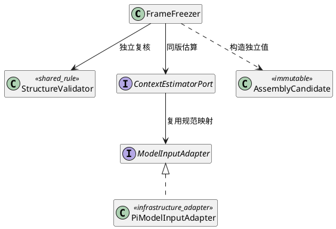
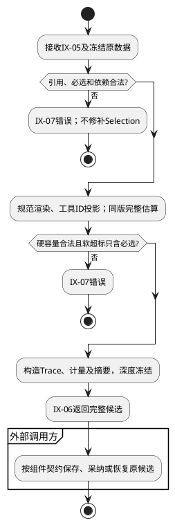
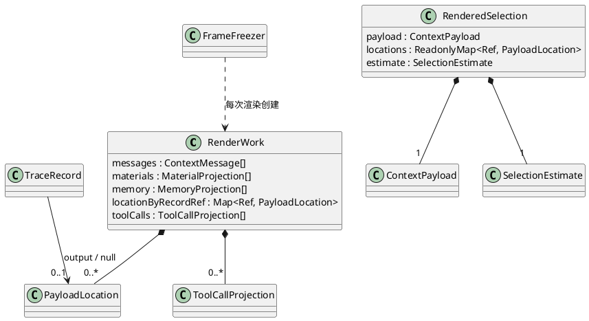

# FD-04 载荷封装与追踪

规范依赖单向指向[组件设计](../../../context-engine.md)：§3.4/3.5是域间交互与数据结构唯一标准，字段沿其绑定的CTX-CON-1；本文不重新定义跨域Schema。设计状态仍为candidate；本地实现及已运行用例在§6逐项记录。CTX-FD编号为设计追踪，不能等同整条宿主链已验收。

## 1. 职责与边界

同一公共渲染能力服务IX-04试选估算和IX-05最终封装。输入为Selection、原始只读记录/图及冻结AssemblyBasis；输出IX-06完整AssemblyCandidate。必须使模型载荷、Trace位置、工具映射和计量互相一致，而不是只序列化一个messages数组。

本域不决定哪些可选内容优先、不改原转录、不发布Artifact、不做Run采纳。最终复核失败就返回IX-07，不能“帮助策略”删记录或换算法。Provider协议转换优先复用Pi，实际网络派发归外部L2/执行边界。

## 2. 场景与分支

### S1 六类输入完整交付

触发：FD-03提交合法Selection。前置：来源正文齐备、结构合法、冻结格式/模型适配/估算版本可解析。步骤：检查所有引用和必选/依赖→按规范顺序取原文→映射工具局部ID→生成payload→用同版Pi投影估算→核对硬容量和软目标状态→生成Trace、摘要并深度冻结候选。

固定向量含中文task、引号/换行资料A/B、Memory和两个Run同c1的工具组。模型映射必须保持system独立，历史在前，当前user按组件定义的task/资料JSON/Memory JSON块顺序；Trace及内部内容引用不发送模型。空资料/Memory按已定义items=[]编码，不省略另一字段。

### S2 非法选择与软目标超限

触发：策略输出漏必选、引用未知单元、孤立结果，或估算超目标。步骤：先验证Selection与输入的对应关系→验证完整性→重新渲染计量。结构错误直接失败；必选闭包自身超Token软目标仍返回标记，若夹带可选则拒绝；硬容量超限仍失败。

不借用策略自报预算绕过复核，也不把完整候选bytes与payload bytes混为同一个量。maxWorkingBytes限制规范读取工作集，maxBytes限制完整模型映射，maxCandidateBytes限制完整候选；父增量取同选择完整估算减去父记录后的估算，下限0。

### S3 已采纳候选的保存与恢复消费

本域返回后，由调用方保存完整候选，Run采纳原promptRef；此步骤在域外。恢复消费者必须核验原schema、摘要、绑定及适配版本，复用原payload/trace/计量。测试在本域输出边界与外部恢复器之间验证可序列化性，不让本域新增Repository。

损坏Trace、payload或版本不可用时拒绝模型派发；不能重新查来源、恢复runtimeMessageRef或再次压缩。Child正文完整性已在结构整理前置检查，真实保存/采纳原子条件归外部SCG-08，不能用本域序列化测试代替外部恢复协议。

## 3. 内部结构与算法



FrameFreezer引用本次公共结构校验能力，避免与FD-02规则分叉；估算器与映射由组合根注入。IX-04为本次已解析数据建立闭包，不将函数放入候选JSON。封装结束不得保留指向外部可变数组的别名。

S1/S2为下图生成分支；S3属于图后外部消费分支，不回调本域重新选择。



编码和摘要唯一算法沿组件绑定的FE-C14N-1，不在本域新造canonical JSON。按规范遍历有限记录/块，输出位置必须与payload一一对应；未选记录位置null。新增模型适配版本先更新组件映射和版本绑定，再增固定向量；核心只依赖Port，Pi具体实现位于infrastructure/adapters/pi-context。

### 3.1 渲染工作结构与候选字段映射

输入只使用组件§3.5 AssemblyRenderInput（试选）或CandidateBuildInput（最终）；结果使用原SelectionEstimate或AssemblyCandidate。本域内部不通过新增字段收取替换正文：

```typescript
type RenderWork = {
  messages: ContextMessage[];
  materials: MaterialProjection[];
  memory: MemoryProjection[];
  locationByRecordRef: Map<Ref, PayloadLocation>;
  toolCalls: ToolCallProjection[];
};
type RenderedSelection = Readonly<{
  payload: ContextPayload;
  locations: ReadonlyMap<Ref, PayloadLocation>;
  toolCalls: readonly ToolCallProjection[];
  estimate: SelectionEstimate;
}>;
```

| 字段 | 生产与校验规则 |
|---|---|
| messages / materials / memory | RenderWork初始均[]，从选中单元的去重record集合按规范顺序投影。messages保留角色和完整块；materials/memory取organized.contents匹配的value。不能在此解析Artifact或补缺失正文。每个源记录只在其所属载荷数组产生一个位置 |
| locationByRecordRef / locations | Map初始空，键为选中recordRef；值为{field:messages或materials或memory,index:Count}，index为对应数组实际追加位置且严格小于该数组长度。未选记录无键，生成Trace时显式转为output:null；不能用index=0或空字符串作未选哨兵。RenderedSelection.locations不暴露内部可变Map |
| toolCalls | 原OrganizedContext.toolCalls经完整三元identity排序生成ToolCallProjection：identity/frameCallId/requestRecordRef/resultRecordRef全部齐备；局部ctxcall_N只重写输出副本中的请求及结果。requestRecordRef可在多条映射中重复，identity/frameCallId不可重复 |
| payload | system/task/tools从sources.fixedInput取得；messages/materials/memory来自工作数组，六字段全部存在。嵌套arguments及ToolDescriptor也须隔离，浅层Object.freeze不满足承诺 |
| estimate | 使用冻结formatVersion/modelAdapterVersion/estimatorVersion对同一payload的模型输入映射计量；inputTokens/inputBytes/inheritedTokens/inheritedTargetTokens均非负安全整数，不能NaN/负数。计量采用组件§4.0及CTX-CON-1的三种独立字节口径 |

| AssemblyCandidate字段 | 从输入到最终结果 |
|---|---|
| payload | 最终合法Selection的RenderedSelection.payload；试选对象不能直接返回为成功候选 |
| trace.records | 每个规范原记录生成recordRef/identity/contentRef/orderKey/output，output从locations查询或null，保留未选记录的来源追踪 |
| trace.units/dependencies/decisions/toolCalls/degradedSources | 分别取organized.units/dependencies、Selection.decisions、本次渲染toolCalls、sources.degradedSources；全部复制或冻结隔离，禁止夹带Map/函数 |
| tokenAccounting | inputTargetTokens/baseInputTokens/inheritedTargetTokens/inputTokens/estimatedInheritedTokens/nextEligibleInheritedUnitTokens/droppedInheritedTokens及estimatorVersion/modelWindowVersion/formatVersion/budgetStatus按组件计量规则生成。nextEligibleInheritedUnitTokens为Count或null，null表示不存在下一候选，0是合法零估算，不得混用；next按规范单元序首个未选父单元求闭包增量，dropped为全部遗漏父闭包增量，下限0 |
| inputDigest / payloadDigest | 分别按CTX-CON-1规定的basis及payload规范字节计算；不摘要Map插入顺序、工作集或适配器对象 |
| selectionVersion / formatVersion / modelAdapterVersion | 必须等于basis绑定版本且实际执行实现匹配，不能写当前默认配置 |

S1与S2共用renderSelection生成RenderedSelection，IX-04只交estimate；S2最终复核在构造候选前再次执行，不信任选择方预算。S3候选可序列化，RenderedSelection.locations与工作对象不能进入保存对象。单次渲染结束释放工作集，最终候选深度独立。



数据失效对应FM-02/03：位置0误当缺失、Map外泄或嵌套arguments别名会破坏追踪/恢复；UT-04检查真实反查位置与完整序列化，而非只断言字段存在。

## 4. 局部SFMEA

| 风险 | 场景/原因 | 局部及下游影响、严重度依据 | 检测/控制及恢复 | 测试 |
|---|---|---|---|---|
| CTX-FD04-FM-01 | S1遗漏资料/Memory、改变否定词或角色 | 模型证据不完整或被提升为指令；高严重度 | 六字段固定向量、文本可逆、禁止未知变体静默过滤；转换错误拒绝 | UT-01、IT-01 |
| CTX-FD04-FM-02 | S1工具ID只改请求，或Trace位置错位 | 模型误配结果、审计指向错误来源；高严重度 | 请求/结果同映射，输出位置和原身份反查；拒绝冲突 | UT-02、IT-02 |
| CTX-FD04-FM-03 | S2/S3只验payload、浅冻结或恢复再次裁剪 | 候选内容事后改变/恢复事实不一致；高严重度 | 独立深拷贝冻结、完整Artifact校验由调用方完成、恢复禁重选 | UT-03、DT-01、IT-03 |

O/D/RPN没有运行证据不估。Token统计是粗估而非计费事实；普通日志不记录payload、Trace敏感引用或内容摘要。容量边界须由组件统一定义，未运行的边界向量不宣称通过。

## 5. UT / DT / 集成测试

| 本域ID | 场景 / 输入和注入 | 独立期望 |
|---|---|---|
| CTX-FD04-UT-01 | S1中文、换行、引号、空列表及固定工具schema | 解码后原文逐字一致，当前user块顺序固定，内部引用/Trace不进模型 |
| CTX-FD04-UT-02 | S1两个Run同c1及多调用助手 | 局部ID唯一且请求/结果同步；每个非nullTrace位置可反查原记录，原转录不变 |
| CTX-FD04-UT-03 | S2错误Selection、必选超目标夹带可选；S1返回后修改原数组 | 错误选择拒绝；仅必选合法超目标被标记；候选深层数据不随输入修改 |
| CTX-FD04-UT-04 | S1首条输出index=0及一条未选记录；S3完整候选序列化再读回 | 首条Trace非null且可反查，未选为null；保存值无Map/Set/函数，六字段及全部Trace/计量/版本值保持一致 |
| CTX-FD04-DT-01 | S1/S3注入估算/映射spy并尝试传runtimeMessageRef | 试选和最终投影同能力/版本；无Artifact写端口或算法选择回调；未知数据拒绝 |
| CTX-FD04-IT-01 | S1真实本地Pi转换接Faux模型接收端 | 实际接收六类规范内容，Pi自动裁剪/模型网络请求数0；不使用真实Provider |
| CTX-FD04-IT-02 | S1 FD-02→FD-03→本域完整链；工具结果倒序到达 | 规范输出身份/顺序不随到达改变，策略不能改正文，最终复核有效 |
| CTX-FD04-IT-03 | S3完整候选写真实临时Artifact后新进程读取；分别损坏payload/Trace | 完整值等价，损坏拒绝，来源重新读取/算法执行0；实际采纳仍待SCG-08，不计全系统恢复通过 |
| CTX-FD04-IT-04 | S2 payload可放下但Trace使候选变大；父内容重复 | 模型映射合法但完整候选超过maxCandidateBytes必须失败；父贡献同集合完整估算减去父记录后的估算 |

对应组件CTX-PAYLOAD-T-01～05、CTX-PI-T-01/02及CTX-SC-T-06/08。测试读取独立固定向量，不用被测渲染器生成期望；真实存储测试单独报告，与Faux Provider交付测试区分。没有独立生产模型执行职责。

## 6. 首版约束、风险与实现验收

本域按组件§4.0首版约束实施。场景、数据和验收同步采用同一规则；局部实现不代替外部宿主恢复、保存和采纳验收。

开发前按本域数据结构检查输入完备；实现后覆盖成功、显式失败、限制拒绝和跨域错误传播。Child清单完整性在选择前检查；Memory仅单视图；没有本域持久化、缓存、重试或回执。外部准备存储/采纳提交的真实实现状态不能由本域替身证明。

本地实现证据：AK-CTX-101/102/103/109：六字段、软目标与硬字节、工具ID、SQLite摘要损坏。 测试设计全集不因此标为全部通过。
