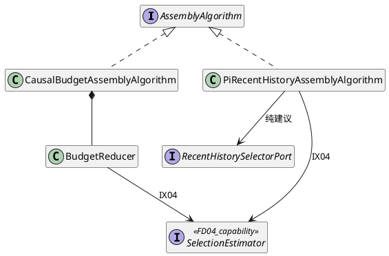
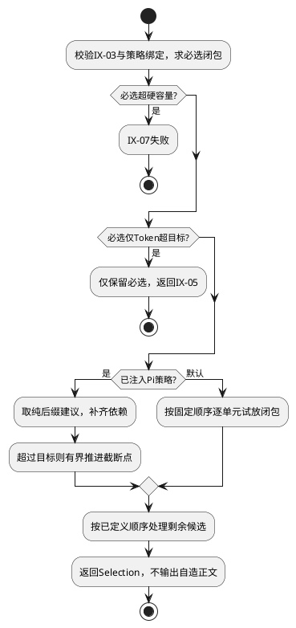
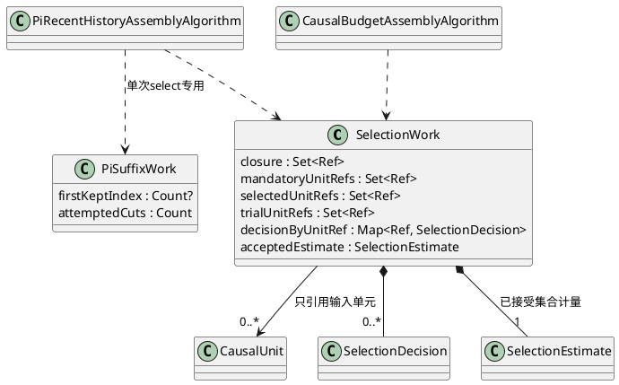

# FD-03 内容选择与预算

规范依赖单向指向[组件设计](../../../context-engine.md)：§3.4/3.5是域间交互与数据结构唯一标准，字段沿其绑定的CTX-CON-1；本文不重新定义跨域Schema。设计状态仍为candidate；本地实现及已运行用例在§6逐项记录。CTX-FD编号为设计追踪，不能等同整条宿主链已验收。

## 1. 职责与边界

在IX-03已合法的因果单元中选择内容，通过IX-04获取同版完整投影的估算，经IX-05返回Selection。必选保留、依赖闭包、可选优先顺序与策略选择属于本域；计量编码属于FD-04，最终合法性仍由FD-04独立复核。

本域是同步纯计算，无Session/Artifact/权限/Activity端口，不持久化候选、不调用模型、不读取时间或动态配置。默认和Pi备选使用同一输入输出契约；Pi只给近期历史截断建议，不能成为结构修复或异常自动回退路径。

## 2. 场景与分支

### S1 默认策略保留必选并选择可选内容

前置：结构已闭合，必选引用存在，排序及估算版本固定。固定夹具：必选60，近期H2增25、H1增30、Memory M1增10，目标100。步骤：取得必选闭包→复核硬容量→按组件顺序试放完整闭包→每次调用IX-04→合格则保留，否则记录drop→返回引用和原因。该夹具最终选必选/H2/M1、估算95，H1未选。

必选闭包本身Token超目标时仍全部保留并标记，不追加可选；必选硬容量超限则失败。可选单元携带依赖时整体取舍，不用删除其中前驱来塞入预算。可选历史从近到远、单Memory视图按scoreRank/entryId、资料按priority降序再按unitRef；required仅要求Memory读取成功，内容必选来自Requirement。

### S2 明确选择Pi备选

触发：调用方在冻结前选择pi-recent-history/v1，目标是连续近期历史。步骤：取必选闭包→扣除其估算得到建议目标→目标为0则跳过截断→通过RecentHistorySelectorPort获得后缀建议→映射回完整因果单元及依赖→超目标则向较新的截断位置推进→试放剩余Memory/资料→返回Selection。

每次移动后从必选集合重建，不能遗留已删除后缀独有的前驱。建议不在输入中则SCHEMA_INVALID；适配失败不切默认；必选早于截断点仍须保留。Pi不调用compact、不创建Pi Session；真实Pi函数只在组件§9规定的基础设施适配目录。

### S3 Child父继承选择与策略恢复

触发：Child已有自己的系统/任务/工具基线，Parent候选有明确继承目标。算法同时检查总估算和父继承估算，不能因总量未满而扩大Parent候选范围。以组件固定夹具父基线64、总目标100、父配置40为例，父目标36；独立表中10个各4的可选父单元选9个。

父集合由candidateRefs判定；每次试选用同一选择集合去掉父记录计算自身基线，父贡献为完整估算减基线且下限0；重复父记录不计两遍。next/dropped使用组件统一封装口径。恢复已采纳候选由外部直接读取，本域调用次数0；确认未采纳再重算必须使用原selectionVersion，缺实现则失败。

## 3. 内部结构与算法



Composition Root固定注册ID/版本，FD-05注入选择好的策略，不在核心中央方法按字符串写分支。算法只用FD-02图和FD-04估算能力，无跨域可变对象。共享闭包规则由单一实现提供，两个策略不复制一套配对/授权逻辑。

S1/S3采用默认分支，S2采用Pi分支；恢复不重算分支在FD-05外部入口判定。



默认遍历次数受单元数量约束，Pi后缀最多推进历史记录数量次。新增第三种选择目标时新增策略与固定夹具，更新组件冻结注册；不修改来源/结构/封装协议。实现位于control/context-engine/algorithms，Pi具体调用留infrastructure/adapters/pi-context。

### 3.1 数据结构与选择状态

组件§3.5规定输入准备：本域把basis.requirements及已定义来源策略展开为requiredRecordRefs/optionalUnitOrder，FD-05配入OrganizedContext结构、limits和同版估算能力，构造CTX-CON-1 AssemblyAlgorithmInput。准备与select同为纯计算；排序器只实现组件§4.0已确定的首版规则。

```typescript
type SelectionWork = {
  // 闭包每次以有限集合迭代，不保存全图闭包缓存。
  mandatoryUnitRefs: Set<Ref>;
  selectedUnitRefs: Set<Ref>;
  decisionByUnitRef: Map<Ref, SelectionDecision>;
  trialUnitRefs: Set<Ref>;
  acceptedEstimate: SelectionEstimate;
};
type PiSuffixWork = {
  firstKeptIndex: Count | null;
  attemptedCuts: Count;
};
```

| 输入/工作字段 | 约束、来源及更新 |
|---|---|
| closure | 单次试选从seed集合开始，按前驱边扩展到不再增长；只保留本次集合，不建立O(units²)缓存，请求结束释放 |
| units / dependencies / requiredRecordRefs | units中unitRef唯一，memberRefs完整；按recordRef将必选记录映射到完整单元并求前驱闭包。mandatoryUnitRefs是必选闭包，创建后不删除；不同单元可共享record，估算必须按去重后的实际投影而非成员数相加 |
| optionalUnitOrder / historyRecords | 前者为已冻结规则排序的合法可选unitRef，唯一；后者recordRef/message对应原规范历史。顺序含义不能由数组遍历偶然决定；只把historyRecords交Pi后缀Port |
| selectedUnitRefs / trialUnitRefs | selected从mandatory复制，trial每次从当前selected复制并加入本次闭包。超限拒绝时丢弃trial，不污染selected；接受才替换集合。均为unitRef空间，禁止把recordRef加入其中；大小不超过units.length |
| decisionByUnitRef | 键为unitRef，值含unitRef/decision/reason且键值一致。最终全部输入单元恰一项，keep等价于selected成员。原budget丢弃的单元后被合法依赖选中时更新为keep/dependency；required理由不被后续ranked覆盖；未尝试单元也按组件选择规则生成最终决定 |
| acceptedEstimate | 对当前selected完整渲染得到的inputTokens/inputBytes/inheritedTokens/inheritedTargetTokens四Count；先估算必选闭包后才创建工作集，不能用0假装已有估算。试选估算不覆盖它，除非试选接受。软Token目标与硬容量分别判断，bytes/父贡献采用组件SCG-06固定口径 |
| firstKeptIndex / attemptedCuts | Pi专用：firstKeptIndex为0..historyRecords.length-1；null表示后缀为空，0表示从首条保留，不能混用。由firstKeptRecordRef精确定位，未知引用拒绝。attemptedCuts初始0，每次推进加1，推进严格向后，至空后缀终止；不超过历史长度加一次空后缀检查 |

S1输出前按规范单元顺序将Set/Map变为Selection.selectedUnitRefs/decisions数组；不得依赖运行期哈希遍历顺序。S2每个新后缀从mandatory重建，不能只删尾部一个引用留下孤立前驱。S3同一trial的总目标和父目标一起评估，不能跨两次试选拼计量。所有工作集一次select后销毁，无跨调用缓存，也不把估算函数写入Selection。

选择准备的完整签名及PreparedSelectionPolicy字段见组件§3.5；requiredRecordRefs与optionalUnitOrder分别使用记录/单元空间。FD-04复核时复用这一纯规则，不能从本域的decisions.reason反推必选集合。



数据失效对应FM-01/02：试选污染已选集合或0/null混用会产生错误Selection；UT-05检查拒绝回滚、空后缀及决策全集，不只检查最终估算数字。

## 4. 局部SFMEA

| 风险 | 场景/原因 | 影响与严重度依据 | 检测/控制及恢复 | 测试 |
|---|---|---|---|---|
| CTX-FD03-FM-01 | S1按优先级误删必选或仅留依赖方 | 丢失任务证据；高严重度，结果业务含义改变 | 先求必选闭包，FD-04独立检查；错误选择拒绝，不静默修补 | UT-01/02、IT-01 |
| CTX-FD03-FM-02 | S2照抄Pi截断点、失败自动换策略 | 破坏因果关系/冻结身份；高严重度，恢复不一致 | 建议映射完整单元、版本绑定、错误不回退；已采纳不调用算法 | UT-03、DT-01、IT-02 |
| CTX-FD03-FM-03 | S3仅检查总目标或用原文长度冒充完整估算 | 越过继承约束或错误裁剪；较高严重度，任务输入和成本不可解释 | IX-04统一估算、双目标、FD-04复核；硬容量配置必须显式传入 | UT-04、IT-03 |

O/D/RPN无实测不估。软Token超目标本身不是“算法损坏”；只含必选且字节合法的候选必须允许。硬容量、结构和来源范围仍不可放宽。无本域持久化、后台线程或恢复缓存。

## 5. UT / DT / 集成测试

| 本域ID | 场景 / 固定输入与注入 | 独立预期 |
|---|---|---|
| CTX-FD03-UT-01 | S1独立60/25/30/10估算表、目标100；再把必选改101 | 首例95选H2/M1；第二例只留必选且不加可选；由封装标记required_over_target |
| CTX-FD03-UT-02 | S1 D2依赖D1，完整增量70，剩余60/70 | 可选分别整组不选/选中；必选仅Token超目标时保留，硬字节超限失败 |
| CTX-FD03-UT-03 | S2截断点落在结果前，必选在更早位置；另返回未知recordRef | 合并完整闭包；未知引用拒绝；每次推进删除不再需要的非必选前驱 |
| CTX-FD03-UT-04 | S3父基线64、目标100、父上限40，10个各4 | 固定向量选9个；不读候选范围外内容；另以父/自身重复输入验证只计一次 |
| CTX-FD03-UT-05 | S1超限trial后继续试放；S2后缀index=0/null；单元先drop后作为依赖保留 | 拒绝试选不污染selected；0保留全后缀/null空后缀；最终decisions覆盖所有unit且与keep集合一致 |
| CTX-FD03-DT-01 | S1/S2注入两个带计数器策略及重复注册 | 仅指定者运行，非法注册拒绝；核心无Pi/存储导入，不用强制转换掩盖类型缺口 |
| CTX-FD03-IT-01 | S1向FD-04交漏必选/未知unit/未闭合Selection | 最终拒绝、候选返回0，不能由FD-04自行重新选择 |
| CTX-FD03-IT-02 | S2真实本地Pi纯截断适配器与共同渲染器接入 | 不调用模型/compact/Session写入；估算与最终映射同版本，适配错误不换算法 |
| CTX-FD03-IT-03 | S3带Parent重复记录和多Memory视图 | 重复父记录只计一次；第二Memory视图在读取前SCHEMA_INVALID；只含必选时允许Token超目标 |

测试用例对应组件CTX-ALG-T-01～04、CTX-PI-T-03～06、CTX-REL-T-03及CTX-SC-T-05/06。UT使用独立估算表验证选择，IT再使用真实Pi本地纯函数验证组合；无付费模型调用。0.95仅默认策略固定饱和夹具要求，不能强加给Pi备选。

## 6. 首版约束、风险与实现验收

本域按组件§4.0首版约束实施。场景、数据和验收同步采用同一规则；局部实现不代替外部宿主恢复、保存和采纳验收。

开发前按本域数据结构检查输入完备；实现后覆盖成功、显式失败、限制拒绝和跨域错误传播。Child清单完整性在选择前检查；Memory仅单视图；没有本域持久化、缓存、重试或回执。外部准备存储/采纳提交的真实实现状态不能由本域替身证明。

本地实现证据：AK-CTX-201/202/203：独立计量表和闭包；AK-CTX-107/108/112：真实Pi备选、非法Selection拒绝和父范围。 测试设计全集不因此标为全部通过。
