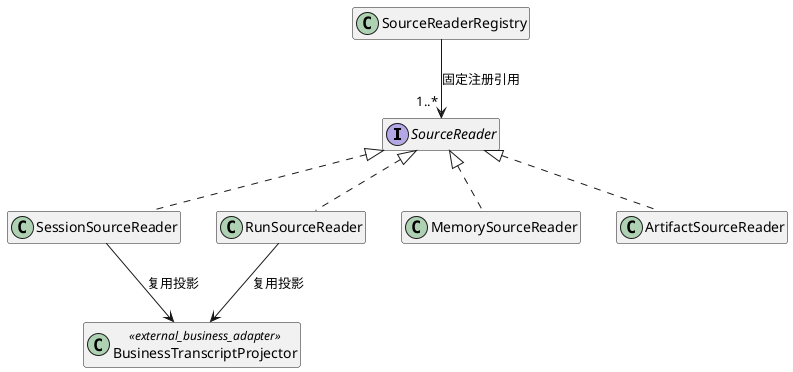
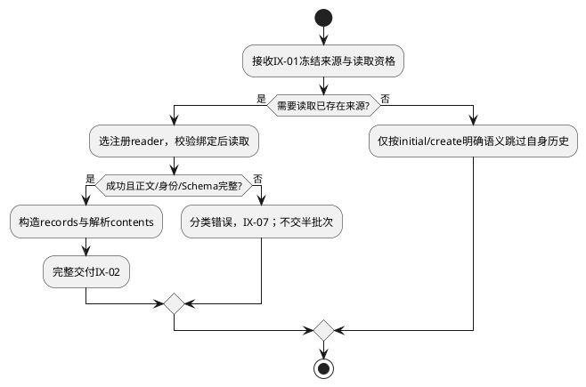
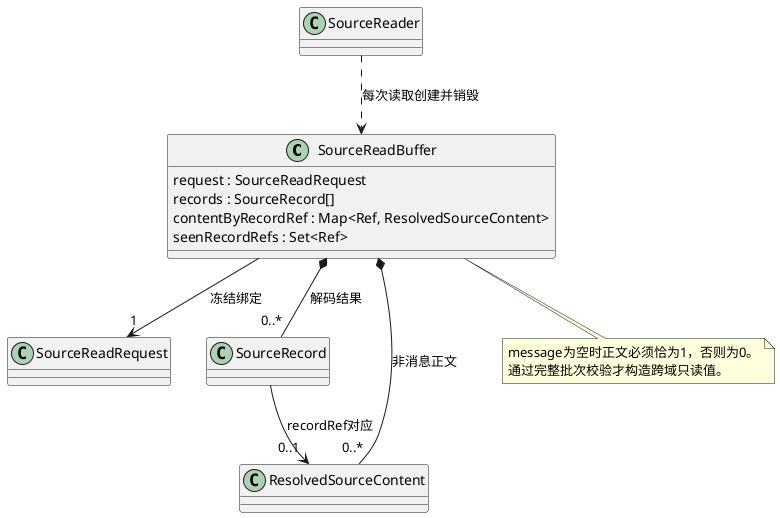

# FD-01 来源读取与规范转换

规范依赖单向指向[组件设计](../../../context-engine.md)：§3.4/3.5是域间交互与数据结构唯一标准，字段沿其绑定的CTX-CON-1；本文不重新定义跨域Schema。设计状态仍为candidate；本地实现及已运行用例在§6逐项记录。CTX-FD编号为设计追踪，不能等同整条宿主链已验收。


## 1. 职责与适用边界

目标是将冻结引用变为带原始身份且正文已解析的规范记录，使下游无需再访问来源。输入由Host/Coordinator准备，FD-05经IX-01交入；本域经IX-02交出完整批次或经IX-07失败。Session历史、Run转录、Memory视图、资料Artifact通过各自reader处理，不将Session全部元数据发送给模型。

本域负责来源内版本/身份/正文校验；跨来源去重、工具配对及依赖闭包属于FD-02；必选/预算选择属于FD-03。权限决定和Memory查询准备归外部受控边界，本域不签发权限、不创建Session、不写Memory。业务执行适配层确认工具/Child事实后提供规范投影，本域不判定Join或从UNKNOWN推断终态。

## 2. 业务场景

### S1 首次任务读取固定资料

触发：Host在Session尚不存在时准备任务和资料A/B。前置：create意图与initial身份已冻结，允许的正文引用、版本和读取能力已提供。步骤：FD-05校验输入→本域按绑定定位reader→读取并校验Artifact摘要/Schema→生成稳定记录与正文对应关系→完整返回IX-02。自身Session/Run查询数必须为0，候选是否创建Session由外部后续决定。

资料暂时不可用时，仅在来源已明确允许降级且不违反必选要求时交由组件策略处理；必需内容缺失不能补空文本；权限/摘要错误直接返回错误，不交付半个批次。system/task及资料按ctx-text-1解码，tools按ctx-tools-1解码；一个sourceRef对应一个上层预切片Artifact，fragmentRef等于sourceRef。未知版本拒绝，固定输入可为空，但失败不得补空。

### S2 消费已冻结Memory视图

触发：已运行任务准备了新的MemoryAssemblySource。前置：调用方先完成受控查询及视图保存。步骤：读取原viewRef→核对Space/索引/算法/查询摘要等绑定→按已冻结rankedEntries解析条目正文→输出稳定顺序的Memory内容。不会再次搜索，也不将scoreRank写入MemoryEntry。

同rank条目A/B以固定身份排序；撤销读取权限时，即便视图缓存命中也拒绝正文交付。首版最多一个视图，required仅要求读取成功，成功空视图允许；内容必选由Requirement明确列出，缺记录则失败。同rank按entryId ASCII裁决，多视图直接拒绝。

### S3 历史工具或Child观察转换

触发：父Run确认观察后继续组装。前置：原Run/event及权威命令关联可恢复；Child必须已经由外部协调确认，不能直接消费原始终态事件。步骤：解析持久记录→由业务投影恢复原身份及消息→返回调用绑定/显式依赖→交FD-02核对跨来源完整性。继承到新Run不能覆盖原Run身份。

未知角色、缺身份、Child未经确认或正文冲突均拒绝；工具失败可以是已确认结果，UNKNOWN不可以。Child任务及观察必须为非空规范正文，expectedChildObservations清单独立来自外部已确认事实；跨Run同callId的最终配对不在本域按邻接关系猜测。

## 3. 内部结构与公共流程



注册表由Composition Root持有，启动后不热改。具体reader持有受限只读Port，不能取得原聚合写权限。批次为请求期不可变值，全请求收集包由FD-05工作集管理，单批解码缓冲归reader调用，取消不得将未完成批次变为成功。共享reader的并发安全必须由其自身契约证明。

S1/S2/S3共享以下流程；不同来源只替换读取/解码步骤及其已确认Schema，不替换错误规则。



扩展“合同条款片段”时，实现合法资料reader并在组合根注册，同时在组件契约确定身份/正文Schema；不得改FD-02配对或FD-03增加法律业务分支。实现仍在组件§9确定的control/context-engine及外部适配层，公共接口归contracts/control/context-engine；本域不导入Pi。

### 3.1 数据结构、字段与转换

跨域结构全部使用组件§3.5的ResolvedFixedInput、CollectedSourceBatch、CollectedSources；公共叶子字段沿组件绑定Schema。本域内部缓冲仅在一次reader调用期间可变：

```typescript
type SourceReadBuffer = {
  request: SourceReadRequest;
  records: SourceRecord[];
  contentByRecordRef: Map<Ref, ResolvedSourceContent>;
  seenRecordRefs: Set<Ref>;
};
```

| 字段 / 所有者 | 结构及校验 / S1～S3映射 |
|---|---|
| request / reader调用 | 只读冻结binding及sourceOrdinal；binding的session.anchor/recordRefs、run.runId/version/headRef、memory.input、material.input依联合变体访问，不能把null的完整读取与显式空父范围混淆。未经校验的原始解码值不得直接成为SourceRecord |
| records / reader调用 | 初始[]，每条recordRef、identity、contentRef、message、orderKey、callBindings、dependencies都必须齐全；最多maxRecords。原identity生成recordRef，原有序号产生orderKey，不能根据异步完成顺序或本次Run重新编号 |
| seenRecordRefs / reader调用 | 初始空Set；键域为本批recordRef。重复加入前检查并拒绝非法批次，不能Set去重后隐去重复；跨批合法重复交FD-02处理 |
| contentByRecordRef / reader调用 | 初始空Map，最多records.length项。message非null时不得有此键；message为null时恰有一项；值recordRef必须等于键。material值完整保留sourceRef/version/contentRef/text；memory值保留spaceId/spaceVersion/entryId/entryVersion/contentRef/text及外层scoreRank。重复键拒绝，不能Map.set覆盖 |

输出步骤：验证本批记录和正文双向对应→生成SourceReadResult.records及按记录顺序排列的contents→把原request和完整result交FD-05收集为CollectedSourceBatch。未完成或失败时整个缓冲丢弃；不存在“成功但稍后补正文”的值。空批仅能来自已定义的合法空来源，不能用于掩盖读取失败。固定system/task/tools解析为ResolvedFixedInput；分别按ctx-text-1和ctx-tools-1解析，未知字段拒绝。

FD-05持有全请求收集包，reader持有本地解码缓冲，两者生命周期不同。本地Map/Set不越过IX-02，不进入候选或日志；返回的记录/嵌套arguments须与解码器可变对象隔离。注册表按SourceReadBinding.kind查唯一reader，缺项/重复注册拒绝，不按对象字段猜来源。



数据失效对应FM-03：仅在records加入记录而遗漏contents会使下游少计正文；UT-03和UT-04检查双向完整性与别名隔离。

## 4. 局部SFMEA

| 风险 | 场景/失效原因 | 局部及下游影响、严重度依据 | 检测/控制及恢复 | 测试 |
|---|---|---|---|---|
| CTX-FD01-FM-01 | S1/S2：reader忽略版本或命中撤销前缓存 | 读错版本或越权正文进入模型；高严重度，涉及信息泄露 | 读取时校验冻结绑定/当前资格，错误不降级；恢复不改latest | UT-01、IT-01 |
| CTX-FD01-FM-02 | S3：按当前Run生成来源身份、将Child当工具 | 下游错误合并或误配观察；高严重度，改变模型证据 | 投影保留原事件和事实类型；无法恢复身份拒绝，不现场生成UUID | UT-02、IT-02 |
| CTX-FD01-FM-03 | S1/S2：正文未读完即返回、吞摘要错误 | 下游半批内容或预算漏计；高严重度，破坏必选输入 | 完整批次校验后返回；纯算法阶段I/O为0；半批资源交清理路径 | UT-03、IT-03 |

上述严重度按后果定性，不表示测得概率；O/D/RPN无运行证据不计。普通日志只有来源数量、阶段和错误码，不包含正文/敏感引用；容量和Deadline按组件标准，不能在本域放宽。

## 5. UT / DT / 集成测试设计

| 本域ID | 场景 / 输入与注入 | 独立期望 / 验证层级 |
|---|---|---|
| CTX-FD01-UT-01 | S2固定View@7，分别改version/queryDigest并撤销授权 | 绑定/摘要/安全错误分开断言；不读latest、不返回正文 |
| CTX-FD01-UT-02 | S3同原事件从Session与Run投影；另给不同事件相同文本 | 前者原身份相等，后者不同；本域不擅自文本去重，交FD-02处理 |
| CTX-FD01-UT-03 | S1正文缺失、contents悬空/重复，Artifact摘要损坏 | 完整批次不可用；明确错误，不用空数组伪装成功 |
| CTX-FD01-UT-04 | S1/S2同批重复recordRef、message有多余content、非message缺正文；返回后修改解码对象 | 非法批次拒绝；合法批次的嵌套正文/arguments不随原对象修改；空批不代表失败成功化 |
| CTX-FD01-DT-01 | S1～S3装配全部reader并注入重复/未知注册 | 启动或输入拒绝；新增合法reader无需修改组装中央业务分支，访问写端口数0 |
| CTX-FD01-IT-01 | S2用受控Memory/Artifact替身，read后撤销，再向调用方交付 | 交付安全边界拒绝；模型调用0；明确这是替身集成，非真实权限系统验收 |
| CTX-FD01-IT-02 | S3两Run都用c1，反转来源完成顺序，经FD-02整理 | 各自结果只属于原调用；参考组件CTX-REL-T-01/05，输出不随到达顺序改变 |
| CTX-FD01-IT-03 | S1读取完毕后让所有I/O spy抛错，接FD-02/03/04 | 两种纯策略及封装仍可完成；新增外部读取数0 |
| CTX-FD01-IT-04 | S1首次准备、S2空required视图、S3Child失败正文 | 初始/create不读自身历史；空required视图成功；Child缺项/空正文失败；进程准备恢复仍由外部宿主验证 |

本域复用组件CTX-SOURCE-T-01～06及CTX-SC-T-01/04/05/07的业务不变量。UT/DT用固定值、无外部模型；IT记录接口调用、输入版本和错误出口。真实来源授权/准备恢复须由组件系统测试接真实存储验证，不能以本表替身通过代替。

## 6. 首版约束、风险与实现验收

本域按组件§4.0首版约束实施。场景、数据和验收同步采用同一规则；局部实现不代替外部宿主恢复、保存和采纳验收。

开发前按本域数据结构检查输入完备；实现后覆盖成功、显式失败、限制拒绝和跨域错误传播。Child清单完整性在选择前检查；Memory仅单视图；没有本域持久化、缓存、重试或回执。外部准备存储/采纳提交的真实实现状态不能由本域替身证明。

本地实现证据：AK-CTX-101/109/110/111/114：真实SQLite Artifact、Memory解析和权限替身；Session/Run业务reader仍由宿主提供。 测试设计全集不因此标为全部通过。
