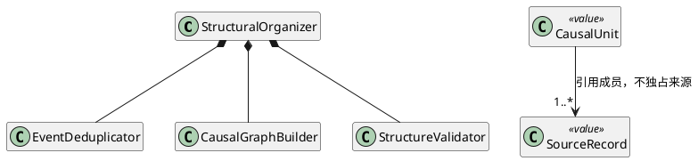
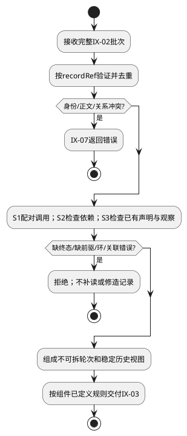
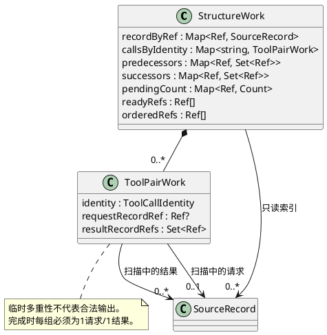

# FD-02 历史与结构整理

规范依赖单向指向[组件设计](../../../context-engine.md)：§3.4/3.5是域间交互与数据结构唯一标准，字段沿其绑定的CTX-CON-1；本文不重新定义跨域Schema。设计状态仍为candidate；本地实现及已运行用例在§6逐项记录。CTX-FD编号为设计追踪，不能等同整条宿主链已验收。


## 1. 职责与边界

将IX-02输入整理为IX-03所需的规范记录、完整因果单元、依赖和历史视图。只处理已读取数据，拥有请求期派生索引；不拥有Session/Run，不读contentRef，不决定可选预算。配对与检环属于本域，预算策略不能另写一套结构算法。

原事件身份与读取路径分开；工具调用按原Run/模型命令/callId确定。调用方串行不消除跨历史Run同名调用。本域拒绝无法证明的结构，不从自然语言推断依赖或事实真实性。

## 2. 场景与分支

### S1 乱序且跨Run同callId

RA/M1/c1读取A，RB/M1/c1读取B；结果B先到，A后到。前置是两组终态已经由执行权威确认，reader提供完整原身份。步骤：先按recordRef验证重复→索引完整调用身份→核验request块及result关联→按助手块序建立tool_result_of→助手和全部结果组成原子单元→交稳定视图。后置是RA只配A，RB只配B，原正文不变。

同一调用有不同终态事件、缺结果、重复callId或toolName不符时拒绝；不会取最后一个或等待工具执行。组装失败后原事实不修改，交执行权威核对。

### S2 重复继承及跨单元依赖

触发：Parent与自身历史读取相同事件，同时资料D2 requires D1。步骤：验证同身份正文及关系一致→保留一次原事件→验证依赖端点在授权输入集合内→检环→生成单元及前驱关系。相同文本不同事件必须保留；D2前驱缺失不能增加来源读取。

遇自环、双向环或不存在端点拒绝。来源顺序固定为父、自身Session、当前Run，重复记录保留最小orderKey；位于父候选集合即计父贡献，不选择latest。纯工具重复场景使用现有已确定排序规则。

### S3 后续用户任务及Child完整轮次

触发：用户说“继续”，或Parent已确认Child结果后继续。输入必须包含权威历史，不从现有回答反推过去问题。已规范Child声明及观察按组件规则建立requires与完整轮次，UNKNOWN不组成终态轮次。

受信历史reader提供已保存用户输入及回答到输入的requires边，同轮原子选择。Child逐项核对expectedChildObservations：所有应到观察齐备且状态/身份/正文合法后才进入选择。清单不能从返回记录生成。缺声明或Child关联矛盾必须拒绝，不伪装成孤立user文本绕过结构校验。

## 3. 内部结构与算法



上述内部职责为每请求专属计算，不要求每个小规则成为新类。先去重再配对，先验证端点/环再求闭包；不添加反向边构造假环。FD-03只能通过IX-03使用结果，FD-04复用结构校验规则作最终输出复核，不能拷贝出不同实现。



记录与边有组件硬上限，索引/图遍历按有限集合终止；排序使用明确来源键，不能用完成时间。扩展新关系kind必须先变更组件契约及未知kind拒绝策略，再补图向量；普通新增资料reader不应改变本域。代码按组件§9的structural-organizer.ts及其职责拆分，不能导入具体存储/Pi。

### 3.1 数据结构、键与图不变量

输入为组件§3.5 CollectedSources，输出OrganizedContext；跨域字段不在本域另立Schema。本域为每次整理创建以下可变索引，返回前转换成只读数组：

```typescript
type ToolPairWork = {
  identity: ToolCallIdentity;
  requestRecordRef: Ref | null;
  resultRecordRefs: Set<Ref>;
};
type StructureWork = {
  recordByRef: Map<Ref, SourceRecord>;
  contentByRef: Map<Ref, ResolvedSourceContent>;
  callsByIdentity: Map<string, ToolPairWork>;
  predecessors: Map<Ref, Set<Ref>>;
  successors: Map<Ref, Set<Ref>>;
  pendingCount: Map<Ref, Count>;
  readyRefs: Ref[];
  orderedRefs: Ref[];
};
```

| 字段 | 键、范围、空值及用途 |
|---|---|
| recordByRef / contentByRef | recordRef空间；先检查identity/正文/关系一致，再按组件规则保留最小orderKey记录，不能直接覆盖。contentByRef只覆盖非message记录且一一对应。保留输入CollectedSources只读引用供最终追溯来源路径；不把不同来源rank覆盖成新的业务优先级 |
| callsByIdentity | string键是完整ToolCallIdentity的FE-C14N-1规范串，不是callId，不用分隔符拼接。ToolPairWork.identity含originAgentRunId/modelCommandId/callId；内存索引键不新增公共Ref |
| requestRecordRef / resultRecordRefs | 扫描开始null/空Set仅表示尚未扫描到，不能作为成功输出。相同身份第二个请求绑定即冲突；去重后每组恰有一个合法请求绑定和一个结果记录。还须按请求blockOrdinal核验对应工具块及toolName，不能只比较两端数量 |
| predecessors / successors | 每个recordRef都有键，无边为显式空Set。边from→to写入predecessors[from]和successors[to]；端点须存在，重复同kind边按规范整理，不混淆requires和tool_result_of的原边类型。索引只表达可达性，完整带kind的边仍保留在输出dependencies |
| pendingCount / readyRefs / orderedRefs | Count记录未释放前驱数，初始等于predecessors集合大小。readyRefs为待处理零前驱队列，按规范SourceOrderKey稳定取出；每条record最多入orderedRefs一次。计数不得负数；结束orderedRefs.length小于记录数即有环，失败不交半图 |

所有索引初始为空；记录数/完整边数受maxRecords/maxEdges约束。S1从callBindings构造配对，完成后每组生成ResolvedToolCall并建立依赖；S2先去重再构图；S3只接收已定义的声明/观察，不为缺正文补假节点。因果单元成员按组件规则产生非空memberRefs和稳定unitRef；共享前驱只引用一次原record。OrganizedContext.historyRecords从有message的规范记录提取recordRef/message，非消息资料不混入Pi历史。

必选声明解释与可选优先排序归FD-03的选择准备，本域不生成预算优先级。父/自身/Run按组件固定来源序，依赖先于后继；历史任务真实性及普通历史漏写检测由外部reader保证，接入必须另测，不能用Map插入序替代业务规则。整理完毕释放Map/Set，跨域结果不暴露可变索引。



数据失效对应FM-01/03：键碰撞导致误配、反向索引不一致导致漏环；UT-04用两个不同Run同callId及独立邻接表断言内部到输出的关系。

## 4. 局部SFMEA

| 风险 | 场景/原因 | 局部及系统影响、严重度依据 | 检测/控制及恢复 | 测试 |
|---|---|---|---|---|
| CTX-FD02-FM-01 | S1只用callId配对 | A调用得到B结果；高严重度，模型依据错误 | 全三元身份及工具块关联校验；矛盾拒绝并交原权威核对 | UT-01、IT-01 |
| CTX-FD02-FM-02 | S2按文本去重或以读取Run覆盖原身份 | 独立事实丢失/继承重复；高严重度，改变历史含义 | 原事件身份去重，正文/关系差异分别报错；不改原记录 | UT-02、DT-01 |
| CTX-FD02-FM-03 | S2/S3未检环或缺前驱仍生成单元 | 无限闭包或孤立观察进入模型；高严重度，结构和可用性受损 | 先端点/环校验再输出，禁止额外读取；拒绝请求而非修补 | UT-03、IT-02 |

O/D/RPN无实测不填写。失败输出不含原文，诊断保留受控错误信息；请求索引结束释放，不增加跨请求历史缓存。旧执行是否仍有资格提交归外部，不由本域加锁解决。

## 5. UT / DT / 集成测试

| 本域ID | 场景 / 输入及故障 | 独立预期 |
|---|---|---|
| CTX-FD02-UT-01 | S1 RA/RB同c1，助手含cA/cB且结果逆序 | 两个身份不混；多结果按块序；不同事件双终态拒绝 |
| CTX-FD02-UT-02 | S2重复同事件、独立同文本事件；分别改重复正文和关系 | 重复只保留一次，独立事件保留；正文DIGEST_MISMATCH、关系BINDING_MISMATCH |
| CTX-FD02-UT-03 | S2 D2→D1、缺端点、自环、D1↔D2 | 合法边方向不变；后三者SCHEMA_INVALID，无额外来源读取 |
| CTX-FD02-UT-04 | S1相同callId不同Run；S2独立三节点邻接表、缺键和计数不一致 | 完整三元键不碰撞；合法图输出所有节点一次且边方向正确；坏图拒绝，不输出含null端点的ResolvedToolCall |
| CTX-FD02-DT-01 | S1/S2从两个独立reader接只读记录，策略装配恶意修改者 | 来源对象不被结构整理修改；规则不依赖存储/Pi；跨域只传组件IX-03数据 |
| CTX-FD02-IT-01 | S1经FD-01→本域→FD-03→FD-04，预算保留全部 | 模型可见工具ID各自唯一且结果匹配；Trace恢复原三元身份 |
| CTX-FD02-IT-02 | S2合法D2依赖D1，选择阶段分别放得下/放不下 | FD-03按完整闭包取舍；本域未因预算删除依赖，FD-04仍能检查完整性 |
| CTX-FD02-IT-03 | S3已规范Child声明及观察，Pi建议只留观察 | 完整轮次由公共闭包保留或整体丢弃，不生成裸观察；缺项/空正文/UNKNOWN在选择前拒绝，不得靠裁剪隐藏 |
| CTX-FD02-IT-04 | S2父/自身重复，S3重启后“继续” | 重复只保留一次且按固定来源序；重启后的真实历史投影在宿主迁移验收，不计当前系统覆盖 |

UT夹具中的recordRef、关系和期望单元须独立构造，不调用被测配对算法生成。IT使用来源/模型spy，验证跨域协议，非真实持久化恢复证据。对应组件CTX-REL-T-01～06及CTX-SC-T-02/03；DT沿项目组件关系/边界实践执行，不只用类名正则证明隔离。

## 6. 首版约束、风险与实现验收

本域按组件§4.0首版约束实施。场景、数据和验收同步采用同一规则；局部实现不代替外部宿主恢复、保存和采纳验收。

开发前按本域数据结构检查输入完备；实现后覆盖成功、显式失败、限制拒绝和跨域错误传播。Child清单完整性在选择前检查；Memory仅单视图；没有本域持久化、缓存、重试或回执。外部准备存储/采纳提交的真实实现状态不能由本域替身证明。

本地实现证据：AK-CTX-103/104/105/113：跨Run调用配对、Child缺项拒绝、缺依赖及环、多结果排序。 测试设计全集不因此标为全部通过。
