# FlowEngine 组件详细设计

> 设计对象：L1 FlowEngine 无状态推进核心，以及 KernelHost 调用方围绕 Core 形成的协作流程。
> 适用阶段：详细设计、SFMEA、接口评审与测试设计。
> 迁移记录：2026-09-05 从 Governance 归档迁入本 L1 权威位置。
> 边界约束：文中的协调流程不扩大 Core 的依赖；FlowEngine 自身仅暴露 `FlowAdvancePort`，不直接调用外部系统。

> 开发契约：第 21 章 FE-CON-1 定义首版完整数据、状态、提交与恢复规则；早期概念命令名按 21.3 映射。本轮修订仍为候选，代码实现与五角色评审分别记录。

## 0. 文档控制

### 0.1 修订记录

| 版本                | 日期         | 作者    | 变更摘要                                       | 评审状态 |
| ----------------- | ---------- | ----- | ------------------------------------------ | ---- |
| `0.1.0-draft`     | 2026-09-04 | 待填写   | 建立详细设计大纲                                   | 待评审  |
| `0.2.0-candidate` | 2026-09-05 | 待填写   | 迁入 L1，继承无状态 Core 与端口边界，并补齐三张设计图的关系、思路与问题闭环 | 候选   |
| `0.3.0-candidate` | 2026-09-07 | Codex | 补充 Core 内部职责、类关系、调用顺序及生命周期，区分候选设计与现有代码     | 待评审  |
| `0.4.0-candidate` | 2026-09-07 | Codex | 补齐场景分析、内部类可测试性、故障注入与场景到测试的对应关系             | 待评审  |
| `0.5.0-candidate` | 2026-09-07 | Codex | 补充可测试性支撑手段、接入位置、故障脚本、回放证据与验收方式             | 待评审  |
| `0.6.0-candidate` | 2026-09-07 | Codex | 在第 6.7 节逐一展开全部 17 个场景流程图，补充提交检查、异常交接与测试检查点 | 待评审 |
| `0.7.0-candidate` | 2026-09-07 | Codex | 补齐 FE-CON-1 数据、迁移、事务、幂等、恢复与量化验收契约；进入五角色独立评审 | 待评审 |

### 0.2 评审角色

| 角色   | 关注点                 | 负责人 | 结论  |
| ---- | ------------------- | --- | --- |
| 架构评审 | 边界、依赖方向、职责唯一性       | 待填写 | 待评审 |
| 安全评审 | PEP/PDP、授权失败关闭、敏感数据 | 待填写 | 待评审 |
| 数据评审 | 快照、CAS、幂等、恢复点       | 待填写 | 待评审 |
| 测试评审 | SFMEA 覆盖、故障注入、验收条件  | 待填写 | 待评审 |
| 运维评审 | 可观测性、容量、告警、诊断       | 待填写 | 待评审 |

### 0.3 决策状态

| 决策 ID | 主题 | 候选结论 | 状态 |
|---|---|---|---|
| `FE-DEC-001` | FlowEngine 名称所指范围 | 仅指无状态 Core；运行装配属于 L1 Host/Coordinator | 已确认 |
| `FE-DEC-002` | 任务获取模型 | RunScheduler 消费有界可运行提示，FlowEngine 不消费任务 | 已确认 |
| `FE-DEC-003` | 并发控制 | 基于版本的 CAS，不在 Core 内持锁 | 已确认 |
| `FE-DEC-004` | 模型流解析归属 | L2 Adapter 解析 Provider 输出并产生规范化 RuntimeEvent | 已确认 |
| `FE-DEC-005` | 工具调用边界 | Core 只生成 ActionProposal，由 L1 控制路径协调安全与工具边界 | 已确认 |
| `FE-DEC-006` | 状态提交模型 | 调用方经权威 Port 原子提交，冲突后丢弃旧决策并重算 | 已确认 |

## 1. 设计摘要

### 1.1 问题

一个 Agent Run 不是一次函数调用就能完成：模型可能提出工具调用，权限系统可能要求人工批准，工具可能超时，状态提交也可能发生并发冲突。如果把这些等待、I/O 和状态都塞进 FlowEngine，Host 崩溃后的重放可能重复执行工具，并发推进可能相互覆盖，权限检查也容易被内部捷径绕过。

因此，FlowEngine 要解决的核心问题是：在不拥有持久状态、不解释权限策略、不直接执行副作用的前提下，持续推进 ReAct 循环，并让每次推进在外部依赖故障后仍可恢复、可审计、可测试。

### 1.2 设计结论

设计结论：

- `FlowEngine` 是无状态、确定性的 Run 推进算法；输入不可变快照和规范化事件，输出下一步命令集合。
- `KernelHost`/调用方负责装配 Scheduler、Context、L2 Adapter、State、Security 和 Tool Port；这些协作者不属于 FlowEngine，也不是它的直接出站依赖。
- 持久状态由外部 Repository/State Store 拥有；权限决策由 PDP 拥有；物理副作用由 Tool Provider 或 Sandbox 执行。
- 每次推进必须带 `expectedVersion`、幂等键、Deadline 和 OperationContext；冲突、超时和未知副作用必须显式收敛。

### 1.3 典型执行短轨迹

```text
受理 Run -> Inbox 事件持久化 -> 加载冻结输入 -> advance -> AdvanceResult
  -> advance 分支：原子提交 Run + 消费收据 + Outbox
  -> 提交确认后领取命令 -> 受控模型/权限/工具/Child 边界
  -> 规范化结果回到 Inbox -> 下一次推进
  -> ignore 分支：复用原回执，不产生新动作
  -> reject 分支：稳定错误，不消费事件、不提交决策
```

## 2. 范围与边界

### 2.1 设计目标

- 定义 FlowEngine 运行边界、Core 类结构和依赖方向。
- 定义一次推进的输入、输出、不变量和失败语义。
- 定义同层组件协作能力及层内接口。
- 定义与上层调度、安全、认知、执行、存储和运维能力的层间接口。
- 定义 SFMEA、测试用例、容量约束和可观测性规格。
- 形成可用于后续接口冻结和实现评审的统一模板。

### 2.2 非目标

- 不设计业务 Workflow、业务补偿或业务结果采纳。
- 不解释用户、租户、RBAC 或组织权限。
- 不拥有模型 Provider、PDP、数据库、消息总线或工具执行器的实现。
- 不把具体 Kafka、SQLite、OceanBase、OPA、MCP 或 MicroVM 类型带入 Core。
- 不冻结数据库 DDL、网络部署拓扑或具体中间件选型。
- 不在本阶段修改代码或生成实现任务。

### 2.3 场景分析

本节分析“业务请求如何经调用方与 FlowEngine 完成一个技术 Run”。用户可观察的结果覆盖完整协作流程；其中只有 `advance` 内的决策计算属于 Core。以下均为候选行为和验收要求，不代表测试已实现或通过。

#### 2.3.1 用户、参与者与目标

| 用户或参与者 | 角色与目标 | 与 FlowEngine 的关系 |
|---|---|---|
| 最终用户 | 在自己的租户和 Session 中提交任务、查看结果、取消或参与审批 | 间接用户，通过业务应用操作，不直接调用 Core |
| 业务编排层 / API 调用方 | 提交请求，关联租户、用户、Session，接收技术结果并决定业务采纳 | 发起用例；身份与 Session 访问资格由入口安全边界验证 |
| FlowCoordinator | 对已受理 Run 组装输入、调用推进、提交决策和分派命令 | Core 的直接调用者 |
| Scheduler、Snapshot/State、Context | 提供执行资格、一致快照、版本提交与有界上下文 | 支持参与者，由 Coordinator 协调 |
| L2 Adapter、Security、Tool Runtime | 分别提供规范化模型事件、授权事实、工具执行结果 | 经调用方与 Core 交换事件或命令，不由 Core 直接访问 |
| 审批人员 / 运维人员 | 处理待批准动作或副作用未知的挂起 Run | 通过受控入口提交恢复或处置信号，不能直接改写 Core 决策 |

示例：用户 U1 在租户 T1 的 Session S1 请求分析一段材料。入口验证 T1/U1 对 S1 的访问资格，调用方绑定 Run R1 与 Attempt A1，加载 S1 的上下文，再调用 FlowEngine。仅传入三个 ID 不构成授权，Core 也不根据裸 ID 自行查询用户、选择数据库或完成业务路由。

#### 2.3.2 触发与前置条件

| 范围 | 前置条件 | 不满足时的处理 |
|---|---|---|
| 用例触发 | 业务层提交新任务；后续由模型、工具、审批或调度事件触发单次推进 | 非受理请求不直接进入 Core |
| 身份与会话 | 入口已认证调用者并验证租户、用户、Session 绑定；所需资源引用可访问 | 调用方拒绝请求；不能读取其他租户上下文或调用模型 |
| 执行资格 | 已存在受理的 Run；Scheduler 已授予本次 Attempt 的执行资格 | 等待调度或拒绝失效 Attempt；Core 不抢占执行权 |
| 推进输入 | Run/Session/Context 引用绑定一致且带版本；事件属于当前 Run/Attempt；顺序和载荷摘要可验证 | InputGuard 拒绝不一致输入；合法重复事件进入幂等分支 |
| 时间与资源 | 输入冻结当前时间、Deadline、取消状态和预算；主成功场景中未到期、未取消且预算足够 | 超时、取消和预算耗尽走收敛分支，不从合法输入中排除 |
| 协作依赖 | 主成功场景使用的 State、Context、模型端口可用；工具场景另需安全与工具端口可用 | 依赖失败按异常场景处理；纯 Core 单元测试不要求这些服务在线 |

#### 2.3.3 主成功场景一：正确关联会话并返回纯文本（FE-SC-M01）

目标：请求只使用已授权 Session 的上下文，最终用户收到属于该 Run 的完成结果。场景附加条件：模型给出最终文本，无工具调用、无并发冲突。

| 步骤 | 参与者与动作 | 可观察结果 / 提交点 |
|---:|---|---|
| 1 | 用户经业务层提交 tenantId、userId、sessionId、任务内容与请求幂等标识；入口完成绑定与访问校验 | 请求关联到正确 Session，受理后返回 Run 引用 |
| 2 | Scheduler 授予 Attempt 执行资格；Coordinator 加载冻结快照并请求 Context | AdvanceInput 中的 Run、Attempt、Session 和上下文引用一致 |
| 3 | Coordinator 调用 advance；Guard 校验，Resolver 选择 Ready → AwaitingModel，Factory 返回 InvokeModel 决策 | Core 只返回意图，无模型调用或持久化 |
| 4 | Coordinator 按 expectedVersion 提交等待态与命令意图；成功后经认知端口派发 | 持久状态先于外部派发生效；冲突时不得派发旧命令 |
| 5 | Adapter 返回完整规范化模型结果；Coordinator 逐事件调用 Core | 按第 6 节经过 Evaluating，最终文本分支生成 CompleteRun；事件使用 21.2 的 ModelCompleted 判别联合 |
| 6 | Coordinator 提交完成决策；业务层读取并返回该 Run 的结果 | Run=Completed，结果仍绑定原租户/Session；后续不再生成新动作 |

成功后置条件：结果与原请求、Run、Session 可关联；完成状态已提交；命令身份与因果关系可追踪；调用方释放本次执行资源。返回技术完成结果不等于业务层已采纳内容。对应测试：`FE-TC-001`、`FE-TC-019`。

#### 2.3.4 主成功场景二：工具调用后继续推理（FE-SC-M02）

目标：模型提出的工具动作经过授权执行，结果回到原 Run 后产生最终答复。沿用 M01 的步骤 1—4；附加条件是动作获准且工具返回已知执行结果。

| 步骤 | 参与者与动作 | 可观察结果 / 提交点 |
|---:|---|---|
| 5a | Adapter 提供规范化动作建议；Core 在 Evaluating 分支生成 ProposeAction 并进入 AwaitingPermission | Proposal 与等待态先提交，不直接派发工具 |
| 5b | Coordinator 请求安全决策，接收已验证的 PermitGranted 事实并再次推进 | Core 计算 AwaitingTool；授权判断与 Permit 有效性检查仍属于安全边界 |
| 5c | 调用方提交工具等待态与派发意图，经 PEP 校验有效 Permit 后调用 ToolDispatchPort | 动作、Run、资源和 Permit 绑定一致；同一命令使用 21.5 的 commandId 作为幂等标识 |
| 5d | Tool Runtime 返回 Observation；Coordinator 将结果关联回当前 Run/Attempt 再次推进 | Core 输出 Ready 决策；提交后下一次推进才可生成新的 InvokeModel |
| 5e | 模型基于新上下文返回最终文本，继续 M01 的步骤 5—6 | 原 Run 完成；工具结果未串入其他 Session |

成功后置条件：工具调用有对应授权与执行事实，Observation 能追溯到 Proposal/ToolCall，最终完成状态已提交。对应测试：`FE-TC-002`。这里只要求可审计的幂等派发，不以 CAS 推导外部系统已经实现“恰好一次”执行。

#### 2.3.5 特殊场景：合法替代路径

| 场景 ID     | 条件 / 分支点                           | 行为及结束条件                                                                   | 对应测试                |
| --------- | ---------------------------------- | ------------------------------------------------------------------------- | ------------------- |
| FE-SC-S01 | M01 步骤 2：同租户多 Session 或多租户请求交错     | 调用方按授权绑定加载快照；同一 Engine 交错推进互不污染，结果回到各自 Run                                | FE-TC-019、FE-TC-021 |
| FE-SC-S02 | M02 步骤 5b：需要人工批准                   | 提交 Suspended 与 Proposal/等待引用，释放执行槽；收到合法审批信号后重新校验授权并继续原动作，不重放模型生成 Proposal | FE-TC-004           |
| FE-SC-S03 | 任意非终态：用户取消或 Parent Run 取消          | 调用方停止新派发，Core 生成取消收敛决策；已在途副作用按事实记录，不能宣称物理动作已撤销                            | FE-TC-013           |
| FE-SC-S04 | M02 步骤 5e：模型仍需更多工具结果               | 在冻结预算内重复工具循环；耗尽时终止继续生成新动作，记录明确原因                                          | FE-TC-003、FE-TC-023 |
| FE-SC-S05 | 相同事件因投递语义重复到达                      | 同 sequence 同载荷幂等忽略，不新增命令、状态版本或副作用；终态合法迟到事件不得重新激活 Run                      | FE-TC-006、FE-TC-022 |
| FE-SC-S06 | 推进生成 CreateChildRun / JoinChildRun | 调用方经 ChildRunPort 创建或等待；权限、预算和 Deadline 不扩大，Child 结果作为事实回到 Parent         | FE-TC-025           |

特殊场景是预期可发生的路径，挂起或取消不等于主成功场景的 Completed。S02 的早期 Suspended → Ready 简写已修订；21.4 已明确等待原因与原 Proposal 的恢复判定，审批通过转 AwaitingPermission，禁止无条件重新调用模型。

#### 2.3.6 异常场景：拒绝、重算与恢复

| 场景 ID     | 异常及发生位置                               | 处理责任、恢复条件与失败保证                                                      | 对应测试                          |
| --------- | ------------------------------------- | ------------------------------------------------------------------- | ----------------------------- |
| FE-SC-E01 | 入口租户/用户/Session 不匹配，或 Core 输入绑定错配     | 入口拒绝越权访问；Guard 拒绝已加载输入的引用错配。未通过校验不得提交决策或派发，修正来源后以合法请求重试             | FE-TC-019、FE-TC-007           |
| FE-SC-E02 | State 不可用或 CAS 冲突                     | 读取失败不调用 Core；提交结果未知先查原提交，不能当作失败直接重放；确定冲突后丢弃旧决策，重载重算并限制重试次数          | FE-TC-008、FE-TC-026           |
| FE-SC-E03 | 模型半包、乱序、断流或失败                         | Adapter 隔离无效输出并形成稳定失败事实；Core 不从部分内容产生可执行动作。模型首版不自动重试，按 21.7 查询或失败关闭 | FE-TC-009                     |
| FE-SC-E04 | 安全决策 Deny、不可用，或 Permit 失效/重放          | Deny 按现设计进入 Failed；不可用或 Permit 无效不得派发。只有重新获得有效授权才能继续，不能宽松降级         | FE-TC-005、FE-TC-010、FE-TC-011 |
| FE-SC-E05 | 工具失败或超时                               | 已知失败按策略收敛；副作用 UNKNOWN 强制挂起并待核对，不自动重试；确定未执行也必须经过有界重试与授权检查            | FE-TC-012                     |
| FE-SC-E06 | Deadline 到期、上下文或执行预算超限                | 调用方停止新派发；Core 按冻结时间/预算收敛。上下文组装失败由调用方处理，不伪造合法 ContextFrame 继续调用模型    | FE-TC-018、FE-TC-014、FE-TC-023 |
| FE-SC-E07 | Host 提交前、提交后或派发后崩溃                    | 前者从旧快照重算；后两者查询命令/提交/执行事实再恢复。不能仅凭 Host 内存或 CAS 成功判断工具是否执行            | FE-TC-016、FE-TC-017、FE-TC-026 |
| FE-SC-E08 | 未知事件、非法迁移、同 sequence 异载荷或旧 Attempt 结果 | Guard/Resolver 拒绝或隔离，输出稳定原因；不覆盖当前状态、不猜测事件含义、不产生外部动作                 | FE-TC-020、FE-TC-022           |
| FE-SC-E09 | 非关键遥测不可用                              | 调用方有界缓冲或丢弃非关键遥测，推进不阻塞；必要的状态/安全审计持久化不属于此降级范围                         | FE-TC-015                     |

异常最小保证：不串租户/Session、不覆盖新版本、不绕过授权、不盲目重试未知副作用；调用方保留足以区分“未提交、已提交、执行未知”的事实。主成功场景可假设依赖正常，异常测试必须主动撤销这个假设。

### 2.4 绝对边界

> FlowEngine Core 不存数据、不判权限、不直接使用模型算力、不制造物理副作用。

| 允许 | 禁止 |
|---|---|
| 读取不可变快照 | 直接读写数据库 |
| 计算下一状态与命令 | 自行签发或扩大权限 |
| 生成模型调用意图 | 持有 Provider 密钥或直接绑定 SDK |
| 生成 ActionProposal | 直接调用 MCP、内部 API 或沙箱 |
| 输出提交意图 | 绕过版本校验覆盖状态 |
| 传播取消、Deadline 和追踪上下文 | 保留跨推进调用的可变会话状态 |

### 2.5 KernelHost 装配边界与 Core 边界

| 边界 | 包含 | 不代表 |
|---|---|---|
| KernelHost 装配边界 | Scheduler、Context Client、FlowEngine、L2 Adapter、State Client、Security Client 和 Tool Client 的进程内装配 | 这些组件属于 FlowEngine、同一架构层或共享一个事务 |
| FlowEngine | ReAct 状态机、推进规则、命令生成、终态判定 | 消息消费、I/O、权限裁决、工具执行或持久化 |

## 3. High Level 架构设计

### 3.1 视图要回答的问题

这张图回答三个问题：一次 Run 由哪些组件接力推进；FlowEngine Core 与 KernelHost 协调职责在哪里分开；模型、权限、工具和状态写入分别经过哪个受控边界。它表达逻辑协作和信任边界，不直接等同于部署单元、代码包或事务边界。蓝色表示外部 I/O，黄色表示进程内组件，红色表示安全边界。

### 3.2 High Level 架构图（FE-DGM-001）

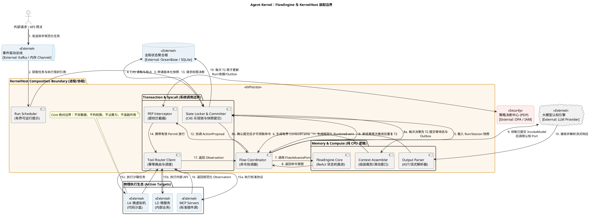

### 3.3 组件关系与一次推进

图中的箭头表示一次推进中的请求、结果或命令流，不表示左侧组件拥有右侧组件。`Flow Coordinator` 是协作枢纽，`FlowEngine Core` 只参与第 7、8 步的纯计算。

| 关系 | 交换内容 | 责任边界 |
|---|---|---|
| Gateway → Event Bus → Run Scheduler | 规范化任务与执行信封引用 | Event Bus 保证投递语义；Scheduler 只决定何时领取，不决定 Run 下一状态 |
| Run Scheduler → State Committer → State Store | Run/Session 引用、版本化快照 | 状态权威在 Store；Committer 负责版本校验，Scheduler 和 Core 都不持有权威状态 |
| State Committer → Context Assembler → Flow Coordinator | 冻结快照、预算与 `ContextFrame` | Assembler 生成有界投影，不修改长期记忆或 Run |
| Flow Coordinator → FlowEngine Core → Flow Coordinator | `AdvanceInput`、`AdvanceDecision` | Core 根据不可变输入计算命令意图；Coordinator 解释并分派命令，但不能改写决策 |
| Flow Coordinator → LLM → Output Parser → Flow Coordinator | 模型请求、Provider 流、规范化 `RuntimeEvent` | L2 Adapter 隔离 Provider 协议；Core 不解析流，也不依赖模型 SDK |
| Flow Coordinator → PEP ↔ PDP | `ActionProposal`、权限决断、`Permit` | PDP 拥有策略，PEP 执行决断；二者不可由 Core 绕过 |
| PEP → Tool Router → Action Target | `AuthorizedAction`、幂等执行请求 | 只有携带有效 Permit 的动作才能到达 MCP、内部服务或沙箱 |
| Action Target → Tool Router → Flow Coordinator | 原始结果、规范化 `Observation` | Tool Router 隔离目标差异，并明确副作用是否已发生 |
| Flow Coordinator → State Committer → State Store | `CommitIntent`、`expectedVersion` | 只有 CAS 成功后，决策才成为事实；冲突时丢弃旧决策并重算 |

一次工具型 Run 因此形成两个闭环：`事件/快照 → Core 决策 → CAS 提交` 是状态闭环，`ActionProposal → Permit → Tool → Observation → Core` 是副作用闭环。前一个闭环保证并发正确性，后一个闭环保证物理动作不会绕过授权。

### 3.4 设计思路与解决的问题

| 设计点 | 为什么这样设计 | 解决的问题 |
|---|---|---|
| 用 Coordinator 装配协作者，Core 保持纯函数 | I/O 的失败、延迟和重试规则与状态迁移规则变化频率不同 | 避免 Core 同时承担调度、协议和副作用职责，使状态规则可做确定性单元测试 |
| 将快照读取与提交放在 Core 外，并以 CAS 收口 | 纯计算期间不能阻止另一个 Worker 更新同一 Run | 防止丢失更新；冲突后可从新快照重算，而不是复用过期命令 |
| 模型输出先由 Adapter/Parser 规范化 | Provider 的流格式、半包和错误类型不稳定 | 防止 Provider 私有事件污染状态机，并能在非法流产生动作前拒绝它 |
| PEP/PDP 位于 Proposal 与 Tool 之间 | “模型建议执行”不等于“系统授权执行” | 消除从模型结果直达物理副作用的旁路，PDP 故障时可以统一失败关闭 |
| Tool Router 返回 Observation 和副作用分类 | 超时只说明没有收到响应，不说明动作没有发生 | 避免对副作用未知的工具自动重试，降低重复扣款、重复写入等风险 |
| 状态闭环和副作用闭环分离 | 数据库事务不能覆盖 LLM、人工审批和外部工具 | 不依赖跨系统大事务，Host 重启后仍能依据快照、幂等键和事实恢复 |

### 3.5 架构图决策

| 编号           | 问题                               | 候选处理                                          | 评审结论 |
| ------------ | -------------------------------- | --------------------------------------------- | ---- |
| `FE-ARC-001` | Scheduler 是否属于 FlowEngine        | 属于 L1 调度组件，不属于 FlowEngine                     | 已确认  |
| `FE-ARC-002` | Locker 是否表示长事务锁                  | 否；实现采用 SnapshotLoader/StateCommitter 与 CAS    | 已确认  |
| `FE-ARC-003` | Assembler 是否与 ContextEngine 重叠   | 仅作为 Context Port Client 或薄协调器                 | 已确认  |
| `FE-ARC-004` | Parser 是否属于 L1                   | Provider/协议解析留在 L2 Adapter，FlowEngine 只收规范化事件 | 已确认  |
| `FE-ARC-005` | PEP 与 Router 是否被 FlowEngine 直接调用 | 否；FlowEngine 返回命令，由 L1 Coordinator 调用         | 已确认  |
| `FE-ARC-006` | L1 是否允许直接访问 L4                   | 禁止；必须经 Tool/Sandbox 边界路由                      | 已确认  |

## 4. 组件职责设计

### 4.1 职责矩阵

| 组件                       | 核心职责            | 输入                    | 输出                  | 权威数据                | 明确不负责        |
| ------------------------ | --------------- | --------------------- | ------------------- | ------------------- | ------------ |
| Event Poller             | 消费、确认、退避与背压     | TaskEvent             | DispatchWorkItem    | 消费位点由消息机制持有         | Run 决策、业务优先级 |
| Snapshot Loader          | 按版本读取推进所需快照     | RunRef、SessionRef     | AdvanceInput        | 无                   | 长期持锁、修改聚合    |
| Context Assembler Client | 请求生成有界上下文       | ContextRequest        | ContextFrame        | 无                   | 长期记忆权威写入     |
| Output Parser            | 将 Adapter 输出规范化 | Provider chunks       | RuntimeEvent        | 无                   | 推进状态、权限决策    |
| FlowEngine Core          | 计算下一状态和命令       | AdvanceInput          | AdvanceDecision     | 无                   | I/O、持久化、副作用  |
| State Committer          | 校验版本并原子提交       | CommitIntent          | CommitResult        | 聚合 Repository 持有    | 重新计算推进规则     |
| PEP Interceptor          | 执行前校验 Permit    | ActionProposal、Permit | AuthorizedAction/拒绝 | Permit 权威状态由安全域持有   | 定义权限策略       |
| Tool Router Client       | 幂等派发与结果归一化      | AuthorizedAction      | Observation         | ToolCall 权威状态由工具域持有 | 权限裁决、业务补偿    |

### 4.2 RACI

> `A`：最终负责；`R`：执行；`C`：参与；`I`：获知。

| 能力 | FlowEngine Core | Scheduler/Poller | Context | Security | Tool Runtime | Repository |
|---|---|---|---|---|---|---|
| 计算下一动作 | A/R | I | C | I | I | I |
| 任务选择与派发 | I | A/R | I | I | I | C |
| 上下文组装 | C | I | A/R | C | I | C |
| 权限决断 | I | I | I | A/R | C | C |
| 工具副作用 | I | I | I | C | A/R | C |
| Run 状态提交 | C | C | I | I | I | A/R |
| 冲突后重载 | I | C | I | I | I | A |

## 5. 类图与对象模型

冲突后重载由 FlowCoordinator 执行（R），Repository 提供权威读取；Core 仅对重载后的输入重算，不执行 I/O。

### 5.1 类图要回答的问题

原图有三个缺口：`FlowEngine` 只有一个 `advance` 方法，没有内部协作者；`FlowAdvancePort` 只是箭头文字，没有接口实现关系；外部 Port 和命令类型占据主体，却没有解释事件如何变成决策。它能说明边界，但不足以作为模块内部类设计。

例如收到 `ObservationReceived` 时，原图无法回答谁检查 Attempt 和事件顺序、谁决定回到 `Ready`、谁确保不会重复派发工具。FE-DGM-002 因此分为 A 内部职责图与 B 输入输出及调用方视图。

**本节新增内部结构是候选设计，不是已有实现。** 当前 `src/control/run-flow.ts` 的 `RunFlow.run()` 仍直接协调 Adapter、Context、Tool 和 Delegation，在局部变量中维护循环计数。下述三个协作者是建议拆出的纯计算职责，尚未实现或批准；不能把现有 `RunFlow` 直接等同于无状态 Core。

### 5.2 类图（FE-DGM-002）

#### A. 模块内部职责与关系

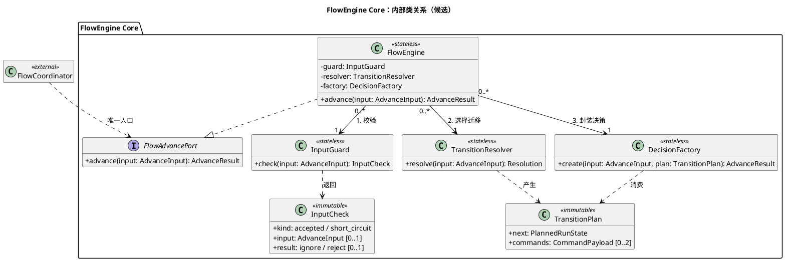

`FlowEngine` 持有装配方提供的三个只读协作者引用。右端 `1` 表示每个 Engine 使用一个对应协作者，左端 `0..*` 允许无状态协作者被多个 Engine 复用，不表示全局单例或独占所有权。协作者彼此不调用，Engine 通过局部变量传递结果；任何协作者都不得保留上一次调用的快照、计数器或命令。

| 对象 | 唯一职责 | 生命周期 |
|---|---|---|
| `FlowEngine` | 固定调用顺序，处理校验分支，返回结果 | 可跨 Run 复用，无持久状态 |
| `InputGuard` | 校验 Run/Attempt、sequence、事件载荷与冻结快照绑定 | 无状态，可复用 |
| `TransitionResolver` | 唯一决定目标状态和命令规格，包括终态、取消、超时、预算与未知副作用分支 | 无状态，可复用 |
| `DecisionFactory` | 校验计划一致性，构造命令身份、expectedVersion 和 digest | 无状态，可复用 |
| `InputCheck` | accepted / duplicate / rejected 及原因 | 单次推进局部值 |
| `TransitionPlan` | 候选目标状态、有序命令规格和原因 | 单次推进局部值，不向调用方暴露 |

`CommandPayload` 是带 kind 和载荷、尚未附加最终幂等标识的内部命令规格，变体与 `EngineCommand` 对应。必要的是分清这三项职责，实现层面扩展成可插拔框架，通过增加每个状态一个类、Handler 注册表或可变 Builder。实现评审时，简单协作者可落为模块内纯函数，保持图中的依赖和不变量。

**内部调用短轨迹：**

```text
输入：AwaitingTool@version N + ObservationReceived
1. Engine -> InputGuard.check：核对 run/attempt、sequence、快照绑定。
2. accepted -> TransitionResolver.resolve：
   未取消、未超时且预算允许时，返回 Ready + 空命令；
   UNKNOWN 副作用返回 Suspended + SuspendRun，不生成工具重试命令。
3. Engine -> DecisionFactory.create(input, plan)：
   校验状态与命令一致，封装 expectedVersion=N 与 decisionDigest。
4. Engine -> Coordinator：返回决策。
   Coordinator 的 CAS 成功后 Ready 才生效；下一次推进才可能 InvokeModel。
   CAS 冲突则丢弃决策，由 Coordinator 重载重算，Core 不自行重载。
```

分支规则：duplicate 仅限已提交收据中的 eventId、sequence、载荷摘要完全匹配，Engine 直接返回 ignore，不调用 Resolver/Factory，调用方复用原回执，不新增状态版本或外部动作；同 sequence 异载荷属于 rejected。rejected 返回稳定错误，不进入 Resolver/Factory。终态输入通过身份校验后，Engine 返回 ignore terminal，不调用 Resolver/Factory。取消和 Deadline 到期是有效输入上的收敛分支，不应被 Guard 当作结构错误提前丢弃。

第 21.2—21.5 节已定义已消费事件收据、advance/ignore/reject 返回类型、完整命令变体与确定性摘要。Factory 只处理合法迁移计划，不读取时钟或使用随机数。

#### B. 输入输出与调用方边界

此图保留命令族与调用方出站依赖，作为 A 图的补充；这些外部 Port 不属于 Core 的内部协作者。

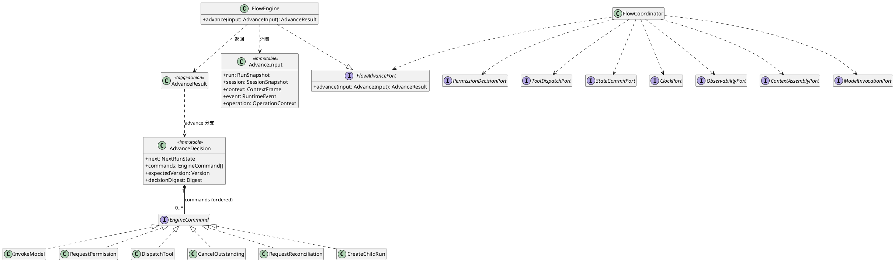

### 5.3 对象与组件关系

| 图中关系 | UML 含义 | 运行时含义 |
|---|---|---|
| Coordinator 依赖 FlowAdvancePort；FlowEngine 实现该接口 | 使用关系与实现关系分开 | Coordinator 构造完整输入并调用 advance；Core 不回调 Coordinator |
| FlowEngine 依赖 AdvanceInput / AdvanceDecision | 消费输入、产生输出，不表示长期持有 | 所有快照、上下文、事件与时间通过同一冻结输入传入 |
| AdvanceDecision 组合 0..* EngineCommand | 一个决策包含有序命令值 | 命令的逻辑身份属于决策；持久化后可超出调用生命周期，不得脱离决策身份重放 |
| 各命令变体实现 EngineCommand 结构契约 | TypeScript 封闭判别联合的 UML 表达 | 不要求运行时继承或每个命令一个类；没有 execute 方法，未知类型拒绝 |
| Coordinator 依赖各出站 Port | 调用方依赖边界抽象 | Context、模型、权限、工具、提交、时间和遥测具体 Adapter 由 Composition Root 装配 |

输入中的 RunSnapshot、SessionSnapshot、ContextFrame、RuntimeEvent、OperationContext 各为一个只读引用，不是由 Engine 拥有生命周期的聚合。Core 不读取实时 Clock、活动 AbortSignal 或全局热更新配置；用于判断的时间、取消状态和限额必须被冻结在输入中。CreateChildRun / JoinChildRun 由调用方经 ChildRunPort 协调，Core 不直接创建或等待子 Run。

命令类是“请求某组件做事”的不可变意图，不是已经发生的事实。例如 `ProposeAction` 只允许 Coordinator 请求权限判断；只有 PEP 返回有效 Permit 后，Coordinator 才能调用 `ToolDispatchPort`。这一区分阻止了调用方把 Core 的输出误当成执行授权。

### 5.4 设计思路与解决的问题

| 设计点 | 来由与取舍 | 解决的问题 |
|---|---|---|
| 单一 `advance` 入口 | 每次只处理一个已排序事件，牺牲 Core 内部的 I/O 便利性，换取明确的前后条件 | 并发、重放和非法迁移可以在一个确定性边界验证 |
| 不可变 `AdvanceInput` / `AdvanceDecision` | 推进中不共享可变聚合，所有时间和上下文也显式传入 | 避免同一次计算读到不同时刻的数据；相同输入可复现相同 digest |
| 封闭 `EngineCommand` 联合 | 新副作用必须显式增加命令类型和调用方处理分支 | 避免通过通用回调或字符串命令偷偷扩大 Core 能力 |
| Coordinator 持有出站 Port 依赖 | 调用方承担副作用协调，Core 只承担规则计算 | 保持依赖向外，测试 Core 时无需数据库、LLM、PDP 或 Tool Provider |
| decision 携带 `expectedVersion` 与 digest | 命令必须能证明基于哪个状态、属于哪次计算 | 防止过期决策提交，也为重复请求和审计提供稳定身份 |

### 5.5 核心对象规格

完整可序列化 TypeScript 定义及字段约束见 21.1—21.3。下表为实现入口索引，不再保留未定义字段。

| 对象 | 关键内容 | 不变量 |
|---|---|---|
| AdvanceInput | run、session、context/null、event、priorReceipt/null、operation | 冻结绑定匹配；非模型路径不强制 Context 可用 |
| AdvanceResult | advance / ignore / reject | 重复、正常空命令迁移、拒绝三者明确区分 |
| AdvanceDecision | 输入/决策摘要、版本与取消 epoch、事件位置、next、commands | 单事务提交消费与变更 |
| RuntimeEvent | 来源、因果、身份、sequence、payload、digest | 来源可信且与当前等待命令匹配 |
| EngineCommand | commandId、冻结作用域、Deadline、封闭 payload | 只表达意图；执行端耐久去重 |
| ContextFrame | Run 版本、转录头、冻结绑定、Prompt Artifact 引用与 token 数 | 不携带可变 Session 或原始身份 |
| OperationContext | 固定时间与截止、追踪信息 | Core 不读实时 Clock；追踪字段不影响语义摘要 |

### 5.6 推进函数规格

```text
AdvanceResult advance(AdvanceInput input)
```

前置条件：

- 所有快照均通过完整性校验，并包含明确版本。
- RuntimeEvent 属于当前 Run/Attempt；未消费事件进入迁移，已消费的同载荷事件进入幂等分支。
- 当前时间、Deadline 和取消状态在调用前冻结；到期或取消进入收敛分支。
- 授权、路由和上下文引用只使用冻结版本。

后置条件：

- 相同规范化输入产生相同 `AdvanceDecision` 和 digest。
- 输出只包含声明过的命令类型。
- 不发生 I/O、持久化或外部副作用。
- 终态不会生成新的模型、工具、记忆或 Child Run 命令。

## 6. 状态机与核心流程

### 6.1 状态图要回答的问题

这张图描述一个 Run 在等待模型、评估输出、等待权限、等待工具和终止之间如何迁移。它刻意不描述组件调用细节：状态迁移由 Core 计算，外部动作由 Coordinator 分派，状态由 Repository 在 CAS 成功后持久化。这样可以区分“Core 建议进入某状态”和“该状态已经成为系统事实”。

### 6.2 Run 推进状态机（FE-DGM-003）

Evaluating 是 ModelCompleted 内部判定阶段，不持久化。完整状态×事件与优先级以 21.4 为准。

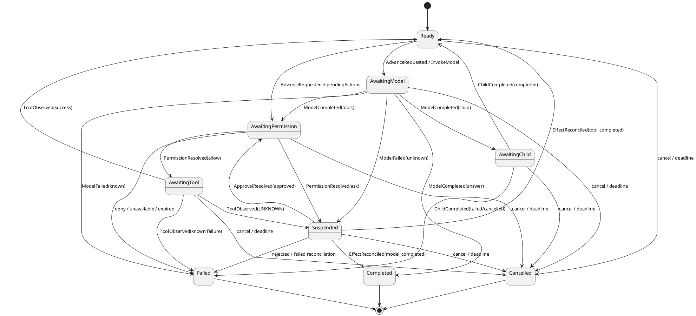

### 6.3 状态、事件与组件关系

21.4 给出逐项迁移数据；21.6 定义每次状态变更的原子提交。模型完整输出由 Adapter 一次规范化为 answer/tools/child，Resolver 在同一次 advance 中完成内部 Evaluating；不再等待第二个完成事件。审批通过恢复 AwaitingPermission 并重新签发授权，工具 UNKNOWN 恢复时只消费核对结果。AwaitingChild 保存确定 childId，Child 完成由新事件推进。

Coordinator 负责提交后派发、取消、查询与恢复，RunRegistry 拥有状态。FlowEngine 不直接操作 PEP、数据库、模型或执行端。终态保持不变，迟到副作用保存在独立事实记录中。

### 6.4 设计思路与解决的问题

| 设计点                                    | 为什么这样设计                                | 解决的问题                                      |
| -------------------------------------- | -------------------------------------- | ------------------------------------------ |
| 等待模型、权限和工具分别建模                         | 三类等待的超时、取消、重试和恢复规则不同                   | 避免用一个模糊的 `Running` 状态掩盖系统卡在哪个依赖上           |
| `Evaluating` 与 `AwaitingPermission` 分开 | 模型输出有效不代表动作已获授权                        | 防止解析成功被误当成执行许可，并为 Deny/Ask 保留明确分支          |
| `Suspended` 是非终态                       | 人工审批可能跨进程、跨小时完成                        | Host 无需占用执行槽或保存调用栈，收到 ResumeSignal 后可从快照恢复 |
| 工具结果回到 `Ready`                         | Observation 是下一轮推理的输入，不在工具回调里直接拼接下一动作  | 每轮推进都有独立版本、digest 和预算检查，ReAct 循环可审计且有界     |
| 终态封闭                                   | Completed、Failed、Cancelled 不再产生模型或工具命令 | 防止迟到事件、重复投递或取消竞态重新激活已经结束的 Run              |
| 迁移必须经 CAS 成为事实                         | 多 Worker 可能同时对同一版本计算合法但不同的候选迁移         | 保证最多一个决策提交；失败者重载后重算，避免状态分叉                 |

### 6.5 正常链路

| 步骤 | 输入 | 处理 | 输出 | 提交点 |
|---:|---|---|---|---|
| 1 | TaskEvent | 去重、校验、加载引用 | DispatchWorkItem | Inbox 耐久受理后确认 |
| 2 | Run/Session Ref | 读取一致快照 | AdvanceInput | 无 |
| 3 | AdvanceInput | 组装 ContextFrame | Model command | CAS 提交等待模型 |
| 4 | Model stream | 解析规范化事件 | Text/ActionProposal | 只接收完整结果，未知调用不自动重试 |
| 5 | ActionProposal | 权限判断与 Permit 校验 | AuthorizedAction | 安全审计提交 |
| 6 | AuthorizedAction | 幂等执行 | Observation | ToolCall 提交 |
| 7 | Observation | 重新推进或结束 | Next command/terminal | Run/Session 独立 CAS |

### 6.6 异常、挂起与恢复链路

第 6.7 节已用逐场景流程图展开以下恢复判定；涉及端口消息顺序的时序图仍可在契约冻结时细化：

- 模型流中断；
- CAS 版本冲突；
- 权限需要外部批准；
- Permit 过期、撤销或已消费；
- 工具超时且副作用未知；
- 消息重复投递；
- Host 在提交前或提交后崩溃；
- Parent Run 取消并级联 Child Run；
- Deadline 到期；
- Telemetry 不可用。

### 6.7 场景流程图展开（FE-DGM-004）

图中概念名按FE-CON-1解释：ObservationReceived=ToolObserved；PermitGranted/ApprovalRequired/Denied为PermissionResolved的allow/ask/deny变体；ResumeSignal=ApprovalResolved或EffectReconciled；ProposeAction=RequestPermission；完成/失败/挂起为next.position；Evaluating为同次advance的局部步骤。所有首版模型/工具自动重试分支恒为否，查询恢复不属于重试执行。

本节逐一展开第 2.3 节的全部 17 个场景。每个活动节点标明责任方；`Core` 节点只做纯计算，读写、鉴权、调度和派发由调用方及端口承担。图中的停止节点表示“本次流程结束或交还控制”，不一定表示 Run 已进入终态。

共同提交规则：只有明确提交成功，才可执行依赖该决策的新派发；确定冲突交给 E02 重载重算，提交结果未知先查询原提交。图中“提交（E02）”均遵守此规则。跨图交接沿用同一 Run、Attempt、命令身份与因果关系，不创建无关联的新任务。以下是候选流程设计；审批恢复、命令变体和事件拆分遵守第 21 章 FE-CON-1，不因画出流程而视为已批准或实现。

| 场景 | 展开位置 | 验证用例 |
|---|---|---|
| FE-SC-M01 纯文本完成 | 6.7.1 | FE-TC-001、FE-TC-019 |
| FE-SC-M02 工具调用 | 6.7.2 | FE-TC-002 |
| FE-SC-S01 多租户、多 Session 交错 | 6.7.3 | FE-TC-019、FE-TC-021 |
| FE-SC-S02 人工审批恢复 | 6.7.4 | FE-TC-004 |
| FE-SC-S03 取消与级联 | 6.7.5 | FE-TC-013 |
| FE-SC-S04 多轮工具循环 | 6.7.6 | FE-TC-003、FE-TC-023 |
| FE-SC-S05 重复与迟到事件 | 6.7.7 | FE-TC-006、FE-TC-022 |
| FE-SC-S06 Child 创建与 Join | 6.7.8 | FE-TC-025 |
| FE-SC-E01 身份与快照绑定错误 | 6.7.9 | FE-TC-019、FE-TC-007 |
| FE-SC-E02 状态故障与 CAS 冲突 | 6.7.10 | FE-TC-008、FE-TC-026 |
| FE-SC-E03 模型异常 | 6.7.11 | FE-TC-009 |
| FE-SC-E04 授权拒绝与故障 | 6.7.12 | FE-TC-005、FE-TC-010、FE-TC-011 |
| FE-SC-E05 工具失败与未知副作用 | 6.7.13 | FE-TC-012 |
| FE-SC-E06 Deadline 与资源超限 | 6.7.14 | FE-TC-018、FE-TC-014、FE-TC-023 |
| FE-SC-E07 Host 崩溃恢复 | 6.7.15 | FE-TC-016、FE-TC-017、FE-TC-026 |
| FE-SC-E08 非法事件与迁移 | 6.7.16 | FE-TC-020、FE-TC-022 |
| FE-SC-E09 非关键遥测故障 | 6.7.17 | FE-TC-015 |

#### 6.7.1 FE-SC-M01：正确关联 Session 并完成纯文本

入口：用户提交任务。成功出口：Completed 已提交且结果关联原请求；任何前置检查失败都不能进入模型派发。

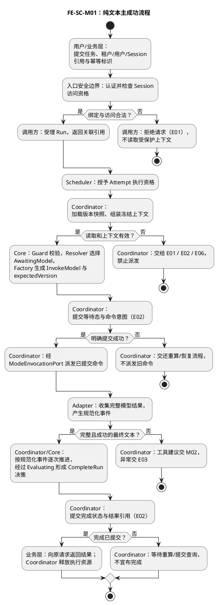

检查点：模型调用前有成功提交事实；输出归属不变化；逐事件迁移的提交同样适用 E02。测试需分别断言结果绑定、命令顺序与终态封闭。

#### 6.7.2 FE-SC-M02：工具调用后继续推理

入口：M01 已获得合法模型动作建议。成功出口：Observation 回到原 Run，后续最终文本完成；Proposal 本身不构成授权。

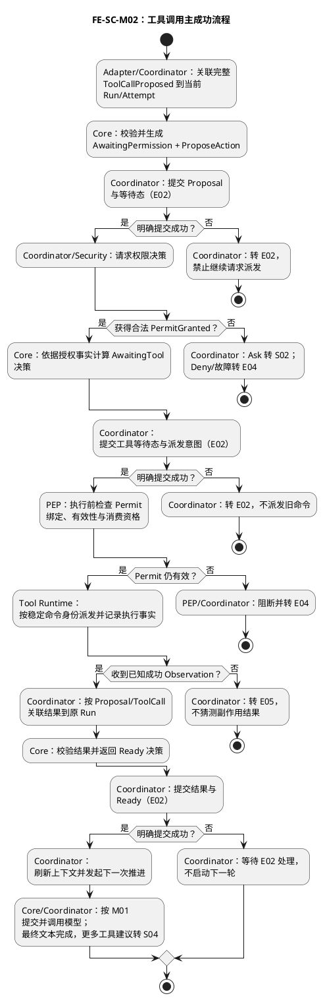

检查点：Proposal、Permit、派发、Observation 共用可追踪身份；等待态提交与 PEP 检查都通过才执行。外部副作用是否幂等由真实工具契约验证。

#### 6.7.3 FE-SC-S01：多租户、多 Session 交错推进

入口：两个合法请求 A/B 交错到达。出口：分别提交到各自 Run，错误引用在进入受保护上下文之前或 Guard 处被拒绝。

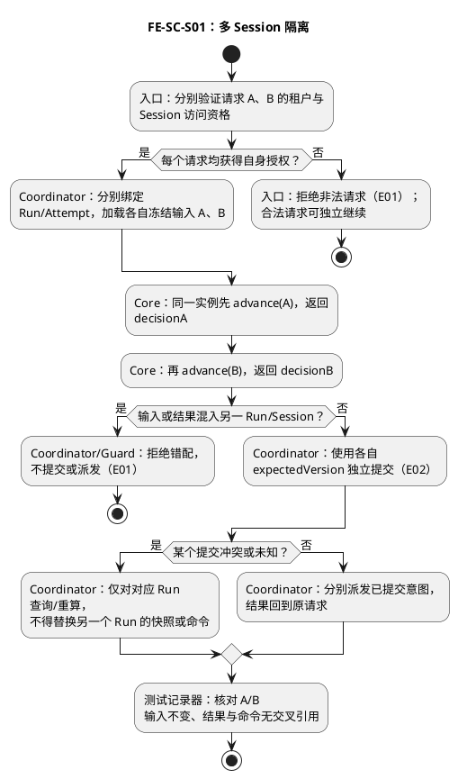

验证补充：A/B/A 的最后一次 A 在离线纯函数测试中重用原输入，应与首次一致；它不是再次提交旧决策的运行步骤。

#### 6.7.4 FE-SC-S02：人工审批挂起与恢复

入口：安全决策为 Ask。出口：保持挂起、拒绝收敛，或在重新授权后继续原 Proposal。恢复状态和事件按 21.2—21.4 执行。

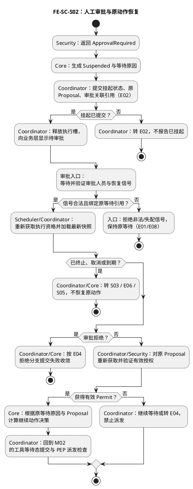

检查点：审批信号不是 Permit；恢复不复用旧授权、不重新调用模型生成 Proposal。状态图中的 Ready 不能替代这些恢复检查。

#### 6.7.5 FE-SC-S03：取消与 Child 级联

入口：用户或 Parent 发出合法取消请求。出口：无新派发，Run 按取消协议收敛，在途动作仍按真实副作用分类记录。

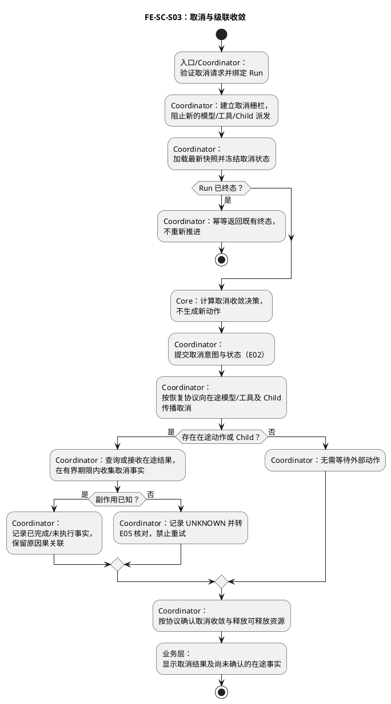

检查点：取消与派发竞态使用屏障复现；提交不确定时仍禁止新派发并由 E02 查询。取消落库与传播的恢复记录需冻结，不能宣称外部动作已回滚。

#### 6.7.6 FE-SC-S04：有界多轮工具循环

入口：模型仍需要工具结果。出口：完成、取消、失败或挂起，循环必须受预算约束。

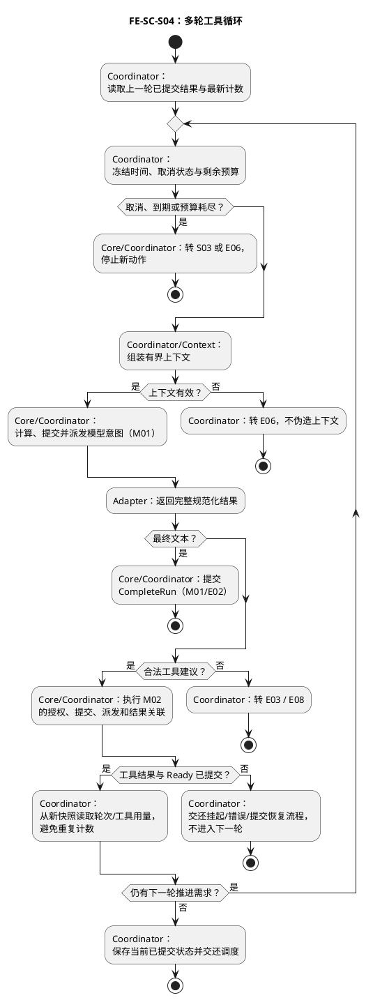

检查点：每轮计数来自已提交快照；重投不能增加用量；到期和上限边界分别测试。循环不依赖常驻 Engine 的内存计数器。

#### 6.7.7 FE-SC-S05：重复与终态迟到事件

入口：事件重复投递或到达终态 Run。出口：合法重复被忽略、非法冲突被拒绝，或合法新事件继续推进。

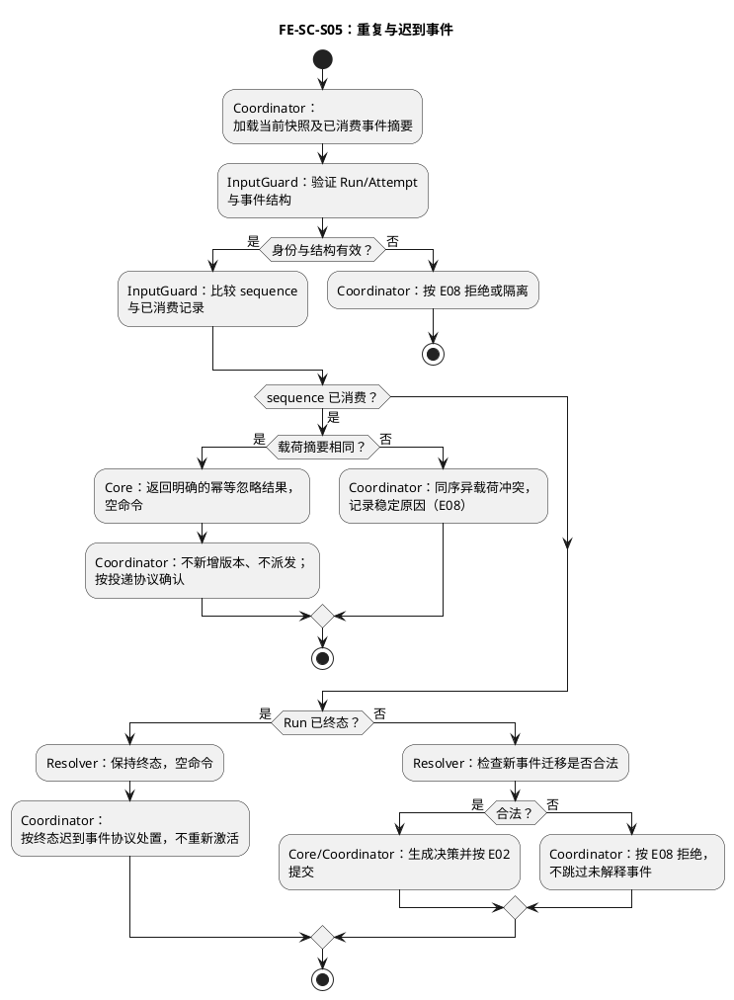

检查点：不能仅以 commands 为空判定重复，正常 Ready 迁移也可为空命令。显式忽略标记与终态事件确认方式仍须在契约中定义。

#### 6.7.8 FE-SC-S06：Child 创建、Join 与结果回收

入口：Core 生成 Child 意图或已存在 Child 的等待条件满足。出口：父 Run 收到合法结果，或保持等待/拒绝收敛。

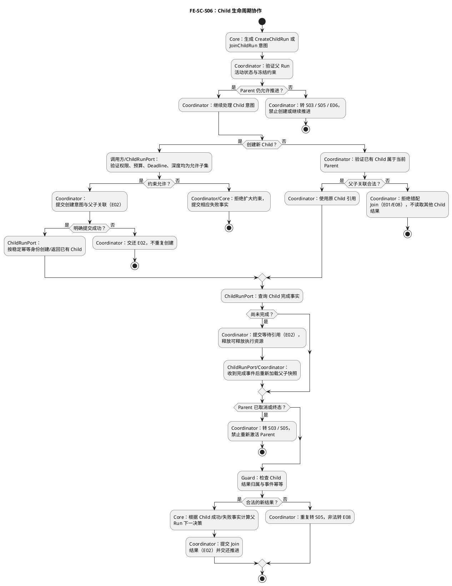

检查点：创建响应丢失必须按原身份查询，不能创建另一个 Child；Join 不扩大父子权限，也不把 Child 失败自动当作成功。

#### 6.7.9 FE-SC-E01：身份与快照绑定错误

入口：访问检查或输入绑定检查失败。出口：明确拒绝；只有重新验证的合法输入可以继续。

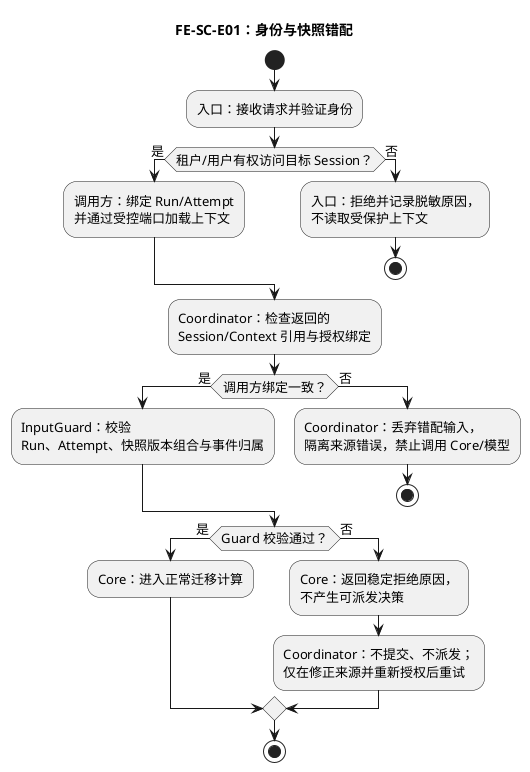

检查点：入口拒绝时上下文读取次数为零；Guard 只核对已加载引用，不能代替入口授权。

#### 6.7.10 FE-SC-E02：读取失败、CAS 冲突与提交未知

入口：一次状态读取或提交。出口：确认提交成功、重算后成功，或停止本次尝试等待恢复；重试有界。

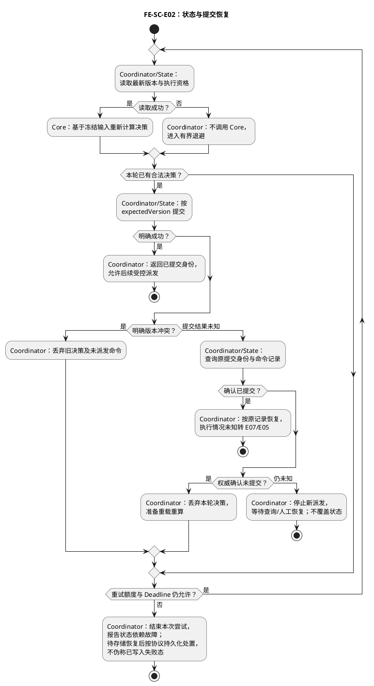

检查点：提交超时不等于冲突；只有权威确认才能判定未提交。使用双读 N 屏障与“生效后丢响应”分别测试。

#### 6.7.11 FE-SC-E03：模型半包、乱序、断流与失败

入口：模型流到达 Adapter。出口：完整合法事件进入 Core，或失败关闭并按已批准重试策略处理。

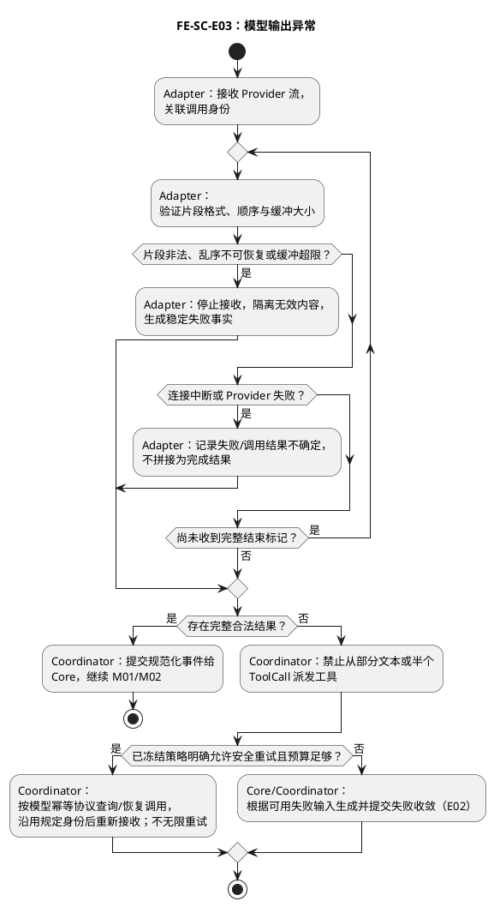

检查点：完整性检查属于 Adapter；21.7 首版模型调用幂等策略禁止自动重试。畸形、未闭合工具参数不得形成可派发 Proposal。

#### 6.7.12 FE-SC-E04：Deny、安全服务故障与 Permit 失效

入口：Proposal 等待授权或已提交动作准备派发。出口：合法授权进入工具边界，否则零派发并形成可审计处置。

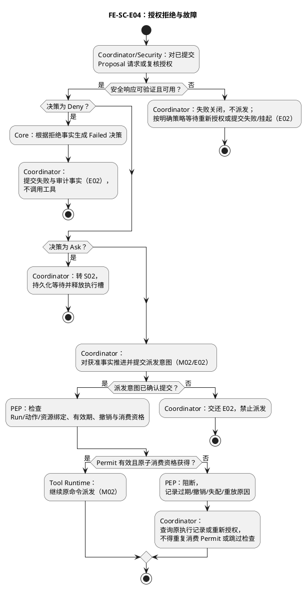

检查点：安全服务不可用时工具调用次数为零；消费 Permit 的并发/崩溃恢复归属安全与工具协议，单靠 Core 测试不能证明最多一次执行。

#### 6.7.13 FE-SC-E05：工具失败与副作用未知

入口：工具失败、超时或响应丢失。出口：已知结果正常归并、受控重试，或 UNKNOWN 挂起等待核对。

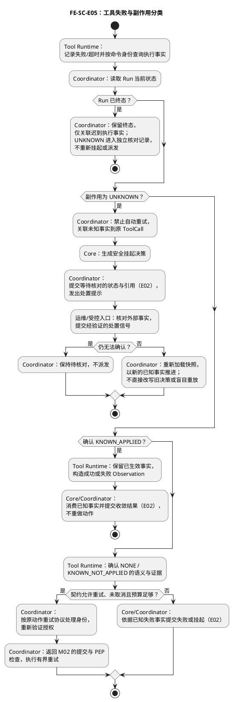

检查点：超时不自动归为未执行；UNKNOWN 分支的工具重放次数为零。NONE 不能仅由“没有收到响应”推断。

#### 6.7.14 FE-SC-E06：Deadline、上下文与预算超限

入口：组装输入、推进或派发前检查资源条件。出口：合法继续，或停止新增动作并按原因收敛。

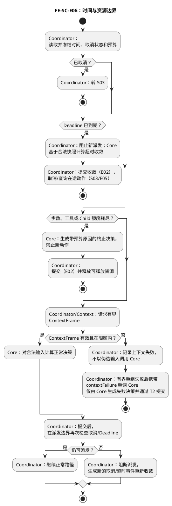

检查点：Core 内部不能读取实时钟，但派发边界必须复核；等待态提交后到期不能继续派发。限额等号语义须冻结后测试。

#### 6.7.15 FE-SC-E07：Host 崩溃后的事实恢复

入口：Host 重启并取得恢复资格。出口：从权威事实继续原命令/Run，或保持未知状态等待核对。

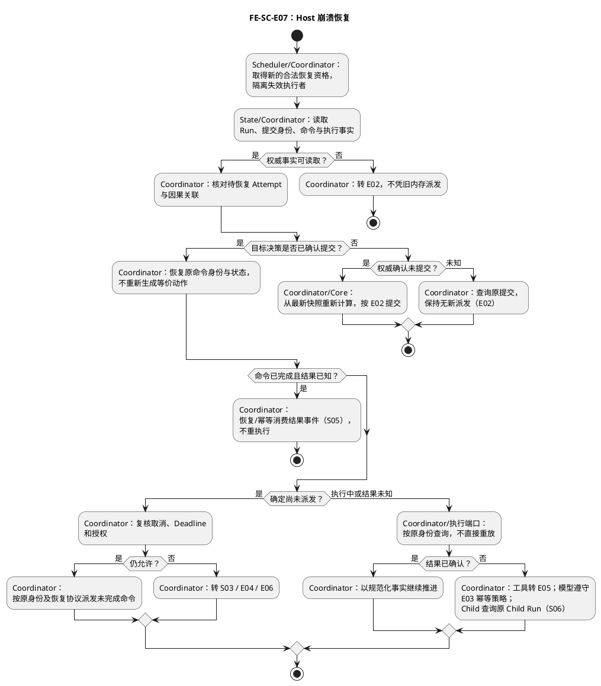

检查点：模拟重建实例只能验证逻辑恢复；进程终止、存储持久性与失效 Worker 写入隔离需真实 Adapter 测试。没有持久记录不能把命令视为确定未派发。

#### 6.7.16 FE-SC-E08：未知事件、非法迁移与旧 Attempt

入口：任一规范化事件待推进。出口：稳定拒绝/隔离、幂等忽略，或唯一合法迁移。

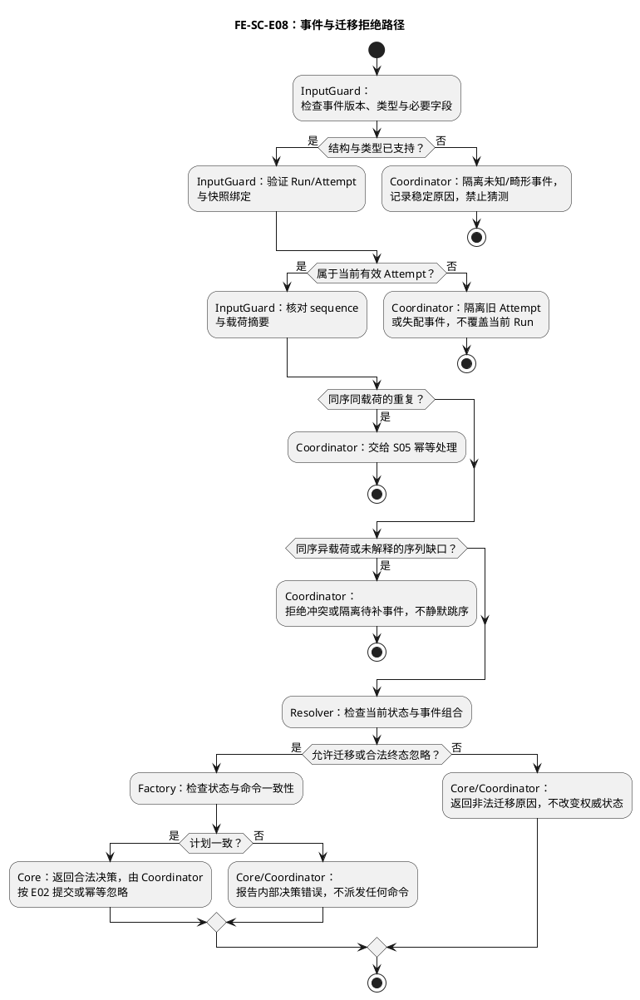

检查点：拒绝不能静默推进已消费序列；稳定原因记录不包含完整敏感载荷。Guard/Resolver 拒绝后不调用 Factory；Factory 拒绝后不调用派发端口。

#### 6.7.17 FE-SC-E09：非关键遥测不可用

入口：调用方输出运行遥测。出口：异步送达、有界缓存或计数丢弃；关键状态与安全审计走自己的可靠路径。

```plantuml
@startuml
skinparam defaultFontName Hiragino Sans GB
skinparam defaultFontSize 13
skinparam shadowing false
skinparam wrapWidth 230
title FE-SC-E09：非关键遥测故障
start
:Coordinator：形成脱敏运行记录;
if (属于必要状态/安全审计记录？) then (是)
  :调用方：走权威持久化与安全协议；失败按 E02/E04 处理;
  stop
endif
:遥测适配器：非阻塞尝试写入有界队列;
if (队列有容量？) then (是)
  :遥测适配器：入队，由独立消费者尝试发送;
else (否)
  :遥测适配器：按策略丢弃非关键记录并增加丢弃计数;
  :Coordinator：主流程继续，不等待遥测;
  stop
endif
:Coordinator：主流程继续，与发送结果解耦;
:遥测消费者：在独立超时与预算内发送;
if (发送成功？) then (是)
  :遥测消费者：释放队列占用;
else (否)
  if (重试、保留时间和容量均允许？) then (是)
    :遥测消费者：有界退避并重新排队，不递归调用 Core;
  else (否)
    :遥测消费者：丢弃并计数，不阻塞或回滚 Run;
  endif
endif
stop
@enduml
```

检查点：关闭 Collector 并压满队列，主流程仍能完成且内存受限；必要安全审计不能进入可丢弃队列。图中发送步骤属于独立消费者，不是主流程的同步等待。


## 7. 层内协作能力与接口

### 7.1 层内能力清单

| 能力 ID | 能力 | 提供方 | 使用方 | 同步性 | 失败语义 |
|---|---|---|---|---|---|
| `FE-IN-001` | 事件领取与确认 | Event Poller | Flow Coordinator | 异步 | 至少一次；Core 幂等 |
| `FE-IN-002` | 快照读取 | Snapshot Loader | Flow Coordinator | 异步 | 版本不一致则拒绝推进 |
| `FE-IN-003` | 上下文组装 | Context Client | Flow Coordinator | 异步 | 超预算返回稳定错误 |
| `FE-IN-004` | 纯推进 | FlowEngine Core | Flow Coordinator | 同步 | 非法迁移直接拒绝 |
| `FE-IN-005` | 输出规范化 | Output Parser | Flow Coordinator | 流式 | 非法片段隔离并审计 |
| `FE-IN-006` | 状态提交 | State Committer | Flow Coordinator | 异步 | CAS 冲突重载，不覆盖 |
| `FE-IN-007` | 动作拦截 | PEP Client | Action Coordinator | 异步 | 决策不可用时失败关闭 |
| `FE-IN-008` | 工具派发 | Tool Router Client | Action Coordinator | 异步 | 返回已知/未知副作用分类 |

### 7.2 开发接口约定

FlowAdvancePort 的完整签名与联合返回见21.3，StateCommitPort见21.6，其他门面请求/返回和权威提供方见21.8。接口统一遵守1.0.0协议版本、冻结执行信封、不透明资源引用、21.5幂等算法与21.9大小/时间限制。同步纯Core预期错误为reject；外部端口传输失败为TransportError，不混同领域失败事件。所有查询必须区分不存在、已过期与不可用，不能以null代替服务故障。

quarantineHead、ensureRunnable、claim/renew/takeover、IncidentResolutionPort属于RunRegistry/恢复用例的受控门面，状态与副作用语义见21.2、21.6—21.8.1；不能以任意Repository patch替代。

## 8. 调用方跨层协作接口

本节描述 L1 调用方处理 `AdvanceDecision` 时使用的跨层 Port，不是 FlowEngine 的出站接口。FlowEngine 自身的唯一接口仍是入站 `FlowAdvancePort`。

### 8.1 层间接口矩阵

| 边界 ID      | 方向                  | 逻辑接口                     | 用途                       | 调用方可见内容                                                   | 禁止泄漏                  |
| ---------- | ------------------- | ------------------------ | ------------------------ | --------------------------------------------------------- | --------------------- |
| `FE-X-001` | L1 调用方 → FlowEngine | `FlowAdvancePort`        | 对不可变输入执行一次纯推进            | Run/Session 快照、ContextFrame、RuntimeEvent、OperationContext | Provider 原生类型或可变聚合对象  |
| `FE-X-002` | L1 调用方 → Context 层  | `ContextAssemblyPort`    | 获取有界 ContextFrame        | 冻结快照引用、预算                                                 | 长期记忆底层结构              |
| `FE-X-003` | L1 调用方 → 认知层        | `ModelInvocationPort`    | 发起模型调用并接收规范化事件           | Prompt 投影、模型约束                                            | Provider SDK 私有类型、Key |
| `FE-X-004` | L1 调用方 → 安全层        | `PermissionDecisionPort` | 对 ActionProposal 请求决策    | 动作摘要、资源 Ref、授权快照 Ref                                      | RBAC、组织策略内部模型         |
| `FE-X-005` | L1 调用方 → 工具层        | `ToolDispatchPort`       | 携带 Permit 派发动作           | Tool Ref、参数 Artifact Ref、Permit Ref                       | Provider/Sandbox 私有类型 |
| `FE-X-006` | L1 调用方 → 数据层        | `StateCommitPort`        | 版本化提交推进结果                | CommitIntent、expectedVersion                              | 数据库连接和 DDL            |
| `FE-X-007` | L1 调用方 → 子 Run 层    | `ChildRunPort`           | 创建、Join、Cancel Child Run | 约束子集、预算、Deadline                                          | Multi-agent 业务角色和仲裁   |
| `FE-X-008` | L1 调用方 → 运维层        | `ObservabilityPort`      | 输出脱敏事实                   | OperationContext、事件摘要                                     | Prompt、Key、完整工具参数     |

### 8.2 接口通用信封

| 字段 | 必需 | 约束 |
|---|---:|---|
| `requestId` | 是 | 单次请求唯一 |
| `idempotencyKey` | 写操作是 | 相同键异载荷必须冲突 |
| `runRef` | 是 | 稳定引用，不携带可变对象 |
| `attemptRef` | 按场景 | 必须属于 runRef |
| `sequence` | 事件是 | 单 Run 或 Attempt 内严格递增 |
| `expectedVersion` | 状态提交是 | 不匹配时拒绝覆盖 |
| `deadline` | 是 | UTC 时间点 |
| `timeContext` | 是 | 明确 IANA 时区语义 |
| `traceId` / `correlationId` / `causationId` | 是 | 全链路传播 |
| `payloadDigest` | 幂等操作是 | 用于重复载荷一致性校验 |

### 8.3 错误码模板

| 错误码 | 触发条件 | 可重试 | Core 行为 | 运维行为 |
|---|---|---:|---|---|
| `FLOW_INVALID_TRANSITION` | 输入事件不允许当前状态处理 | 否 | 拒绝推进 | 记录错误与输入摘要 |
| `FLOW_STALE_SNAPSHOT` | expectedVersion 冲突 | 是 | 重载后重新计算 | 统计冲突率 |
| `FLOW_DEADLINE_EXCEEDED` | Deadline 到期 | 否 | 输出超时终止命令 | 记录耗时阶段 |
| `FLOW_CONTEXT_LIMIT_EXCEEDED` | Context 无法在预算内组装 | 策略决定 | 挂起或失败 | 记录预算维度 |
| `FLOW_PERMISSION_UNAVAILABLE` | 无法获得安全决策 | 条件性 | 失败关闭 | 安全告警 |
| `FLOW_PERMIT_INVALID` | Permit 过期、撤销、已消费或不匹配 | 否 | 禁止执行 | 安全审计 |
| `FLOW_TOOL_EFFECT_UNKNOWN` | 工具超时且无法确认副作用 | 否自动重试 | 安全挂起 | 人工处置告警 |
| `FLOW_EVENT_DUPLICATE` | 已消费 sequence 重投 | 不适用 | 幂等忽略 | 计数但不告警 |

## 9. 数据、一致性与幂等规格

### 9.1 快照一致性

RunRegistry 提供 run/session/event/priorReceipt 的一致读取视图，Session 使用 Run 冻结版本。Context 绑定该视图的 Run 版本、转录头和执行信封；不匹配必须重新组装。Run/Inbox/Outbox 的事务见 21.6；Session 内容、Artifact 发布和安全授权不加入 Run 事务。

### 9.2 CAS 提交

```text
load(version = N)
  -> advance(input@N)
  -> commit(expectedVersion = N, decisionDigest = D)
      -> success(version = N+1)
      -> conflict: discard decision, reload, recompute
```

### 9.3 幂等规则

| 对象/动作 | 幂等身份 | 同键同载荷 | 同键异载荷 |
|---|---|---|---|
| 输入事件 | (runId,eventId) 与 Run 级 sequence | 返回既有受理/消费收据 | FLOW_EVENT_CONFLICT |
| 模型调用 | commandId | 查询既有记录；UNKNOWN 不重发 | 执行端拒绝 |
| Proposal 权限请求 | RequestPermission.commandId | 返回原权限/审批记录 | 执行端拒绝 |
| Tool / Child 派发 | commandId | 返回原耐久受理/执行记录 | 执行端拒绝 |
| 状态提交 | decisionId | 返回原 commitId 与版本 | IDEMPOTENCY_CONFLICT |
| 审批/恢复事件 | (runId,eventId) 及原等待引用 | 忽略已提交重复 | FLOW_EVENT_CONFLICT |

具体字节算法、身份公式与保留期见 21.5；提交响应未知的屏障查询见 21.6。

### 9.4 未知副作用

定义 `NONE / KNOWN_NOT_APPLIED / KNOWN_APPLIED / UNKNOWN` 四类副作用事实。`UNKNOWN` 默认进入安全挂起，不自动重放工具调用。

## 10. 安全规格

### 10.1 安全不变量

- ActionProposal 不能直接到达 Tool Provider。
- 受保护动作必须携带与 Run、动作、资源、授权版本和有效期完全匹配的一次性 Permit。
- PEP 只执行判定结果，不拥有或修改 PDP 策略。
- PDP 不可用、响应不可验证或 Permit 状态未知时失败关闭。
- Child Run 的权限、预算、Deadline 和资源范围只能是 Parent 的子集。
- 日志、Trace、指标和错误不得包含 Secret、完整 Prompt、完整工具参数或长期记忆正文。

### 10.2 威胁与控制模板

| 威胁 ID | 威胁 | 攻击/故障路径 | 预防控制 | 检测控制 | 恢复控制 |
|---|---|---|---|---|---|
| `FE-SEC-001` | 绕过 PEP | Core/Router 直连 Provider | 依赖门禁、接口隔离 | 调用链审计 | 终止 Run |
| `FE-SEC-002` | Permit 重放 | 重复执行已授权动作 | 一次性消费、动作绑定 | Permit 消费冲突指标 | 安全挂起 |
| `FE-SEC-003` | 权限扩大 | Child/重试使用更宽快照 | 子集验证、冻结版本 | 授权版本审计 | 拒绝派发 |
| `FE-SEC-004` | 敏感数据泄漏 | 日志记录 Prompt/参数 | 结构化脱敏 | 泄漏扫描 | 删除与事件响应 |

## 11. SFMEA 分析

### 11.1 评分规则

| 维度 | 范围 | 说明 |
|---|---:|---|
| 严重度 `S` | 1-10 | 对安全、数据、业务连续性的影响 |
| 发生度 `O` | 1-10 | 在设计运行条件下的发生概率 |
| 探测度 `D` | 1-10 | 数值越高表示越难在影响前发现 |
| 风险优先数 `RPN` | `S × O × D` | 用于排序，不替代高严重度单项门禁 |

高严重度安全项即使 RPN 较低也必须有验证用例。评分阈值、责任人和关闭条件待评审冻结。

### 11.2 SFMEA 主表

| ID | 功能 | 失效模式 | 局部影响 | 系统影响 | 原因 | 现有预防/探测 | S | O | D | RPN | 建议措施 | 验证用例 | Owner | 状态 |
|---|---|---|---|---|---|---|---:|---:|---:|---:|---|---|---|---|
| `FE-FM-001` | 事件消费 | 重复投递导致重复推进 | 重复命令 | 重复模型费用或副作用 | ACK 丢失 | sequence + 幂等键 | 待评 | 待评 | 待评 | 待算 | 验证全链路去重 | `FE-TC-006` | 待定 | Open |
| `FE-FM-002` | 快照读取 | 混用不同版本快照 | 错误决策 | 状态污染或越权 | 非原子读取/缓存陈旧 | 版本组合校验 | 待评 | 待评 | 待评 | 待算 | 冻结快照集 ID | `FE-TC-007` | 待定 | Open |
| `FE-FM-003` | 状态提交 | CAS 冲突被覆盖 | 丢失更新 | Run 状态分叉 | 错误冲突处理 | expectedVersion | 10 | 待评 | 待评 | 待算 | 冲突后强制重算 | `FE-TC-008` | 待定 | Open |
| `FE-FM-004` | 模型流 | 半包/乱序/中断被当成完成 | 错误意图 | 错误工具调用 | Parser 缺陷 | 完整性与终止帧校验 | 待评 | 待评 | 待评 | 待算 | 模糊测试与断流注入 | `FE-TC-009` | 待定 | Open |
| `FE-FM-005` | 权限拦截 | PDP 不可用时默认放行 | 未授权动作 | 安全事件 | 错误降级策略 | 失败关闭 | 10 | 待评 | 待评 | 待算 | 强制 Deny/安全挂起 | `FE-TC-010` | 待定 | Open |
| `FE-FM-006` | Permit 校验 | 过期或已消费 Permit 被复用 | 重复动作 | 越权/重复副作用 | 竞态或重放 | 一次性消费 + CAS | 10 | 待评 | 待评 | 待算 | 并发消费测试 | `FE-TC-011` | 待定 | Open |
| `FE-FM-007` | 工具派发 | 超时后未知副作用被自动重试 | 重复物理动作 | 数据或财务损失 | 错误重试分类 | 副作用状态分类 | 10 | 待评 | 待评 | 待算 | UNKNOWN 强制挂起 | `FE-TC-012` | 待定 | Open |
| `FE-FM-008` | 取消 | 取消后仍生成新动作 | 孤儿操作 | 资源泄漏/未授权后续动作 | 取消检查时序错误 | 每个执行点检查 | 9 | 待评 | 待评 | 待算 | 级联取消栅栏 | `FE-TC-013` | 待定 | Open |
| `FE-FM-009` | 资源控制 | 队列或上下文无界增长 | 内存耗尽 | Host 不可用 | 缺少硬上限 | 有界队列/预算 | 8 | 待评 | 待评 | 待算 | 压测与拒绝策略 | `FE-TC-014` | 待定 | Open |
| `FE-FM-010` | 可观测性 | Telemetry 阻塞主流程 | 推进超时 | 系统雪崩 | 同步上报 | 有界缓冲/丢弃策略 | 7 | 待评 | 待评 | 待算 | 故障注入 | `FE-TC-015` | 待定 | Open |

| `FE-FM-011` | 提交恢复 | absent后旧事务迟提交 | 重复决策 | 重复派发 | 未失效旧claim | 权威事务屏障 | 10 | 待评 | 待评 | 待算 | 双屏障竞态注入 | `FE-TC-026` | 待定 | Open |
| `FE-FM-012` | 授权恢复 | 接管丢审批或自签授权 | 永久挂起/误放行 | 越权 | 来源迁移错误 | 安全端权威重签 | 10 | 待评 | 待评 | 待算 | 接管与撤销交错 | `FE-TC-027` | 待定 | Open |
| `FE-FM-013` | 首次执行 | 消费后过期或并发启动 | 非法/重复执行 | 重复副作用 | 缺少启动校验 | authorizeStart与STARTED CAS | 10 | 待评 | 待评 | 待算 | 过期与双Worker注入 | `FE-TC-028` | 待定 | Open |
| `FE-FM-014` | 终态核对 | incident无安全关闭路径 | 遗留未知事实 | 无法审计或误重启 | 终态与事实混写 | 独立核对CAS | 9 | 待评 | 待评 | 待算 | 幂等/矛盾/越权核对 | `FE-TC-029` | 待定 | Open |
| `FE-FM-015` | 调度与容量 | 丢提示或持久磁盘耗尽 | 停滞/写失败 | Host不可用 | 无扫描或保留区 | 周期扫描与配额保护 | 8 | 待评 | 待评 | 待算 | 无流量恢复及累积压测 | `FE-TC-030` | 待定 | Open |
| `FE-FM-016` | 转录与上下文 | 丢助手建议或直接patch失败状态 | 上下文不完整 | 错误模型轮次/状态 | 事实缺失/职责旁路 | 完整条目与contextFailure | 8 | 待评 | 待评 | 待算 | 工具/Child回放及查询故障 | `FE-TC-031` | 待定 | Open |

### 11.3 SFMEA 闭环规则

- 每个高风险失效模式必须绑定至少一个测试用例。
- 每个建议措施必须有 Owner、截止条件和剩余风险。
- 已关闭项保留原始评分和措施后的剩余评分。
- 无法检测的安全风险必须转化为预防性架构门禁。
- SFMEA 更新必须触发对应接口、不变量和测试清单复核。

## 12. 测试设计

### 12.1 测试分层

| 层级 | 目标 | 依赖策略 | 主要证据 |
|---|---|---|---|
| 纯函数单元测试 | 推进规则、状态迁移、命令生成 | 固定不可变输入 | 决策快照、性质测试 |
| 组件契约测试 | Port 请求/响应、错误与版本兼容 | Faux Adapter | 契约用例、Schema 校验 |
| 子系统集成测试 | Poller、Context、Committer、PEP、Router 协作 | 内存实现/故障桩 | 状态与事件轨迹 |
| 系统测试 | 完整 Run 正常与异常流程 | 受控本地环境 | 端到端审计轨迹 |
| 压力测试 | 队列、并发、上下文、流解析上限 | 合成负载 | 吞吐、延迟、资源曲线 |
| 混沌测试 | DB、MQ、PDP、LLM、Tool、Telemetry 故障 | 可重复故障注入 | 恢复时间、无旁路证明 |
| 安全测试 | Permit 重放、越权、注入、泄漏 | 恶意输入集合 | 拒绝、审计与无副作用证明 |

### 12.2 核心测试用例清单

| 用例 ID | 场景 | 前置条件 | 注入/输入 | 预期结果 | 关联风险 | 自动化级别 |
|---|---|---|---|---|---|---|
| `FE-TC-001` | 纯文本一次完成 | 有效 Run/Session 快照 | ModelCompleted(Text) | 生成完成命令且仅提交一次 | 基线 | 单元+集成 |
| `FE-TC-002` | 单次工具 ReAct | 有效权限与工具 | ToolCall → Observation | 返回下一轮并最终完成 | 基线 | 集成+系统 |
| `FE-TC-003` | 多轮工具循环 | 有界循环预算 | 多个 ToolCall | 顺序正确，预算耗尽时停止 | 资源风险 | 单元+系统 |
| `FE-TC-004` | Ask 后挂起恢复 | 外部审批可用 | Ask → Approved | 挂起释放槽，恢复不重放模型 | 权限风险 | 系统 |
| `FE-TC-005` | Deny | PDP 返回 Deny | ActionProposal | 不触发 Router，产生审计事实 | 安全风险 | 集成 |
| `FE-TC-006` | 重复 TaskEvent | 相同 sequence/digest | 同事件投递两次 | 第二次无新命令和副作用 | `FE-FM-001` | 集成 |
| `FE-TC-007` | 快照版本错配 | Run N、Session M+1 不兼容 | 推进请求 | 拒绝推进并重载 | `FE-FM-002` | 单元+集成 |
| `FE-TC-008` | CAS 冲突 | 两个推进并发提交 N | 并发 CommitIntent | 仅一个成功，另一个重算 | `FE-FM-003` | 集成 |
| `FE-TC-009` | 模型流断开/乱序 | 流解析中 | 丢帧、半包、重复帧 | 不生成未验证 ActionProposal | `FE-FM-004` | 契约+模糊 |
| `FE-TC-010` | PDP 不可用 | ActionProposal 待决 | 超时/坏签名 | 失败关闭，无工具调用 | `FE-FM-005` | 集成+混沌 |
| `FE-TC-011` | Permit 并发重放 | 一次性 Permit | 两个并发 Dispatch | 最多一次获得执行权 | `FE-FM-006` | 集成+安全 |
| `FE-TC-012` | 工具未知副作用 | 非幂等工具执行中 | 超时/连接断开 | Run 安全挂起，不自动重试 | `FE-FM-007` | 系统+混沌 |
| `FE-TC-013` | 取消级联 | 活动 Model/Tool/Child | CancelRequested | 停止新动作，Child 清理结果可追踪；未结束者有 incident，不宣称已撤销 | `FE-FM-008` | 系统 |
| `FE-TC-014` | 容量极限 | 队列/上下文接近上限 | 超额请求 | 稳定拒绝，无 OOM、无线程泄漏 | `FE-FM-009` | 压力 |
| `FE-TC-015` | Telemetry 中断 | 主流程运行中 | Collector 不可达 | 主流程不阻塞，按策略缓冲/丢弃 | `FE-FM-010` | 混沌 |
| `FE-TC-016` | Host 提交前崩溃 | 命令未提交 | 进程终止并重启 | 从旧版本安全重算 | 恢复风险 | 系统 |
| `FE-TC-017` | Host 提交后 ACK 前崩溃 | 状态已提交 | 进程终止并重启 | 识别原提交，不重复副作用 | 恢复风险 | 系统 |
| `FE-TC-018` | Deadline 到期 | 推进/外部调用进行中 | 时间推进 | 取消后终态一致、资源释放 | 时间风险 | 单元+系统 |
| `FE-TC-019` | 租户与 Session 绑定 | 两个租户各有合法用户、Session、Run | 合法请求与交叉引用请求交错 | 合法请求只使用本 Session；越权请求不读取受保护上下文、不调用模型；Core 拒绝输入绑定错配 | FE-SC-M01、FE-SC-S01、FE-SC-E01 | 契约+集成 |
| `FE-TC-020` | Guard 输入分类 | 冻结版本、已消费 sequence 与载荷摘要 | 未消费、合法重复、同序异载荷、旧 Attempt、未知事件 | 分类或稳定拒绝原因符合规则；拒绝分支无决策派发 | FE-SC-E08 | 单元 |
| `FE-TC-021` | Core 无状态与确定性 | 固定时间、预算、事件、不可变输入 A/B | 同实例按 A/B/A 调用，再用新实例调用 A | 两次 A 与新实例 A 的规范化结果相同，输入未变，B 不影响 A | FE-SC-S01 | 单元 |
| `FE-TC-022` | 迁移规则与终态封闭 | 独立评审的状态×事件期望表 | 合法迁移、非法组合、各终态迟到事件 | 状态与命令逐项匹配；终态不产生新动作；未声明组合不静默放行 | FE-SC-S05、FE-SC-E08 | 单元 |
| `FE-TC-023` | 时间与资源边界 | 固定 Deadline、步数/命令预算 | 到期前、恰好到期、到期后；限额前、等于限额、超限 | 到期或耗尽后无新动作；尚可执行时合法推进；UNKNOWN 不因剩余预算而重试 | FE-SC-S04、FE-SC-E06 | 单元+契约 |
| `FE-TC-024` | Factory 决策一致性 | 固定输入、合法或矛盾的 TransitionPlan | 终态附动作、超限命令、同内容不同字段顺序 | 非法计划拒绝；合法命令有稳定身份和因果关系；expectedVersion 等于输入 Run 版本；规范化 digest 稳定 | 决策完整性 | 单元 |
| `FE-TC-025` | Child 创建、Join 与约束 | Parent 有冻结预算、权限和 Deadline | 合法 Child、扩大约束、重复完成事件 | 合法子 Run 经端口协调；扩大约束拒绝；结果只关联原 Parent，重复结果不重复推进 | FE-SC-S06 | 契约+集成 |
| `FE-TC-026` | 提交与派发间隙 | 可查询的状态、命令与执行事实 | 读取失败、提交响应丢失、提交后派发前崩溃、派发后响应丢失 | 读失败不推进；未知提交先查询；旧决策不派发；未知工具结果不盲目重放 | FE-SC-E02、FE-SC-E07 | 集成+系统 |

### 12.3 单用例模板

```text
用例 ID：FE-TC-XXX
标题：
目标：
关联需求/不变量：
关联 SFMEA：
前置状态：
输入与故障注入：
执行步骤：
预期状态轨迹：
预期命令/事件：
禁止出现的副作用：
可观测性断言：
资源清理断言：
自动化层级：
```

### 12.4 性质与不变量测试

- 确定性：相同规范化输入得到相同 decision digest。
- 终态封闭：终态输入不能生成新的外部动作。
- 幂等：同一事件重复应用不增加命令或副作用次数。
- 单调序列：已提交 sequence 不回退、不跳过未解释事件。
- 权限安全：无有效 Permit 时工具派发次数恒为零。
- 资源有界：任意输入下命令数、上下文大小和 Child 数不超过硬上限。
- 取消收敛：取消栅栏生效后无新业务派发；在途动作在30秒清理窗口内获得完成/未执行/UNKNOWN的可追踪记录，UNKNOWN 保留独立 incident，不能要求不可撤销外部动作必然结束。

### 12.5 可测试性设计

可测试性要求实现提供可控输入和可观察结果，使错误能定位到输入校验、迁移规则、决策封装或调用方协调。下面是实现约束与计划验证方式；不是已存在的测试代码或覆盖率报告。

#### 12.5.1 内部类的独立验证边界

| 被测对象 | 如何构造输入 / 隔离依赖 | 关键断言 | 测试用例 |
|---|---|---|---|
| InputGuard | 直接传入冻结快照与规范化事件；只改变一个绑定、sequence 或摘要字段 | accepted/duplicate/rejected 及原因准确；输入不变；不依赖数据库或身份服务 | FE-TC-007、FE-TC-020 |
| TransitionResolver | 使用通过 Guard 的固定输入；状态×事件期望表独立于实现编写 | nextState、命令种类/数量、终态与取消优先级、UNKNOWN 挂起；非法组合明确拒绝 | FE-TC-022、FE-TC-023 |
| DecisionFactory | 直接传入合法计划及人为矛盾计划，不调用 Resolver 生成期望值 | expectedVersion、命令身份/顺序/因果关系、digest；终态附新动作等矛盾不能输出 | FE-TC-024 |
| FlowEngine.advance | 使用真实三个协作者，执行 A/B/A 与新实例 A；必要时用记录调用的替身验证短路 | accepted 才进入迁移，duplicate 与 rejected 均不进入 Resolver/Factory；完整输出稳定 | FE-TC-020、FE-TC-021 |
| Coordinator + Core | 使用真实 Core，替换所有外部 Port 为可控替身，记录调用顺序与参数 | CAS 成功前不派发；冲突后重载重算；无 Permit 不执行；输出始终绑定原 Run/Session | FE-TC-002、FE-TC-008、FE-TC-019、FE-TC-026 |

若内部协作者最终落为纯函数，沿用相同测试边界，不为测试强行增加生产端口。Core 的主要正确性测试使用真实规则，不能把三个协作者全部模拟后，仅验证 advance 调用了它们就宣称状态机正确。

#### 12.5.2 可控制的输入与故障点

| 控制点 | 测试机制 | 禁止依赖 |
|---|---|---|
| 时间、取消、预算 | 测试数据显式传入当前时间和限制；调用方使用可推进的假时钟与可手动触发的取消信号 | 真实等待、随机时机、全局热配置 |
| 快照与事件 | 数据构造器提供完整合法基线，按用例覆盖字段；递归冻结输入，调用后与原值比较 | 生产数据库、线上 Session 或敏感内容 |
| 模型与工具事件 | 端口替身按脚本返回成功、失败、重复、乱序或 UNKNOWN；固定请求/响应标识 | 真实模型 API、密钥或付费调用 |
| 并发提交 | 状态替身保留真实版本比较语义；用屏障让两个调用都读到 N，再允许提交 | 用 sleep 碰撞概率、总返回成功的假 CAS |
| 崩溃恢复 | 在读后、提交后、派发后设置暂停点；丢弃 Host/Engine 实例，保留模拟持久事实后重新装配 | 复用原实例内存冒充重启恢复 |
| 权限与派发 | 安全替身返回 Allow/Ask/Deny/不可用；工具替身记录 Permit、命令身份和执行事实 | 只检查 Proposal 数量就推断已授权或只执行一次 |

纯函数测试和替身集成测试可以离线运行；真实持久化与工具适配器的恢复能力仍需独立系统测试。Core 输出空命令只能证明没有生成新意图，不能证明调用方没有重复派发。

#### 12.5.3 具体可复现样例

以 `FE-TC-021` 为例：输入 A 固定为 `AwaitingTool@N + ObservationReceived`，未取消、未到期且预算允许；输入 B 属于另一 Run。先保存 A/B 的不可变副本，在同一 Engine 上执行 A、B、A，再创建新 Engine 执行 A。断言三份 A 决策的 nextState 均为 Ready、commands 均为空、expectedVersion 均为 N，规范化决策内容与 digest 一致，A/B 原输入均未变化。这里重算相同快照用于证明纯函数确定性，不模拟“事件已提交后的重复投递”；后者必须将已消费记录写入新快照再测试。

以 `FE-TC-008` 为例：两个 Coordinator 都读取 N，经屏障后计算决策；状态替身只允许一个 N 提交成功，另一方收到冲突。断言失败方旧命令的派发次数为零、随后读取 N+1 并重新调用 Core。不能只断言最终版本增加，还要检查调用方的派发记录，防止“状态正确但工具重复执行”。

#### 12.5.4 测试判定与尚待冻结的契约

预期值从本节场景及评审后的迁移表推导，不能调用生产 Resolver/Factory 来生成自己的测试答案。除 digest 比较外，必须分别断言状态、命令种类、数量、版本、身份绑定与禁止发生的副作用；单纯快照文件相同不足以证明行为正确。

第 21 章已给出 DTO/命令、审批恢复、终止优先级、等号时间语义与恢复记录。测试必须按 FE-CON-1 的确定预期实现，不得用宽松断言、跳过测试或仅检查不抛异常冒充通过。Core 单元用例、替身集成用例、真实系统验证分别记录结果，文档门禁保持未勾选，直到存在执行证据。

#### 12.5.5 可测试性支撑手段

下表中的工具名称是候选测试设施名，不是已有 API。测试设施装配在测试环境，生产代码只保留必要的显式输入和 Port 边界；Core 不增加测试开关、调试网络接口或故障注入分支。

| 手段 / 候选设施 | 接入位置与使用方法 | 产物与验收方式 |
|---|---|---|
| 测试数据构造器 `AdvanceInputFixture` | 在测试目录提供最小合法输入；显式覆盖 Run、Attempt、版本、事件、时间和预算。合法构造与恶意输入构造分开，防止自动修正待测错误 | 每个失败用例保存完整合成输入；替换单一字段即可复现 Guard 拒绝，合法基线可稳定推进 |
| 不可变性检查 | 调用前递归冻结输入并保留深拷贝；调用后比较。对 Map/Set 等可变容器须另行限制或检测，不能只依赖 Object.freeze | 发现嵌套字段修改即失败；共享实例 A/B/A 不留下跨 Run 状态 |
| 假时钟与可控取消 `ManualClock` | 注入 Coordinator 的时间端口；Core 只接收冻结时间。取消信号由测试主动触发，定时器与假时钟使用同一时间基准 | 不等待真实 Deadline，精确验证到期前、等于、超过，以及取消发生在提交前/后时的差异 |
| 脚本化端口替身 `ScriptedPorts` | 在装配处替换模型、安全、工具、Context 端口，声明按序响应、失败或暂停；未声明调用立即使测试失败 | 输出实际调用参数与响应序列；能稳定制造 Ask、Deny、断流、超限和 UNKNOWN |
| 带版本的内存状态替身 `VersionedStateFake` | 替换状态端口，保留版本比较、命令身份、重复同载荷与异载荷冲突语义；重建 Coordinator 时不清空模拟持久事实 | 并发 N 提交仅一个成功，响应丢失后可查询原提交；同一契约套件还需针对真实状态 Adapter 执行 |
| 并发屏障 `CommitBarrier` | 在状态/工具端口替身中暂停指定操作，由测试逐个释放，不靠 sleep 或 CPU 调度碰撞 | 固定复现双读 N、取消与派发竞态；记录释放顺序，并为测试设置超时防止死等 |
| 故障注入脚本 `FaultScript` | 在端口包装器中分别控制“操作前失败”和“操作已生效但响应丢失”；按命令身份和调用次数定位 | 一条脚本稳定命中一个失败窗口；报告明确操作是否生效，避免把所有超时都当作未执行 |
| 端口调用记录器 `PortCallRecorder` | 包装外部端口，记录逻辑顺序、Run/Attempt、命令身份、提交结果、派发请求、执行事实 | 可断言提交成功先于派发、拒绝后零派发；区分请求次数与工具实际生效次数 |
| 离线事件回放器 `FlowReplay` | 读取固定版本的输入序列、时间、配置与预期决策，调用真实 Core；需要协调验证时接入 ScriptedPorts | 相同回放得到相同规范化决策；首次偏离时输出状态、命令和版本差异；离线运行不连接真实 Provider |
| 状态迁移覆盖表 | 从独立评审的状态×事件表生成参数化测试，标记合法迁移、拒绝组合、终态及优先级分支 | 每个已冻结分支都有具名用例；报告未覆盖或待契约项，不能只报代码行覆盖率 |
| 性质测试与失败序列缩减 | 在合法身份/版本约束下生成有界事件序列，同时单独生成非法输入；使用固定随机种子，失败后缩减事件数和载荷 | 验证终态封闭、确定性、资源有界等性质；保留种子与最小反例，转换成固定回归用例 |
| 变异测试 | 在隔离测试副本中临时移除版本校验、颠倒 Deadline 比较或允许 UNKNOWN 重试，确认现有用例能发现错误 | 应违反不变量的变异必须使测试失败；存活变异逐个分析，不通过降低阈值掩盖无效断言 |
| 依赖边界检查 | 静态检查 Core 的直接与传递依赖，结合受限测试运行环境阻止网络/文件写入；测试时排除真实密钥与 Provider 配置 | 非法 I/O 依赖或实际越界调用使检查失败；不只用搜索某个 SDK 名称证明无副作用 |

数据构造、不可变输入、时间控制、端口替身、调用记录及迁移用例属于基础手段。CAS 屏障和故障注入是并发/恢复验收的必要手段。性质测试与变异测试用于增强验证，不替代具名场景测试；具体工具与执行预算在实现阶段确定。

#### 12.5.6 故障脚本示例：提交已成功但响应丢失

以下是测试脚本的描述格式，不是可直接执行的接口：

```text
用例：FE-TC-026 / commit-response-lost
准备：Run R1@N；模型端口禁止一切未声明调用；记录器开启
注入：第一次提交先持久化 N+1 与命令身份 D1，再向调用方返回超时
暂停：停在超时处理之后、任何重试派发之前
检查：调用方不能把超时直接解释为 CAS 冲突；不能重新生成另一个派发身份
恢复：允许查询 D1；状态端口返回已提交及命令执行记录
分支一：明确尚未派发 -> 按恢复协议处理原命令，沿用 D1
分支二：派发结果 UNKNOWN -> 禁止盲目重放，转入核对/挂起流程
断言：旧版本未覆盖；无新身份重复派发；查询与恢复动作可从记录器重建
清理：释放所有屏障，关闭替身，确认无残留任务或计时器
```

每个失败窗口分别建用例：提交前失败、提交成功但响应丢失、提交后派发前退出、派发已生效但响应丢失。不能用一个“抛出超时”的替身代替这四种不同事实。恢复规则以 21.6—21.7 为准，必须测试查询 absent 后旧提交仍可能完成的窗口；不能仅凭查询结果直接重算。

#### 12.5.6a 评审补充的故障验收分支

以下每条均在可控替身与真实持久化 Adapter 契约中验证，验收记录包含屏障释放顺序，不能仅验证最终状态。

| 用例 | 注入与步骤 | 必须断言 |
|---|---|---|
| FE-TC-026 / absent-before-late-commit | 旧提交暂停在事务写入前→调用超时→query返回absent；分别释放旧提交优先、claim失效屏障优先两个分支 | 首次absent后零重算/派发；旧提交先成功则恢复原commandId；claim先失效则旧提交被拒，仅权威屏障后确认absent才重算 |
| FE-TC-013 / uncancellable-effect | 工具/Child已受理且不响应取消→取消栅栏→推进时钟30秒 | 栅栏后新业务受理为零；本地可释放资源释放；未完成在途动作保留耐久commandId、incident及核对入口，不伪称物理动作已停止 |
| FE-TC-027 / security-replay | ApprovalResolved已耐久受理但未消费→接管并supersede→安全端查询重签→再撤销权限重复测试 | recovery自签approved被拒；安全端按当前Attempt稳定去重；审批事实只消费一次；撤销后不产生DispatchTool |
| FE-TC-028 / permit-expired-before-start | Permit消费到AUTHORIZED→Permit到期而Run未到期→恢复；另测两个Worker竞争STARTED | 到期后零startGrant/Provider调用；有效Permit竞争时仅一次STARTED获胜与Provider调用；STARTED崩溃不自动重执行 |
| FE-TC-029 / terminal-incident | UNKNOWN→取消终态→提交可信核对证据→重复/矛盾证据/越权分别提交 | 原Run终态和version不变；同证据幂等、矛盾冲突、越权拒绝；只更新incident与执行事实 |
| FE-TC-030 / scan-and-capacity | 无新流量丢提示；审批挂起重启至Deadline；多批完成Run与open incident累积到80%/90%容量 | 扫描5秒内发现可推进/到期事实；wake唯一；80%告警、90%拒绝新业务；保留已受理结果/取消/核对写入，不删除open incident |
| FE-TC-031 / transcript-context | 模型tools/child完整助手消息→结果→重建Context；另注入Context连续查询失败 | 完整助手建议先于对应结果且不重复；Context失败通过原事件的Core决策/T2进入Failed，Coordinator无直接patch |

以上新增用例关联FE-SC-E01/E03/E06/E07/E08/E09及S02/S03/S05/S06；对应FE-FM-008及FE-FM-011—016，冻结验收时补评分、Owner及执行证据，本次状态均为待实现、待执行。

#### 12.5.7 回放材料与诊断证据

一次失败至少保留：用例/场景 ID、代码与契约版本、测试配置、随机种子（如使用）、完整合成输入或可恢复的测试资源引用、规范化事件顺序、故障位置、屏障释放顺序、期望/实际决策，以及端口调用和执行事实记录。digest 用于核对一致性，不能代替重建输入所需的数据。

回放分两种：单次纯计算回放固定 AdvanceInput；多步协调回放还必须固定状态提交结果和外部事件脚本。生产日志默认只有脱敏摘要，不能宣称仅凭摘要即可完整回放；优先使用合成数据，必要的受控诊断材料另行执行访问和保留策略。若脱敏改变参与 digest 的内容，应建立明确的合成回放基线，不再与原始 digest 强行比较。

#### 12.5.8 落地与验收检查

- 能在无数据库、无真实模型服务条件下执行 Guard、Resolver、Factory 和完整 Core 的测试；失败原因可定位到具体职责。
- 能通过测试输入或端口替身控制时间、取消、事件顺序和提交结果，无需修改生产逻辑中的常量或增加 testMode 分支。
- 同一故障脚本重复执行，触发位置和结论一致；失败保留最小可回放材料，不能依赖再次随机碰撞。
- 调用记录同时证明允许的行为发生、禁止的行为未发生；“无异常返回”不作为正确性标准。
- 替身与真实 Adapter 共用适用的端口契约用例，分别报告结果；模拟重建实例不代替真实进程崩溃与存储恢复测试。
- 报告区分已覆盖、未覆盖、待契约和已执行失败；后续接入检查流程时，关键不变量失败必须阻断验收。本次仅补充设计，不代表测试设施或 CI 门禁已建立。

## 13. 非功能规格

### 13.1 性能与容量

首版本地档案：Core推进CPU P99≤10ms、单次额外内存≤8MiB；并发默认4、硬上限16；提示队列默认256、硬上限4096；每Run模型轮次16、工具32、Child2、深度1；上下文默认1MiB、最多8个工具建议/轮。测试负载、输入上限、配置范围及10GiB持久存储保护按21.9与21.8.1执行。以上为验收目标，不是已测指标。

### 13.2 可用性与恢复

- 定义本地单 Host 档案和多 Worker 档案各自的恢复目标。
- 明确可安全自动重试、必须重算、必须人工介入三类故障。
- FlowEngine 重启不得依赖进程内状态恢复 Run。
- 所有临时资源必须在完成、失败、取消和超时路径释放。

### 13.3 兼容性

- 定义 `AdvanceInput`、`RuntimeEvent`、`EngineCommand` 的版本策略。
- 未知必需字段或未知命令类型必须拒绝，不得静默忽略。
- Provider、PDP、工具和存储差异只能由边界 Adapter 吸收。

## 14. 可观测性规格

### 14.1 结构化事件

记录 advance.started/decided、commit.conflicted、permission.blocked、run.suspended、recovery.scanned、incident.resolved。普通字段白名单：事件种类、封闭error code/phase、版本、计数、durationMs；run/attempt/command引用仅进入受控诊断日志。不得记录Prompt、参数、资源路径、Permit内容、action/payload digest；traceparent只用于受控追踪上下文传播，不能作为日志载荷或指标标签任意扩展。字段与权限按21.9执行。

### 14.2 指标

- flow_advance_duration_seconds、flow_advance_total：标签phase/result。
- flow_commit_conflict_total、flow_permission_result_total：标签code/result。
- flow_tool_effect_unknown_total、flow_incident_open、flow_telemetry_dropped_total：标签phase/code。
- flow_queue_depth、flow_active_runs、flow_suspended_runs、flow_durable_bytes、flow_scan_lag_seconds：标签phase。

只使用封闭集合标签，禁止runId、tenantId、toolName、commandId、digest及任意原因文本造成高基数或泄漏。

### 14.3 告警与处置

21.9定义UNKNOWN、权限旁路、冲突率、队列和遥测丢失的明确阈值；21.8.1定义磁盘与耐久容量的80%/90%门槛。UNKNOWN保留incident并阻止对应命令重放，权限旁路立即阻断，存储保护阻止新Run/业务派发。告警通知属于运维部署配置，不影响安全关闭条件；告警渠道不可用仍保留耐久incident供扫描。

## 15. 配置规格

配置类型、默认值、硬范围、时间与存储阈值集中定义于21.9、21.8.1，避免维护两套数值。全部配置在启动时校验、以configVersion冻结到新Run；活动Run不热更新额度。数值必须符合21.1安全整数约束；maxInputTokens+outputReserveTokens不能超过冻结模型窗口；RunBudget不得高于本地档案上限，Child不得高于Parent剩余额度。

模型/工具自动重试固定为0，不提供首版可切换的宽松开关；commit/query重试最多3次（硬上限5）、claim为30秒且每10秒续期、清理窗口30秒。配置缺失、越界、矛盾时启动失败，不使用宽松兜底。

## 16. 部署与运行档案

### 16.1 Local-first 最小档案

```text
一个 KernelHost 进程
  + 一个 FlowEngine Core 实例
  + 一个有界任务队列
  + 若干异步执行槽
  + 本地状态 Adapter
  + 外部或本地模型/工具 Adapter
```

### 16.2 扩展档案待设计项

- 多 Worker 时的 Lease/Fence 与旧 Worker 写入隔离；
- Event Bus 位点、重新平衡与重复投递语义；
- 跨进程模型流与背压；
- PDP、Tool Provider 和状态存储的独立故障域；
- 扩展档案不得改变 FlowEngine Core 的输入输出语义。

## 17. 实现约束与依赖规则

- Core 只能依赖领域值对象和 Port 抽象。
- Core 不导入数据库、消息总线、HTTP、模型 SDK、OPA、MCP 或沙箱实现。
- Parser 的 Provider 私有逻辑必须留在 Adapter 一侧。
- 所有外部写操作都必须经过显式 Port、幂等和权限检查。
- 同层组件不得通过共享可变对象交换 Run/Session 状态。
- 具体 Adapter 只在 Composition Root 装配。
- 不允许 KernelHost 装配边界成为跨聚合大事务边界。

## 18. 设计评审门禁

### 18.1 阶段一：职责与边界

- [x] KernelHost 装配边界与 FlowEngine 已明确区分。
- [ ] 每个组件只有一个权威职责和数据所有者。
- [ ] 业务 Workflow、身份、权限策略和物理副作用没有进入 Core。
- [ ] 同层和层间依赖方向无循环、无旁路。

### 18.2 阶段二：接口与规格

- [ ] 所有层内/层间接口有调用方、实现方、DTO、错误和版本策略。
- [ ] 幂等、CAS、Deadline、取消和背压语义闭合。
- [ ] 稳定错误码与可重试分类完整。

### 18.3 阶段三：生命周期与韧性

- [ ] 正常、挂起、恢复、取消、超时和崩溃轨迹闭合。
- [ ] 未知副作用没有自动重试路径。
- [ ] 重启不依赖 FlowEngine 进程内状态。

### 18.4 阶段四：安全与 SFMEA

- [ ] 无 Permit 工具派发路径为零。
- [ ] PDP 故障默认失败关闭。
- [ ] 高严重度 SFMEA 项均有预防控制和自动化用例。
- [ ] 日志、Trace、指标和诊断包通过敏感数据检查。

### 18.5 阶段五：测试与实现授权

- [ ] 测试用例覆盖正常流、异常流、压力、混沌和安全场景。
- [ ] 性能与容量阈值已量化。
- [ ] 所有待确认决策已关闭或明确延期。
- [ ] 架构评审明确批准后，才拆分代码实现任务。

## 19. 决策与开发结论

| ID | 问题 | 本轮开发结论 | 状态 |
|---|---|---|---|
| FE-Q-005 | 短租约与读写者 | 旁观者不领取；本地执行 claim 为 30秒/10秒续期，接管增加 fence 并创建新 Attempt；不引入分布式租约服务，细节见 21.7 | 方案已具体化，待本轮评审 |
| FE-Q-006 | 模型调用幂等 | 首版自动重试=0；已提交命令沿用原身份查询，发送/结果未知挂起核对，不能重发，见 21.7 | 方案已具体化，待本轮评审 |

保留此前读写者区分：旁观者依赖底层一致读取；调度者需要显式短时执行资格，以防重复派发并识别崩溃接管。这里对首版增加了可编码的字段与时间，尚不表示生产已经验证。

多 Worker、跨机 Lease、Provider checkpoint、安全自动重试不属于首版，不得静默开启；启用前需独立变更评审。

## 20. 附录模板

### 20.1 接口详细定义

```text
接口 ID：
接口名称：
责任边界：
调用方：
实现方：
请求：
响应：
不变量：
幂等与并发：
超时与取消：
错误码：
可观测性：
安全分类：
兼容策略：
```

### 20.2 后续时序细化

第 6.7 节已覆盖全部 17 个场景的流程与恢复分支。流程图不替代消息级时序协议；后续接口冻结时，可继续细化以下时序：

- 纯文本完成；
- ToolCall Allow；
- ToolCall Ask/Resume；
- ToolCall Deny；
- CAS 冲突；
- 模型流中断；
- 工具未知副作用；
- 取消与 Child Run 级联；
- Host 崩溃恢复。

### 20.3 术语表

| 术语 | 本文定义 | 禁止混用概念 |
|---|---|---|
| KernelHost 装配边界 | 跨层组件的进程内装配和命令协调范围 | 单一领域对象、架构层或事务 |
| FlowEngine | 无状态推进算法 | Scheduler、Repository、Tool Runtime |
| RuntimeEvent | 已规范化的推进输入事件 | Provider 原生事件 |
| EngineCommand | 推进算法输出的动作意图 | 已发生的物理副作用 |
| ActionProposal | 等待权限判断的动作候选 | ExecutionPermit |
| Observation | 工具结果的规范化事实 | Provider 原生响应 |
| Snapshot | 带版本的不可变读取视图 | 共享可变 Session 对象 |

## 21. 首版开发数据契约（FE-CON-1）

本章把前文候选结构具体化为首版可实施契约；版本为 `1.0.0`，仍须经过本轮五角色评审与架构批准才成为发布基线。本章字段名用于新 FlowEngine 设计，不宣称现有 `RunFlow` 或同名旧 DTO 已具备这些能力。前文图中的简写通过本章映射，不允许开发者另选恢复或错误语义。

### 21.1 类型、边界与序列化

已迁入[项目级契约](../../../contracts/flow-engine-contract-v1.md#211-类型边界与序列化)；此处保留旧节号导航，不再维护定义副本。

### 21.2 规范化事件与接收规则

已迁入[项目级契约](../../../contracts/flow-engine-contract-v1.md#212-规范化事件与接收规则)；此处保留旧节号导航，不再维护定义副本。

### 21.3 推进结果、命令与错误

已迁入[项目级契约](../../../contracts/flow-engine-contract-v1.md#213-推进结果命令与错误)；此处保留旧节号导航，不再维护定义副本。

### 21.4 完整推进规则与优先级

已迁入[项目级契约](../../../contracts/flow-engine-contract-v1.md#214-完整推进规则与优先级)；此处保留旧节号导航，不再维护定义副本。

### 21.5 确定性 ID、摘要与幂等范围

已迁入[项目级契约](../../../contracts/flow-engine-contract-v1.md#215-确定性-id摘要与幂等范围)；此处保留旧节号导航，不再维护定义副本。

### 21.6 RunRegistry 事务与执行记录

已迁入[项目级契约](../../../contracts/flow-engine-contract-v1.md#216-runregistry-事务与执行记录)；此处保留旧节号导航，不再维护定义副本。

### 21.7 租约、模型幂等与恢复决策

已迁入[项目级契约](../../../contracts/flow-engine-contract-v1.md#217-租约模型幂等与恢复决策)；此处保留旧节号导航，不再维护定义副本。

### 21.8 端口数据与安全职责分配

已迁入[项目级契约](../../../contracts/flow-engine-contract-v1.md#218-端口数据与安全职责分配)；此处保留旧节号导航，不再维护定义副本。

### 21.8.1 五角色评审后的补充协议

已迁入[项目级契约](../../../contracts/flow-engine-contract-v1.md#2181-五角色评审后的补充协议)；此处保留旧节号导航，不再维护定义副本。

### 21.9 首版限额、可观测性与验收数据

已迁入[项目级契约](../../../contracts/flow-engine-contract-v1.md#219-首版限额可观测性与验收数据)；此处保留旧节号导航，不再维护定义副本。

### 21.10 开发映射与验收门槛

建议新实现目录为 `src/control/flow-engine/`：input-guard.ts、transition-resolver.ts、decision-factory.ts、flow-engine.ts；契约放 `src/contracts/flow-engine.ts`。上述契约和四个Core类已于2026-09-07按用户指令实现；另有input-schema.ts与canonical.ts负责封闭结构和确定性编码。当前提供独立FlowEngine入口，未接入AgentSystem。后续将现有RunFlow.run的端口I/O与取消传播移交Coordinator；现有 Adapter/Context/Tool/Delegation 通过门面接入，不把旧有可变循环状态带进 Core。Composition Root 装配一次无状态 Core，可被多个 Run 使用。

开发次序：① 类型与输入验证、规范化摘要向量；② 完整迁移表与纯 Core；③ RunRegistry Inbox/Outbox/CAS、claim 与命令查询；④ PEP/执行端耐久受理与取消；⑤ 接通 M01/M02、故障恢复与运维门禁。每阶段用对应契约测试验收。用户已授权先开展可独立开发部分，当前完成①②的首版代码及纯Core验证；③—⑤仍为待实现，不替换现有RunFlow。

| 验收向量 | 输入重点 | 精确预期 |
|---|---|---|
| V1 正常开始 | Ready，version=7，consumedSequence=10，event sequence=11 AdvanceRequested，context 合法，usage.turnsReserved=0，预算=16 | advance；AwaitingModel；usage.turnsReserved=1；1 条 InvokeModel；expectedVersion=7；T2 后 version=8、consumedSequence=11 |
| V2 工具结果 | AwaitingTool，首 Proposal=P1，usage.toolsReserved=1，ToolObserved(success,KNOWN_APPLIED,resultRef) 与当前命令匹配 | advance；Ready；移除 P1，追加 resultRef；空 commands；工具用量仍为1；需要提交 |
| V3 已提交重复 | V2 已提交后的新快照，重复原 eventId/sequence/payloadDigest 且 priorReceipt 匹配 | ignore duplicate；existingCommitId 为原值；不调用 Factory、不提交、不增加版本 |
| V4 无上下文但取消 | 非终态，context=null，cancellationRequested=true，合法下一个事件 | advance；Cancelled(requested)；仅 CancelOutstanding；无需调用 Context |
| V5 恰好到期 | 未取消，nowMs=operation.deadlineAtMs，合法下一个事件 | advance；Cancelled(deadline)；零业务命令；清理窗口30秒 |
| V6 审批通过 | Suspended(approvalRef=A,proposalId=P)，合法 ApprovalResolved(A,P,true) | AwaitingPermission；新 RequestPermission 针对原 P；无 InvokeModel，无工具用量增加 |
| V7 工具未知 | AwaitingTool，合法 ToolObserved(failed,UNKNOWN,null) | Suspended(tool_unknown)；1 条 RequestReconciliation；不重放 DispatchTool |
| V8 同序异载荷 | consumedSequence >= event.sequence，receipt 的摘要不同 | reject FLOW_EVENT_CONFLICT；零状态写入与派发 |

验收必须提交上述完整 JSON fixture（字段按类型补齐，不使用生产数据）、期望输出和 FE-C14N-1 摘要固定值；工具、真实持久化与恢复性能需额外证据，不能用文档或纯单元测试宣称闭环。设计评审完成后，测试缺失应体现为实现任务未完成，而不是继续留下未定义的行为选择。

### 21.11 随附数据向量与校验说明

同目录 `flow-engine-contract-v1.examples.json` 提供V1—V8的完整AdvanceInput与精确AdvanceResult，并附FE-C14N-1字节串/固定SHA-256向量。数据状态标为design-expectations-not-runtime-test-results；预期状态按21.4独立构造，摘要按21.5计算，不从生产Resolver获取答案。临时抽取本章TypeScript类型，并用satisfies检查输入/输出结构；类型检查和摘要复算不等于已实现Core测试。开发时必须将这些固定数据用于实际实现的契约验收。


### 21.12 首次实现记录（2026-09-07）

纯Core已落地，包入口导出FlowEngine、FlowAdvanceInput、FlowAdvanceResult、FlowAdvancePort；StateCommitPort仅落类型定义。内部Resolution为TransitionPlan或reject，Factory.create为AdvanceResult，确保预期错误使用返回值而非领域异常。InputCheck为accepted(input)或short_circuit(ignore/reject)，对应图中短路职责。

AK-FE-001—014已登记到docs/verification/acceptance.json，覆盖8个固定完整期望、6组规范化向量、输入拒绝、不可变性、121个状态×事件组合、取消/超时、预算、审批/UNKNOWN恢复与Factory矛盾计划。新增解析保护为64层、100000节点、2MiB；拒绝访问器和非JSON对象。上述保护不会扩大21.9的Run额度。

当前运行边界仍未实现：真实T1/T2/CAS、claim、Inbox/Outbox、耐久执行、安全authorizeStart、Coordinator与现有AgentSystem接入、故障注入和性能验收。FUTURE-FLOW-RUNTIME明确保持planned，SFMEA的Open状态不因单元测试通过而关闭。详细执行记录见同级目录flow-engine-core-implementation.md。


### 21.13 显式状态机实现（2026-09-07）

根据实现评审反馈，Resolver不再通过全局状态条件链分派。状态机由TransitionDefinition(from,on,targets,execute)显式定义，FLOW_TRANSITIONS登记9条首版业务规则，TransitionResolver装配时建立索引，运行时按StateKey与事件查表。Suspended.approval、Suspended.tool_unknown、Suspended.model_unknown是三个明确节点；对外持久化FlowPosition结构不变。

| 文件 | 职责 |
|---|---|
| transition-definition.ts | 源状态、事件、允许目标和类型收窄后的纯动作定义 |
| flow-transitions.ts | 首版迁移声明及局部因果、预算、结果规则 |
| transition-preconditions.ts | 固定的取消、超时、公共输入不变量优先级 |
| transition-context.ts | 无副作用的计划、失败与转录条目构造 |
| transition-resolver.ts | 编译不可变注册表、查表执行与目标集合验证 |

同一源状态/事件不得重复登记，终态不得声明出边，目标集合不得为空，动作不得返回声明外的目标。新增迁移只调整协议、定义与验收期望，无需在Resolver增加状态分支。条件与预算检查保留在对应动作内；注册表不是绕过Guard、安全端口或冻结数据契约的外部配置入口。

AK-FE-015/016补充注册冲突、终态出边、目标越界、定义不可变与扩展分派验证。原14项行为测试及121组合矩阵继续通过；本次16项筛选验收、包内四项静态门禁和根目录npm run check均通过。运行边界未接入的限制继续有效。
