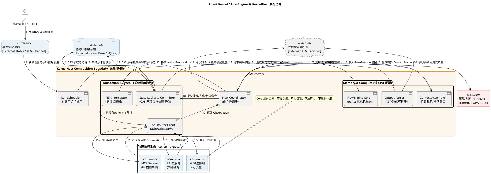
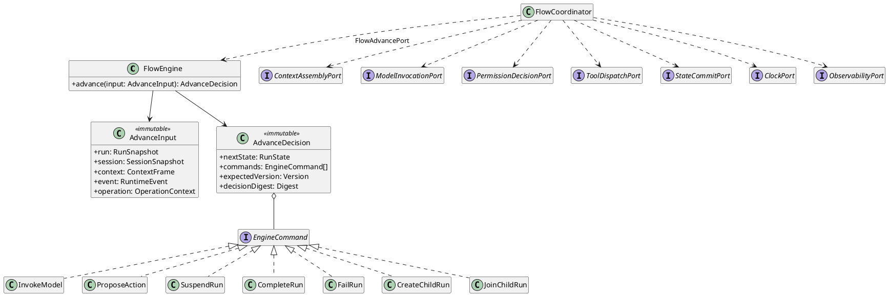
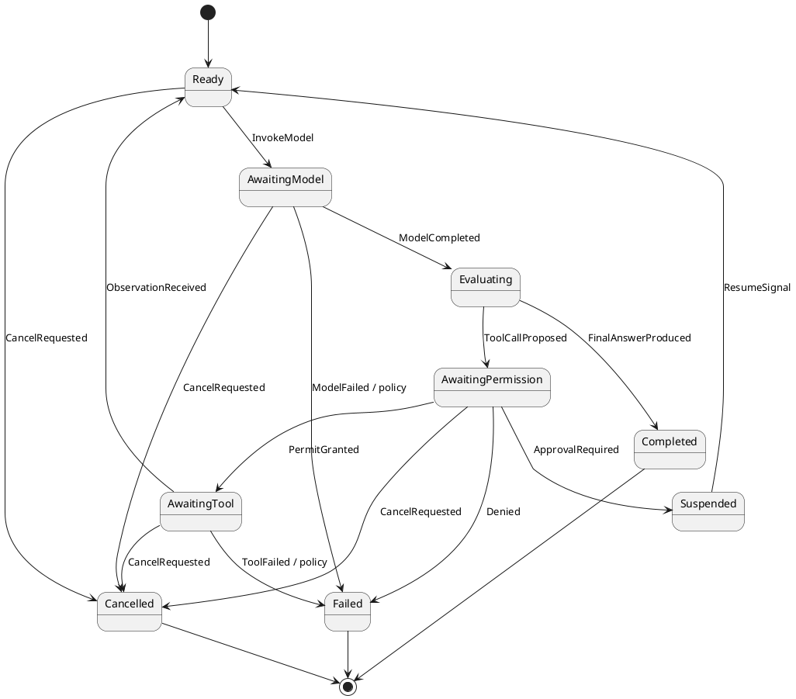

# FlowEngine 组件详细设计

> 设计对象：L1 FlowEngine 无状态推进核心，以及 KernelHost 调用方围绕 Core 形成的协作流程。
> 适用阶段：详细设计、SFMEA、接口评审与测试设计。
> 迁移记录：2026-09-05 从 Governance 归档迁入本 L1 权威位置。
> 边界约束：文中的协调流程不扩大 Core 的依赖；FlowEngine 自身仅暴露 `FlowAdvancePort`，不直接调用外部系统。

## 0. 文档控制

### 0.1 修订记录

| 版本 | 日期 | 作者 | 变更摘要 | 评审状态 |
|---|---|---|---|---|
| `0.1.0-draft` | 2026-09-04 | 待填写 | 建立详细设计大纲 | 待评审 |
| `0.2.0-candidate` | 2026-09-05 | 待填写 | 迁入 L1，继承无状态 Core 与端口边界，并补齐三张设计图的关系、思路与问题闭环 | 候选 |

### 0.2 评审角色

| 角色 | 关注点 | 负责人 | 结论 |
|---|---|---|---|
| 架构评审 | 边界、依赖方向、职责唯一性 | 待填写 | 待评审 |
| 安全评审 | PEP/PDP、授权失败关闭、敏感数据 | 待填写 | 待评审 |
| 数据评审 | 快照、CAS、幂等、恢复点 | 待填写 | 待评审 |
| 测试评审 | SFMEA 覆盖、故障注入、验收条件 | 待填写 | 待评审 |
| 运维评审 | 可观测性、容量、告警、诊断 | 待填写 | 待评审 |

### 0.3 决策状态

| 决策 ID | 主题 | 候选结论 | 状态 |
|---|---|---|---|
| `FE-DEC-001` | FlowEngine 名称所指范围 | 仅指无状态 Core；运行装配属于 L1 Host/Coordinator | 已确认 |
| `FE-DEC-002` | 任务获取模型 | RunScheduler 消费有界可运行提示，FlowEngine 不消费任务 | 已确认 |
| `FE-DEC-003` | 并发控制 | 基于版本的 CAS，不在 Core 内持锁 | 已确认 |
| `FE-DEC-004` | 模型流解析归属 | L2 Adapter 解析 Provider 输出并产生规范化 RuntimeEvent | 已确认 |
| `FE-DEC-005` | 工具调用边界 | Core 只生成 ActionProposal，由 L1 控制路径协调安全与工具边界 | 已确认 |
| `FE-DEC-006` | 状态提交模型 | 调用方经权威 Port 原子提交，冲突后丢弃旧决策并重算 | 已确认 |

## 1. 设计摘要

### 1.1 问题

一个 Agent Run 不是一次函数调用就能完成：模型可能提出工具调用，权限系统可能要求人工批准，工具可能超时，状态提交也可能发生并发冲突。如果把这些等待、I/O 和状态都塞进 FlowEngine，Host 崩溃后的重放可能重复执行工具，并发推进可能相互覆盖，权限检查也容易被内部捷径绕过。

因此，FlowEngine 要解决的核心问题是：在不拥有持久状态、不解释权限策略、不直接执行副作用的前提下，持续推进 ReAct 循环，并让每次推进在外部依赖故障后仍可恢复、可审计、可测试。

### 1.2 设计结论

设计结论：

- `FlowEngine` 是无状态、确定性的 Run 推进算法；输入不可变快照和规范化事件，输出下一步命令集合。
- `KernelHost`/调用方负责装配 Scheduler、Context、L2 Adapter、State、Security 和 Tool Port；这些协作者不属于 FlowEngine，也不是它的直接出站依赖。
- 持久状态由外部 Repository/State Store 拥有；权限决策由 PDP 拥有；物理副作用由 Tool Provider 或 Sandbox 执行。
- 每次推进必须带 `expectedVersion`、幂等键、Deadline 和 OperationContext；冲突、超时和未知副作用必须显式收敛。

### 1.3 典型执行短轨迹

```text
TaskEvent
  -> load RunSnapshot + SessionSnapshot
  -> assemble ContextFrame
  -> advance(...)
  -> ModelInvocationCommand
  -> RuntimeEvent.ToolCallProposed
  -> permission decision
  -> authorized tool dispatch
  -> RuntimeEvent.ObservationReceived
  -> advance(...)
  -> CompleteRunCommand
  -> CAS commit
```

## 2. 范围与边界

### 2.1 设计目标

- 定义 FlowEngine 运行边界、Core 类结构和依赖方向。
- 定义一次推进的输入、输出、不变量和失败语义。
- 定义同层组件协作能力及层内接口。
- 定义与上层调度、安全、认知、执行、存储和运维能力的层间接口。
- 定义 SFMEA、测试用例、容量约束和可观测性规格。
- 形成可用于后续接口冻结和实现评审的统一模板。

### 2.2 非目标

- 不设计业务 Workflow、业务补偿或业务结果采纳。
- 不解释用户、租户、RBAC 或组织权限。
- 不拥有模型 Provider、PDP、数据库、消息总线或工具执行器的实现。
- 不把具体 Kafka、SQLite、OceanBase、OPA、MCP 或 MicroVM 类型带入 Core。
- 不冻结数据库 DDL、网络部署拓扑或具体中间件选型。
- 不在本阶段修改代码或生成实现任务。

### 2.3 绝对边界

> FlowEngine Core 不存数据、不判权限、不直接使用模型算力、不制造物理副作用。

| 允许 | 禁止 |
|---|---|
| 读取不可变快照 | 直接读写数据库 |
| 计算下一状态与命令 | 自行签发或扩大权限 |
| 生成模型调用意图 | 持有 Provider 密钥或直接绑定 SDK |
| 生成 ActionProposal | 直接调用 MCP、内部 API 或沙箱 |
| 输出提交意图 | 绕过版本校验覆盖状态 |
| 传播取消、Deadline 和追踪上下文 | 保留跨推进调用的可变会话状态 |

### 2.4 KernelHost 装配边界与 Core 边界

| 边界 | 包含 | 不代表 |
|---|---|---|
| KernelHost 装配边界 | Scheduler、Context Client、FlowEngine、L2 Adapter、State Client、Security Client 和 Tool Client 的进程内装配 | 这些组件属于 FlowEngine、同一架构层或共享一个事务 |
| FlowEngine | ReAct 状态机、推进规则、命令生成、终态判定 | 消息消费、I/O、权限裁决、工具执行或持久化 |

## 3. High Level 架构设计

### 3.1 视图要回答的问题

这张图回答三个问题：一次 Run 由哪些组件接力推进；FlowEngine Core 与 KernelHost 协调职责在哪里分开；模型、权限、工具和状态写入分别经过哪个受控边界。它表达逻辑协作和信任边界，不直接等同于部署单元、代码包或事务边界。蓝色表示外部 I/O，黄色表示进程内组件，红色表示安全边界。

### 3.2 High Level 架构图（FE-DGM-001）



### 3.3 组件关系与一次推进

图中的箭头表示一次推进中的请求、结果或命令流，不表示左侧组件拥有右侧组件。`Flow Coordinator` 是协作枢纽，`FlowEngine Core` 只参与第 7、8 步的纯计算。

| 关系 | 交换内容 | 责任边界 |
|---|---|---|
| Gateway → Event Bus → Run Scheduler | 规范化任务与执行信封引用 | Event Bus 保证投递语义；Scheduler 只决定何时领取，不决定 Run 下一状态 |
| Run Scheduler → State Committer → State Store | Run/Session 引用、版本化快照 | 状态权威在 Store；Committer 负责版本校验，Scheduler 和 Core 都不持有权威状态 |
| State Committer → Context Assembler → Flow Coordinator | 冻结快照、预算与 `ContextFrame` | Assembler 生成有界投影，不修改长期记忆或 Run |
| Flow Coordinator → FlowEngine Core → Flow Coordinator | `AdvanceInput`、`AdvanceDecision` | Core 根据不可变输入计算命令意图；Coordinator 解释并分派命令，但不能改写决策 |
| Flow Coordinator → LLM → Output Parser → Flow Coordinator | 模型请求、Provider 流、规范化 `RuntimeEvent` | L2 Adapter 隔离 Provider 协议；Core 不解析流，也不依赖模型 SDK |
| Flow Coordinator → PEP ↔ PDP | `ActionProposal`、权限决断、`Permit` | PDP 拥有策略，PEP 执行决断；二者不可由 Core 绕过 |
| PEP → Tool Router → Action Target | `AuthorizedAction`、幂等执行请求 | 只有携带有效 Permit 的动作才能到达 MCP、内部服务或沙箱 |
| Action Target → Tool Router → Flow Coordinator | 原始结果、规范化 `Observation` | Tool Router 隔离目标差异，并明确副作用是否已发生 |
| Flow Coordinator → State Committer → State Store | `CommitIntent`、`expectedVersion` | 只有 CAS 成功后，决策才成为事实；冲突时丢弃旧决策并重算 |

一次工具型 Run 因此形成两个闭环：`事件/快照 → Core 决策 → CAS 提交` 是状态闭环，`ActionProposal → Permit → Tool → Observation → Core` 是副作用闭环。前一个闭环保证并发正确性，后一个闭环保证物理动作不会绕过授权。

### 3.4 设计思路与解决的问题

| 设计点 | 为什么这样设计 | 解决的问题 |
|---|---|---|
| 用 Coordinator 装配协作者，Core 保持纯函数 | I/O 的失败、延迟和重试规则与状态迁移规则变化频率不同 | 避免 Core 同时承担调度、协议和副作用职责，使状态规则可做确定性单元测试 |
| 将快照读取与提交放在 Core 外，并以 CAS 收口 | 纯计算期间不能阻止另一个 Worker 更新同一 Run | 防止丢失更新；冲突后可从新快照重算，而不是复用过期命令 |
| 模型输出先由 Adapter/Parser 规范化 | Provider 的流格式、半包和错误类型不稳定 | 防止 Provider 私有事件污染状态机，并能在非法流产生动作前拒绝它 |
| PEP/PDP 位于 Proposal 与 Tool 之间 | “模型建议执行”不等于“系统授权执行” | 消除从模型结果直达物理副作用的旁路，PDP 故障时可以统一失败关闭 |
| Tool Router 返回 Observation 和副作用分类 | 超时只说明没有收到响应，不说明动作没有发生 | 避免对副作用未知的工具自动重试，降低重复扣款、重复写入等风险 |
| 状态闭环和副作用闭环分离 | 数据库事务不能覆盖 LLM、人工审批和外部工具 | 不依赖跨系统大事务，Host 重启后仍能依据快照、幂等键和事实恢复 |

### 3.5 架构图决策

| 编号 | 问题 | 候选处理 | 评审结论 |
|---|---|---|---|
| `FE-ARC-001` | Scheduler 是否属于 FlowEngine | 属于 L1 调度组件，不属于 FlowEngine | 已确认 |
| `FE-ARC-002` | Locker 是否表示长事务锁 | 否；实现采用 SnapshotLoader/StateCommitter 与 CAS | 已确认 |
| `FE-ARC-003` | Assembler 是否与 ContextEngine 重叠 | 仅作为 Context Port Client 或薄协调器 | 已确认 |
| `FE-ARC-004` | Parser 是否属于 L1 | Provider/协议解析留在 L2 Adapter，FlowEngine 只收规范化事件 | 已确认 |
| `FE-ARC-005` | PEP 与 Router 是否被 FlowEngine 直接调用 | 否；FlowEngine 返回命令，由 L1 Coordinator 调用 | 已确认 |
| `FE-ARC-006` | L1 是否允许直接访问 L4 | 禁止；必须经 Tool/Sandbox 边界路由 | 已确认 |

## 4. 组件职责设计

### 4.1 职责矩阵

| 组件 | 核心职责 | 输入 | 输出 | 权威数据 | 明确不负责 |
|---|---|---|---|---|---|
| Event Poller | 消费、确认、退避与背压 | TaskEvent | DispatchWorkItem | 消费位点由消息机制持有 | Run 决策、业务优先级 |
| Snapshot Loader | 按版本读取推进所需快照 | RunRef、SessionRef | AdvanceInput | 无 | 长期持锁、修改聚合 |
| Context Assembler Client | 请求生成有界上下文 | ContextRequest | ContextFrame | 无 | 长期记忆权威写入 |
| Output Parser | 将 Adapter 输出规范化 | Provider chunks | RuntimeEvent | 无 | 推进状态、权限决策 |
| FlowEngine Core | 计算下一状态和命令 | AdvanceInput | AdvanceDecision | 无 | I/O、持久化、副作用 |
| State Committer | 校验版本并原子提交 | CommitIntent | CommitResult | 聚合 Repository 持有 | 重新计算推进规则 |
| PEP Interceptor | 执行前校验 Permit | ActionProposal、Permit | AuthorizedAction/拒绝 | Permit 权威状态由安全域持有 | 定义权限策略 |
| Tool Router Client | 幂等派发与结果归一化 | AuthorizedAction | Observation | ToolCall 权威状态由工具域持有 | 权限裁决、业务补偿 |

### 4.2 RACI

> `A`：最终负责；`R`：执行；`C`：参与；`I`：获知。

| 能力 | FlowEngine Core | Scheduler/Poller | Context | Security | Tool Runtime | Repository |
|---|---|---|---|---|---|---|
| 计算下一动作 | A/R | I | C | I | I | I |
| 任务选择与派发 | I | A/R | I | I | I | C |
| 上下文组装 | C | I | A/R | C | I | C |
| 权限决断 | I | I | I | A/R | C | C |
| 工具副作用 | I | I | I | C | A/R | C |
| Run 状态提交 | C | C | I | I | I | A/R |
| 冲突后重载 | R | C | I | I | I | A |

## 5. 类图与对象模型

### 5.1 类图要回答的问题

High Level 图说明运行时怎样协作，本图进一步说明 Core 在代码级只认识哪些对象，以及命令意图为什么不会变成对外部系统的直接调用。重点不是罗列类名，而是固定依赖方向：Coordinator 依赖 Core 和各 Port，Core 不反向依赖 Coordinator 或任何 I/O Port。

### 5.2 类图（FE-DGM-002）



### 5.3 对象与组件关系

| 图中关系 | UML 含义 | 运行时含义 |
|---|---|---|
| `FlowCoordinator ..> FlowEngine : FlowAdvancePort` | Coordinator 使用 Core 暴露的入站接口 | Coordinator 构造一次完整输入并调用 `advance`；Core 不回调 Coordinator |
| `FlowEngine --> AdvanceInput` | Core 消费输入值对象 | Run、Session、Context、Event 和 OperationContext 必须作为同一冻结输入传入，Core 不自行补读 |
| `FlowEngine --> AdvanceDecision` | Core 产生决策值对象 | 决策同时给出目标状态、命令、期望版本和 digest，便于原子校验与审计 |
| `AdvanceDecision o-- EngineCommand` | 一个决策聚合零到多个命令 | 命令与这次决策同生；脱离 decision digest 的命令不得单独重放 |
| `EngineCommand <|.. ...` | 各命令实现封闭命令族 | 调用方只能分派已声明的命令类型；未知类型必须拒绝，不能猜测执行 |
| `FlowCoordinator ..> *Port` | Coordinator 依赖边界抽象 | Context、模型、权限、工具、提交、时间和遥测可独立替换；具体 Adapter 只在 Composition Root 装配 |

命令类是“请求某组件做事”的不可变意图，不是已经发生的事实。例如 `ProposeAction` 只允许 Coordinator 请求权限判断；只有 PEP 返回有效 Permit 后，Coordinator 才能调用 `ToolDispatchPort`。这一区分阻止了调用方把 Core 的输出误当成执行授权。

### 5.4 设计思路与解决的问题

| 设计点 | 来由与取舍 | 解决的问题 |
|---|---|---|
| 单一 `advance` 入口 | 每次只处理一个已排序事件，牺牲 Core 内部的 I/O 便利性，换取明确的前后条件 | 并发、重放和非法迁移可以在一个确定性边界验证 |
| 不可变 `AdvanceInput` / `AdvanceDecision` | 推进中不共享可变聚合，所有时间和上下文也显式传入 | 避免同一次计算读到不同时刻的数据；相同输入可复现相同 digest |
| 封闭 `EngineCommand` 联合 | 新副作用必须显式增加命令类型和调用方处理分支 | 避免通过通用回调或字符串命令偷偷扩大 Core 能力 |
| Coordinator 持有出站 Port 依赖 | 调用方承担副作用协调，Core 只承担规则计算 | 保持依赖向外，测试 Core 时无需数据库、LLM、PDP 或 Tool Provider |
| decision 携带 `expectedVersion` 与 digest | 命令必须能证明基于哪个状态、属于哪次计算 | 防止过期决策提交，也为重复请求和审计提供稳定身份 |

### 5.5 核心对象规格

| 对象 | 类型 | 必需字段 | 不变量 | 生命周期 |
|---|---|---|---|---|
| `AdvanceInput` | 不可变值对象 | 待填写 | 同一输入不可混用不同快照版本 | 单次推进 |
| `AdvanceDecision` | 不可变值对象 | 待填写 | 命令集合与目标状态必须一致 | 单次推进 |
| `RuntimeEvent` | 封闭联合类型 | 待填写 | 未知类型拒绝或隔离，不静默降级 | 单事件 |
| `EngineCommand` | 封闭联合类型 | 待填写 | 每条命令有幂等键和因果关系 | 至确认/过期 |
| `ContextFrame` | 不可变投影 | 待填写 | Token/字节/资源引用有界 | 单次模型调用 |
| `OperationContext` | 值对象 | 待填写 | Trace、Deadline、TimeContext 全链路传播 | 单操作链 |

### 5.6 推进函数规格

```text
AdvanceDecision advance(
  RunSnapshot run,
  SessionSnapshot session,
  ContextFrame context,
  RuntimeEvent event,
  OperationContext operation
)
```

前置条件：

- 所有快照均通过完整性校验，并包含明确版本。
- RuntimeEvent 属于当前 Run/Attempt，且 sequence 未被消费。
- Deadline 未过期；取消信号在推进前可见。
- 授权、路由和上下文引用只使用冻结版本。

后置条件：

- 相同规范化输入产生相同 `AdvanceDecision` 和 digest。
- 输出只包含声明过的命令类型。
- 不发生 I/O、持久化或外部副作用。
- 终态不会生成新的模型、工具、记忆或 Child Run 命令。

## 6. 状态机与核心流程

### 6.1 状态图要回答的问题

这张图描述一个 Run 在等待模型、评估输出、等待权限、等待工具和终止之间如何迁移。它刻意不描述组件调用细节：状态迁移由 Core 计算，外部动作由 Coordinator 分派，状态由 Repository 在 CAS 成功后持久化。这样可以区分“Core 建议进入某状态”和“该状态已经成为系统事实”。

### 6.2 Run 推进状态机（FE-DGM-003）



### 6.3 状态、事件与组件关系

| 转换关系 | 触发者或事件来源 | 组件协作与提交含义 |
|---|---|---|
| `Ready → AwaitingModel` | Core 生成 `InvokeModel` | Coordinator 先以 CAS 提交等待态，再经 `ModelInvocationPort` 发起调用，避免模型已运行而状态仍显示 Ready |
| `AwaitingModel → Evaluating` | L2 Parser 产生 `ModelCompleted` | Parser 只负责完整性与格式规范化；Core 再判断输出是最终答案还是动作建议 |
| `Evaluating → Completed` | `FinalAnswerProduced` | Core 生成完成命令；Repository 提交成功后 Run 才进入不可逆终态 |
| `Evaluating → AwaitingPermission` | `ToolCallProposed` | Proposal 先持久化，再由 Coordinator 交给 PEP/PDP，模型不能直接触发 Tool Router |
| `AwaitingPermission → AwaitingTool` | PEP 返回 `PermitGranted` | Permit 与 Run、动作、资源和有效期匹配后才提交并派发工具 |
| `AwaitingPermission → Suspended/Failed` | `ApprovalRequired` 或 `Denied` | Ask 释放执行槽并等待外部信号；Deny 形成可审计失败，不调用工具 |
| `AwaitingTool → Ready` | Tool Router 返回 `ObservationReceived` | Observation 作为新事实提交，下一次推进再决定调用模型还是结束，避免在工具回调中隐式递归 |
| `Suspended → Ready` | 审批系统产生 `ResumeSignal` | 恢复是新的幂等事件，不复用挂起前的 Permit 或旧决策 |
| 活动态 → `Cancelled` | Gateway、Deadline 或 Parent Run 产生 `CancelRequested` | Coordinator 设置取消栅栏并停止新动作；已在途动作按副作用事实收敛 |
| 任意失败分支 → `Failed` | 模型、权限或工具返回稳定失败事件 | Core 按策略生成失败命令；失败原因进入审计事实，不通过异常丢失 |

每个 Run 有一份持久化的 FSM 状态，而不是由某个常驻 FlowEngine 实例在内存中维护。Core 用快照中的当前状态和一个规范化事件计算候选迁移；只有 State Committer 的 CAS 成功，迁移才生效。

### 6.4 设计思路与解决的问题

| 设计点 | 为什么这样设计 | 解决的问题 |
|---|---|---|
| 等待模型、权限和工具分别建模 | 三类等待的超时、取消、重试和恢复规则不同 | 避免用一个模糊的 `Running` 状态掩盖系统卡在哪个依赖上 |
| `Evaluating` 与 `AwaitingPermission` 分开 | 模型输出有效不代表动作已获授权 | 防止解析成功被误当成执行许可，并为 Deny/Ask 保留明确分支 |
| `Suspended` 是非终态 | 人工审批可能跨进程、跨小时完成 | Host 无需占用执行槽或保存调用栈，收到 ResumeSignal 后可从快照恢复 |
| 工具结果回到 `Ready` | Observation 是下一轮推理的输入，不在工具回调里直接拼接下一动作 | 每轮推进都有独立版本、digest 和预算检查，ReAct 循环可审计且有界 |
| 终态封闭 | Completed、Failed、Cancelled 不再产生模型或工具命令 | 防止迟到事件、重复投递或取消竞态重新激活已经结束的 Run |
| 迁移必须经 CAS 成为事实 | 多 Worker 可能同时对同一版本计算合法但不同的候选迁移 | 保证最多一个决策提交；失败者重载后重算，避免状态分叉 |

### 6.5 正常链路

| 步骤 | 输入 | 处理 | 输出 | 提交点 |
|---:|---|---|---|---|
| 1 | TaskEvent | 去重、校验、加载引用 | DispatchWorkItem | 消费确认待定 |
| 2 | Run/Session Ref | 读取一致快照 | AdvanceInput | 无 |
| 3 | AdvanceInput | 组装 ContextFrame | Model command | CAS 提交等待模型 |
| 4 | Model stream | 解析规范化事件 | Text/ActionProposal | 流事件检查点待定 |
| 5 | ActionProposal | 权限判断与 Permit 校验 | AuthorizedAction | 安全审计提交 |
| 6 | AuthorizedAction | 幂等执行 | Observation | ToolCall 提交 |
| 7 | Observation | 重新推进或结束 | Next command/terminal | Run/Session 独立 CAS |

### 6.6 异常、挂起与恢复链路

为以下场景分别补充时序图和恢复判定：

- 模型流中断；
- CAS 版本冲突；
- 权限需要外部批准；
- Permit 过期、撤销或已消费；
- 工具超时且副作用未知；
- 消息重复投递；
- Host 在提交前或提交后崩溃；
- Parent Run 取消并级联 Child Run；
- Deadline 到期；
- Telemetry 不可用。

## 7. 层内协作能力与接口

### 7.1 层内能力清单

| 能力 ID | 能力 | 提供方 | 使用方 | 同步性 | 失败语义 |
|---|---|---|---|---|---|
| `FE-IN-001` | 事件领取与确认 | Event Poller | Flow Coordinator | 异步 | 至少一次；Core 幂等 |
| `FE-IN-002` | 快照读取 | Snapshot Loader | Flow Coordinator | 同步/异步待定 | 版本不一致则拒绝推进 |
| `FE-IN-003` | 上下文组装 | Context Client | Flow Coordinator | 异步 | 超预算返回稳定错误 |
| `FE-IN-004` | 纯推进 | FlowEngine Core | Flow Coordinator | 同步 | 非法迁移直接拒绝 |
| `FE-IN-005` | 输出规范化 | Output Parser | Flow Coordinator | 流式 | 非法片段隔离并审计 |
| `FE-IN-006` | 状态提交 | State Committer | Flow Coordinator | 异步 | CAS 冲突重载，不覆盖 |
| `FE-IN-007` | 动作拦截 | PEP Client | Action Coordinator | 异步 | 决策不可用时失败关闭 |
| `FE-IN-008` | 工具派发 | Tool Router Client | Action Coordinator | 异步 | 返回已知/未知副作用分类 |

### 7.2 层内接口模板

每个接口使用以下结构定义：

| 字段 | 内容 |
|---|---|
| Interface ID | `FE-IF-XXX` |
| 名称 | 待填写 |
| 调用方 / 实现方 | 待填写 |
| 用途 | 待填写 |
| 请求 DTO | 字段、类型、约束、敏感级别 |
| 响应 DTO | 字段、类型、约束、敏感级别 |
| 幂等语义 | 幂等键、digest、重复处理 |
| 并发语义 | expectedVersion、顺序、隔离级别 |
| 超时与取消 | Deadline、Abort、清理责任 |
| 错误模型 | 稳定错误码、可重试性、失败关闭 |
| 可观测性 | Trace、指标、审计字段 |

## 8. 调用方跨层协作接口

本节描述 L1 调用方处理 `AdvanceDecision` 时使用的跨层 Port，不是 FlowEngine 的出站接口。FlowEngine 自身的唯一接口仍是入站 `FlowAdvancePort`。

### 8.1 层间接口矩阵

| 边界 ID | 方向 | 逻辑接口 | 用途 | 调用方可见内容 | 禁止泄漏 |
|---|---|---|---|---|---|
| `FE-X-001` | L1 调用方 → FlowEngine | `FlowAdvancePort` | 对不可变输入执行一次纯推进 | Run/Session 快照、ContextFrame、RuntimeEvent、OperationContext | Provider 原生类型或可变聚合对象 |
| `FE-X-002` | L1 调用方 → Context 层 | `ContextAssemblyPort` | 获取有界 ContextFrame | 冻结快照引用、预算 | 长期记忆底层结构 |
| `FE-X-003` | L1 调用方 → 认知层 | `ModelInvocationPort` | 发起模型调用并接收规范化事件 | Prompt 投影、模型约束 | Provider SDK 私有类型、Key |
| `FE-X-004` | L1 调用方 → 安全层 | `PermissionDecisionPort` | 对 ActionProposal 请求决策 | 动作摘要、资源 Ref、授权快照 Ref | RBAC、组织策略内部模型 |
| `FE-X-005` | L1 调用方 → 工具层 | `ToolDispatchPort` | 携带 Permit 派发动作 | Tool Ref、参数 Artifact Ref、Permit Ref | Provider/Sandbox 私有类型 |
| `FE-X-006` | L1 调用方 → 数据层 | `StateCommitPort` | 版本化提交推进结果 | CommitIntent、expectedVersion | 数据库连接和 DDL |
| `FE-X-007` | L1 调用方 → 子 Run 层 | `ChildRunPort` | 创建、Join、Cancel Child Run | 约束子集、预算、Deadline | Multi-agent 业务角色和仲裁 |
| `FE-X-008` | L1 调用方 → 运维层 | `ObservabilityPort` | 输出脱敏事实 | OperationContext、事件摘要 | Prompt、Key、完整工具参数 |

### 8.2 接口通用信封

| 字段 | 必需 | 约束 |
|---|---:|---|
| `requestId` | 是 | 单次请求唯一 |
| `idempotencyKey` | 写操作是 | 相同键异载荷必须冲突 |
| `runRef` | 是 | 稳定引用，不携带可变对象 |
| `attemptRef` | 按场景 | 必须属于 runRef |
| `sequence` | 事件是 | 单 Run 或 Attempt 内严格递增 |
| `expectedVersion` | 状态提交是 | 不匹配时拒绝覆盖 |
| `deadline` | 是 | UTC 时间点 |
| `timeContext` | 是 | 明确 IANA 时区语义 |
| `traceId` / `correlationId` / `causationId` | 是 | 全链路传播 |
| `payloadDigest` | 幂等操作是 | 用于重复载荷一致性校验 |

### 8.3 错误码模板

| 错误码 | 触发条件 | 可重试 | Core 行为 | 运维行为 |
|---|---|---:|---|---|
| `FLOW_INVALID_TRANSITION` | 输入事件不允许当前状态处理 | 否 | 拒绝推进 | 记录错误与输入摘要 |
| `FLOW_STALE_SNAPSHOT` | expectedVersion 冲突 | 是 | 重载后重新计算 | 统计冲突率 |
| `FLOW_DEADLINE_EXCEEDED` | Deadline 到期 | 否 | 输出超时终止命令 | 记录耗时阶段 |
| `FLOW_CONTEXT_LIMIT_EXCEEDED` | Context 无法在预算内组装 | 策略决定 | 挂起或失败 | 记录预算维度 |
| `FLOW_PERMISSION_UNAVAILABLE` | 无法获得安全决策 | 条件性 | 失败关闭 | 安全告警 |
| `FLOW_PERMIT_INVALID` | Permit 过期、撤销、已消费或不匹配 | 否 | 禁止执行 | 安全审计 |
| `FLOW_TOOL_EFFECT_UNKNOWN` | 工具超时且无法确认副作用 | 否自动重试 | 安全挂起 | 人工处置告警 |
| `FLOW_EVENT_DUPLICATE` | 已消费 sequence 重投 | 不适用 | 幂等忽略 | 计数但不告警 |

## 9. 数据、一致性与幂等规格

### 9.1 快照一致性

- 明确 RunSnapshot、SessionSnapshot、ContextFrame、AuthoritySnapshot 的版本组合规则。
- 禁止用新权限或新路由版本静默替换正在执行的冻结快照。
- 明确跨聚合独立提交顺序和补偿方式，不假设分布式大事务。

### 9.2 CAS 提交

```text
load(version = N)
  -> advance(input@N)
  -> commit(expectedVersion = N, decisionDigest = D)
      -> success(version = N+1)
      -> conflict: discard decision, reload, recompute
```

### 9.3 幂等规则

| 对象/动作 | 幂等键 | 重复同载荷 | 重复异载荷 |
|---|---|---|---|
| TaskEvent 消费 | 待填写 | 返回原处理结果/忽略 | 冲突并审计 |
| 模型调用 | 待填写 | 策略待定 | 冲突 |
| ActionProposal | 待填写 | 复用原决策引用 | 冲突 |
| Tool Dispatch | 待填写 | 返回原 ToolCall 状态 | 禁止执行 |
| State Commit | 待填写 | 返回原提交结果 | CAS 冲突 |
| Resume Signal | 待填写 | 幂等忽略 | 冲突并审计 |

### 9.4 未知副作用

定义 `NONE / KNOWN_NOT_APPLIED / KNOWN_APPLIED / UNKNOWN` 四类副作用事实。`UNKNOWN` 默认进入安全挂起，不自动重放工具调用。

## 10. 安全规格

### 10.1 安全不变量

- ActionProposal 不能直接到达 Tool Provider。
- 受保护动作必须携带与 Run、动作、资源、授权版本和有效期完全匹配的一次性 Permit。
- PEP 只执行判定结果，不拥有或修改 PDP 策略。
- PDP 不可用、响应不可验证或 Permit 状态未知时失败关闭。
- Child Run 的权限、预算、Deadline 和资源范围只能是 Parent 的子集。
- 日志、Trace、指标和错误不得包含 Secret、完整 Prompt、完整工具参数或长期记忆正文。

### 10.2 威胁与控制模板

| 威胁 ID | 威胁 | 攻击/故障路径 | 预防控制 | 检测控制 | 恢复控制 |
|---|---|---|---|---|---|
| `FE-SEC-001` | 绕过 PEP | Core/Router 直连 Provider | 依赖门禁、接口隔离 | 调用链审计 | 终止 Run |
| `FE-SEC-002` | Permit 重放 | 重复执行已授权动作 | 一次性消费、动作绑定 | Permit 消费冲突指标 | 安全挂起 |
| `FE-SEC-003` | 权限扩大 | Child/重试使用更宽快照 | 子集验证、冻结版本 | 授权版本审计 | 拒绝派发 |
| `FE-SEC-004` | 敏感数据泄漏 | 日志记录 Prompt/参数 | 结构化脱敏 | 泄漏扫描 | 删除与事件响应 |

## 11. SFMEA 分析

### 11.1 评分规则

| 维度 | 范围 | 说明 |
|---|---:|---|
| 严重度 `S` | 1-10 | 对安全、数据、业务连续性的影响 |
| 发生度 `O` | 1-10 | 在设计运行条件下的发生概率 |
| 探测度 `D` | 1-10 | 数值越高表示越难在影响前发现 |
| 风险优先数 `RPN` | `S × O × D` | 用于排序，不替代高严重度单项门禁 |

高严重度安全项即使 RPN 较低也必须有验证用例。评分阈值、责任人和关闭条件待评审冻结。

### 11.2 SFMEA 主表

| ID | 功能 | 失效模式 | 局部影响 | 系统影响 | 原因 | 现有预防/探测 | S | O | D | RPN | 建议措施 | 验证用例 | Owner | 状态 |
|---|---|---|---|---|---|---|---:|---:|---:|---:|---|---|---|---|
| `FE-FM-001` | 事件消费 | 重复投递导致重复推进 | 重复命令 | 重复模型费用或副作用 | ACK 丢失 | sequence + 幂等键 | 待评 | 待评 | 待评 | 待算 | 验证全链路去重 | `FE-TC-006` | 待定 | Open |
| `FE-FM-002` | 快照读取 | 混用不同版本快照 | 错误决策 | 状态污染或越权 | 非原子读取/缓存陈旧 | 版本组合校验 | 待评 | 待评 | 待评 | 待算 | 冻结快照集 ID | `FE-TC-007` | 待定 | Open |
| `FE-FM-003` | 状态提交 | CAS 冲突被覆盖 | 丢失更新 | Run 状态分叉 | 错误冲突处理 | expectedVersion | 10 | 待评 | 待评 | 待算 | 冲突后强制重算 | `FE-TC-008` | 待定 | Open |
| `FE-FM-004` | 模型流 | 半包/乱序/中断被当成完成 | 错误意图 | 错误工具调用 | Parser 缺陷 | 完整性与终止帧校验 | 待评 | 待评 | 待评 | 待算 | 模糊测试与断流注入 | `FE-TC-009` | 待定 | Open |
| `FE-FM-005` | 权限拦截 | PDP 不可用时默认放行 | 未授权动作 | 安全事件 | 错误降级策略 | 失败关闭 | 10 | 待评 | 待评 | 待算 | 强制 Deny/安全挂起 | `FE-TC-010` | 待定 | Open |
| `FE-FM-006` | Permit 校验 | 过期或已消费 Permit 被复用 | 重复动作 | 越权/重复副作用 | 竞态或重放 | 一次性消费 + CAS | 10 | 待评 | 待评 | 待算 | 并发消费测试 | `FE-TC-011` | 待定 | Open |
| `FE-FM-007` | 工具派发 | 超时后未知副作用被自动重试 | 重复物理动作 | 数据或财务损失 | 错误重试分类 | 副作用状态分类 | 10 | 待评 | 待评 | 待算 | UNKNOWN 强制挂起 | `FE-TC-012` | 待定 | Open |
| `FE-FM-008` | 取消 | 取消后仍生成新动作 | 孤儿操作 | 资源泄漏/未授权后续动作 | 取消检查时序错误 | 每个执行点检查 | 9 | 待评 | 待评 | 待算 | 级联取消栅栏 | `FE-TC-013` | 待定 | Open |
| `FE-FM-009` | 资源控制 | 队列或上下文无界增长 | 内存耗尽 | Host 不可用 | 缺少硬上限 | 有界队列/预算 | 8 | 待评 | 待评 | 待算 | 压测与拒绝策略 | `FE-TC-014` | 待定 | Open |
| `FE-FM-010` | 可观测性 | Telemetry 阻塞主流程 | 推进超时 | 系统雪崩 | 同步上报 | 有界缓冲/丢弃策略 | 7 | 待评 | 待评 | 待算 | 故障注入 | `FE-TC-015` | 待定 | Open |

### 11.3 SFMEA 闭环规则

- 每个高风险失效模式必须绑定至少一个测试用例。
- 每个建议措施必须有 Owner、截止条件和剩余风险。
- 已关闭项保留原始评分和措施后的剩余评分。
- 无法检测的安全风险必须转化为预防性架构门禁。
- SFMEA 更新必须触发对应接口、不变量和测试清单复核。

## 12. 测试设计

### 12.1 测试分层

| 层级 | 目标 | 依赖策略 | 主要证据 |
|---|---|---|---|
| 纯函数单元测试 | 推进规则、状态迁移、命令生成 | 固定不可变输入 | 决策快照、性质测试 |
| 组件契约测试 | Port 请求/响应、错误与版本兼容 | Faux Adapter | 契约用例、Schema 校验 |
| 子系统集成测试 | Poller、Context、Committer、PEP、Router 协作 | 内存实现/故障桩 | 状态与事件轨迹 |
| 系统测试 | 完整 Run 正常与异常流程 | 受控本地环境 | 端到端审计轨迹 |
| 压力测试 | 队列、并发、上下文、流解析上限 | 合成负载 | 吞吐、延迟、资源曲线 |
| 混沌测试 | DB、MQ、PDP、LLM、Tool、Telemetry 故障 | 可重复故障注入 | 恢复时间、无旁路证明 |
| 安全测试 | Permit 重放、越权、注入、泄漏 | 恶意输入集合 | 拒绝、审计与无副作用证明 |

### 12.2 核心测试用例清单

| 用例 ID | 场景 | 前置条件 | 注入/输入 | 预期结果 | 关联风险 | 自动化级别 |
|---|---|---|---|---|---|---|
| `FE-TC-001` | 纯文本一次完成 | 有效 Run/Session 快照 | ModelCompleted(Text) | 生成完成命令且仅提交一次 | 基线 | 单元+集成 |
| `FE-TC-002` | 单次工具 ReAct | 有效权限与工具 | ToolCall → Observation | 返回下一轮并最终完成 | 基线 | 集成+系统 |
| `FE-TC-003` | 多轮工具循环 | 有界循环预算 | 多个 ToolCall | 顺序正确，预算耗尽时停止 | 资源风险 | 单元+系统 |
| `FE-TC-004` | Ask 后挂起恢复 | 外部审批可用 | Ask → Approved | 挂起释放槽，恢复不重放模型 | 权限风险 | 系统 |
| `FE-TC-005` | Deny | PDP 返回 Deny | ActionProposal | 不触发 Router，产生审计事实 | 安全风险 | 集成 |
| `FE-TC-006` | 重复 TaskEvent | 相同 sequence/digest | 同事件投递两次 | 第二次无新命令和副作用 | `FE-FM-001` | 集成 |
| `FE-TC-007` | 快照版本错配 | Run N、Session M+1 不兼容 | 推进请求 | 拒绝推进并重载 | `FE-FM-002` | 单元+集成 |
| `FE-TC-008` | CAS 冲突 | 两个推进并发提交 N | 并发 CommitIntent | 仅一个成功，另一个重算 | `FE-FM-003` | 集成 |
| `FE-TC-009` | 模型流断开/乱序 | 流解析中 | 丢帧、半包、重复帧 | 不生成未验证 ActionProposal | `FE-FM-004` | 契约+模糊 |
| `FE-TC-010` | PDP 不可用 | ActionProposal 待决 | 超时/坏签名 | 失败关闭，无工具调用 | `FE-FM-005` | 集成+混沌 |
| `FE-TC-011` | Permit 并发重放 | 一次性 Permit | 两个并发 Dispatch | 最多一次获得执行权 | `FE-FM-006` | 集成+安全 |
| `FE-TC-012` | 工具未知副作用 | 非幂等工具执行中 | 超时/连接断开 | Run 安全挂起，不自动重试 | `FE-FM-007` | 系统+混沌 |
| `FE-TC-013` | 取消级联 | 活动 Model/Tool/Child | CancelRequested | 停止新动作，Child 收敛，无孤儿 | `FE-FM-008` | 系统 |
| `FE-TC-014` | 容量极限 | 队列/上下文接近上限 | 超额请求 | 稳定拒绝，无 OOM、无线程泄漏 | `FE-FM-009` | 压力 |
| `FE-TC-015` | Telemetry 中断 | 主流程运行中 | Collector 不可达 | 主流程不阻塞，按策略缓冲/丢弃 | `FE-FM-010` | 混沌 |
| `FE-TC-016` | Host 提交前崩溃 | 命令未提交 | 进程终止并重启 | 从旧版本安全重算 | 恢复风险 | 系统 |
| `FE-TC-017` | Host 提交后 ACK 前崩溃 | 状态已提交 | 进程终止并重启 | 识别原提交，不重复副作用 | 恢复风险 | 系统 |
| `FE-TC-018` | Deadline 到期 | 推进/外部调用进行中 | 时间推进 | 取消后终态一致、资源释放 | 时间风险 | 单元+系统 |

### 12.3 单用例模板

```text
用例 ID：FE-TC-XXX
标题：
目标：
关联需求/不变量：
关联 SFMEA：
前置状态：
输入与故障注入：
执行步骤：
预期状态轨迹：
预期命令/事件：
禁止出现的副作用：
可观测性断言：
资源清理断言：
自动化层级：
```

### 12.4 性质与不变量测试

- 确定性：相同规范化输入得到相同 decision digest。
- 终态封闭：终态输入不能生成新的外部动作。
- 幂等：同一事件重复应用不增加命令或副作用次数。
- 单调序列：已提交 sequence 不回退、不跳过未解释事件。
- 权限安全：无有效 Permit 时工具派发次数恒为零。
- 资源有界：任意输入下命令数、上下文大小和 Child 数不超过硬上限。
- 取消收敛：取消后有限时间内无活动外部动作和 Child Run。

## 13. 非功能规格

### 13.1 性能与容量

| 指标 | 目标值 | 硬上限 | 测量点 | 超限行为 |
|---|---:|---:|---|---|
| 单次 `advance` CPU 时间 | 待填写 | 待填写 | Core 入口/出口 | 失败或告警待定 |
| 单次推进内存增量 | 待填写 | 待填写 | Host 进程 | 拒绝/降级待定 |
| 最大并发 Run | 待填写 | 待填写 | ResourceManager | 有界排队 |
| 最大队列深度 | 待填写 | 待填写 | Poller/Scheduler | 稳定拒绝 |
| 最大 Context token/bytes | 待填写 | 待填写 | Context Port | 裁剪或失败 |
| 最大模型流缓冲 | 待填写 | 待填写 | Parser | 背压或中止 |
| 最大 ReAct 步数 | 待填写 | 待填写 | FlowEngine Core | 安全终止 |
| 最大 Child Run 数/深度 | 待填写 | 待填写 | ChildRun Port | 拒绝创建 |

### 13.2 可用性与恢复

- 定义本地单 Host 档案和多 Worker 档案各自的恢复目标。
- 明确可安全自动重试、必须重算、必须人工介入三类故障。
- FlowEngine 重启不得依赖进程内状态恢复 Run。
- 所有临时资源必须在完成、失败、取消和超时路径释放。

### 13.3 兼容性

- 定义 `AdvanceInput`、`RuntimeEvent`、`EngineCommand` 的版本策略。
- 未知必需字段或未知命令类型必须拒绝，不得静默忽略。
- Provider、PDP、工具和存储差异只能由边界 Adapter 吸收。

## 14. 可观测性规格

### 14.1 结构化事件

| 事件 | 触发点 | 必需字段 | 禁止字段 |
|---|---|---|---|
| `flow.advance.started` | Core 调用前 | runRef、attemptRef、sequence、version、trace | Prompt/工具参数正文 |
| `flow.advance.decided` | Core 返回后 | decision type、digest、duration | 完整 Context |
| `flow.commit.conflicted` | CAS 冲突 | expected/actual version、retry count | 聚合正文 |
| `flow.permission.blocked` | Deny/Ask/Unavailable | proposalRef、reason code | 策略正文、身份明文 |
| `flow.tool.effect_unknown` | 工具状态不确定 | toolCallRef、provider class | Secret、参数正文 |
| `flow.run.suspended` | 安全挂起 | reasonRef、resume condition | 敏感载荷 |

### 14.2 指标

- `flow_advance_duration_seconds`
- `flow_advance_total{decision}`
- `flow_commit_conflict_total`
- `flow_event_duplicate_total`
- `flow_permission_result_total{result}`
- `flow_tool_effect_unknown_total`
- `flow_queue_depth`
- `flow_active_runs`
- `flow_suspended_runs{reason}`
- `flow_context_size_bytes`

### 14.3 告警候选

| 告警 | 条件 | 严重级别 | 自动动作 | 人工动作 |
|---|---|---|---|---|
| 未知工具副作用 | 任一非幂等 ToolCall 为 UNKNOWN | 高 | 安全挂起 | 核对外部系统 |
| 权限旁路迹象 | 无 Permit 的派发尝试 > 0 | 严重 | 阻断执行 | 安全事件响应 |
| CAS 冲突异常升高 | 比例超过阈值 | 中 | 限流待定 | 检查并发与热点 |
| 推进延迟异常 | P99 超阈值 | 中 | 背压待定 | 定位阶段耗时 |
| 队列接近上限 | 深度超过阈值 | 中 | 拒绝低级请求待定 | 扩容/降载 |

## 15. 配置规格

| 配置项 | 类型 | 默认值 | 合法范围 | 热更新 | 失败行为 |
|---|---|---|---|---:|---|
| `maxConcurrentRuns` | integer | 待填写 | 待填写 | 否/待定 | 启动失败 |
| `maxQueueDepth` | integer | 待填写 | 待填写 | 否/待定 | 启动失败 |
| `maxReactSteps` | integer | 待填写 | 待填写 | 是/待定 | 使用最后有效值 |
| `maxContextBytes` | integer | 待填写 | 待填写 | 是/待定 | 拒绝超限请求 |
| `modelCallTimeout` | duration | 待填写 | 待填写 | 是/待定 | 调用失败 |
| `toolCallTimeout` | duration | 待填写 | 待填写 | 是/待定 | 按副作用分类处理 |
| `commitRetryLimit` | integer | 待填写 | 待填写 | 是/待定 | 安全挂起/失败 |
| `telemetryBufferSize` | integer | 待填写 | 待填写 | 是/待定 | 丢弃非关键遥测 |

配置必须有类型、范围和启动时校验；安全关键配置缺失或非法时不得以宽松默认值启动。

## 16. 部署与运行档案

### 16.1 Local-first 最小档案

```text
一个 KernelHost 进程
  + 一个 FlowEngine Core 实例
  + 一个有界任务队列
  + 若干异步执行槽
  + 本地状态 Adapter
  + 外部或本地模型/工具 Adapter
```

### 16.2 扩展档案待设计项

- 多 Worker 时的 Lease/Fence 与旧 Worker 写入隔离；
- Event Bus 位点、重新平衡与重复投递语义；
- 跨进程模型流与背压；
- PDP、Tool Provider 和状态存储的独立故障域；
- 扩展档案不得改变 FlowEngine Core 的输入输出语义。

## 17. 实现约束与依赖规则

- Core 只能依赖领域值对象和 Port 抽象。
- Core 不导入数据库、消息总线、HTTP、模型 SDK、OPA、MCP 或沙箱实现。
- Parser 的 Provider 私有逻辑必须留在 Adapter 一侧。
- 所有外部写操作都必须经过显式 Port、幂等和权限检查。
- 同层组件不得通过共享可变对象交换 Run/Session 状态。
- 具体 Adapter 只在 Composition Root 装配。
- 不允许 KernelHost 装配边界成为跨聚合大事务边界。

## 18. 设计评审门禁

### 18.1 阶段一：职责与边界

- [x] KernelHost 装配边界与 FlowEngine 已明确区分。
- [ ] 每个组件只有一个权威职责和数据所有者。
- [ ] 业务 Workflow、身份、权限策略和物理副作用没有进入 Core。
- [ ] 同层和层间依赖方向无循环、无旁路。

### 18.2 阶段二：接口与规格

- [ ] 所有层内/层间接口有调用方、实现方、DTO、错误和版本策略。
- [ ] 幂等、CAS、Deadline、取消和背压语义闭合。
- [ ] 稳定错误码与可重试分类完整。

### 18.3 阶段三：生命周期与韧性

- [ ] 正常、挂起、恢复、取消、超时和崩溃轨迹闭合。
- [ ] 未知副作用没有自动重试路径。
- [ ] 重启不依赖 FlowEngine 进程内状态。

### 18.4 阶段四：安全与 SFMEA

- [ ] 无 Permit 工具派发路径为零。
- [ ] PDP 故障默认失败关闭。
- [ ] 高严重度 SFMEA 项均有预防控制和自动化用例。
- [ ] 日志、Trace、指标和诊断包通过敏感数据检查。

### 18.5 阶段五：测试与实现授权

- [ ] 测试用例覆盖正常流、异常流、压力、混沌和安全场景。
- [ ] 性能与容量阈值已量化。
- [ ] 所有待确认决策已关闭或明确延期。
- [ ] 架构评审明确批准后，才拆分代码实现任务。

## 19. 待决问题

| ID | 问题 | 可选方案 | 影响 | Owner | 截止条件 |
|---|---|---|---|---|---|
| `FE-Q-005` | 状态读取是否需要显式短租约 | 纯 CAS / Lease + CAS | 多 Worker 正确性 | 待定 | 部署档案评审前 |
| `FE-Q-006` | 模型调用幂等性如何定义 | 不重试 / Provider key / checkpoint | 成本与重复输出 | 待定 | 异常流程评审前 |

## 20. 附录模板

### 20.1 接口详细定义

```text
接口 ID：
接口名称：
责任边界：
调用方：
实现方：
请求：
响应：
不变量：
幂等与并发：
超时与取消：
错误码：
可观测性：
安全分类：
兼容策略：
```

### 20.2 时序图占位

后续至少补充：

- 纯文本完成；
- ToolCall Allow；
- ToolCall Ask/Resume；
- ToolCall Deny；
- CAS 冲突；
- 模型流中断；
- 工具未知副作用；
- 取消与 Child Run 级联；
- Host 崩溃恢复。

### 20.3 术语表

| 术语 | 本文定义 | 禁止混用概念 |
|---|---|---|
| KernelHost 装配边界 | 跨层组件的进程内装配和命令协调范围 | 单一领域对象、架构层或事务 |
| FlowEngine | 无状态推进算法 | Scheduler、Repository、Tool Runtime |
| RuntimeEvent | 已规范化的推进输入事件 | Provider 原生事件 |
| EngineCommand | 推进算法输出的动作意图 | 已发生的物理副作用 |
| ActionProposal | 等待权限判断的动作候选 | ExecutionPermit |
| Observation | 工具结果的规范化事实 | Provider 原生响应 |
| Snapshot | 带版本的不可变读取视图 | 共享可变 Session 对象 |
