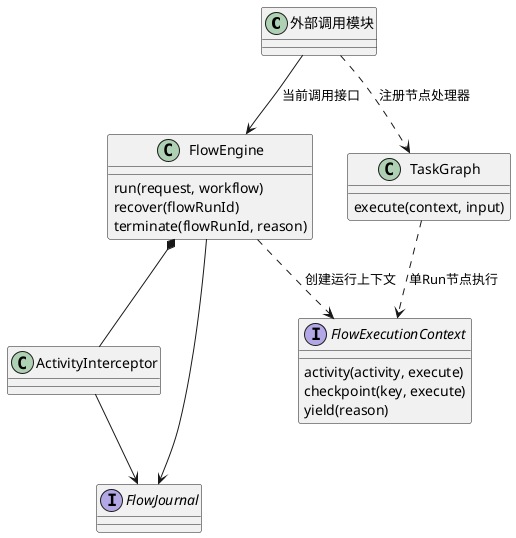

# FlowEngine：接口、指令与内部节点调度

目录说明：FlowEngine 是唯一组件名。原 `flow-system-*` 文件描述该组件的系统执行协议及 SR，并不代表另一个 FlowSystem 组件。L1 组件层只导航到本目录；内部设计按 SR 展开，原 SR 编号保持不变。SR 定义需求、场景与验收，其内部 AR 描述实现方案，协议索引不构成 SR 的上层。

2026-09-08 命名基线：公开类型为 `FlowRunState` / `FlowRunAction`，常量为 `FLOW_RUN_STATE` / `FLOW_RUN_ACTION`，迁移函数为 `resolveFlowRunTransition`。维护入口为 `scripts/flow-engine-admin.ts`，集成测试为 `test/integration/flow-engine.test.ts`。不再导出旧名称；调用方需更新导入。状态取值、动作取值、事件值及 v1 摘要编码保持不变。非法迁移错误现为 `FLOW_RUN_INVALID_TRANSITION`。

v1 物理存储仍使用 `flow-system.sqlite` / `system_flow_events`，它们是当前部署与适配器一致使用的持久化名称，不代表 FlowSystem 组件。直接换库名会打开空库、丢失回放依据，本次不迁移物理存储。历史 SR/验收编号和旧镜像摘要保留用于追溯；[本次验证](../../../../../verification/flow-engine-naming-validation.md)与历史运行证据分开记录。

FlowEngine是供外部模块调用的系统执行框架。设计核心是：用什么接口提交和控制Flow，如何执行与重放指令，如何表达单flowRun内部节点的关联，以及根据关联决定执行顺序、等待、恢复与退出。系统状态仅有`FLOW_RUN_STATE`定义的四态；业务含义由外部注册的处理器解释。

本文按2026-09-08当前工作区源码核对。**单Run执行、Activity拦截、Run内任务图已实现；独立Run之间的通用关联与调度尚未实现。** 现有`FlowScheduler`读取ReAct位置和命令，不能作为后者的实现证据。不得把同一Run里的图节点改称独立Flow来填补此缺口。

## SR入口与实现状态

当前交付范围为单flowRun四态、Activity回放、恢复和内部有向环。Session父子关系归[SessionManager](../session-manager.md)。非当前需求统一在[扩展索引](../../../../../extensions/README.md)管理，本页不维护扩展方案。

SR先定义场景和功能，其内部AR给出接口、结构、算法及验收。关联与调度是评审重点。

| SR | 核心内容 | 当前证据 |
| --- | --- | --- |
| [SR-FE-SYS-01](sr-01-lifecycle.md) | 对外接口、四态控制指令及执行语义 | FlowEngine、FlowExecutionContext、显式迁移表 |
| [SR-FE-SYS-02](sr-02-activity.md) | Activity指令、唯一首次执行、结果回放及未知结果处理 | ActivityInterceptor、FlowJournal与SQLite适配器 |
| [SR-FE-SYS-03](sr-03-task-graph.md) | 单Flow内部节点关联、路由、回环和退出 | TaskGraph；每次访问具有独立身份 |

## 定义与边界

| 名称 | 定义与身份 |
| --- | --- |
| 工作流程序 | 外部模块提供的`FlowWorkflow`回调；版本与输入由调用方固定 |
| Flow运行实例 | 当前代码中的`FlowRunRequest.flowRunId`，租户内唯一；本文称FlowRun |
| Activity | 某Run的一次可拦截调用，由稳定key定位，首次登记分配sequence |
| 图节点与visit | 节点是静态位置；visit是该Run中的一次动态访问，不另有四态Run |

外部模块只以接口参与：提交请求、提供版本固定的工作流/节点/Activity实现、处理权限、供给存储及唤醒信号。模型、ReAct、无人业务轮次、Context、Memory、PDP/PEP、工具和HTTP内部实现不在FlowEngine文档展开。安全模块仍负责授权，框架不把日志命中或调度提示当作授权。

此图只展开框架内部；外部业务宿主作为调用方。存储实现通过FlowJournal适配，不使框架依赖SQLite。

## 执行身份命名约定

框架执行实例统一称`FlowRun`，变量和身份使用`flowRun`、`flowRunId`；业务执行快照称`AgentRunSnapshot`，宿主变量和身份使用`agentRun`、`agentRunId`。FE契约不引用AgentRun、RunRegistry或业务生命周期。`FlowEngine.run()`中的run是执行动词，不是业务对象。

当前ReAct宿主在`flowRunIdForAgentRun`中显式映射两类身份；现有实例沿用相同字符串，但分别属于业务存储和系统日志。该映射属于外部宿主，不是FE的业务依赖。v1业务序列化字段`run`/`runId`、系统日志SQL列`run_id`以及受理摘要的旧编码保留，避免改名破坏历史回放。HTTP查询中的系统视图为`flowRun`，诊断事件为`flowRunEvents`。

本次命名修正不代表跨Flow调度已实现，也不授权FE读取或管理AgentRun。跨Flow关联只能引用FlowRun身份；业务身份映射须由外部模块管理。

## 接口唯一来源与扩展

- [flow-engine-contract.ts](../../../../../../src/contracts/control/flow-engine/flow-engine-contract.ts)：请求、运行视图、Activity、上下文与日志端口。
- [flow-engine-values.ts](../../../../../../src/contracts/control/flow-engine/flow-engine-values.ts)：系统状态、动作、日志事件和图路由常量；类型从常量推导，判断与表键不得复制字符串。
- [flow-graph.ts](../../../../../../src/contracts/control/flow-engine/flow-graph.ts)：当前单Run图节点与路由协议。
- [FlowEngine实现](../../../../../../src/control/flow-engine/flow-engine.ts)、[TaskGraph实现](../../../../../../src/control/flow-engine/task-graph.ts)：当前执行算法。

新增业务通过注册回调和固定版本接入，不在系统状态表中增加业务状态。新增存储实现FlowJournal并通过相同契约用例。

## 本轮文档调整与完整性

| 原内容 | 当前归属 |
| --- | --- |
| 受理、四态、epoch、恢复 | SR-01，补齐公开签名和指令执行表 |
| The Magic、序号、CAS、append-only、对账 | SR-02，作为指令执行正确性的协议 |
| 有向环、visit、检查点与退出 | SR-03，明确实际只覆盖单Run |
| ReAct、模型、上下文、权限、工具、业务父子任务内部结构 | 移出框架关系图；仅保留外部调用契约与源码证据链接 |
| 部署步骤、模型配置、运行结果 | [部署说明](../../../../../../deploy/flow-local/README.md)及[验证记录](../../../../../verification/flow-engine-naming-validation.md) |

持久化、韧性、升级和测试仅随上述核心协议说明，避免复制外部模块设计。Activity仍保证唯一首次执行资格、已完成结果回放和未知结果关闭；不承诺外部系统的跨事务物理exactly-once。资源分配组件不属于本框架。

历史业务规格及资源组件原文保存在[历史目录](../../../../../governance/archive/flow-before-system-v1/README.md)，不作当前规范。已执行测试见验证记录；本次文档调整未改运行代码或重新部署。

本次命名与接口核对见[当前验证](../../../../../verification/flow-engine-naming-validation.md)；[原架构评审](../../../../../governance/reviews/flow-system-architecture-review.md)保留其历史范围和开放项，不作本轮已批准结论。

## 2026-09-08 目录迁移映射

本次仅统一文档组织与导航，不改变组件职责、协议常量、持久化格式或原有验证结论。

| 原组件层文件 | 新位置 |
| --- | --- |
| flow-engine.md | 本页 README.md |
| flow-system-lifecycle.md | [sr-01-lifecycle.md](sr-01-lifecycle.md) |
| flow-system-activity.md | [sr-02-activity.md](sr-02-activity.md) |
| flow-system-graph.md | [sr-03-task-graph.md](sr-03-task-graph.md) |
| flow-system-protocol.md | [protocol-index.md](protocol-index.md)，仅导航 |
| flow-system-scheduling.md | [deferred-scheduling-index.md](deferred-scheduling-index.md)，仅保留原编号迁移导航 |
| flow-engine-core-implementation.md | [history/react-core-implementation.md](history/react-core-implementation.md) |
| flow-engine-branch-audit.md | [history/react-branch-audit.md](history/react-branch-audit.md) |
| flow-engine-contract-v1.examples.json | [history/react-contract-v1.examples.json](history/react-contract-v1.examples.json) |

[历史资料](history/README.md)记录原 ReAct Core 的实现和测试向量，不是当前 FE 规范，也不代表 ReAct 归 FE 所有。跨 flowRun Fork/Join 的候选正文仍只在独立扩展目录维护。
