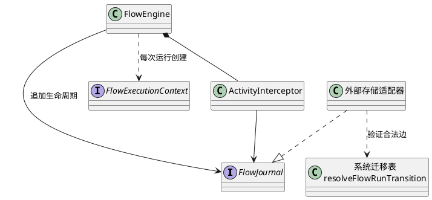
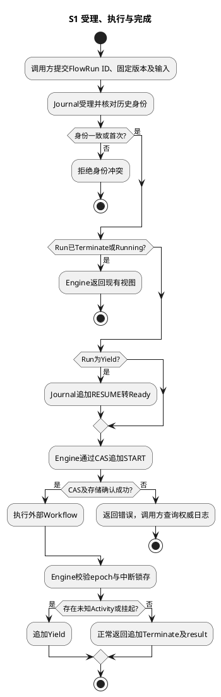
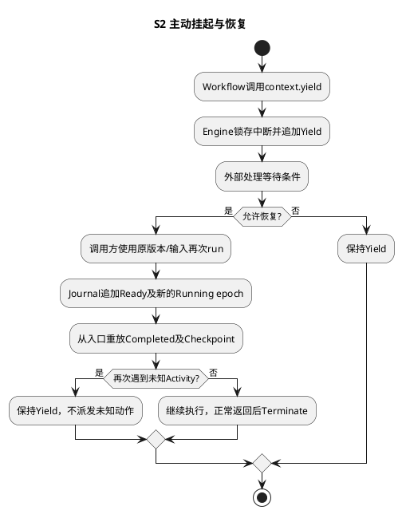
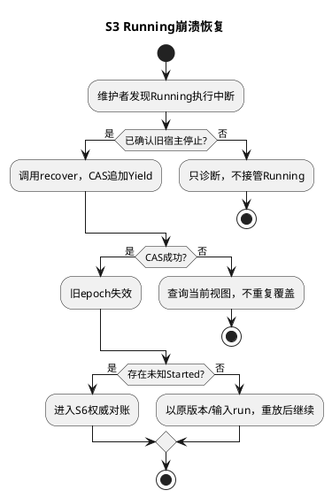

# SR-FE-SYS-01：公开接口与系统控制指令

用户为框架调用方、运行维护者。前置条件是调用方提供固定版本的工作流回调、租户在存储实例绑定、数据库可写。功能点：受理、启动、挂起、恢复、终止；系统状态只有Ready、Running、Yield、Terminate。系统完成原因与不透明业务结果分开；COMPLETED仅表示业务程序已正常返回，不解释业务成功含义。当前run直接接收回调，没有内置工作流注册中心。

接口：`FlowEngine.run(request, workflow)`；工作流接收`FlowExecutionContext`，返回JSON；`context.activity({ key, name, version, input }, execute)`拦截外部动作。key是一次逻辑调用的稳定身份，程序式工作流由作者提供稳定调用key，检查点式适配器使用已持久化命令ID；名称、版本、输入绑定不能改变。业务对象和业务状态不进入系统契约。

## 接口定义与返回语义

完整DTO以[flow-engine-contract.ts](../../../../../../src/contracts/control/flow-engine/flow-engine-contract.ts)为唯一源码定义；本表列出当前真实签名及调用语义，不另设HTTP协议。

| 接口 | 参数 → 返回 | 调用语义 |
| --- | --- | --- |
| new FlowEngine | journal: FlowJournal → 实例 | 注入存储端口；不启动扫描或线程 |
| FlowEngine.run | request: FlowRunRequest, workflow: FlowWorkflow → Promise&lt;FlowRun&gt; | 受理与执行合一；发现Running返回当前视图，发现Terminate返回历史结果；不保证并发请求都等到完成 |
| FlowEngine.recover | flowRunId: string → FlowRun | 仅Running可恢复；受信维护方先停止旧执行，追加Yield，不直接再次执行业务 |
| FlowEngine.terminate | flowRunId: string, reason: string → FlowRun | Ready/Running/Yield转Terminate；已Terminate幂等返回；不撤回已发网络调用 |
| context.activity | activity: FlowActivity, execute: () => Promise&lt;unknown&gt; → Promise&lt;unknown&gt; | 按SR-02决定首次调用或回放 |
| context.checkpoint | key: string, execute: () => Promise&lt;unknown&gt; → Promise&lt;unknown&gt; | 返回已有值，否则执行纯计算并保存；回调内副作用仍须经过activity |
| context.yield | reason: string → never | 中断本次执行；框架锁存中断，调用方吞异常后也不能继续发送Activity |
| journal.get / history | flowRunId: string → FlowRun / readonly FlowJournalEvent[] | 查询端口；完整结果访问授权由外部调用边界负责 |

FlowRunRequest包含flowRunId、workflowVersion、input；FlowRun包含flowRunId、revision、state、epoch、reason、result。revision是日志尾序号，epoch是启动事件序号。身份冲突、非法迁移、版本竞争及陈旧执行可抛错；调用方必须查询当前视图，不把异常解释为“未受理”。只有运行内的受控等待或工作流失败才按代码规则归入Yield/Terminate。reason保存稳定分类，普通自定义Yield原因可能归一为WORKFLOW_WAIT，不保证原字符串原样返回。

## 控制指令实现

指令值来自`FLOW_RUN_ACTION`；start/yield/resume是迁移表动作，不是额外公开方法。

| 指令常量 | 合法源 → 目标 | 触发与提交 |
| --- | --- | --- |
| START | READY → RUNNING | run在受理后调用；追加State_Changed，启动序号作为epoch |
| YIELD | RUNNING → YIELD | 主动等待、拦截结果未知；追加原因，结束本次工作流 |
| RESUME | YIELD → READY | 再次调用run时执行，随后START；当前框架没有内置业务等待条件判断 |
| RECOVER | RUNNING → YIELD | recover显式隔离旧代次；不能由普通并发run擅自触发 |
| TERMINATE | READY/RUNNING/YIELD → TERMINATE | 正常返回、非等待故障或显式终止；保存结果/原因 |

其余状态×指令组合默认拒绝；Terminate无出边。路由NEXT/EXIT属于图指令，见SR-03；当前不提供跨flowRun调度指令。未知Activity尚未对账时，再次run仍会在相同调用处Yield；外部模块须判断何时提交恢复请求。

AR：resolveFlowRunTransition函数只解释系统状态表；FlowEngine负责生命周期；ActivityInterceptor负责调用；FlowJournal负责追加事务。所有运行状态由日志重建。并发启动通过日志版本CAS竞争；一个运行代次是启动事件的日志序号，后续写入必须验证仍是该代次。

开发约束：`contracts/control/flow-engine/flow-engine-values.ts`中的`FLOW_RUN_STATE`与`FLOW_RUN_ACTION`是四态及动作的唯一取值源，使用冻结的`as const`对象代替宏；类型从常量推导。迁移表必须使用计算属性键，构造、比较和日志重放必须引用常量，例如`flowRun.state === FLOW_RUN_STATE.RUNNING`。日志事件与图路由也在此定义。ReAct业务状态单独放在`contracts/react-flow-values.ts`，不进入系统执行框架；挂起子状态键从父状态和原因常量拼接。运行查询SQL绑定常量参数，DDL仅插入静态常量。修改标识符与修改持久值不同：后者仍必须评审日志升级、旧数据重放及协议兼容，不能通过全局替换完成。

验收约束：`check-flow-state-constants.mjs`已接入`check-runtime-boundaries.sh`，拒绝Flow源码中的裸状态值；AK-FS-012验证错误写法确实被阻断。独立协议测试中的固定字符串保留，避免实现和预期一起改错。

主成功场景S1：受理相同ID同版本同输入幂等；首次启动后执行工作流；完成追加Terminate及结果；重复运行直接返回历史结果。

特殊场景S2：工作流显式Yield，恢复后从持久业务检查点或程序入口执行。异常场景S3：进程死于Running；维护方确认旧进程结束后调用recover，追加Yield撤销旧代次，随后恢复。普通并发请求不能擅自接管Running。

韧性：非法边拒绝；新代次隔离旧回调；终止不可逆。取消不能撤回已发送的外部操作。升级固定工作流版本和输入摘要；旧版本未清空前需保留对应处理器，不静默把旧ReAct数据库升级成新系统日志。

## 测试用例设计与真实环境测试手段

| 场景/风险 | 测试层级、输入与注入 | 独立验收条件/已有定位 |
| --- | --- | --- |
| S1 非法迁移/终态复活 | DT/UT穷举四态×五指令，独立固定合法边集合 | 非法边全拒绝、Terminate无出边；AK-FS-001 |
| S1 并发run | 系统集成：两个调用竞争同Run，固定回调屏障 | 一个代次；另一调用观察或CAS失败，不能报告虚假完成 |
| S2 吞掉Yield | DT/UT回调catch后再次activity或返回成功 | 新动作0、不能提交成功；AK-FS-009 |
| S3 旧执行回调 | 混沌：停止宿主后recover；旧epoch尝试完成 | 陈旧提交拒绝，原结果未知保持可见；AK-FS-004/010 |
| S1～S3 宿主接入 | 端到端：固定非ReAct工作流在保留卷重启后读取/恢复 | 版本/输入/终态稳定；执行证据仅引用验证记录 |

SFMEA：受理确认丢失先查询身份；CAS失败不接管；未确认旧宿主死亡不recover；终态迟到回调拒绝。代码已存在的用例编号不等于本轮重新执行，新增双调用组合须在G4补充验收。

可测试手段：依赖注入FlowJournal与Activity实现；公开只读history返回序号、事件类型、代次；测试独立临时数据库；显式recover/reconcile入口用于受信维护，不暴露为匿名HTTP接口。敏感输入/结果不得进入默认诊断日志；完整日志仅供受授权调用方访问。告警关注Yield未知结果、日志提交失败及持续Running，不引入执行槽、资源分配或RuntimePool组件。

实际命令和结果见[验证记录](../../../../../verification/flow-engine-naming-validation.md)。不能用旧FE-CON-1报告证明系统协议通过。

相关SR：[SR-FE-SYS-02](sr-02-activity.md)、[SR-FE-SYS-03](sr-03-task-graph.md)、[SR-FE-SYS-04](deferred-scheduling-index.md)。返回[FlowEngine设计](README.md)。
