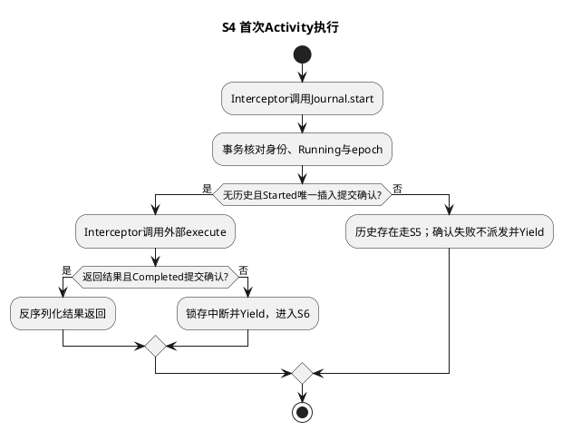
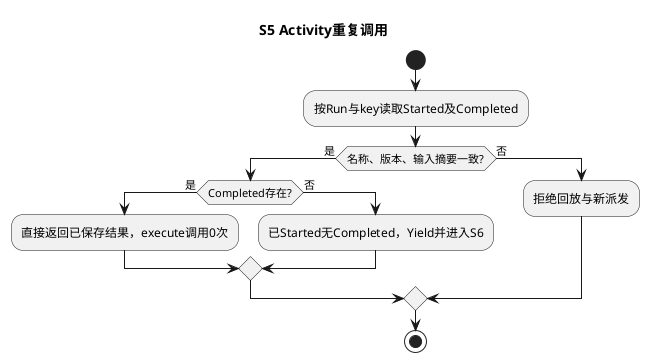
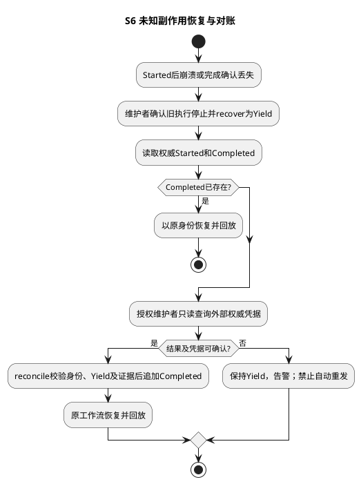
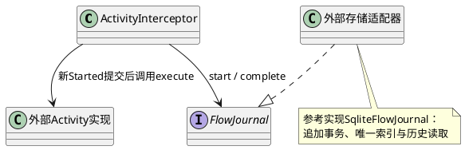

# SR-FE-SYS-02：Activity指令执行与The Magic

用户为业务开发者和对账维护者。前置条件是所有外部调用经过拦截接口；授权仍由现有PDP/PEP执行，Activity命中结果不构成新的执行授权。

## 指令接口与实现分解

`context.activity(activity: FlowActivity, execute: () => Promise<unknown>): Promise<unknown>`是业务动作的统一入口。FlowActivity明确key、name、version、input；name是动作身份，当前不会根据name自动查找处理器，调用方必须传入execute。框架不知道“调用模型”“转账”“无人执行第几轮”等含义。它只调用外部模块提供的回调并保存结果。

| 框架协作者 / 接口 | 实际职责 |
| --- | --- |
| ActivityInterceptor.execute | 调用journal.start；completed直接返回结果；已有未完成Started抛出FlowYield；新登记成功后调用execute再complete |
| FlowJournal.start(token, activity) | 事务内读历史与身份校验、验证Running代次、唯一登记；返回inserted及record |
| FlowJournal.complete(token, activity, result) | 验证代次及Started身份，追加完成结果；重复结果摘要必须一致 |
| FlowJournal.reconcile(flowRunId, activity, result, evidence) | 受信维护入口；要求Yield及外部权威凭据，追加Completed；不重新执行回调 |

源码：[ActivityInterceptor](../../../../../../src/control/flow-engine/activity-interceptor.ts)、[日志端口](../../../../../../src/contracts/control/flow-engine/flow-engine-contract.ts)、[SQLite参考适配](../../../../../../src/infrastructure/state-storage/adapters/flow-engine/sqlite-flow-journal.ts)。下面的数据与故障条款只规定该指令的执行保证，不展开外部授权、存储服务或业务工具设计。

数据契约：独立`flow-system.sqlite`，schema版本1；`system_flow_events`按(scope,run_id,log_sequence)主键，只INSERT。字段包含事件类型、JSON载荷、可空activity_sequence/activity_key；唯一(scope,run_id,activity_sequence,kind)及(scope,run_id,activity_key,kind)。Started和Completed共享activity_sequence，log_sequence不同。序号为正安全整数，禁止复用；每次回环使用新key。输入和结果使用有界规范JSON（首版复用整数JSON编码，非整数数值以字符串表达），单项最多2MiB。

读写：受理写Run_Admitted；生命周期写State_Changed；Activity按key读取Started及对应Completed并校验身份；无记录时在BEGIN IMMEDIATE内验证代次、分配序号、INSERT Started、COMMIT，再调用外部实现；结果以Completed新行提交。UPDATE/DELETE触发器拒绝修改历史；没有可覆盖的权威快照。主键和事务避免并发重复受理。SQLite同步FULL/WAL；文件权限和备份由部署边界控制。

主成功场景S4及重复S5：

异常场景S6：Started提交后任意时点崩溃（包括外部成功、Completed之前）均不能推断未生效。查询权威外部凭据；仅维护可信入口可提交对账结果及证据引用。未能确定时保持Yield，不提供通用“再试一次”。

SFMEA：F1数据库不可写→不派发；F2竞争Started→失败方不派发；F3结果提交失败→Yield、对账；F4相同key输入漂移→拒绝；F5陈旧代次→拒绝提交/新增调用；F6改写历史→数据库触发器拒绝UPDATE、DELETE以及通过INSERT OR REPLACE替换已有主键或Activity身份。数据库文件管理员仍能删除库或撤销触发器，文件系统权限属于宿主信任边界。日志保证框架不盲目重复发起，不声称独立外部系统具有物理exactly-once事务。

## 内部类关系

## 测试用例设计与真实环境测试手段

| 场景/风险 | 测试层级、输入与注入 | 独立验收条件/已有定位 |
| --- | --- | --- |
| S4 唯一首次调用 | 系统集成：双连接同时Started；同key异输入 | 一次资格/一次调用，异身份拒绝；AK-FS-003 |
| S5 已完成回放 | DT/UT及重开SQLite：固定result=null和对象结果 | 回放结果一致，execute调用增量0；AK-FS-002 |
| S6 提交不明 | 混沌：Started提交确认丢失，或合成账本生效后SIGKILL | 前者外部调用0；后者不重发，Yield等待凭据；AK-FS-005/010 |
| F6 历史破坏 | 系统集成：UPDATE/DELETE/REPLACE、陈旧epoch写入 | 修改拒绝、原历史保持；AK-FS-004及追加日志负向用例 |
| 外部维护接入 | 端到端：独立临时账本+保留卷重启+受信reconcile | 只追加结果、不执行第二次副作用；无真实财务操作 |

F1～F6对应前述SFMEA；现有用例执行情况见验证记录。当前接口仅支持Yield对账，不提供终态reconcileTerminal。

可测试手段：依赖注入FlowJournal与Activity实现；公开只读history返回序号、事件类型、代次；测试独立临时数据库；显式recover/reconcile入口用于受信维护，不暴露为匿名HTTP接口。敏感输入/结果不得进入默认诊断日志；完整日志仅供受授权调用方访问。告警关注Yield未知结果、日志提交失败及持续Running，不引入执行槽、资源分配或RuntimePool组件。

实际命令和结果见[验证记录](../../../../../verification/flow-engine-naming-validation.md)。不能用旧FE-CON-1报告证明系统协议通过。

相关SR：[SR-FE-SYS-01](sr-01-lifecycle.md)、[SR-FE-SYS-03](sr-03-task-graph.md)。返回[FlowEngine设计](README.md)。

## 字段、升级与维护约定

| 字段/事实 | 写入者与约束 | 读取者 |
| --- | --- | --- |
| scope/run_id | scope由服务固定；run_id为1～256位ASCII标识 | 所有查询强制scope隔离 |
| log_sequence | 单Run事务分配连续正安全整数，主键唯一 | get重建四态，transition使用日志尾CAS |
| activity_sequence/key | start首次分配序号；稳定key同时唯一；Completed复制原序号 | 拦截器按key定位序号并比对身份摘要 |
| Run_Admitted.payload | identity、workflowVersion；不存完整初始输入 | admit核对同Run输入和版本；宿主负责保留程序输入 |
| State_Changed.payload | action、稳定reason、result；启动序号即epoch | 生命周期重放；禁止旧epoch新增调用或写结果 |
| Activity_Started.payload | sequence、identity、epoch、name、version | 回放/对账；摘要覆盖key、名称、版本、输入 |
| Activity_Completed.payload | sequence、identity、result、evidence；直接完成evidence为null | 回放反序列化；重复结果必须摘要一致 |
| Checkpoint.payload | digest、value；key存独立列 | 同key同值幂等，同key异值拒绝 |

首次建库设user_version=1；未知版本关闭连接并拒绝启动。升级前停止宿主，备份数据库及WAL/SHM；没有在线重写历史或混合版本迁移功能。备份回滚必须匹配工作流版本和外部凭据，不能通过旧备份抹掉已发生的外部效果。

reconcile只在Yield接受完整Activity身份、规范JSON结果和非空证据引用；数据库能核对身份，不能证明外部凭据真实性。维护方须先查询权威外部系统并核验权限；CLI不提供自动重发。停止旧宿主后调用recover撤销代次，陈旧回调不能提交；其已发出的网络请求仍可能在外部完成。

顺序约定：序号由首次登记顺序分配，稳定key由工作流作者提供；本实现不是透明拦截任意JavaScript调用的虚拟机，不自动检测不同key之间的重排。恢复所用业务版本须保持确定性，外部调用、随机数及时间依赖必须通过Activity或已保存输入表达。图执行器自动为每次visit划分命名空间。
