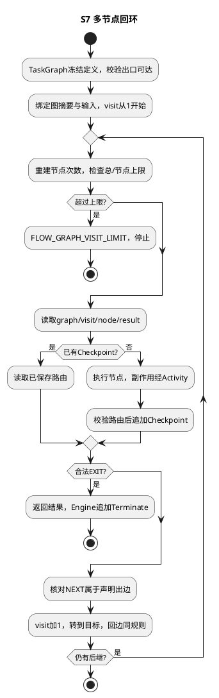
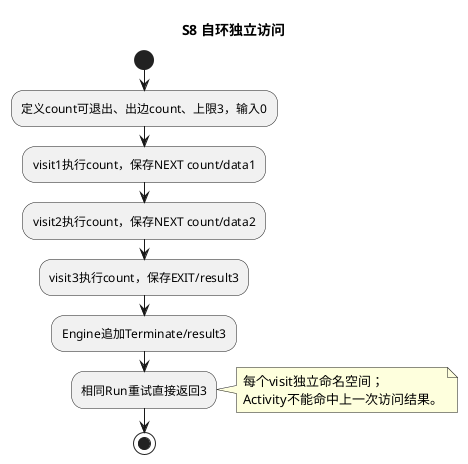
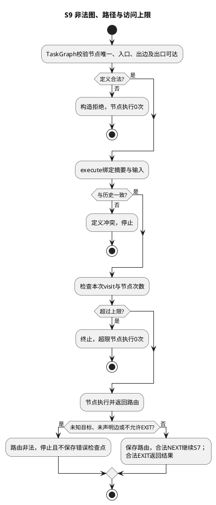
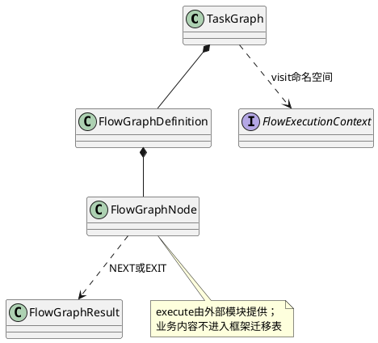

# SR-FE-SYS-03：单Flow内部关联、路由与循环

当前实现边界：本页的节点共享一个flowRunId、系统四态和日志；节点自身不是独立Flow实例。跨 flowRun 调度不属于当前交付范围，候选方案统一由[扩展索引](../../../../../extensions/README.md)管理。

用户为工作流作者。前置条件：图ID/版本、入口、节点、允许的出边、每个节点最大访问次数及总访问上限明确；至少一个节点允许退出。图由受信任代码注册，禁止将HTTP输入作为代码执行。功能点：转向、回环、退出、重放。

AR：TaskGraph校验拓扑和出口可达性，但不拒绝环；TaskGraph.execute驱动节点处理器，处理器只返回`next(target,data)`或`exit(result)`。节点处理器可以经context调用Activity；节点结果作为单独的确定性检查点追加，不能把整个包含外部调用的节点包成一个不可恢复Activity。路由/节点访问使用唯一`graph/visit/node/activityKey`身份，图版本由独立graph/binding检查点摘要绑定。

## 接口与路由指令

完整类型见[flow-graph.ts](../../../../../../src/contracts/control/flow-engine/flow-graph.ts)，实现见[TaskGraph](../../../../../../src/control/flow-engine/task-graph.ts)。`new TaskGraph(definition: FlowGraphDefinition)`冻结图结构；`execute(context: FlowExecutionContext, input: unknown): Promise<unknown>`按入口顺序推进。

| 定义 / 指令 | 字段、读取及执行 |
| --- | --- |
| FlowGraphDefinition | id、version、entry、maxVisits、nodes；构造时校验入口、唯一节点及退出可达性 |
| FlowGraphNode | id、version、next、canExit、maxVisits、execute；next声明允许关联的静态节点ID |
| FLOW_GRAPH_ROUTE.NEXT | 处理器返回kind、target、data；target必须属于当前节点next；保存路由后进入下一次visit |
| FLOW_GRAPH_ROUTE.EXIT | 处理器返回kind、result；当前节点必须canExit；返回图结果，由外层FlowEngine终止Run |

框架根据Map索引选择节点，业务回调只决定路由结果；不会在中央循环判断业务名称。回边与普通边执行同一算法。graph/binding固定定义摘要和输入；每个visit的result检查点保存完整路由，不依靠恢复时重新猜测分支。单个Run当前只应运行一份TaskGraph：检查点使用固定graph命名空间，不能把多个图拼在同一Run中而假定互不冲突。

主成功场景S7：A→B→A循环三次后业务谓词成立退出。每次访问独立序号；恢复从入口重放已完成节点的路由与结果。特殊S8：自环同样合法；异常S9：未知目标、未声明出边、总/节点访问上限到达必须停止，不能继续外部调用。







升级：图定义摘要绑定运行输入，拓扑、节点版本、上限发生变化须使用新版本；不迁移运行中visit编号。仅提升图版本名称而保留同Run也拒绝。恢复不能跳过历史未完成Activity。


## 内部类关系



## 测试用例设计与真实环境测试手段

| 场景/风险 | 测试层级、输入与注入 | 独立验收条件/已有定位 |
| --- | --- | --- |
| S7 回环重复 | DT/UT及系统集成：A→B→A，节点含计数Activity | 每visit新key；重放调用增量0；AK-FS-006 |
| S8 自环退出 | DT/UT：输入0，固定三次计数，EXIT=3 | visit1/2/3路由固定；结果3；AK-FS-008 |
| S9 非法定义/路径 | DT/UT：出口不可达、未声明边、同Run改图 | 构造或执行拒绝；非法后继调用0；AK-FS-007/008 |
| S9 上限 | DT/UT：退出谓词恒false，L-1/L/L+1边界 | 超限节点不执行，FLOW_GRAPH_VISIT_LIMIT；AK-FS-007 |
| 检查点窗口 | 混沌设计：Activity完成后、节点Checkpoint前退出进程 | 恢复回放Activity并补Checkpoint，不重复外部动作；G4补专门注入组合 |
| 独立宿主 | 端到端：普通计数/合成账本图保留卷重启 | 原图版本、输入和visit恢复一致；不依赖DeepSeek |

SFMEA：图漂移拒绝，路由非法停止，缺失检查点重放，未知Activity阻断，循环次数受限；回调永久不返回由宿主截止时间和进程中止处理。结构验收增加C节点仅改图定义/回调，不改TaskGraph循环；共享规则抽取后两种调用方均需跑边界回归。

可测试手段：依赖注入FlowJournal与Activity实现；公开只读history返回序号、事件类型、代次；测试独立临时数据库；显式recover/reconcile入口用于受信维护，不暴露为匿名HTTP接口。敏感输入/结果不得进入默认诊断日志；完整日志仅供受授权调用方访问。告警关注Yield未知结果、日志提交失败及持续Running，不引入执行槽、资源分配或RuntimePool组件。

实际命令和结果见[验证记录](../../../../../verification/flow-engine-naming-validation.md)。不能用旧FE-CON-1报告证明系统协议通过。

相关SR：[SR-FE-SYS-01](sr-01-lifecycle.md)、[SR-FE-SYS-02](sr-02-activity.md)。返回[FlowEngine设计](README.md)。

韧性与读写：每次访问先读graph/visit/node/result；缺失时才运行节点并追加Checkpoint。循环中断后从入口重建访问计数并读取既有路由，不覆写历史。次数上限限制节点访问数，不能抢占恶意死循环或永不返回的Promise；可信宿主须为外部实现提供截止时间和进程级中止。框架不提供任意JavaScript沙箱。

## 开发调用示例

以下为顺序图执行：同一节点允许回到自身，业务值达到3时退出；固定输入和图版本用于恢复。这里只做纯计数；若节点需要网络或持久写入，必须在execute内部使用context.activity，不能直接执行外部副作用。

```typescript
import { FLOW_GRAPH_ROUTE, FlowEngine, TaskGraph } from "lawclaw-agent-kernel";
import type { FlowJournal } from "lawclaw-agent-kernel";

async function countWithCycle(journal: FlowJournal, flowRunId: string) {
  const graph = new TaskGraph({
    id: "counter", version: "v1", entry: "count", maxVisits: 3,
    nodes: [{
      id: "count", version: "v1", next: ["count"], canExit: true, maxVisits: 3,
      execute: async (_context, input) => {
        const value = Number(input) + 1;
        return value === 3
          ? { kind: FLOW_GRAPH_ROUTE.EXIT, result: value }
          : { kind: FLOW_GRAPH_ROUTE.NEXT, target: "count", data: value };
      },
    }],
  });
  return new FlowEngine(journal).run(
    { flowRunId, workflowVersion: "counter-v1", input: 0 },
    context => graph.execute(context, 0),
  );
}
```

运行得到Terminate与result=3；相同flowRunId再次调用返回原结果。canExit声明允许的出口，execute里的value===3是业务退出条件，maxVisits是条件失效后的系统保护。更改条件的语义时升级节点/图/工作流版本，并为新工作建立新flowRunId。AK-FS-008执行等价自环分支；AK-FS-006验证带Activity的多节点回环。
