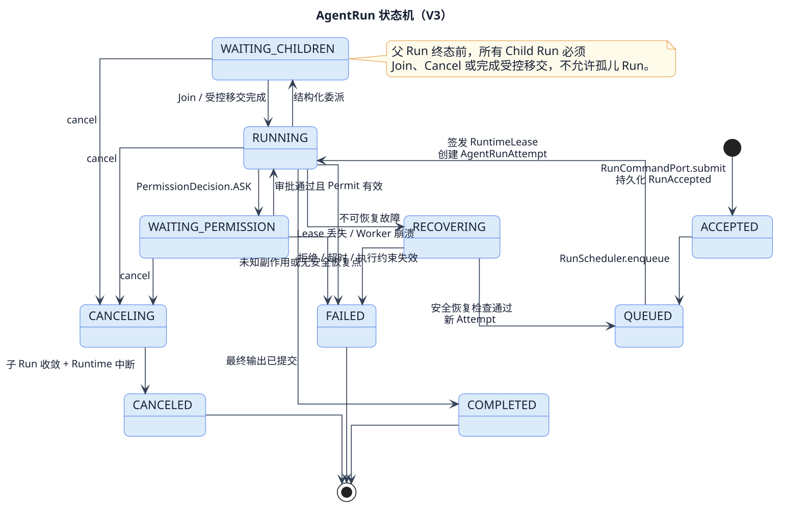
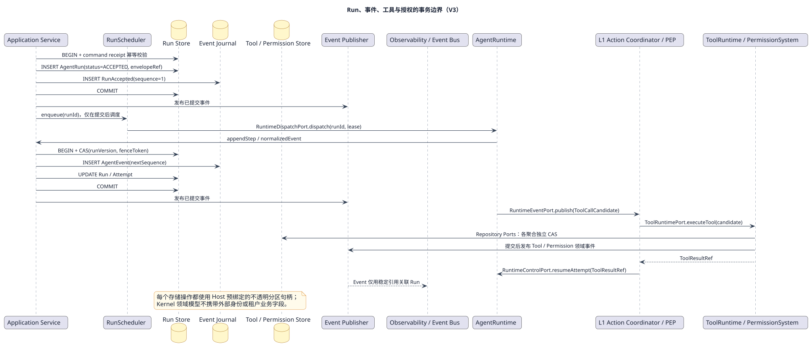

# RunRegistry 组件设计

## 1. 目标与非目标

RunRegistry 为 `AgentRun` 提供唯一创建、查询、取消、执行事件提交和恢复查询入口。它保护 Run、Attempt、Step、预算、冻结路由、事件序号、等待引用、取消和终态不变量。

它不选择下一个 Run、不拥有 Runtime、不维护 Session 内容、不执行 Flow 算法，也不依据业务价值安排顺序。

## 2. 所有状态与不变量

`AgentRun` 是本组件权威聚合根并拥有 `AgentRunAttempt` 与按序的 `AgentLoopStep`。事件在单 Run 内严格递增；终态不可逆；取消栅栏建立后禁止新增模型、工具、记忆写入和 Child Run。

恢复保持原 `runId` 并创建新 Attempt。`RouteSnapshot` 和 `ExecutionEnvelopeRef` 在 Run 内冻结，不能被最新 Registry 或策略版本静默替换。

## 3. Port

| 方向 | Port | 语义 |
|---|---|---|
| 入站 | `RunCommandPort` | 幂等创建、取消和恢复 Run |
| 入站 | `RunQueryPort` | 查询权威 Run/Attempt 快照 |
| 入站 | `RunExecutionPort` | 提交 Attempt/Step 的版本化执行事实 |
| 入站 | `RuntimeEventPort` | 接收 L2 规范化事件与动作候选，先入 Journal |
| 入站 | `RunEventQueryPort` | 按 sequence 补拉持久事件 |
| 出站 | `RunRepositoryPort` | 独立事务保存 Run 聚合与幂等回执 |
| 出站 | `DomainEventPort` | 提交后通知 Scheduler 和订阅者 |

## 4. 生命周期与算法

[查看 PlantUML 权威源](../../../diagrams/components/l1-control/04-run-state-machine.puml)

外部意图先建立已受理 Run；Scheduler 获得派发资格后创建 Attempt；Runtime 事件按 attempt 与 sequence 校验后持久化，并驱动 FlowEngine 计算的命令提交。等待审批/工具/外部事件时保存稳定 waitReasonRef 并进入挂起；终态提交关闭后续写入口。

### 4.1 事务边界

[查看 PlantUML 权威源](../../../diagrams/scenarios/09-persistence-transaction.puml)

## 5. 韧性与可观测性

- 写命令保存幂等键及载荷摘要；同键异载荷冲突。
- expectedVersion 冲突不覆盖，旧 Attempt 回调按 attempt/version 拒绝。
- 多 Worker 档案才启用 Lease/Fence；启用后旧 Fence 写入必须失败。
- 事件发布失败不回滚已提交事实，由 Journal 补拉与分发恢复。
- 记录状态迁移、冲突、重复事件、等待原因、终态和未知副作用引用。

## 6. 验收

- 每个 Run 只有一个权威状态序列，Session、Scheduler 和 Runtime 不复制它。
- 重复 RuntimeEvent 不增加 Step、命令或副作用次数。
- 终态或取消栅栏之后的新动作全部被拒绝。
- Host 重启能仅凭 Repository 和 Journal 找到非终态 Run。
