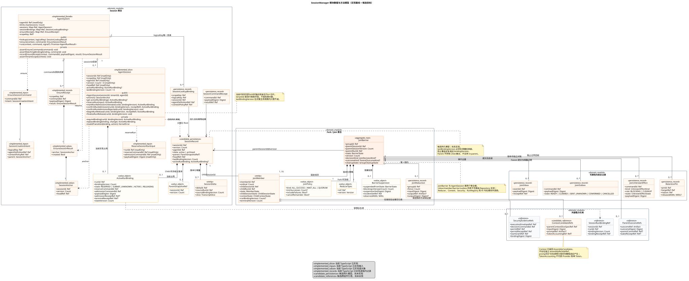
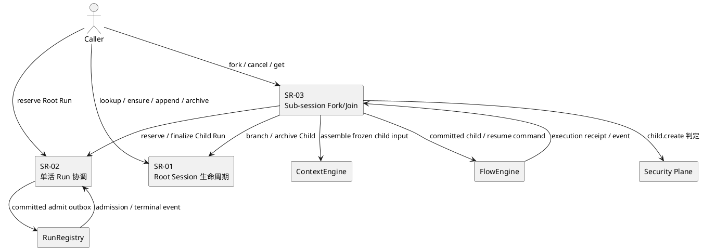

# SessionManager 组件设计总览

## 1. 组件职责

SessionManager（SM）管理可持久、可卸载、可分支的技术 Session，并保护每个 Session 的 `0..1` 当前活跃 Run 绑定。它不保存 Run 历史集合、不在 Session 内排队多个 Run，也不拥有单个 Run、Attempt 或 Flow 的执行状态。

SM 内部的 `SubSessionCoordinator` 负责 sub-session 的 Fork、Child 创建与归档、Child Run 编排、Join、Reduce 和 Parent Run 唤醒。权限决定、Permit、StartGrant、撤销状态归 Security Plane；上下文选择与 Token 计量归 ContextEngine；Run/Attempt 权威状态归 RunRegistry；单 Flow 执行归 FlowEngine。

## 2. 三个功能实现域

| 功能域 | 权威实现设计 | 完整业务能力 | 主要权威状态 |
|---|---|---|---|
| `SR-SESSION-01` Root Session 生命周期 | [Root Session 生命周期](session-manager/sr-01-root-session-lifecycle.md) | `lookup / ensure / snapshot / append / archive`、逻辑键唯一性、版本与恢复 | `AgentSession`、`SessionLookupBinding`、Session 命令回执 |
| `SR-SESSION-02` Session 单活 Run 协调 | [Session 单活 Run 协调](session-manager/sr-02-single-active-run.md) | 唯一占槽、Run 受理、UNKNOWN 对账、终态 finalization 与释放 | `ActiveRunBinding`、受理/释放回执与 outbox/inbox |
| `SR-SESSION-03` Sub-session Fork/Join | [Sub-session Fork/Join](session-manager/sr-03-subsession-fork-join.md) | Fork、选择性父上下文、Child 生命周期、Join/Reduce、Parent 唤醒 | `ParentSnapshotRef`、`JoinBarrier`、`JoinMember`、协调可靠性记录 |

`JoinBarrier` 的状态、事件、守卫和迁移矩阵单独由 [AR-SM-JOIN-001](session-manager/join-barrier-state-machine.md) 维护；同一 Run 的 Attempt 接管测试由 [VER-SES-TAKEOVER-001](session-manager/session-takeover-tests.md) 维护。功能实现文档负责场景闭环，AR 和 Verification 文档不得反向改变功能边界。

## 3. 模块级定义权威与当前实现基线

本组件文档是三个功能域使用的数据、类和方法的模块级权威来源。`contracts/` 继续拥有跨组件序列化 Schema，但必须先由本组件绑定其版本、所有权和使用语义；功能域文档只能裁剪本节已经定义的类型和方法，补充本域场景中的输入映射、调用顺序、状态变化和测试，不得自行增加字段、方法或另立同名 DTO。

本节使用三种证据状态：

- **已实现**：当前 TypeScript 中存在，字段和签名必须与代码一致。
- **候选目标**：模块已接受的目标模型，但尚无实现证据。
- **开放**：现有来源冲突或字段、签名仍不足；关闭前功能域不得自行决定。

### 3.1 第一版切片已经实现的数据

当前实现覆盖 `AgentSystem` 的进程内显式 Session 目录，以及 `AgentSession` 的单活 Run 绑定。以下定义分别对应 [AgentSystem 实现](../../../../../src/control/agent-system.ts)、[SessionManager 契约源码](../../../../../src/contracts/control/session-manager/session-manager-contract.ts) 和 [AgentSession 实现](../../../../../src/control/session-manager/agent-session.ts)：

```text
ActiveRunBindingState =
  RESERVED | SUBMIT_UNKNOWN | ACTIVE | RELEASING

ReserveSessionRunInput = {
  runId: Ref,
  reserveCommandId: Ref,
  admissionCommandId: Ref,
  payloadDigest: Digest
}

ActiveRunBinding = {
  runId: Ref,
  bindingVersion: Count,
  state: ActiveRunBindingState,
  reserveCommandId: Ref,
  admissionCommandId: Ref,
  payloadDigest: Digest,
  admissionReceiptRef: Ref|null,
  terminalReceiptRef: Ref|null,
  stateVersion: Count
}

AgentSessionImplementedState = {
  sessionId: Ref,                         // readonly
  scopeKey: Ref,                          // readonly，现行进程内隔离字段
  agentId: Ref,                           // readonly
  version: Count,                         // readonly；当前切片固定 Root@0
  headRef: Ref,                           // readonly；Root@0 空历史头
  activeRunBinding: ActiveRunBinding?,    // private；缺失表示 IDLE
  lastBindingVersion: Count               // private；初值 0，只增不减
}

AgentSystemSessionDirectory = {
  agentId: Ref,                           // readonly
  limits.maxSessions: Count,              // 正整数，由配置校验
  sessions: Map<sessionId, AgentSession>, // private；仅 ensure 增加
  sessionBindings: Map<logicalKey, SessionLookupBinding>,
  ensureReceipts: Map<commandId, EnsureReceipt>,
  scopeKey: Ref?                          // private；首次创建后固定
}

SessionLookupBinding = {
  scopeKey: Ref,
  logicalKey: Ref,
  sessionId: Ref,
  agentDefinitionRef: Ref,
  contextPolicyRef: Ref
}

EnsureReceipt = {
  scopeKey: Ref,
  commandId: Ref,
  payloadDigest: Digest,
  result: {anchor: SessionAnchor, created: Bool}
}
```

`ActiveRunBinding` 每次写入均以冻结新对象替换旧值。首次 reserve 的 `stateVersion=1`，每次绑定内部状态变化加一；同一绑定存续期间 `bindingVersion` 不变。当前代码只保证 `lastBindingVersion` 在同一个 `AgentSession` 对象生命周期内单调，尚不构成重启后的持久保证。

候选持久 `SessionRecord` 必须保留以下状态：

```text
SessionRecord = {
  sessionId: Ref,
  version: Count,
  agentId: Ref,
  state: active | archived,
  parent: ParentSnapshotRef|null,
  headRef: Ref,
  lastBindingVersion: Count,
  activeRunBinding: ActiveRunBinding|null
}
```

`lastBindingVersion` 是从当前实现反推得到的必要持久字段：绑定释放后 `activeRunBinding=null`，不能再从当前绑定推导下一代次；如果重启后复用旧代次，旧终态事件可能命中新 Run。`CD-1 SessionRecord` 目前缺少该字段，记录为 `OPEN-SM-DATA-01`，同步契约和迁移设计前不得实现持久 reserve。

当前 `scopeKey` 由 `AgentSystem` 从可信 `RequestContext` 提取，仅作为进程内隔离代理，不是由调用载荷提交的权限对象。持久实现仍须由 `TrustedScope` 与 Repository 键共同注入作用域，功能域不得把进程内代理复制成公共 DTO。

### 3.2 第一版切片已经实现的方法

| 所有者 | 方法签名 | 状态变化与结果 | 失败语义 | 证据 |
|---|---|---|---|---|
| `AgentSystem` / `SessionQueryPort` | `lookup(context,logicalKey): SessionLookupResult` | 仅查 logical binding；缺失返回 `{state:absent}`，不生成 ID、Session 或回执 | 已绑定其他租户时抛 `TENANT_SCOPE_VIOLATION`；悬空 binding 返回 `SESSION_NOT_FOUND` | 已实现，`AK-SESSION-006/008` |
| `AgentSystem` / `SessionCommandPort` | `ensure(context,{commandId,intent}): EnsureSessionResult` | 首次生成 Session ID、Root@0、binding 和原始回执；竞争失败返回赢家锚点及 `created=false`；同命令重放返回原结果 | Root intent 非法、容量满、绑定不匹配或同命令异载荷明确拒绝 | 已实现，进程内原子切片；`AK-SESSION-006～008` |
| `AgentSystem` | `run(context,command,signal?): Promise<AgentRunResult>` | 只接受 ensure 已确认的 `sessionId`；缺失时不创建、注册或执行 Run | 缺失抛 `SESSION_NOT_FOUND`，Session/Run 写入均为 0 | 已实现，`AK-SESSION-005` |
| `AgentSession` | `constructor(sessionId, scopeKey, agentId)` | 创建空闲 Root@0 与空 `headRef`；`lastBindingVersion=0` | 当前没有公开构造输入格式校验，由 ensure 入口约束 | 已实现 |
| `AgentSession` | `anchor(): SessionAnchor` | 返回 `sessionId/version/headRef` 的冻结值，不暴露当前 Run 绑定 | 无副作用 | 已实现 |
| `AgentSession` | `get activeRunBinding(): ActiveRunBinding?` | 返回当前冻结绑定；缺失即 IDLE | 无副作用 | 已实现 |
| `AgentSession` | `reserveRun(input): ActiveRunBinding` | 空槽时递增 `lastBindingVersion`，创建 `RESERVED@stateVersion=1` | 非空槽抛 `SESSION_RUN_ACTIVE`；不排队、不抢占 | 已实现 |
| `AgentSession` | `markRunAdmissionUnknown(runId,bindingVersion): ActiveRunBinding` | `RESERVED -> SUBMIT_UNKNOWN`；重复 UNKNOWN 返回原绑定 | 身份/代次不匹配或其他源状态抛 `RUN_STATE_INVALID` | 已实现 |
| `AgentSession` | `confirmRunAdmission(runId,bindingVersion,admissionReceiptRef): ActiveRunBinding` | `RESERVED/SUBMIT_UNKNOWN -> ACTIVE`；同回执重投返回原绑定 | 身份、代次、状态或 ACTIVE 异回执不匹配时抛 `RUN_STATE_INVALID` | 已实现 |
| `AgentSession` | `confirmRunAdmissionRejected(runId,bindingVersion): void` | 仅在 `RESERVED/SUBMIT_UNKNOWN` 且调用方已证明不会迟提交时清槽 | 方法本身不验证外部“无迟提交证明”；身份/状态错误抛 `RUN_STATE_INVALID` | 已实现，外部证明尚未接入 |
| `AgentSession` | `beginRunRelease(runId,bindingVersion,terminalReceiptRef): ActiveRunBinding` | `ACTIVE -> RELEASING`；同终态回执重投返回原绑定 | 旧 Run、旧代次、错误状态或异回执抛 `RUN_STATE_INVALID` | 已实现 |
| `AgentSession` | `finalizeRunRelease(runId,bindingVersion): void` | 仅从 `RELEASING` 清槽，允许后续 Run 顺序占用 | 身份、代次或状态不匹配抛 `RUN_STATE_INVALID` | 已实现 |
| `AgentSession` | `#requireBinding(runId,bindingVersion): ActiveRunBinding` | 统一执行当前绑定身份和代次守卫 | 失败为 `RUN_STATE_INVALID` | 已实现 |
| `AgentSession` | `#replaceBinding(binding,change): ActiveRunBinding` | 冻结替换绑定并令 `stateVersion+1` | 只接受状态及两个回执引用的受限变化 | 已实现 |
| `AgentSession` | `#invalidTransition(binding,action): KernelError` | 构造稳定状态错误及诊断字段 | 不改变聚合 | 已实现 |

`AgentSystem.lookup/ensure` 是 SR-SESSION-01 当前进程内 Port 切片；`RootSessionPreparationCoordinator.prepare` 在应用层执行 `lookup → candidate → ensure`，并在 `created=false` 时用赢家锚点重新组装。`AgentSession` 方法是 SR-SESSION-02 类图和算法的现行方法来源。功能域可以解释某个场景调用哪个方法，但不能改写外部输入/输出来迎合内存实现。

### 3.3 当前调用路径与目标差异

当前 [AgentSystem](../../../../../src/control/agent-system.ts) 是第一版切片的直接调用方，不是目标 SessionManager Port 实现：

| 当前行为 | 目标模块语义 | 结论 |
|---|---|---|
| `AgentSystem.lookup(context,logicalKey)` 只读；`ensure` 接收稳定命令与完整 `SessionCreationIntent`，返回 `anchor/created` | Root 首次访问必须走纯读 `lookup`，候选成功后显式 `ensure` | 外部契约和进程内行为一致；当前 Map/同步临界区仅是内部简化，不证明持久唯一约束 |
| `RootSessionPreparationCoordinator` 在竞争失败时按赢家锚点重组候选 | 空历史候选不得改绑到其他命令创建的 Session | 已实现应用层进程内协调，`AK-SESSION-009/010`；候选保存、Run 条件采纳仍未接通 |
| `AgentSystem.run()` 同步 `reserveRun -> RunRegistry.register -> confirmRunAdmission` | 持久 reserve 与 Run admit 之间通过 outbox/inbox 隔离 | 只证明单进程顺序，不证明分布式受理 |
| `finally` 中连续执行 `beginRunRelease -> finalizeRunRelease` | 必须先确认最终 Session 数据，再清槽；Child 释放后才发布 `ChildRunFinalizedEvent` | 当前无最终 Session Delta，只是最小切片 |
| 进程内 `scopeKey` 由 `AgentSystem` 从可信上下文提取并约束实例 | 目标由 `TrustedScope` 和 Repository 键隔离 | 外部契约一致；持久 ScopedRepository 尚未接入 |

当前实现未调用 `markRunAdmissionUnknown`，也没有持久 receipt、outbox/inbox、恢复 scanner 或跨进程 CAS；已实现方法的存在不代表这些外层协议完成。

## 4. 模块候选共享数据模型



[查看 PlantUML 权威源](../../../diagrams/components/l1-control/12-session-manager-data-model.puml)

该类图统一表达当前实现切片与三个功能域候选状态之间的身份和多重性。图中 `implemented` 与 `candidate` 必须按证据区分；每个 SR 只能引用或裁剪本图，解释本域字段的产生时刻、事务写集和消费方式，不得修改模块字段或方法定义。共享模型只有以下一组权威关系：

```text
AgentSessionImplementedState 1 o-- 0..1 ActiveRunBinding
SessionRecord 1 o-- 0..1 ActiveRunBinding
Child SessionRecord 1 --> 0..1 ParentSnapshotRef
JoinBarrier 1 *-- 1..16 JoinMember
JoinMember --> childSessionId + childRunId
JoinMember --> Security / Context / Run 外部回执引用
```

Parent 聚合不反向持有 Child 对象或可变集合。运维反查依赖 Repository 索引，不形成第二份领域血缘。

## 5. 跨域公共不变量

1. 同一 `(scopeKey, sessionId)` 的 `activeRunBinding` 基数始终为 `0..1`；不存在 `runIds[]`、`pendingRuns[]`、`maxRunsPerSession` 或 Session 级 Run 队列。
2. Root Session 只由显式 `ensure` 创建；`lookup/snapshot` 缺失返回 `absent/NOT_FOUND/GONE`，不得暗中创建。
3. Child Session 只由 `branch` 从确切 Parent 版本创建；Parent 引用创建后不可变，不存在 re-parent 命令。
4. Session、Barrier、Member 不保存权限对象、策略快照或撤销状态；仅保存 Security 返回的不透明引用，引用本身不构成授权。
5. ContextEngine 不创建、归档或写 Session；SM 不复制 Context 选择器、Token 估算器或完整候选工作集。
6. RunRegistry 拥有 Run/Attempt 事实；FlowEngine 拥有单 Flow 执行事实；SM 只保存 Session 绑定和 Fork/Join 协调事实。
7. SM 的本地事务内不得调用 Context、Reducer、RunRegistry、FlowEngine 或 Provider。跨组件副作用只在提交后由 outbox 发送，结果经 inbox/稳定回执进入新事务。
8. Parent 等待 Child Join 与恢复使用同一个 Parent Run；每个 Child Session 各自最多一个 Child Run。
9. UNKNOWN 不等于失败或未受理。无法证明外部效果未发生时，只能用原 `commandId + payloadDigest` 对账，不能换身份重试或提前清理。
10. 逻辑归档与物理删除分离。Parent pin、回执、outbox、UNKNOWN 或 incident 存在时不得 GC。

## 6. Port 路由

| Port | 归属 SR | 调用承诺 |
|---|---|---|
| `SessionCommandPort` | SR-01；Child 归档由 SR-03 调用 | 显式确保 Root、追加和归档；写操作有稳定命令身份 |
| `SessionQueryPort` | SR-01 | 纯查询，不调用 `ensure/create/branch` |
| `SessionRunCommandPort` | SR-02 | 原子占用、确认和释放唯一 Run 绑定；不提供排队或抢占 |
| `SessionBranchPort` | SR-03 | 从确切 Parent 版本创建新 Child，禁止 re-parent |
| `SessionForkJoinPort` | SR-03 | 受理、查询、取消 Fork group；不暴露 Barrier 内部写入 |
| `SessionRepositoryPort` | SR-01/SR-02/SR-03 | 提供各自聚合的本地事务、版本 CAS、回执和 outbox 原子写 |
| Security Ports | SR-03 | 对精确 `child.create` 动作判定和消费；SM 不作第二次策略裁决 |
| `ContextPort` | SR-03 | 对冻结 Parent 范围组装 Child 候选；返回候选和 Token 计量，不写 Session |
| Run Ports | SR-02/SR-03 | 只消费已提交绑定或协调 outbox；UNKNOWN 查询原命令 |
| Flow Ports | SR-03 | 执行/取消 Child Flow、恢复 Parent；不读写 Barrier |

本组件定义公共方法集合、数据语义和功能域归属；[CD-1 SessionManager 契约](../../../contracts/component-development-contracts-v1.md#l1-cmp-005-session-manager) 维护与之绑定的跨组件序列化 Schema、错误集和协议版本。任何公共字段或方法变化必须先在本组件形成决定，再同步 CD-1；SR 只解释具体场景的使用，不复制出第二套公共 Schema。

当前代码已实现 `SessionQueryPort.lookup`、`SessionCommandPort.ensure` 的进程内语义切片和 `AgentSession` 内部方法；物理 Repository、跨进程唯一约束、CAS/outbox 仍未实现。候选方法集合以 CD-1 和 CTX-CON-1 为输入，以下开放项仍阻塞完整持久实现：

- `OPEN-SM-PORT-01` 已关闭：CD-1、CTX-CON-1、SR-01 与代码统一为 `lookup/ensure`；旧 `create({sessionId})` 不再是 Root 外部入口。
- `OPEN-SM-PORT-02`：`acceptChildTerminal(ChildRunFinalizedEvent)` 的返回类型和持久回执尚未定义。
- `OPEN-SM-PORT-03`：`SessionRepositoryPort` 目前只有事务职责，没有统一的模块级方法签名、事务计划类型和 CAS 结果联合。

功能域文档不得通过自行声明 Port 方法来关闭这些开放项。

## 7. 跨域调用链



顺序依赖不等于同步调用环：SR-03 组合 SR-01 和 SR-02 的入站能力，但 SR-01/SR-02 不回调 Coordinator；RunRegistry/FlowEngine 的结果只经事件进入新事务。

## 8. 上下层一致性

| 上层约束及来源 | 本组件落点 | 结论 | 处理 |
|---|---|---|---|
| 总设计：Session 只保存 `0..1 ActiveRunBinding`，历史 Run 归 RunRegistry | SR-02 状态机和数据模型 | 一致 | 持久化 CAS/校验仍待实现 |
| L1：Fork/Join/Reduce/唤醒归 SM，FE 只执行单 Flow | SR-03 与 AR-SM-JOIN-001 | 一致 | 结构测试禁止 FE 依赖 Barrier/SessionRepository |
| Security：Decision/Permit/Grant 只归 Security | 公共不变量与 SR-03 Security refs | 一致 | Session Schema 权限字段数必须为 0 |
| Context 新候选契约：创建发生在候选组装成功后 | SR-01 已按 `lookup → assemble → ensure` 解释 Root；SR-03 Child 顺序仍有待决项 | SR-03 证据不足 | 见 SR-03 `OPEN-SM-CTX-01`，关闭前不得实现 Child 创建流水线 |
| 当前代码：绑定释放后仍需保持代次单调 | `AgentSession.#lastBindingVersion`；候选 `SessionRecord.lastBindingVersion` | CD-1 冲突 | 关闭 `OPEN-SM-DATA-01` 后才能实现持久 reserve |

## 9. 旧章节迁移映射

| 原 `session-manager.md` 内容 | 新权威位置 |
|---|---|
| 首次访问、Root 唯一键、Session append/archive、Root SFMEA 与 `SES-T-12～22` | SR-SESSION-01 |
| `ActiveRunBinding`、受理/释放、`SES-RUN-T-01～06`、`SES-E2E-07` | SR-SESSION-02 |
| branch、Child 创建/归档、Context 继承、Fork/Join/Reduce、`SES-T-01～11`、`SES-JOIN-*`、`SES-E2E-01～06` | SR-SESSION-03 |
| Barrier 状态/事件/迁移矩阵 | AR-SM-JOIN-001，文件不变 |
| Attempt 接管测试 | VER-SES-TAKEOVER-001，文件不变 |
| 数据所有权、禁止依赖、跨域不变量、实现状态 | 本总览 |

旧大文档已保存在非规范归档中，不再是三类实现细节的权威来源。

## 10. 实现与证据状态

截至 2026-09-09，代码包含两个进程内切片：SR-01 已实现 `logicalKey` 纯查询、`SessionCreationIntent` 显式 ensure、`SessionAnchor/created` 结果、内存幂等回执与竞争赢家复用；应用层协调器已验证 Context 失败写入为0及竞争失败后按赢家锚点重组。SR-02 的 `AgentSession` 维护 `0..1 ActiveRunBinding` 的 `RESERVED / SUBMIT_UNKNOWN / ACTIVE / RELEASING` 迁移。SR-01 的持久 Repository/唯一约束/outbox、候选保存与 Run 条件采纳，SR-02 的持久 CAS/outbox/inbox 与 `SessionRunBindingRef` 校验，以及 SR-03 的 `SubSessionCoordinator/JoinBarrier` 均未实现。

现有定向 UT/DT 只能证明单进程对象行为。三份 SR 中标为“待实现/未运行”的持久化、系统集成、混沌和端到端用例仍不是运行证据；文档拆分本身也不改变候选设计的批准状态。
