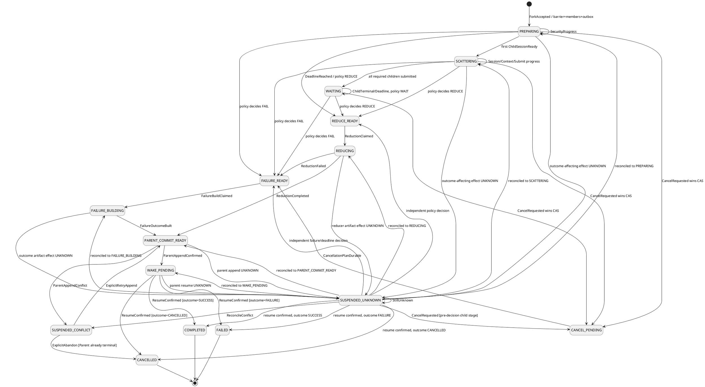
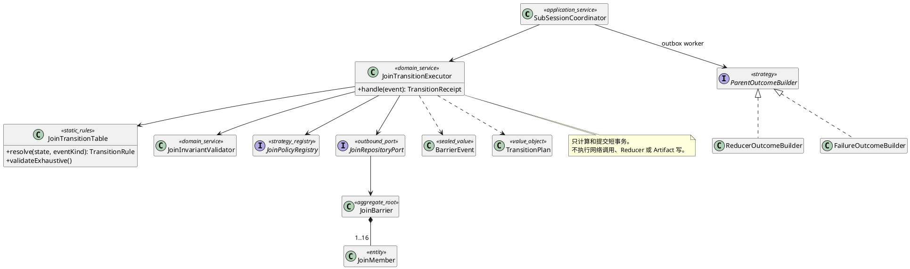

# AR-SM-JOIN-001：JoinBarrier 状态机详细设计

## 1. 范围与设计结论

本文是 [SR-SESSION-03](sr-03-subsession-fork-join.md) 内部 `SubSessionCoordinator` 的状态机权威来源。SR 文档负责职责、业务场景和端到端流程；本文只冻结 Barrier 的状态、事件、守卫、原子写集、并发裁决、恢复和测试。

核心结论：

1. `JoinBarrier` 是 Join group 的协调聚合根；`JoinMember` 是同一事务边界内的成员事实，不是独立调度器。
2. 所有改变 Barrier 的事件都经 `join_inbox` 去重，并在单个本地数据库事务中执行 member CAS、计数重投影、策略判定、Barrier CAS 和 outbox 写入。
3. 数据库事务中不调用 Security、ContextEngine、FlowEngine、Reducer 或 Artifact 服务；外部动作一律由事务提交后的 outbox 驱动。
4. 失败和取消也必须产生父 Session 可读的结构化结果，执行 `Parent append CAS -> ResumeParent`；不得从 `CANCEL_PENDING` 直接进入 `FAILED/CANCELLED` 而让父 Run 永久等待。
5. `SUSPENDED_UNKNOWN` 必须保存进入挂起前的状态、阻塞未知集合摘要和数量；每个未知命令各有一条 `join_unknown_effect`。恢复只能确认原效果或以原身份安全重投，不能互相覆盖、猜测成功、换 ID 或改读 latest。
6. Parent 结果已提交和 Child 清理已完成是两条正交事实。Parent 可以先获得确定结果；未收敛的 Child cancel/archive 继续留在 `cleanupState`，并阻止物理 GC，但不制造第二次 Parent 唤醒。
7. Parent Session 在整个 Wait/Join/Resume 期间继续由原 Parent Run 占用；每个 Child Session 在 Run 受理前必须经 `SessionRunCommandPort` 取得唯一绑定。Barrier 并发发生在多个 Session 之间，不允许一个 Session 内同时存在多个 Run。

本文是候选设计，不表示持久化 Schema、状态机实现或运行测试已经完成。

## 2. 状态空间与正交投影

### 2.1 Barrier 主状态

```text
BarrierState =
  PREPARING | SCATTERING | WAITING |
  REDUCE_READY | REDUCING |
  FAILURE_READY | FAILURE_BUILDING |
  PARENT_COMMIT_READY | WAKE_PENDING |
  CANCEL_PENDING |
  COMPLETED | FAILED | CANCELLED |
  SUSPENDED_UNKNOWN | SUSPENDED_CONFLICT
```

| 状态 | 唯一含义 | 可持有的未完成工作 |
|---|---|---|
| `PREPARING` | Fork 已耐久受理，Child 安全资格和分支尚未全部确认 | authorize、branch outbox |
| `SCATTERING` | 至少一个 Child 正在分支、组装 Context、占用唯一Run槽或提交 Run/FE | assemble、reserve/admit outbox |
| `WAITING` | 必要 Child 已提交，等待终态或 deadline | terminal event、deadline |
| `REDUCE_READY` | 策略已原子决定 Reduce，尚未领取规约工作 | reduction claim |
| `REDUCING` | 唯一 fence 的 Reducer 正在事务外运行 | reducer receipt |
| `FAILURE_READY` | 已决定向 Parent 写失败/取消结果，尚未领取构造工作 | outcome build claim |
| `FAILURE_BUILDING` | 正在构造确定性失败或取消 Artifact | outcome build receipt |
| `PARENT_COMMIT_READY` | Parent outcome 已冻结，等待对 Parent Session 做版本 CAS | parent append receipt |
| `WAKE_PENDING` | Parent append 已确认，等待 FE 幂等唤醒回执 | resume receipt |
| `CANCEL_PENDING` | 显式 cancel 已先于 Join 决策提交，取消栅栏和补偿计划已耐久化 | cancellation outcome trigger、Child cleanup |
| `SUSPENDED_UNKNOWN` | 至少一个影响 Parent 结果的外部效果不能确认 | 逐个原命令对账 |
| `SUSPENDED_CONFLICT` | Parent 版本或可信身份冲突，禁止自动 merge | 显式恢复决定 |
| `COMPLETED` | Parent 已收到成功/部分成功 outcome 且唤醒确认 | 只剩正交 cleanup/保留 |
| `FAILED` | Parent 已收到失败 outcome 且唤醒确认 | 只剩正交 cleanup/保留 |
| `CANCELLED` | Parent 已收到取消 outcome 且唤醒确认 | 只剩正交 cleanup/保留 |

`COMPLETED/FAILED/CANCELLED` 是 Parent 交付终态，没有主状态出边。终态后仍可幂等更新 `cleanupState`、archive 回执和保留引用；这不构成 Barrier 主状态复活。

### 2.2 决策与结果必须分离

```text
JoinDecisionKind = REDUCE | FAIL | CANCEL
ParentOutcomeKind = SUCCESS | FAILURE | CANCELLED
GroupCleanupState = NOT_REQUIRED | CANCEL_REQUESTED | CANCELLING | SETTLED | UNKNOWN
```

- `decisionKind` 由首个获胜的策略判定或显式 cancel CAS 写入，之后不可变。
- `outcomeKind` 在规约或失败结果构造完成后写入。Reducer 自身失败时，`decisionKind` 仍是 `REDUCE`，但 `outcomeKind` 为 `FAILURE`；不得篡改历史决策解释故障。
- `cleanupState` 与 Barrier 主状态正交。它决定能否 GC，不决定 Parent 是否可以看到已经确定的结果。

### 2.3 Member 与资源状态

```text
MemberState = RESERVED | SESSION_READY | CONTEXT_READY | SUBMITTED | RUNNING |
              SUCCEEDED | FAILED | TIMED_OUT | CANCELLED | UNKNOWN
ChildContextState = NOT_REQUESTED | ASSEMBLING | READY | FAILED | UNKNOWN
ChildSessionState = NOT_CREATED | CREATING | ACTIVE |
                    ARCHIVE_PENDING | ARCHIVED | CLEANUP_UNKNOWN
ChildRunBindingState = NOT_RESERVED | RESERVED | SUBMIT_UNKNOWN |
                       ACTIVE | RELEASING | RELEASED
```

只有 `SUCCEEDED/FAILED/TIMED_OUT/CANCELLED` 参与 JoinPolicy。Run来源的 `SUCCEEDED/FAILED` 必须由SessionManager校验当前绑定、完成Child finalization并释放后，以`ChildRunFinalized`进入Coordinator，避免Reducer在Child最后一段Session数据提交前启动。deadline或group cancel产生的 `TIMED_OUT/CANCELLED` 可在取消栅栏提交后参与失败策略，但没有Child成功结果；其绑定释放属于正交cleanup，未收敛时阻止归档/GC而不永久阻塞Parent。`UNKNOWN` 不是失败，也不增加任何终态计数。Member 首次明确终态 CAS 成功后不得被迟到事件改写；迟到事实进入审计记录。

`ChildRunBindingState` 是对 SessionManager `ActiveRunBinding` 回执的协调投影，不是第二份绑定权威。`CONTEXT_READY -> RESERVED` 成功后才可投递 Run admit；`SUBMIT_UNKNOWN` 只查原命令且阻止另一个 Run；Child 终态经绑定 `RELEASING -> RELEASED` 后才可归档 Child Session。Parent resume 复用原 `parentRunId`，不新建 Parent Run。

## 3. 状态图



图中的恢复目标不是由调用方指定。Coordinator 逐条核对 `join_unknown_effect`，在阻塞集合清零后只使用持久化的 `suspendedFromState` 和 member/decision/outcome/parentCommit/outbox 权威投影推导目标。

## 4. 事件契约

所有事件共有：`eventId,scopeKey,groupId,occurredAtMs,payloadDigest`。涉及 member 时还必须有 `memberId,childRunId`；涉及外部命令时必须有 `commandId,receiptRef,effect`。`effect=CONFIRMED|REJECTED|UNKNOWN|CONFLICT` 是 Adapter 对原命令回执的解释，不允许 Client 自报。

| EventKind | 关键载荷 | 来源与约束 |
|---|---|---|
| `ForkAccepted` | ForkSpec 摘要、Parent anchor、member identities | `SessionForkJoinPort`；只允许创建态 |
| `SecurityProgressed` | security refs、bindingDigest、effect | Security adapter；Ref 只关联，不代表授权 |
| `ChildSessionResolved` | branchCommandId、sessionVersion、effect | Session command adapter |
| `ChildContextResolved` | assemblyKey、frameRef、tokenAccountingRef、effect | Context adapter；必须绑定冻结 slice |
| `ChildSubmitResolved` | submitCommandId、FE receipt、effect | FE command adapter |
| `ChildRunningObserved` | childRunId、runVersion | FE event bus；仅作单调投影 |
| `ChildTerminalObserved` | runVersion、outcome、resultRef/errorRef | FE event bus；首个明确终态胜出 |
| `DeadlineReached` | deadlineAtMs、clockReceiptRef | 可信 Clock；只终结仍 pending 的 member |
| `CancelRequested` | expectedBarrierVersion、reasonRef | SessionForkJoinPort；只能在决策前获胜 |
| `CancellationPlanDurable` | cancelFence、plannedMemberDigest | Coordinator 内部事件；不等待 cancel ACK |
| `ReductionClaimed` | attempt、fence、inputDigest | Reducer worker |
| `ReductionResolved` | outputRef/outputDigest 或 errorRef、effect | Reducer adapter |
| `FailureBuildClaimed` | aggregationCommandId、fence | outcome worker |
| `FailureOutcomeResolved` | outputRef/outputDigest、outcomeKind、effect | outcome worker；纯确定性构造 |
| `ParentAppendResolved` | appendCommandId、parentCommitRef、effect | Session command adapter |
| `ParentResumeResolved` | resumeCommandId、wakeReceiptRef、effect | FE command adapter |
| `UnknownReconciled` | unknownCommandId、resolution、receiptRef | 对账 worker；resolution 见 7.2 |
| `ConflictResolved` | resolutionId、mode、新 Parent 版本或终态证据 | 受信恢复端口；禁止普通业务调用 |

事件 schema 必须是封闭联合。未知 `EventKind`、缺字段、同 `eventId` 异 `payloadDigest`、scope/group/member 绑定不一致均进入完整性事件并拒绝迁移。

## 5. 迁移表与事务写集

表中“写集”必须在一个 JoinRepository 本地事务内提交。任何 outbox 都只能在事务提交后投递。

### 5.1 Fork 与 Scatter

| 当前状态 | 事件 | 守卫 | 原子写集 | 目标 |
|---|---|---|---|---|
| 无 | `ForkAccepted` | group 未使用；Parent/Child 身份、数量、深度、无环、ordinal 连续；`1 <= minSuccesses <= total`；Parent anchor 固定 | barrier、members、Fork receipt、authorize outboxes | `PREPARING` |
| `PREPARING/SCATTERING` | `SecurityProgressed(CONFIRMED)` | 原 command/binding/member；安全回执完整 | member security refs；branch outbox | 原状态 |
| `PREPARING/SCATTERING` | `SecurityProgressed(REJECTED)` | 原命令匹配 | member=`FAILED`、errorRef、计数重投影、policy decision；必要时 cleanup outboxes | 原状态或 `FAILURE_READY` |
| `PREPARING/SCATTERING` | `ChildSessionResolved(CONFIRMED)` | StartGrant/binding/childId/fence 均匹配 | childSessionState=`ACTIVE`、member=`SESSION_READY`、assemble outbox | `SCATTERING` |
| `PREPARING/SCATTERING` | `ChildSessionResolved(REJECTED)` | Session Adapter 明确分支未提交 | member=`FAILED`、errorRef、计数重投影、policy decision | 原状态或 `FAILURE_READY` |
| `PREPARING/SCATTERING` | `SecurityProgressed/ChildSessionResolved(UNKNOWN)` | 原命令存在且不能确认效果 | unknown-effect 行、阻塞集合摘要/数量、incident | `SUSPENDED_UNKNOWN` |
| `SCATTERING` | `ChildContextResolved(CONFIRMED)` | AssemblyKey、Parent anchor、slice digest、inputDigest 匹配 | context refs、contextState=`READY`、member=`CONTEXT_READY`、submit outbox | `SCATTERING` |
| `SCATTERING` | `ChildContextResolved(REJECTED)` | 原组装命令匹配 | contextState=`FAILED`、member=`FAILED`、archive outbox、计数重投影、policy decision | `SCATTERING` 或 `FAILURE_READY` |
| `SCATTERING` | `ChildContextResolved(UNKNOWN)` | 原 Assembly 命令存在且不能确认效果 | contextState=`UNKNOWN`、unknown-effect 行、阻塞集合摘要/数量、incident | `SUSPENDED_UNKNOWN` |
| `SCATTERING` | `ChildSubmitResolved(CONFIRMED)` | member=`CONTEXT_READY`；run/frame/cancelFence 匹配 | member=`SUBMITTED`、FE receipt；全体可判定时推进 | `SCATTERING` 或 `WAITING` |
| `SCATTERING` | `ChildSubmitResolved(REJECTED)` | FE 明确未受理 | member=`FAILED`、archive outbox、计数重投影、policy decision | `SCATTERING` 或 `FAILURE_READY` |
| `SCATTERING` | `ChildSubmitResolved(UNKNOWN)` | 原 submit 命令存在且 FE 受理效果不能确认 | member=`UNKNOWN`、unknown-effect 行、阻塞集合摘要/数量、incident | `SUSPENDED_UNKNOWN` |
| `SCATTERING/WAITING` | `ChildRunningObserved` | runVersion 单调且 member 未终态 | member=`RUNNING`、runVersion | 原状态 |

明确失败进入哪一状态只由冻结 JoinPolicy 的纯函数决定。`WAIT_ALL` 可以继续 Scatter；`ALL_SUCCESS` 可立即决定 `FAIL`。不得在事件 Handler 中复制策略分支。

### 5.2 Wait、Decision 与 Cancel

| 当前状态 | 事件 | 守卫 | 原子写集 | 目标 |
|---|---|---|---|---|
| `SCATTERING/WAITING` | `ChildTerminalObserved` | inbox 首次；member 未终态；runVersion 不回退 | inbox、member 终态、结果引用、全部计数重投影、policy evaluation | 原状态、`REDUCE_READY` 或 `FAILURE_READY` |
| `PREPARING/SCATTERING/WAITING` | `DeadlineReached` | `now >= deadlineAtMs`；仅选择仍 pending member | inbox、pending members=`TIMED_OUT`、计数重投影、policy evaluation | `REDUCE_READY/FAILURE_READY` |
| `PREPARING/SCATTERING/WAITING` | `CancelRequested` | expectedVersion 匹配且 `decisionKind=null` | decision=`CANCEL`、cancelFence+1、取消所有 READY scatter outbox、写 cancel/archive outbox、cleanup=`CANCEL_REQUESTED` | `CANCEL_PENDING` |
| `SUSPENDED_UNKNOWN` | 其他 member 的 `ChildTerminalObserved` | `suspendedFromState` 在决策前；事件本身明确且首次 | 更新 member/inbox/计数；若策略已可独立决定，则把未决 Child-stage unknown rows 改为 `CLEANUP` 角色，重算阻塞集合 | `SUSPENDED_UNKNOWN/REDUCE_READY/FAILURE_READY` |
| `SUSPENDED_UNKNOWN` | `DeadlineReached` | 决策前仅有 Child-stage 阻塞 UNKNOWN；`now >= deadlineAtMs` | unresolved/pending member=`TIMED_OUT`；unknown rows 改为 `CLEANUP`；cleanup=`UNKNOWN`；重算阻塞集合和策略 | `REDUCE_READY/FAILURE_READY` |
| `SUSPENDED_UNKNOWN` | `CancelRequested` | 决策前仅有 Child-stage 阻塞 UNKNOWN；expectedVersion 匹配 | decision=`CANCEL`、cancelFence、unknown rows 改为 `CLEANUP`、cleanup=`UNKNOWN`、cancel/archive outbox、重算阻塞集合 | `CANCEL_PENDING` |
| `CANCEL_PENDING` | `CancellationPlanDurable` | cancelFence 与已持久化计划摘要匹配 | aggregation command/outbox；outcome=`CANCELLED` 的构造意图 | `FAILURE_READY` |
| 任意决策后状态 | `CancelRequested` | `decisionKind!=null` | 只保存命令回执 `CANCEL_TOO_LATE`，不改变决策 | 原状态 |

策略从 `WAIT` 变为 `REDUCE/FAIL` 时，必须在同一 Barrier CAS 中写入 `decisionKind,decisionReasonRef,decisionEventId,decisionVersion` 和相应 outbox。任何后续事件只可补充 late fact 或 cleanup，不得重算并覆盖决策。

### 5.3 Reduce、失败结果、Parent 提交与唤醒

| 当前状态 | 事件 | 守卫 | 原子写集 | 目标 |
|---|---|---|---|---|
| `REDUCE_READY` | `ReductionClaimed` | decision=`REDUCE`；claim CAS；inputDigest 由 ordinal 排序的冻结输入计算 | join_reduction、aggregationFence、claim receipt | `REDUCING` |
| `REDUCING` | `ReductionResolved(CONFIRMED)` | fence/inputDigest/reducerRef/version 匹配 | reduction output refs、outcome=`SUCCESS`、append-parent outbox | `PARENT_COMMIT_READY` |
| `REDUCING` | `ReductionResolved(REJECTED)` | 同一 fence 的确定失败 | reduction error、failure-build outbox；decision 保持 `REDUCE` | `FAILURE_READY` |
| `REDUCING` | `ReductionResolved(UNKNOWN)` | Artifact 是否产生不能确认 | unknown-effect 行、阻塞集合摘要/数量、incident | `SUSPENDED_UNKNOWN` |
| `FAILURE_READY` | `FailureBuildClaimed` | decision 已冻结；唯一 aggregationFence | aggregation claim receipt | `FAILURE_BUILDING` |
| `FAILURE_BUILDING` | `FailureOutcomeResolved(CONFIRMED)` | command/fence/inputDigest 匹配；Artifact 含 member 终态及错误 provenance | outcome refs；`FAIL -> FAILURE`、`CANCEL -> CANCELLED`、Reducer 故障 -> `FAILURE`；append-parent outbox | `PARENT_COMMIT_READY` |
| `FAILURE_BUILDING` | `FailureOutcomeResolved(UNKNOWN)` | Artifact 写效果不能确认 | unknown-effect 行、阻塞集合摘要/数量、incident | `SUSPENDED_UNKNOWN` |
| `PARENT_COMMIT_READY` | `ParentAppendResolved(CONFIRMED)` | 原 append command；Parent commit 内容摘要等于 outcomeDigest | parentCommitRef、resume-parent outbox | `WAKE_PENDING` |
| `PARENT_COMMIT_READY` | `ParentAppendResolved(CONFLICT)` | Parent expectedVersion 已变化 | conflict refs、incident；resume outbox 数必须为 0 | `SUSPENDED_CONFLICT` |
| `PARENT_COMMIT_READY` | `ParentAppendResolved(UNKNOWN)` | 原 append 效果不能确认 | unknown-effect 行、阻塞集合摘要/数量、incident | `SUSPENDED_UNKNOWN` |
| `WAKE_PENDING` | `ParentResumeResolved(CONFIRMED)` | parentCommitRef 非空；原 resumeCommandId/groupId/parentRunId | wakeReceiptRef、completedAtMs | 按 outcome 进入 `COMPLETED/FAILED/CANCELLED` |
| `WAKE_PENDING` | `ParentResumeResolved(UNKNOWN)` | 原 resume 效果不能确认 | unknown-effect 行、阻塞集合摘要/数量、incident | `SUSPENDED_UNKNOWN` |

失败 Artifact 必须至少包含：`groupId,decisionKind,outcomeKind,policyRef,orderedMemberOutcomes,decisionReasonRef,reducerErrorRef?,provenance`。它是 Parent 可读的技术结果，不由模型临时总结，也不能省略成功 Child 的可用结果引用。

## 6. 并发裁决与锁策略

### 6.1 原子处理算法

```text
handle(event):
  validate schema, trusted scope and payload digest
  repeat at most 3 times:
    begin transaction
      insert join_inbox(eventId, payloadDigest)
      if same event and same digest already exists: return original receipt
      if same event but different digest: reject INTEGRITY_CONFLICT
      load barrier FOR UPDATE (or load version for CAS)
      load affected member rows
      rule = transitionTable[state][event.kind]
      if rule is explicit reject: persist rejected receipt; commit; return
      apply member CAS and recompute counts from member rows
      evaluate frozen policy only when rule requests evaluation
      validate invariants
      CAS barrier version and atomically write receipts/outboxes/incidents
    commit
    return transition receipt
  on version conflict: reload and replay the same event identity
  after 3 conflicts: return RETRYABLE_CONFLICT; do not invent a new event
```

使用 `SELECT ... FOR UPDATE` 或版本 CAS 均可，但一个 Adapter 只能选择一种明确策略并满足相同验收。锁范围只包含本 group 的 barrier/member/inbox/outbox 行；Reducer、Artifact 写、Parent append、FE submit/resume 不在锁内。

### 6.2 同毫秒和乱序规则

事件时间戳不决定胜负，数据库提交顺序和守卫决定胜负：

| 竞态 | 确定规则 |
|---|---|
| B、C 同毫秒终态 | 两事务竞争同一 barrier version；败者重载后用同事件重放。member 各终结一次，决策 CAS 一次 |
| 同一 Child 终态与 deadline | 首个成功把 member 从非终态 CAS 到明确终态者胜；另一事件只写 late fact，不改计数 |
| policy decision 与 cancel | 首个写入 `decisionKind` 的 Barrier CAS 胜；cancel 败者返回 `CANCEL_TOO_LATE`，不能覆盖已决定的 Reduce/Fail |
| cancel 与已领取 scatter outbox | `READY` 可同事务转 `CANCELLED`；`CLAIMED/SENT_UNKNOWN` 不能假定未执行，记录 cleanup `UNKNOWN` 并以原命令对账，同时发同 Child Run 的稳定 cancel 命令 |
| reduction claim 重投 | 同 `(groupId,attempt,fence)` 返回原 claim；不同 worker 不能取得同 fence |
| Parent append 与 cancel | 到达 `PARENT_COMMIT_READY` 已有决策，cancel 必须返回 too late；不能撤销一个可能已发送的 append |
| resume ACK 丢失 | Barrier 进入 `SUSPENDED_UNKNOWN`；查询 FE 原 `resumeCommandId`，不得产生第二个 resume 身份 |

缓存计数不是通过 `completed_children++` 单独维护，而是由同一事务内 member 终态集合重投影并校验。这样重复、乱序和一次批量 timeout 不会制造幻读或累计漂移。

## 7. UNKNOWN 与冲突恢复

### 7.1 挂起记录

进入 `SUSPENDED_UNKNOWN` 时，Barrier 保存集合投影，每个外部效果保存独立明细：

```text
BarrierSuspension = {
  suspendedFromState,
  blockingUnknownCount,
  suspensionSetDigest,
  incidentSetRef,
  observedAtMs
}

UnknownEffect = {
  commandId,
  kind,
  memberId,
  originState,
  payloadDigest,
  role: BLOCKING | CLEANUP,
  state: OPEN | CONFIRMED | ABSENT_SAFE_TO_RETRY | CONFLICT | CLOSED,
  receiptRef,
  incidentRef,
  observedAtMs,
  resolvedAtMs
}
```

`join_unknown_effect` 以 `(scopeKey,groupId,commandId)` 唯一，`originState` 记录该命令变成未知时的阶段，允许同一 group 同时存在多个 UNKNOWN；后到事件只能新增或幂等更新自己的行，不能覆盖另一个命令。`blockingUnknownCount` 和 `suspensionSetDigest` 必须等于 `role=BLOCKING,state=OPEN` 的行投影。没有阻塞行时 Barrier 不得停留在 `SUSPENDED_UNKNOWN`；`CLEANUP` 行可在主流程继续后独立对账，并阻止 GC。

### 7.2 对账结果

`UnknownResolution=CONFIRMED|ABSENT_SAFE_TO_RETRY|STILL_UNKNOWN|CONFLICT`：

- `CONFIRMED`：应用该原命令的已确认回执并关闭对应 unknown row；仍有阻塞行时保持挂起，清零时根据 member、decision、outcome、parentCommitRef 和 outbox 的权威投影重新推导目标。若确认的是 Parent resume，直接按 outcome 进入终态。
- `ABSENT_SAFE_TO_RETRY`：只有权威接收方能证明“未受理且无副作用”时成立；关闭对应 unknown row，并以相同 `commandId + payloadDigest` 重投。Barrier 在所有阻塞行关闭后由纯函数 `deriveResumeState()` 重建合法阶段，不能由调用方指定状态。
- `STILL_UNKNOWN`：保持挂起，只更新对账时间和 incident，不推进计数。
- `CONFLICT`：进入 `SUSPENDED_CONFLICT`，禁止自动重试。

一次 query 返回 not-found 不足以证明 `ABSENT_SAFE_TO_RETRY`；必须由目标 Port 的协议明确给出无副作用证明。

### 7.3 Parent 冲突恢复

`SUSPENDED_CONFLICT` 只有两个显式恢复模式：

1. `RETRY_APPEND`：受信恢复者确认 Parent Run 仍在等待同一 group，原 outcome Artifact 未变，并提供新的 `expectedParentVersion`。Coordinator 生成绑定 `resolutionId` 的新 append command，回到 `PARENT_COMMIT_READY`。这不是自动 merge，也不重新 Reduce。
2. `ABANDON_NO_WAKE`：仅当 Parent Run 已由其他权威路径进入终态、没有本 group 的 Parent append，且 cleanup 已有耐久计划时允许。Barrier 进入 `CANCELLED`，不得发送 resume。

普通 Client 不能调用冲突恢复端口。恢复决定、证据和操作者身份必须写审计事件。

## 8. 实现结构与扩展点



建议开发单元：

- `control/session/join-barrier-values.ts`：状态、事件种类、结果种类的 `as const` 唯一来源。
- `control/session/join-transition-table.ts`：完整状态×事件矩阵，显式标记 `APPLY/NOOP/REJECT`。
- `control/session/join-transition-executor.ts`：inbox、加载、规则解析、重投影、CAS 和短重试。
- `control/session/join-invariants.ts`：提交前不变量和恢复扫描校验。
- `control/session/join-policy.ts`：封闭策略纯函数；增加策略需版本化注册并补齐全部向量。
- `control/session/parent-outcome-builders/*`：成功 Reducer 与确定性失败构造；都只返回 Artifact 引用和摘要。
- `infrastructure/adapters/join-repository-*`：事务、唯一约束、inbox/outbox、claim/fence。

状态机不能写成分散在 Coordinator 各回调中的 `if/else`。`JoinTransitionTable.validateExhaustive()` 在模块初始化和测试中校验：每个 `BarrierState × EventKind` 恰有一个 `APPLY/NOOP/REJECT` 结论；无重复键、未知目标、终态主状态出边或未注册动作。

## 9. 不变量与非法组合

每次写事务提交前至少验证：

1. `succeeded+failed+timedOut+cancelled+pending=totalChildren`，且每项等于 member 行投影。
2. `decisionKind` 在 `PREPARING/SCATTERING/WAITING` 必须为空，在决策后各状态必须非空；`SUSPENDED_UNKNOWN` 是否已有 decision 由 `suspendedFromState` 决定。同一 group 只能有一个 `decisionVersion`。
3. `REDUCE_READY/REDUCING` 必须 `decisionKind=REDUCE`；`FAILURE_READY/FAILURE_BUILDING` 必须已有 decision。
4. `PARENT_COMMIT_READY/WAKE_PENDING/终态` 必须 `outcomeRef,outcomeDigest,outcomeKind` 非空。
5. `WAKE_PENDING/终态` 必须 `parentCommitRef` 非空；没有 Parent commit 时 resume outbox 数必须为 0。
6. `COMPLETED` 只配 `outcomeKind=SUCCESS`，`FAILED` 只配 `FAILURE`，`CANCELLED` 只配 `CANCELLED`。
7. `SUSPENDED_UNKNOWN` 必须 `blockingUnknownCount>0` 且集合摘要等于全部 OPEN/BLOCKING unknown-effect 行；其他状态的阻塞数量必须为0，但允许保留 OPEN/CLEANUP 行阻止 GC。
8. member 明确终态只允许一个 `terminalEventId`；late event 不得修改 outcome/result/error。
9. `JoinMember`、Barrier 和 Session 不得持有 Grant/Permit/ContextFrame 正文，只保存外部权威引用和摘要。
10. `completedAtMs` 只在 Parent resume 确认或显式 `ABANDON_NO_WAKE` 后设置；不能以 Reducer 完成代替 Parent 完成。
11. `SUSPENDED_UNKNOWN` 仍须满足其 `suspendedFromState` 对 decision、outcome 和 parentCommitRef 的全部阶段不变量；挂起不是绕过守卫的第四种结果。

违反不变量时整笔事务回滚，Barrier 转人工 incident 的动作必须由独立、可审计的恢复事务执行，不能在失败事务里半提交。

## 10. 状态机 SFMEA

| ID | 失效模式与具体后果 | 必要控制 | 验收 |
|---|---|---|---|
| `SES-JOIN-FM-17` | 状态×事件漏项，线上事件被静默丢弃，Barrier 永久等待 | 封闭联合、穷尽矩阵、默认明确拒绝 | `SES-JOIN-T-24` |
| `SES-JOIN-FM-18` | Fail/Cancel 直接进终态，Parent 没有结果也未被唤醒 | `FAILURE_READY -> FAILURE_BUILDING -> PARENT_COMMIT_READY -> WAKE_PENDING` 强制链 | `SES-JOIN-T-26/27` |
| `SES-JOIN-FM-19` | 多个 UNKNOWN 共用一个槽位或未保存原阶段/命令，后到结果覆盖前者，恢复时重复副作用 | Barrier 集合投影 + 每命令 unknown-effect 行、原身份对账、无副作用证明 | `SES-JOIN-T-28` |
| `SES-JOIN-FM-20` | deadline、终态、cancel 和决策竞态互相覆盖 | member CAS + decision CAS + 明确提交优先规则 | `SES-JOIN-T-29` |
| `SES-JOIN-FM-21` | 计数缓存漂移导致提前/永久不唤醒 | 从 member 行重投影并在每次事务验证总和 | `SES-JOIN-T-30` |
| `SES-JOIN-FM-22` | Reducer 失败后改写原策略决策，审计无法解释 | decisionKind 与 outcomeKind 分离 | `SES-JOIN-T-25/26` |
| `SES-JOIN-FM-23` | Parent append 冲突后自动 merge 或仍发送 resume | 冲突挂起、resume=0、显式恢复端口 | `SES-JOIN-T-31` |
| `SES-JOIN-FM-24` | 终态继续接受主迁移，重复写 Parent 或唤醒 | 终态无主状态出边，只允许正交 cleanup 自更新 | `SES-JOIN-T-24/30` |
| `SES-JOIN-FM-25` | Run成功/失败终态直接参与Join，Child Session finalization/Run槽尚未释放 | Reducer读到不完整Child结果，归档与新Run发生竞态 | 成功/失败只消费SM发布的ChildRunFinalized；deadline/cancel无成功结果且绑定留在正交cleanup | `SES-RUN-T-04/05`、`SES-E2E-07` |

## 11. 开发与系统集成测试

以下用例补充 SR-SESSION-03 的 `SES-JOIN-T-01～23`，状态为“待实现/未运行”。

| ID | 层级与构造 | 必须观测的状态轨迹与断言 |
|---|---|---|
| `SES-JOIN-T-24` | 状态机单测；遍历所有 `BarrierState × EventKind`，注入重复注册、空目标、终态迁移 | 每一组合恰有 `APPLY/NOOP/REJECT`；重复/空目标启动失败；终态主状态出边为0 |
| `SES-JOIN-T-25` | 成功 trace；A/B/C 乱序成功，Reducer 正常 | `PREPARING -> SCATTERING -> WAITING -> REDUCE_READY -> REDUCING -> PARENT_COMMIT_READY -> WAKE_PENDING -> COMPLETED`；decision=REDUCE、outcome=SUCCESS 各写一次 |
| `SES-JOIN-T-26` | 失败 trace；ALL_SUCCESS 下 A 成功、B 失败、C 在 cancel 后终止；另令 Reducer 确定失败 | 策略失败和 Reducer 失败都经过 FAILURE 两态、Parent append 和 wake；前者 decision=FAIL，后者 decision=REDUCE；最终均 FAILED |
| `SES-JOIN-T-27` | 取消 trace；在 PREPARING/SCATTERING/WAITING 各取消一次，并注入一个 CLAIMED submit outbox | 取消获胜时 `CANCEL_PENDING -> FAILURE_READY -> FAILURE_BUILDING -> PARENT_COMMIT_READY -> WAKE_PENDING -> CANCELLED`；CLAIMED 进入 cleanup UNKNOWN 但 Parent 只唤醒一次；决策后取消返回 TOO_LATE |
| `SES-JOIN-T-28` | 崩溃恢复；让两个 Child submit 同时 UNKNOWN，并在 Reducer Artifact、Parent append、resume 响应丢失点逐一 kill/restart | 两条 unknown-effect 互不覆盖且集合摘要/数量正确；CONFIRMED 逐条关闭，ABSENT 只用原 command 重投，STILL_UNKNOWN 不推进；重启由权威投影恢复阶段；外部副作用和 Parent 唤醒至多1 |
| `SES-JOIN-T-29` | 可重复竞态；双线程 barrier 同版本，覆盖 B/C 同毫秒、terminal vs deadline、decision vs cancel、cancel vs CLAIMED outbox；另让一个 Child submit UNKNOWN 后由其他 member 独立达成策略、deadline 或 cancel | 1000轮结果只由首个 CAS 决定；可独立决策时主状态不被 Child-stage UNKNOWN 永久阻塞且 cleanup 保留 UNKNOWN；member、decision、reduction、append、resume 各至多1；无 sleep 或时间戳胜负 oracle |
| `SES-JOIN-T-30` | 不变量/存储集成；篡改缓存计数、缺 parentCommitRef、错 outcome/terminal 配对、终态再次投事件 | 所有非法写回滚并报告稳定错误；恢复扫描发现投影漂移；Parent 数据和 outbox 均不变化 |
| `SES-JOIN-T-31` | 冲突恢复集成；Parent@7 旁路到8，分别执行 RETRY_APPEND、ABANDON_NO_WAKE，并让普通 Client 调恢复端口 | 初次冲突时 resume=0；显式 retry 只提交原 outcome 一次；abandon 仅在 Parent 已终态时成功；普通 Client 永远拒绝 |

Barrier 测试必须复用 [SR-SESSION-02](sr-02-single-active-run.md) 的 `SES-RUN-T-05` 组合断言：Parent 等待和 resume 始终是同一 Run；每个 Child Session 各有一个 Child Run；B/C 同毫秒完成仍只竞争 Barrier 决策，不要求 Session 内多 Run 锁。

端到端基准场景使用 [SR-SESSION-03](sr-03-subsession-fork-join.md#14-端到端系统集成测试) 的 `SES-E2E-02`：A 成功、B 失败、C 由 `ManualGate + ManualClock` 构造超时。系统除原断言外，必须记录上述失败链的每个状态和版本，证明 Parent 的失败/部分成功 outcome 已提交后才唤醒，并证明 C 的迟到成功没有改写 `TIMED_OUT`。

## 12. 开发就绪结论

状态机详细设计已具备开发拆分所需的状态、事件、守卫、事务边界、竞态裁决、恢复、不变量、扩展点和测试向量。仍未具备“已实现”或“已验证”结论；进入编码前还需把本协议映射为 TypeScript 封闭常量、迁移表、Repository Schema/迁移和测试夹具，并通过现有架构一致性门禁。
