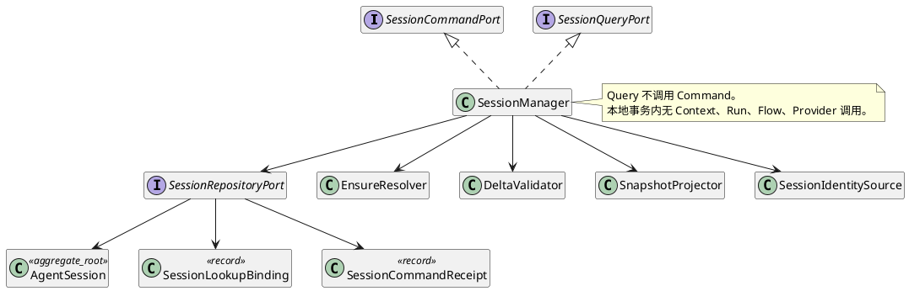
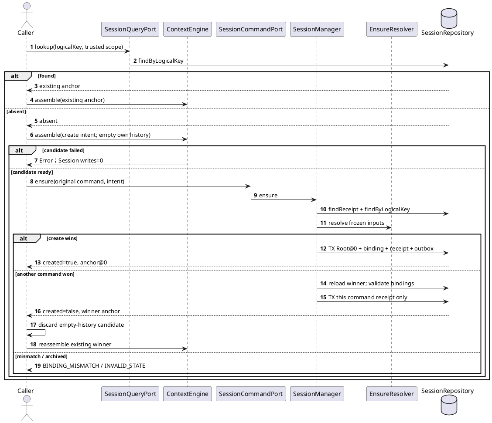

# SR-SESSION-01：Root Session 生命周期

## 1. 范围与适用约束

本 SR 解决调用方如何从逻辑会话键取得一个稳定 Root Session，并在后续安全地查询、追加和归档。Root Session 的 `parent=null`；Child Session 不进入逻辑键索引，必须走 SR-03 的 `branch`。

调用方保证 `logicalKey`、`agentDefinitionRef`、`contextPolicyRef` 和稳定命令身份已在可信边界生成。SM 实例不承诺跨调用线程安全；并发正确性由持久唯一约束、版本 CAS 和幂等回执保证。`lookup/snapshot` 是纯读；不存在“查询不到就暗中创建”。

## 2. 业务场景

| 场景 ID | 业务目标与前置 | 主成功 | 特殊/异常与保留事实 |
|---|---|---|---|
| `SES-BS-00A` 首次输入准备 | 受信准备方有稳定 `SessionCreationIntent`，逻辑键尚无 binding | `lookup=absent`；Context 候选成功后显式 `ensure`，原子创建 Root@0、binding、回执和 outbox | Context 失败时 Session 创建数=0；ensure UNKNOWN 只核对原命令 |
| `SES-BS-00B` 并发首次创建 | 两个不同命令对同一 `(scopeKey,logicalKey)` 创建 | 唯一约束选出一个 Root；失败者重读赢家并保存自身 `created=false` 回执 | 定义/策略不匹配时失败，不创建替代 ID |
| `SES-BS-00C` 已存在复用 | binding 指向 active Root 且定义/策略匹配 | 返回当前已确认 anchor，`created=false` | 同命令重投返回原 anchor，不跟随 live head |
| `SES-BS-09` 指定快照读取 | 已知 `sessionId/version` | 返回不可变 `SessionSnapshot@version` | 缺失返回 `NOT_FOUND/GONE`，写入数=0 |
| `SES-BS-10` 追加增量 | Session active，来源 Run 切片已由 RunRegistry 权威提交，expectedVersion 匹配 | 原子追加 Delta、更新 head/version、保存回执与 outbox | CAS 冲突重载重算；Artifact 已发布但未引用时进入 GC |
| `SES-BS-06` 逻辑归档 | Session 无活跃绑定，expectedVersion 匹配 | `active -> archived`，保存回执和事件 | 归档后拒绝普通 append/ensure 复活；物理 GC 另行判定 |

Root 首次访问采用 `lookup → assemble candidate → ensure → save/adopt`。这不是把 `snapshot()` 设计成惰性创建：创建仍是显式命令、有创建权限、幂等身份和独立确认点。Context 候选基于空自身历史；若 ensure 返回 `created=false`，调用方必须丢弃该候选并以赢家 Session 的已存在历史重新组装，不能改绑旧候选。

## 3. 内部结构

`EnsureResolver` 和 `DeltaValidator` 只对冻结输入做纯计算，不访问 Repository。`SessionRepositoryPort` 提供机制，不改变领域拒绝结果。`SessionLookupBinding` 只索引 Root；`SnapshotProjector` 只从已确认版本重建读模型。

## 4. 数据与持久化

| 逻辑记录 | 必要字段与约束 | 读写者与原子范围 |
|---|---|---|
| `AgentSession` | `sessionId,version,agentId,state,parent=null,headRef,activeRunBinding?` | SM 独占写；append/archive 用 `expectedVersion` CAS |
| `SessionLookupBinding` | `scopeKey,logicalKey,sessionId,agentDefinitionRef,contextPolicyRef` | UNIQUE `(scopeKey,logicalKey)`；仅 Root 创建事务写 |
| `EnsureReceipt` | `scopeKey,commandId,payloadDigest,result{anchor,created}` | UNIQUE `(scopeKey,component,commandId)`；同键异载荷冲突 |
| `SessionDeltaReceipt` | `sessionId,deltaId,sourceRunId,sourceBindingVersion,fromVersion,toVersion,headRef` | UNIQUE `(scopeKey,sessionId,deltaId)`；与 Delta/head/outbox 同事务 |
| `ArchiveReceipt` | `sessionId,commandId,payloadDigest,fromVersion,toVersion` | 与状态迁移/outbox 同事务 |
| `SessionOutbox` | `outboxId,commandId,kind,payloadRef,state,attempts,receiptRef?` | 业务事务只写 READY；提交后 worker 投递 |

`ensure` 原子创建范围是 Root@0、空 head、logical binding、完整命令回执、必要引用和 outbox。任一部分未提交则全部不可见。物理表名和 DDL 由 Infrastructure 设计，但必须实现上述唯一键、外键/保留关系、CAS 与重启可恢复性。

公共字段以 [CD-1](../../../../contracts/component-development-contracts-v1.md#l1-cmp-005-session-manager) 和 [CTX-CON-1](../../../../contracts/context-assembly-contract.md#1-session入口只读准备与延迟创建) 为准。

## 5. 首次创建流程

提交结果未知时，调用方只查询或重投原 ensure。创建确认后 Context 保存或 Run 受理失败不回滚 Session；由显式归档命令收敛。

## 6. Append 与 Archive 算法

`append`：

1. 校验可信 Scope、命令摘要、大小上限和 deadline；查询原 `deltaId/commandId` 回执。
2. 验证 `sourceRunId + sourceBindingVersion` 与当前 SR-02 绑定匹配，并验证 `TranscriptSlice` 已由 RunRegistry 权威提交。SM 不接收模型私有 chain-of-thought 或未确认片段。
3. 读取 `AgentSession@expectedVersion`；要求 active，Delta 因果范围连续，Artifact 引用完整。
4. 原子写 Delta、new head、`version+1`、回执和 outbox。CAS 失败不复用旧决策；调用方重载并重新筛选尚未写入的完整 Delta。

`archive`：

1. 查询原命令回执并校验同键同摘要。
2. 要求 Session active、`activeRunBinding=null`、版本匹配；Child/Barrier 的保留关系只影响物理 GC，不伪装成同步删除。
3. 原子写 archived、新版本、回执和 outbox。归档后查询仍可按保留策略工作，普通 append 和 ensure 复活被拒绝。

## 7. 故障、恢复与安全

| 失败窗口 | 结果与恢复 |
|---|---|
| Context 候选失败 | 不调用 ensure，Session/回执/outbox 均为 0 |
| Root 创建提交前崩溃 | 事务回滚；原命令可重投 |
| Root 创建已提交但响应丢失 | 原命令回执返回同一 `anchor/created`；不得生成第二个 ID |
| append 前 Artifact 已保存但 CAS 失败 | Session 不可见该 Delta；孤立引用由 Artifact GC 处理 |
| archive 与 append/branch 并发 | 同一 Session version 只允许一个 CAS 胜者；败者重读并返回稳定错误 |
| Repository 不可用 | 有界失败，不在内存伪造已提交 Session |

读取存在性前验证 Host 装配的受限查询能力；创建、追加、归档分别验证对应写能力。`scopeKey` 只来自 `TrustedScope`，JSON 载荷不得自报。普通遥测不得记录 logicalKey、Session 正文、Prompt、Memory、Permit 或内容摘要。

## 8. SFMEA

| 风险 | 后果 | 控制 | 验收 |
|---|---|---|---|
| `SES-FM-06` Query 缺失时暗中创建 | 越权写入和容量放大 | Command/Query 分离，调用图禁止 Query→ensure | `SES-T-18/19` |
| `SES-FM-07` 先查再建无唯一键 | 同逻辑会话产生多个 Root | logical unique + 冲突后重读赢家 | `SES-T-15/17` |
| `SES-FM-08` 幂等重投读取 live head | 同命令返回不同 anchor | 回执保存完整原结果且先于当前状态读取 | `SES-T-14/17` |
| `SES-FM-09` mismatch/archived 时新建替代 | 历史与策略绑定断裂 | 失败关闭，不删除 binding、不复活 | `SES-T-16` |
| append CAS 被最后写入覆盖 | 丢失或混合历史 | expectedVersion CAS、重载重算 | `L1-CMP-005-TC-01` |
| 归档时仍有活跃 Run | 最终写入丢失 | `activeRunBinding=null` 守卫 | SR-02 `SES-RUN-T-04` |

## 9. 测试与端到端验收

| 测试 | 层级与构造 | 独立期望 | 状态 |
|---|---|---|---|
| `SES-T-12/13` | UT/契约：缺失创建、已存在复用 | create 决策为 Root@0；复用不改 Session | 待实现/未运行 |
| `SES-T-14` | 重投：创建后 append 到@3 | 原 ensure 仍返回 @0/created=true | 待实现/未运行 |
| `SES-T-15` | 双连接唯一插入双屏障 | Session=1、binding=1、receipt=2 | 待实现/未运行 |
| `SES-T-16` | 定义/策略不匹配及 archived | 稳定拒绝；新 Session=0 | 待实现/未运行 |
| `SES-T-17` | commit 前后 SIGKILL | 未提交全0；已提交各1；无第二 ID | 待实现/未运行 |
| `SES-T-18` / `AK-SESSION-005` | DT：从 Run 入口查询不存在的内存 Session | 返回 `SESSION_NOT_FOUND`；Session 与 Run 写入均为0 | 进程内切片已实现/通过 |
| `SES-T-19` | 契约：Query 权限 Spy | 无权读取正文0 | 待实现/未运行 |
| `SES-T-20/21` | L-1/L/L+1、取消与提交竞态 | 容量硬界限；提交前取消为0，已提交按原命令确认 | 待实现/未运行 |
| `SES-T-22` | Schema/安全结构扫描 | Session 权限对象字段数0 | 待实现/未运行 |
| `L1-CMP-005-TC-01～06` | append 并发、幂等、归档、Artifact 和闲置容量 | 版本/副作用次数及资源占用符合本 SR | 待实现/未运行 |
| `AK-SESSION-006～008` | DT：进程内 logicalKey、Root@0 锚点、幂等回执和两个首次调用竞争 | lookup 无写入；同命令原结果稳定；同 logicalKey 只产生一个 Session，失败者取得赢家锚点 | 进程内切片已实现/通过 |
| `AK-SESSION-009/010` | Integration：应用层候选失败与 ensure 前插入竞争命令 | 候选失败时 Session=0；竞争失败时调用序列为 create、existing，空历史候选不可复用 | 进程内替身集成已实现/通过 |

端到端用例从公开输入准备入口走 `lookup → Context candidate → ensure → candidate save/adopt → SR-02 Run 受理`。至少覆盖首次创建成功、Context 失败不创建、并发赢家导致候选重组、ensure ACK 丢失以及 archived/mismatch 拒绝。证据包保存合成 logicalKey 代号、命令摘要、事务检查点、Session 版本、调用次数和恢复结果，不保存真实业务键或正文。

## 10. 实现映射与状态

当前进程内开发单元为 `AgentSystem.lookup/ensure`、`AgentSession.anchor` 与应用层 `RootSessionPreparationCoordinator.prepare`。持久目标仍建议拆为 `ensure-resolver.ts`、`delta-validator.ts`、`session-repository.ts`、`session-identity-source.ts`、`session-command-receipts.ts`、`session-outbox.ts`。新增 Session 创建方式时扩展封闭 `SessionCreationIntent` 和纯 Resolver 测试，不在 Query 中加隐式写分支。

当前 `AgentSystem` 已按目标调用假设实现 `lookup(context,logicalKey)` 与 `ensure(context,{commandId,intent})`，Session ID 只在 ensure 内生成，结果返回 `{anchor,created}`。`RootSessionPreparationCoordinator` 执行候选后 ensure，并在 `created=false` 时按赢家锚点重新组装；`run()` 对缺失 Session 仍返回 `SESSION_NOT_FOUND`。

2026-09-10 持久 Flow 路径复用同一准备协调器，装配 `DurableSessionManager.lookup/ensure` 与独立 `sessions.sqlite`。Root UUID、空历史@0、logical binding 与不可变 ensure 回执同一事务确认；`UNIQUE(scope,logical_key)` 和 `PRIMARY KEY(scope,command_id)` 分别保护唯一创建与原命令结果。同命令异 intent 拒绝，回执不跟随 live anchor。FlowContext 不再从 Run 数量或转录头构造 Session anchor。

当前物理表 `sessions` 保存 scope/id/logical_key/revision/active/body/digest，`session_receipts` 保存 scope/command_id/digest/result。版本为 1；旧 `flow.sqlite` 的物理表名不变，但缺少对应 Session 权威记录时启动返回 `SESSION_STORAGE_MIGRATION_REQUIRED`，不自动把旧 Run 目录推算成已采纳历史，不删除旧数据。数据回填迁移、archive、指定版本快照和通用领域事件投递尚未实现，不能宣称整个 SR 完成。当前验证使用新建隔离数据目录；具体证据见 [持久链路验证](../../../../../verification/session-durable-admission-2026-09-10.md)。
