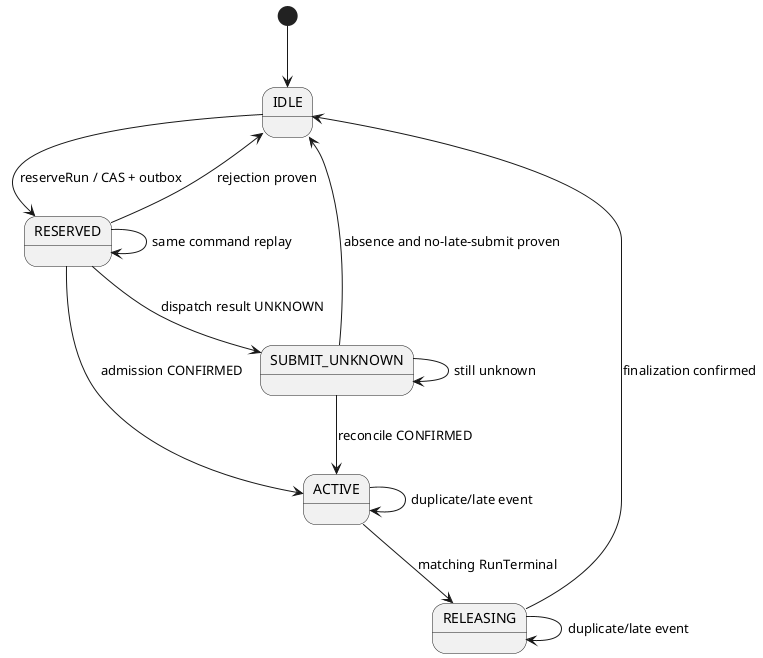
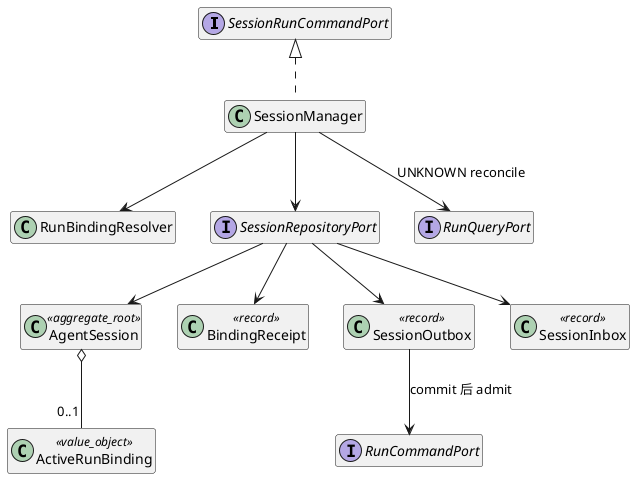
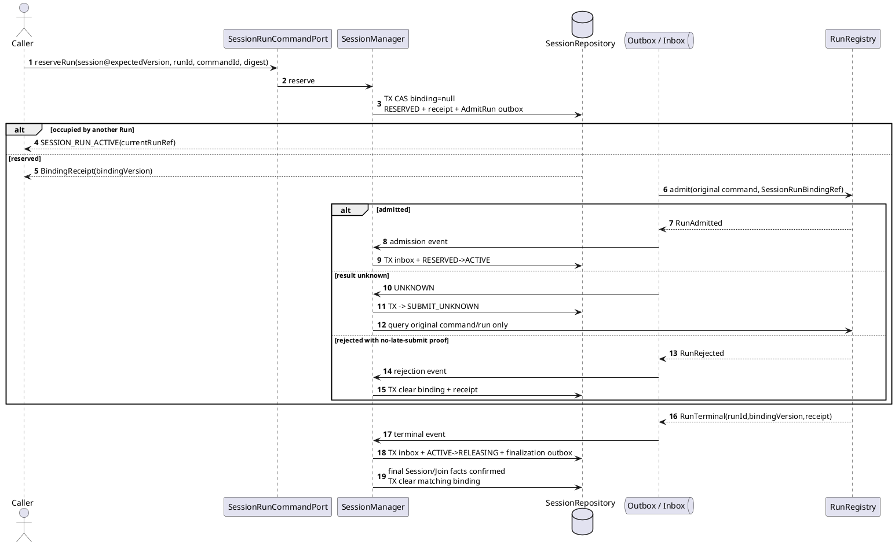

# SR-SESSION-02：Session 单活 Run 协调

## 1. 范围与不变量

同一 `(scopeKey,sessionId)` 任意时刻最多一个非空 `ActiveRunBinding`。SM 不管理 Run 集合、历史列表、Session 内排队、公平性或抢占；终态 Run 只由 RunRegistry 留档。同一 Session 可在旧绑定完整释放后顺序启动下一个 Run。

Root 和 Child 使用同一占槽协议。Parent 等待 Join 时继续由原 Parent Run 占槽；`resumeParent` 恢复同一个 Run，不新建第二个 Run。Attempt 接管只改变 RunRegistry 中同一 Run 的 claim/fence，不改变 Session 的 `runId/bindingVersion`。

## 2. 场景

| 场景 ID | 前置与目标 | 成功 | 异常/恢复 |
|---|---|---|---|
| `SES-BS-08A` 占用空槽 | Session active、binding=null、Run 身份和载荷冻结 | CAS 写 `RESERVED + bindingVersion + receipt + AdmitRun outbox` | 不同 Run 竞争返回 `SESSION_RUN_ACTIVE`；不排队 |
| `SES-BS-08B` Run 受理 | 已提交 RESERVED outbox | RunRegistry 验证 `SessionRunBindingRef` 后受理；SM 转 ACTIVE | 响应未知转 `SUBMIT_UNKNOWN`，只查原命令 |
| `SES-BS-08C` 明确拒绝 | RunRegistry 证明未受理且无迟提交 | 保存拒绝回执并清槽 | 无证明时保持 UNKNOWN |
| `SES-BS-08D` 终态释放 | ACTIVE 且终态匹配当前 `runId+bindingVersion` | 转 RELEASING，完成最终 Session/Join 写入后清槽 | 旧代次事件只记 late fact，不能清新绑定 |
| `SES-BS-08E` 同 Run Attempt 接管 | Run R 仍占槽，旧 Attempt A 失联 | RunRegistry 把 R 接管给 B；SM 绑定不变 | A 的旧 fence 在 RunRegistry T2 被拒绝 |

## 3. 数据结构与状态机

```text
ActiveRunBinding = {
  runId,
  bindingVersion,
  state: RESERVED | SUBMIT_UNKNOWN | ACTIVE | RELEASING,
  reserveCommandId,
  admissionCommandId,
  payloadDigest,
  admissionReceiptRef?,
  terminalReceiptRef?,
  stateVersion
}

SessionRunBindingRef = {
  sessionId,
  runId,
  bindingVersion,
  bindingReceiptRef
}
```

`bindingVersion` 每次成功占槽递增，绑定存续期间不变；`stateVersion` 用于绑定内部迁移 CAS。IDLE 由 `activeRunBinding=null` 表示，不存一行可与非空绑定并存的 IDLE 状态。



所有迁移同时校验 `sessionId/runId/bindingVersion/stateVersion`。同 `commandId` 同摘要返回原回执；同键异载荷返回 `IDEMPOTENCY_CONFLICT`。

## 4. 内部结构



`RunBindingResolver` 是纯状态迁移，Repository 负责单行 CAS、回执、inbox/outbox 的同事务提交。outbox worker 可调用 RunRegistry，SM 事务不得同步调用 RunRegistry。

## 5. 受理与释放时序



占槽和 Run 创建不能组成跨库事务，因此必须先耐久占槽再派发。释放必须在最终 Session Delta 或 Child Join outcome 已固定后发生；终态事件本身不能直接清空绑定。

## 6. 并发、UNKNOWN 与 Attempt 接管

| 问题 | 必要规则 |
|---|---|
| R1/R2 同时看到空槽 | 只允许一个 Session version/binding CAS 成功；失败者不产生 Run admit outbox |
| admit 已生效但 ACK 丢失 | 保持 `SUBMIT_UNKNOWN`；查询原 `admissionCommandId/runId`，一次 not-found 不足以清槽 |
| 旧 R1 终态与新 R2 占槽竞态 | R2 只能在 R1 finalization 清槽后占用；旧 `bindingVersion` 永远不能清 R2 |
| 事件重复/异载荷 | inbox 按 eventId+digest 去重；同事件异摘要转 integrity incident |
| Attempt A 失联、B 接管 | RunRegistry claim/fence 决定谁能提交 TranscriptSlice；SM 不新增 lease/fence |
| B 接管但尚未写 Session | 即使 Session expectedVersion 未变，A 仍须先在 RunRegistry T2 被拒绝 |

高价值接管轨迹及双屏障顺序见 [Session takeover 测试](session-takeover-tests.md)。该设计防止旧 Attempt 写入，但不扩大 SM 为 Attempt 调度器。

## 7. 持久化与恢复

单次 reserve 事务写 `AgentSession.activeRunBinding`、`BindingReceipt` 和 `AdmitRunOutbox`。admission/terminal 事件事务写 `SessionInbox`、绑定新状态、回执和后继 outbox。所有唯一键包含可信 `scopeKey`；绑定回执必须能被 RunRegistry 通过受控 Port 验证，不能只信调用方提交的引用字符串。

恢复 scanner：

1. 扫描 `RESERVED/SUBMIT_UNKNOWN/RELEASING`，不扫描内存对象。
2. `RESERVED` 有 READY outbox 时按原命令投递；CLAIMED/SENT_UNKNOWN 查询接收方原事实。
3. `SUBMIT_UNKNOWN` 仅在权威证明 `CONFIRMED` 或 `ABSENT_SAFE_TO_RETRY/RELEASE` 后迁移。
4. `RELEASING` 重放原 finalization 命令；未确认最终写入前不清槽。

## 8. SFMEA

| 风险 | 后果 | 控制 | 验收 |
|---|---|---|---|
| 并发占槽无 CAS | 一个 Session 两个活跃 Run | 单行 CAS + 唯一回执/outbox | `SES-RUN-T-01` |
| UNKNOWN 提前清槽 | 原 Run 迟到后与新 Run 并行 | UNKNOWN 保持占用、原命令对账 | `SES-RUN-T-03` |
| 旧终态释放新绑定 | 新 Run 执行期间 Session 被误置空 | `runId+bindingVersion` 双匹配 | `SES-RUN-T-04` |
| RunRegistry 不校验 binding ref | 调用方绕过 SM 直接创建绑定 Run | 权威回执校验、调用图约束 | `SES-RUN-T-06` |
| Session 复制 Attempt lease | 双所有者漂移 | takeover 只归 RunRegistry | `SES-TAKEOVER-T-01～03` |
| 终态即清槽 | 最终 Delta/Join 结果丢失 | 强制 RELEASING/finalization | `SES-RUN-T-04/05` |

## 9. 测试闭环

| 测试 ID | 层级与故障注入 | 独立期望 | 状态 |
|---|---|---|---|
| `SES-RUN-T-01` | 双连接 CAS 双屏障，R1/R2 两顺序 | 恰好一个 RESERVED，失败者 Run=0 | 待实现/未运行 |
| `SES-RUN-T-02` | 同命令重投100次及异载荷 | bindingVersion 稳定、outbox=1；异载荷冲突 | 待实现/未运行 |
| `SES-RUN-T-03` | reserve/admit ACK 前后 SIGKILL | UNKNOWN 期间第二 Run=0；恢复后各1 | 待实现/未运行 |
| `SES-RUN-T-04` | R1 finalization 与 R2 reserve 双屏障 | R2 只在清槽后成功；旧事件不清 R2 | 待实现/未运行 |
| `SES-RUN-T-05` | Parent 等待，三个 Child 各独立 Session，B/C 同时完成 | 每个 Session 非空绑定≤1，Parent resume 仍是原 Run | 待实现/未运行 |
| `SES-RUN-T-06` | Schema/配置/调用图扫描 | 多 Run 字段与绕过 SM admit 路径均为0 | 待实现/未运行 |
| `SES-TAKEOVER-T-01～03` | 真实持久化、ManualGate、旧/新 fence 双屏障 | 只有当前 Attempt 能产生权威切片；Session 始终只有 Run R | 待实现/未运行 |
| `SES-E2E-07` | ensure S→并发 R1/R2→finalize→顺序启动另一 Run→查历史 | 并发一胜一拒；释放后可顺序运行；历史只在 RunRegistry | 待实现/未运行 |

行为测试须断言状态、版本、回执和真实派发次数；结构测试须断言 Session Schema、配置与 API 中没有多 Run 集合/容量/lease。内存 Fake 不能证明持久 CAS 或崩溃恢复。

## 10. 实现状态

已实现的进程内切片：`AgentSession` 的 `RESERVED / SUBMIT_UNKNOWN / ACTIVE / RELEASING` 状态、`bindingVersion` 迟到防护和并发第二 Run 拒绝，且现有配置已删除 `maxRunsPerSession`。

2026-09-10 已接入本地持久切片：`DurableSessionManager` 经 `SessionPersistence` 操作独立 `SqliteSessionRepository`；Flow HTTP 与子 Run 受理由 `sessions.admit` 占槽后调用 RunRepository。完整字段以源码公共契约 `contracts/control/session-manager/session-persistence.ts` 为准。`revision` 用于聚合 CAS，`bindingVersion` 每次占槽递增，`anchor.version/headRef` 只在完整历史采纳时推进，不能混用。

本地实现将当前 `AdmitRunOutbox` 存在 Session 的 `admission{input,parent}` 字段，与 RESERVED 和 reserve 回执同事务提交。Run 受理确认后清空该字段；响应未知则保持 SUBMIT_UNKNOWN。只有同步 `RunAdmissionRejected` 能证明调用已结束且事务没有迟提交，才记录原拒绝并清槽。恢复先查询原 Run 受理，存在则核对摘要；缺失时按原耐久输入幂等派发。该安全重投条件依赖本地同步受理和 Run 身份唯一约束，不适用于异步远程受理。

Run 终态后先标记 RELEASING；成功 Run 复用完整历史投影与 `completedRunHistory`，再将记录、历史锚点、采纳回执和清槽原子提交。失败/取消不将未完成轮次纳入模型历史，历史版本不增加，但终态回执及清槽仍需确认。宿主启动和调度扫描执行 `recover()`，不重放模型或工具。迟到旧 Run 不清当前新绑定。

本地约束：单租户可信装配，SQLite 同步事务、WAL/FULL；单聚合正文上限 16 MiB，恢复扫描上限 4096 个非空绑定；超限保留原事实并失败，不自动丢历史或清槽。当前按完整聚合保存，无历史 GC 或吞吐性能验收。服务入口的权威绑定验证必需；裸 RunRepository 仅在独立存储测试档案中可不装配此验证。

已运行用例 `AK-SESSION-011～018` 对应受理不推进历史、重复提交、ACK 丢失、受理前中断、终态采纳中断、双连接竞争、原 ensure 回执、取消和明确拒绝。证据见 [持久链路验证](../../../../../verification/session-durable-admission-2026-09-10.md)。尚未完成上述 SIGKILL、跨进程接管/双屏障、Child branch/join 全协议、通用事件 inbox/outbox 和完整 TUI E2E；不将这些测试更新为通过。

返回 [SessionManager 总览](../session-manager.md)。
