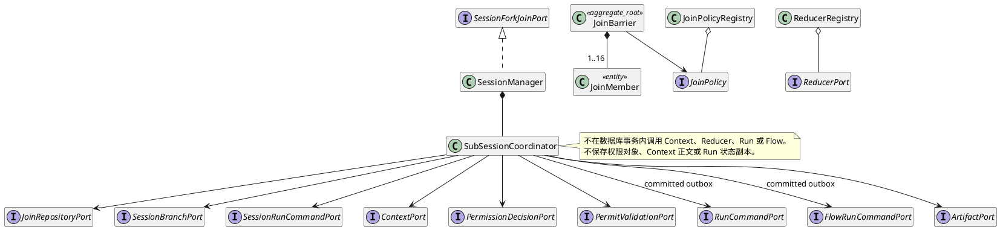
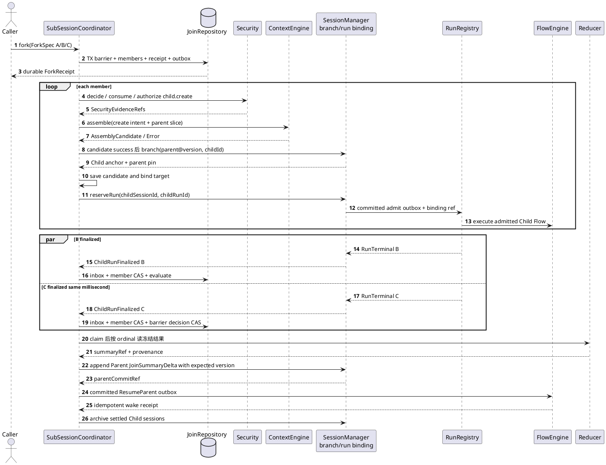

# SR-SESSION-03：Sub-session Fork/Join

## 1. 范围、所有权与前提

`SubSessionCoordinator` 是 SessionManager 内部应用服务，统一管理从 Fork 意图到 Child 收敛、Reduce、Parent Summary 提交和 Parent Run 唤醒的协调事实。它不成为独立服务，也不拥有 Provider、权限、Context 候选正文、Run/Attempt 或单 Flow 状态。

一个 Parent Run 可 Fork 1～16 个 Child；每个需要独立历史、重试状态、黑板或 Reducer 来源的 Child 都使用独立 Child Session，并通过 SR-02 只绑定一个 Child Run。仅做一次只读计算且不需要独立历史的 Child 可使用冻结 Parent 快照作为 `read_only` 输入，不创建 Child Session，也不占 Parent Session 的第二个 Run 槽。

## 2. 端到端业务场景

| 场景 ID | 目标与前置 | 核心结果 |
|---|---|---|
| `SES-BS-01` 一次性只读 Child | 无独立追加/恢复/Reducer Session 来源 | Context 从 Parent 确切版本生成独立候选；Child Session=0 |
| `SES-BS-02` 创建隔离分支 | Parent/Run 版本、Child 身份、父选择规格和策略已冻结 | Child 只保存不可变 ParentSnapshotRef 与自身增量 |
| `SES-BS-03` 并发乱序 Join | B/C 同时、重复或乱序完成 | inbox/member/barrier CAS 只决策一次 |
| `SES-BS-04` 部分失败与超时 | A 成功、B 失败、C 超时 | 由 Fork 时冻结的 JoinPolicy 决定 fail/reduce/cancel remainder |
| `SES-BS-05` Reduce | 屏障唯一进入 REDUCE_READY | 按 ordinal 读取冻结 Child 结果，产生有 provenance 的 Parent outcome |
| `SES-BS-06` Parent 归档/取消 | Parent Session 或 Parent Run 进入收敛 | 禁止新 Child；已存在 Child 独立取消/归档，不级联硬删 |
| `SES-BS-07` Child 归档与 GC | 未受理已确认或 Child Run 已 finalization | 稳定 archive 命令逻辑归档；引用解除并过保留期后才可 GC |

## 3. 关键待决：Child 创建与 Context 组装顺序

`OPEN-SM-CTX-01` 是本 SR 的实现阻塞项：旧 SM 设计采用 `branch → assemble → reserve`；当前 [CTX-CON-1](../../../../contracts/context-assembly-contract.md#1-session入口只读准备与延迟创建) 明确采用 `assemble candidate → branch → save/adopt → reserve`，并要求组装失败时 Child Session 创建数为 0。

本 SR 采用当前上层候选契约作为**目标顺序**，但在 SessionManager、CD-1、ContextEngine 与调用方共同完成契约传播复核前，不把该顺序报告为已批准或可编码：

```text
冻结 Fork/member/Child 身份与父版本
  -> Security 对精确 child.create 判定
  -> ContextEngine 以 SessionCreationIntent + ParentContextSliceSpec 组装内存候选
  -> 候选成功后 branch 创建 Child 并建立 Parent pin
  -> 保存完整候选并原子绑定 Child anchor / plannedRunId
  -> SR-02 占用 Child 唯一 Run 槽
  -> RunRegistry 受理后 FlowEngine 执行
```

必须同步解决的字段/确认点：`SessionCreationIntent` 代替未创建时的伪造 `SessionAnchor`；`AssemblyCandidate` 代替旧 `assemblyReceiptRef/contextFrameRef`；候选保存、业务采纳、Run 受理分别确认；并发 branch 返回既有赢家时丢弃空历史候选并重组；保存/采纳 UNKNOWN 时不归档。任何实现不得继续依赖旧先 branch 时序，也不得为避免失败提前创建空 Child。

## 4. 内部结构与禁止依赖



允许方向为 `Coordinator → Security/Context/Session/Run/Flow Port`；反向结果只能通过稳定回执或 event bus/inbox。ContextEngine 不回调 Coordinator，FlowEngine 不访问 JoinRepository/Reducer/SessionRepository，Repository 事务不调用运行组件，因此不会形成同步循环依赖或分布式大事务。

## 5. ForkSpec、Child 与策略

```text
ForkSpec = {
  groupId, parentSessionId, parentSessionVersion, parentRunId,
  children: ChildSpec[1..16], joinPolicy, reducer, deadlineAtMs
}

ChildSpec = {
  memberId, ordinal, childSessionId, childRunId, agentRef, inputRef,
  childExecutionEnvelopeRef, parentContextSlice
}
```

`ordinal` 唯一且连续；Child Session/Run ID 由 `(scopeKey,groupId,memberId)` 的版本化规范摘要稳定派生。Parent/Child Session 不保存权限内容，`childExecutionEnvelopeRef` 也不替代本次 `child.create` 的 Permit。

| 策略 | Reduce 条件 | 失败条件 | 剩余 Child |
|---|---|---|---|
| `ALL_SUCCESS` | 全部成功 | 首个明确失败/超时/取消 | 生成 cancel outbox，Parent 收到结构化失败 |
| `WAIT_ALL(minSuccesses,includeFailures)` | 全部明确终态且成功数达标 | 全部终态后仍不足 | 不提前取消；Reducer 可接收失败摘要 |
| `QUORUM(minSuccesses,cancelRemainder)` | 成功数达到阈值 | `succeeded + pending < minSuccesses` | 按冻结配置取消余项 |

A 成功、B 失败、C 超时时：`ALL_SUCCESS` 失败；`WAIT_ALL(min=1)` Reduce；`QUORUM(2)` 失败；`QUORUM(1)` Reduce。策略在 Fork 提交时冻结，不能在事件到达后临场选择。

## 6. 选择性父上下文与 Token 软目标

Child 不复制 Parent 全文。`ParentContextSliceSpec` 绑定 Parent 确切 anchor、候选引用、必选引用、选择器版本和 `maxInheritedTokens`。Child system/task/tools 是独立必选基线；Parent system 不能提升为 Child system，未列候选和越权内容读取数必须为 0。

```text
U_frame = min(inputTokenLimit,
              modelWindowTokens - outputReserveTokens - estimatorMarginTokens)
T_base = estimate(canonical child input with zero inherited parent units)
U_parent = max(0, min(maxInheritedTokens, U_frame - T_base))
```

U_frame与U_parent为Pi粗估的选择软目标，不是Provider实际Token上界。完整候选必须按CTX-CON-1重新估算；必选闭包超过软目标时保留全部必选、标记required_over_target且不追加可选内容，不能仅因Token超目标拒绝。可选内容按完整依赖闭包试放，不以软目标为由放宽字节、来源范围和结构硬约束。

饱和利用率≥0.95仅适用于Context默认causal-budget策略已定义的固定小单元估算夹具，不是Session通用验收门槛，Pi备选不承担该要求。父继承具体计量口径沿CTX-CON-1及Context的SCG-06闭合，不在本SR另定公式语义或保证Provider实际请求不超窗。

## 7. Scatter-Gather 主流程



图中的 Child 创建前后顺序受 `OPEN-SM-CTX-01` 约束；Join、Reduce 和唤醒阶段不依赖该待决项。

## 8. JoinBarrier 与并发规则

Barrier 的完整状态图、事件联合、迁移表、UNKNOWN 集合和冲突恢复只在 [AR-SM-JOIN-001](join-barrier-state-machine.md) 定义。本 SR 只冻结场景层规则：

1. Run 成功/失败只能由 SR-02 在 Child finalization 与绑定释放后发布的 `ChildRunFinalizedEvent` 进入 Barrier；原始 RunTerminal 不得直接计数。
2. `join_inbox` 对 eventId+digest 去重；member 非终态→终态只 CAS 一次；计数每次从 member 行重投影，不独立执行 `completed_children++`。
3. B/C 同毫秒完成只以数据库提交/CAS 顺序裁决，不以时间戳胜负；失败事务重载同一事件身份。
4. 策略决策、Reduce claim、Parent append 和 resume 各自只有一个稳定命令/栅栏；重复投递返回原回执。
5. Parent Summary 提交确认前，ResumeParent outbox 数必须为 0；Parent version 冲突转 `SUSPENDED_CONFLICT`，不得自动 merge 或唤醒。

## 9. Reduce、部分失败与 Parent 唤醒

`ReductionInput` 按 `ordinal` 排序并固定 member outcome、Child Session 版本、result/error ref、policy 和 reducer version。Reducer 是纯计算或独立耐久执行，不在 Barrier 锁内；同 `inputDigest + reducerVersion` 必须产生同 `outputDigest`。

成功 Reducer 返回 `summaryRef/provenanceRefs/counts/outputDigest`；策略失败或取消使用确定性 FailureOutcomeBuilder 生成同样可提交的结构化 Parent outcome。Coordinator 只向 Parent 追加一个 `JoinSummaryDelta`，正文引用 Summary Artifact，不复制 Child 黑板。Resume 使用稳定 `(parentRunId,resumeCommandId,groupId)`，只在 `parentCommitRef` 已确认后投递。

## 10. Child 创建、归档与恢复

| 失败窗口 | Child/Run/清理行为 |
|---|---|
| Security Ask/Deny/unavailable | Child Session=0、Run admit=0；保存等待/拒绝事实 |
| Context 明确失败 | 目标顺序下 Child Session=0；member 进入明确失败 |
| Context 结果 UNKNOWN | 不 branch、不 admit；只按原 preparation/input 对账 |
| branch 已提交、响应丢失 | 原 childId/commandId 重投返回同一 Child；不换 ID |
| candidate 保存/采纳 UNKNOWN | 不 admit、不归档；核对原 Artifact/业务提交事实 |
| RunRegistry 明确拒绝且无迟提交 | SR-02 清 RESERVED；Coordinator 记录失败后逻辑归档 |
| Child Run terminal | SR-02 finalization/清槽；固定 Reducer 引用后归档 |
| Parent cancel / quorum 提前达成 | 禁止新 Child；已受理者用稳定命令取消，逐个收敛 |
| archive ACK 丢失 | `CLEANUP_UNKNOWN`，重投原 archive 命令；硬删除=0 |

`destroySubSession()` 不存在。逻辑归档只禁止新写入；Barrier、Parent pin、候选Artifact活跃引用、Artifact/Run/Security回执、outbox、UNKNOWN 和 incident 全部解除并满足保留期后，Child 才能成为物理 GC 候选。Context不产生持久回执，也没有回执确认或清理步骤。

## 11. 持久数据

| 逻辑记录 | 关键约束 |
|---|---|
| `join_barrier` | PK `(scopeKey,groupId)`；冻结 parent、policy、reducer、deadline；version CAS；decision/outcome/parentCommit/wake 分阶段写 |
| `join_barrier_member` | PK group+member；childSession/childRun/ordinal 唯一；只保存 Security/Context/Run 外部引用和单调生命周期投影 |
| `join_inbox` | eventId 唯一；同事件异摘要为完整性错误 |
| `join_outbox` | commandId 唯一；payload 不可变；CLAIMED/SENT_UNKNOWN 不得直接取消或盲重发 |
| `join_unknown_effect` | 每个未知命令独立行，保存 origin state、角色、摘要和对账结果；后到结果不能覆盖其他 UNKNOWN |
| `join_reduction` | group+attempt 唯一；fence 只允许一个 worker 提交 output |

详细字段和状态不变量见 AR-SM-JOIN-001。Barrier 终态后仍保留去重与恢复事实；现有“至少30天”是候选保留下限，需 Infrastructure 容量评审后才能冻结为部署参数。

## 12. 确定性故障构造

| 手段 | 构造和可证明内容 |
|---|---|
| `ChildOutcomeScript` | A=SUCCEED、B=FAIL(after admitted)、C=STALL；区分明确失败与无终态 |
| `ManualClock + DeadlineScanner` | 推进到 deadline 对 C 做 TIMED_OUT CAS；测试不使用 sleep |
| `TerminalDeliveryBarrier` | B/C 在 inbox 或 member CAS 前暂停，按两顺序释放并重复投递 |
| `ManualGate` | C 超时及 Join 决策后再发迟到成功；不得覆盖 TIMED_OUT |
| `CrashCheckpoint` | 在 Fork、Context、branch、candidate save/adopt、Run admit、member CAS、Reduce、Parent append、resume ACK 前后 kill/restart |
| Spy/Faux Ports | 记录 Security、Session、Context、Run、Flow、Provider、Reducer、Parent append/resume 和 archive 次数 |

每个策略向量使用全新数据库，期望由固定表常量给出，不能调用被测 JoinPolicy/Reducer 生成 oracle。

## 13. SFMEA

| 风险 | 后果 | 控制 | 验收 |
|---|---|---|---|
| 重复/乱序直接累计计数 | Parent 提前或永久不唤醒 | inbox + member CAS + 投影校验 + decision CAS | `SES-JOIN-T-02/03/29/30` |
| 未冻结部分失败策略 | 同一结果因 worker 不同 | Fork 时冻结策略与阈值 | `SES-JOIN-T-05/23` |
| DB 锁内 Reduce/网络调用 | 锁饿死或组件死锁 | 短事务 claim，事务外执行 | `SES-JOIN-T-07/14` |
| Child 直接写 Parent/live reduce | 跨聚合污染、结果不确定 | 冻结版本、ordinal、唯一 Parent append | `SES-JOIN-T-08～11` |
| Parent commit 前唤醒 | Parent 看不到 Summary | `parentCommitRef` 作为 resume 守卫 | `SES-JOIN-T-11/12` |
| 复制 Parent 全文或 system | 越权与 Token 放大 | ParentContextSliceSpec、独立 Child 基线 | `SES-JOIN-T-16/17/22` |
| 未确认候选/绑定就执行 | 重复 Run 或错误 Prompt | candidate adopt + SR-02 binding + Run admit 三重确认 | `SES-JOIN-T-18/19` |
| UNKNOWN 时归档/删除 | 恢复依据丢失 | 原身份对账、archive/GC 分离 | `SES-JOIN-T-20/21` |
| SM/FE 同步双向回调 | 循环依赖与跨库死锁 | outbox/inbox，禁止事务内外调 | `SES-JOIN-T-14` |

状态机特有风险 `SES-JOIN-FM-17～25` 及测试 `SES-JOIN-T-24～31` 由 AR-SM-JOIN-001 维护。

## 14. 端到端系统集成测试

每例从公开 Fork/Cancel 端口进入，使用真实本地 Session/Join/Context/Flow 持久适配器；只替换外部 Security 决定、Provider、时钟和故障源。一直断言到 Parent outcome/唤醒以及 Child 归档。

| E2E ID | 业务轨迹与构造 | 必须观察 | 状态 |
|---|---|---|---|
| `SES-E2E-01` | Root→一个 Child→选择性继承→成功→Reduce→resume→archive；分别构造目标内、仅必选超软目标、硬容量超限，并覆盖默认/Pi备选 | 未列/越权读取0；仅必选超软目标仍完整保留且标记、不加可选；硬容量超限明确失败；成功分支Summary/resume/archive各1；不要求Provider实际Token上界或Pi备选利用率≥0.95 | 待实现/未运行 |
| `SES-E2E-02` | A成功、B失败、C stall→deadline→迟到成功；四策略分库运行 | 结果符合策略表；C保持TIMED_OUT；Reduce/append/resume至多1 | 待实现/未运行 |
| `SES-E2E-03` | Security、Context、branch、candidate save/adopt、admit 确认点前后 kill | 身份稳定；各事实至多1；UNKNOWN不归档、不读 Parent latest | 待实现/未运行 |
| `SES-E2E-04` | Parent 在 Child 准备、branch、admit 前后取消；archive ACK 丢失 | 取消先则 Run=0；受理先则原 Run 取消；引用存在时 GC=0 | 待实现/未运行 |
| `SES-E2E-05` | A完成，B/C 同毫秒且各重复100次 | member各终结1、decision/reduce/append/resume各1 | 待实现/未运行 |
| `SES-E2E-06` | child.create 已允许，Context 读取前/后撤销数据范围 | 无权正文/Frame/Provider调用均0；Session历史不改写 | 待实现/未运行 |

组件级 `SES-T-01～11` 覆盖 branch 幂等、无 re-parent、Parent archive 竞态、崩溃原子性、安全、祖先环和 pin；`SES-JOIN-T-01～23` 覆盖 Scatter/Join/Reduce/Context/归档；`SES-JOIN-T-24～31` 覆盖状态机穷尽和恢复。全部仍为待实现/未运行，不能因有测试 ID 就报告通过。

## 15. 开发拆分、扩展与状态

建议单元：`session-fork-join` 契约、`branch-resolver`、`sub-session-coordinator`、`child-lifecycle`、`join-policy`、`join-transition-table`、`join-repository`、版本化 `reducers`。新增 JoinPolicy/Reducer 必须先新增封闭类型和版本化注册，再补纯策略、迁移/组合测试；Coordinator 中不得增加业务特判链。

当前 `SubSessionCoordinator`、Join Repository/Barrier、Child Context/Session/Run 流水线、Reducer、Parent append/resume 和归档恢复均未实现。`OPEN-SM-CTX-01` 关闭前，Child 创建流水线不具备开发就绪条件；Barrier 状态机可按独立 AR 开发，但不能据此宣称整个 SR-03 可运行。

返回 [SessionManager 总览](../session-manager.md)。
