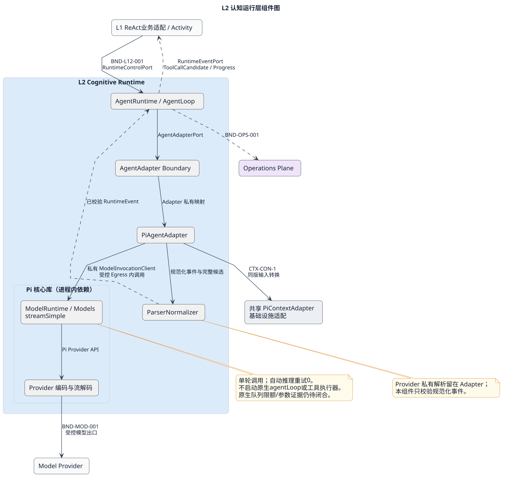

# L2 Cognitive Runtime 层设计

[查看 PlantUML 权威源](../../diagrams/layers/02-l2-cognitive-components.puml)

## 1. 职责与边界

L2 在 L1 已派发的 `AgentRunAttempt` 内执行可重建的已提交模型步骤，把模型侧输出转换为 Kernel 规范事件。L2 不拥有 Run、Session、权限、ToolCall、调度或长期记忆的权威状态，也不解释用户、租户、Token、RBAC 或业务工作流。

L2 只能通过 L1 提供的运行控制边界接收已冻结的上下文、工具目录快照引用和执行信封引用。模型产生的工具动作必须作为 `ToolCallCandidate` 返回 L1；L2 不直接调用 L3、L4 或任何 Tool Provider。

## 2. 组件

| 组件 | 唯一职责 | 详细设计 |
|---|---|---|
| AgentRuntime / AgentLoop | 按顺序执行同Attempt内已提交InvokeModel命令 | [AgentRuntime / AgentLoop](components/agent-runtime-loop.md) |
| ParserNormalizer | 校验 Adapter 已规范化的事件和动作候选 | [ParserNormalizer](components/parser-normalizer.md) |
| AgentAdapter Boundary | 定义 Kernel 唯一公共模型适配边界 | [AgentAdapter Boundary](components/agent-adapter-boundary.md) |
| PiAgentAdapter | 在边界下封装 Pi 原生协议与模型调用 | [PiAgentAdapter](components/pi-agent-adapter.md) |

## 3. 依赖规则

允许依赖为 `L1 → L2 → AgentAdapterPort → Adapter/Model Provider`。L2 可使用 Operations 和 Infrastructure 的窄 Port，但不得反向推进 L1 权威状态。禁止：

- `L2 → L3/L4` 直接调用；
- 将 Provider 原生类型、流事件、异常或凭证暴露给 Kernel Core；
- 在 Runtime 内创建 Child Run、裁决权限、消费 Permit 或持久化 ToolCall；
- 把 `ModelInvocationPort` 提升为 Kernel 公共 Port；它只属于 Pi Adapter 内部；
- 在 Kernel 内解释原始 User Token、Tenant 或 RBAC。

## 4. 主控制流

1. L1 派发 Attempt，并给出冻结的 ContextFrame、可见工具目录快照引用、Deadline 和执行信封引用。
2. AgentRuntime校验已提交commandId，单步调用AgentAdapterPort；同Attempt可顺序处理多个不同command。
3. Adapter 在私有边界内调用模型并输出规范化事件。
4. ParserNormalizer 验证事件顺序、大小、引用和动作候选形状。
5. 普通事件追加回 L1；遇到工具或委派候选时，Runtime 暂停并把候选交回 L1。
6. L1将结果持久化并由FlowEngine决定推进；只有新的已提交InvokeModel才再次调用L2，resume不隐式发模型。
7. Runtime完成单步或遇Deadline/取消时停止该调用并回报事实；Run终态仅由Core决策、RunRegistry提交。

## 5. 数据与并发

L2 只持有 Attempt 期间的临时循环状态和可重建投影。Run 与 Attempt 的权威状态、事件 Journal 和幂等记录均由 L1 拥有。单个 Attempt 内事件严格有序；不同 Attempt 不承诺全局顺序。取消先关闭新模型调用和新动作产生，再等待当前有界调用收敛。

## 6. 故障隔离

Provider 超时、流中断、非法输出和 Adapter 崩溃统一映射为规范化故障，不泄漏私有异常。动作执行结果未知时，L2 不猜测、不盲重试；由 L1 查询权威状态并决定恢复。队列、事件帧、循环步数和模型调用均必须有界。

## 7. 非目标与评审边界

Multi-agent 团队、角色、通信、仲裁和结果采纳由 Kernel 上层拥有；L2 只执行普通 Root/Child Run。公共签名和 DTO 由 contracts 唯一维护；下文细化复用、组件协作与开发约束，仍为候选设计。

## 8. Pi 核心能力封装（2026-09-09）

本轮以当前工作树为依据，关联 [ACR-2026-0019](../../../governance/changes/ACR-2026-0019-l2-pi-wrapper.md)。设计目标是让 Pi 承担模型交互，让 Kernel 承担运行控制。比如模型请求读取文件：Pi 生成 toolCall，Adapter 输出候选，L1 经权限及工具链取得结果，再派发下一次模型步骤。一次 Adapter 调用不能自行完成这整条循环。

### 8.1 场景先行

| 场景 | 调用前提与输入生产者 | L2 行为与确认点 | 分支与责任 |
|---|---|---|---|
| L2-S01 首轮回答 | Host 已保存并采纳完整候选，L1 已提交模型命令 | 映射 payload，调用一次 Pi，验证完整输出，交 L1 耐久确认 | 空历史合法；无终态 EOF 失败；流式文本不代表完成 |
| L2-S02 工具及后续轮 | payload.tools 来自冻结目录 | 完整工具参数成为候选，结束当前调用 | 文本+工具保留文本；多工具按块顺序；L1 执行后用新命令及新候选继续 |
| L2-S03 Child 执行与观察 | SM/Host 已准备独立 Child 输入 | 和 Root 使用同一 Adapter；历史 Child 信息按 CTX-CON-1 转换 | 不创建 Child；不解释 Join；工具型委派候选的业务识别归 L1 |
| L2-S04 取消、超时、慢消费 | 调用有截止时间和取消信号 | 发送前取消为零调用；发送后中止并停止成功发布 | 远端已终止不能由本地 abort 推定；背压覆盖 Pi 内部队列才可声明有界 |
| L2-S05 重复派发及恢复 | L1 提供命令/执行代次及原结果查询 | 有完整结果只重传，未决执行保持 UNKNOWN | ACK 丢失不重新调用模型；过期执行结果由 L1 提交点拒绝 |
| L2-S06 配置或 Provider 变化 | Composition Root 固定依赖构建、模型和映射版本 | 原调用使用原绑定；新调用显式选择新绑定 | 不支持的格式/能力在发送前拒绝；不自动换 Provider |

详细功能域入口：[Pi Adapter 功能域索引](components/pi-agent-adapter/README.md)。Runtime 的命令与回传规则仍由其组件定义；Parser 是 Runtime 内部职责，Boundary 是接口，不为两者新增服务。

### 8.2 复用清单与源码依据

以下路径相对仓库根；依据是本地 workspace 源码，不能推定其他 Pi 版本具有相同行为。

| Pi 能力及源码 | 封装位置 | 采用方式及限制 |
|---|---|---|
| `packages/ai/src/models.ts`：createModels / streamSimple | Pi 私有模型客户端 | 复用 Provider 注册和单轮流；不另写 HTTPS/SSE 分派 |
| `packages/coding-agent/src/core/model-runtime.ts`：ModelRuntime | 可信装配/ModelEgress | 复用 models.json、认证解析、请求准备；不启动 AgentSession。allowModelNetwork=false 控制目录刷新，不证明推理网络被禁止 |
| `packages/ai/src/types.ts`：Context / Tool / AssistantMessageEvent | Adapter 内部 | Tool 只传描述与 schema；Pi 类型不跨公共边界 |
| `src/infrastructure/adapters/pi-context/pi-context-adapter.ts` | 共享 PiContextAdapter | 估算和派发复用同一转换实现；L2 不复制 history 转换，不再次选择/compact |
| Pi coding-agent 的 convertToLlm / estimateTokens / findCutPoint | ContextEngine 的既有 Pi 适配 | 转换和估算复用；历史选择仍属于 L1，不迁移到 L2 |
| `packages/ai/src/utils/event-stream.ts` | Pi 流消费域 | 复用事件协议；原生 queue 无硬上限，外部 async iterator 不是完整背压证明 |
| `packages/ai/src/utils/json-parse.ts` | Pi 协议解析 | 复用 Provider 解码；修补后的 arguments 不能作为严格 JSON 完整性证据 |
| `packages/agent/src/agent-loop.ts` | 参考与差异对照 | 首版不直接驱动：executeToolCalls 在 shouldStopAfterTurn 之前，后者无法阻止工具执行 |
| Pi fauxProvider | 契约/集成测试装配 | 使用固定返回及调用计数，无真实密钥或付费模型 |

首版绑定 `streamSimple` 单轮路径。未来若启用 Pi 托管循环，须另评能力档案、工具让出控制点及恢复协议；不能把“复用 Pi”解释为直接启用 Pi 工具执行器。

### 8.3 装配、数据与故障边界

Composition Root 为冻结模型绑定创建 Adapter，注入共享 PiContextAdapter、受控模型出口和时钟。每个活动命令创建独立调用状态、AbortController、解析工作集；这些临时对象不得在两个调用间共享。模型目录可共享只读绑定；带认证可变状态的 ModelRuntime 由作用域装配隔离，不能把一个账号运行时跨安全作用域复用。

调用链为 `L1 Activity → AgentRuntime → AgentAdapterPort → PiAgentAdapter → ModelEgress 内的 Pi streamSimple → Provider`。数据回路为 `Pi Event → Adapter 归一化 → Runtime/Parser 校验 → L1 结果提交`。工具链从 L1 另起，L2 无 L3 Port。图中的 Pi 库是进程内依赖，不是新部署服务。

模型输入只有 CTX-CON-1 四字段。执行身份、deadline、输出上限属于运行信封，不进入 payload。CD-1 的 ModelStepRequest/AdapterRequest 尚未完整表达该组合，见评审 B1；在其签名同步前，不宣称公共契约可直接开发。

成功确认分三步：Provider 完成 → Kernel 输出校验完整 → L1 耐久采纳。前两步均不能替代第三步；Artifact 已保存而 ACK 丢失时重传原结果，不能重跑 Pi。临时流缓冲无需数据库，L2 不新增 Session 表、模型消息表或幂等 Journal。

### 8.4 容量与开发顺序

沿用候选目标：模型映射 1MiB、单逻辑片段 64KiB、累计输出 256KiB、工具候选最多 8、解析深度 32、单调用 120 秒且不超过上游 deadline。字节用 UTF-8；Pi partial 快照与原生队列另计，不能把逻辑输出大小当作 RSS 上界。L1 管理并发，L2 不增加调度池。自动推理重试为 0，需验证全部 SDK/HTTP 层实际发送次数。

实施依赖顺序：公共调用信封闭合 → 共享输入映射 → Pi 单轮流封装与严格参数证据 → 完整输出校验 → L1 结果提交及恢复接入 → 故障/容量测试。单纯 AgentRuntime 转发与现存 PiAdapter 不足以证明上述链路完成。

[本轮语义评审及开发阻塞](../../../governance/reviews/l2-pi-wrapper-design-review.md)区分设计选择、代码差异、验收设计与实际执行证据。
