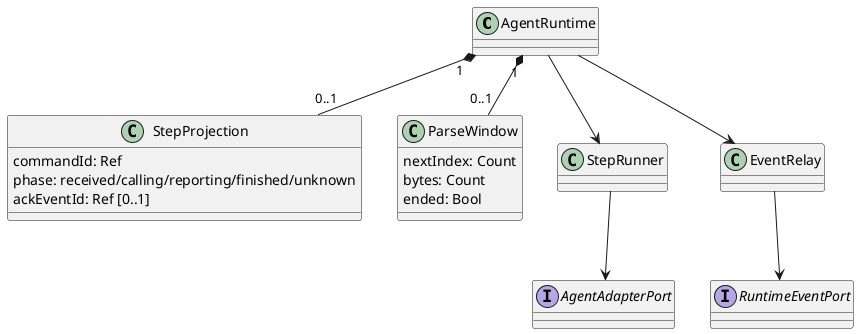
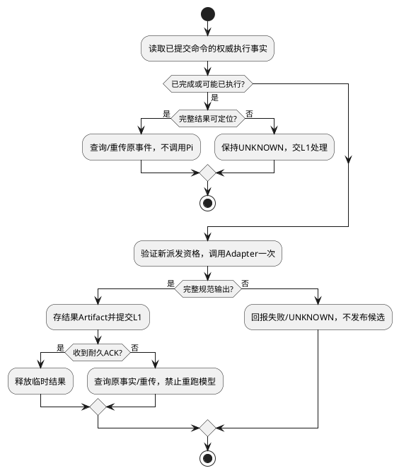

# AgentRuntime / AgentLoop 组件设计

## 职责

AgentRuntime 是可重建的执行领域服务，连续处理 L1 派发的 Attempt；AgentLoop 是单个 Attempt 内按序执行模型步骤、接收规范结果并形成候选动作的算法。它不拥有 Run，不负责调度、权限、工具执行、Session 持久化或业务编排。

## 状态与不变量

- 仅保存当前 Attempt 的循环游标、已确认事件序号、剩余预算和暂停原因；进程丢失后可由 L1 Journal 重建。
- 同一 Attempt 同时最多有一个有效推进者；多 Worker 场景必须尊重 L1 提供的 Lease/Fence。
- Deadline、取消或步数预算触发后不得产生新的模型、工具或委派动作。
- 工具候选发出后进入暂停态，只有 L1 的已持久化结果或拒绝结果可以恢复。

## 入站与出站 Port

入站由 L1 的 Runtime Control 语义覆盖：派发、恢复、取消和只读检查。出站只使用 Runtime Event 与 `AgentAdapterPort`；工具候选、记忆候选和委派候选全部作为规范事件返回 L1，不直接调用对应执行层。

## 推进算法

每一步先校验取消、Deadline 和预算，再读取冻结输入调用 Adapter；随后校验规范事件、按序提交 L1。若产生受保护动作候选则暂停；若产生最终回答或不可恢复故障则收敛。事件未获 L1 确认前不得越过该序号继续推进。

## 并发、恢复与故障

重复派发和重复恢复按 Attempt 与事件序号去重。模型调用超时只表示调用结果未知，不自动重放可能产生副作用的后续动作。Runtime 崩溃后由 L1 判定 Attempt 是否恢复、重试或终止，Runtime 本身不得修改权威状态。

## 契约边界

本文只定义控制方向与不变量，不冻结 Dispatch、Resume、Event 的字段和错误码。

## 开发设计：L2-CMP-001 / CD-1（2026-09-07）

候选开发设计，不代表实现或批准。分类：**独立组件**。字段与操作唯一维护于[CD-1契约](../../../contracts/component-development-contracts-v1.md#agent-runtime-loop)；早期概要中的签名待定、可选重试等简写按CD-1明确行为解释。分类依据见[必要性审查](../../../reviews/components-2026-09-07/scope.md)。

### 1. 问题与取舍

具体失效/验证轨迹：模型返回tools：产生ModelCompleted一次、工具执行0、第二模型调用0。需要下面的职责划分与明确提交/恢复点；协作者可用纯函数实现，不要求每个职责一个类、进程或公共Port。

### 2. 内部职责、依赖与生命周期

AgentRuntime：接收一个已提交模型步骤；StepRunner：一次Adapter调用；EventRelay：有界结果回传；CancellationScope：当前调用取消。AgentLoop仅表示单步流消费，不再拥有ReAct迁移规则。

本节细化既有Port允许的调用方向。跨组件只交换不可变值、稳定引用或Port，不传共享可变Run/Session。机制依然归Infrastructure，不因合并开发任务而搬入领域层。

### 3. 数据与操作

[数据与操作明细](../../../contracts/component-development-contracts-v1.md#agent-runtime-loop)给出字段、判别值和调用边界。写操作组合CD-1命令元数据，查询组合请求与可信作用域；Ref不构成访问授权。无状态对象仅为输入输出，不因此新建Repository。

### 4. 正常流程与分支

校验命令必须InvokeModel且已提交、claim有效、Frame绑定完全相同。L1将模型命令CLAIMED落库后才调用L2；L2通过只读执行证明验证受理。一次调用Adapter，Parser验证完整输出，发布assistantTurn Artifact，构造稳定eventId并投递L1；收到耐久T1回执才丢本地缓冲。遇tools/child仅返回候选并结束该步骤；下一模型步骤必须由Core产生另一个已提交InvokeModel。

先验证来源、Scope、大小、契约与幂等前置，再执行本节算法。明确区分纯计算结果、耐久受理回执和外部执行结果；外部操作只在必要状态提交后派发。

### 5. 并发、幂等与恢复

不在L2保存可恢复外部受理权。派发响应丢失且本地实例消失时L1命令记UNKNOWN，不能依赖L2内存去重再次调用Provider。完整结果Artifact与回传收据存在时重复投递同eventId；确认不存在完整结果时保留UNKNOWN。

无法证明未执行时返回UNKNOWN，不返回absent或success。模型/工具首版自动执行重试0，查询有界重试与重新执行分开。并发验收同时核对状态版本、提交顺序和真实执行次数。

### 6. 安全

没有Tool/Child/Memory写端口，候选与权限事实类型隔离。L2不得接触Permit明文；每个模型发送复核信封当前有效性和取消/Deadline。

普通遥测不含Prompt、Memory正文、工具参数、内容摘要、Secret、Permit或物理路径。必要安全审计走独立耐久Journal；普通遥测失败不回滚事实。拒绝路径同时保证未授权读取数和新副作用数为0。

### 7. 配置、容量与运维

每个commandId最多1次模型外部执行；同Attempt允许有序多个不同command；总并发由4槽约束；输出256KiB、候选8、缓冲1MiB；调用120秒收敛到Run Deadline。

以上为设计目标，不是测量结果。配置启动校验、冻结configVersion，不能热更新放宽既有Run。指标使用CD-1封闭component/phase/result/code集合；共同告警、容量总账与保留期见CD-1。

诊断顺序：核对版本 → 查询本次身份与阶段 → 查询权威回执或投影来源 → 区分拒绝/未受理/已受理/UNKNOWN → 按本节恢复。禁止直接改数据库状态或放宽权限解除挂起。

### 8. SFMEA、故障注入与验收

局部表是契约验收矩阵，不对正常用例机械计算风险分数。具体失效原因、系统影响、严重度依据、控制措施与跨组件测试见[统一SFMEA](../../../reviews/components-2026-09-07/acceptance-matrix.md)。O/D无运行证据不估数值；全部具名风险均是强制实现验收项，不依赖RPN阈值。

| 场景/需求 | 输入、故障注入与精确预期 | 局部追踪 | 测试 |
|---|---|---|---|
| L2-CMP-001-SC-01/REQ-01 | 模型返回tools：产生ModelCompleted一次、工具执行0、第二模型调用0 | L2-CMP-001-FM-01 | L2-CMP-001-TC-01 |
| L2-CMP-001-SC-02/REQ-02 | 同命令重复dispatch且L1已CLAIMED：只查原记录不再次发送 | L2-CMP-001-FM-02 | L2-CMP-001-TC-02 |
| L2-CMP-001-SC-03/REQ-03 | T1持久化丢ACK：同eventId回传，Run消费1次 | L2-CMP-001-FM-03 | L2-CMP-001-TC-03 |
| L2-CMP-001-SC-04/REQ-04 | Adapter半包失败：没有ModelCompleted或可执行候选 | L2-CMP-001-FM-04 | L2-CMP-001-TC-04 |
| L2-CMP-001-SC-05/REQ-05 | 取消在模型发送前：HTTP调用0 | L2-CMP-001-FM-05 | L2-CMP-001-TC-05 |
| L2-CMP-001-SC-06/REQ-06 | L2重启内存清空：UNKNOWN不会变received并自动执行 | L2-CMP-001-FM-06 | L2-CMP-001-TC-06 |

六例均做契约/集成验证；纯算法使用冻结输入，涉及崩溃的用例加真实进程终止与SQLite/Artifact恢复，不能只重建内存实例。Faux Provider记录实际生效次数，测试不使用真实密钥或付费模型。用ManualClock和双屏障精确控制取消、到期和CAS竞态，不以sleep碰撞概率。

每例保存合成输入、契约/config/代码版本、屏障释放顺序、调用轨迹、期望/实际状态与数量、错误码、资源清理和泄漏扫描。必须分别注入未生效失败、已生效丢响应；预期不能由被测实现生成。

另覆盖合法成功、每个声明状态迁移与未声明状态×操作拒绝；限额逐个测L-1/L/L+1，两Scope交错和取消清理。性能按最大合法输入运行10,000次，记录Node/OS/CPU/内存和P99；异步组件按统一SFMEA的固定Faux负载测得C后，以0.8C到达速率持续30分钟，资源不超硬界限。独立实现验收报告必须区分替身、真实本地和真实外部证据。

### 9. 开发拆分与完成定义

顺序：契约验证 → 纯规则/状态机 → Repository或机制Adapter → 幂等/恢复 → 安全强制 → 具名故障和容量验收。实现分类为内部职责的随所属组件交付，不另建服务；条件启用项只有档案满足才启用。

文档就绪要求：五角色无未关闭P0/P1、字段和操作无未定义引用、恢复无开发者自由猜测分支、SFMEA映射验收、配置有硬界限。实现就绪另需代码、测试与持久性证据和架构所有者批准。

## 开发设计：L2-CMP-002 / CD-1（2026-09-07）

候选开发设计，不代表实现或批准。分类：**内部职责**。字段与操作唯一维护于[CD-1契约](../../../contracts/component-development-contracts-v1.md#parser-normalizer)；早期概要中的签名待定、可选重试等简写按CD-1明确行为解释。分类依据见[必要性审查](../../../reviews/components-2026-09-07/scope.md)。

### 1. 问题与取舍

具体失效/验证轨迹：index0,2：SEQUENCE_GAP且候选0。需要下面的职责划分与明确提交/恢复点；协作者可用纯函数实现，不要求每个职责一个类、进程或公共Port。

### 2. 内部职责、依赖与生命周期

ParserNormalizer：规范事件窗口；SequenceGuard：临时片段顺序；CandidateValidator：Schema/目录/引用形状；CompletionAssembler：完整结果。Provider流语法只在PiAdapter解析。

本节细化既有Port允许的调用方向。跨组件只交换不可变值、稳定引用或Port，不传共享可变Run/Session。机制依然归Infrastructure，不因合并开发任务而搬入领域层。

### 3. 数据与操作

[数据与操作明细](../../../contracts/component-development-contracts-v1.md#parser-normalizer)给出字段、判别值和调用边界。写操作组合CD-1命令元数据，查询组合请求与可信作用域；Ref不构成访问授权。无状态对象仅为输入输出，不因此新建Repository。

### 4. 正常流程与分支

begin绑定命令与目录；push要求index从0连续、累计字节计数溢出前拒绝。重复相同index同摘要返回原ACK，异摘要PARSE_CONFLICT。候选toolDescriptor必须属于冻结目录，参数用注册Schema验证，不补默认权限。end只一次；finish要求已end、完整assistant轮次及至少一种合法输出，text+tools选tools并保留text于assistantTurn；child与tools同输出拒绝。

先验证来源、Scope、大小、契约与幂等前置，再执行本节算法。明确区分纯计算结果、耐久受理回执和外部执行结果；外部操作只在必要状态提交后派发。

### 5. 并发、幂等与恢复

窗口丢失不能从半包猜测完成。abort幂等丢临时缓冲；Parser错误反馈Adapter/Runtime稳定ModelFailed，未经验证的候选不得进入T1。已end后新chunk拒绝不改变已验证内容。

无法证明未执行时返回UNKNOWN，不返回absent或success。模型/工具首版自动执行重试0，查询有界重试与重新执行分开。并发验收同时核对状态版本、提交顺序和真实执行次数。

### 6. 安全

拒绝未知字段、重复JSON键、危险原型键、深度超限；只做结构验证，不赋予Allow。参数Schema引用不可由模型替换；诊断不输出原始片段。

普通遥测不含Prompt、Memory正文、工具参数、内容摘要、Secret、Permit或物理路径。必要安全审计走独立耐久Journal；普通遥测失败不回滚事实。拒绝路径同时保证未授权读取数和新副作用数为0。

### 7. 配置、容量与运维

窗口≤16、每个1MiB；单chunk64KiB、深度32、工具候选≤8；累计输出FE默认256KiB；finish P99≤10ms。

以上为设计目标，不是测量结果。配置启动校验、冻结configVersion，不能热更新放宽既有Run。指标使用CD-1封闭component/phase/result/code集合；共同告警、容量总账与保留期见CD-1。

诊断顺序：核对版本 → 查询本次身份与阶段 → 查询权威回执或投影来源 → 区分拒绝/未受理/已受理/UNKNOWN → 按本节恢复。禁止直接改数据库状态或放宽权限解除挂起。

### 8. SFMEA、故障注入与验收

局部表是契约验收矩阵，不对正常用例机械计算风险分数。具体失效原因、系统影响、严重度依据、控制措施与跨组件测试见[统一SFMEA](../../../reviews/components-2026-09-07/acceptance-matrix.md)。O/D无运行证据不估数值；全部具名风险均是强制实现验收项，不依赖RPN阈值。

| 场景/需求 | 输入、故障注入与精确预期 | 局部追踪 | 测试 |
|---|---|---|---|
| L2-CMP-002-SC-01/REQ-01 | index0,2：SEQUENCE_GAP且候选0 | L2-CMP-002-FM-01 | L2-CMP-002-TC-01 |
| L2-CMP-002-SC-02/REQ-02 | 相同index异内容：PARSE_CONFLICT | L2-CMP-002-FM-02 | L2-CMP-002-TC-02 |
| L2-CMP-002-SC-03/REQ-03 | end后继续text：INVALID_STATE不追加 | L2-CMP-002-FM-03 | L2-CMP-002-TC-03 |
| L2-CMP-002-SC-04/REQ-04 | 8个合法tools允许，9个OUTPUT_LIMIT且工具派发0 | L2-CMP-002-FM-04 | L2-CMP-002-TC-04 |
| L2-CMP-002-SC-05/REQ-05 | text+tools：完整assistant文本保留，output.kind=tools | L2-CMP-002-FM-05 | L2-CMP-002-TC-05 |
| L2-CMP-002-SC-06/REQ-06 | 不完整参数JSON/重复键：SCHEMA_INVALID，不填补为可执行对象 | L2-CMP-002-FM-06 | L2-CMP-002-TC-06 |

六例均做契约/集成验证；纯算法使用冻结输入，涉及崩溃的用例加真实进程终止与SQLite/Artifact恢复，不能只重建内存实例。Faux Provider记录实际生效次数，测试不使用真实密钥或付费模型。用ManualClock和双屏障精确控制取消、到期和CAS竞态，不以sleep碰撞概率。

每例保存合成输入、契约/config/代码版本、屏障释放顺序、调用轨迹、期望/实际状态与数量、错误码、资源清理和泄漏扫描。必须分别注入未生效失败、已生效丢响应；预期不能由被测实现生成。

另覆盖合法成功、每个声明状态迁移与未声明状态×操作拒绝；限额逐个测L-1/L/L+1，两Scope交错和取消清理。性能按最大合法输入运行10,000次，记录Node/OS/CPU/内存和P99；异步组件按统一SFMEA的固定Faux负载测得C后，以0.8C到达速率持续30分钟，资源不超硬界限。独立实现验收报告必须区分替身、真实本地和真实外部证据。

### 9. 开发拆分与完成定义

顺序：契约验证 → 纯规则/状态机 → Repository或机制Adapter → 幂等/恢复 → 安全强制 → 具名故障和容量验收。实现分类为内部职责的随所属组件交付，不另建服务；条件启用项只有档案满足才启用。

文档就绪要求：五角色无未关闭P0/P1、字段和操作无未定义引用、恢复无开发者自由猜测分支、SFMEA映射验收、配置有硬界限。实现就绪另需代码、测试与持久性证据和架构所有者批准。

### R1评审修订适用项

本组件关联的授权/Child受理与池预算/Session及Context冻结/资源扫描/UNKNOWN与审计完成点，按[CD-1 R1闭环](../../../contracts/component-development-contracts-v1.md#授权闭环r1替代首轮工具专用decisionrequest)执行。R1补充是本轮完整设计的一部分；前文概括不能省略这些字段和事务步骤。

## Pi 单轮封装的 Runtime 协作细化（2026-09-09）

本组件保留命令与结果边界，不复刻Pi agentLoop。ParserNormalizer是内部确定性算法，随本组件交付；不拆独立域服务。模型输入转换、Provider事件解析不在Runtime实现。

### 场景约束和内部结构

单个Runtime调用对应一个已提交command，单消费者串行。不同命令使用独立工作集；L1负责派发排他与旧代次提交拒绝，不能由Runtime内存Map充当权威去重。

StepProjection/ParseWindow字段由CD-1唯一维护，均为内存投影。commandId绑定上游命令，ackEventId初始null、仅在耐久ACK确认后赋值；nextIndex初始0、bytes初始0、ended初始false。Count为非负安全整数，字节按规范输出UTF-8计算。nextIndex不等于Run sequence。ParseWindow收到end后只能finish/abort，不接受新片段。重复index需匹配已接收内容摘要；摘要缓存按输出总量有界，窗口结束释放。

### 命令与交付状态算法

| 当前阶段/事件 | 前提与动作 | 下阶段/结果 |
|---|---|---|
| received/dispatch | L1已claim；核验绑定、格式、取消/deadline；公共信封需B1闭合 | 合法才calling |
| calling/完整Adapter流 | Parser校验全部chunk及合法end；保存规范结果Artifact | reporting |
| calling/失败或取消 | abort当前Adapter；不产生ModelCompleted | 未发送明确失败；可能发送则unknown |
| reporting/耐久ACK | 核对同command及eventId，写ackEventId | finished，释放本地缓冲 |
| reporting/ACK丢失 | 只查询L1；有原完整Artifact则重传原eventId | 不进入calling |
| 任意/旧执行资格失效 | L1提交拒绝；停止发送与提交 | 不通过重建实例绕过代次 |

上图覆盖L2-S01正常、S02工具候选、S04失败与S05恢复；候选完成后当前步骤结束，L1执行工具并提交新命令才能再次调用Runtime。只保存进度文本不构成完整结果。L1持久化、Artifact保留与事件去重沿已有公共契约，不在L2建立第二份库。

扩展新的Provider只改Adapter装配和契约测试，不修改本状态表；新增公共结果变体才要求同步Parser穷尽处理。现有L2-CMP-001/002-TC继续有效，新增Pi特定恢复用例L2-PI-20验证ACK丢失后实际模型调用数，而非只断言本地缓存命中。
