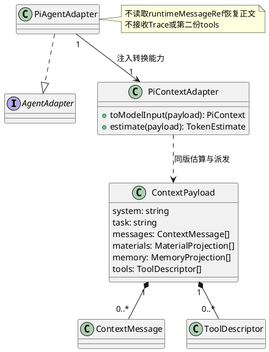
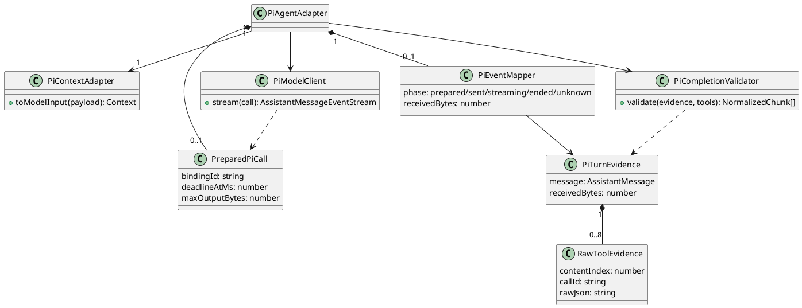

# PiAgentAdapter 组件设计

## 职责

PiAgentAdapter 实现 `AgentAdapterPort`，在 Adapter 私有边界内完成 Pi 请求构造、Provider 调用、流解析、函数调用候选归一化、用量采集和错误映射。Pi 原生 Session、Message、Tool、Event 与 Provider 类型不得越过该边界。

## 私有协作者

Pi Adapter 可以定义私有 `ModelInvocationPort`，用于封装 Provider SDK、HTTPS/SSE、密钥装配和有限重试。该 Port 不被 AgentRuntime、L1 或其他 Adapter 引用，也不进入公共 contracts。

## 状态与生命周期

Adapter 保存的流游标、Provider 请求标识和解析缓冲均为单次调用临时状态；Kernel 的 Session/Run 不能映射为 Provider 进程或原生 Session 所有权。实例由 Composition Root 创建，并接收作用域化的模型出口和 Secret 解析能力。

## 归一化规则

文本、推理摘要、用量、终止原因和动作候选转换为 Kernel 规范事件；Provider 私有字段只可形成脱敏详情引用。Pi 返回的工具调用只是 `ToolCallCandidate`，不得在 Adapter 内执行、授权或重试工具。

## 故障与资源边界

调用遵守端到端 Deadline、最大帧、最大累计输出和取消信号。流中断或结束状态不明时返回未知结果故障，由 L1 决定 Attempt 后续动作。日志不得记录密钥、完整 Prompt 或原始敏感输出。

## 契约边界

本文不冻结 Pi CLI/SDK 版本、Provider 配置字段或 `ModelInvocationPort` 签名。

## 开发设计：L2-CMP-004 / CD-1（2026-09-07）

候选开发设计，不代表实现或批准。分类：**独立组件**。字段与操作唯一维护于[CD-1契约](../../../contracts/component-development-contracts-v1.md#pi-agent-adapter)；早期概要中的签名待定、可选重试等简写按CD-1明确行为解释。分类依据见[必要性审查](../../../reviews/components-2026-09-07/scope.md)。

### 1. 问题与取舍

具体失效/验证轨迹：Pi原生工具事件：转candidate，execute回调计数0。需要下面的职责划分与明确提交/恢复点；协作者可用纯函数实现，不要求每个职责一个类、进程或公共Port。

### 2. 内部职责、依赖与生命周期

PiAgentAdapter：实现公共Adapter；PiContextAdapter：复用上下文计量阶段的同一规范映射实现；Pi内建Provider解码器：负责私有流解析，不在Kernel重写；PiEventMapper：消费Pi事件并转规范Chunk；私有ModelInvocationClient：封装受控出口内的Pi streamSimple。Composition Root注入映射能力，不由Adapter再实现一套历史转换或读取原生消息缓存。



本节细化既有Port允许的调用方向。跨组件只交换不可变值、稳定引用或Port，不传共享可变Run/Session。机制依然归Infrastructure，不因合并开发任务而搬入领域层。

### 3. 数据与操作

[数据与操作明细](../../../contracts/component-development-contracts-v1.md#pi-agent-adapter)给出字段、判别值和调用边界。写操作组合CD-1命令元数据，查询组合请求与可信作用域；Ref不构成访问授权。无状态对象仅为输入输出，不因此新建Repository。

模型输入采用[CTX-CON-1](../../../contracts/context-assembly-contract.md)四字段AgentTurnRequest，payload的字段级定义和pi-context-1映射由该契约唯一维护。system/task原文、历史块序、工具映射ID与Child任务/观察必须保留；tools只来自payload.tools。估算和实际发送必须调用同版PiContextAdapter；未知字段、角色或块不得由Pi转换函数静默过滤。

### 4. 正常流程与分支

把完整assistant/tool因果轮次映射为Pi消息；可见工具转纯描述，无可执行callback。选择Pi streamSimple单轮入口，不调用原生agentLoop；自动推理重试0。消费Pi流，参数严格完整且final stop reason合法后生成候选。原生arguments可能经过修补，不足以证明完整性，须满足下文参数证据档案。首版不发布thinking内容或自动生成推理摘要，只发布产品可见文本和合法候选；发布完整规范assistant轮次。

先验证来源、Scope、大小、契约与幂等前置，再执行本节算法。明确区分纯计算结果、耐久受理回执和外部执行结果；外部操作只在必要状态提交后派发。

### 5. 并发、幂等与恢复

sent之后异常均按已知Provider回执或UNKNOWN归类；不因网络/429重新send。私有请求ID可用于只读查询，Provider无查询能力明确unsupported，不能伪造absent。Pi接口升级需契约适配测试通过后再替换绑定版本。

已采纳恢复由Host读取原完整候选并核验绑定；Adapter仅把原payload映射给Pi，不读取原生消息表，也不因runtimeMessageRef存在而覆盖候选裁剪或ctxcall映射。旧格式显式不支持，保留原数据供外部处置；本组件不迁移、不清理历史数据。

无法证明未执行时返回UNKNOWN，不返回absent或success。模型/工具首版自动执行重试0，查询有界重试与重新执行分开。并发验收同时核对状态版本、提交顺序和真实执行次数。

### 6. 安全

Secret只在Egress内解析，Adapter公共请求不含key；工具描述/参数不得被原生Pi执行器自动调用。Egress不可用禁止直接用SDK网络fallback。

普通遥测不含Prompt、Memory正文、工具参数、内容摘要、Secret、Permit或物理路径。必要安全审计走独立耐久Journal；普通遥测失败不回滚事实。拒绝路径同时保证未授权读取数和新副作用数为0。

### 7. 配置、容量与运维

单原生chunk64KiB、累计256KiB、缓冲1MiB；首版调用120秒、自动重试0；取消信号传播≤100ms为本地目标。

以上为设计目标，不是测量结果。配置启动校验、冻结configVersion，不能热更新放宽既有Run。指标使用CD-1封闭component/phase/result/code集合；共同告警、容量总账与保留期见CD-1。

诊断顺序：核对版本 → 查询本次身份与阶段 → 查询权威回执或投影来源 → 区分拒绝/未受理/已受理/UNKNOWN → 按本节恢复。禁止直接改数据库状态或放宽权限解除挂起。

### 8. SFMEA、故障注入与验收

局部表是契约验收矩阵，不对正常用例机械计算风险分数。具体失效原因、系统影响、严重度依据、控制措施与跨组件测试见[统一SFMEA](../../../reviews/components-2026-09-07/acceptance-matrix.md)。O/D无运行证据不估数值；全部具名风险均是强制实现验收项，不依赖RPN阈值。

| 场景/需求 | 输入、故障注入与精确预期 | 局部追踪 | 测试 |
|---|---|---|---|
| L2-CMP-004-SC-01/REQ-01 | Pi原生工具事件：转candidate，execute回调计数0 | L2-CMP-004-FM-01 | L2-CMP-004-TC-01 |
| L2-CMP-004-SC-02/REQ-02 | split参数跨三chunk：结束前候选0，完整后1 | L2-CMP-004-FM-02 | L2-CMP-004-TC-02 |
| L2-CMP-004-SC-03/REQ-03 | Provider错误含密钥：公共Fault/日志均无密钥 | L2-CMP-004-FM-03 | L2-CMP-004-TC-03 |
| L2-CMP-004-SC-04/REQ-04 | 429或SSE断开：send次数1 | L2-CMP-004-FM-04 | L2-CMP-004-TC-04 |
| L2-CMP-004-SC-05/REQ-05 | 同session两个Run：不共享原生可变Message数组 | L2-CMP-004-FM-05 | L2-CMP-004-TC-05 |
| L2-CMP-004-SC-06/REQ-06 | 输出超过256KiB：取消流且不发布成功Artifact | L2-CMP-004-FM-06 | L2-CMP-004-TC-06 |
| L2-CMP-004-SC-07/REQ-07 | 历史来自两个Run且callId相同；候选ctxcall ID与原生缓存内容不同 | 实际Pi输入只含候选正文，两对调用各自匹配，原生缓存读取0 | L2-CMP-004-TC-07 |
| L2-CMP-004-SC-08/REQ-08 | Child成功/明确失败映射为任务观察；注入空正文或未知块 | 合法输入按CTX-CON-1映射，非法输入在发送前拒绝 | L2-CMP-004-TC-08 |

上述用例均做契约/集成验证；纯算法使用冻结输入，涉及崩溃的用例加真实进程终止与SQLite/Artifact恢复，不能只重建内存实例。Faux Provider记录实际生效次数，测试不使用真实密钥或付费模型。用ManualClock和双屏障精确控制取消、到期和CAS竞态，不以sleep碰撞概率。

每例保存合成输入、契约/config/代码版本、屏障释放顺序、调用轨迹、期望/实际状态与数量、错误码、资源清理和泄漏扫描。必须分别注入未生效失败、已生效丢响应；预期不能由被测实现生成。

另覆盖合法成功、每个声明状态迁移与未声明状态×操作拒绝；限额逐个测L-1/L/L+1，两Scope交错和取消清理。性能按最大合法输入运行10,000次，记录Node/OS/CPU/内存和P99；异步组件按统一SFMEA的固定Faux负载测得C后，以0.8C到达速率持续30分钟，资源不超硬界限。独立实现验收报告必须区分替身、真实本地和真实外部证据。

### 9. 开发拆分与完成定义

顺序：契约验证 → 纯规则/状态机 → Repository或机制Adapter → 幂等/恢复 → 安全强制 → 具名故障和容量验收。实现分类为内部职责的随所属组件交付，不另建服务；条件启用项只有档案满足才启用。

文档就绪要求：五角色无未关闭P0/P1、字段和操作无未定义引用、恢复无开发者自由猜测分支、SFMEA映射验收、配置有硬界限。实现就绪另需代码、测试与持久性证据和架构所有者批准。

### R1评审修订适用项

本组件关联的授权/Child受理与池预算/Session及Context冻结/资源扫描/UNKNOWN与审计完成点，按[CD-1 R1闭环](../../../contracts/component-development-contracts-v1.md#授权闭环r1替代首轮工具专用decisionrequest)执行。R1补充是本轮完整设计的一部分；前文概括不能省略这些字段和事务步骤。

## Pi 封装详细设计（2026-09-09）

### 适用约束与功能域交互标准

同一调用实例只接收一次不可变请求；内部单消费者，不支持重入。不同调用实例可并行，L1 保证同 Attempt 顺序与提交代次有效性。Adapter 没有跨进程去重能力。域按输入准备、模型流消费、完整输出三个功能划分；域不是独立服务，内部调用只按下面顺序发生，不建立域间回调总线。

| 生产者 → 消费者 | 交换结构（本组件唯一拥有） | 所有权、顺序及失败 |
|---|---|---|
| 输入准备 → 模型流消费 | PreparedPiCall | 新调用独占；版本/输入校验后才产生；失败不发送 |
| 模型流消费 → 完整输出 | PiTurnEvidence | 仅收到原生done且流形状合法后生成；冻结深拷贝；error/EOF/abort无此值 |
| 完整输出 → Adapter → Runtime | CD-1 NormalizedChunk / AdapterFault | 先完成整轮校验再发candidate/usage/end；text仅为非权威进度；Runtime重验后提交 |

下列类型仅存在 Pi Adapter 私有目录。Pi `Context`、`AssistantMessage` 和 `Model<Api>` 使用实际 workspace 类型；`AgentTurnRequest` 由 CTX-CON-1 拥有，`JsonValue` 使用现有 Kernel JSON 类型。

```typescript
interface PreparedPiCall {
  readonly request: AgentTurnRequest;
  readonly bindingId: string;
  readonly model: Model<Api>;
  readonly context: Context;
  readonly deadlineAtMs: number;
  readonly maxOutputBytes: number;
  readonly signal: AbortSignal;
}
interface RawToolEvidence {
  readonly contentIndex: number;
  readonly callId: string;
  readonly rawJson: string;
}
interface PiTurnEvidence {
  readonly message: AssistantMessage;
  readonly rawTools: readonly RawToolEvidence[];
  readonly receivedBytes: number;
}
```

全部字段必填且非null。bindingId为受信装配生成的不透明非空标识，固定模型、Pi构建和映射版本；不从模型输出推导。deadlineAtMs为UTC毫秒安全整数，输出上限为1..262144字节。context由共享转换器新建，不和调用方共享可变数组；只供一次Pi发送，SDK若会修改则在私有边界复制。request保留冻结输入，只用于映射一致性、工具目录核验。signal只取消本次调用，不作为权限证明。

rawTools基数0..8，按contentIndex递增，索引是最终Pi content位置而非工具局部序号；必须和message内全部toolCall一一对应。callId在当前turn唯一且非空，与最终块一致；rawJson是Provider原始参数文本，不能从已解析arguments重新序列化伪造。receivedBytes为入站增量UTF-8字节累计，安全非负整数；不重复计partial全量快照，不等于堆内存。调用结束销毁PreparedPiCall/PiTurnEvidence；不持久化原生消息。

### 私有结构与算法



1. 输入域核对formatVersion/modelAdapterVersion与绑定；调用共享PiContextAdapter；校验序列化大小。发送前复核signal/deadline，模型客户端的发送权限由受控Egress落实。
2. 流域只调用一次streamSimple，传signal和maxRetries=0。按Pi事件类型静态穷尽处理表消费，未知事件拒绝；toolcall_delta按contentIndex积累原始文本，thinking不发布且仍受接收容量限制。
3. 完整输出域核对done.reason与message.stopReason一致。`stop`只接受无工具且存在非空可见文本；`toolUse`要求至少一个合法工具；`length`首版作为不完整结果失败，即使JSON能解析也不发候选；`deferred`不支持并失败关闭，不发起隐藏查询；error/aborted不成功。
4. 对每个工具先检查原始JSON完整、重复键、危险原型键和深度，再严格解析为对象；核对其值与Pi最终arguments一致，随后按冻结工具schema无类型强转、无default补值、无removeAdditional验证。不是用Pi的宽松解析结果反向生成证据。
5. 验证整批后按原content顺序输出文本和工具候选；任何一个工具失败则整个turn失败，不能先发布合法前缀候选。usage取本次真实Provider报告；不可识别或缺失为null/unknown，历史占位0不参与计费。
6. 交Runtime后由Parser核对Kernel结构和catalog绑定；L1负责稳定事件身份、Artifact保存与采纳。Adapter不签Permit，不消费工具结果，也不等待工具执行。

Pi Provider 是否保留完整raw delta须逐档案验证。只提供修补后对象的Provider不能启用工具输出；不可声称Kernel结构校验能找回已丢失的重复键。实现无损参数证据和原生队列限额的Pi公开扩展点尚未闭合，列为评审B2/B3；不得用另写一套Provider/SSE绕开复用约束。

### 扩展实例

增加Pi已支持的新Provider：在可信装配注册新绑定，运行相同文本、toolUse、截断、raw参数、usage、取消及底层发送计数向量；通过后才启用相应能力。Runtime、L1工具控制和公共候选结构不变。新增Pi事件变体时修改私有穷尽事件表及对应测试；未知变体拒绝，不能靠默认分支静默忽略。多模态/后台deferred不属于当前文本和工具档案，应先补公共契约再启用。
