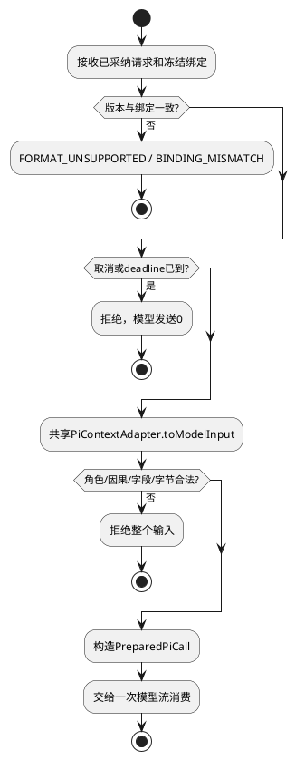

# 输入准备

## 场景、责任与约束

遵循[组件交互标准](../../../pi-agent-adapter.md#适用约束与功能域交互标准)。解决“组装时计量一种正文、实际发送另一种正文”的问题。例如历史callId已经改成ctxcall，而旧Adapter恢复原生缓存会把它覆盖回旧ID，工具观察就不再匹配。

L2-S01首轮、S02工具后续、S03 Child均消费Host已验证的四字段请求。请求到达时Session已经确认，payload已采纳；本域不创建Session、不读Artifact、不执行选择算法。S06恢复只使用原绑定，不自动升级。每次准备使用新工作对象，不重入；同Session的不同调用不共享数组。

## 输入到输出及内部结构

AgentTurnRequest四字段由CTX-CON-1定义：sessionId为已确认技术身份；payload包含system/task/messages/materials/memory/tools六字段；formatVersion为ctx-input-1；modelAdapterVersion为冻结映射版本。输入没有Trace、frame或独立tools。该对象与运行信封的组合仍依赖B1，不在域内发明公共签名。

```typescript
interface PreparationWork {
  readonly sessionId: string;
  readonly bindingId: string;
  readonly context: Context;
  readonly inputBytes: number;
}
```

以上为域内私有类型。字符串非空，context是新建Pi对象，inputBytes为完整映射的UTF-8规范JSON字节，0..1048576安全整数。所有字段必填，无null；成功组装时创建，转为组件PreparedPiCall后销毁工作对象。context.messages至少包含当前user消息；历史可空，tools可空且名称唯一。不得修改原payload，TypeBox符号不计入网络JSON。

PiContextAdapter唯一负责payload→Context。准备域只校验版本/限制、调用转换及装配PreparedPiCall，不新建第二套message mapper。system原文→systemPrompt；历史按因果序；当前task/materials/memory按CTX-CON-1三个text块保留；tools只描述模型可见工具。转换占位usage不能当作模型使用量。



该公共流程覆盖S01空历史与非空历史、S02完整工具调用/观察、S03 Child任务/观察；缺字段或悬空引用走校验失败出口。S06版本不可用走首个拒绝出口。转换期间取消在发送前再检查，不能因为准备已完成而忽略。

## 扩展、持久化与恢复

新增输入块先改CTX-CON-1和共享PiContextAdapter，准备域仅消费新绑定；不得以Provider私有字段扩充公共payload。域无持久化、无迁移表，恢复不使用内存工作集。旧格式明确拒绝并保留原Artifact，由上游处理，不在这里转换或删除。

## SFMEA与测试设计

严重度按影响描述；O/D无数据不评分。以下全部为设计、未实现/未运行，测试ID为候选，尚未登记到可执行验收注册表。

| 风险/场景 | 原因与影响 | 检测、控制及恢复 | 用例/层级、固定输入和独立预期 |
|---|---|---|---|
| I1/S01 字段丢失 | 只映射task导致资料未发送，回答依据缺失 | 检查六字段及固定编码；发送前失败 | L2-PI-01 UT/契约：task=`查案`，materials正文含中文、引号、换行；faux捕获Context解码后逐字一致，空memory仍items=[] |
| I2/S02 原生缓存覆盖 | 跨Run旧callId覆盖ctxcall，工具因果错误 | 禁用原生消息读取；固定映射 | L2-PI-02 集成：两历史轮callId已为ctxcall:a/ctxcall:b，缓存故意放旧值；Pi收到两对正确ID，缓存读取0 |
| I3/S03 Child丢失 | convertToLlm过滤未知块，丢任务/观察 | 转换前白名单与完整性检查 | L2-PI-03 UT：child_task及失败task_observation各1；对应规范JSON文本保留，未知块输入则发送0 |
| I4/S06 热换映射 | 原候选与新绑定不一致 | 发送前绑定匹配，恢复拒绝 | L2-PI-04 契约：原pi-context-1请求配不匹配版本；失败且Provider调用0 |
| I5/S04 准备时取消 | 异步装配完成后误发送 | 发送前取消复核 | L2-PI-05 集成：准备屏障内abort，再放行；发送0、无成功终态 |
| I6/S01 大小与别名 | 超限映射或SDK修改调用方输入 | UTF-8硬限、私有对象 | L2-PI-06 UT：1048575/1048576/1048577字节；前两合法，后一拒绝；修改私有context不改变payload |

DT结构检查：Pi类型只在适配/装配目录；输入映射只有共享实现，Runtime不引入coding-agent SessionManager。系统恢复测试依赖Host保存/采纳链，不能以本域UT替代。与现有CTX输入向量联合验收后才可关闭I1/I2。
