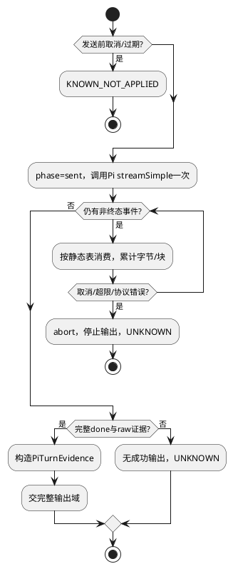

# 模型流消费

## 场景与边界

遵循[组件交互标准](../../../pi-agent-adapter.md#适用约束与功能域交互标准)。复用Pi streamSimple、Provider解码和Abort传播；不实现原生agentLoop，不执行工具。L2-S01/S02每次输入对应一次模型调用；S04覆盖发送前取消、发送后断流、慢下游；S06未知Provider能力在装配时拒绝。

ModelRuntime认证/模型解析由可信装配和Egress承担；调用域只持有已绑定客户端。allowModelNetwork=false不是网络沙箱。maxRetries=0必须同时落实到底层SDK，不以一次streamSimple调用推定一次HTTP请求。

## 工作结构及生命周期

```typescript
interface StreamWork {
  phase: "prepared" | "sent" | "streaming" | "ended" | "unknown";
  receivedBytes: number;
  started: boolean;
  readonly tools: Map<number, ToolBuffer>;
}
interface ToolBuffer {
  readonly contentIndex: number;
  callId: string | null;
  readonly fragments: string[];
  bytes: number;
  closed: boolean;
}
```

输入为组件PreparedPiCall；输出为PiTurnEvidence或稳定fault。两个结构只由本调用单消费者修改。phase初值prepared，started=false；字节均为非负安全整数，按增量UTF-8累积且加法前检查上限。tools基数0..8，键为Pi最终contentIndex（非负整数，可因text/thinking位置不连续）。fragments按delta到达顺序，允许空delta但计入事件数限制需求；callId仅在原生ID尚未出现时null，产出证据前必须非空。closed只从false变true，重复关闭、关闭后delta拒绝。工作集退出即销毁，不持久化。

空片段/心跳仍会占用队列，因此仅字节限制不够；Pi原生队列事件数与入站单帧上限需要B3对应的生产端扩展点。没有该证据不宣称硬内存封顶。

## 静态事件分派与状态

| Pi事件 | 允许前置 | 动作 | 拒绝条件 |
|---|---|---|---|
| start | sent，started=false | started=true，phase=streaming | 重复start |
| text_start/delta/end | streaming | 校验块顺序；只转非权威文本进度 | 块类型错、结束后追加 |
| thinking_start/delta/end | streaming | 仅记容量和块结构，不输出正文 | 超限或结构错误 |
| toolcall_start/delta/end | streaming | 建ToolBuffer、追加raw delta、关闭 | 重复索引、8个以上、关闭后追加 |
| done | streaming且所有块闭合 | 深拷贝最终消息与raw证据；交完整输出域 | reason不符、块不齐、raw证据缺失 |
| error / 抛错 / EOF | sent或streaming | abort本次，结果不完整则UNKNOWN | 不能伪造成功end |

事件处理使用Pi判别联合的静态穷尽表；表只处理协议形状，不包含Provider名分支。Pi EventStream会吞掉终态后的push，Adapter只能校验实际可观察事件；不能声称它检测了已被库隐藏的重复终态。



S04慢消费不能让流泵等待L1每条进度的耐久ACK：独立有界中继消费Pi，候选只在完整输出后提交。中继满则abort，进度不作为恢复证据；Pi源队列限额另须落实。对已sent请求的本地取消，只证明本地停止，不能证明远端没计费。deadline取调用上限与Run截止时间最小值，计时和取消资源在finally释放；到期后不再无限等待stream.result()。

## 扩展与故障验收

新增Provider复用Pi注册入口，需证明raw工具参数和取消/重试/缓冲能力。不合档案者禁用对应能力，不回退自写SSE。域无数据迁移；重启交L1对账，不重新创建流。以下测试均为候选、未实现/未运行。

| 风险/场景 | 影响与检测/控制 | 测试设计及独立期望 |
|---|---|---|
| M1/S02 Pi继续循环 | 工具旁路，严重安全影响；绑定streamSimple | L2-PI-07 DT/集成：faux返回toolUse，实际工具execute=0、模型请求=1、无下一轮 |
| M2/S04 三段后断流 | 半包误成功；无done不生成证据 | L2-PI-08 契约：start、toolcall_start、两个delta后EOF；成功0、候选0、UNKNOWN |
| M3/S04 取消不收敛 | 资源泄漏；deadline/abort/finally | L2-PI-09 集成：发送屏障后abort，注入迟到done；无成功发布，计时器/监听释放；远端停止不作断言 |
| M4/S01 底层重试 | 重复费用及输出；全层关闭重试 | L2-PI-10 集成：本地HTTP替身返回429/503，统计实际请求=1，禁止付费Provider |
| M5/S04 慢消费者 | 原生queue无界；生产端容量门槛B3 | L2-PI-11 容量/故障注入：阻塞下游，快速生产大partial与空delta；同时观测原生队列高水位、RSS和abort；数值上限待B3设计，不登记通过 |
| M6/S06 新事件 | 静默忽略导致错误输出；穷尽分派 | L2-PI-12 UT/DT：注入未知type，失败且候选0；新增编译联合须补处理器 |

严重度按工具旁路/不完整结果/资源耗尽分别描述，O/D未知。单帧64KiB、累计256KiB逐一测L-1/L/L+1；完整partial不能按每次全量重复累计成虚假超限。真实进程终止与结果恢复由Runtime/L1集成验收，纯流替身不证明持久性。
