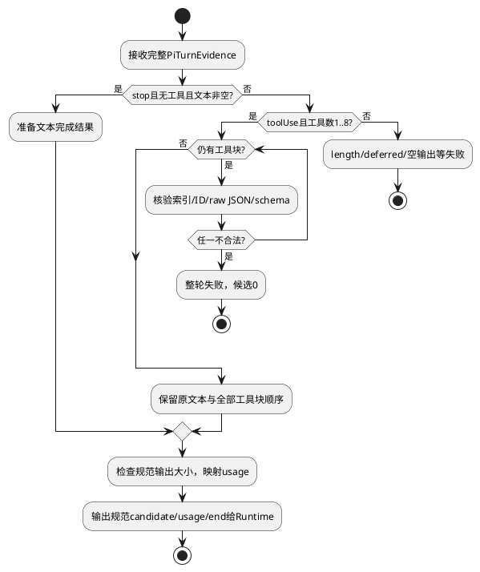

# 完整输出

## 场景与责任

遵循[组件交互标准](../../../pi-agent-adapter.md#适用约束与功能域交互标准)。模型返回`{"path":"a"`时，Pi可能修补成可解析对象；若直接使用该对象执行，就把截断输出当成完整意图。本域只在严格参数证据成立后输出候选，权限和工具执行仍归L1。

S01文本回答，S02文本加多工具，S03委派相关工具候选都经过同一整轮检查；不根据工具名执行Child或Memory逻辑。S05结果重投由Runtime处理，本域不读Journal。只消费单个冻结PiTurnEvidence，不重入，无I/O。

## 内部结构与算法

```typescript
interface CompletionWork {
  readonly toolNames: Set<string>;
  readonly callIds: Set<string>;
  readonly parsedArguments: Map<number, Readonly<Record<string, JsonValue>>>;
  outputBytes: number;
}
```

输入为PiTurnEvidence与原payload.tools。toolNames由冻结目录构造，名称不得重复；callIds初始为空，当前turn唯一；parsedArguments键是最终contentIndex，基数0..8且与全部工具块一一匹配。outputBytes为规范输出UTF-8字节，0..262144。字段必填无null；工作对象仅在验证过程中可变，完成/失败后释放。输出复用CD-1规范结构，不把PiMessage/rawJson作为公共字段。

严格JSON检查必须在JSON.parse前识别重复键：使用保留token位置的扫描器，维护对象层级键集合；逐字符串处理转义，键按解码后的字符串比较，根必须是对象，拒绝尾随数据、未闭合字符串/容器和危险键。容器深度上限32；每层关闭即释放集合。通过后解析，与Pi最终arguments比较规范JSON值，再按冻结schema做不修补验证。rawJson与最终对象不一致直接失败。

该扫描器只验证工具参数JSON，不解析SSE或实现Provider。原始参数证据由组件规定，缺失时禁止用JSON.stringify(arguments)补造。是否引入已有严格JSON库应在实现时依据实际依赖审查，不能用Pi宽松parseStreamingJson替代。



`length`即使文本已展示也不产生成功完成；`deferred`首版不支持，不启动后台轮询。thinking不成为文本。usage只有本次Provider报告且字段合法才采用；缺少计数保持null，负数/非有限值不能写为0。公开fault从封闭映射表生成，不拼接原始Error.message或Provider响应正文。

Adapter的候选输出不等于L1采纳；Runtime只有在整个规范流合法结束后才能发布完整结果Artifact/ModelCompleted。同index同摘要重复回传按Parser规则处理；同index异载荷拒绝。Adapter无业务ACK表。

## SFMEA与验收

以下为待实现测试设计。严重度依据是错误工具参数/错误完成可能影响业务执行；O/D未知，不计算RPN。

| 风险/场景 | 检测、影响、控制和恢复 | 用例、固定输入与独立预期 |
|---|---|---|
| O1/S02 修补参数误用 | raw严格检查；否则错误副作用；整轮拒绝 | L2-PI-13 UT/契约：raw=`{"path":"a"`，Pi对象为`{path:"a"}`；候选0、失败 |
| O2/S02 重复键丢失 | parse前扫描；对象不能还原原始键；拒绝 | L2-PI-14 UT：`{"p":1,"p":2}`及转义等价键；候选0；合法嵌套相同键不误拒绝 |
| O3/S02 部分批次提前发布 | 全批验证后发布；防止前半已执行 | L2-PI-15 集成：两个工具，第二个schema非法；L1工具派发0，不仅第二个为0 |
| O4/S02 截断终态 | stopReason门禁；不把length当成功 | L2-PI-16 契约：完整合法对象但stopReason=length；成功0、工具0；stop+tool同样拒绝 |
| O5/S01 usage伪造 | 区分转换占位与真实报告；影响计费 | L2-PI-17 UT：历史usage占位0，本次usage缺失；公共tokens=null/source=unknown |
| O6/S01 Secret泄漏 | 封闭错误映射，普通日志不带正文 | L2-PI-18 契约：error含合成secret及prompt标记；公共fault与遥测均不包含 |
| O7/S02 文本工具顺序错 | contentIndex映射；影响历史因果 | L2-PI-19 UT：text、toolA、text、toolB；完整assistant保留原顺序，工具候选按A/B；thinking不输出 |
| O8/S05 ACK丢失 | Runtime/L1查询原结果；重复计费风险 | L2-PI-20 真实本地集成：结果Artifact已存且提交成功、丢ACK再恢复；同eventId采纳一次，模型调用仍1 |

补充边界：0/1/8/9个工具，重复callId、目录外名称、深度31/32/33、Unicode键、空文本、deferred、取消后迟到done。UT用固定原始字符串；不能调用被测转换器生成期望。DT检查本域无ToolRuntime/Permit/Session写端口。系统恢复用真实本地存储和进程屏障，faux模型仅替代外部收费调用。

## 升级与完成条件

新增输出类型先修改公共契约和组件交互标准，再增加该域的封闭分派与测试，不根据Provider名添加业务分支。无独立数据库迁移。B1公共输出/信封签名、B2无损raw参数证据未闭合前，不能称工具路径开发就绪；B3容量未验证前不能称可上线。
