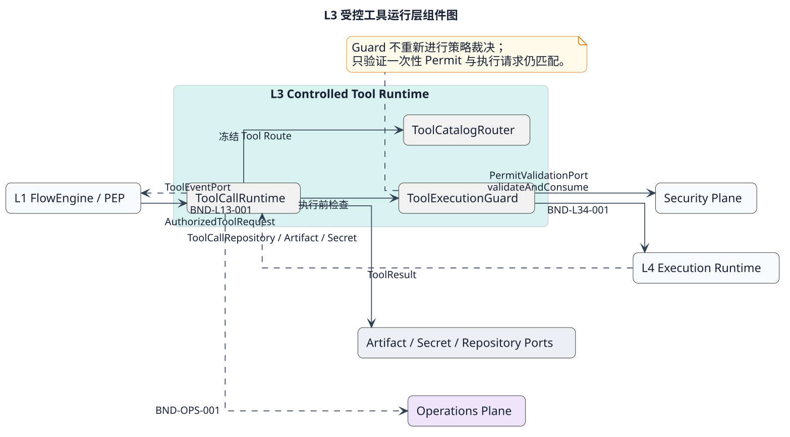

# L3 Tool Runtime 层设计

## 1. 职责与适用范围

L3提供工具注册、可见目录、精确路由、最终授权检查和一次有界调用。工具业务和执行机制归L4，权限策略及Permit权威归Security，业务编排、调用身份和可靠恢复由L1/宿主提供。合法执行路径保持`L2候选 → L1 PEP/PDP → L3 → L4`。

2026-09-09按用户反馈调整设计深度：持久化和一致性作为调用前提与集成约束，不在L3功能域设计数据库表、CAS实现、outbox、墓碑、扫描器或恢复状态机。ToolCall仍是独立工具事实的逻辑边界，不能把这一简化解释为允许重复执行或把工具事实混入Session权威。原候选的可靠性实现草案由本版替代，历史与迁移见[本次评审](../../../governance/reviews/l3-functional-domains-2026-09-09.md)。

## 2. 组件与功能域

| 组件设计（交互标准） | 功能域 | 功能域索引 |
|---|---|---|
| [ToolRegistry](components/tool-registry.md) | 定义注册与版本；可用状态管理 | [注册表功能域](components/tool-registry/README.md) |
| [ToolCatalogRouter](components/tool-catalog-router.md) | 可见目录投影；固定路由解析 | [目录路由功能域](components/tool-catalog-router/README.md) |
| [ToolCallRuntime](components/tool-call-runtime.md) | 调用准备与派发；结果与取消处理 | [调用功能域](components/tool-call-runtime/README.md) |
| [ToolExecutionGuard](components/tool-execution-guard.md) | 执行授权检查（不可再分的内部职责） | [Guard功能域](components/tool-execution-guard/README.md) |

功能域是组件内部功能分类，不是新增服务或聚合。域文档仅向上引用所属组件；组件统一域间字段、顺序和错误语义，索引只导航。四个组件可装配在一个进程，Guard随Runtime交付。

## 3. 正常业务与数据流

管理员注册完整ToolDefinition（含输入/输出Schema和执行绑定）→Registry返回不可变版本，初始disabled→启用后Router生成PublicTool目录→L1冻结目录交L2→模型提出参数→L1准备稳定调用身份、资源与授权→Runtime解析原工具/路由→Guard核验并取得执行许可→Runtime调用L4→结果域返回ToolOutcome供L1保存和采纳。

新版定义不覆盖旧版；停用阻止后续目录和新派发，已发出动作只传播取消。停用不是Security撤销替代品，严格即时阻断需Security执行资格控制。默认工具升级不自动切换正在使用的版本。

## 4. 外部保证与失效行为

| 约束ID | 保证方与要求 | L3使用方式与不能满足时的行为 |
|---|---|---|
| L3-C01 | L1/宿主：同一command只发起一次有效执行；先确认意图与执行资格，接管先隔离旧执行 | L3不做分布式去重；旧资格拒绝；丢响应不得直接重调execute |
| L3-C02 | 装配：Registry管理调用串行；Runtime每次调用独立实例、不重入；取消可经同一事件循环交错 | L3不建队列/锁/lease；本地实例重复进入返回INVALID_STATE；跨线程由宿主隔离 |
| L3-C03 | Security：消费、启动检查、当前授权与审计保证；暴露受信Port | Guard失败关闭，不自行缓存成功授权、补发Permit或解释策略 |
| L3-C04 | 存储适配/宿主：注册表完整版本发布及历史引用保留；工具事实持久化与查询；结果保存后再发布业务事件 | L3只返回事实和引用；不承诺Promise返回即耐久；保存失败由调用方处理，禁止再执行工具 |
| L3-C05 | L4：一次派发、参数与资源不扩权、输出有界、无隐藏重试、取消及效果证据 | 通道失败/效果不明返回unknown；查询只代理原操作，不推断未发生 |
| L3-C06 | L1/FE恢复协调：根据可信证据处理未知结果、重启和迟到事实 | L3无自动恢复扫描及reconcile账本；终态Run不得因迟到结果复活 |
| L3-C07 | Host/基础设施：可信Scope、Clock、Artifact授权读取、Secret与Adapter装配 | 缺失依赖不派发；Ref不是访问权，L3不访问明文Secret |

这些是必须在接入时验证的前提，不是“文档写了就已实现”。同实例串行不代表失联旧进程不再运行。总设计保留ToolCall独立事实边界；具体耐久实现由依赖方提供，本轮不重新设计。

## 5. 接口、验收与非目标

[L3边界契约](../../contracts/l3-tool-runtime-detail.md)定义当前轻量调用档案及L1输入输出；[L3→L4协议](../../contracts/bnd-l34-001.md)定义语义载荷。参数64KiB、结果256KiB、目录256条/1MiB、工具60秒且只可缩短，均为设计限额，执行重试0。

组件与域内测试采用UT/DT、跨组件用Contract/Integration；真实持久化、故障接管和外部执行可靠性是C01—C07集成验收，不用L3单元测试代替。所有本轮新增用例仅为设计，未运行。首版不提供远程工具包安装、自动最新版本选择或任意Provider反射。
