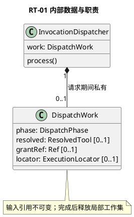
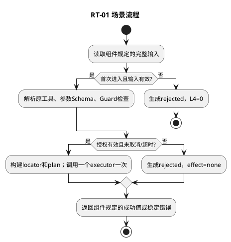

# RT-01 调用准备与派发

## 1. 功能目标与场景

L1需要用明确版本和参数执行一次工具。前置C01执行资格已由外部保证，Guard仍检查当前授权。本实例只能execute一次；禁止把多实例并发去重责任隐含到内存标志。

规范依赖仅为[所属组件设计](../../../tool-call-runtime.md)§2交互标准；遵循组件的实例、调用前提、错误与版本约束。下列S1等场景分支先定义业务预期，再推导工作数据及测试，不新增服务或聚合。

## 2. 字段级内部数据与流转

DispatchWork={request:ToolCallRequest,phase:new|preparing|inFlight|finished,resolved:ResolvedTool|null,grantRef:Ref|null,locator:ExecutionLocator|null}。phase=new时后三项null；resolved在路由成功并等于request.target.route后填入；target.proposal的三个身份/参数字段须与request相等，target.scopeRef须等于可信上下文；grantRef仅由Guard ready产生；调用L4前locator必填且commandId与request相等。对象单请求私有，不落库，不在恢复后复用。

组件交互包作为不可变输入，域内工作对象不向其他域泄漏。引用类型由组件绑定契约定义；丢字段、错误联合变体、错身份及超界输入必须拒绝，不能填默认值凑齐。域内数据不持久化，外部引用生命周期按组件约束；本域没有独立数据库或Schema迁移。

## 3. 算法与场景分支

本地一次性标志防重入；校验请求字段与C01可信执行资格，解析固定路由并读取/验证完整参数与inputSchema。Guard失败生成rejected；成功后构建不可变ExecutionPlan，保留target.resourceProfileRef与原limits，仅缩短deadline，保留原command operationKey；Host确认安装绑定完整planDigest的Admission后才继续。在invoke前最后检查Abort/Clock，随后同事件循环同步标记inFlight并调用静态executors[kind]一次。返回转observed；通道抛错转disconnected；不递归重试。所有三种变体交RT-02。

下图覆盖本域表中正常、拒绝及依赖失败分支；具体字段组合和观察点在§5逐项列出。每次调用有限遍历一个有界集合或执行一条有界Port链，无后台循环。

## 4. 扩展与局部SFMEA

新增工具不增if/switch工具名分支；provider/sandbox表启动时穷尽验证，重复/缺实现拒绝装配。C01故障接管验收由宿主完成。

L3-RT-01-FM-01：校验后换参数或中央按名字选错Provider→未授权动作；冻结输入与静态执行表阻断，影响高。依赖超时返回观察失败，不把错误当执行未发生。 对应§5全部相关错误分支。检测靠字段/引用检查、Port调用计数和消费者输出断言；O/D无运行统计不赋值，不编造RPN。普通观测仅code/phase/计数，禁止参数、Secret和Permit正文。

## 5. 场景到测试的双向映射

| 场景/业务目标 | 固定前置与输入/注入 | 独立期望与禁止行为 | 测试ID/层级 | 状态 |
|---|---|---|---|---|
| RT-01-S1 成功 | command c1 read v1有效参数/Guard ready | executor一次；observed保留c1/route | L3-RT-01-DT-01 | 已定义/未实现未运行 |
| RT-01-S2 拒绝 | 缺参数字段、绑定不匹配、invoke前abort | L4=0，rejected且effect=none | L3-RT-01-UT-01/DT-02 | 已定义/未实现未运行 |
| RT-01-S3 通道异常/重入 | execute抛错；相同实例第二次execute | 首次disconnected；重入INVALID_STATE；重试0 | L3-RT-01-DT-03 | 已定义/未实现未运行 |
| RT-01-S4 扩展 | 注册另一个provider实现而不改Runtime | 同一执行表按kind/绑定命中新Adapter | L3-RT-01-Contract-01 | 已定义/未实现未运行 |

UT检验纯规则和数据不变量；DT检验本组件内协作；Contract检验Port字段与错误；Integration为跨组件且必须注明替身。Fake Clock/Store/Schema/安全端/L4按场景注入，不使用付费API。主返回次数、工具执行次数和输出内容以测试预置常量断言，不用被测算法生成期望。真实持久化和失联接管属于层级外部约束验收，不要求本域实现数据库以满足测试。

升级随所属组件契约版本，新增必填字段先更新生产者再更新消费者；未知版本拒绝。代码实现建议按此功能职责归入src/tools，具体文件拆分不改变域间标准。本轮仅完成设计，未创建源码或执行测试。
