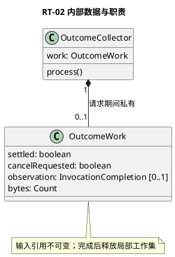
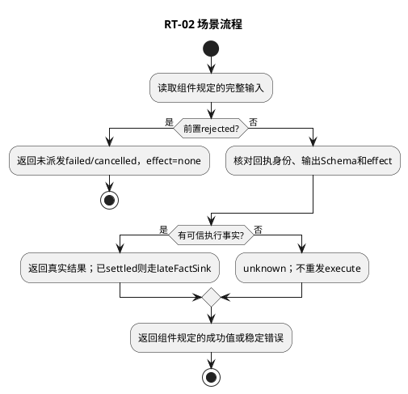

# RT-02 结果与取消处理

## 1. 功能目标与场景

L1需要可采纳的工具结果并保留模型调用因果。取消或输出错误不能掩盖已发生的副作用，主返回只能一次；L3不保存结果账本。

规范依赖仅为[所属组件设计](../../../tool-call-runtime.md)§2交互标准；遵循组件的实例、调用前提、错误与版本约束。下列S1等场景分支先定义业务预期，再推导工作数据及测试，不新增服务或聚合。

## 2. 字段级内部数据与流转

OutcomeWork={commandId:Ref,settled:boolean,cancelRequested:boolean,observation:InvocationCompletion|null,bytes:Count}。bytes累计已验证输出字节≤请求limits.outputBytes；settled只在主Promise完成时从false到true；cancelRequested单向false→true；observation按组件封闭联合，前置拒绝没有locator。取消回调只改私有标志并通知L4，finally取消订阅。

组件交互包作为不可变输入，域内工作对象不向其他域泄漏。引用类型由组件绑定契约定义；丢字段、错误联合变体、错身份及超界输入必须拒绝，不能填默认值凑齐。域内数据不持久化，外部引用生命周期按组件约束；本域没有独立数据库或Schema迁移。

## 3. 算法与场景分支

静态normalizers按rejected/observed/disconnected分派。rejected产生failed或cancelled、none、无locator；disconnected产生unknown。observed先核对command/operationKey/route，再核对Artifact字节、digest及outputSchema；工具业务failed与effect分开。错误输出不能抹去可信applied：保留effect并返回failed；效果无证据统一unknown。主deadline先到则返回unknown；后来的可信结果经lateFactSink交宿主，不覆盖主返回。inspect只代理原locator；unsupported返回unknown，cancel requested不当作stopped。

下图覆盖本域表中正常、拒绝及依赖失败分支；具体字段组合和观察点在§5逐项列出。每次调用有限遍历一个有界集合或执行一条有界Port链，无后台循环。

## 4. 扩展与局部SFMEA

新增标准结果变体先改组件InvocationCompletion与BND联合再加normalizer和穷尽测试；Provider原生错误分类仍留L4。

L3-RT-02-FM-01：取消回执当作回滚或丢失proposal/modelCall身份→错转录或重复动作；分离效果字段、封闭结果校验、主返回一次控制。影响高（错误业务采纳）；交C06维护核对，不构造本地恢复状态机。 对应§5全部相关错误分支。检测靠字段/引用检查、Port调用计数和消费者输出断言；O/D无运行统计不赋值，不编造RPN。普通观测仅code/phase/计数，禁止参数、Secret和Permit正文。

## 5. 场景到测试的双向映射

| 场景/业务目标 | 固定前置与输入/注入 | 独立期望与禁止行为 | 测试ID/层级 | 状态 |
|---|---|---|---|---|
| RT-02-S1 正常/业务失败 | 成功输出；另一组failed+applied | 保留结构化Artifact和modelCallId；failed仍applied | L3-RT-02-UT-01/DT-01 | 已定义/未实现未运行 |
| RT-02-S2 丢响应/错身份 | disconnected；reply.commandId=c2而请求c1 | unknown，不能none或成功 | L3-RT-02-UT-02 | 已定义/未实现未运行 |
| RT-02-S3 大小/Schema | 输出L-1/L/L+1；不满足outputSchema | L内可用；超限/Schema错稳定失败，effect不丢 | L3-RT-02-UT-03 | 已定义/未实现未运行 |
| RT-02-S4 取消/迟到 | 先abort后applied成功；先deadline后成功 | 在截止内保留真实结果；截止后主unknown且lateFact一次 | L3-RT-02-DT-02 | 已定义/未实现未运行 |
| RT-02-S5 查询取消 | querySupported=false；cancel返回requested | unknown查询；不宣称stopped/撤销 | L3-RT-02-Contract-01 | 已定义/未实现未运行 |

UT检验纯规则和数据不变量；DT检验本组件内协作；Contract检验Port字段与错误；Integration为跨组件且必须注明替身。Fake Clock/Store/Schema/安全端/L4按场景注入，不使用付费API。主返回次数、工具执行次数和输出内容以测试预置常量断言，不用被测算法生成期望。真实持久化和失联接管属于层级外部约束验收，不要求本域实现数据库以满足测试。

升级随所属组件契约版本，新增必填字段先更新生产者再更新消费者；未知版本拒绝。代码实现建议按此功能职责归入src/tools，具体文件拆分不改变域间标准。本轮仅完成设计，未创建源码或执行测试。
