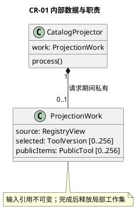
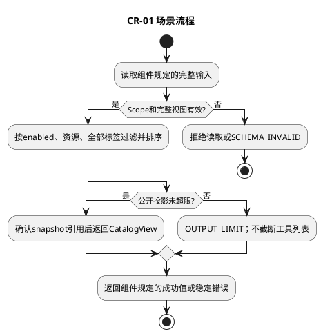

# CR-01 可见目录投影

## 1. 功能目标与场景

L1为一次模型调用准备其可用工具列表。Registry可以有多个版本，模型必须看见明确身份，不能收到路由地址或Secret。Scope为空时合法返回空目录。

规范依赖仅为[所属组件设计](../../../tool-catalog-router.md)§2交互标准；遵循组件的实例、调用前提、错误与版本约束。下列S1等场景分支先定义业务预期，再推导工作数据及测试，不新增服务或聚合。

## 2. 字段级内部数据与流转

ProjectionWork={source:RegistryView,allowed:Set<Ref>,requiredTags:Set<string>,selected:ToolVersion[],publicItems:PublicTool[]}。source是一次完整只读快照；两个Set由CatalogRequest去重构造；selected/publicItems顺序一一对应且≤256。publicItems仅包含组件白名单字段。无共享缓存，请求完成销毁Set，返回值深冻结。

组件交互包作为不可变输入，域内工作对象不向其他域泄漏。引用类型由组件绑定契约定义；丢字段、错误联合变体、错身份及超界输入必须拒绝，不能填默认值凑齐。域内数据不持久化，外部引用生命周期按组件约束；本域没有独立数据库或Schema迁移。

## 3. 算法与场景分支

验证可信scope与RegistryView完整性，建立key→Availability索引（重复/缺状态拒绝）。遍历固定source：只保留enabled、resourceScopeRef在allowed中且含全部requiredTags的工具；精确资源子集判定由可信资源Port提供，不能用字符串前缀猜路径。按toolId/version排序，构造PublicTool白名单，检查序列化1MiB；空集仍合法。SnapshotPort发布确认后返回catalogRef，失败不返回带虚假引用的目录。

下图覆盖本域表中正常、拒绝及依赖失败分支；具体字段组合和观察点在§5逐项列出。每次调用有限遍历一个有界集合或执行一条有界Port链，无后台循环。

## 4. 扩展与局部SFMEA

新增受控标签过滤只修改CatalogRequest解释和此域谓词，不改Registry定义发布或Runtime。共享资源判断通过Port复用。

L3-CR-01-FM-01：直接序列化内部定义→模型获得内部目标；白名单投影与泄漏字段断言阻断，影响高（边界信息暴露）。Snapshot发布失败重取由调用方处理，不输出未确认引用。 对应§5全部相关错误分支。检测靠字段/引用检查、Port调用计数和消费者输出断言；O/D无运行统计不赋值，不编造RPN。普通观测仅code/phase/计数，禁止参数、Secret和Permit正文。

## 5. 场景到测试的双向映射

| 场景/业务目标 | 固定前置与输入/注入 | 独立期望与禁止行为 | 测试ID/层级 | 状态 |
|---|---|---|---|---|
| CR-01-S1 过滤 | read/write均启用，allowed仅read资源 | 仅read；无routeRef/adapterBindingRef | L3-CR-01-UT-01/DT-01 | 已定义/未实现未运行 |
| CR-01-S2 空集和版本 | allowed=[]；另组read v1/v2均有效 | 空items合法；第二组按version升序且身份不合并 | L3-CR-01-UT-02 | 已定义/未实现未运行 |
| CR-01-S3 数据/发布失败 | 缺状态、重复key、序列化超过1MiB、发布失败 | 拒绝，不返回部分列表或伪造catalogRef | L3-CR-01-UT-03/Contract-01 | 已定义/未实现未运行 |

UT检验纯规则和数据不变量；DT检验本组件内协作；Contract检验Port字段与错误；Integration为跨组件且必须注明替身。Fake Clock/Store/Schema/安全端/L4按场景注入，不使用付费API。主返回次数、工具执行次数和输出内容以测试预置常量断言，不用被测算法生成期望。真实持久化和失联接管属于层级外部约束验收，不要求本域实现数据库以满足测试。

升级随所属组件契约版本，新增必填字段先更新生产者再更新消费者；未知版本拒绝。代码实现建议按此功能职责归入src/tools，具体文件拆分不改变域间标准。本轮仅完成设计，未创建源码或执行测试。
