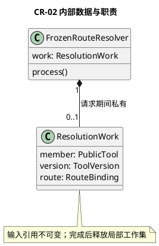
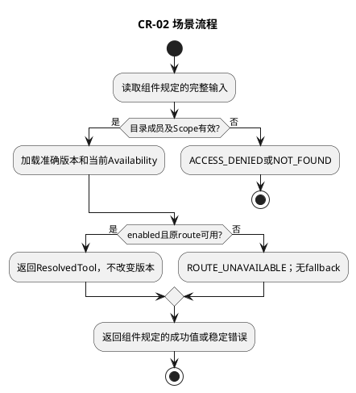

# CR-02 固定路由解析

## 1. 功能目标与场景

Runtime执行模型选中的原目录成员。新版本发布、工具停用、原路由不可用是三个独立条件；新版本不影响旧选定版本，停用或原路由不可用必须拒绝。

规范依赖仅为[所属组件设计](../../../tool-catalog-router.md)§2交互标准；遵循组件的实例、调用前提、错误与版本约束。下列S1等场景分支先定义业务预期，再推导工作数据及测试，不新增服务或聚合。

## 2. 字段级内部数据与流转

ResolutionWork={catalog:CatalogView,member:PublicTool,version:ToolVersion,availability:Availability,route:RouteBinding}。五项均必填；member必须来自catalog.items且descriptorRef匹配，version.key必须等于member.toolId/version，availability.key同version.key，route.routeRef同definition.routeRef。只读输入，不产生或覆盖路由。

组件交互包作为不可变输入，域内工作对象不向其他域泄漏。引用类型由组件绑定契约定义；丢字段、错误联合变体、错身份及超界输入必须拒绝，不能填默认值凑齐。域内数据不持久化，外部引用生命周期按组件约束；本域没有独立数据库或Schema迁移。

## 3. 算法与场景分支

先用TrustedScope确认CatalogView来源/完整性及访问权，再精确找descriptorRef；缺失NOT_FOUND。加载该ToolVersion和当前Availability，核对公开字段与原定义对应，非enabled返回ROUTE_UNAVAILABLE。读取原routeRef版本绑定并验证资源及Adapter能力，失效拒绝；不查询同名latest，不做健康优选。输出ResolvedTool仅供Guard和调用计划使用。

下图覆盖本域表中正常、拒绝及依赖失败分支；具体字段组合和观察点在§5逐项列出。每次调用有限遍历一个有界集合或执行一条有界Port链，无后台循环。

## 4. 扩展与局部SFMEA

新增L4 Provider只注册新route，解析算法无需修改。新增route.kind必须与BND协议及Runtime执行表联合评审。

L3-CR-02-FM-01：按名称回退latest→授权与实际目标不一致；逐字段身份链核验和无fallback阻断，影响高（错目标执行）。修复原路由或由L1重新提案，不静默恢复执行。 对应§5全部相关错误分支。检测靠字段/引用检查、Port调用计数和消费者输出断言；O/D无运行统计不赋值，不编造RPN。普通观测仅code/phase/计数，禁止参数、Secret和Permit正文。

## 5. 场景到测试的双向映射

| 场景/业务目标 | 固定前置与输入/注入 | 独立期望与禁止行为 | 测试ID/层级 | 状态 |
|---|---|---|---|---|
| CR-02-S1 固定版本 | catalog含v1，Registry后来发布v2 | 解析仍v1和原route | L3-CR-02-UT-01 | 已定义/未实现未运行 |
| CR-02-S2 停用/失效 | v1禁用；另组route不可用 | 两组均拒绝，禁止改用v2 | L3-CR-02-DT-01 | 已定义/未实现未运行 |
| CR-02-S3 伪造/错配 | 跨Scope目录、member指向另一版本 | 拒绝，Guard/L4调用0 | L3-CR-02-UT-02/Contract-01 | 已定义/未实现未运行 |

UT检验纯规则和数据不变量；DT检验本组件内协作；Contract检验Port字段与错误；Integration为跨组件且必须注明替身。Fake Clock/Store/Schema/安全端/L4按场景注入，不使用付费API。主返回次数、工具执行次数和输出内容以测试预置常量断言，不用被测算法生成期望。真实持久化和失联接管属于层级外部约束验收，不要求本域实现数据库以满足测试。

升级随所属组件契约版本，新增必填字段先更新生产者再更新消费者；未知版本拒绝。代码实现建议按此功能职责归入src/tools，具体文件拆分不改变域间标准。本轮仅完成设计，未创建源码或执行测试。
