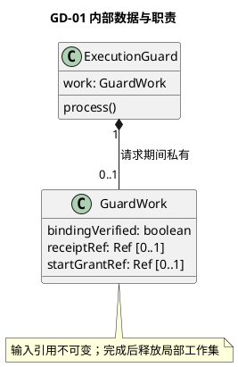
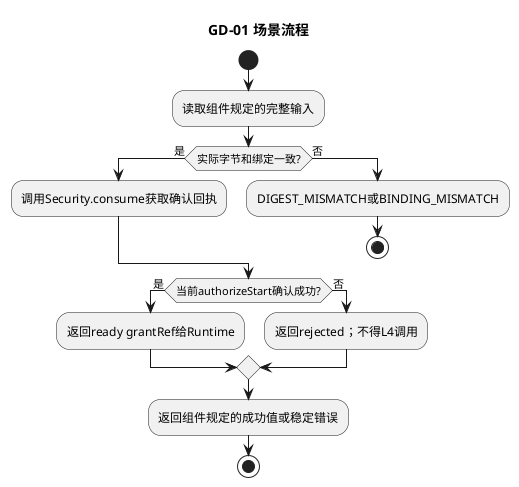

# GD-01 执行授权检查

## 1. 功能目标与场景

Runtime已经得到原工具、实际参数和L1签发的Permit，需要在真实调用前确认相同动作仍获授权。Guard不处理Ask等待或新授权签发。

规范依赖仅为[所属组件设计](../../../tool-execution-guard.md)§2交互标准；遵循组件的实例、调用前提、错误与版本约束。下列S1等场景分支先定义业务预期，再推导工作数据及测试，不新增服务或聚合。

## 2. 字段级内部数据与流转

GuardWork={request:GuardRequest,bindingVerified:boolean,receiptRef:Ref|null,startGrantRef:Ref|null}。初始false/null/null；绑定核验后才允许消费；receipt只来自Security确认，grant只来自authorizeStart确认。所有身份来自request及可信上下文，不能用本地默认claim/epoch补缺项。请求结束销毁，成功不缓存供下一命令使用。

组件交互包作为不可变输入，域内工作对象不向其他域泄漏。引用类型由组件绑定契约定义；丢字段、错误联合变体、错身份及超界输入必须拒绝，不能填默认值凑齐。域内数据不持久化，外部引用生命周期按组件约束；本域没有独立数据库或Schema迁移。

## 3. 算法与场景分支

受控读取并复算参数/描述摘要，读取request.target.resourceProfileRef并验证digest/bytes；比较完整target与原SecurityBinding.targetDigest，以及固定proposal/route/limits/scope/deadline，失败直接rejected。调用Security consume，必要审计未确认不取得可用receipt；随后authorizeStart使用同command和当前claim/executor，失效/取消/时钟异常拒绝。返回ready的grant引用由Runtime装入原计划，Guard没有L4依赖。Security私有事务、Permit消费去重及原子启动保证按C03，不在本域编写另一个账本。

下图覆盖本域表中正常、拒绝及依赖失败分支；具体字段组合和观察点在§5逐项列出。每次调用有限遍历一个有界集合或执行一条有界Port链，无后台循环。

## 4. 扩展与局部SFMEA

新增安全动作不在工具Guard内增加PDP规则；Security Port变化先更新组件GuardRequest标准，再调整适配和契约测试。

L3-GD-01-FM-01：缓存旧grant或省略执行绑定→失效授权被复用；完整绑定和当前Security检查阻断，影响高（权限旁路）。服务失败关闭，恢复由调用方与Security处理，不自行放宽。 对应§5全部相关错误分支。检测靠字段/引用检查、Port调用计数和消费者输出断言；O/D无运行统计不赋值，不编造RPN。普通观测仅code/phase/计数，禁止参数、Secret和Permit正文。

## 5. 场景到测试的双向映射

| 场景/业务目标 | 固定前置与输入/注入 | 独立期望与禁止行为 | 测试ID/层级 | 状态 |
|---|---|---|---|---|
| GD-01-S1 合法输入 | c1、绑定原参数、有效Permit和当前claim | consume→authorizeStart各一次，ready给原executor | L3-GD-01-DT-01 | 已定义/未实现未运行 |
| GD-01-S2 字段错配 | 一字节变化；route改变；profile一字节变化；limits与target不等；缺claim分别注入 | 拒绝；consume=0；不制造默认字段 | L3-GD-01-UT-01 | 已定义/未实现未运行 |
| GD-01-S3 服务/时效 | consume已确认，authorizeStart过期或审计未确认 | 拒绝，L4=0；不缓存旧success | L3-GD-01-Contract-01 | 已定义/未实现未运行 |
| GD-01-S4 旧身份 | 同receipt给另一command/executor | 拒绝；Security字段完整透传 | L3-GD-01-DT-02 | 已定义/未实现未运行 |

UT检验纯规则和数据不变量；DT检验本组件内协作；Contract检验Port字段与错误；Integration为跨组件且必须注明替身。Fake Clock/Store/Schema/安全端/L4按场景注入，不使用付费API。主返回次数、工具执行次数和输出内容以测试预置常量断言，不用被测算法生成期望。真实持久化和失联接管属于层级外部约束验收，不要求本域实现数据库以满足测试。

升级随所属组件契约版本，新增必填字段先更新生产者再更新消费者；未知版本拒绝。代码实现建议按此功能职责归入src/tools，具体文件拆分不改变域间标准。本轮仅完成设计，未创建源码或执行测试。
