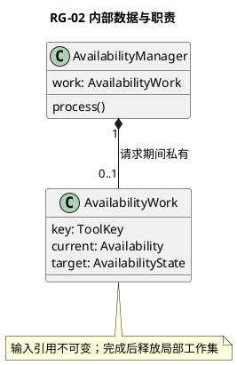
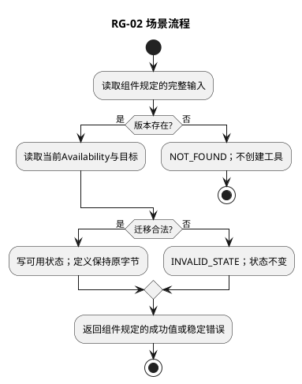

# RG-02 可用状态管理

## 1. 功能目标与场景

管理员启用已注册工具，或停用/退役有问题的版本。前置为原版本存在及管理权限；操作针对确定toolId/version，不是全局按名称模糊启停。

规范依赖仅为[所属组件设计](../../../tool-registry.md)§2交互标准；遵循组件的实例、调用前提、错误与版本约束。下列S1等场景分支先定义业务预期，再推导工作数据及测试，不新增服务或聚合。

## 2. 字段级内部数据与流转

AvailabilityWork={key:ToolKey,current:Availability,target:enabled|disabled|retired,changed:boolean}。key与current.key必须相等；target来自StateChange；changed由当前状态比较产生。全部必填无null，单请求私有；不复制ToolDefinition正文，不持有运行中调用。

组件交互包作为不可变输入，域内工作对象不向其他域泄漏。引用类型由组件绑定契约定义；丢字段、错误联合变体、错身份及超界输入必须拒绝，不能填默认值凑齐。域内数据不持久化，外部引用生命周期按组件约束；本域没有独立数据库或Schema迁移。

## 3. 算法与场景分支

读取原ToolVersion和Availability；缺失NOT_FOUND。按组件3×3封闭表选动作：同状态返回原值；retired到其他值拒绝；其余提交单个Availability。得到完整RegistryView才释放查询结果。停用不删除定义、不改变旧CatalogView、不主动杀进程；后续解析读取当前状态拒绝新派发，严格在途阻断走Security撤销和L1取消。

下图覆盖本域表中正常、拒绝及依赖失败分支；具体字段组合和观察点在§5逐项列出。每次调用有限遍历一个有界集合或执行一条有界Port链，无后台循环。

## 4. 扩展与局部SFMEA

新增quarantined需先更新组件状态表、查询/解析可见性语义及全部状态组合测试，不能用额外布尔标记绕开表。

L3-RG-02-FM-01：把停用实现为删除定义→旧结果和目录引用悬空；只更新状态，历史保留由C04；影响中（不可恢复说明），状态视图读取失败直接拒绝新解析。 对应§5全部相关错误分支。检测靠字段/引用检查、Port调用计数和消费者输出断言；O/D无运行统计不赋值，不编造RPN。普通观测仅code/phase/计数，禁止参数、Secret和Permit正文。

## 5. 场景到测试的双向映射

| 场景/业务目标 | 固定前置与输入/注入 | 独立期望与禁止行为 | 测试ID/层级 | 状态 |
|---|---|---|---|---|
| RG-02-S1 启停 | disabled v1→enabled→disabled | 目录先出现后消失；定义引用保持相同 | L3-RG-02-UT-01/DT-01 | 已定义/未实现未运行 |
| RG-02-S2 退役 | enabled→retired，再尝试enabled | 退役后查询定义成功、再启用拒绝 | L3-RG-02-UT-02 | 已定义/未实现未运行 |
| RG-02-S3 无效/重复 | 未知key与retired→retired | 未知key拒绝；同状态不写入 | L3-RG-02-UT-03 | 已定义/未实现未运行 |
| RG-02-S4 旧目录 | 生成v1目录后禁用v1，再resolve | 原目录可读但执行解析拒绝；L4=0 | L3-RG-02-Integration-01 | 已定义/未实现未运行 |

UT检验纯规则和数据不变量；DT检验本组件内协作；Contract检验Port字段与错误；Integration为跨组件且必须注明替身。Fake Clock/Store/Schema/安全端/L4按场景注入，不使用付费API。主返回次数、工具执行次数和输出内容以测试预置常量断言，不用被测算法生成期望。真实持久化和失联接管属于层级外部约束验收，不要求本域实现数据库以满足测试。

升级随所属组件契约版本，新增必填字段先更新生产者再更新消费者；未知版本拒绝。代码实现建议按此功能职责归入src/tools，具体文件拆分不改变域间标准。本轮仅完成设计，未创建源码或执行测试。
