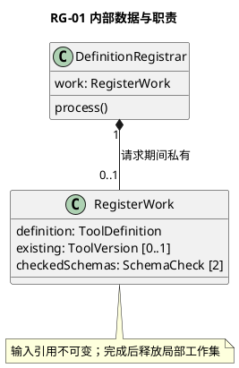
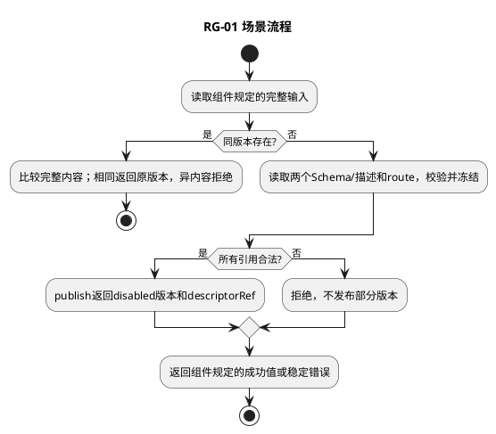

# RG-01 定义注册与版本

## 1. 功能目标与场景

管理员需要把readFile v1注册成可被其他组件理解的工具，而非仅提供一个函数。前置为受信管理权限、完整定义、已发布的输入/输出Schema和注册的L4绑定。相同版本不得悄悄改变执行目标。

规范依赖仅为[所属组件设计](../../../tool-registry.md)§2交互标准；遵循组件的实例、调用前提、错误与版本约束。下列S1等场景分支先定义业务预期，再推导工作数据及测试，不新增服务或聚合。

## 2. 字段级内部数据与流转

RegisterWork={definition:ToolDefinition, existing:ToolVersion|null, checkedSchemas:SchemaCheck[2], route:RouteBinding}; SchemaCheck={role:input|output,ref:Artifact,valid:boolean}。definition从RegisterInput复制，existing由RegistryStore准确key查询；checkedSchemas必须恰好input/output各一且ref与definition相同；route必须与routeRef对应。工作集请求结束销毁，existing和route只读。

组件交互包作为不可变输入，域内工作对象不向其他域泄漏。引用类型由组件绑定契约定义；丢字段、错误联合变体、错身份及超界输入必须拒绝，不能填默认值凑齐。域内数据不持久化，外部引用生命周期按组件约束；本域没有独立数据库或Schema迁移。

## 3. 算法与场景分支

先验证管理Scope和条目/字段上限，再按toolId/version查已有定义。已有同内容返回原ToolVersion，异内容VERSION_CONFLICT；不重置Availability。首次注册并行读取两个Schema及描述，引用缺失/非Schema/远程引用均拒绝；查route.kind及资源匹配，冻结完整ToolDefinition，通过RegistryStore.publish返回真实descriptorRef和初始disabled。输出中不得返回私有Schema编译器或Provider实例。发布确认不明返回依赖错误，由外部C04查询，不自动覆盖。

下图覆盖本域表中正常、拒绝及依赖失败分支；具体字段组合和观察点在§5逐项列出。每次调用有限遍历一个有界集合或执行一条有界Port链，无后台循环。

## 4. 扩展与局部SFMEA

新增pdf.extract v1只提供新定义、Schema与已注册Adapter绑定；注册器算法不改。UT检验两Schema角色恰好一次和传入对象修改不影响输出。

L3-RG-01-FM-01：定义缺输出Schema或同版本覆盖→下游无法校验结果或执行目标漂移；完整字段/引用/唯一版本检查在发布前拒绝，影响高（可能错执行），修正定义后以新版本提交。 对应§5全部相关错误分支。检测靠字段/引用检查、Port调用计数和消费者输出断言；O/D无运行统计不赋值，不编造RPN。普通观测仅code/phase/计数，禁止参数、Secret和Permit正文。

## 5. 场景到测试的双向映射

| 场景/业务目标 | 固定前置与输入/注入 | 独立期望与禁止行为 | 测试ID/层级 | 状态 |
|---|---|---|---|---|
| RG-01-S1 首次注册 | readFile v1；input/output两个有效Schema | 发布一次，返回disabled；Router尚不可见 | L3-RG-01-UT-01/DT-01 | 已定义/未实现未运行 |
| RG-01-S2 重复/异内容 | 已有v1 enabled；重复原定义，再改变routeRef | 同内容保留enabled；异内容VERSION_CONFLICT且发布0 | L3-RG-01-UT-02 | 已定义/未实现未运行 |
| RG-01-S3 依赖/字段失败 | 缺outputSchemaRef、悬空Artifact、远程$ref各一组 | SCHEMA_INVALID或依赖错误，无部分注册 | L3-RG-01-UT-03/Contract-01 | 已定义/未实现未运行 |

UT检验纯规则和数据不变量；DT检验本组件内协作；Contract检验Port字段与错误；Integration为跨组件且必须注明替身。Fake Clock/Store/Schema/安全端/L4按场景注入，不使用付费API。主返回次数、工具执行次数和输出内容以测试预置常量断言，不用被测算法生成期望。真实持久化和失联接管属于层级外部约束验收，不要求本域实现数据库以满足测试。

升级随所属组件契约版本，新增必填字段先更新生产者再更新消费者；未知版本拒绝。代码实现建议按此功能职责归入src/tools，具体文件拆分不改变域间标准。本轮仅完成设计，未创建源码或执行测试。
