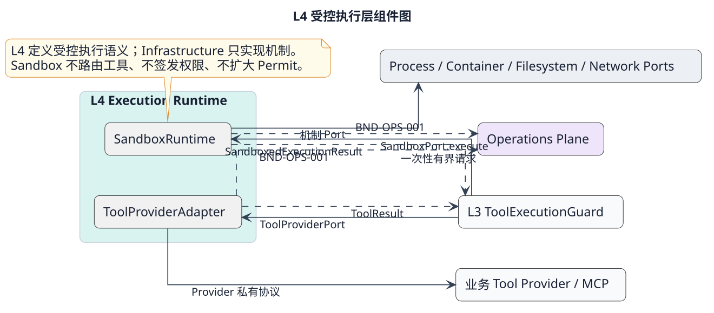

# L4 Execution Runtime 层设计

状态：L4-DD-1 候选细化，2026-09-09。本轮覆盖两个内部组件；实际容器、网络、存储、远程 Provider 产品仍是外部依赖。内部设计保持候选；L3→L4公共协议与Schema已按L34-SPEC-1.0.0基线，未启动运行实现或生产部署。

[PlantUML 源](../../diagrams/layers/05-l4-execution-runtime-components.puml)

## 1. 职责和外部调用场景

L4 把 L3 已授权且冻结的动作变成一次有界物理执行，并返回可核对的执行证据。L3 拥有工具调用功能、目录与路由，ToolCall 独立事实由 L1/宿主保存，Security 拥有 Permit，L4 不重新裁决权限、不改变目标、不重放动作。L1/L2 不直接调用 L4。

例：远程工具已创建文档，但响应丢失。L4 返回 unknown 效果并保留原 operationKey；L3 查询原操作。不能因超时再次创建文档。另例：沙箱结果已保存，但挂载卸载失败。保留结果事实，同时隔离遗留资源并报告回收待处理；不能把两件事合并成“执行失败，可重试”。

| 场景 | 触发、正常结果 | 必须走读的分支 | 责任组件 |
|---|---|---|---|
| L4-S01 | L3 调用冻结版本的远程工具，结果 Artifact 返回 L3 | 发送前失败；发送后断线；业务失败但已经生效 | Provider |
| L4-S02 | L3 调用受信进程内只读工具 | 不配合取消；输入越界；输出超限 | Provider |
| L4-S03 | L3 执行一次不可信本地转换任务 | 能力不支持；创建部分成功；限额未落实；正常退出 | Sandbox |
| L4-S04 | 用户取消或 Deadline 到期 | 启动前取消；运行时停止；取消与成功竞态 | 两者 |
| L4-S05 | 进程退出、响应丢失后查询原操作 | 查询无能力/无记录/失联；迟到可信结果 | 两者 |
| L4-S06 | Sandbox 清理执行树和临时资源 | 输出已发布后回收失败；宿主重启；重复清理 | Sandbox |
| L4-S07 | 恶意或损坏输入、输出及协议 | 半帧、超长帧、伪造终帧、stdout 注入、超额 Artifact | 两者 |
| L4-S08 | 路由版本更新或容量耗尽 | 旧调用仍绑定旧版本；无空槽立即拒绝 | 两者 |

有效组合：S03+S04+S06（启动后取消且清理失败）；S01+S05（请求已生效且无查询能力）；S07+S04（超额后又收到成功帧）。不支持环境跨 ToolCall 复用、远端自动故障转移和无界后台执行。

## 2. 组件和功能域

| 组件 | 唯一职责与内部划分 | 权威设计 | 细化导航 |
|---|---|---|---|
| ToolProviderAdapter | 请求绑定与单次调用；结果证据与核对 | [组件](components/tool-provider-adapter.md) | [功能域索引](components/tool-provider-adapter/README.md) |
| SandboxRuntime | 环境准备与受限运行；结果收集与回收 | [组件](components/sandbox-runtime.md) | [功能域索引](components/sandbox-runtime/README.md) |

这些域不是新增服务。Composition Root 按 scope、不可变 adapterBindingRef 和版本装配组件实例；每个 operation 使用独立上下文。跨 operation 可并行，同一 operation 的本地回调串行归约。L1/宿主按 L3-C01 保证单次派发资格；L4 不另外实现 Run 调度、分布式 Lease 或 Permit 消费账本。

## 3. 控制流、数据流及权威

`L1/PEP → L3 Runtime/Guard → ToolProviderPort 或 SandboxPort → 机制 Port/外部执行器`。

1. L3 冻结目录、参数 Artifact、路由、授权绑定，经 Guard 消费 Permit 并确认当前启动资格；只有本次有效调用进入 L4。
2. L4 校验受控通道与绑定完整性，检查剩余时间及可落实的能力。无法证明限制可落实时执行数为零。
3. Provider 单次发送；Sandbox 先建立无工作负载的环境、落实限制，再启动工作负载。
4. L4 有界收集、校验并发布 Artifact，保留机制证据；Sandbox 始终执行清理。
5. L3 校验 L4Reply 并返回 ToolOutcome；L1/宿主保存工具事实后发布事件，L4 响应成功不代表 L1 已采纳。

| 数据 | 唯一所有者 | L4 访问方式 |
|---|---|---|
| ToolCall 逻辑事实、执行资格、取消意图、业务结果采纳 | L1/宿主可靠性边界 | 不访问其 Repository；只返回证据 |
| Permit、StartGrant、策略与授权 epoch | Security | 仅接收 L3 核验后的不透明绑定；不读取/消费 Permit |
| 物理进程、网络、挂载、Secret Lease、清理事实 | Infrastructure | 经作用域化机制 Port；句柄不跨边界输出 |
| Provider 私有请求映射 | Provider Adapter 私有机制存储 | 用 scope+operationKey 定位，不保存第二套 ToolCall |
| 结果内容 | Artifact Storage | 先有界发布，后输出引用；未确认引用仍保留 |

## 4. 契约与故障隔离

[L4-DD-1](../../contracts/l4-execution-runtime-detail.md)定义本轮新增的解析后限制、机制状态及证据映射。ExecutionPlan/L4Reply/L4Query/L4Cancel 的字段唯一引用 BND-L34，L3-FD-2 提供调用方档案。旧[依赖要求](kernel-dependencies.md)是早期调用方规格，不能与新版拼接成实现接口。

同进程只允许受信、经评审、协作取消的只读实现，不能提供任意第三方代码的 CPU/内存强隔离。要求硬终止或 OS 隔离的调用必须走经验证的 Sandbox 档案。无隔离能力时拒绝，不回退宿主 Shell。

执行终态、副作用效果、资源回收分别记录。unknown 不自动变为 none；stopped 不等于回滚；回收失败不覆盖已确认结果。Artifact 总量、业务 stdout/stderr、协议帧和内部队列分别受限；把内容转为 Artifact 不绕过结果限额。

## 5. 容量、扩展及交付门槛

沿用上游设计上限：单次工具 60 秒且可缩短，参数 64 KiB，结果总计 256 KiB，执行重试 0。Sandbox CPU/内存/pids/磁盘上限要求显式输入，不发明默认值；并发容量和清理容量由部署档案显式配置，不足时拒绝新工作，清理保留独立容量。以上是目标，未做实测。

新增 Provider 通过 adapterBindingRef 注册私有协议实现；新增隔离后端通过 Process/Container 能力档案实现。两者都不得修改 L3 权限规则或选择最新路由。新增第三种执行语义需要更新 L3 RouteBinding 封闭联合与契约。

[验证与场景用例](../../../verification/l4-execution-runtime.md)；[本轮评审、实现差异和阻塞项](../../../governance/reviews/l4-detail-2026-09-09.md)。B1资源绑定、B3控制帧及B2/B4交接接口已由[BND-L34](../../contracts/bnd-l34-001.md)规范基线关闭，可据规范开发连接器及两侧适配。B2/B4真实持久保存/证据保留、B3隔离能力仍是运行验收条件；本次不把整层实现标为完成。
