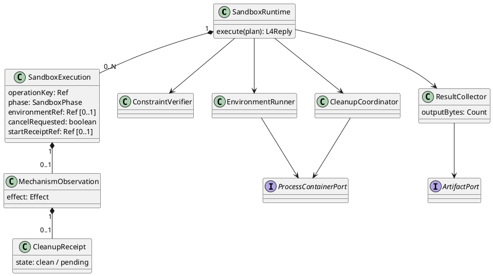

# SandboxRuntime 组件详细设计

状态：L4-DD-1 候选。父约束见 [L4 层](../README.md)，共享字段见 [L4-DD-1](../../../contracts/l4-execution-runtime-detail.md)。一次 execute 只执行一个已授权动作；环境不跨 ToolCall 复用，不是 AgentSession、多轮工作区或调度服务。

## 1. 场景和适用约束

覆盖 L4-S03..S08。例：一次文档转换创建隔离环境，设置输入只读挂载、scratch 配额及禁网，启动工作负载，发布结果后回收。若结果完整但执行树尚未全部退出，则保留结果和清理 pending，不能报告资源已释放。

L3 提供冻结参数与限额，Process/Container 提供经验证的物理能力。Sandbox 负责把要求按顺序落实，不实现容器、文件系统或网络隔离产品。单 operation 一个上下文；回调串行归约，机制持久化版本用于防重复 start/cleanup。未知创建结果不能再次创建。拒绝无 CPU/内存/pids/磁盘/网络强制限额的“不可信执行”档案。

## 2. 内部结构与跨域数据

| 域 | 协作者与责任 | 输入→输出及先后 |
|---|---|---|
| 环境准备与运行 | ConstraintVerifier、EnvironmentRunner | PreparedExecution→限制回执→工作负载启动回执/有界流 |
| 收集与回收 | ResultCollector、CleanupCoordinator | 流/退出观察→MechanismObservation + CleanupReceipt |

跨域标准：PreparedExecution、UsageSummary、MechanismObservation、CleanupReceipt 由 L4-DD-1 定义。机制 EnvironmentHandle 仅在同 scope 受控 Port 内流转，不返回 L3。两个域共用以下 SandboxExecution 内存结构：

```text
SandboxExecution = {
  operationKey: Ref, prepared: PreparedExecution,
  environmentRef: Ref|null,
  phase: preparing|limited|running|collecting|reclaiming|done|reclaim_pending,
  cancelRequested: boolean, startReceiptRef: Ref|null,
  observation: MechanismObservation|null
}
```

environmentRef 在创建回执确认后填入；未知句柄仍按 operationKey 清理。phase=limited 要求全部限制已落实，running 要求 startReceiptRef；取消不能把实际 running 倒退 limited。observation 可先于 cleanup 产生，执行效果不可被清理结果覆盖。所有数组和 PreparedExecution 不可变，不以指针共享可变授权内容。



## 3. 状态与算法

| 原阶段+输入 | 守卫/动作 | 下一阶段 |
|---|---|---|
| preparing+准备完成 | 能力覆盖全部限额、隔离环境已建、无工作负载启动；保存限制回执 | limited |
| preparing+失败/取消 | 记录 none 仅限确定未启动；部分环境仍清理 | reclaiming |
| limited+启动 | 未取消、Deadline 有余量、所有限制确认；一次 start | running |
| limited+取消/启动结果不明 | 不再 start；按原 operationKey 核对/停止 | reclaiming |
| running+可信终帧/退出 | 收集完整结果；终帧不替代执行树退出 | collecting |
| running+取消/超限/失联 | 阻止新出口/子进程；停止执行树；效果未知保留 unknown | reclaiming |
| collecting+完成/失败 | 发布校验后的 Artifact 或保留未知证据 | reclaiming |
| reclaiming+清理确认 | 所有资源和 Lease 撤销且回执耐久 | done |
| reclaiming+失败/超时 | 保留未回收引用与占用、隔离执行组，发信号 | reclaim_pending |
| reclaim_pending+机制清理成功 | 只补清理证据，不再启动、不改执行结果 | done |

迁移由封闭 `(phase,event)` 静态表及独立守卫表达，禁止缺失事件默认启动。重复取消/清理幂等；非法倒退报 INVALID_STATE。running 收到 cancel 与 terminal 的顺序不决定副作用真假；按可信证据归约，旧/异操作帧拒绝，矛盾终帧不覆盖首个证据。

创建流程：先检查档案能力，再登记创建意图并创建带操作标签的空环境；所有挂载、禁网/出口、配额、进程限制、Secret proxy 作用域确认后才允许启动 workloadRef。机制若不能原子隔离后启动，必须提供被暂停的进程或等价启动屏障；普通宿主子进程加 AbortSignal 不满足。

CPU 用量、pids、磁盘和内存由机制强制限制；Clock 负责可信绝对 Deadline 转单调计时。取消先禁止新增能力，再终止整个执行组。安全清理有独立、显式有限预算，不使用已经 abort 的工作信号；超过预算转 pending，由 Infrastructure 有界清理器接续。L4 不创建长期恢复调度器。

## 4. 协议与结果规则

本地 supervisor stdout 专供已协商版本的 JSONL；工作负载 stdout/stderr 由独立管道捕获，由supervisor有界收集为结果Artifact；不能让工作负载写控制终帧。stderr 的业务内容不是自动可信日志，必须计入输出并按敏感数据规则处理。

L34-SPEC-1.0.0已冻结控制JSONL的握手、10种帧、session/request/seq、限额和终帧唯一性，见[BND-L34](../../../contracts/bnd-l34-001.md)§6—7及机器Schema。工作负载原始输出不采用该控制协议；完成由受信supervisor结合退出、完整输出及机制证据确认。分块 UTF-8 解码且在分配前检查字节；队列满时暂停读取，有背压超时则终止。未知版本、半帧 EOF、序号冲突、伪终帧、超额一律停止并回收。exit 0 但无完整终帧不能当成功。

ResultCollector 验证结果来源、内容和大小后发布 Artifact；结果与工作 stdout/stderr/附件合计不超过 maxOutputBytes。只能取得部分结果时标记失败或 unknown，不能截断后伪装完整成功。可信无外部副作用的本地纯转换可证 effect=none；允许写授权目标后失败则可能 applied/unknown。

## 5. 回收、SFMEA与扩展

清理顺序：阻断出口与新进程→停止执行组→关闭流→撤销 Secret Lease→卸载及删临时工作目录→释放句柄/容量→保存 CleanupReceipt。某一步失败，继续尝试独立的安全撤销动作；不得因卸载失败跳过 Secret 撤销。创建回执丢失时按标签扫描，禁止只遍历进程内 Map。

| 故障 | 影响和严重度依据 | 检测、控制和恢复 | 测试 |
|---|---|---|---|
| 限额落实前启动 | 不可信代码越界，严重 | 启动屏障及限制回执；拒绝弱档案 | L4-T05/T06 |
| 创建后崩溃无句柄 | 孤儿进程和凭证残留，严重 | 原子标签、耐久创建意图、重启扫描 | L4-T11 |
| 结果覆盖清理错误或反之 | 丢业务事实/泄露资源，严重 | 两份正交证据、待回收容量不释放 | L4-T10 |
| 工作输出注入协议 | 伪造结果或绕过限额，严重 | 独立管道、受信 supervisor、帧边界 | L4-T07 |

O/D 未测量，不生成 RPN。新增 Container/MicroVM 后端只实现 Process/ContainerPort 的能力与回执，不改变上述状态表；新增需要共享长期环境的需求必须上层重审，不能作为后端优化偷偷复用。

## 6. 实现与部署门槛

候选目录 `src/execution/sandbox/`：constraints、lifecycle、collector、cleanup。复用 Infrastructure 的创建/终止/存储/Secret/Artifact 机制，不把 OS 命令写进 Runtime。现有 InProcessReadOnlySandbox 明确不提供 OS 隔离；create/terminate 句柄协议也不是本设计的 execute 入口，迁移需保留受信只读能力并重接到 Provider 路径。

新档案仅在真实环境通过 [L4 验证](../../../../verification/l4-execution-runtime.md) 后接收不可信工作负载。升级前停止新受理、保留旧环境标签/机制账本并确认清理器可读旧版本；不能回滚到会遗忘未回收资源的版本。B1资源绑定与B3控制帧规范已由L34-SPEC-1.0.0冻结；B3真实隔离能力、B4证据持有及Host接入仍待实现验收，不能据文档基线启用生产Sandbox。
